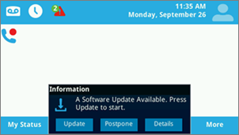
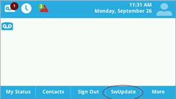
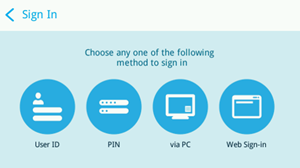
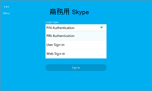
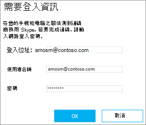

# 部署用商務用 Skype Online 電話

[!INCLUDE [sfbo-retirement](../../../Hub/includes/sfbo-retirement.md)]

此為部署指南，可協助您部署商務用 Skype IP 電話。
  
在所有類型的企業中，擁有電話號碼可讓使用者撥打和接聽語音電話，這是進行商務的重要需求。 擁有電話號碼的使用者可以在所有裝置上撥打語音商務用 Skype IP 電話、電腦和行動裝置。 您可以閱讀取得適用于 商務用 Skype Online 的電話，進一商務用 Skype [IP 電話](getting-phones-for-skype-for-business-online.md)。
  
## IP 電話的部署步驟

### 步驟 1 - 下載製造商的系統管理員指南和電話手冊

在您開始使用之前，建議先下載手機制造商的管理指南和電話使用者手冊。
  
- 針對 Polycom 電話，請參閱 [Poly 文件庫](https://documents.polycom.com/category/voice)。
    
- 針對 Yealink 手機，請參閱[Yealink 商務用 Skype HD SIP 電話解決方案](http://www.yealink.com/products_top_2.html)。
    
- 針對 AudioCodes 手機，請參閱 [音訊代碼資源建構管理指南](https://www.audiocodes.com/solutions-products/products/products-for-microsoft-365/ip-phones-room-solutions)。
    
### 步驟 2 - 確認您購買或移商務用 Skype支援的 IP 電話和固件

線上商務用 Skype支援的電話和商務用 Skype Server也相容，但情況並不一定一樣。 若要確定您購買或置備支援的手機和固件，請參閱取得適用于 商務用 Skype [Online 的手機](getting-phones-for-skype-for-business-online.md)。
  
### 步驟 3 - 檢查已安裝正確的固件，並在需要時更新固件

檢查手機上的固件版本。 適用于：
  
- **Polycom VVX 手機**，請設定  >    >  **狀態平臺**  >  **應用程式**  >  **主**。
    
- **Yealink 手機**，前往 **主電話** 畫面上的狀態。
    
- **音訊代碼手機，****從開始畫面** 前往功能表  >  **裝置**  >  狀態固件版本。
    
    > [!NOTE]
    > 若要遠端存取電話詳細資料，請參閱製造商管理指南。 請參閱上述連結以參閱使用者指南和電話手冊。 
  
- **Lync 電話版本 (LPE**) 手機，從開始畫面系統資訊  >  功能表選項。
    
### 步驟 4 - 裝置更新注意事項

> [!NOTE]
> 5.5.1.X 之前的 Polycom 固件具有製造商專用裝置鎖定機制，由 商務用 Skype"電話-Lock"取代。 使用 "device-Lock" 保護的電話從 5.4.X.X 升級為 5.5.1.X，而使用 "電話-Lock" 不會繼承 「Device-Lock」的 PIN 碼，因為「裝置鎖定」可能會讓電話不安全。 啟用「Device-Lock」的使用者必須啟用下列 Polycom 裝置設定檔參數，讓使用者控制升級時間 (lync.deviceUpdate.popUpSK.enabled=1) 。 
  
固件更新是由服務商務用 Skype管理。 每商務用 Skype驗證電話的固件都會上傳到 商務用 Skype 補救伺服器，而且根據預設，所有手機上都會啟用裝置更新。 根據電話和投票間隔上的非啟用時間，電話會自動下載並安裝最新的認證版本。 您可以使用 [Set-CsIPPhonePolicy](/powershell/module/skype/Set-CsIPPhonePolicy) Cmdlet 將 _EnableDeviceUpdate_ 參數設定為 來停用裝置更新設定 `false` 。
  

  
當新的固件可供使用並準備好下載及安裝時，電話會通知使用者。 Polycom 電話會通知使用者，並提供使用者更新 **或延** 後 **的選項**。
  

  
對於 Polycom 電話，您可以選取 **SwUpdate** 來更新手機上的固件。
  

  
您也可以選擇使用合作夥伴的部署系統管理固件更新。 有關合作夥伴的撥備系統管理 ，包括進位電話自訂，請參閱製造商管理指南。
  
> [!CAUTION]
> 請確定有單一裝置更新授權 (帶內裝置更新或協力廠商) 伺服器，以避免更新迴圈。 
  
### 步驟 5 - 設定與基礎結構電話設定

您可以使用 Cmdlet 的帶內商務用 Skype設定最常用的電話選項Windows PowerShell政策。 請參閱 [Set-CsIPPhonePolicy，](/powershell/module/skype/Set-CsIPPhonePolicy) 瞭解這些參數和設定的詳細資訊。
  
有關網路基礎結構規劃，請參閱[Skype架構](https://www.skypeoperationsframework.com/)。
  
### 步驟 6 - 準備讓使用者進行登錄

若要讓使用者順利登錄線上商務用 Skype電話和撥打電話，您必須確認使用者已指派正確的授權。 您至少需要指派授權電話系統通話方案。 有關其他資訊，請參閱商務用 Skype附加Microsoft Teams授權和指派商務用 Skype Microsoft Teams[授權](../../skype-for-business-and-microsoft-teams-add-on-licensing/assign-skype-for-business-and-microsoft-teams-licenses.md)。
  
您可以閱讀通話和通話方案，[以電話系統通話方案](/microsoftteams/calling-plan-landing-page)
  
- **線上使用者** 可用的登錄選項為：
    
  - 使用 **Polycom VVX 5XX/6XX** 電話的使用者會看到：
    
     
  
  - 使用 **Yealink T48G/T46G** 電話的使用者會看到：
    
     
  
    有關製造商支援的登錄選項的詳細資訊，請參閱取得適用于 商務用 Skype [Online 的電話](getting-phones-for-skype-for-business-online.md)。
    
- **使用者識別碼** 使用者可以使用手機的鍵盤或螢幕小鍵盤 (如果) ，可以使用組織的使用者名稱和密碼來登錄電話。 例如，他們應該使用 UPN <em>格式，例如</em>  amosm@contoso.com 名稱。
    
     
  
    > [!NOTE]
    > LPE 和合作夥伴 IP 電話商務用 Skype線上版不支援 PIN 驗證。 
  
- **使用電腦** 當 (BToE) 在使用者的電腦上安裝並啟用乙太網路連接時，使用者可以使用其應用程式上的驗證視窗登入他們的電話Windows 商務用 Skype。 請參閱 [步驟 7 (選 ](deploying-skype-for-business-online-phones.md#BK_BTOE)) - 如果您有裝置配對，且在乙太網路上 (更好搭配使用 BToE) 其他資訊。
    
  > [!NOTE]
  > 使用者必須使用組織的使用者名稱和密碼才能登錄電話。 例如，他們應該使用 UPN  <em>格式，例如</em>  amosm@contoso.com 名稱。
  
     
  
- **使用 Web 登錄**：這是線上使用者使用標準網頁瀏覽器進行驗證的一種新方式。 當使用者使用瀏覽器進行登錄時，系統將會提供一組指示，以遵循這些指示。
    
  - 使用 **Polycom VVX 5XX/6XX** 電話的使用者會看到：
    
     
  
  - 使用 **Yealink T48G/T46G** 電話的使用者會看到：
    
     
  
    產生的程式碼將在 15 分鐘後到期。 到期時，使用者必須按一下 [重試或確定」，以根據電話產生新代碼。
    
  - 使用 **Polycom VVX 5XX/6XX** 電話的使用者會看到：
    
     
  
  - 使用 **Yealink T48G/T46G** 電話的使用者會看到：
    
     
  
    使用瀏覽器流覽至手機上顯示的位址，然後輸入您的商務用 Skype使用者名稱。
    
     
  
    輸入手機上顯示的代碼。
    
     
  
    確認網站顯示「[電話製造商名稱] 商務用 Skype **認證** 電話」，然後按一下 [**繼續**]。
    
     
  
    按一下使用者的認證，或按一下 [ **使用另一個帳戶**：
    
     
  
    顯示下列頁面時，可以安全地關閉瀏覽器。
    
     
  
    > [!NOTE]
    > 適用于線上商務用 Skype的 LPE 電話僅能透過 USB 連線來登錄。 
  
- **支援的部署** 下表顯示目前支援部署模型的支援驗證類型，包括 Exchange 整合、使用多重要素驗證的新式驗證 (MFA) ，以及 商務用 Skype Online 和內部部署。
    
|||||||
|:-----|:-----|:-----|:-----|:-----|:-----|
|**商務用 Skype**   |**Exchange**   |**電話 Sign-In方法**   |**商務用 Skype存取權**   |**Exchange已停用新式驗證和 MFA 的存取**   |**Exchange已啟用新式驗證和 MFA 的 Access**   |
|線上    |線上    |Web 登錄    |是    |是    |是    |
|線上    |線上    |使用者名稱/密碼    |是    |是    |否    |
|線上    |內部部署    |Web 登錄    |是    |否    |否    |
|線上    |內部部署    |使用者名稱/密碼    |是    |是    |否    |
|內部部署    |線上/內部部署    |PIN 驗證    |是    |否    |否    |
|內部部署    |線上/內部部署    |使用者名稱/密碼    |是    |是    |不適用    |
|內部部署    |線上/內部部署    |透過 PC 或 BTOE (登錄)     |是    |是    |不適用    |
   
- **電話功能** 根據 IP 電話合作夥伴的不同，功能集可能會稍有不同。 有關完整功能集，以及每個手機制造商功能詳細資訊，請參閱取得適用于 商務用 Skype [Online 的手機](getting-phones-for-skype-for-business-online.md)。
    
- **電話-Lock** 是最近商務用 Skype認證電話的一項功能，可用來保護電話。 如果已啟用，系統將會要求使用者在驗證成功時建立 PIN。 建立之後，電話會在您定義的閒置超時到期時鎖定、使用者手動鎖定手機，或是使用配對功能將手機鎖定與電腦鎖定電話同步處理。 如果電話鎖定 PIN 輸入錯誤數次，電話會登出使用者，或需要系統管理員程式碼才能解除鎖定電話，但這會因電話合作夥伴而異。 使用者的 PIN 應該介於 6 到 15 位數之間。
    
    您可以針對Phone-Lock停用 (預設為啟用的) 、變更閒置-超時，以及選擇使用者是否可以在鎖定時撥打電話，或是否使用 inband-settings。 請參閱 [Set-CsUCPhoneConfiguration，](/powershell/module/skype/set-csucphoneconfiguration?view=skype-ps) 以進一步瞭解這些設定的詳細資訊。
    
## 步驟 7 (選) - 如果您有裝置配對，且在乙太網路上更 (BToE) 

BToE 是合作夥伴 IP 電話的一種電話問題機制，可讓使用者的電話與他們的應用程式配對Windows 商務用 Skype機制。 BToE 可讓使用者：
  
- 使用桌面應用程式或電腦商務用 Skype， (IP 電話) 
    
- 使用Phone-Lock同步處理
    
- 按一下以撥打
    
BToE 可配置為以兩種模式操作：  *自動*  (預設) 和 *手動*  。 您也可以針對使用帶內 (設定) /停用使用者商務用 Skype此功能。 在手動 *模式中* 操作時，使用者必須執行額外的步驟，以將手機與應用程式Windows配對。
  
 **將 BToE 部署到使用者**
  
1. 連線電腦埠將電腦連接到手機。
    
     
  
2. 從下列連結從製造商網站下載並安裝最新的 BToE 軟體。 若要獲得更好的使用者體驗，您可以使用系統管理發佈解決方案來發佈及安裝 BToE 軟體，例如 Microsoft Endpoint Configuration Manager。 有關使用 Configuration Manager 的協助，請參閱 Configuration [Manager 中的套件和程式](/configmgr/apps/deploy-use/packages-and-programs)。
    
   - [Polycom BToE 軟體下載網站](https://www.polycom.com/voice-conferencing-solutions/microsoft-phones.html)
    
   - [Yealink BToE 軟體下載](http://www.yealink.com/products_list_10.html)
    
   - [音訊代碼 BToE 軟體下載](https://www.audiocodes.com/solutions-products/solutions/skype-for-business-microsoft-teams/skype-for-business-online)
    
3. 根據預設，BToE 的伺服器設定會設定為 **啟用****和** 自動模式。 若要變更這些設定，請參閱 [Set-CsIPPhonePolicy](/powershell/module/skype/Set-CsIPPhonePolicy)。
    
> [!NOTE]
> Mac 和 VDI 平臺目前不支援 BToE。 
  
## 相關主題
[取得商務用 Skype 和 Microsoft Teams 的服務電話號碼](/microsoftteams/getting-service-phone-numbers)

[以下是可透過電話系統獲得的功能](/MicrosoftTeams/here-s-what-you-get-with-phone-system)

[音訊會議與通話方案的適用國家/地區](/microsoftteams/country-and-region-availability-for-audio-conferencing-and-calling-plans/country-and-region-availability-for-audio-conferencing-and-calling-plans)

  
