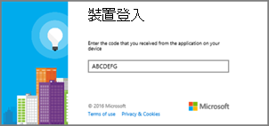

# 部署用商務用 Skype Online 電話Deploying Skype for Business Online phones

[!INCLUDE [sfbo-retirement](../../../Hub/includes/sfbo-retirement.md)]

此為部署指南，可協助您商務用 Skype Online IP 電話。This is deployment guide will help you deploy Skype for Business Online IP phones.
  
在所有類型的企業中，擁有電話號碼可讓使用者撥打和接聽語音電話，這是進行商務的重要需求。In all types of businesses, having a phone number allows users to make and get voice calls, and it is an important requirement to do business. 擁有電話號碼的使用者可以在所有裝置上撥打語音商務用 Skype IP 電話、電腦和行動裝置。Users who have phone numbers will be able to make voice calls across all Skype for Business devices including IP phones, PCs, and mobile devices. 您可以閱讀取得適用于 商務用 Skype Online 的電話，進一商務用 Skype [IP 電話](getting-phones-for-skype-for-business-online.md)。You can learn more about Skype for Business IP phones by reading [Getting phones for Skype for Business Online](getting-phones-for-skype-for-business-online.md).
  
## IP 電話的部署步驟Deployment steps for IP phones

### 步驟 1 - 下載製造商的系統管理員指南和電話手冊Step 1 - Download the manufacturer's administrator guides and phone manuals

在您開始使用之前，建議先下載手機制造商的管理指南和電話使用者手冊。Before you get started, it's a good idea to download the phone manufacturer's administration guides and phone user manuals.
  
- 針對 Polycom 電話，請參閱 [Poly 文件庫](https://documents.polycom.com/category/voice)。For Polycom phones, see the [Poly Documentation Library](https://documents.polycom.com/category/voice).
    
- 針對 Yealink 手機，請參閱[Yealink 商務用 Skype HD SIP 電話解決方案](http://www.yealink.com/products_top_2.html)。For Yealink phones, see [Yealink Skype for Business HD SIP Phones Solution](http://www.yealink.com/products_top_2.html).
    
- 針對 AudioCodes 手機，請參閱 [音訊代碼資源建構管理指南](https://www.audiocodes.com/solutions-products/products/products-for-microsoft-365/ip-phones-room-solutions)。For AudioCodes phones, see the [Audiocodes Provisioning Management Guide](https://www.audiocodes.com/solutions-products/products/products-for-microsoft-365/ip-phones-room-solutions).
    
### 步驟 2 - 確認您購買或移商務用 Skype支援的 IP 電話和固件Step 2 - Make sure you're purchasing or migrating a Skype for Business Supported IP phone and firmware

線上商務用 Skype支援的電話和商務用 Skype Server也相容，但情況並不一定一樣。A Skype for Business Online supported phone and firmware is compatible for Skype for Business Server as well, but the opposite isn't always true. 若要確定您購買或置備支援的手機和固件，請參閱取得適用于 商務用 Skype [Online 的手機](getting-phones-for-skype-for-business-online.md)。To make sure you are buying or provisioning a supported phone and firmware, see [Getting phones for Skype for Business Online](getting-phones-for-skype-for-business-online.md).
  
### 步驟 3 - 檢查已安裝正確的固件，並在需要時更新固件Step 3 - Checking that the right firmware is installed and update the firmware if required

檢查手機上的固件版本。Check the firmware version on your phones. 適用于：For:
  
- **Polycom VVX 手機**，請設定  >    >  **狀態平臺**  >  **應用程式**  >  **主**。**Polycom VVX phones**, go to **Settings** > **Status** > **Platform** > **Application** > **Main**.
    
- **Yealink 手機**，請 **前往主** 電話畫面上的狀態。**Yealink phones**, go to **Status** on the main phone screen.
    
- **音訊代碼手機**，**從開始畫面** 前往功能表  >  **裝置**  >  狀態固件版本。**AudioCodes phones**, go to **Menu** > **Device Status** > **Firmware version** from the start screen.
    
    > [!NOTE]
    > 若要遠端存取電話詳細資料，請參閱製造商管理指南。For remote access to phone details, refer to manufacturer administration guides. 請參閱上述使用者指南和電話手冊的連結。See the links above for the user guides and phone manuals. 
  
- **Lync 電話版本 (LPE**) 手機，從開始畫面系統資訊  >  功能表功能表。**Lync Phone Edition (LPE) phones**, go to **Menu** > **System Information** from the start screen.
    
### 步驟 4 - 裝置更新注意事項Step 4 - Device Update Considerations

> [!NOTE]
> 5.5.1.X 之前的 Polycom 固件具有製造商專用裝置鎖定機制，以 商務用 Skype"電話-Lock"取代。Polycom firmware prior to 5.5.1.X had a manufacturer-specific device-lock mechanism that is replaced with a Skype for Business implementation "Phone-Lock." 使用 "device-Lock" 保護的電話從 5.4.X.X 升級為 5.5.1.X，而使用 "電話-Lock" 不會繼承 「Device-Lock」的 PIN 碼，因為「裝置鎖定」可能會讓電話不安全。Upgrading a phone from 5.4.X.X that was secured with "Device-Lock" to 5.5.1.X with "Phone-Lock" won't inherit the PIN code from "Device-Lock," which can leave the phone unsecured. 啟用「Device-Lock」的使用者必須啟用下列 Polycom 裝置設定檔參數，讓使用者控制升級時間 (lync.deviceUpdate.popUpSK.enabled=1) 。Users who have activated "Device-Lock" need to enable the following Polycom Device Profile parameter to give users control of time of upgrade (lync.deviceUpdate.popUpSK.enabled=1). 
  
固件更新是由服務商務用 Skype管理。Firmware updates are managed by the Skype for Business Service. 每個商務用 Skype認證的手機的固件都會上傳到 商務用 Skype Update 伺服器，而且根據預設，所有手機上都會啟用裝置更新。Every Skype for Business certified phone's firmware is uploaded to the Skype for Business Update server, and device update is enabled on all phones by default. 根據電話和投票間隔上的非啟用時間，電話會自動下載並安裝最新的認證版本。Depending on the inactivity time on the phone and polling intervals, phones will automatically download and install the latest certified builds. 您可以使用 [Set-CsIPPhonePolicy](/powershell/module/skype/Set-CsIPPhonePolicy) Cmdlet，將 _EnableDeviceUpdate_ 參數設定為 來停用裝置更新設定 `false` 。You can disable the device update settings by using the [Set-CsIPPhonePolicy](/powershell/module/skype/Set-CsIPPhonePolicy) cmdlet and setting the _EnableDeviceUpdate_ parameter to `false`.
  

  
當新的固件可供使用並準備好下載及安裝時，電話會通知使用者。When a new firmware is available and ready for download and install, the phone will notify the user. Polycom 電話會通知使用者，並提供使用者更新 **或延** 後 **的選項**。Polycom phones will notify the user and provide them with an option to **Update** or **Postpone**.
  

  
對於 Polycom 電話，您可以選取 **SwUpdate** 來更新手機上的固件。For a Polycom phone, you can update the firmware on the phone by selecting **SwUpdate**.
  

  
您也可以選擇使用合作夥伴部署系統管理固件更新。You can also choose to manage firmware updates using a partner provisioning system. 有關合作夥伴的撥備系統管理 ，包括進位電話自訂，請參閱製造商管理指南。For partner provisioning system management including advanced phone customization, refer to manufacturer administration guides.
  
> [!CAUTION]
> 請確定有單一裝置更新授權 (帶內裝置更新或協力廠商) 伺服器，以避免更新迴圈。Make sure to have a single device update authority (In-band device update or a third-party provisioning server) to avoid update loops. 
  
### 步驟 5 - 設定與基礎結構電話設定Step 5 - Configuration and infrastructure phone settings

您可以使用 Cmdlet 的帶內商務用 Skype設定最常用的電話選項Windows PowerShell政策。You can set up the most commonly used phone options and policies using Skype for Business In-band management Windows PowerShell cmdlets. 請參閱 [Set-CsIPPhonePolicy，](/powershell/module/skype/Set-CsIPPhonePolicy) 瞭解這些參數和設定的詳細資訊。See [Set-CsIPPhonePolicy](/powershell/module/skype/Set-CsIPPhonePolicy) for details of those parameters and settings.
  
有關網路基礎結構規劃，請參閱[Skype架構](https://www.skypeoperationsframework.com/)。For network infrastructure planning, see [Skype Operations Framework](https://www.skypeoperationsframework.com/).
  
### 步驟 6 - 準備讓使用者進行登錄Step 6 - Preparing for users to sign in

若要讓使用者順利登錄線上商務用 Skype電話和撥打電話，您必須確認使用者已指派正確的授權。To enable users to successfully sign in to a Skype for Business Online phone and make calls, you need to make sure users are assigned the correct licenses. 您至少需要指派授權電話系統通話方案。At a minimum, you will need to assign a Phone System license and a Calling Plan. 有關其他資訊，請參閱商務用 Skype附加Microsoft Teams[授權](../../skype-for-business-and-microsoft-teams-add-on-licensing/skype-for-business-and-microsoft-teams-add-on-licensing.md)，以及指派商務用 Skype Microsoft Teams[授權](../../skype-for-business-and-microsoft-teams-add-on-licensing/assign-skype-for-business-and-microsoft-teams-licenses.md)。For additional information, you can see [Skype for Business and Microsoft Teams add-on licensing](../../skype-for-business-and-microsoft-teams-add-on-licensing/skype-for-business-and-microsoft-teams-add-on-licensing.md) and [Assign Skype for Business and Microsoft Teams licenses](../../skype-for-business-and-microsoft-teams-add-on-licensing/assign-skype-for-business-and-microsoft-teams-licenses.md).
  
您可以閱讀通話和通話方案，[以電話系統通話方案](/microsoftteams/calling-plan-landing-page)You can find out more about Calling Plans by reading [Phone System and Calling Plans](/microsoftteams/calling-plan-landing-page)
  
- **線上使用者** 可用的登錄選項為：**Sign-in options** that are available for Online users are:
    
  - 使用 **Polycom VVX 5XX/6XX** 電話的使用者會看到：Users with **Polycom VVX 5XX/6XX** phones will see:
    
     
  
  - 使用 **Yealink T48G/T46G** 電話的使用者會看到：Users with **Yealink T48G/T46G** phones will see:
    
     
  
    有關製造商支援的登錄選項的詳細資訊，請參閱取得適用于 商務用 Skype [Online 的電話](getting-phones-for-skype-for-business-online.md)。For details on sign-in options supported by the manufacturer, see [Getting phones for Skype for Business Online](getting-phones-for-skype-for-business-online.md).
    
- **使用者識別碼** 使用電話的鍵盤或螢幕小鍵盤 (如果) ，使用者可以使用組織的使用者名稱和密碼來登錄電話。**User ID** Using the phone's keypad or on-screen keyboard (if available), users can use their organization's user name and password to sign in to the phone. 例如，他們應該使用 UPN <em>格式，例如</em>  amosm@contoso.com 名稱。For example, they should use the UPN format like <em>amosm@contoso.com</em>  for their user name.
    
     
  
    > [!NOTE]
    > LPE 和合作夥伴 IP 電話商務用 Skype線上版不支援 PIN 驗證。PIN authentication isn't supported for Skype for Business Online for LPE and Partner IP phones. 
  
- **使用電腦** 當在乙太網路上 (BToE) 安裝軟體並啟用時，使用者可以使用其應用程式上的驗證視窗登入他們的電話Windows 商務用 Skype。**Using a PC** When Better Together over Ethernet (BToE) software is installed on user's PC and enabled, users can log in to their phones using the authentication window on their Windows Skype for Business App. 請參閱 [步驟 7 (選 ](deploying-skype-for-business-online-phones.md#BK_BTOE)) - 如果您有裝置配對，且在乙太網路上 (更好搭配使用 BToE) 其他資訊。See [Step 7 (optional) - If you have device pairing and Better Together over Ethernet (BToE)](deploying-skype-for-business-online-phones.md#BK_BTOE) for other information.
    
  > [!NOTE]
  > 使用者必須使用組織的使用者名稱和密碼來登錄電話。Users are required to use their organization's user name and password to sign in to the phone. 例如，他們應該使用 UPN  <em>格式，例如</em>  amosm@contoso.com 名稱。For example, they should use the UPN format like  <em>amosm@contoso.com</em>  for their user name.
  
     
  
- **使用 Web 登錄**：這是線上使用者使用標準網頁瀏覽器進行驗證的一種新方式。**Using a Web Sign-in**: This is a new way for Online users to authenticate using a standard web browser. 當使用者使用瀏覽器進行登錄時，系統將會提供一組指示，以遵循這些指示。Users will be provided with a set of instructions to follow when they use a browser to sign in.
    
  - 使用 **Polycom VVX 5XX/6XX** 電話的使用者會看到：Users with **Polycom VVX 5XX/6XX** phones will see:
    
     
  
  - 使用 **Yealink T48G/T46G** 電話的使用者會看到：Users with **Yealink T48G/T46G** phones will see:
    
     
  
    產生的程式碼將在 15 分鐘後到期。The code that is generated will expire in 15 minutes. 到期時，使用者必須按一下 [重試或確定」，以根據電話產生新代碼。When it expires, the user will have to click **Retry** or **OK** to generate a new code, depending on the phone.
    
  - 使用 **Polycom VVX 5XX/6XX** 電話的使用者會看到：Users with **Polycom VVX 5XX/6XX** phones will see:
    
     
  
  - 使用 **Yealink T48G/T46G** 電話的使用者會看到：Users with **Yealink T48G/T46G** phones will see:
    
     
  
    使用瀏覽器流覽至手機上顯示的位址，然後輸入您的商務用 Skype使用者名稱。Using a browser, navigate to the address displayed on the phone and enter your Skype for Business username.
    
     
  
    輸入手機上顯示的代碼。Enter the code shown on the phone.
    
     
  
    確認網站顯示「[電話製造商名稱] 商務用 Skype **認證** 電話」，然後按一下 [**繼續**]。Verify that the site shows "[Phone Manufacturer name] **Skype for Business Certified Phone**," and click **Continue**.
    
     
  
    按一下使用者的認證，或按一下 [**使用另一個帳戶：**Click the user's credentials or click **Use another account**:
    
     
  
    顯示下列頁面時，可以安全地關閉瀏覽器。When the following page is displayed, it is safe to close the browser.
    
     
  
    > [!NOTE]
    > 適用于線上商務用 Skype的 LPE 電話僅支援透過 USB 連線來登錄。LPE phones for Skype for Business Online support sign-in through USB tethering only. 
  
- **支援的部署** 下表顯示目前支援部署模型的支援驗證類型，包括 Exchange 整合、使用多重要素驗證的新式驗證 (MFA) ，以及 商務用 Skype Online 和內部部署。**Supported deployments** The table below shows the supported authentication types for the currently supported deployment models including Exchange Integration, Modern authentication with Multi-factor Authentication (MFA), and Skype for Business Online and on-premises.
    
|||||||
|:-----|:-----|:-----|:-----|:-----|:-----|
|**商務用 Skype****Skype for Business**   |**Exchange****Exchange**   |**電話 Sign-In方法****Phone Sign-In method**   |**商務用 Skype存取權****Skype for Business access**   |**Exchange已停用新式驗證和 MFA 的存取****Exchange Access with Modern Auth and MFA disabled**   |**Exchange已啟用新式驗證和 MFA 的 Access****Exchange Access with Modern Auth and MFA enabled**   |
|線上Online    |線上Online    |Web 登錄Web Sign-in    |是Yes    |是Yes    |是Yes    |
|線上Online    |線上Online    |使用者名稱/密碼Username/Password    |是Yes    |是Yes    |否No    |
|線上Online    |內部部署On-premises    |Web 登錄Web Sign-in    |是Yes    |否No    |否No    |
|線上Online    |內部部署On-Premises    |使用者名稱/密碼Username/Password    |是Yes    |是Yes    |否No    |
|內部部署On-premises    |線上/內部部署Online/On-Premises    |PIN 驗證PIN Authentication    |是Yes    |否No    |否No    |
|內部部署On-premises    |線上/內部部署Online/On-Premises    |使用者名稱/密碼Username/Password    |是Yes    |是Yes    |不適用N/A    |
|內部部署On-premises    |線上/內部部署Online/On-Premises    |透過 PC 或 BTOE (登錄) Sign-in via PC (BTOE)    |是Yes    |是Yes    |不適用N/A    |
   
- **電話功能** 根據 IP 電話合作夥伴的不同，功能集可能會稍有不同。**Phone features** The feature set may vary slightly based on the IP phone partner. 有關完整功能集，以及每個手機制造商功能詳細資訊，請參閱取得適用于 商務用 Skype [Online 的手機](getting-phones-for-skype-for-business-online.md)。For the complete feature set and for more information on the features for each phone manufacturer, see [Getting phones for Skype for Business Online](getting-phones-for-skype-for-business-online.md).
    
- **電話-Lock** 是最近商務用 Skype認證電話的一項功能，可用來保護電話。**Phone-Lock** is a recently introduced feature in Skype for Business certified phones that is used to secure a phone. 如果已啟用，系統將會要求使用者在驗證成功時建立 PIN。If enabled, users will be asked to create a PIN upon successful authentication. 建立之後，電話會在您定義的閒置超時到期時鎖定、使用者手動鎖定手機，或使用配對功能將手機鎖定與電腦鎖定電話同步處理。Once created, phones will lock when the idle-timeout that you define expires, a user manually locks their phone, or they sync their phone-lock with their PC lock using Phone Pairing. 如果電話鎖定 PIN 輸入錯誤數次，電話會登出使用者，或需要系統管理員程式碼才能解除鎖定電話，但這會因電話合作夥伴而異。If the phone-lock PIN is entered wrong several times, the phone will either sign the user out or require an administrator's code to unlock the phone, but this will vary depending on the phone partner. 使用者的 PIN 應該介於 6 到 15 位數之間。The user's PIN should be between 6 and 15 digits.
    
    您可以針對Phone-Lock停用 (預設為啟用的) 、變更閒置-超時，以及選擇使用者是否可以在鎖定時撥打電話，或是否使用 inband-settings。You can disable Phone-Lock for your organization (which is enabled by default), change the idle-timeout, and choose whether users can make phone calls while they are locked or not using inband-settings. 請參閱 [Set-CsUCPhoneConfiguration，](/powershell/module/skype/set-csucphoneconfiguration?view=skype-ps) 以進一步瞭解這些設定的詳細資訊。See [Set-CsUCPhoneConfiguration](/powershell/module/skype/set-csucphoneconfiguration?view=skype-ps) for more details on those settings.
    
## 步驟 7 (選) - 如果您有裝置配對，且在乙太網路上更 (BToE) Step 7 (optional) - If you have device pairing and Better Together over Ethernet (BToE)

BToE 是合作夥伴 IP 電話的一種電話問題機制，可讓使用者的電話與他們的應用程式配對Windows 商務用 Skype機制。BToE is a phone paining mechanism for Partner IP phones that pairs a user's phone with their Windows Skype for Business app. BToE 可讓使用者：BToE enables users to:
  
- 使用桌面應用程式或電腦商務用 Skype， (IP 電話) Sign in to their IP phone using their Skype for Business desktop app (using a PC)
    
- 使用Phone-Lock同步處理Synchronize Phone-Lock with PC lock
    
- 按一下以撥打Click to call
    
BToE 可配置為以兩種模式操作：  *自動*  (預設) 和 *手動*  。BToE can be configured to operate in two modes:  *Auto*  (default) and *Manual*  . 您也可以針對使用帶內 (設定) /停用使用者商務用 Skype此功能。It can also be enabled (default)/disabled for users using Skype for Business in-band settings. 在手動 *模式中* 操作時，使用者必須執行額外的步驟，以將手機與應用程式Windows配對。When operating in *Manual*  mode, users will have to take an additional step to pair their phone with their Windows app.
  
 **將 BToE 部署到使用者****To deploy BToE to users**
  
1. 連線電腦埠將電腦連接到手機。Connect their PC to their phone using the PC port.
    
     
  
2. 從下列連結從製造商網站下載並安裝最新的 BToE 軟體。Download and install the latest BToE software from the manufacturer website from the links below. 若要獲得更好的使用者體驗，您可以使用系統管理發佈解決方案來發佈及安裝 BToE 軟體，例如 Microsoft Endpoint Configuration Manager。For a better user experience, you can distribute and install the BToE software using an admin distribution solution such as Microsoft Endpoint Configuration Manager. 有關使用 Configuration Manager 的協助，請參閱 Configuration [Manager 中的套件和程式](/configmgr/apps/deploy-use/packages-and-programs)。For help using Configuration Manager, See [Packages and programs in Configuration Manager](/configmgr/apps/deploy-use/packages-and-programs).
    
   - [Polycom BToE 軟體下載網站Polycom BToE Software Download site](https://www.polycom.com/voice-conferencing-solutions/microsoft-phones.html)
    
   - [Yealink BToE 軟體下載Yealink BToE Software Download](http://www.yealink.com/products_list_10.html)
    
   - [音訊代碼 BToE 軟體下載AudioCodes BToE Software Downloads](https://www.audiocodes.com/solutions-products/solutions/skype-for-business-microsoft-teams/skype-for-business-online)
    
3. 根據預設，BToE 的伺服器設定為 **啟用\*\*\*\*和** 自動模式。The server setting for BToE is set to **Enabled** and **Auto mode** by default. 若要變更這些設定，請參閱 [Set-CsIPPhonePolicy](/powershell/module/skype/Set-CsIPPhonePolicy)。To change those settings, see [Set-CsIPPhonePolicy](/powershell/module/skype/Set-CsIPPhonePolicy).
    
> [!NOTE]
> Mac 和 VDI 平臺目前不支援 BToE。BToE isn't currently supported on Mac and VDI platforms. 
  
## 相關主題Related topics
[取得商務用 Skype 和 Microsoft Teams 的服務電話號碼Getting service phone numbers for Skype for Business and Microsoft Teams](/microsoftteams/getting-service-phone-numbers)

[以下是可透過電話系統獲得的功能Here's what you get with Phone System](/MicrosoftTeams/here-s-what-you-get-with-phone-system)

[音訊會議與通話方案的適用國家/地區Country and region availability for Audio Conferencing and Calling Plans](/microsoftteams/country-and-region-availability-for-audio-conferencing-and-calling-plans/country-and-region-availability-for-audio-conferencing-and-calling-plans)

  
