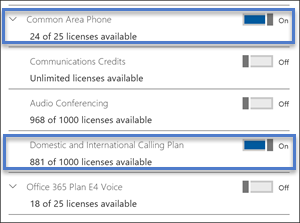
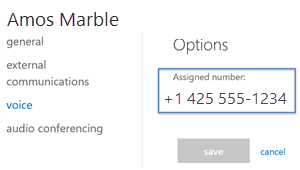

# 設定公共區域電話Set up common area phones
常見的區域電話（CAP）通常放在諸如大廳或其他許多人都可以使用的區域中。A common area phone (CAP) is typically placed in an area like a lobby or another area that is available to a lot of people. 例如，將 Cap 設定為裝置，而不是使用者並自動登入網路，即接收區域電話、[門 phone] 或 [會議室電話]。For example, a reception area phone, door phone or meeting room phone, CAPs are set up as devices rather than users and automatically sign into a network. 在下列步驟中，我們將協助您使用通話方案設定電話系統帳戶，以便為您的組織部署這些類型的電話。In the steps below, we’ll help you set up an account for Phone System with Calling Plans so you can deploy these types of phones for your organization.

## 常見區域手機的先決條件Prerequisites for common area phones

您必須做的第一件事是確認您具備下列專案：The first thing you need to do is to confirm that you have the following:

- 購買通用的區域電話授權和通話方案。Purchase Common Area Phone license and a Calling Plan.
- 搜尋並購買核准的電話（在[此](deploying-skype-for-business-online-phones.md)查看清單）。Search for and buy approved phones (view the list [here](deploying-skype-for-business-online-phones.md)).
- 更新手機上的固件（請參閱[本主題中](getting-phones-for-skype-for-business-online.md)的支援的固件）。Update the firmware on your phones (See supported firmware [in this topic](getting-phones-for-skype-for-business-online.md)).  您可以執行下列動作來檢查手機上的固件：You can check the firmware on you phone by doing this:
  - **Polycom VVX 手機**：移至**設定** > **狀態** > **平臺** > **應用程式** > **主要**。**Polycom VVX phones**: Go to **Settings** > **Status** > **Platform** > **Application** > **Main**.
  - **Yealink [電話**]：移至 [主要電話] 畫面上的 [**狀態**]。**Yealink phones**: Go to **Status** on the main phone screen.
  - **AudioCodes [電話**]：從 [開始] 畫面移至 [**功能表** > **裝置狀態** > **固件版本**]。**AudioCodes phones**: Go to **Menu** > **Device Status** > **Firmware version** from the start screen.
  - **Lync Phone Edition （lpw）手機**：移至 [開始] 畫面中的 [**功能表** > **系統資訊**]。**Lync Phone Edition (LPE) phones**: Go to **Menu** > **System Information** from the start screen.

    固件更新是由商務用 Skype 服務來管理。Firmware updates are managed by the Skype for Business Service. 每個商務用 Skype 認證手機的固件都會上傳到商務用 Skype 補救伺服器，且預設會在所有手機上啟用裝置更新。Every Skype for Business certified phone's firmware is uploaded to the Skype for Business Update server, and device update is enabled on all phones by default.

    電話會自動下載並安裝最新的認證組建，這取決於電話和巡迴檢測間隔中的非啟用時間。Depending on the inactivity time on the phone and polling intervals, phones will automatically download and install the latest certified builds. 您可以使用[CsIPPhonePolicy](https://docs.microsoft.com/powershell/module/skype/set-csipphonepolicy) Cmdlet 來停用裝置更新設定，並將*EnableDeviceUpdate*參數設定為`false`。You can disable the device update settings by using the  [Set-CsIPPhonePolicy](https://docs.microsoft.com/powershell/module/skype/set-csipphonepolicy) cmdlet and setting the *EnableDeviceUpdate* parameter to `false`.

## 設定一般的區域電話Setting up a Common Area Phone
您必須遵循下列步驟：You will need to follow these steps:

### 步驟 1-購買授權Step 1 - Buy the licenses
1. 在系統管理中心中，移至 [**帳單** > **購買服務**]，然後新增**其他方案**。In the admin center, go to **Billing** > **Purchase services**, and add **Other plans**.

    
2. 按一下 [**常用區域電話** > **立即購買**] > 在 [**結帳**] 頁面上按一下 [**立即購買**]。Click on **Common Area Phone** > **Buy now** > on the **Checkout** page click on **Buy now**.
3. 按一下 [開啟] 以展開 [**附加元件訂閱**]，然後按一下 [開啟] 以購買通話方案。Click on to expand **Add-on subscriptions** and then click on to buy a Calling Plan. 選擇 [**國內通話方案**] 或 [**國內與國際通話方案**]。Choose either the **Domestic Calling Plan** or **Domestic and International Calling Plan**.

> [!Note]
> 您不需要電話系統授權。You don't need a Phone System license. 它包含在**通用區域電話**授權中。It's included with the **Common Area Phone** license.

如需授權的詳細資訊，請參閱[商務用 Skype 和 Microsoft 團隊附加元件授權](../../skype-for-business-and-microsoft-teams-add-on-licensing/skype-for-business-and-microsoft-teams-add-on-licensing.md)。For more info on licenses, see [Skype for Business and Microsoft Teams add-on licensing](../../skype-for-business-and-microsoft-teams-add-on-licensing/skype-for-business-and-microsoft-teams-add-on-licensing.md).

### 步驟 2-為手機建立新的使用者帳戶並指派授權Step 2 - Create a new user account for the phone and assign the licenses
1. 在系統管理中心中，移至 [**使用者** > 作用中的**使用者** > ]**新增使用者**。In the admin center, go to **Users** > **Active Users** > **Add a user**.
2. 將第一個名稱的**使用者名稱**（例如 "Main"）加上第二個名稱的 "接收"。Put in a **User name** like “Main" for the first name and "Reception” for the second name.
3. 如果沒有自動產生類似 "主要接收" 的名稱，則放入**顯示名稱**。Put in a **Display name** if it doesn't autogenerate one like "Main Reception".
4. 放在**使用者名稱**（例如 "MainReception" 或 "Mainlobby"）。Put in a **User name** like "MainReception" or "Mainlobby".
5. 如果是常見的區域電話，您可能會想要手動設定密碼，或針對所有常見的區域手機設定密碼。For common area phones, you might want to set a password manually or have the same password for all of you common area phones. 此外，您也可以考慮取消選中**讓此使用者在第一次登入時變更他們的密碼**。Also, you might think about unselecting **Make this user change their password when they first sign in**.
6. 如果您仍在那裡，請指派授權給此使用者。If you are still there, assign the licenses to this user. 在同一個頁面上，按一下以展開 [**產品授權**]。On the same page, click to expand **Product licenses**. 開啟下列各項：Turn on the following:
   - 常見的區域電話Common Area Phone
   - 接著，您必須挑選**國內通話方案**或國內與**國際通話方案**。Then you need to pick either a **Domestic Calling Plan** or a Domestic and **International Calling Plan**.

     指派授權的方式將如下所示：Assigning the licenses will look like:

     

     > [!Note]
     > 只要知道，商務用 Skype 方案2就包含在**通用區域電話**授權中。Just so you know, Skype for Business Plan 2 is included with the **Common Area Phone** license.

如需詳細資訊，請參閱[新增使用者](https://support.office.com/article/1970f7d6-03b5-442f-b385-5880b9c256ec)。For more details, see [Add a user](https://support.office.com/article/1970f7d6-03b5-442f-b385-5880b9c256ec).

### 步驟 3-將電話號碼指派給通用區域電話使用者帳戶Step 3 - Assign a phone number to the Common Area Phone user account

的圖示，可使用商務用 Skype 系統**管理中心**將電話號碼指派給使用者 Assign a phone number to the user using the **Skype for Business admin center**

1. 在系統管理中心中 > [系統**管理中心] 中心** > **商務用 Skype**。In the admin center > **Admin centers** > **Skype for Business**.
2. 在**商務用 Skype 系統管理中心** >  **語音** > **電話號碼**。In the **Skype for Business admin center** >  **Voice** > **Phone numbers**.
3. 從電話號碼清單中選取一個數位，然後按一下 [**指派**]。Select a number from the list of phone numbers and click **Assign**.
4. 在 [**指派**] 頁面上的 [**語音使用者**] 方塊中，輸入用於手機的使用者名稱，然後在 [**選取語音使用者**] 下拉式清單中選取使用者。On the **Assign** page, in the **Voice user** box enter the name of the user that is used for the phone then select the user in the **Select a voice user** drop down.
5. 當您在這裡時，您將需要新增緊急位址。While you're there you will need to add an emergency address. 搜尋之後，請在 [**選取緊急位址**] 下查看，為您挑選一個合適的位址。Once you search, look under the **Select emergency address** to pick the right one for you.
6. 按一下 [**儲存**]，您的使用者看起來會像這樣：Click **Save** and your user should look like this:

    

   > [!Note]
   > 只有在已套用**電話系統**授權的情況中，使用者才會顯示。Users will only show up if they have a **Phone System** licence applied. 如果您只這麼做，有時候使用者會在清單中顯示一個位。If you just did this, then sometimes it takes a bit for the user to show up in the list.

如需更多相關資訊，請參閱為[您的使用者取得電話號碼](/microsoftteams/getting-phone-numbers-for-your-users)。For more stuff, see [Getting phone numbers for your users](/microsoftteams/getting-phone-numbers-for-your-users).

如果您想知道，您也可以將您的電話號碼與其他運輸公司和「*埠*」結合，或轉移到 Office 365。If you're wondering, you can also take your phone number that you have with another carrier and "*port*" or transfer them over to Office 365. 請參閱[將電話號碼轉移至團隊](/microsoftteams/phone-number-calling-plans/transfer-phone-numbers-to-teams)。See, [Transfer phone numbers to Teams](/microsoftteams/phone-number-calling-plans/transfer-phone-numbers-to-teams).

### 步驟 4-設定您的電話Step 4 - Setting up your phone

**在手機上設定模式****Setting the mode on a phone**

您所擁有的電話必須開啟 [**通用區域電話模式]** 。The phone or phones you have must have the **Common Area Phone mode** turned on. 您可能會想要檢查該選項，以確定它們的執行方式。You might want to check on that to make sure they do.

**以下是如何設定 Polycom VVX phone 的範例****Here's an example for how to set up a Polycom VVX phone**

- 若要啟用 Polycom VVX 的通用區域電話模式，請執行下列步驟：Enable Common Area Phone mode for the Polycom VVX by following these steps:
    1. 在您的瀏覽器中，連線到網頁介面，讓您可以啟用 [CAP 模式]。In your browser, connect to the web interface so that you can enable CAP mode.
    2. 接著，移至 [**設定**]，然後在 [**商務用 Skype] 設定**選項中，選取 [**通用區域電話**]。Then go to **Setting**  and in the **Skype for Business Setting** option, select **Common Area Phone**.
    3. 按一下 **[是]** 儲存您的設定。Click **Yes** to save your settings.

- 現在已啟用 [CAP] 模式，請使用手機的顯示器設定電話。Now that CAP mode is enabled, set up the phone using the phone's display. 顯示器應該顯示**CaAP 已啟用**。The display should show **CaAP is enabled**. 然後執行下列動作：Then do the following:

    1. 按一下 [**設定**]。Click **Settings**.
    2. 選取 [**高級**]。Select **Advanced**.
    3. 輸入密碼。Enter the password.
    4. 在 [**管理設定**] 中，選取 [**常用區域電話設定**]。In **Administration settings**, select **Common Area Phone Settings**.
    5. 啟用**CAP**和**Cap 系統管理模式**。Enable **CAP** and **CAP Admin Mode**.
    6. 按一下 [**儲存配置**]。Click **Save Config**.

- 現在，您的手機已準備就緒，您可以在主畫面上登入。Ok, now your phone is ready so you can sign in on the home screen.

    1. 選取\*\*\*\* > [**設定** > ] 的 [**商務用 Skype** ]，登入。Sign in by selecting **Settings** > **Features** > **Skype for Business.**
    2. 選取 [**使用者認證**]，然後選取 **[web 登入（CAP）** ] 來產生程式碼。Select **User Credentials**, and select **web sign-in (CAP)** to generate a code.
    3. 移至 [[預配入口網站](https://aka.ms/skypecap)]，然後以系統**管理員**身分登入。Go to the [provisioning portal](https://aka.ms/skypecap), and sign in as **admin**.
    4. 輸入顯示名稱（例如 [主要接收]）。Enter the display name (for example, Main Reception).

       > [!Note]
       > 如果已核取 [**搜尋普通區域手機**]，請清除該核取方塊，然後再次搜尋。If **Search for Common Area Phones only** is checked, clear the checkbox and search again.

    5. 在 [配對代碼] 視窗中，輸入顯示在手機上的程式碼，然後按一下 [**提供**]。In the pairing code window, enter the code displayed on the phone and click **Provision**.

        在這個最後一個步驟之後，手機應該會自動登入。Following this last step, the phone should sign in automatically.

> [!NOTE]
> CAP 預配網站的狀態會將 CAP 帳戶的密碼重設為隨機密碼。The CAP provisioning site states it will reset the CAP account's password to a random password. 請注意，CAP 所參照的帳戶是 Azure Active Directory （AAD）帳戶。Take note that the account the CAP is referring is the Azure Active Directory (AAD) account. 如果您只在 AAD 中建立帳戶，程式就相當簡單。If you created the account in AAD only then the process is straightforward. 如果您已將內部部署 Active Directory 同步處理到 AAD，且您使用的是協力廠商 IDP 或 ADFS，則 CAP 配置將會失敗。If you have synced an on premises Active Directory to AAD and you use a third-party IDP or ADFS, CAP provisioning will fail. 在這種情況下，您只需要使用 Office 365/Azure Active Directory 帳戶（例如，擁有**onmicrosoft.com**網域的帳戶），才能執行 CAP 提供作業。In this case, you need to use an Office 365/Azure Active Directory account only (for example, an account with **onmicrosoft.com** domain) for CAP provisioning to work.

### 相關主題Related topics

- 深入瞭解[部署商務用 Skype Online 手機](deploying-skype-for-business-online-phones.md)時可用的手機。Learn more about available phones at [Deploying Skype for Business Online phones](deploying-skype-for-business-online-phones.md).
- [在商務用 Skype Online 中取得電話Getting phones for Skype for Business Online](getting-phones-for-skype-for-business-online.md)

