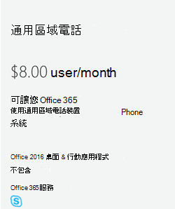

# 設定公共區域電話
常見的區域電話（CAP）通常放在諸如大廳或其他許多人都可以使用的區域中。 例如，將 Cap 設定為裝置，而不是使用者並自動登入網路，即接收區域電話、[門 phone] 或 [會議室電話]。 在下列步驟中，我們將協助您使用通話方案設定電話系統帳戶，以便為您的組織部署這些類型的電話。

## 常見區域手機的先決條件

您必須做的第一件事是確認您具備下列專案：

- 購買通用的區域電話授權和通話方案。
- 搜尋並購買核准的電話（在[此](deploying-skype-for-business-online-phones.md)查看清單）。
- 更新手機上的固件（請參閱[本主題中](getting-phones-for-skype-for-business-online.md)的支援的固件）。  您可以執行下列動作來檢查手機上的固件：
  - **Polycom VVX 手機**：移至**設定** > **狀態** > **平臺** > **應用程式** > **主要**。
  - **Yealink [電話**]：移至 [主要電話] 畫面上的 [**狀態**]。
  - **AudioCodes [電話**]：從 [開始] 畫面移至 [**功能表** > **裝置狀態** > **固件版本**]。
  - **Lync Phone Edition （lpw）手機**：移至 [開始] 畫面中的 [**功能表** > **系統資訊**]。

    固件更新是由商務用 Skype 服務來管理。 每個商務用 Skype 認證手機的固件都會上傳到商務用 Skype 補救伺服器，且預設會在所有手機上啟用裝置更新。

    電話會自動下載並安裝最新的認證組建，這取決於電話和巡迴檢測間隔中的非啟用時間。 您可以使用[CsIPPhonePolicy](https://docs.microsoft.com/powershell/module/skype/set-csipphonepolicy) Cmdlet 來停用裝置更新設定，並將*EnableDeviceUpdate*參數設定為`false`。

## 設定一般的區域電話
您必須遵循下列步驟：

### 步驟 1-購買授權
1. 在系統管理中心中，移至 [**帳單** > **購買服務**]，然後新增**其他方案**。

    
2. 按一下 [**常用區域電話** > **立即購買**] > 在 [**結帳**] 頁面上按一下 [**立即購買**]。
3. 按一下 [開啟] 以展開 [**附加元件訂閱**]，然後按一下 [開啟] 以購買通話方案。 選擇 [**國內通話方案**] 或 [**國內與國際通話方案**]。

> [!Note]
> 您不需要電話系統授權。 它包含在**通用區域電話**授權中。

如需授權的詳細資訊，請參閱[商務用 Skype 和 Microsoft 團隊附加元件授權](../../skype-for-business-and-microsoft-teams-add-on-licensing/skype-for-business-and-microsoft-teams-add-on-licensing.md)。

### 步驟 2-為手機建立新的使用者帳戶並指派授權
1. 在系統管理中心中，移至 [**使用者** > 作用中的**使用者** > ]**新增使用者**。
2. 將第一個名稱的**使用者名稱**（例如 "Main"）加上第二個名稱的 "接收"。
3. 如果沒有自動產生類似 "主要接收" 的名稱，則放入**顯示名稱**。
4. 放在**使用者名稱**（例如 "MainReception" 或 "Mainlobby"）。
5. 如果是常見的區域電話，您可能會想要手動設定密碼，或針對所有常見的區域手機設定密碼。 此外，您也可以考慮取消選中**讓此使用者在第一次登入時變更他們的密碼**。
6. 如果您仍在那裡，請指派授權給此使用者。 在同一個頁面上，按一下以展開 [**產品授權**]。 開啟下列各項：
   - 常見的區域電話
   - 接著，您必須挑選**國內通話方案**或國內與**國際通話方案**。

     指派授權的方式將如下所示：

     

     > [!Note]
     > 只要知道，商務用 Skype 方案2就包含在**通用區域電話**授權中。

如需詳細資訊，請參閱[新增使用者](https://support.office.com/article/1970f7d6-03b5-442f-b385-5880b9c256ec)。

### 步驟 3-將電話號碼指派給通用區域電話使用者帳戶

的圖示，可使用商務用 Skype 系統**管理中心**將電話號碼指派給使用者

1. 在系統管理中心中 > [系統**管理中心] 中心** > **商務用 Skype**。
2. 在**商務用 Skype 系統管理中心** >  **語音** > **電話號碼**。
3. 從電話號碼清單中選取一個數位，然後按一下 [**指派**]。
4. 在 [**指派**] 頁面上的 [**語音使用者**] 方塊中，輸入用於手機的使用者名稱，然後在 [**選取語音使用者**] 下拉式清單中選取使用者。
5. 當您在這裡時，您將需要新增緊急位址。 搜尋之後，請在 [**選取緊急位址**] 下查看，為您挑選一個合適的位址。
6. 按一下 [**儲存**]，您的使用者看起來會像這樣：

    

   > [!Note]
   > 只有在已套用**電話系統**授權的情況中，使用者才會顯示。 如果您只這麼做，有時候使用者會在清單中顯示一個位。

如需更多相關資訊，請參閱為[您的使用者取得電話號碼](/microsoftteams/getting-phone-numbers-for-your-users)。

如果您想知道，您也可以將您的電話號碼與其他運輸公司和「*埠*」結合，或轉移到 Office 365。 請參閱[將電話號碼轉移至團隊](/microsoftteams/phone-number-calling-plans/transfer-phone-numbers-to-teams)。

### 步驟 4-設定您的電話

**在手機上設定模式**

您所擁有的電話必須開啟 [**通用區域電話模式]** 。 您可能會想要檢查該選項，以確定它們的執行方式。

**以下是如何設定 Polycom VVX phone 的範例**

- 若要啟用 Polycom VVX 的通用區域電話模式，請執行下列步驟：
    1. 在您的瀏覽器中，連線到網頁介面，讓您可以啟用 [CAP 模式]。
    2. 接著，移至 [**設定**]，然後在 [**商務用 Skype] 設定**選項中，選取 [**通用區域電話**]。
    3. 按一下 **[是]** 儲存您的設定。

- 現在已啟用 [CAP] 模式，請使用手機的顯示器設定電話。 顯示器應該顯示**CaAP 已啟用**。 然後執行下列動作：

    1. 按一下 [**設定**]。
    2. 選取 [**高級**]。
    3. 輸入密碼。
    4. 在 [**管理設定**] 中，選取 [**常用區域電話設定**]。
    5. 啟用**CAP**和**Cap 系統管理模式**。
    6. 按一下 [**儲存配置**]。

- 現在，您的手機已準備就緒，您可以在主畫面上登入。

    1. 選取**** > [**設定** > ] 的 [**商務用 Skype** ]，登入。
    2. 選取 [**使用者認證**]，然後選取 **[web 登入（CAP）** ] 來產生程式碼。
    3. 移至 [[預配入口網站](https://aka.ms/skypecap)]，然後以系統**管理員**身分登入。
    4. 輸入顯示名稱（例如 [主要接收]）。

       > [!Note]
       > 如果已核取 [**搜尋普通區域手機**]，請清除該核取方塊，然後再次搜尋。

    5. 在 [配對代碼] 視窗中，輸入顯示在手機上的程式碼，然後按一下 [**提供**]。

        在這個最後一個步驟之後，手機應該會自動登入。

> [!NOTE]
> CAP 預配網站的狀態會將 CAP 帳戶的密碼重設為隨機密碼。 請注意，CAP 所參照的帳戶是 Azure Active Directory （AAD）帳戶。 如果您只在 AAD 中建立帳戶，程式就相當簡單。 如果您已將內部部署 Active Directory 同步處理到 AAD，且您使用的是協力廠商 IDP 或 ADFS，則 CAP 配置將會失敗。 在這種情況下，您只需要使用 Office 365/Azure Active Directory 帳戶（例如，擁有**onmicrosoft.com**網域的帳戶），才能執行 CAP 提供作業。

### 相關主題

- 深入瞭解[部署商務用 Skype Online 手機](deploying-skype-for-business-online-phones.md)時可用的手機。
- [取得商務用 Skype Online 的電話](getting-phones-for-skype-for-business-online.md)

