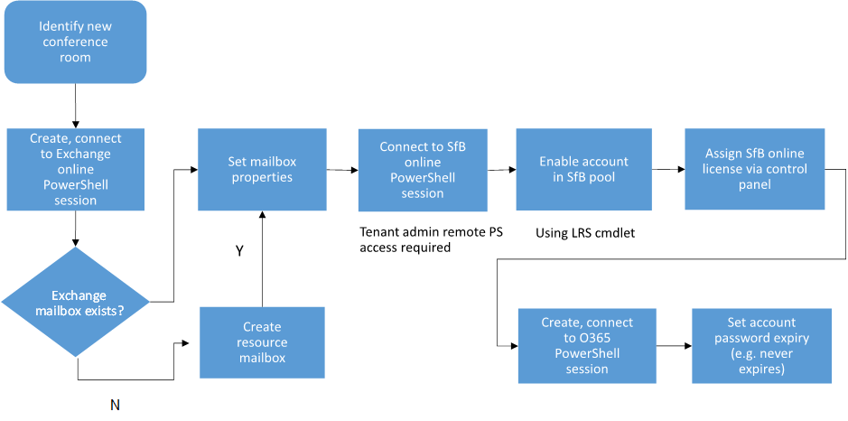

# <a name="provisioning-skype-room-system-accounts-in-microsoft-365-and-office-365"></a>在 Microsoft 365 和 Office 365 中布建 Skype 室系統帳戶
 
閱讀此主題以瞭解如何在 Office 365 中布建 Skype 室系統帳戶。
  
下列章節涵蓋 Office 365 組織的 Skype 會議室系統帳戶布建。
  
## <a name="microsoft-365-and-office-365-prerequisites"></a>Microsoft 365 和 Office 365 必要條件

您的線上租使用者必須符合下列需求：
  
- Microsoft 365 或 Office 365 計畫必須包含商務用 Skype Online 方案2或 Office 365 E1，E3 或 E5。 <br/>如需商務用 Skype Online 方案的詳細資訊，請參閱[商務用 Skype Online 服務說明](https://technet.microsoft.com/library/jj822172.aspx)。
    
- 您的租使用者必須已啟用商務用 Skype 的會議功能。
    
- 您的租使用者必須啟用 Exchange Online。 
    
- 您的承租人遠端系統管理員必須具備下列 PowerShell 存取權：
    
  - Exchange 遠端 PowerShell 存取
    
  - 商務用 Skype Online 遠端 PowerShell 存取
    
  - Windows Azure Active Directory Module for Windows PowerShell 存取 Office 365 目錄存取權
    
若為 Skype 聊天室帳戶，則需要下列授權：
  
- 需要有商務用 Skype Online 方案2或 Office 365 E1 或 E3 授權，才能啟用 Skype 會議。
    
- 若要 entitle 具有 Enterprise Voice 功能的會議室，讓會議室可以透過電話號碼啟用，則需要使用電話系統許可證或 Office 365 E5 的商務用 Skype Online 方案2（1）。
    
- 如果您需要來自會議的撥入式功能，您需要音訊會議和電話系統授權。  如果您需要從會議撥出的功能，您需要國內或國內和國際通話方案。 
    
- 因為帳戶應該設定為資源信箱帳戶，所以不需要使用 Exchange Online 授權。
    
## <a name="provisioning-overview"></a>布建概述

下圖提供 Office 365 中 Skype 會議室系統帳戶布建流程的概述。
  

  
## <a name="identify-a-new-conference-room"></a>識別新的會議室

在 Exchange 中，您可能已經有可提供排程功能的資源會議室信箱，或者您可能會在第一次協助 Skype 會議室系統部署時建立資源信箱。 在任何情況下，您都必須識別要在租使用者中使用的會議室帳戶。 Exchange Online 布建和商務用 Skype 布建區段提供這兩種帳戶類型的指引。 例如，假設您有下列兩個聊天室，而您想要為這兩個聊天室部署 Skype 會議室系統：
  
- 現有資源信箱帳戶： confrm1@contoso.onmicrosoft.com
    
- 新資源信箱帳戶： confrm2@contoso.onmicrosoft.com
    
## <a name="exchange-online-provisioning"></a>Exchange Online 布建

首先，依照主題的 [連線[至 Exchange online PowerShell](https://go.microsoft.com/fwlink/p/?LinkId=396554)] 主題中的指示，連線至 exchange online PowerShell。
  
若要為 Skype 室系統設定現有的資源會議室信箱帳戶，請在 Exchange Online 中執行下列命令 PowerShell:
  
```powershell
$rm="confrm1@contoso.onmicrosoft.com"
$newpass='pass@word1'
Set-Mailbox -Identity $rm  -EnableRoomMailboxAccount $true -RoomMailboxPassword (ConvertTo-SecureString $newpass -AsPlainText -Force)
```

若要為 Skype 會議室系統建立新的 Exchange 資源信箱帳戶，請在 Exchange Online 中執行下列命令 PowerShell:
  
```powershell
$rm="confrm2@contoso.onmicrosoft.com"
$newpass='pass@word1'
New-Mailbox -Name "Conf Room 2" -MicrosoftOnlineServicesID $rm -Room  -EnableRoomMailboxAccount $true -RoomMailboxPassword (ConvertTo-SecureString $newpass -AsPlainText -Force)
```

先前的命令會設定或建立新的 Exchange 資源信箱帳戶，以供啟用該帳戶的 Skype 會議室系統使用。
  
在建立信箱之後，您可以使用 Exchange Online PowerShell 中的 Set-CalendarProcessing Cmdlet 來設定信箱。 如需詳細資訊，請參閱單一樹系內部部署的步驟3到6。

## <a name="assigning-a-skype-for-business-online-license"></a>指派商務用 Skype Online 授權

現在，您可以使用 Office 365 管理入口網站來指派商務用 Skype Online （Plan 2）或商務用 skype Online （Plan 3）授權，如[指派或移除 office 365 for](https://support.office.com/article/Assign-or-remove-licenses-for-Office-365-for-business-997596b5-4173-4627-b915-36abac6786dc?ui=en-US&amp;rs=en-US&amp;ad=US) Business 或[商務用 Skype 附加元件授權](https://support.office.com/article/Skype-for-Business-add-on-licensing-3ed752b1-5983-43f9-bcfd-760619ab40a7)中所述。 
  
在您指派商務用 Skype Online 的授權後，您就可以使用任何商務用 Skype 用戶端，登入並驗證帳戶是否為作用中。
  
## <a name="skype-for-business-online-provisioning"></a>商務用 Skype Online 布建

以先前所顯示的方式建立及啟用資源會議室信箱帳戶後，且已授權商務用 Skype Online 帳戶，該帳戶會使用 Windows Azure Active Directory 樹系，從 Exchange Online 樹系同步處理至商務用 Skype Online 樹系。 在商務用 Skype Online 集區中布建 Skype 室系統帳戶時，需要進行下列步驟。 對於現有的資源信箱帳戶或新建立的帳戶（confrm1 或 confrm2），這些步驟都是相同的，因為在 Exchange Online 中啟用這些帳戶後，這兩個帳戶會以相同的方式同步處理至商務用 Skype Online：
  
1. 建立遠端 PowerShell 會話。 請注意，您將需要下載商務用 Skype Online 連接器模組和 Microsoft Online Services Sign-In Assistant，並確定您的電腦已設定。 如需詳細資訊，請參閱[設定您的電腦以進行 Windows PowerShell](https://docs.microsoft.com/SkypeForBusiness/set-up-your-computer-for-windows-powershell/set-up-your-computer-for-windows-powershell)。
    
   ```powershell
   Import-Module LyncOnlineConnector
   $cssess=New-CsOnlineSession -Credential $cred
   Import-PSSession $cssess -AllowClobber
   ```

2. 若要為商務用 skype 啟用 Skype 會議室系統帳戶，請執行下列命令：
    
   ```powershell
   Enable-CsMeetingRoom -Identity $rm -RegistrarPool "sippoolbl20a04.infra.lync.com" -SipAddressType EmailAddress
   ```

    您可以使用下列命令來傳回此屬性，以取得商務用 Skype 使用者所在的現有帳戶的 RegistrarPool 位址：
    
   ```powershell
   Get-CsOnlineUser -Identity 'alice@contoso.onmicrosoft.com'| fl *registrarpool*
   ```

>[!NOTE] 
>對於 Skype 室系統帳戶，不支援 Multi-Factor 驗證（MFA）。 

## <a name="password-expiration"></a>密碼過期

在 Office 365 中，除非您設定其他密碼到期原則，否則所有使用者帳戶的預設密碼到期原則都會是90天。 若為 Skype 會議室系統帳戶，您可以使用下列步驟，選取 [密碼永不到期] 設定。
  
1. 使用您的租使用者全域系統管理員認證，建立 Windows Azure Active Directory 會話。
    
    ```powershell
    $cred=Get-Credential admin@$org
    Connect-MsolService -Credential $cred
    ```

2. 使用下列命令，為先前建立的 Skype 聊天室系統房間帳戶設定 [密碼永不到期] 設定：
    
   ```powershell
   Set-MsolUser -UserPrincipalName confrm1@skypelrs.onmicrosoft.com -PasswordNeverExpires $true
   ```

如需詳細資訊，請參閱[設定您的電腦以進行 Windows PowerShell](https://docs.microsoft.com/SkypeForBusiness/set-up-your-computer-for-windows-powershell/set-up-your-computer-for-windows-powershell)。
  
## <a name="validate"></a>驗證

針對驗證，您應該能夠使用任何商務用 Skype 用戶端登入您建立的帳戶。

