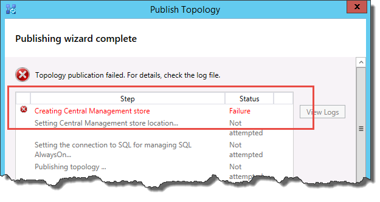

# 在商務用 Skype Server 中建立及發行新的拓撲
 
**摘要：** 瞭解如何建立、發佈和驗證新的拓撲，然後再安裝商務用 Skype Server。 從 Microsoft 評估中心下載免費試用版的商務用 Skype Server，網址如下： [https://www.microsoft.com/evalcenter/evaluate-skype-for-business-server](https://www.microsoft.com/evalcenter/evaluate-skype-for-business-server) 。
  
在拓撲中的每一部伺服器上安裝商務用 Skype Server 系統之前，您必須先建立拓撲並加以發佈。 發行拓撲時，會將拓撲資訊載入至中央管理存放區資料庫。 如果這是 Enterprise Edition 集區，當您第一次發行新的拓撲時，您會建立中央管理存放區資料庫。 如果這是 Standard Edition，您必須先從部署嚮導執行第一個 Standard Edition Server 進程，再發佈拓撲。 這為 Standard Edition 做好準備，方法是安裝 SQL Server Express Edition 實例，並建立中央管理存放區。 您可以依任何循序執行步驟1到5。 不過，您必須依序執行步驟6、7和8，並在步驟1到5之後進行，如圖表中所述。 若要建立及發行新的拓撲，請參閱步驟6之8。
  

  
## 建立和發佈新拓撲

您可以使用商務用 Skype Server 拓撲產生器來設計、定義、設定及發行拓撲。 當您在本文稍早安裝系統管理工具時，即會安裝此工具。 建立拓撲時，可以進行許多不同的選擇。 在此程式中，您將使用會議建立基本拓撲。
  
> [!IMPORTANT]
> 商務用 Skype 伺服器需要 SQL Server 才能運作。 主要資料庫稱為中央管理存放區。 如果您部署的是 Enterprise Edition，當您使用下列步驟發行拓撲時，就會建立這些資料庫。 在此情況下，拓撲產生器會要求您輸入 SQL Server 安裝的連線資訊。 如果您打算部署 Standard Edition，您必須先安裝 SQL Server Express Edition，再定義及發行新的拓撲。 若要安裝 SQL Server Express Edition，您應該在將做為前端的伺服器上開啟部署嚮導，然後執行 [準備第一個 Standard Edition Server]。 當您按一下 [準備第一個 Standard Edition Server] 時，部署嚮導會自動安裝 SQL Server Express Edition，並建立中央管理存放區資料庫。 
  
### 建立新的拓撲

1. 以具有拓撲產生器存取權的標準使用者身分登入。
    
2. 開啟商務用 Skype Server 拓撲產生器。
    
3. 選取 [ **新增拓撲**]，然後按一下 **[確定]**。
    
4. 選取拓撲設定檔的位置和檔案名。
    
    > [!NOTE]
    > 拓撲設定會另存為拓撲產生器 XML ( redmond.tbxml) 檔案。 發行拓撲時，會將設定資訊從檔案推送至 SQL Server 資料庫。 當您在未來開啟拓撲產生器時，您可以將現有的設定從 SQL Server 直接下載到拓撲產生器，然後將其發佈回 SQL Server，或將其儲存為拓撲產生器設定檔。 
  
5. 在 [ **定義主要網域] 畫面** 上，輸入 **主要 SIP 網域**，然後按 **[下一步]**。 在此範例中，我們使用的是 **contoso**，如圖所示。
    
     
  
6. 新增其他支援的 SIP 網域，然後按 **[下一步]**。
    
7. 輸入第一個網站 (位置) 的 **名稱** 和 **描述** ，然後按 **[下一步]**，如圖所示。
    
     
  
8. 輸入網站的 **城市**、 **州/省** 和 **國家/地區碼** ，然後按 **[下一步]**。
    
9. 按一下 **[完成]** ，以完成定義新拓撲的處理常式。 新的前端嚮導會自動啟動。
    
### 定義前端集區或 Standard Edition server

1. 檢查嚮導必要條件，然後按 **[下一步**]。
    
2. 輸入集區的完整功能變數名稱 (FQDN) ，然後選取 [ **Enterprise Edition 前端集** 區] 或 [ **Standard Edition Server**]，然後按一下 **[下一步]**，如圖所示。
    
    > [!TIP]
    > 商務用 Skype Server Enterprise Edition 可包含多部共同運作的伺服器，以提供前端角色。 使用多個伺服器來滿足角色時，它稱為集區。 因此，多部協同工作以提供前端角色的伺服器也稱為前端集區。 商務用 Skype Server Standard Edition 可以只包含一部伺服器來提供前端角色。 即使只有一部伺服器提供角色，也可以參考前端集區。 
  
     
  
3. 輸入集區中所有電腦的完整功能變數名稱 (Fqdn) ，然後按一下 **[下一步]** （如圖所示）。
    
     
  
4. 選取將會包含在此拓撲中的功能，然後按一下 **[下一步]** （如圖所示）。
    
    > [!NOTE]
    > 商務用 Skype 伺服器包含許多高級功能。 請查看您要使用之每個特定功能的規劃和部署檔。 
  
     
  
5. 在 [ **選取組合的伺服器角色** ] 頁面上，您可以選擇組合前端伺服器上的轉送伺服器，也可以選擇將其部署為獨立伺服器。
    
    如果您想要在 Enterprise Edition 前端集區上組合轉送伺服器，請確定已選取此核取方塊。 伺服器角色將會部署在集區伺服器上。 如果您想要將轉送伺服器部署為獨立伺服器，請清除適當的核取方塊。 在您完全部署前端伺服器後，您會在個別的部署步驟中部署轉送伺服器。 如需組合的規劃詳細資料，請參閱 [適用于商務用 Skype Server 的拓撲基礎](../../plan-your-deployment/topology-basics/topology-basics.md)。
    
6. 使用 [ **關聯伺服器角色與此前端集** 區] 頁面，您可以定義伺服器角色與前端集區的關聯。 下列為可用的角色：
    
    **啟用 Edge 集** 區定義及關聯單一 Edge Server 或 Edge Server 集區。 Edge Server 會協助組織內的使用者與組織外部的人員之間的通訊和共同作業，包括同盟使用者。
    
    您可以使用兩種可能的案例來部署和關聯伺服器角色。
    
    在案例一當中，您可以為全新安裝定義新的拓撲。 您可以採用下列兩種方式的其中一種方法來進行安裝：
    
   - 保持核取方塊為清除，並定義拓撲。 在發佈、設定及測試前端及後端伺服器角色之後，您可以再次執行拓撲產生器，將角色服務器新增至拓撲。 使用此策略，您可以測試前端集區和執行 SQL Server 的伺服器，而不需要其他角色的其他複雜工作。 完成初始測試之後，您可以再次執行拓撲產生器，以選取需要部署的角色。
    
   - 選取您需要安裝的角色，然後設定硬體以容納選取的角色。
    
     在案例二中，您有現有的部署，您的基礎結構已準備好使用新的角色，或您必須將現有的角色與新的前端伺服器建立關聯。
    
   - 在此情況下，您會選取要部署或與新前端伺服器產生關聯的角色。 不管是哪一種情況，您都需要先定義角色並設定需要的硬體後，才開始安裝。
    
7. 接下來，您將定義將用於拓撲的 SQL Server 儲存區。 在此範例中，我們使用預設實例。 如需 SQL Server 功能（例如高可用性）的詳細資訊，請參閱 [在商務用 Skype Server 中規劃高可用性和嚴重損壞修復](../../plan-your-deployment/high-availability-and-disaster-recovery/high-availability-and-disaster-recovery.md)。
    
   - 若要使用拓撲中已定義的現有 SQL Server 儲存區，請從 **[sql 存放區**] 中選取實例。
    
   - 若要定義新的 SQL Server 實例以儲存集區資訊，請按一下 [**新增**]，然後在 [**定義新的 sql 存放區**] 對話方塊中指定 **SQL Server FQDN** 。
    
   - 若要指定 SQL Server 實例的名稱，請選取 [ **命名實例**]，然後指定實例的名稱。
    
   - 若要使用預設實例，請按一下 [ **預設實例**]。
    
   - 若要使用 SQL 鏡像，請選取 **[啟用 sql 鏡像**]，然後選取現有的實例，或是建立新的實例。

     > [!NOTE]
     > 在商務用 Skype 2015 Server 中可使用 SQL 鏡像，但商務用 Skype Server 2019 已不再支援。 AlwaysOn 可用性群組、AlwaysOn 容錯移轉叢集實例 (FCI) ，以及使用商務用 Skype Server 2019 的首選 SQL 容錯移轉叢集方法。
    
     在此範例中，我們輸入 **SQL SERVER FQDN**，並設定任何相關的高可用性設定，然後按一下 **[確定]**，如圖所示。
    
     
  
8. 決定是否要啟用 SQL Server 儲存區鏡像或 SQL Server 鏡像見證，然後按 **[下一步]**。
    
9. 定義您要使用的檔案共用。
    
   - 若要使用拓撲中已經定義的檔案共用，選取 **[使用先前定義的檔案共用]**。
    
   - 若要定義新的檔案共用，請選取 [ **定義新的檔案共用**]，然後在 [檔案 **伺服器 FQDN** ] 方塊中，輸入檔案共用所在的現有檔案伺服器的 FQDN，然後在 [檔案 **共用** ] 方塊中輸入檔案共用的名稱。
    
     在此範例中，我們會按一下 [ **定義新的檔案存放區**]，輸入檔案 **伺服器 FQDN** 和檔案 **共用**，然後按 **[下一步]**。
    
     > [!NOTE]
     > 商務用 Skype Server 的檔案共用可以是組合，但出於效能原因，建議您不要這樣做。 請注意，在此範例中，檔案共用位於一部專門伺服器，可充當檔案共用。 不過，建議使用其他更健壯的檔案共用系統（如使用 Windows Server 2012 R2 的 DFS）。 如需支援的檔案共用系統的詳細資訊，請參閱 [商務用 Skype 環境的需求](../../plan-your-deployment/requirements-for-your-environment/requirements-for-your-environment.md)。 如需建立檔案共用的詳細資訊，請參閱 [在商務用 Skype Server 中建立檔案共用](create-a-file-share.md)。 您不需要先建立檔案共用，就能定義檔案共用。 在您發行拓撲之前，必須先在定義檔案共用的位置上加以建立。 
  
10. 在 [指定 Web 服務 URL] 頁面上，您必須決定是否需要覆寫內部 Web 服務集區基底 URL。 此覆寫的原因必須與負載平衡有關。 基本 SIP 流量可以透過簡單的 DNS 負載平衡進行負載平衡。 不過，HTTP/S Web 服務網路流量必須使用支援的硬體或軟體負載平衡解決方案。 如需支援的負載平衡器，請參閱適用于 [商務用 Skype 的基礎結構](../../../SfbPartnerCertification/certification/infra-gateways.md)。 在此範例中，我們使用 DNS 負載平衡進行 SIP 流量，以及支援的軟體負載平衡解決方案。 因為我們會以這種方式來分割流量，所以我們需要覆寫內部 Web 服務集區 FQDN。 或者，如果我們有最上層的負載平衡器，而且透過它傳送所有流量，而不是使用 DNS 負載平衡來進行 SIP 流量，則不需要覆寫 Web 服務 URL。 
    
    在本主題的 [DNS] 區段中，我們為 webint 建立了 A 記錄。 這是我們用於 web 服務 HTTP/S 流量的 URL，且必須透過我們所設定的支援軟體負載平衡器進行設定。 因此，在此範例中，我們會覆寫 URL，讓商務用 Skype 伺服器知道所有的 HTTP/S 流量應該移至 webint （而非集區），如圖所示。 如需負載平衡的詳細資訊，請參閱 [商務用 Skype 的負載平衡需求](../../plan-your-deployment/network-requirements/load-balancing.md)。
    
    > [!IMPORTANT]
    > 基底 URL 是 URL 的 Web 服務識別身分，去除 https://。 例如，如果集區的 Web 服務完整 URL 為 https://webint.contoso.local ，則基底 url 為 webint。 
  
    - 若要設定 DNS 負載平衡，請在此範例中，選取 [覆 **寫內部 Web 服務集區 FQDN** ] 核取方塊，並輸入內部基礎 url (，該 url 必須與 **內部基礎 url** 中的集區 FQDN) 不同。 
    
    > [!CAUTION]
    > 如果您決定使用自行定義的 FQDN 來覆寫內部 Web 服務，則每個 FQDN 必須與其他任何前端集區、Director 或 Director 集區是唯一的。 在您定義 URLs 或完全限定功能變數名稱時，**只能使用標準字元** (包括 A-Z、a-z、0-9 和連字號) 。 請勿使用 Unicode 字元或底線。 URL 或 FQDN 中通常不支援 URL 或 FQDN (Ca)  (也就是說，當 URL 或 FQDN 必須指派給憑證) 中的主體名稱或主體替代名稱時，也是不支援的。
  
    - （選用）在 [ **外部基礎 url**] 中輸入外部基底 url。 您可以輸入外部基底 URL，使其有別于您的內部功能變數名稱。 例如，您的內部網域是 contoso。本機，但您的外部功能變數名稱是 contoso.com。 您可以使用 contoso.com 功能變數名稱定義 URL，因為它必須可以從公用 DNS 解析。 在反向 Proxy 的情況中，這種作法也很重要。 外部基底 URL 功能變數名稱會與反向 proxy 的 FQDN 功能變數名稱相同。 在行動用戶端上進行立即訊息與顯示狀態時，需要有 HTTP 存取前端集區。
    
      
  
11. 如果您在 [**選取功能**] 頁面上選取 [**會議**]，系統會要求您選取 Office Web Apps server。 按一下 [ **新增** ] 以啟動對話方塊。
    
12. 在 [ **定義新的 Office Web Apps server** ] 對話方塊的 [ **Office WEB apps server fqdn** ] 方塊中，輸入您的 OFFICE web apps server fqdn;當您這麼做時，您的 Office Web Apps server 探索 URL 應該會自動輸入至 [ **Office Web Apps server 探索 url** ] 方塊中。
    
    如果 Office Web Apps server 安裝于內部部署，且與商務用 Skype Server 位於相同的網路區域，請勿選取 [ **Office Web Apps server 部署在外部網路 (，也就是周邊/網際網路)**。
    
    如果 Office Web Apps server 部署在內部防火牆外面，請選取 [ **Office Web Apps server 部署在外部網路 (，也就是周邊/網際網路)**。
    
13. 按一下 **[完成]** 以完成設定。 如果您在 [ **關聯伺服器角色與此前端集** 區] 頁面上定義其他角色服務器，則會開啟 [不同角色設定] 頁面，您可以在其中設定伺服器角色。 在此範例中，我們只會選擇會議。
    
### 設定簡單 URLs

1. 在 [拓撲產生器] 中，以滑鼠右鍵按一下 [ **商務用 Skype 伺服器** ] 頂級節點，然後按一下 [ **編輯屬性**]，如圖所示。
    
     ![以滑鼠右鍵按一下 [商務用 Skype 伺服器]，然後選取 [編輯屬性]。](../../media/692c18dd-8e99-4239-ae7b-5e855d866afa.png)
  
2. 在 [ **簡易 URLs** ] 窗格中，選取 [ **電話存取 URLs：** (撥入式) 或 **會議 URLs：** (符合) 進行編輯，然後按一下 [ **編輯 URL**]。
    
3. 將 URL 更新為想要的值，然後按一下 **[確定]** 儲存編輯的 URL。 您應該使用外部 SIP 網域設定簡單 URL，讓外部使用者可以加入會議，例如，contoso.com，也就是外部使用者，而不是 contoso。本機，也就是內部網域。 因此，SIP 網域應該可以由外部 DNS 來解析。
    
4. 必要時，使用相同步驟編輯 Meet URL。
    
### 若要定義選用的 Admin 簡單 URL

1. 在 [拓撲產生器] 的 [ **商務用 Skype 伺服器** ] 節點上按一下滑鼠右鍵，然後按一下 [ **編輯屬性**]。
    
2. 在 [ **管理存取 URL** ] 方塊中，輸入您要用於管理存取商務用 Skype Server 控制台的簡易 URL，然後按一下 **[確定]**。
    
    > [!TIP]
    > 建議您盡可能使用最簡單的 URL 作為 Admin URL。 最簡單的選項是 https://admin ... _\<domain\>_ 系統管理員 URL 可以是內部或外部網域（例如，contoso 或 contoso.com，只要任一記錄在內部 DNS 中皆可解析）。 
  
    > [!IMPORTANT]
    > 如果您在初始部署之後變更簡單 URL，則必須留意有哪些變更會影響簡單 URL 的網域名稱系統 (DNS) 記錄和憑證。 如果變更會影響簡單 URL 的基底，您也必須變更 DNS 記錄和憑證。 例如，從 sfb.contoso.com 變更 https://sfb.contoso.com/Meet 為 https://meet.contoso.com meet.contoso.com 時，您必須變更 DNS 記錄和憑證，以參照 meet.contoso.com。 如果您已將簡易 URL 變更 https://sfb.contoso.com/Meet 為 https://sfb.contoso.com/Meetings ，sfb.contoso.com 的基底 url 會保持不變，因此不需要任何 DNS 或憑證變更。 不過，每當您變更簡易 URL 名稱時，您必須在每個 Director 和前端伺服器上執行 **Enable-CsComputer** Cmdlet，以登錄變更。
  
### 發佈和驗證拓撲

1. 檢查所有簡單 URL 皆已設定正確。
    
2. 確認以 SQL Server 為基礎的伺服器在線上，且可供安裝拓撲產生器的電腦使用（包括任何必要的防火牆規則）。
    
3. 確認檔案共用可用，且已定義適當的許可權。
    
4. 確認拓撲中已定義符合部署需求的正確伺服器角色。
    
5. 確認伺服器存在於 Active Directory 網域服務中 (AD DS) 。 當您將伺服器加入網域時，會自動進行此動作。
    
    當您已驗證拓撲且沒有驗證錯誤時，您應可準備發行拓撲。 如果有驗證錯誤，您必須更正這些錯誤，才能發行拓撲。
    
6. 以滑鼠右鍵按一下 [ **商務用 Skype 伺服器** ] 節點，然後按一下 [ **發行拓撲**]。
    
7. 在 **[發行拓撲]** 頁面上，按 **[下一步]**。
    
8. 在 [ **選取中央管理伺服器** ] 頁面上，選取前端集區，如圖所示。
    
    > [!NOTE]
    > 您可以按一下 [ **高級** ] 來設定資料庫檔案位置。
  
     
  
9. 在 [ **選取資料庫** ] 頁面上，選取您要發佈的資料庫。
    
    > [!NOTE]
    > 如果您沒有建立資料庫的適當許可權，可以清除這些資料庫旁的核取方塊，具有適當許可權的人員可以在稍後建立資料庫。 如需有關需求的詳細資訊，請參閱 [商務用 Skype server 的伺服器需求](../../plan-your-deployment/requirements-for-your-environment/server-requirements.md)。 
  
10. (選用) 按一下 **[進階]**。 您可以使用 [高級 SQL Server 資料檔案] 位置選項，選取下列選項： 
    
    - **自動判斷資料庫檔案位置** -此選項透過將記錄檔和資料檔案散佈至最佳位置，以判斷以 SQL server 為基礎之伺服器上磁片設定為基礎的最佳運作效能。
    
    - **使用 SQL Server 實例的預設值** -此選項使用實例設定將記錄檔和資料檔案放在 SQL server 的伺服器上。 此選項不使用 SQL Server 型伺服器的運作功能來判斷記錄和資料的最佳位置。 SQL Server 系統管理員通常會將記錄和資料檔案移至對於 SQL Server 型伺服器和組織管理程序而言適合的位置。
    
    依序按一下 **[確定]** 和 **[下一步]**。 
    
11. （選用）按一下 [ **高級**]。 您可以使用 [高級 SQL Server 資料檔案] 位置選項，選取下列選項： 
    
    - **自動判斷資料庫檔案位置** -此選項透過將記錄檔和資料檔案散佈至最佳位置，以判斷以 SQL server 為基礎之伺服器上磁片設定為基礎的最佳運作效能。
    
    - **使用 SQL Server 實例的預設值** -此選項使用實例設定將記錄檔和資料檔案放在 SQL server 的伺服器上。 此選項不使用 SQL Server 型伺服器的運作功能來判斷記錄和資料的最佳位置。 SQL Server 系統管理員通常會將記錄和資料檔案移至對於 SQL Server 型伺服器和組織管理程序而言適合的位置。
    
    按一下 **[確定]**。
    
12. 按 **[下一步]** 完成發行程序。
    
    > [!NOTE]
    > 此步驟的常見失敗是無法建立 SQL Server 資料庫。 當程式無法完成時，會提供錯誤，如圖所示。 最可能的原因是，嘗試建立資料庫的使用者沒有適當的許可權，或由於防火牆或其他網路問題而無法連絡 SQL Server 系統。 
  
     
  
13. 發行程式完成時，會顯示一個連結，以開啟後續步驟的清單。 按一下 [ **按一下這裡以開啟待辦事項] 清單** ，以查看後續步驟，然後按一下 **[完成**]。 
    
    資料庫建立的「完成時包含警告」訊息並不表示發生錯誤。 安裝程式必須在 SQL Server 中變更設定，商務用 Skype 伺服器才能正常運作。 在 SQL Server 中變更設定時，會將它記錄為警告，讓 SQL Server 系統管理員可以確切瞭解安裝程式完成的專案。 如果您收到警告，您可以選取記錄，然後按一下 [ **查看記錄** 檔] 以查看警告的詳細資料。
    
    順利發行拓撲時，您可以開始在拓撲中執行商務用 Skype Server 的每部伺服器上安裝中央管理存放區的本機複本。 建議您從第一部前端集區開始。 
