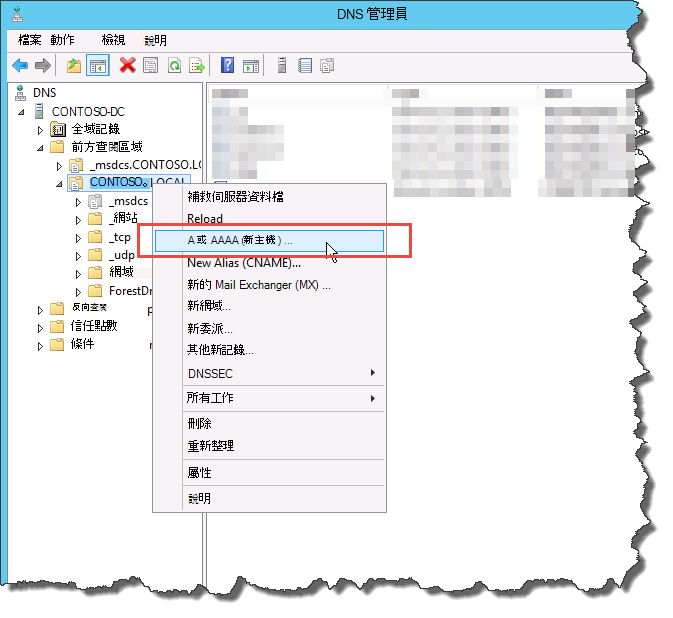

# 建立商務用 Skype Server 的 DNS 記錄
 
**摘要:** 瞭解如何為安裝商務用 Skype Server 設定 DNS 及建立 DNS 記錄。 從 Microsoft 評估中心下載免費試用版商務用 Skype Server, 網址為: [https://www.microsoft.com/evalcenter/evaluate-skype-for-business-server](https://www.microsoft.com/evalcenter/evaluate-skype-for-business-server)。
  
若要讓商務用 Skype 伺服器正常運作, 必須準備好多個網域名稱系統 (DNS) 設定。 這是為了讓客戶知道如何存取服務, 以及伺服器彼此瞭解的資訊。 這些設定只需要針對每個部署完成一次, 因為您指派 DNS 專案之後, 就能在整個網域中使用它。 您可以依照任何循序執行步驟1到5。 不過, 您必須在順序中執行步驟6、7和 8, 並在步驟1到5之後, 如圖表中所述。 建立 DNS 記錄的組成步驟 5 (共8個)。 如需規劃 DNS 的詳細資訊, 請參閱商務用 skype [server 2019 的](../../../SfBServer2019/plan/system-requirements.md)[商務用 Skype 伺服器](../../plan-your-deployment/requirements-for-your-environment/environmental-requirements.md)或伺服器需求的環境需求。
  
> [!IMPORTANT]
> 請務必注意, 這只是一個如何在 Windows 伺服器 DNS 環境中建立 DNS 記錄的範例。 商務用 Skype Server 必須有許多其他的 DNS 專案, 而且建立 DNS 記錄的程式取決於您在組織中用來管理 DNS 的系統。 如需 DNS 需求的完整清單, 請參閱[商務用 Skype Server 的 DNS 需求](../../plan-your-deployment/network-requirements/dns.md)。 
  

  
## 設定 DNS

商務用 Skype 伺服器需要 DNS 記錄才能正常運作, 且可供使用者存取。
  
這個範例是使用名為「pool. contoso」的 DNS 負載平衡 FQDN。 這個泳池由執行商務用 Skype Server Enterprise Edition 的三台伺服器所組成。 標準版前端伺服器只能包含一個伺服器。 使用標準版時, 您只會在參照前端角色時, 只使用單一標準版伺服器的完整功能變數名稱 (FQDN), 而不是建立 DNS 負載平衡的伺服器池, 如以下範例所示。 這個簡單的範例只使用前端角色, 包含下表中的 DNS 專案。 若要規劃您的特定 DNS 需求, 請參閱[商務用 Skype Server 的 DNS 需求](../../plan-your-deployment/network-requirements/dns.md)。 
  
 
|**說明**|**記錄類型**|**名稱**|**解析為**|**負載平衡類型**|
|:-----|:-----|:-----|:-----|:-----|
|內部 Web 服務 FQDN    |A    |webint    |內部 Web 服務的 VIP    |支援的軟體和硬體    |
|池 FQDN    |A    |contoso. 當地    |伺服器 SFB01 的 IP 位址    |DN    |
|SFB01 FQDN    |A    |SFB01    |伺服器 SFB01 的 IP 位址    |DN    |
|池 FQDN    |A    |contoso. 當地    |伺服器 SFB02 的 IP 位址    |DN    |
|SFB02 FQDN    |A    |SFB02    |伺服器 SFB02 的 IP 位址    |DN    |
|池 FQDN    |A    |contoso. 當地    |伺服器 SFB03 的 IP 位址    |DN    |
|SFB03 FQDN    |A    |SFB03    |伺服器 SFB03 的 IP 位址    |DN    |
|商務用 Skype 自動探索    |A    |lyncdiscoverinternal    |內部 Web 服務的 VIP    |支援的軟體和硬體    |
|[會議] 簡易 URL    |A    |符合 contoso. 當地    |內部 Web 服務的 VIP    |支援的軟體和硬體    |
|電話撥入式簡易 URL    |A    |contoso. 當地    |內部 Web 服務的 VIP    |支援的軟體和硬體    |
|網頁排程程式簡易 URL    |A    |contoso. 當地    |內部 Web 服務的 VIP    |支援的軟體和硬體    |
|管理簡易 URL    |A    |contoso. 當地    |內部 Web 服務的 VIP    |支援的軟體和硬體    |
|舊版探索    |DNS-SRV    |_sipinternaltls. _tcp    |池 FQDN (埠 5061)    |N/A    |
   
### 建立 DNS 記錄

1. 登入 DNS 伺服器, 然後開啟 [**伺服器管理員**]。
    
2. 按一下 [**工具**] 下拉式功能表, 然後按一下 [ **DNS**]。
    
3. 在您 SIP 網域的 [主控台樹] 中, 展開 [**轉寄查閱區域**], 然後展開要安裝商務用 Skype 伺服器的 SIP 網域。
    
4. 以滑鼠右鍵按一下 SIP 網域, 然後選取 **[新增主機 (A 或 AAAA)**], 如圖中所示。
    
     
  
5. 在 [**名稱**] 方塊中, 輸入主機記錄的名稱 (將會自動附加功能變數名稱)。
    
6. 在 [ **IP 位址**] 方塊中, 輸入個別前端伺服器的 IP 位址, 然後選取 [**建立相關的指標 (PTR) 記錄**] 或 **[允許任何經過驗證的使用者使用相同的擁有者名稱來更新 DNS 記錄**] (如果適用的話)。 請注意, 這假設 DNS 是用來在網路服務例外的情況下, 對所有流量進行負載平衡。 在這個範例中, 我們有三個前端伺服器, 如資料表所示。
    
   |**伺服器名稱**|**類型**|**資料**|
   |:-----|:-----|:-----|
   |SFB01    |主機 (A)    |10.0.0.5    |
   |SFB02    |主機 (A)    |10.0.0.6    |
   |SFB03    |主機 (A)    |10.0.0.7    |
   
7. 接下來, 建立該池的 DNS 負載平衡專案。 [DNS 負載平衡] 可讓 DNS 在使用相同的 DNS 池名稱時, 將要求傳送到池中的個別伺服器。 如需 DNS 和負載平衡的詳細資訊, 請參閱[商務用 Skype Server 的 DNS 需求](../../plan-your-deployment/network-requirements/dns.md)。 
    
    > [!NOTE]
    > 只有在企業版部署中, 才能將多個伺服器彙集在一起。 如果您要部署單一的企業伺服器或標準版伺服器, 您只需要建立單一伺服器的 A 記錄。 
  
    例如, 如果您有一個名為 [pool. contoso.] 和 [三台前端伺服器] 的池, 您會建立下列 DNS 專案:
    
   |**稱**|**類型**|**資料**|
   |:-----|:-----|:-----|
   |contoso. 當地    |主機 (A)    |10.0.0.5    |
   |contoso. 當地    |主機 (A)    |10.0.0.6    |
   |contoso. 當地    |主機 (A)    |10.0.0.7    |
   
8. 針對規劃的部署中的所有伺服器, 繼續建立記錄。 
    
9. 若要建立舊版探索的服務記錄 (SRV) 記錄, 請以滑鼠右鍵按一下 SIP 網域, 然後選取 [**其他新記錄**]。
    
10. 在 [**選取資源記錄類型**] 中, 按一下 **[服務位置 (SRV)**], 然後按一下 [**建立記錄**]。
    
11. 按一下 [**服務**], 然後輸入 **_sipinternaltls**。
    
12. 按一下 [**通訊協定**], 然後輸入 **_tcp**。
    
13. 按一下 [**埠號碼**], 然後輸入**5061**。
    
14. 按一下 [**主機提供此服務**], 然後輸入 Pool 或 Standard Edition 伺服器的 FQDN。
    
     ![[新增資源記錄] 對話方塊的螢幕擷取畫面。](../../media/54b1aac5-a2ec-41fe-90c0-02eaeaa9d1b4.png)
  
15. 按一下 **[確定]**, 然後按一下 [**完成**]。
    
### 驗證 DNS 記錄

1. 以已驗證使用者群組成員的帳戶登入網域中的用戶端電腦, 或擁有同等許可權。
    
2. 按一下 [**開始**], 然後輸入**cmd**, 然後按 enter。
    
3. 鍵入** \<標準版伺服器或單一企業版伺服器\>** 的** \<[\> nslookup FQDN** ], 然後按 enter。
    
4. 繼續針對您的部署驗證其餘的記錄。
    
5. 如果您支援舊版用戶端且已建立 SRV 記錄, 請在**nslookup**提示中輸入**set type = SRV** , 然後按 enter 鍵來驗證。
    
6. 輸入 **_sipinternaltls _tcp。*網域***(例如, _sipinternaltls), 然後按 Enter。
    
7. 預期的輸出應該與圖所示類似。 請注意, 並非所有的 DNS 記錄都顯示在樣本輸出中, 但應驗證所有記錄。 
    
     
  

