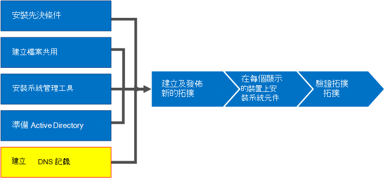

# 為商務用 Skype Server 建立 DNS 記錄
 
**摘要：** 瞭解如何為商務用 Skype Server 安裝設定 dns 及建立 dns 記錄。 從 Microsoft 評估中心下載免費試用版商務用 Skype Server，網址如下： [https://www.microsoft.com/evalcenter/evaluate-skype-for-business-server](https://www.microsoft.com/evalcenter/evaluate-skype-for-business-server) 。
  
為了讓商務用 Skype Server 能夠正常運作，) 設定的網域名稱系統 (DNS 設定必須已到位。 如此一來，用戶端就知道如何存取服務，以及讓伺服器瞭解彼此相關的資訊。 每個部署都只需要完成一次這些設定，因為一旦您指派 DNS 專案，它就會可用於整個網域。 您可以依任何循序執行步驟1到5。 不過，您必須依序執行步驟6、7和8，並在步驟1到5之後進行，如圖表中所述。 建立 DNS 記錄包含步驟5之8。 如需規劃 DNS 的詳細資訊，請參閱[商務用 Skype Server 2019 商務用 Skype Server 或伺服器需求](../../../SfBServer2019/plan/system-requirements.md)[的環境需求](../../plan-your-deployment/requirements-for-your-environment/environmental-requirements.md)。
  
> [!IMPORTANT]
> 請務必注意，這只是如何在 Windows 伺服器 DNS 環境中建立 DNS 記錄的範例。 商務用 Skype Server 還需要許多其他的 dns 專案，而建立 dns 記錄的程式取決於您用來管理組織中 DNS 的系統。 如需 dns 需求的完整清單，請參閱[商務用 Skype Server 的 DNS 需求](../../plan-your-deployment/network-requirements/dns.md)。 
  

  
## 設定 DNS

商務用 Skype Server 所需的 DNS 記錄，才能正常運作，且可供使用者存取。
  
此範例使用 DNS 負載平衡的 FQDN，其名稱為「集區. contoso。 此集區由三台執行商務用 Skype Server Enterprise Edition 的伺服器組成。 Standard Edition 前端伺服器只能包含一部伺服器。 使用 Standard Edition 時，在參照前端角色時，只會使用單一 Standard Edition 伺服器的完整功能變數名稱 (FQDN) ，而不是建立伺服器的 DNS 負載平衡集區，如此範例所示。 這種簡單的範例只使用前端角色，包含下表中的 DNS 專案。 若要規劃特定的 DNS 需求，請參閱[商務用 Skype Server 的 dns 需求](../../plan-your-deployment/network-requirements/dns.md)。 
  
 
|**描述**|**記錄類型**|**名稱**|**解析為**|**負載平衡類型**|
|:-----|:-----|:-----|:-----|:-----|
|內部 Web 服務 FQDN    |A    |webint    |內部 Web 服務的 VIP    |支援的軟體和硬體    |
|集區 FQDN    |A    |位於本地集區    |伺服器 SFB01 的 IP 位址    |DNS    |
|SFB01 FQDN    |A    |SFB01    |伺服器 SFB01 的 IP 位址    |DNS    |
|集區 FQDN    |A    |位於本地集區    |伺服器 SFB02 的 IP 位址    |DNS    |
|SFB02 FQDN    |A    |SFB02    |伺服器 SFB02 的 IP 位址    |DNS    |
|集區 FQDN    |A    |位於本地集區    |伺服器 SFB03 的 IP 位址    |DNS    |
|SFB03 FQDN    |A    |SFB03    |伺服器 SFB03 的 IP 位址    |DNS    |
|商務用 Skype自動探索    |A    |lyncdiscoverinternal    |內部 Web 服務的 VIP    |支援的軟體和硬體    |
|會議簡易 URL    |A    |符合 contoso local    |內部 Web 服務的 VIP    |支援的軟體和硬體    |
|撥入式簡易 URL    |A    |contoso. 本機    |內部 Web 服務的 VIP    |支援的軟體和硬體    |
|Web 排程程式簡易 URL    |A    |contoso. local    |內部 Web 服務的 VIP    |支援的軟體和硬體    |
|管理簡易 URL    |A    |contoso. 本機    |內部 Web 服務的 VIP    |支援的軟體和硬體    |
|舊版探索    |SRV    |_sipinternaltls _tcp    |集區 FQDN (埠 5061)     |不適用    |
   
### 建立 DNS 記錄

1. 登入 DNS 伺服器，然後開啟 [ **伺服器管理員**]。
    
2. 按一下 [ **工具** ] 下拉式功能表，然後按一下 [ **DNS**]。
    
3. 在 SIP 網域的主控台樹中，展開 [**正向對應區域**]，然後展開商務用 Skype Server 將安裝所在的 SIP 網域。
    
4. 以滑鼠右鍵按一下 SIP 網域，然後選取 [ **(A 或 AAAA) 新增主機**]，如圖所示。
    
     ![選取 [新增] 記錄。](../../media/f89c5c1f-b5b7-428c-a6e3-2bcd12e878c3.png)
  
5. 在 [ **名稱** ] 方塊中，輸入主機記錄的名稱 (功能變數名稱將會自動附加) 中。
    
6. 在 [ **IP 位址**] 方塊中，輸入個別前端伺服器的 IP 位址，然後選取 [ **建立關聯的指標 (PTR]) record** 或 **允許任何已驗證的使用者更新具有相同擁有者名稱的 DNS 記錄**（如果適用）。 請注意，這會假設 DNS 是用來在 web 服務例外的情況下，對所有流量進行負載平衡。 在此範例中，我們有三部前端伺服器，如上表所示。
    
   |**伺服器名稱**|**類型**|**資料**|
   |:-----|:-----|:-----|
   |SFB01    |主機 (A)    |10.0.0.5    |
   |SFB02    |主機 (A)    |10.0.0.6    |
   |SFB03    |主機 (A)    |10.0.0.7    |
   
7. 接下來，建立集區的 DNS 負載平衡專案。 DNS 負載平衡允許 DNS 在使用相同的 DNS 集區名稱時，將要求傳送至集區中的個別伺服器。 如需 dns 及負載平衡的詳細資訊，請參閱[商務用 Skype Server 的 dns 需求](../../plan-your-deployment/network-requirements/dns.md)。 
    
    > [!NOTE]
    > 將多部伺服器集在一起，只適用于 Enterprise Edition 部署。 如果您要部署單一 Enterprise 伺服器或 Standard Edition 伺服器，則只需要為單一伺服器建立 a 記錄。 
  
    例如，如果您有一個集區（即集區）和三台前端伺服器，則會建立下列 DNS 專案：
    
   |**FQDN**|**類型**|**資料**|
   |:-----|:-----|:-----|
   |位於本地集區    |主機 (A)    |10.0.0.5    |
   |位於本地集區    |主機 (A)    |10.0.0.6    |
   |位於本地集區    |主機 (A)    |10.0.0.7    |
   
8. 繼續為計畫部署中的所有伺服器建立記錄。 
    
9. 若要建立服務記錄 (SRV) 記錄以進行舊版探索，請在 SIP 網域上按一下滑鼠右鍵，然後選取 **其他新的記錄**。
    
10. 在 [ **選取資源記錄類型**] 中，按一下 [ **服務位置] (SRV)**]，然後按一下 [ **建立記錄**]。
    
11. 按一下 [ **服務**]，然後輸入 **_sipinternaltls**。
    
12. 按一下 [ **通訊協定**]，然後輸入 **_tcp**。
    
13. 按一下 [ **埠號碼**]，然後輸入 **5061**。
    
14. 按一下 [**提供這項服務的主機**]，然後輸入集區或 Standard Edition 伺服器的 FQDN。
    
     ![[新增資源記錄] 對話方塊的螢幕擷取畫面。](../../media/54b1aac5-a2ec-41fe-90c0-02eaeaa9d1b4.png)
  
15. 按一下 **[確定]**，然後按一下 [ **完成**]。
    
### 驗證 DNS 記錄

1. 使用已驗證使用者群組的成員帳戶，或具有相等許可權的帳戶，登入網域中的用戶端電腦。
    
2. 按一下 [ **開始**]，然後輸入 **cmd**，然後按 enter。
    
3. 輸入 **nslookup \<FQDN of the Front End pool\>** 或 **\<FQDN of the Standard Edition server or single Enterprise Edition server\>** ，然後按 enter 鍵。
    
4. 繼續檢查您部署的其餘部分記錄。
    
5. 如果您支援舊版用戶端並建立 SRV 記錄，請在 **nslookup** 命令提示中輸入 [ **set type = SRV** ]，然後按 enter。
    
6. 輸入 **_sipinternaltls _tcp。 *網域*** (例如，_sipinternaltls local) ，然後按 Enter。
    
7. 預期的輸出應類似圖所示。 請注意，並非所有的 DNS 記錄都會顯示在樣本輸出中，但應驗證所有記錄。 
    
     
  

