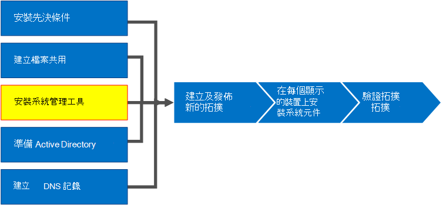
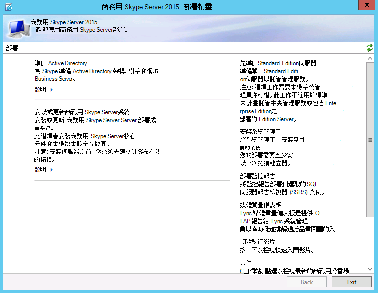
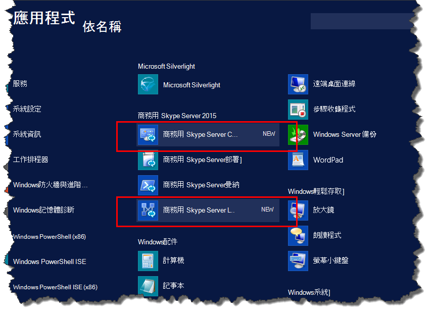

# 在商務用 Skype Server 中安裝系統管理工具
 
**摘要：** 瞭解如何安裝商務用 Skype Server 安裝所需的管理工具。 從 Microsoft 評估中心下載免費試用版商務用 Skype Server，網址為： [https://www.microsoft.com/evalcenter/evaluate-skype-for-business-server](https://www.microsoft.com/evalcenter/evaluate-skype-for-business-server)。
  
[管理工具] 包括 [拓撲建立器] 和 [控制台]。 系統管理工具必須安裝在拓撲中的至少一個伺服器，或是執行商務用 Skype Server 支援的 Windows OS 版本的64位管理工作站。 您可以依照任何循序執行步驟1到5。 不過，您必須在順序中執行步驟6、7和8，並在步驟1到5之後，如圖表中所述。 安裝 [管理工具] 是8的步驟3。
  

  
## 安裝商務用 Skype Server 系統管理工具

商務用 Skype Server 的安裝媒體提供彈性的體驗。 當您第一次執行 setup.exe 時，只會安裝 [商務用 Skype Server 部署] 嚮導和商務用 Skype Server 管理命令介面。 使用這兩個工具（稱為核心元件），您可以繼續安裝程式，但不會提供整個商務用 Skype 伺服器環境的主要功能。 安裝核心元件之後，就會自動啟動 [部署] 嚮導。 標題為 [**安裝管理工具**] 的 [部署嚮導] 區段會安裝商務用 Skype server 拓撲產生器和商務用 Skype server 控制台。
  
> [!IMPORTANT]
> 每個商務用 Skype Server 環境都必須至少有一個伺服器安裝了 [管理工具]。 
  
觀看**安裝管理工具**的影片步驟：
  
> [!video https://www.microsoft.com/en-us/videoplayer/embed/99a5c436-963b-4eed-b423-651568c87cb1?autoplay=false]
  
### 從 [部署] 嚮導安裝商務用 Skype Server 系統管理工具

1. 插入商務用 Skype Server 安裝媒體。 如果安裝程式沒有自動開始，請按兩下 [**設定**]。
    
2. 安裝媒體需要 Microsoft Visual c + + 才能執行。 隨即會彈出一個對話方塊，詢問您是否要安裝它。 按一下 **[是]**。
    
3. 您可以使用 [智慧設定] （在商務用 Skype Server 中的新功能）來連線至網際網路，在安裝程式中檢查更新。 如此一來，您就可以在安裝時，確認您的產品有最新的更新，從而提供更佳的體驗。 按一下 [**安裝**] 以開始安裝。
    
4. 仔細閱讀授權協定，如果您同意，請選取 [**我接受授權合約中的條款**]，然後按一下 **[確定]**。
    
5. 商務用 Skype Server 核心元件將會安裝在伺服器上。 
    
    核心元件包括下列各項，如圖所示。
    
    ![[應用程式] 畫面中的核心元件。](../../media/0da1d983-4c4b-4b23-a196-c3bdba4857c6.png)
  
   - **商務用 Skype Server 部署嚮導**提供啟動 pad 以安裝商務用 Skype Server 各種元件的部署程式。
    
   - **商務用 Skype Server Management 命令**介面可供您管理商務用 Skype Server 的預先設定 PowerShell 程式。
    
     核心元件的安裝完成後，商務用 Skype Server 部署嚮導就會自動啟動，如圖所示。 
    
     
  
6. 除了核心元件之外，您也需要在環境中至少有一台伺服器上安裝商務用 Skype Server 拓撲建立器和商務用 Skype Server 的 [控制台]。 按一下 [部署嚮導] 上的 [**安裝管理工具**]。
    
7. 按一下 **[下一步]** 以開始安裝。
    
8. 安裝完成後，請按一下 **[完成]**。 管理工具現已新增至伺服器，如圖所示。
    
    
  
   - **商務用 Skype Server 拓撲**建立器用來建立、部署及管理拓撲的程式。
    
   - **商務用 Skype Server**的 [控制台]用來管理安裝的程式。
    

