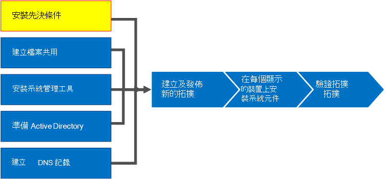

# 安裝商務用 Skype Server 的必要條件
 
**總結：** 瞭解您在安裝商務用 Skype Server 之前必須設定的伺服器和伺服器角色。 從[Microsoft 評估中心](https://www.microsoft.com/evalcenter/evaluate-skype-for-business-server)下載商務用 Skype Server 的免費試用版。
  
安裝必要條件包含在拓撲中的每一部伺服器上安裝必要的角色和功能，以設定 Windows 伺服器。 這些需求是以伺服器在拓撲中所能滿足的角色為基礎。 您可以依任何循序執行步驟1到5。 不過，您必須依序執行步驟6、7和8，並在步驟1到5之後進行，如圖表中所述。 安裝必要條件是步驟1之8。
  

  
## 安裝程式 Windows 伺服器

商務用 Skype Server 需要 Windows Server 作業系統和許多必要條件才能安裝。 如需規劃必要條件的詳細資訊，請參閱[商務用 Skype Server 的伺服器需求](../../../SfBServer2019/plan/system-requirements.md)。 
  
> [!TIP]
> 此程式使用 Windows Server 2012 R2。 如果您使用的是不同版本的 Windows 伺服器，程式可能會稍有不同。 
  
> [!IMPORTANT]
> 開始之前，請先使用 Windows Update，確定 Windows Server 是最新的。 
  

  
觀賞 **安裝必要條件** 的影片步驟：
  
> [!video https://www.microsoft.com/videoplayer/embed/02447c2a-5b26-432f-aad6-b9b05cc93478?autoplay=false]
  
### 為前端伺服器安裝必要的角色和功能

您可以使用伺服器管理員安裝必要的角色和功能。 
    
1. 安裝[商務用 Skype Server 的伺服器需求](../../../SfBServer2019/plan/system-requirements.md)中所列的必要軟體功能。 必要的軟體必須位於將執行商務用 Skype Server 的伺服器上。
    
    > [!CAUTION]
    > Windows Server 2012 R2 預設不會安裝必要功能的所有來源檔案。 如果伺服器未連線到網際網路，您必須插入 Windows Server 2012 R2 媒體，然後選取 [**指定替代來源路徑**]，以安裝必要的功能。 來源檔案位於 sources\sxs 目錄中。 例如，如果 Windows Server 2012 R2 媒體位於磁碟機 D，您會將路徑設定為 `d:\sources\sxs` 。 您必須從 Windows 更新中獲取最新更新，這一點很重要。 如果您未連線到網際網路，則必須手動安裝所有相關的更新，以及必要更新的任何必要條件。 
  
1. 當對話方塊指出安裝已完成時，您必須重新開機伺服器才能完成此程式。
    
1. 請再次執行 **Windows 更新**，檢查是否有安裝的角色和服務的任何更新。
    
1. 若要在此伺服器上使用商務用 Skype Server 控制台，您也必須安裝 Silverlight。 若要安裝 Silverlight，請參閱 [Microsoft Silverlight](https://www.microsoft.com/silverlight/)。

> [!IMPORTANT]
> 執行非前端伺服器角色的伺服器必要條件，例如 Director、Persistent Chat 或 Edge 的角色，都有自己的必要條件。 如需每種伺服器類型所需的確切必要條件的詳細資訊，請參閱[商務用 Skype Server 的伺服器需求](../../../SfBServer2019/plan/system-requirements.md)。 
  

