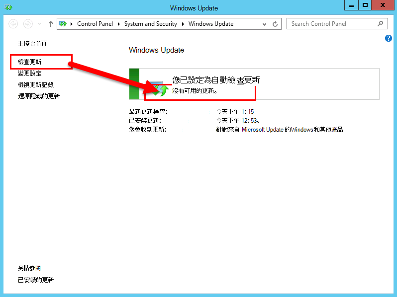

# 安裝商務用 Skype Server 的先決條件Install prerequisites for Skype for Business Server
 
**摘要:** 瞭解您必須先設定的伺服器和伺服器角色, 才能安裝商務用 Skype Server。**Summary:** Learn about the servers and server roles you must configure before you install Skype for Business Server. 從[Microsoft 評估中心](https://www.microsoft.com/evalcenter/evaluate-skype-for-business-server)下載商務用 Skype Server 的免費試用版。Download a free trial of Skype for Business Server from the [Microsoft Evaluation center](https://www.microsoft.com/evalcenter/evaluate-skype-for-business-server).
  
安裝先決條件包括在拓撲中的每個伺服器上安裝所需的角色和功能, 以設定 Windows Server。Installing prerequisites consists of setting up Windows Server by installing the required roles and features on each of the servers in the topology. 需求是以伺服器將在拓撲中履行的角色為基礎。The requirements are based on the role the server will fulfill in the topology. 您可以依照任何循序執行步驟1到5。You can do steps 1 through 5 in any order. 不過, 您必須在順序中執行步驟6、7和 8, 並在步驟1到5之後, 如圖表中所述。However, you must do steps 6, 7, and 8 in order, and after steps 1 through 5, as outlined in the diagram. 安裝必備元件是8的步驟1。Installing prerequisites is step 1 of 8.
  

  
## 設定 Windows ServerSetup Windows Server

商務用 Skype 伺服器需要具備 Windows Server 作業系統及幾個必備元件才能安裝。Skype for Business Server requires the Windows Server operating system and a number of prerequisites before it can be installed. 如需針對必備元件規劃的詳細資料, 請參閱[商務用 Skype server 的伺服器需求](../../../SfBServer2019/plan/system-requirements.md)。For details on planning for prerequisites, see [Server requirements for Skype for Business Server](../../../SfBServer2019/plan/system-requirements.md). 
  
> [!TIP]
> 此程式會使用 Windows Server 2012 R2。This procedure uses Windows Server 2012 R2. 如果您使用的是其他版本的 Windows Server, 程式可能會稍有不同。If you are using a different version of Windows Server, the procedure might be slightly different. 
  
> [!IMPORTANT]
> 在開始之前, 請先使用 Windows Update, 確定 Windows Server 是最新的。Before you begin, make sure that Windows Server is up-to-date by using Windows Update. 
  

  
請觀看**安裝必備元件**的影片步驟:Watch the video steps for **install prerequisites**:
  
> [!video https://www.microsoft.com/en-us/videoplayer/embed/02447c2a-5b26-432f-aad6-b9b05cc93478?autoplay=false]
  
### 安裝前端伺服器所需的角色和功能Install required roles and features for front-end servers

您可以使用伺服器管理員安裝必要的角色和功能。You can install the required roles and features using Server Manager. 
    
1. 安裝[商務用 Skype server 的伺服器需求](../../../SfBServer2019/plan/system-requirements.md)中所列的必備軟體功能。Install the prerequisite software features listed in [Server requirements for Skype for Business Server](../../../SfBServer2019/plan/system-requirements.md). 所需的軟體必須位於將執行商務用 Skype Server 的伺服器上。The required software must be on the server that will run Skype for Business Server.
    
    > [!CAUTION]
    > Windows Server 2012 R2 預設不會安裝所需功能的所有來源檔案。Windows Server 2012 R2 does not install all of the source files for the required features by default. 如果伺服器未連線至網際網路, 您將需要插入 Windows Server 2012 R2 媒體, 然後選取 [**指定替代來源路徑**] 來安裝所需的功能。If the server is not connected to the Internet, you will need to insert the Windows Server 2012 R2 media and select **Specify an alternate source path** in order to install the required features. 來源檔案位於 sources\sxs 目錄中。The source files are located in the sources\sxs directory. 例如, 如果 Windows Server 2012 R2 媒體位於磁片磁碟機 D, 您會將路徑設定為`d:\sources\sxs`。For example, if the Windows Server 2012 R2 media is in drive D, you would set the path to `d:\sources\sxs`. 您必須具備 Windows 更新中的最新更新, 才能使用這項功能。It is important that you have the latest updates from Windows Update. 如果您未連線至網際網路, 您將需要手動安裝所有相關的更新, 以及任何必要的更新。If you are not connected to the Internet, you will need to manually install all relevant updates as well as any prerequisites to the required updates. 
  
1. 當對話方塊指示安裝已完成時, 您必須重新開機伺服器才能完成程式。When the dialog box indicates that the installation has completed, you will need to reboot the server to complete the process.
    
1. 再次執行**Windows Update** , 以檢查是否有已安裝之角色和服務的任何更新。Run **Windows Update** again to check if there are any updates to the roles and services that were installed.
    
1. 如果您要在此伺服器上使用商務用 Skype Server 的 [控制台], 您也必須安裝 Silverlight。If you will be using Skype for Business Server Control Panel on this server then you must also install Silverlight. 若要安裝 Silverlight, 請參閱[Microsoft Silverlight](https://www.microsoft.com/silverlight/)。To install Silverlight, see [Microsoft Silverlight](https://www.microsoft.com/silverlight/).

> [!IMPORTANT]
> 執行伺服器 (例如 Director、永久聊天或邊緣角色) 等角色的伺服器必備元件有自己的先決條件。The prerequisites for servers performing roles other than front-end server, such as the role of Director, Persistent Chat, or Edge, have their own prerequisites. 如需每種伺服器類型所需的確切先決條件的詳細資訊, 請參閱[商務用 Skype server 的伺服器需求](../../../SfBServer2019/plan/system-requirements.md)。For details on the exact prerequisites required by each server type, see [Server requirements for Skype for Business Server](../../../SfBServer2019/plan/system-requirements.md). 
  

