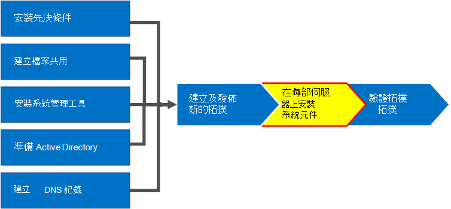
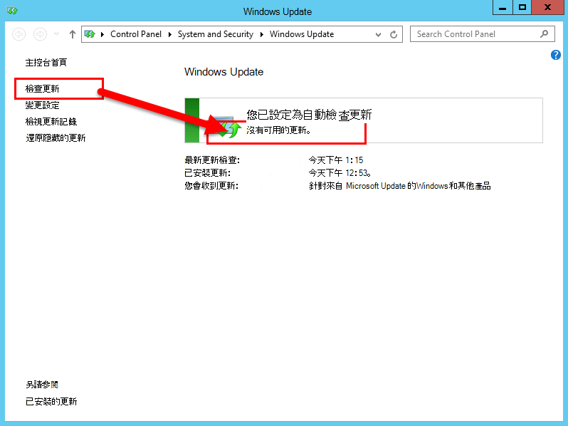
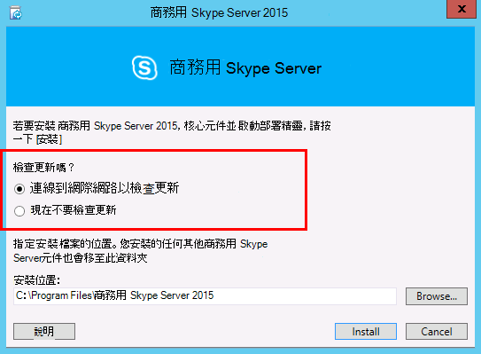
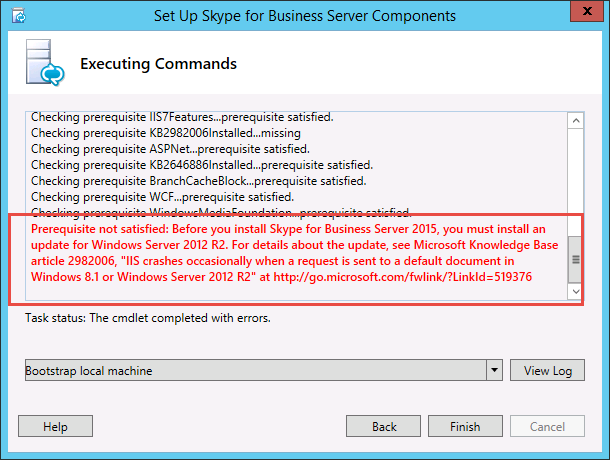
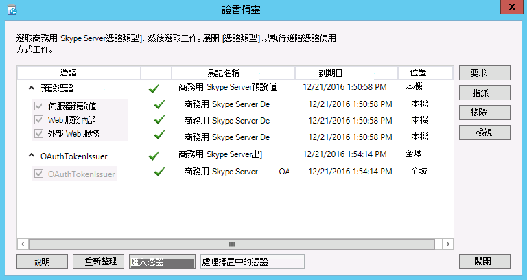

# 在拓撲中的伺服器上安裝商務用 Skype Server
 
**摘要：** 瞭解如何在拓撲中的每一部伺服器上安裝商務用 Skype Server 系統元件。 從 [Microsoft 評估中心](https://www.microsoft.com/evalcenter/evaluate-skype-for-business-server)下載商務用 Skype Server 免費試用版。
  
將拓撲載入至中央管理存放區並使用 Active Directory 知道哪些伺服器會執行哪些角色後，您需要在拓撲中的每一部伺服器上安裝商務用 Skype Server 系統。 您可以依任何循序執行步驟1到5。 不過，您必須依序執行步驟6、7和8，並在圖表中所述的步驟1到5之後進行。 安裝商務用 Skype Server 系統是步驟7之8。
  

  
## 安裝商務用 Skype Server 系統

發行拓撲之後，您可以在拓撲的每部伺服器上安裝商務用 Skype Server 元件。 本節會逐步引導您安裝商務用 Skype 伺服器及設定前端集區的伺服器角色，以及與前端伺服器組合的任何伺服器角色。 若要安裝及設定伺服器角色，請在要安裝伺服器角色的每一部電腦上執行商務用 Skype Server 部署嚮導。 您可以使用部署嚮導完成所有四個部署步驟，包括安裝本機設定存放區、安裝前端伺服器、設定憑證及啟動服務。
  
> [!IMPORTANT]
> 您必須先使用拓撲產生器，才可在伺服器上安裝商務用 Skype Server 之前，先完成併發行拓撲。 
  
> [!NOTE]
> 您必須為拓撲中的所有伺服器完成此程式。 
  
> [!CAUTION]
> 在前端伺服器上安裝商務用 Skype Server 之後，第一次啟動服務時，必須確定伺服器上正在執行 Windows 防火牆服務。 
  
> [!CAUTION]
> 在您遵循這些步驟之前，請確定您已使用本機系統管理員和 RTCUniversalServerAdmins 群組成員的網域使用者帳戶登入伺服器。 
  
> [!NOTE]
> 如果您之前未在此伺服器上執行商務用 Skype Server 安裝程式，系統會提示您輸入要安裝的磁片磁碟機和路徑。 如果您的組織需要，也可讓您將其安裝至除系統磁片磁碟機以外的其他磁碟機，或您有空間考慮。 您可以在 [ **安裝程式** ] 對話方塊中，將商務用 Skype Server 檔案的安裝位置路徑變更為新的可用磁片磁碟機。 如果您將安裝檔案安裝至此路徑（包括 OCSCore.msi），則其他商務用 Skype Server 檔案也會同時部署。
  
> [!IMPORTANT]
> 開始安裝之前，請先使用 Windows Update 確定 Windows Server 是最新的。 
  

  
### 安裝商務用 Skype Server 系統

1. 插入商務用 Skype Server 安裝媒體。 如果安裝程式未自動開始，請按兩下 [ **設定**]。
    
2. 安裝媒體需要 Microsoft Visual c + + 才能執行。 隨即會彈出一個對話方塊，詢問您是否要安裝它。 按一下 **[是]。**
    
3. 請仔細閱讀授權合約，如果同意，請選取 [ **我接受授權合約中的條款**]，然後按一下 **[確定]**。 
    
4. Smart Setup 是商務用 Skype Server 中的功能，您可以在此伺服器上連線到網際網路，以在安裝程式期間從 Microsoft Update (MU) 中檢查更新，如圖所示。 這可讓您瞭解產品的最新更新，以獲得較佳的體驗。 按一下 **[安裝]** 開始安裝。
    
    > [!NOTE]
    > 許多組織在其公司環境中部署了 Windows Server Update Services (WSUS) 。 WSUS 可讓系統管理員完全管理透過 Microsoft Update 發佈至其網路中電腦的更新發佈。 「累積更新1版本的商務用 Skype 伺服器」的一部分，引進了對 Smart 安裝程式的支援，可搭配 WSUS 使用。 使用 WSUS 進行商務用的 WSUS 是第一次部署商務用 Skype Server 或從 Lync Server 2013 環境升級使用 In-Place 升級功能時，將會從 WSUS 取得 Windows 更新的智慧安裝程式，而不是從 MU 回遷更新。 想要使用 Smart Setup 的客戶必須先于所有機器上執行 SmartSetupWithWSUS，再執行 Setup.exe。 
  
     
  
5. 在 [部署嚮導] 頁面上，按一下 [ **安裝或更新商務用 Skype Server 系統**]。
    
6. 執行下列程式中的程式時， **請按一下 [** 結束] 以關閉部署嚮導。 針對集區中的每一部前端伺服器重複此程式。
    
### 步驟1：安裝本機設定存放區

1. 複查必要條件，然後按一下 [**步驟1：安裝本機設定存放區**] 旁邊的 [**執行**]。
    
    > [!NOTE]
    > 本機設定存放區是中央管理存放區的唯讀複本。 在 Standard Edition 部署中，會使用前端伺服器上的 SQL Server Express Edition 的本機複本建立中央管理存放區。 當您執行 Prepare First Standard Edition Server 程式時，就會發生這種情況。 在 Enterprise Edition 部署中，當您發佈包含 Enterprise Edition 前端集區的拓撲時，就會建立中央管理存放區。 
  
2. 在 [ **安裝本機設定存放區** ] 頁面上，確定已選取 [ **直接從中央管理存放區取得** ] 選項，然後按 **[下一步]**。
    
    在本機伺服器上安裝 SQL Server Express Edition。 本機設定存放區需要 SQL Server Express Edition。
    
3. 當本機伺服器設定安裝完成時，按一下 **[完成]**。
    
### 步驟2：設定或移除商務用 Skype Server 元件

1. 複查必要條件，然後按一下 [**步驟2：安裝或移除商務用 Skype Server 元件**] 旁邊的 [**執行**]。
    
2. 在 [ **設定商務用 Skype 伺服器元件** ] 頁面上，按 **[下一步]** ，依照您已發佈的拓撲中所定義的方式來設定元件。
    
3. [ **執行命令** ] 頁面會在設定進行時顯示命令和安裝資訊的摘要。 完成後，您可以使用清單選取要查看的記錄檔，然後按一下 [ **查看記錄**檔]。
    
4. 當商務用 Skype Server 元件安裝完畢並且您已視需要複查記錄時，請按一下 **[完成]** ，以在安裝中完成此步驟。
    
    > [!NOTE]
    > 如果出現提示，請重新開機伺服器 (若 Windows 桌面體驗需要安裝) ，可能會發生此情況。 當電腦重新備份及執行時，您必須執行此 (步驟2：設定或移除商務用 Skype Server 元件) 過程。 
  
    > [!NOTE]
    > 如果安裝程式找到任何未滿足的必要條件，您將會收到「先決條件未滿足」訊息的通知，如圖所示。 滿足必要的必要條件，然後開始此 (步驟2：設定或移除商務用 Skype Server 元件) 程式。 
  
     
  
5. 驗證前兩個步驟是否如預期完成。 確認 word **完成**時出現綠色核取記號（如圖所示）。
    
     
  
6. 在您安裝商務用 Skype Server 元件後，再次執行 **Windows 更新** 以檢查是否有任何更新。
    
### 步驟3：要求、安裝或指派憑證

1. 複查必要條件，然後按一下 [**步驟3：要求、安裝或指派憑證**] 旁邊的 [**執行**]。
    
    > [!NOTE]
    > 商務用 Skype 伺服器包括對 SHA-2 套件的支援 (SHA-2 使用摘要的224、256、384或 512 bits) 的摘要雜湊和簽署演算法，以用於來自執行 Windows 10、Windows 8、Windows 7、Windows Server 2012 R2、Windows Server 2012 或 Windows Server 2008 R2 作業系統之用戶端的連線。 若要使用 SHA-2 套件來支援外部存取，外部憑證是由公用 CA 所發出，也可以使用相同位長度的摘要來發出憑證。 
  
    > [!IMPORTANT]
    > 您可以選擇哪些雜湊摘要和簽署演算法取決於用戶端和將使用憑證的伺服器，以及用戶端和伺服器要與其通訊的其他電腦和裝置，也必須瞭解如何使用憑證中所用的演算法。 如需作業系統和某些用戶端應用程式中支援摘要長度的詳細資訊，請參閱 [WINDOWS PKI 博客-SHA2 和 Windows](https://go.microsoft.com/fwlink/p/?LinkId=287002)。 
  
    每個 Standard Edition 或前端伺服器最多需要四個憑證： oAuthTokenIssuer 憑證、預設憑證、網頁內部憑證和網頁外部憑證。 不過，您可以使用適當的主體替代名稱專案以及 oAuthTokenIssuer 憑證要求並指派單一預設憑證。 如需憑證需求的詳細資訊，請參閱商務用 skype server 的 [環境需求](../../plan-your-deployment/requirements-for-your-environment/environmental-requirements.md) 或 [商務用 skype Server 2019 的伺服器需求](../../../SfBServer2019/plan/system-requirements.md)。
    
    > [!IMPORTANT]
    > 下列程式說明如何根據內部 Active Directory 憑證服務的憑證授權單位單位來設定憑證。 
  
2. 在 **[憑證精靈]** 頁面中，按一下 **[要求]**。
    
3. 在 [ **憑證要求** ] 頁面上，填入相關的資料，包括選取 [SIP 網域]，然後按 **[下一步]**。
    
4. 在 [**延遲或立即要求**] 頁面上，按一下 **[下一步]**，可接受預設**立即將要求傳送到線上憑證授權單位**單位選項。 如果您選取此選項，則必須使用具有自動線上註冊的內部 CA。 如果您選擇延遲要求的選項，系統會提示您輸入名稱和位置，以儲存憑證要求檔案。 憑證要求必須由組織內的 CA 或公用 CA 所呈現及處理。 接著，您將需要匯入憑證回應，並將它指派給適當的憑證角色。
    
5. 在 [ **選擇憑證授權單位單位 (CA) ** ] 頁面上，選取 [ **從環境中偵測到的清單選取 CA** ] 選項，然後從清單中的 Active DIRECTORY 網域服務) CA 註冊，以選取已知 (。 或者，選取 [ **指定另一個憑證授權單位** 單位] 選項，然後在方塊中輸入另一個 CA 的名稱，然後按 **[下一步]**。
    
6. 在 [ **憑證授權單位單位帳戶** ] 頁面上，系統會提示您輸入認證要求並處理 CA 的憑證要求。 您應該已確定使用者名稱和密碼是否需要預先要求憑證。 CA 管理員將會提供必要的資訊，而且可能需要在此步驟中協助您。 如果您需要提供替代認證，請選取 [核取方塊]，在文字方塊中提供使用者名稱和密碼，然後按 **[下一步]**。
    
7. 在 [ **指定替代的憑證範本** ] 頁面上，若要使用預設 Web 服務器範本，請按 **[下一步]**。
    
    > [!NOTE]
    > 如果您的組織已建立用作預設網頁伺服器 CA 範本的替代範本，請選取核取方塊，然後輸入備用範本的名稱。 您將需要 CA 管理員所定義的範本名稱。 
  
8. 在 [ **名稱和安全性設定** ] 頁面上，指定 **好記的名稱**。 使用好記的名稱，您可以快速識別憑證和用途。 如果保留空白，則會自動產生名稱。 設定機碼的 **位長度** ，或接受預設值2048位。 選取 [將 **憑證的私密金鑰標記為可匯出** ] 如果您決定要將憑證和私密金鑰移動或複製到其他系統，請按一下 [ **下一步]**。
    
    > [!NOTE]
    > 商務用 Skype 伺服器具有可匯出私密金鑰的最低需求。 其中一個地方是在集區中的 Edge Server 上，媒體轉送驗證服務使用憑證的副本，而不是集區中每個實例的個別憑證。 
  
9. 在 [ **組織資訊** ] 頁面上，選擇提供組織資訊，然後按 **[下一步]**。
    
10. 在 [ **地理資訊** ] 頁面上，選擇提供地理資訊，然後按 **[下一步]**。
    
11. 在 [ **主體名稱/主體替代名稱** ] 頁面上，複查將要新增的主體替代名稱，然後按 **[下一步]**。
    
12. 在 [ **SIP 網域設定** ] 頁面上，選取 [ **sip 網域**]，然後按 **[下一步]**。
    
13. 在 [ **設定其他主體替代名稱** ] 頁面上，新增任何其他必要的主體別名，包括未來其他 SIP 網域可能需要的主體替代名稱，然後按 **[下一步]**。
    
14. 在 [ **憑證要求摘要** ] 頁面上，複查摘要中的資訊。 如果資訊正確，按 **[下一步]**。 如果您需要更正或修改設定，請按一下 [ **回到** 正確的頁面]，以進行更正或修改。
    
15. 在 **[執行命令]** 頁面上，按 **[下一步]**。
    
16. 在 [ **線上憑證要求狀態** ] 頁面上，複查傳回的資訊。 您應注意，已簽發憑證並將其安裝至本機憑證儲存區。 若報告為已簽發並已安裝，但無效，請確定伺服器的根信任 CA 存放區中已安裝 CA 的根憑證。 請參閱您的 CA 檔，瞭解如何取得信任的根 CA 憑證。 如果您需要查看已檢索的憑證，請按一下 [ **查看憑證詳細資料**]。 根據預設，會選取 [ **指派憑證給商務用 Skype 伺服器憑證** 的] 核取方塊。 若要手動指派憑證，請清除核取方塊，然後按一下 **[完成]**。
    
17. 如果您已清除 [ **將憑證指派給舊版的商務用 Skype 伺服器憑證使用** 方式] 核取方塊，將會出現 [ **憑證指派** ] 頁面。 按 [下一步]****。
    
18. 在 [ **憑證存放區** ] 頁面上，選取您要求的憑證。 如果您想要查看憑證，請按一下 [ **查看憑證詳細資料**]，然後按 **[下一步]** 繼續。
    
    > [!NOTE]
    > 如果 [ **線上憑證要求狀態** ] 頁面上報告憑證有問題，例如憑證無效，請查看實際的憑證，以取得解決問題的協助。 兩個可能造成憑證無法使用的特定問題，都是先前提及的遺失信任的根 CA 憑證，以及與憑證相關聯的遺失私密金鑰。 請參閱 CA 檔，以解決這兩個問題。
  
19. 在 [ **憑證指派摘要** ] 頁面上，複查所呈現的資訊，確定這是應該指派的憑證，然後按 **[下一步]**。
    
20. 在 [ **執行命令** ] 頁面上，複查命令的輸出。 如果您想要複查指派程式，或是發出錯誤或警告，請按一下 [ **View Log** ]。 完成審閱後，請按一下 **[完成]**。
    
21. 在 [ **憑證] 嚮導** 頁面上，確認 [所有服務] 都有綠色的勾選標記，表示所有的服務均已獲指派憑證，包括 OAuthTokenIssuer，如圖所示，然後按一下 [ **關閉**]。
    
     
  
    > [!TIP]
    > 如果您是在實驗室環境中安裝，而且只是使用 Active Directory 憑證服務設定憑證授權單位單位，則您必須重新開機執行憑證服務的伺服器，以及前端伺服器，之後才能成功地完成憑證指派。 
  
    > [!TIP]
    >  如需 Active Directory 憑證服務中憑證的詳細資訊，請參閱 [Active Directory 憑證服務](https://technet.microsoft.com/windowsserver/dd448615.aspx)。 
  
### 步驟4：啟動服務

1. 請參閱 **步驟4：啟動服務**的必要條件。
    
2. 如果這是具有至少三台伺服器的 Enterprise Edition 前端集區，則會使用 Windows Fabric，您必須使用 **get-cspool** Cmdlet。 如果使用單一伺服器（通常是使用 Standard Edition 的情況），您 muse 使用 **Start-CsWindowsService** Cmdlet。 在此範例中，我們使用 Enterprise Edition 搭配集區中的三部前端伺服器，開啟 **商務用 Skype Server 管理命令** 介面，並執行 **get-cspool 指令程式** （如圖所示）。 對於所有其他角色（包括 Standard Edition server），您必須使用 **Start-CsWindowsService**。 若要部署前端角色以外的角色，請參閱檔中的特定角色。
    
     
  
3. 在 **[執行命令]** 頁面上順利啟動所有服務之後，按一下 **[完成]**。
    
    > [!IMPORTANT]
    > 在伺服器上啟動服務的命令是一項最佳的方式，可報表服務實際已開始。 它可能不會反映服務的實際狀態。 建議您使用 step **Service Status (Optional) ** 開啟 Microsoft Management CONSOLE (MMC) ，並確認服務是否已順利啟動，如圖所示。 若尚未啟動任何商務用 Skype Server 服務，您可以在 MMC 中以滑鼠右鍵按一下該服務，然後按一下 [ **啟動**]。 
  
     
  

