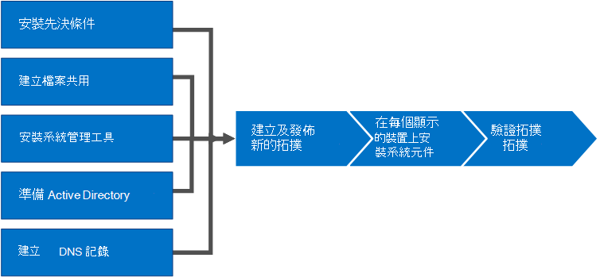

# 安裝商務用 Skype ServerInstall Skype for Business Server
 
**摘要:** 瞭解如何在安裝商務用 Skype Server 時準備您的環境。**Summary:** Learn how to prepare your environment for an installation of Skype for Business Server. 從 Microsoft 評估中心下載免費試用版商務用 Skype Server, 網址為:[https://www.microsoft.com/evalcenter/evaluate-skype-for-business-server](https://www.microsoft.com/evalcenter/evaluate-skype-for-business-server)。Download a free trial of Skype for Business Server from the Microsoft Evaluation center at:[https://www.microsoft.com/evalcenter/evaluate-skype-for-business-server](https://www.microsoft.com/evalcenter/evaluate-skype-for-business-server).
  
本文將引導您完成商務用 Skype Server 的安裝範例。This article walks you through an example installation of Skype for Business Server. 本文不會嘗試涵蓋執行完整商務用 Skype Server 安裝所需的所有程式。This article does not attempt to cover all of the procedures you need to perform a full Skype for Business Server installation. 其目標是在定義的拓撲中提供範例程式, 其中包含基本的 [會見與共享] 功能。The goal is to provide example procedures in a narrowly defined topology that includes basic meet-and-share functionality.
  
## 商務用 Skype Server 的安裝程式概覽Overview of the install process for Skype for Business Server

安裝商務用 Skype Server 包含許多不同的程式。An installation of Skype for Business Server includes many different procedures. 在您的環境中執行商務用 Skype 伺服器所需的程式, 取決於您的環境細節。The procedures you need to get Skype for Business Server running in your environment depend on the specifics of your environment. 例如, 如果您使用的是 DNS 的 Windows Server, 您將能從新增 DNS 專案的範例程式獲益。For example, if you are using Windows Server for DNS, you will benefit from the example procedure for adding a DNS entry. 如果您使用其他的 DNS 系統, 您必須遵循特定 DNS 系統的程式。If you use another system for DNS, you need to follow procedures for your particular DNS system. 此區段中的許多程式都是如此。This is true for many of the procedures in this section.
  
商務用 Skype 伺服器可在標準版和企業版中使用。Skype for Business Server is available in Standard Edition and Enterprise Edition. 主要差異是標準版不支援企業版中包含的高可用性功能。The main difference is that Standard Edition does not support the high availability features that are included with Enterprise Edition. 
  
商務用 Skype Server 是一種先進的產品, 而確切的安裝程式則取決於您特定的情況。Skype for Business Server is an advanced product, and the exact installation process depends a great deal on your specific circumstances. 本節會逐步引導您完成安裝產品的一般步驟。This section walks you through the general steps to install the product. 不過, 根據您的環境和規劃決定, 每個程式可能會有所不同。However, each procedure might be different depending on your environment and planning decisions. 例如, 對於小型組織而言, 執行商務用 Skype Server Standard Edition 可能是適當的, 而大型跨國公司組織可能會在全球各地專用於產品的50伺服器。For example, for small organizations a single server, running Skype for Business Server Standard Edition might be appropriate, whereas a large multinational organization might have 50 servers at locations around the world dedicated to the product.
  
> [!NOTE]
> 若要瞭解最新的累計更新, 請參閱[商務用 Skype Server 更新](https://support.microsoft.com/en-us/kb/3061064)。To learn about the latest Cumulative Updates, see [Updates for Skype for Business Server](https://support.microsoft.com/en-us/kb/3061064). 安裝 CU1 修補程式後, 系統管理員必須執行`Update-CsAdminRole` Cmdlet。After installing the CU1 patch an administrator needs to execute the  `Update-CsAdminRole` cmdlet. 需要使用此 Cmdlet 來存取遠端 PowerShell 中的新 GCP Cmdlet。This cmdlet is required to access the new GCP cmdlets over Remote PowerShell.
  
> [!IMPORTANT]
> 此區段中的程式是使用一組定義的需求, 並假設已經進行特定決策的範例。The procedures in this section serve as an example using a narrowly defined set of requirements and assume specific decisions have already been made. 安裝商務用 Skype Server 所需的實際程式可能會有很大的差異。The actual procedures you need to install Skype for Business Server will likely be very different. 在每個環境中, 請使用本節中的程式做為範例, 而不是作為安裝商務用 Skype Server 的逐步指南。Use the procedures in this section as an example only and not as a step-by-step guide for installing Skype for Business Server in every environment. 
  
第一次取得商務用 Skype 伺服器並執行的步驟包括八個主要步驟。Getting Skype for Business Server up and running for the first time involves eight primary steps. 您應該瞭解本節中的範例程式不是安裝商務用 Skype Server 所需的唯一程式。You should understand that the example procedures in this section are not the only procedures required for installing Skype for Business Server. 下列八個步驟只是協助您進一步瞭解整個程式, 並讓基本工作環境正常運作的範例。The following eight steps are simply examples to help you better understand the overall process and get a basic working environment up and running. 您可以依照任何循序執行步驟1到5。You can do steps 1 through 5 in any order. 不過, 您必須在順序中執行步驟6、7和 8, 並在步驟1到5之後, 如圖表中所述。However, you must do steps 6, 7, and 8 in order, and after steps 1 through 5, as outlined in the diagram. 8個步驟如下:The eight steps are:
  

  
- [安裝商務用 Skype server 的先決條件](install-prerequisites.md): 在組成商務用 skype server 拓撲的所有伺服器上安裝系統必備。[Install prerequisites for Skype for Business Server](install-prerequisites.md) : Install prerequisites on all servers that make up the Skype for Business Server topology. 請注意, 所有角色的先決條件都不相同。Note that prerequisites are not the same for all roles. 例如, 提供前端角色的伺服器會有一組先決條件, 而提供主管角色的伺服器則具有不同的先決條件組。For example, servers that provide the front-end role have a set of prerequisites, and servers that provide a director role have a different set of prerequisites. 如需詳細資訊, 請參閱必備元件規劃檔。See prerequisite planning documentation for more details.
    
- [在商務用 Skype server 中建立檔案共用](create-a-file-share.md): 建立將在整個商務用 skype server 拓撲結構中供伺服器使用的檔案共用。[Create a file share in Skype for Business Server](create-a-file-share.md) : Create a file share that will be used by servers throughout the Skype for Business Server topology.
    
- [在商務用 Skype Server 中安裝系統管理工具](install-administrative-tools.md): 管理工具組括拓撲建立器和 [控制台]。[Install administrative tools in Skype for Business Server](install-administrative-tools.md) : The administrative tools include Topology Builder and Control Panel. 您必須在拓撲中至少有一個伺服器上安裝管理工具, 或是在執行商務用 Skype Server 支援的 Windows OS 版本的64位管理工作站。You must install the administrative tools on at least one server in the topology or a 64-bit management workstation running a Windows OS version that is supported for Skype for Business Server.
    
- [為商務用 Skype Server 準備 Active directory](prepare-active-directory.md) : 商務用 skype 伺服器與 Active directory 密切搭配使用。[Prepare Active Directory for Skype for Business Server](prepare-active-directory.md) : Skype for Business Server works closely with Active Directory. 您必須準備 Active Directory 網域, 才能搭配商務用 Skype 伺服器使用。You must prepare the Active Directory domain to work with Skype for Business Server. 您可以透過 [部署嚮導] 來執行此動作, 而且只會針對網域進行一次。You can do this through the Deployment Wizard, and it is only done once for the domain. 這是因為程式會建立群組並修改網域, 而您只需要執行一次。This is because the process creates groups and modifies the domain, and you need to do that only once.
    
- [建立商務用 Skype server 的 DNS 記錄](create-dns-records.md): 若要讓商務用 skype 伺服器正常運作, 必須有許多 DNS 設定。[Create DNS records for Skype for Business Server](create-dns-records.md) : In order for Skype for Business Server to work properly, a number of DNS settings must be in place. 這是為了讓客戶知道如何存取服務, 以及伺服器彼此瞭解的相關資訊。This is so that clients know how to access the services and the servers know about each other. 這些設定只需要針對每個部署完成一次, 因為指派 DNS 專案之後, 就能在整個網域中使用它。These settings only need to be completed once per deployment because once you assign a DNS entry, it is available throughout the domain.
    
- [在商務用 Skype server 中建立及發佈新的拓朴](create-and-publish-new-topology.md): 您必須先建立拓撲併發布, 才能在拓撲中的每個伺服器上安裝商務用 skype server 系統。[Create and publish new topology in Skype for Business Server](create-and-publish-new-topology.md) : Before you can install the Skype for Business Server system on each of the servers in the topology, you must create a topology and publish it. 當您發佈拓撲時, 會將拓撲資訊載入到中央管理儲存資料庫中。When you publish a topology, you are loading the topology information into the Central Management Store database. 如果這是企業版文件庫, 當您第一次發佈新的拓撲時, 就會建立中央管理儲存資料庫。If this is an Enterprise Edition pool, you are creating the Central Management Store database the first time you publish a new topology. 如果這是標準版, 您必須先從 [部署嚮導] 執行 [準備第一個標準版伺服器] 程式, 然後才能發佈拓撲。If this is Standard Edition, you need to run the Prepare First Standard Edition Server process from the Deployment Wizard before you publish a topology. 這是為了準備標準版本, 只要安裝 SQL Server Express Edition 實例並建立中央管理儲存。This prepares for Standard Edition by installing a SQL Server Express Edition instance and creating the Central Management Store.
    
- 在[拓撲中的伺服器上安裝商務用 Skype Server](install-skype-for-business-server.md) : 一旦將拓撲載入到中央管理儲存體, 且 Active Directory 知道哪些伺服器將會執行哪些角色, 您必須在每個伺服器上安裝商務用 skype server 系統拓撲中的伺服器。[Install Skype for Business Server on servers in the topology](install-skype-for-business-server.md) : Once the topology is loaded into the Central Management Store and Active Directory knows which servers will perform which roles, you need to install the Skype for Business Server system on each of the servers in the topology.
    
- [在商務用 Skype server 中驗證拓朴](verify-the-topology.md): 當您已發佈拓撲, 且已在拓撲結構中的每個伺服器上安裝商務用 Skype Server system 元件之後, 您就可以開始確認拓撲結構是否如預期一樣運作。[Verify the topology in Skype for Business Server](verify-the-topology.md) : After you have the topology published and the Skype for Business Server system components installed on each of the servers in the topology, you are ready to verify that the topology is working as expected. 這包括驗證設定是否已傳播到所有的 Active Directory 伺服器, 讓整個網域知道該網域中的商務用 Skype。This includes verifying that the configuration has propagated out to all of the Active Directory servers so that the entire domain knows that Skype for Business is available in the domain.
    

