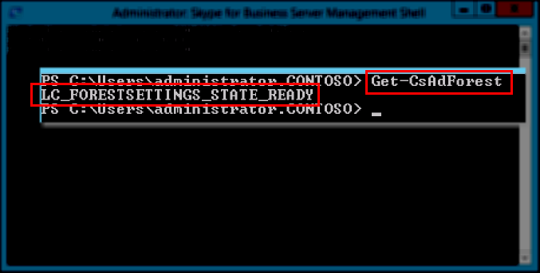

# <a name="skype-for-business-server-prepare-active-directory"></a>商務用 Skype Server：準備 Active Directory
 
**總結：** 瞭解如何準備 Active Directory 網域以安裝 商務用 Skype Server。
  
商務用 Skype Server與 Active Directory 密切合作。 您必須準備 Active Directory 網域才能使用商務用 Skype Server。 此程式會在部署精靈中完成，而且只會針對網域完成一次。 這是因為程式會建立群組並修改網域，而且您只需要執行一次。 您可以依任何循序執行步驟 1 到 5。 不過，您必須依序執行步驟 6、7 和 8，以及步驟 1 到 5 之後，如圖表中所述。 準備 Active Directory 是步驟 8 的步驟 4。 如需規劃 Active Directory 的詳細資訊，請參閱[商務用 Skype Server](../../plan-your-deployment/requirements-for-your-environment/environmental-requirements.md)環境需求或[2019 商務用 Skype Server伺服器](../../../SfBServer2019/plan/system-requirements.md)需求。
  

  
## <a name="prepare-active-directory"></a>準備 Active Directory

商務用 Skype Server與 Active Directory 網域服務 (AD DS) 緊密整合。 必須先備妥 Active Directory，才能第一次安裝商務用 Skype Server。 標題為 **[準備 Active Directory]** 的 [部署精靈] 區段會準備 Active Directory 環境以搭配商務用 Skype Server使用。
  
> [!NOTE]
> 商務用 Skype Server使用 (AD DS) 來追蹤拓撲中的所有伺服器並與之通訊。 這些伺服器大部分都必須加入網域，商務用 Skype Server才能正常運作。 請記住，Edge 和反向 Proxy 等伺服器不應該加入網域。
  
> [!IMPORTANT]
> 準備 Active Directory 程式應該只針對部署中的每個網域執行一次。 
  
觀看 **準備 Active Directory** 的影片步驟：
  
> [!video https://www.microsoft.com/videoplayer/embed/RE1Ybuk]
  
### <a name="prepare-active-directory-from-the-deployment-wizard"></a>從部署精靈準備 Active Directory

1. 以具有 Active Directory 網域架構管理員認證的使用者身分登入。
    
2. 開啟 [商務用 Skype Server部署精靈]。
    
    > [!TIP]
    > 如果您想要檢閱商務用 Skype Server部署精靈所建立的記錄檔，您可以在執行部署精靈的電腦上，于執行此步驟之 AD DS 使用者的 [使用者] 目錄中找到這些記錄檔。 例如，如果使用者以 contoso.local 網域中的網域系統管理員身分登入，記錄檔會位於：C：\Users\Administrator.Contoso\AppData\Local\Temp。 
  
3. 按一下 **[準備 Active Directory]** 連結。
    
4. **步驟 1：準備架構**
    
    a. 檢閱步驟 1 的必要條件資訊，您可以按一下步驟 1 標題下的下拉式清單來存取這些資訊。
    
    b. **按一下** 步驟 1 中的 [執行] 以啟動 [準備架構精靈]。
    
    c. 請注意，每個部署應該只執行一次程式，然後按 [ **下一步]**。
    
    d. 備妥架構之後，您可以按一下 [檢視記錄] 來檢 **視記錄**。 
    
    e. 按一下 **[完成** ] 關閉 [準備架構精靈]，然後返回 [準備 Active Directory] 步驟。
    
5. **步驟 2：驗證架構分割區的複寫**
    
    a. 登入網域的網域控制站。
    
    b. 從 伺服器管理員 中的 [**工具**] 下拉式功能表開 **啟 ADSI 編輯**。****
    
    c. 在 [動作] 功能表上，按一下 [連線至]。
    
    d. 在 **[選取熟知的命名內容]** 的 **[連線設定]** 對話方塊中，選取 **[架構]**，然後按一下 **[確定]**。
    
    e. 在架構容器下，搜尋 **CN=ms-RTC-SIP-SchemaVersion**。 如果此物件存在，且 **rangeUpper** 屬性的值為 1150，且 **rangeLower** 屬性的值為 3，則已成功更新和複寫架構。 如果這個物件不存在，或 **rangeUpper** 和 **rangeLower** 屬性的值未如指定，則架構未修改或尚未複寫。
    
6. **步驟 3：準備目前的樹系**
    
    a. 檢閱步驟 3 的必要條件資訊，您可以按一下步驟 3 標題下的下拉式清單來存取這些資訊。
    
    b. **按一下** 步驟 3 中的 [執行] 以啟動 [準備目前樹系精靈]。
    
    c. 請注意，每個部署應該只執行一次程式，然後按 [ **下一步]**。
    
    d. 指定將建立通用群組的網域。 如果伺服器是網域的一部分，您可以選擇 [ **本機網域**]，然後按 [ **下一步]**。
    
    e. 備妥樹系之後，您可以按一下 [檢視記錄] 來檢 **視記錄**。 
    
    f. 按一下 **[完成** ] 關閉 [準備目前樹系精靈]，然後返回 [準備 Active Directory] 步驟。
    
    g. 從 [**應用程式**] 頁面按一下 **[商務用 Skype Server 管理命令接** 口] 以啟動 PowerShell。
    
    h. 輸入命令 Get-CsAdForest，然後按 **Enter**。
    
    i. 如果結果 **LC_FORESTSETTINGS_STATE_READY**，則已成功備妥樹系，如圖所示。
    
     
  
7. **步驟 4：驗證通用類別目錄的複寫**
    
    a. 在網域控制站上 (最好是從其他網域控制站) 的遠端月臺，在執行樹系準備的樹系中開 **啟 Active Directory 消費者和電腦**。
    
    b. 在 **Active Directory 消費者和電腦** 中，展開樹系或子域的功能變數名稱。
    
    c. 按一下左側窗格上的 [ **使用者** ] 容器，然後在右側窗格中尋找通用群組 **CsAdministrator** 。 如果 CsAdministrator (其他以 Cs) 開頭的新通用群組存在，Active Directory 複寫已成功。
    
    d. 如果群組尚未出現，您可以強制複寫，或等候 15 分鐘並重新整理右側窗格。 當群組存在時，複寫就會完成。
    
8. **步驟 5：準備目前的網域**
    
    a. 檢閱步驟 5 的必要條件資訊。
    
    b. **按一下** 步驟 5 中的 [執行] 以啟動 [準備目前網域精靈]。
    
    c. 請注意，此程式應該只針對部署中的每個網域執行一次，然後按 [ **下一步]**。
    
    d. 備妥網域之後，您可以按一下 [檢視記錄] 來檢 **視記錄**。 
    
    e. 按一下 **[完成** ] 關閉 [準備目前網域精靈]，然後返回 [準備 Active Directory] 步驟。
    
    這些步驟必須在找到商務用 Skype Server物件的每個網域中完成，否則服務可能無法啟動。 這包括任何類型的 Active Directory 物件，例如使用者、連絡人物件、系統管理群組或任何其他類型的物件。 如有需要，您可以使用 Set-CsUserReplicatorConfiguration -ADDomainNamingCoNtextList 新增具有商務用 Skype Server物件的網域。
    
9. **步驟 6：驗證網域中的複寫**
    
    a. 從 [**應用程式**] 頁面按一下 **[商務用 Skype Server 管理命令接** 口] 以啟動 PowerShell。
    
    b. 使用命令Get-CsAdDomain來驗證網域內的複寫。
    
   ```powershell
   Get-CsAdDomain [-Domain <Fqdn>] [-DomainController <Fqdn>] [-GlobalCatalog <Fqdn>] [-GlobalSettingsDomainController <Fqdn>]
   ```

    > [!NOTE]
    > 如果您沒有指定 Domain 參數，這個值會設為本機網域。 
  
    執行 contoso.local 網域命令的範例：
    
   ```powershell
   Get-CsAdDomain -Domain contoso.local -GlobalSettingsDomainController dc.contoso.local
   ```

    > [!NOTE]
    > 藉由使用參數 GlobalSettingsDomainController，您可以指出全域設定的儲存位置。 如果您的設定儲存在系統容器 (一般是升級部署未移轉至設定容器) 的升級部署，您可以在 AD DS 樹系的根目錄中定義網域控制站。 如果全域設定位於 Configuration 容器中 (在全新部署或升級部署作業期間，當設定已經移轉至 Configuration 容器時的常見現象)，您可以在樹系中定義任何網域控制站。 如果您未指定此參數，此 Cmdlet 會假設設定儲存在組態容器中，並參考 Active Directory 中的任何網域控制站。 
  
    c. 如果結果 **LC_DOMAINSETTINGS_STATE_READY**，則已成功複寫網域。
    
10. **步驟 7：新增使用者以供應商務用 Skype Server 主控台的系統管理存取權**
    
    a. 使用 Domain Admins 群組成員或 RTCUniversalServerAdmins 群組成員的身分登入。
    
    b. 開 **啟 [Active Directory 消費者和電腦**]，展開您的網域，按一下 **[使用者**] 容器，以滑鼠右鍵按一下 [CSAdministrator]，然後選擇 [**屬性]**。
    
    c. 在 **[CSAdministrator 內容]** 中，按一下 **[成員]** 索引標籤。
    
    d. 在 [成員] 索引標籤上，按一下 [新增]。 在 [選取使用者、連絡人、電腦、服務帳戶或群組] 中，找到 [輸入要選取的物件名稱]。 輸入要新增到 CSAdministrators 群組的使用者名稱或群組名稱。 按一下 [確定]。
    
    e. 在 [ **成員] 索** 引標籤上，確認您選取的使用者或群組存在。 按一下 [確定]。
    
    > [!CAUTION]
    > 商務用 Skype Server 主控台是角色型存取控制工具。 CsAdministrator 群組的成員資格可讓使用商務用 Skype Server 主控台完全控制所有可用設定函式的使用者。 有些其他的角色是針對特定功能而設計。 如需可用角色的詳細資訊，請參閱[商務用 Skype Server 的環境](../../plan-your-deployment/requirements-for-your-environment/environmental-requirements.md)需求或[2019 商務用 Skype Server伺服器需求](../../../SfBServer2019/plan/system-requirements.md)。 請注意，使用者不需要啟用商務用 Skype Server，即可成為管理群組的成員。 
  
    > [!CAUTION]
    > 若要協助保留安全性和角色型存取控制完整性，請將使用者新增至群組，以定義使用者在管理商務用 Skype Server部署時所執行的角色。 
  
11. 登出，然後重新登入Windows，讓您的安全性權杖更新為新的商務用 Skype Server安全性群組，然後重新開啟部署精靈。
    
12. 確認您在 **[準備 Active Directory]** 旁邊看到綠色核取記號，以確認成功，如圖所示。
    
     
  

## <a name="see-also"></a>另請參閱
 
[商務用 Skype Server 2015 的Active Directory 網域服務](../../plan-your-deployment/security/active-directory-domain-services.md)
