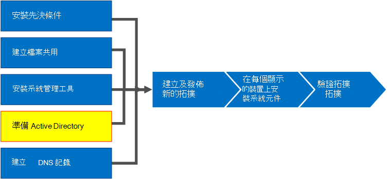

# <a name="prepare-active-directory-for-skype-for-business-server"></a><span data-ttu-id="b544b-104">為商務用 Skype Server 準備 Active Directory</span><span class="sxs-lookup"><span data-stu-id="b544b-104">Prepare Active Directory for Skype for Business Server</span></span>
 
<span data-ttu-id="b544b-105">**摘要：** 瞭解如何準備您的 Active Directory 網域，以進行商務用 Skype 伺服器的安裝。</span><span class="sxs-lookup"><span data-stu-id="b544b-105">**Summary:** Learn how to prepare your Active Directory domain for an installation of Skype for Business Server.</span></span> <span data-ttu-id="b544b-106">從 [Microsoft 評估中心](https://www.microsoft.com/evalcenter/evaluate-skype-for-business-server)下載商務用 Skype Server 免費試用版。</span><span class="sxs-lookup"><span data-stu-id="b544b-106">Download a free trial of Skype for Business Server from the [Microsoft Evaluation Center](https://www.microsoft.com/evalcenter/evaluate-skype-for-business-server).</span></span>
  
<span data-ttu-id="b544b-107">商務用 Skype 伺服器與 Active Directory 密切搭配使用。</span><span class="sxs-lookup"><span data-stu-id="b544b-107">Skype for Business Server works closely with Active Directory.</span></span> <span data-ttu-id="b544b-108">您必須準備 Active Directory 網域才能使用商務用 Skype 伺服器。</span><span class="sxs-lookup"><span data-stu-id="b544b-108">You must prepare the Active Directory domain to work with Skype for Business Server.</span></span> <span data-ttu-id="b544b-109">此程式是在部署嚮導中完成，只對網域執行一次。</span><span class="sxs-lookup"><span data-stu-id="b544b-109">This process is accomplished in the Deployment Wizard and is only done once for the domain.</span></span> <span data-ttu-id="b544b-110">這是因為程式會建立群組並修改網域，而您只需要執行一次。</span><span class="sxs-lookup"><span data-stu-id="b544b-110">This is because the process creates groups and modifies the domain, and you need to do that only once.</span></span> <span data-ttu-id="b544b-111">您可以依任何循序執行步驟1到5。</span><span class="sxs-lookup"><span data-stu-id="b544b-111">You can do steps 1 through 5 in any order.</span></span> <span data-ttu-id="b544b-112">不過，您必須依序執行步驟6、7和8，並在步驟1到5之後進行，如圖表中所述。</span><span class="sxs-lookup"><span data-stu-id="b544b-112">However, you must do steps 6, 7, and 8 in order, and after steps 1 through 5, as outlined in the diagram.</span></span> <span data-ttu-id="b544b-113">準備 Active Directory 是步驟4之8。</span><span class="sxs-lookup"><span data-stu-id="b544b-113">Preparing Active Directory is step 4 of 8.</span></span> <span data-ttu-id="b544b-114">如需規劃 Active Directory 的詳細資訊，請參閱商務用 skype server 2019 的 [商務用 Skype 伺服器](../../plan-your-deployment/requirements-for-your-environment/environmental-requirements.md) 或 [伺服器需求](../../../SfBServer2019/plan/system-requirements.md)環境需求。</span><span class="sxs-lookup"><span data-stu-id="b544b-114">For more information about planning for Active Directory, see [Environmental requirements for Skype for Business Server](../../plan-your-deployment/requirements-for-your-environment/environmental-requirements.md) or [Server requirements for Skype for Business Server 2019](../../../SfBServer2019/plan/system-requirements.md).</span></span>
  

  
## <a name="prepare-active-directory"></a><span data-ttu-id="b544b-116">準備 Active Directory</span><span class="sxs-lookup"><span data-stu-id="b544b-116">Prepare Active Directory</span></span>

<span data-ttu-id="b544b-117">商務用 Skype Server 與 Active Directory 網域服務 (AD DS) 緊密整合。</span><span class="sxs-lookup"><span data-stu-id="b544b-117">Skype for Business Server is tightly integrated with Active Directory Domain Services (AD DS).</span></span> <span data-ttu-id="b544b-118">您第一次可以安裝商務用 Skype Server 之前，必須準備好 Active Directory。</span><span class="sxs-lookup"><span data-stu-id="b544b-118">Before Skype for Business Server can be installed for the first time, Active Directory must be prepared.</span></span> <span data-ttu-id="b544b-119">在 [ **準備 Active Directory** ] 的部署嚮導區段中，準備好 active directory 環境以用於商務用 Skype Server。</span><span class="sxs-lookup"><span data-stu-id="b544b-119">The section of the Deployment Wizard titled **Prepare Active Directory** prepares the Active Directory environment for use with Skype for Business Server.</span></span>
  
> [!NOTE]
> <span data-ttu-id="b544b-120">商務用 Skype Server 使用 (AD DS) ，以追蹤和與拓撲中的所有伺服器進行通訊。</span><span class="sxs-lookup"><span data-stu-id="b544b-120">Skype for Business Server uses (AD DS) to track and communicate with all of the servers in a topology.</span></span> <span data-ttu-id="b544b-121">這些伺服器中的大部分必須加入網域，以便商務用 Skype 伺服器才能正常運作。</span><span class="sxs-lookup"><span data-stu-id="b544b-121">The majority of these servers must be joined to the domain so that Skype for Business Server can work properly.</span></span> <span data-ttu-id="b544b-122">請記住，Edge 和反向 Proxy 等伺服器應該不會加入網域。</span><span class="sxs-lookup"><span data-stu-id="b544b-122">Keep in mind that servers such as Edge and Reverse Proxy should not be domain joined.</span></span>
  
> [!IMPORTANT]
> <span data-ttu-id="b544b-123">針對部署中的每個網域，應只執行一次 [準備 Active Directory] 程式。</span><span class="sxs-lookup"><span data-stu-id="b544b-123">The Prepare Active Directory procedure should be run only once for each domain in the deployment.</span></span> 
  
<span data-ttu-id="b544b-124">觀賞 **準備 Active Directory** 的影片步驟：</span><span class="sxs-lookup"><span data-stu-id="b544b-124">Watch the video steps for **Prepare Active Directory**:</span></span>
  
> [!video https://www.microsoft.com/videoplayer/embed/RE1Ybuk]
  
### <a name="prepare-active-directory-from-the-deployment-wizard"></a><span data-ttu-id="b544b-125">從部署嚮導準備 Active Directory</span><span class="sxs-lookup"><span data-stu-id="b544b-125">Prepare Active Directory from the Deployment Wizard</span></span>

1. <span data-ttu-id="b544b-126">以具有 Active Directory 網域之架構管理員認證的使用者身分登入。</span><span class="sxs-lookup"><span data-stu-id="b544b-126">Log on as a user with Schema Admins credentials for the Active Directory domain.</span></span>
    
2. <span data-ttu-id="b544b-127">開啟商務用 Skype Server 部署嚮導。</span><span class="sxs-lookup"><span data-stu-id="b544b-127">Open Skype for Business Server Deployment Wizard.</span></span>
    
    > [!TIP]
    > <span data-ttu-id="b544b-128">如果您想要查看由商務用 Skype Server 部署嚮導所建立的記錄檔，您可以在執行該步驟的 AD DS 使用者的使用者目錄中，找到這些記錄檔，以執行部署嚮導的電腦上。</span><span class="sxs-lookup"><span data-stu-id="b544b-128">If you want to review the log files that are created by the Skype for Business Server Deployment Wizard, you can find them on the computer where the Deployment Wizard was run, in the Users directory of the AD DS user who ran the step.</span></span> <span data-ttu-id="b544b-129">例如，如果使用者以網域中的網域管理員身分登入，則記錄檔位於： C:\Users\Administrator.Contoso\AppData\Local\Temp。</span><span class="sxs-lookup"><span data-stu-id="b544b-129">For example, if the user logged on as the domain administrator in the domain, contoso.local, the log files are located in: C:\Users\Administrator.Contoso\AppData\Local\Temp.</span></span> 
  
3. <span data-ttu-id="b544b-130">按一下 [ **準備 Active Directory** ] 連結。</span><span class="sxs-lookup"><span data-stu-id="b544b-130">Click the **Prepare Active Directory** link.</span></span>
    
4. <span data-ttu-id="b544b-131">**步驟1：準備架構**</span><span class="sxs-lookup"><span data-stu-id="b544b-131">**Step 1: Prepare schema**</span></span>
    
    <span data-ttu-id="b544b-132">a.</span><span class="sxs-lookup"><span data-stu-id="b544b-132">a.</span></span> <span data-ttu-id="b544b-133">透過按一下步驟1標題底下的下拉式清單，查看步驟1可以存取的必要條件資訊。</span><span class="sxs-lookup"><span data-stu-id="b544b-133">Review the prerequisites information for Step 1 which can be accessed by clicking the drop-down under the Step 1 title.</span></span>
    
    <span data-ttu-id="b544b-134">b.</span><span class="sxs-lookup"><span data-stu-id="b544b-134">b.</span></span> <span data-ttu-id="b544b-135">按一下 [步驟 1] 中的 [ **執行** ]，以啟動 [準備架構] 嚮導。</span><span class="sxs-lookup"><span data-stu-id="b544b-135">Click **Run** in Step 1 to launch the Prepare Schema wizard.</span></span>
    
    <span data-ttu-id="b544b-136">c.</span><span class="sxs-lookup"><span data-stu-id="b544b-136">c.</span></span> <span data-ttu-id="b544b-137">請注意，每個部署的程式都應該只執行一次，然後按 **[下一步]**。</span><span class="sxs-lookup"><span data-stu-id="b544b-137">Take note that the procedure should be run only once for each deployment, and then click **Next**.</span></span>
    
    <span data-ttu-id="b544b-138">d.</span><span class="sxs-lookup"><span data-stu-id="b544b-138">d.</span></span> <span data-ttu-id="b544b-139">做好架構準備之後，您可以按一下 [ **查看記錄** 檔] 來查看記錄檔。</span><span class="sxs-lookup"><span data-stu-id="b544b-139">Once the schema has been prepared, you can view the log by clicking **View Log**.</span></span> 
    
    <span data-ttu-id="b544b-140">e.</span><span class="sxs-lookup"><span data-stu-id="b544b-140">e.</span></span> <span data-ttu-id="b544b-141">按一下 **[完成]** 以關閉 [準備架構] 嚮導，並回到 [準備 Active Directory] 步驟。</span><span class="sxs-lookup"><span data-stu-id="b544b-141">Click **Finish** to close the Prepare Schema wizard, and return to the Prepare Active Directory steps.</span></span>
    
5. <span data-ttu-id="b544b-142">**步驟2：驗證架構分割區的複寫**</span><span class="sxs-lookup"><span data-stu-id="b544b-142">**Step 2: Verify replication of schema partition**</span></span>
    
    <span data-ttu-id="b544b-143">a.</span><span class="sxs-lookup"><span data-stu-id="b544b-143">a.</span></span> <span data-ttu-id="b544b-144">登入網域的網域控制站。</span><span class="sxs-lookup"><span data-stu-id="b544b-144">Log on to the domain controller for the domain.</span></span>
    
    <span data-ttu-id="b544b-145">b.</span><span class="sxs-lookup"><span data-stu-id="b544b-145">b.</span></span> <span data-ttu-id="b544b-146">在 [**伺服器管理員**] 的 [**工具**] 下拉式功能表中開啟 **ADSI 編輯器**。</span><span class="sxs-lookup"><span data-stu-id="b544b-146">Open **ADSI Edit** from the **Tools** drop-down menu in **Server Manager**.</span></span>
    
    <span data-ttu-id="b544b-147">c.</span><span class="sxs-lookup"><span data-stu-id="b544b-147">c.</span></span> <span data-ttu-id="b544b-148">在 [動作] 功能表上，按一下 [連線至]。</span><span class="sxs-lookup"><span data-stu-id="b544b-148">On the **Action** menu, click **Connect to**.</span></span>
    
    <span data-ttu-id="b544b-149">d.</span><span class="sxs-lookup"><span data-stu-id="b544b-149">d.</span></span> <span data-ttu-id="b544b-150">在 **[選取熟知的命名內容]** 的 **[連線設定]** 對話方塊中，選取 **[架構]**，然後按一下 **[確定]**。</span><span class="sxs-lookup"><span data-stu-id="b544b-150">In the **Connection Settings** dialog box under **Select a well known Naming Context**, select **Schema**, and then click **OK**.</span></span>
    
    <span data-ttu-id="b544b-151">e.</span><span class="sxs-lookup"><span data-stu-id="b544b-151">e.</span></span> <span data-ttu-id="b544b-152">在架構容器底下，搜尋 **CN = ms-**----SIP-SchemaVersion。</span><span class="sxs-lookup"><span data-stu-id="b544b-152">Under the schema container, search for **CN=ms-RTC-SIP-SchemaVersion**.</span></span> <span data-ttu-id="b544b-153">如果此物件存在，且 **rangeUpper** 屬性的值是1150，而 **rangeLower** 屬性的值是3，則表示已成功更新及複製架構。</span><span class="sxs-lookup"><span data-stu-id="b544b-153">If this object exists, and the value of the **rangeUpper** attribute is 1150 and the value of the **rangeLower** attribute is 3, the schema was successfully updated and replicated.</span></span> <span data-ttu-id="b544b-154">如果此物件不存在，或 **rangeUpper** 及 **rangeLower** 屬性的值不是指定的，則未修改或尚未複製架構。</span><span class="sxs-lookup"><span data-stu-id="b544b-154">If this object does not exist or the values of the **rangeUpper** and **rangeLower** attributes are not as specified, the schema was not modified or has not replicated.</span></span>
    
6. <span data-ttu-id="b544b-155">**步驟3：準備目前的樹系**</span><span class="sxs-lookup"><span data-stu-id="b544b-155">**Step 3: Prepare current forest**</span></span>
    
    <span data-ttu-id="b544b-156">a.</span><span class="sxs-lookup"><span data-stu-id="b544b-156">a.</span></span> <span data-ttu-id="b544b-157">透過按一下 [步驟 3] 標題底下的下拉式清單，查看步驟3可存取的必要條件資訊。</span><span class="sxs-lookup"><span data-stu-id="b544b-157">Review the prerequisites information for Step 3 which can be accessed by clicking the drop-down under the Step 3 title.</span></span>
    
    <span data-ttu-id="b544b-158">b.</span><span class="sxs-lookup"><span data-stu-id="b544b-158">b.</span></span> <span data-ttu-id="b544b-159">按一下步驟3中的 [ **執行** ]，以啟動 [準備目前的樹系] 嚮導。</span><span class="sxs-lookup"><span data-stu-id="b544b-159">Click **Run** in Step 3 to launch the Prepare Current Forest wizard.</span></span>
    
    <span data-ttu-id="b544b-160">c.</span><span class="sxs-lookup"><span data-stu-id="b544b-160">c.</span></span> <span data-ttu-id="b544b-161">請注意，此程式在每次部署中應只執行一次，然後按 **[下一步]**。</span><span class="sxs-lookup"><span data-stu-id="b544b-161">Take note that the procedure should be only run once per deployment, and then click **Next**.</span></span>
    
    <span data-ttu-id="b544b-162">d.</span><span class="sxs-lookup"><span data-stu-id="b544b-162">d.</span></span> <span data-ttu-id="b544b-163">指定通用群組會建立所在的網域。</span><span class="sxs-lookup"><span data-stu-id="b544b-163">Specify the domain where the universal groups will be created.</span></span> <span data-ttu-id="b544b-164">如果伺服器是網域的一部分，您可以選擇 [ **本機網域**]，然後按 **[下一步]**。</span><span class="sxs-lookup"><span data-stu-id="b544b-164">If the server is part of the domain, you can choose **Local domain**, and click **Next**.</span></span>
    
    <span data-ttu-id="b544b-165">e.</span><span class="sxs-lookup"><span data-stu-id="b544b-165">e.</span></span> <span data-ttu-id="b544b-166">準備好樹系之後，您可以按一下 [ **查看記錄** 檔] 以查看記錄檔。</span><span class="sxs-lookup"><span data-stu-id="b544b-166">Once the forest has been prepared, you can view the log by clicking **View Log**.</span></span> 
    
    <span data-ttu-id="b544b-167">f.</span><span class="sxs-lookup"><span data-stu-id="b544b-167">f.</span></span> <span data-ttu-id="b544b-168">按一下 **[完成]** ，以關閉 [準備目前的樹系] 嚮導，並回到 [準備 Active Directory] 步驟。</span><span class="sxs-lookup"><span data-stu-id="b544b-168">Click **Finish** to close the Prepare Current Forest wizard, and return to the Prepare Active Directory steps.</span></span>
    
    <span data-ttu-id="b544b-169">g.</span><span class="sxs-lookup"><span data-stu-id="b544b-169">g.</span></span> <span data-ttu-id="b544b-170">從 [**應用程式**] 頁面上，按一下 [**商務用 Skype Server 管理命令** 介面]，以啟動 PowerShell。</span><span class="sxs-lookup"><span data-stu-id="b544b-170">Click **Skype for Business Server Management Shell** from the **Apps** page to launch PowerShell.</span></span>
    
    <span data-ttu-id="b544b-171">H。</span><span class="sxs-lookup"><span data-stu-id="b544b-171">h.</span></span> <span data-ttu-id="b544b-172">輸入命令 Get-CsAdForest，然後按 **enter**。</span><span class="sxs-lookup"><span data-stu-id="b544b-172">Type the command Get-CsAdForest, and press **Enter**.</span></span>
    
    <span data-ttu-id="b544b-173">i.</span><span class="sxs-lookup"><span data-stu-id="b544b-173">i.</span></span> <span data-ttu-id="b544b-174">如果結果是 **LC_FORESTSETTINGS_STATE_READY**，樹系已經順利做好準備，如圖所示。</span><span class="sxs-lookup"><span data-stu-id="b544b-174">If the result is **LC_FORESTSETTINGS_STATE_READY**, the forest has successfully been prepared, as shown in the figure.</span></span>
    
     
  
7. <span data-ttu-id="b544b-176">**步驟4：驗證通用類別目錄的複寫**</span><span class="sxs-lookup"><span data-stu-id="b544b-176">**Step 4: Verify replication of the global catalog**</span></span>
    
    <span data-ttu-id="b544b-177">a.</span><span class="sxs-lookup"><span data-stu-id="b544b-177">a.</span></span> <span data-ttu-id="b544b-178">在網域控制站上 (首選于從其他網域控制站的遠端網站) ，在執行樹系準備的樹系中，開啟 [ **Active Directory 使用者和電腦**]。</span><span class="sxs-lookup"><span data-stu-id="b544b-178">On a domain controller (preferably in a remote site from the other domain controllers), in the forest where the Forest Preparation was run, open **Active Directory Users and Computers**.</span></span>
    
    <span data-ttu-id="b544b-179">b.</span><span class="sxs-lookup"><span data-stu-id="b544b-179">b.</span></span> <span data-ttu-id="b544b-180">在 [ **Active Directory 使用者及電腦**] 中，展開樹系或子域的功能變數名稱。</span><span class="sxs-lookup"><span data-stu-id="b544b-180">In **Active Directory Users and Computers**, expand the domain name of your forest or a child domain.</span></span>
    
    <span data-ttu-id="b544b-181">c.</span><span class="sxs-lookup"><span data-stu-id="b544b-181">c.</span></span> <span data-ttu-id="b544b-182">按一下左側窗格中的 [ **使用者** ] 容器，然後在右側窗格中尋找通用群組 **CsAdministrator** 。</span><span class="sxs-lookup"><span data-stu-id="b544b-182">Click the **Users** container on the left side pane, and look for the Universal group **CsAdministrator** in the right side pane.</span></span> <span data-ttu-id="b544b-183">如果有 CsAdministrator (其他以 Cs) 開頭的新通用群組，則表示已成功進行 Active Directory 複寫。</span><span class="sxs-lookup"><span data-stu-id="b544b-183">If CsAdministrator (among other new Universal groups that begin with Cs) is present, Active Directory replication has been successful.</span></span>
    
    <span data-ttu-id="b544b-184">d.</span><span class="sxs-lookup"><span data-stu-id="b544b-184">d.</span></span> <span data-ttu-id="b544b-185">如果這些群組尚未存在，您可以強制複寫，或等候15分鐘，然後重新整理右側窗格。</span><span class="sxs-lookup"><span data-stu-id="b544b-185">If the groups are not yet present, you can force the replication, or wait 15 minutes and refresh the right side pane.</span></span> <span data-ttu-id="b544b-186">當群組存在時，就會完成複寫。</span><span class="sxs-lookup"><span data-stu-id="b544b-186">When the groups are present, replication is complete.</span></span>
    
8. <span data-ttu-id="b544b-187">**步驟5：準備目前的網域**</span><span class="sxs-lookup"><span data-stu-id="b544b-187">**Step 5: Prepare the current domain**</span></span>
    
    <span data-ttu-id="b544b-188">a.</span><span class="sxs-lookup"><span data-stu-id="b544b-188">a.</span></span> <span data-ttu-id="b544b-189">請參閱步驟5的必要條件資訊。</span><span class="sxs-lookup"><span data-stu-id="b544b-189">Review the prerequisites information for Step 5.</span></span>
    
    <span data-ttu-id="b544b-190">b.</span><span class="sxs-lookup"><span data-stu-id="b544b-190">b.</span></span> <span data-ttu-id="b544b-191">按一下步驟5中的 [ **執行** ]，以啟動 [準備目前的網域] 嚮導。</span><span class="sxs-lookup"><span data-stu-id="b544b-191">Click **Run** in Step 5 to launch the Prepare Current Domain wizard.</span></span>
    
    <span data-ttu-id="b544b-192">c.</span><span class="sxs-lookup"><span data-stu-id="b544b-192">c.</span></span> <span data-ttu-id="b544b-193">請注意，應只對部署中的每個網域執行一次此程式，然後按 **[下一步]**。</span><span class="sxs-lookup"><span data-stu-id="b544b-193">Take note that the procedure should only be run once for each domain in the deployment, and then click **Next**.</span></span>
    
    <span data-ttu-id="b544b-194">d.</span><span class="sxs-lookup"><span data-stu-id="b544b-194">d.</span></span> <span data-ttu-id="b544b-195">準備好網域之後，您可以按一下 [ **查看記錄** 檔] 來查看記錄檔。</span><span class="sxs-lookup"><span data-stu-id="b544b-195">Once the domain has been prepared, you can view the log by clicking **View Log**.</span></span> 
    
    <span data-ttu-id="b544b-196">e.</span><span class="sxs-lookup"><span data-stu-id="b544b-196">e.</span></span> <span data-ttu-id="b544b-197">按一下 **[完成]** 以關閉 [準備目前的網域] 嚮導，並回到 [準備 Active Directory] 步驟。</span><span class="sxs-lookup"><span data-stu-id="b544b-197">Click **Finish** to close the Prepare Current Domain wizard, and return to the Prepare Active Directory steps.</span></span>
    
    <span data-ttu-id="b544b-198">在每個找到商務用 Skype Server 物件的網域中，都必須完成這些步驟，否則服務可能無法啟動。</span><span class="sxs-lookup"><span data-stu-id="b544b-198">These steps must be completed in every domain where Skype for Business Server objects are found, otherwise services might not start.</span></span> <span data-ttu-id="b544b-199">這包括任何類型的 Active Directory 物件，例如，使用者、連絡人物件、系統管理群組或任何其他類型的物件。</span><span class="sxs-lookup"><span data-stu-id="b544b-199">This includes any type of Active Directory object, such as users, contact objects, administrative groups, or any other type of object.</span></span> <span data-ttu-id="b544b-200">如有需要，您可以使用 Set-CsUserReplicatorConfiguration ADDomainNamingCoNtextList 僅新增商務用 Skype Server 物件的網域。</span><span class="sxs-lookup"><span data-stu-id="b544b-200">You can use Set-CsUserReplicatorConfiguration -ADDomainNamingContextList to add only the domains with Skype for Business Server objects, if needed.</span></span>
    
9. <span data-ttu-id="b544b-201">**步驟6：確認網域中的複寫**</span><span class="sxs-lookup"><span data-stu-id="b544b-201">**Step 6: Verify replication in the domain**</span></span>
    
    <span data-ttu-id="b544b-202">a.</span><span class="sxs-lookup"><span data-stu-id="b544b-202">a.</span></span> <span data-ttu-id="b544b-203">在 [**應用程式**] 頁面上，按一下 [**商務用 Skype Server 管理命令** 介面]，以啟動 PowerShell。</span><span class="sxs-lookup"><span data-stu-id="b544b-203">Click the **Skype for Business Server Management Shell** from the **Apps** page to launch PowerShell.</span></span>
    
    <span data-ttu-id="b544b-204">b.</span><span class="sxs-lookup"><span data-stu-id="b544b-204">b.</span></span> <span data-ttu-id="b544b-205">使用命令 Get-CsAdDomain 來驗證網域內的複寫。</span><span class="sxs-lookup"><span data-stu-id="b544b-205">Use the command Get-CsAdDomain to verify replication within the domain.</span></span>
    
   ```powershell
   Get-CsAdDomain [-Domain <Fqdn>] [-DomainController <Fqdn>] [-GlobalCatalog <Fqdn>] [-GlobalSettingsDomainController <Fqdn>]
   ```

    > [!NOTE]
    > <span data-ttu-id="b544b-206">如果您沒有指定 Domain 參數，這個值會設為本機網域。</span><span class="sxs-lookup"><span data-stu-id="b544b-206">If you do not specify the Domain parameter, the value is set to the local domain.</span></span> 
  
    <span data-ttu-id="b544b-207">在 contoso 中執行命令的範例。本地域：</span><span class="sxs-lookup"><span data-stu-id="b544b-207">Example of running the command for the contoso.local domain:</span></span>
    
   ```powershell
   Get-CsAdDomain -Domain contoso.local -GlobalSettingsDomainController dc.contoso.local
   ```

    > [!NOTE]
    > <span data-ttu-id="b544b-208">使用參數 GlobalSettingsDomainController，您可以指定儲存全域設定的位置。</span><span class="sxs-lookup"><span data-stu-id="b544b-208">By using the parameter GlobalSettingsDomainController, you can indicate where global settings are stored.</span></span> <span data-ttu-id="b544b-209">如果您的設定儲存在系統容器中 (在一般情況下，如果升級部署尚未將全域設定遷移至設定容器) ，您可以在 AD DS 樹系的根目錄中定義網域控制站。</span><span class="sxs-lookup"><span data-stu-id="b544b-209">If your settings are stored in the System container (which is typical with upgrade deployments that have not had the global setting migrated to the Configuration container), you define a domain controller in the root of your AD DS forest.</span></span> <span data-ttu-id="b544b-210">如果全域設定位於 Configuration 容器中 (在全新部署或升級部署作業期間，當設定已經移轉至 Configuration 容器時的常見現象)，您可以在樹系中定義任何網域控制站。</span><span class="sxs-lookup"><span data-stu-id="b544b-210">If the global settings are in the Configuration container (which is typical with new deployments or upgrade deployments where the settings have been migrated to the Configuration container), you define any domain controller in the forest.</span></span> <span data-ttu-id="b544b-211">如果您未指定此參數，Cmdlet 會假設設定儲存在設定容器中，並參照至 Active Directory 中的任何網域控制站。</span><span class="sxs-lookup"><span data-stu-id="b544b-211">If you do not specify this parameter, the cmdlet assumes that the settings are stored in the Configuration container and refers to any domain controller in Active Directory.</span></span> 
  
    <span data-ttu-id="b544b-212">c.</span><span class="sxs-lookup"><span data-stu-id="b544b-212">c.</span></span> <span data-ttu-id="b544b-213">如果結果是 **LC_DOMAINSETTINGS_STATE_READY**，則網域已成功複寫。</span><span class="sxs-lookup"><span data-stu-id="b544b-213">If the result is **LC_DOMAINSETTINGS_STATE_READY**, the domain has successfully replicated.</span></span>
    
10. <span data-ttu-id="b544b-214">**步驟7：新增使用者以供應商務用 Skype Server 控制台的系統管理存取權**</span><span class="sxs-lookup"><span data-stu-id="b544b-214">**Step 7: Add users to provide administrative access to the Skype for Business Server Control Panel**</span></span>
    
    <span data-ttu-id="b544b-215">a.</span><span class="sxs-lookup"><span data-stu-id="b544b-215">a.</span></span> <span data-ttu-id="b544b-216">使用 Domain Admins 群組成員或 RTCUniversalServerAdmins 群組成員的身分登入。</span><span class="sxs-lookup"><span data-stu-id="b544b-216">Log on as a member of the Domain Admins group or the RTCUniversalServerAdmins group.</span></span>
    
    <span data-ttu-id="b544b-217">b.</span><span class="sxs-lookup"><span data-stu-id="b544b-217">b.</span></span> <span data-ttu-id="b544b-218">開啟 [ **Active Directory 使用者及電腦**]，展開網域，按一下 [ **使用者** ] 容器，以滑鼠右鍵按一下 [CSAdministrator]，然後選擇 [ **屬性**]。</span><span class="sxs-lookup"><span data-stu-id="b544b-218">Open **Active Directory Users and Computers**, expand your domain, click the **Users** container, right-click CSAdministrator, and choose **Properties**.</span></span>
    
    <span data-ttu-id="b544b-219">c.</span><span class="sxs-lookup"><span data-stu-id="b544b-219">c.</span></span> <span data-ttu-id="b544b-220">在 **[CSAdministrator 內容]** 中，按一下 **[成員]** 索引標籤。</span><span class="sxs-lookup"><span data-stu-id="b544b-220">In **CSAdministrator Properties**, click the **Members** tab.</span></span>
    
    <span data-ttu-id="b544b-221">d.</span><span class="sxs-lookup"><span data-stu-id="b544b-221">d.</span></span> <span data-ttu-id="b544b-222">在 [成員] 索引標籤上，按一下 [新增]。</span><span class="sxs-lookup"><span data-stu-id="b544b-222">On the **Members** tab, click **Add**.</span></span> <span data-ttu-id="b544b-223">在 [選取使用者、連絡人、電腦、服務帳戶或群組] 中，找到 [輸入要選取的物件名稱]。</span><span class="sxs-lookup"><span data-stu-id="b544b-223">In **Select Users, Contacts, Computers, Service Accounts, or Groups**, locate the **Enter the object names to select**.</span></span> <span data-ttu-id="b544b-224">輸入要新增到 CSAdministrators 群組的使用者名稱或群組名稱。</span><span class="sxs-lookup"><span data-stu-id="b544b-224">Type the user name(s) or group name(s) to add to the group CSAdministrators.</span></span> <span data-ttu-id="b544b-225">按一下 [確定]。</span><span class="sxs-lookup"><span data-stu-id="b544b-225">Click **OK**.</span></span>
    
    <span data-ttu-id="b544b-226">e.</span><span class="sxs-lookup"><span data-stu-id="b544b-226">e.</span></span> <span data-ttu-id="b544b-227">在 [ **成員** ] 索引標籤上，確認您選取的使用者或群組是否存在。</span><span class="sxs-lookup"><span data-stu-id="b544b-227">On the **Members** tab, confirm that the users or groups that you selected are present.</span></span> <span data-ttu-id="b544b-228">按一下 **[確定]**。</span><span class="sxs-lookup"><span data-stu-id="b544b-228">Click **OK**.</span></span>
    
    > [!CAUTION]
    > <span data-ttu-id="b544b-229">商務用 Skype Server 控制台是以角色為基礎的存取控制工具。</span><span class="sxs-lookup"><span data-stu-id="b544b-229">The Skype for Business Server Control Panel is a role-based access control tool.</span></span> <span data-ttu-id="b544b-230">CsAdministrator 群組中的成員資格會為所有可用的設定功能提供使用商務用 Skype Server 控制台完全控制權的使用者。</span><span class="sxs-lookup"><span data-stu-id="b544b-230">Membership in the CsAdministrator group gives a user who is using the Skype for Business Server Control Panel full control for all configuration functions available.</span></span> <span data-ttu-id="b544b-231">有些其他的角色是針對特定功能而設計。</span><span class="sxs-lookup"><span data-stu-id="b544b-231">There are other roles available that are designed for specific functions.</span></span> <span data-ttu-id="b544b-232">如需可用角色的詳細資訊，請參閱商務用 skype server 2019 的 [商務用 Skype 伺服器](../../plan-your-deployment/requirements-for-your-environment/environmental-requirements.md) 或 [伺服器需求](../../../SfBServer2019/plan/system-requirements.md)的環境需求。</span><span class="sxs-lookup"><span data-stu-id="b544b-232">For details on the roles available, see [Environmental requirements for Skype for Business Server](../../plan-your-deployment/requirements-for-your-environment/environmental-requirements.md) or [Server requirements for Skype for Business Server 2019](../../../SfBServer2019/plan/system-requirements.md).</span></span> <span data-ttu-id="b544b-233">請注意，使用者不需要啟用商務用 Skype 伺服器才能成為管理群組的成員。</span><span class="sxs-lookup"><span data-stu-id="b544b-233">Note that users do not have to be enabled for Skype for Business Server in order to be made members of the management groups.</span></span> 
  
    > [!CAUTION]
    > <span data-ttu-id="b544b-234">若要協助保留安全性和角色型存取控制完整性，請將使用者新增至定義使用者在管理商務用 Skype Server 部署時所執行之角色的群組。</span><span class="sxs-lookup"><span data-stu-id="b544b-234">To help retain security and role-based access control integrity, add users to the groups that define what role the user performs in management of the Skype for Business Server deployment.</span></span> 
  
11. <span data-ttu-id="b544b-235">登出，然後重新登入 Windows，使您的安全性權杖更新為新的商務用 Skype Server 安全性群組，然後重新開啟部署嚮導。</span><span class="sxs-lookup"><span data-stu-id="b544b-235">Log off, and then log back on to Windows so that your security token is updated with the new Skype for Business Server security group, and then reopen the Deployment Wizard.</span></span>
    
12. <span data-ttu-id="b544b-236">請確認您已在 [ **準備 Active Directory** ] 旁邊的綠色旁核取記號，以確認成功，如圖所示。</span><span class="sxs-lookup"><span data-stu-id="b544b-236">Verify that you see a green checkmark next to **Prepare Active Directory** to confirm success, as shown in the figure.</span></span>
    
     
  

## <a name="see-also"></a><span data-ttu-id="b544b-238">另請參閱</span><span class="sxs-lookup"><span data-stu-id="b544b-238">See also</span></span>
 
[<span data-ttu-id="b544b-239">商務用 Skype Server 2015 的 Active Directory 網域服務</span><span class="sxs-lookup"><span data-stu-id="b544b-239">Active Directory Domain Services for Skype for Business Server 2015</span></span>](../../plan-your-deployment/security/active-directory-domain-services.md)
