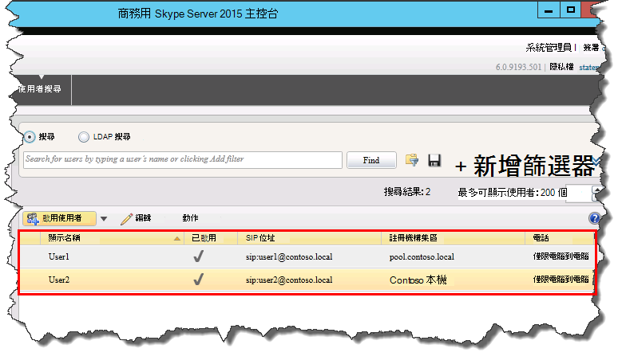

# 驗證商務用 Skype Server 中的拓撲
 
**摘要：** 瞭解如何驗證商務用 Skype Server 拓撲和 Active Directory 伺服器是否如預期般運作。 從[Microsoft 評估中心](https://www.microsoft.com/evalcenter/evaluate-skype-for-business-server)下載商務用 Skype Server 的免費試用版。
  
發行拓撲之後，在拓撲中的每一部伺服器上安裝商務用 Skype Server 系統元件之後，就可以確認拓撲的運作如預期般運作。 這包括驗證設定是否已向內傳播至所有 Active Directory 伺服器，讓整個網域知道商務用 Skype 可在網域中取得。 您可以依任何循序執行步驟1到5。 不過，您必須依序執行步驟6、7和8，並在步驟1到5之後進行，如圖表中所述。 驗證拓撲是步驟8之8。
  

  
## 測試前端集區部署

最後一個步驟是測試前端集區，並確認商務用 Skype 的用戶端可以相互通訊。 
  
### 新增使用者並驗證用戶端連線能力

1. 使用 [Active directory 電腦和使用者]，將商務用 Skype Server 控制台) 的商務用 Skype Server 部署 (之系統管理員角色的 Active directory 使用者物件新增至 **CSAdministrator** 群組。
    
    > [!IMPORTANT]
    > 如果您未將適當的使用者和群組新增至 CsAdministors 群組，當您開啟商務用 Skype Server 控制台時，將會收到錯誤：「未經授權」：由於角色型存取控制 (RBAC) 授權失敗而拒絕存取。」 
  
2. 如果使用者物件目前已登入，請先登出再登入，以註冊新的群組指派。
    
    > [!NOTE]
    > 使用者帳戶不可以是執行商務用 Skype Server 之任何伺服器的本機系統管理員。 
  
3. 使用系統管理帳戶登入安裝商務用 Skype Server 控制台的電腦。
    
4. 啟動商務用 Skype Server 控制台]，然後在出現提示時提供認證。 商務用 Skype Server控制台會顯示部署資訊。
    
5. 在左導覽列中，按一下 [**拓撲**]，然後確認服務狀態顯示具有綠色箭號的電腦，且每個已部署並聯機的商務用 Skype Server 角色旁都有綠色核取記號的副本狀態。 
    
6. 在左導覽列中，按一下 [ **使用者**]，然後按一下 [ **啟用使用者**]。 
    
7. 在 [**新增商務用 Skype Server 使用者**] 頁面上 **，按一下 [** 新增]。
    
8. 若要為您要尋找的物件定義搜尋參數，請在 [ **從 Active Directory 選取** ] 頁面上，選取 [ **搜尋**]，然後選擇性地按一下 [ **新增篩選**]。 您也可以選取 [ **ldap 搜尋** ] 並輸入 ldap 運算式，以篩選或限制將要傳回的物件。 在您決定搜尋選項之後，請按一下 [ **尋找**]。
    
9. 在 [搜尋結果] 窗格中，選取您要新增的使用者，然後按一下 **[確定]**。
    
10. 在 [**新增商務用 Skype Server 使用者**] 頁面上，您選取的使用者會顯示在 [**使用者**] 頁面上。 在 [ **指派使用者至集** 區] 清單中，選取使用者應所在的伺服器。
    
    以下是您可以用來設定物件的選項清單。
    
    - **產生使用者的 SIP URI**
    
    - **電話**
    
    - **行 URI**
    
    - **會議原則**
    
    - **用戶端版本原則**
    
    - **PIN 原則**
    
    - **外部存取原則**
    
    - **封存原則**
    
    - **位置原則**
    
    - **用戶端原則**
    
    若要測試基本功能，請選取您想要用於 **產生使用者的 SIP URI** 設定的選項 (設定中的其他選項使用預設設定) ，然後按一下 [ **啟用**] （如圖所示）。
    
     ![在 [控制台] 中啟用使用者。](../../media/7ee8717d-9a1f-4864-8f45-71071c88878f.png)
  
11. 顯示 [摘要] 頁面，在 [ **已啟用** ] 欄中顯示核取記號，表示使用者已設定。 [ **SIP 位址** ] 欄會顯示使用者登入設定所需的位址。
    
     
  
12. 將一個使用者登入已加入網域的電腦，並將另一個使用者登入網域中的另一部電腦。
    
13. 在兩部用戶端電腦上安裝商務用 Skype 用戶端，然後確認這兩位使用者皆可登入商務用 Skype Server，且可以相互傳送立即訊息。
    

