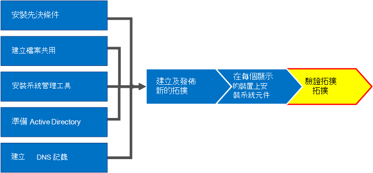

# 在商務用 Skype Server 中驗證拓撲Verify the topology in Skype for Business Server
 
**摘要:** 瞭解如何驗證商務用 Skype 伺服器拓撲和 Active Directory 伺服器是否如預期運作。**Summary:** Learn how to verify the Skype for Business Server topology and Active Directory servers are working as expected. 從[Microsoft 評估中心](https://www.microsoft.com/evalcenter/evaluate-skype-for-business-server)下載商務用 Skype Server 的免費試用版。Download a free trial of Skype for Business Server from the [Microsoft Evaluation center](https://www.microsoft.com/evalcenter/evaluate-skype-for-business-server).
  
在拓撲中發佈拓朴並安裝商務用 Skype Server system 元件之後, 您就可以開始確認拓朴是否如期運作。After you have the topology published and the Skype for Business Server system components installed on each of the servers in the topology, you are ready to verify that the topology is working as expected. 這包括驗證設定是否已傳播到所有的 Active Directory 伺服器, 讓整個網域在網域中都能知道商務用 Skype。This includes verifying that the configuration has propagated out to all of the Active Directory servers so that the entire domain knows Skype for Business is available in the domain. 您可以依照任何循序執行步驟1到5。You can do steps 1 through 5 in any order. 不過, 您必須在順序中執行步驟6、7和 8, 並在步驟1到5之後, 如圖表中所述。However, you must do steps 6, 7, and 8 in order, and after steps 1 through 5, as outlined in the diagram. 驗證拓撲是8的步驟8。Verifying the topology is step 8 of 8.
  

  
## 測試前端池部署Test the Front End pool deployment

最後一個步驟是測試 [前端] 池, 並確認商務用 Skype 用戶端可以彼此通訊。The final step is to test the Front End pool and confirm that Skype for Business clients can communicate with each other. 
  
### 新增使用者並驗證用戶端連線性Add users and verify client connectivity

1. 使用 Active Directory 電腦和使用者將商務用 Skype Server 部署 (在其中安裝商務用 Skype 伺服器控制台) 的系統管理員角色的 Active Directory 使用者物件新增至**CSAdministrator**群組。Use Active Directory Computers and Users to add the Active Directory user object of the administrator role for the Skype for Business Server deployment (on which Skype for Business Server Control Panel is installed) to the **CSAdministrator** group.
    
    > [!IMPORTANT]
    > 如果您沒有將適當的使用者和群組新增至 CsAdministors 群組, 當您開啟商務用 Skype Server 的 [控制台] 時, 會收到錯誤訊息 [未授權]: 由於角色式存取控制 (RBAC) 授權失敗, 存取遭到拒絕."If you do not add the appropriate users and groups to the CsAdministors group, you will receive an error when you open Skype for Business Server Control Panel which reads, "Unauthorized: Access is denied due to a role-based access control (RBAC) authorization failure." 
  
2. 如果使用者物件目前已登入, 請先登出後再登入, 以註冊新的群組指派。If the user object is currently logged on, log off and then log on again to register the new group assignment.
    
    > [!NOTE]
    > 使用者帳戶不能是執行商務用 Skype 伺服器的任何伺服器的本機系統管理員。The user account cannot be the local administrator of any server running Skype for Business Server. 
  
3. 使用系統管理帳戶登入已安裝商務用 Skype Server 控制台的電腦。Use the administrative account to log on to the computer where Skype for Business Server Control Panel is installed.
    
4. 啟動商務用 Skype Server 的 [控制台], 然後在出現提示時提供認證。Start Skype for Business Server Control Panel, and then provide credentials, if prompted. 商務用 Skype Server 的 [控制台] 會顯示部署資訊。Skype for Business Server Control Panel displays deployment information.
    
5. 在左側導覽列中, 按一下 [**拓撲**], 然後確認 [服務狀態] 會以綠色箭號顯示電腦, 且已部署並線上的每個商務用 Skype Server 角色旁邊都有綠色的核取記號。In the left navigation bar, click **Topology**, and then confirm that the service status shows a computer with a green arrow and that a green check mark for replication status is next to each Skype for Business Server role that has been deployed and brought online. 
    
6. 在左側導覽列中, 按一下 [**使用者**], 然後按一下 [**啟用使用者**]。In the left navigation bar, click **Users**, and then click **Enable users**. 
    
7. 在 [**新的商務用 Skype Server 使用者**] 頁面上, 按一下 [**新增**]。On the **New Skype for Business Server User** page, click **Add**.
    
8. 若要定義您想要尋找之物件的搜尋參數, 您可以在 [**從 Active Directory 中選取**] 頁面上選取 [**搜尋**], 然後按一下 [**新增篩選**] (選擇性)。To define search parameters for the objects you want to find, on the **Select from Active Directory** page, you can select **Search**, and then optionally click **Add Filter**. 您也可以選取 [ **ldap 搜尋**], 然後輸入 ldap 運算式來篩選或限制將傳回的物件。You can also select **LDAP search** and enter an LDAP expression to filter or limit the objects that will be returned. 在您決定搜尋選項之後, 按一下 [**尋找**]。After you have decided on your Search options, click **Find**.
    
9. 在 [搜尋結果] 窗格中, 選取您要新增的使用者, 然後按一下 **[確定]**。In the Search results pane, select the users you want to add, and then click **OK**.
    
10. 在 [**新的商務用 Skype Server 使用者**] 頁面上, 您所選取的使用者會顯示在 [**使用者**] 顯示幕中。On the **New Skype for Business Server User** page, the users you selected are in the **Users** display. 在 [**指派使用者至池中**] 清單中, 選取使用者應該駐留的伺服器。In the **Assign users to a pool** list, select the server where the users should reside.
    
    以下是您可以用來設定物件的選項清單。The following is a list of options you can use to configure the objects.
    
    - **產生使用者的 SIP URI****Generate user's SIP URI**
    
    - **$****Telephony**
    
    - **行 URI****Line URI**
    
    - **會議原則****Conferencing policy**
    
    - **用戶端版本原則****Client version policy**
    
    - **PIN 原則****PIN policy**
    
    - **外部存取原則****External access policy**
    
    - **存檔原則****Archiving policy**
    
    - **位置原則****Location policy**
    
    - **用戶端原則****Client policy**
    
    若要測試基本功能, 請在 [**產生使用者的 SIP URI** ] 設定 ([設定] 中的其他選項使用預設設定) 中, 選取您想要的選項, 然後按一下 [**啟用**], 如圖所示。To test the basic functionality, select the option you prefer for the **Generate user's SIP URI** setting (the other options in the configuration use default settings), and then click **Enable**, as shown in the figure.
    
     ![在 [控制台] 中啟用使用者。](../../media/7ee8717d-9a1f-4864-8f45-71071c88878f.png)
  
11. 隨即會顯示 [摘要] 頁面, 其中顯示 [**已啟用**] 欄中的核取記號, 表示使用者已設定。A summary page is displayed that shows a check mark in the **Enabled** column to indicate that the users are setup. [ **SIP 位址**] 欄會顯示使用者登入設定所需的位址。The **SIP address** column displays the address you need for the user sign-in configuration.
    
     ![已將使用者新增至商務用 Skype Server 的 [控制台]。](../../media/8960548a-8d6d-44c5-bc01-6f9fb11b7588.png)
  
12. 將一位使用者登入加入網域的電腦, 以及另一個使用者到網域中的另一部電腦。Log one user on to a computer that is joined to the domain and another user on to another computer in the domain.
    
13. 在兩個用戶端電腦上安裝商務用 Skype 用戶端, 然後確認這兩個使用者都可以登入商務用 Skype Server, 並可互相傳送即時消息。Install Skype for Business client on each of the two client computers, and then verify that both users can sign in to Skype for Business Server and can send instant messages to each other.
    

