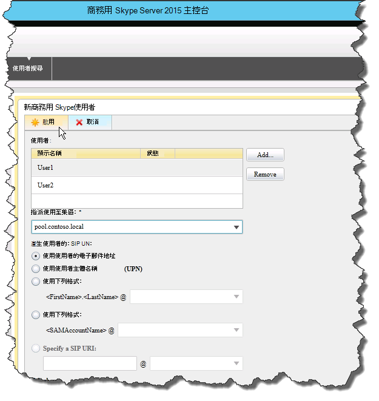

# 確認 商務用 Skype Server 中的拓撲
 
**總結：** 瞭解如何確認商務用 Skype Server拓撲和 Active Directory 伺服器如預期般運作。
  
在您已發佈拓撲，並在拓撲的每部伺服器上安裝商務用 Skype Server系統元件之後，您就可以確認拓撲是否如預期般運作。 這包括確認設定已傳播至所有 Active Directory 伺服器，讓整個網域知道網域中商務用 Skype可用。 您可以依任何循序執行步驟 1 到 5。 不過，您必須依序執行步驟 6、7 和 8，以及步驟 1 到 5 之後，如圖表中所述。 確認拓撲是步驟 8 之 8。
  

  
## 測試前端集區部署

最後一個步驟是測試前端集區，並確認商務用 Skype用戶端可以彼此通訊。 
  
### 新增使用者並驗證用戶端連線能力

1. 使用 Active Directory 電腦和使用者，將商務用 Skype Server部署 (系統管理員角色的 Active Directory 使用者物件新增至 **CSAdministrator** 群組) 商務用 Skype Server 主控台。
    
    > [!IMPORTANT]
    > 如果您未將適當的使用者和群組新增至 CsAdministors 群組，當您開啟商務用 Skype Server 主控台時會收到錯誤訊息：「未經授權：存取因角色型存取控制 (RBAC) 授權失敗而遭拒」。 
  
2. 如果使用者物件目前已登入，請登出，然後再次登入以註冊新的群組指派。
    
    > [!NOTE]
    > 使用者帳戶不能是執行商務用 Skype Server之任何伺服器的本機系統管理員。 
  
3. 使用系統管理帳戶登入已安裝商務用 Skype Server 主控台的電腦。
    
4. 啟動商務用 Skype Server 主控台，然後在出現提示時提供認證。 商務用 Skype Server 主控台顯示部署資訊。
    
5. 在左側導覽列中，按一下 [**拓撲**]，然後確認服務狀態顯示具有綠色箭號的電腦，且已部署並上線的每個商務用 Skype Server角色旁邊都有複寫狀態的綠色核取記號。 
    
6. 在左側導覽列中，按一下 [ **使用者**]，然後按一下 [ **啟用使用者]**。 
    
7. 在 [**新增商務用 Skype Server使用者**] 頁面上，按一下 [**新增]**。
    
8. 若要定義您要尋找之物件的搜尋參數，您可以在 [ **從 Active Directory 選** 取] 頁面上選取 [ **搜尋**]，然後選擇性地按一下 [ **新增篩選]**。 您也可以選取 **[LDAP 搜尋** ]，然後輸入 LDAP 運算式來篩選或限制將傳回的物件。 決定搜尋選項之後，按一下 [ **尋找]**。
    
9. 在 [搜尋結果] 窗格中，選取您要新增的使用者，然後按一下 [ **確定]**。
    
10. 在 [**新增商務用 Skype Server使用者**] 頁面上，您選取的使用者位於 [**使用者**] 顯示中。 在 [ **將使用者指派給集區** ] 清單中，選取使用者應該所在的伺服器。
    
    以下是可用來設定物件的選項清單。
    
    - **產生使用者的 SIP URI**
    
    - **電話**
    
    - **行 URI**
    
    - **會議原則**
    
    - **用戶端版本原則**
    
    - **PIN 原則**
    
    - **外部存取原則**
    
    - **封存原則**
    
    - **位置原則**
    
    - **用戶端原則**
    
    若要測試基本功能，請選取您偏好的 [ **產生使用者的 SIP URI** ] 設定選項 (組態中的其他選項使用預設設定) ，然後按一下 [ **啟用**]，如圖所示。
    
     
  
11. [摘要] 頁面隨即顯示，其中顯示 [ **已啟用** ] 資料行中的核取記號，以指出使用者已設定。 **[SIP 位址] 資料** 行會顯示使用者登入設定所需的位址。
    
     
  
12. 將一位使用者登入已加入網域的電腦，並將另一位使用者登入網域中的另一部電腦。
    
13. 在兩部用戶端電腦上安裝商務用 Skype用戶端，然後確認兩個使用者都可以登入商務用 Skype Server，並且可以互相傳送立即訊息。
    

