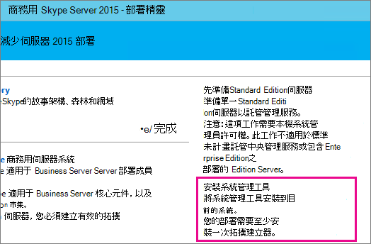
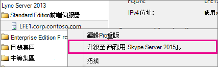
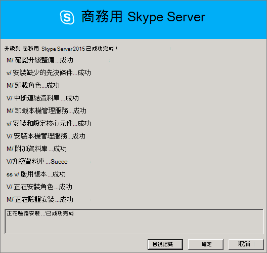
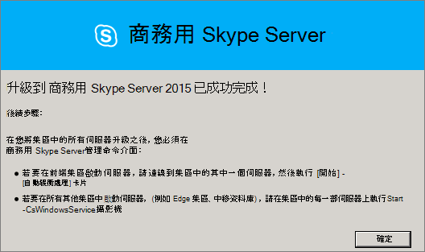
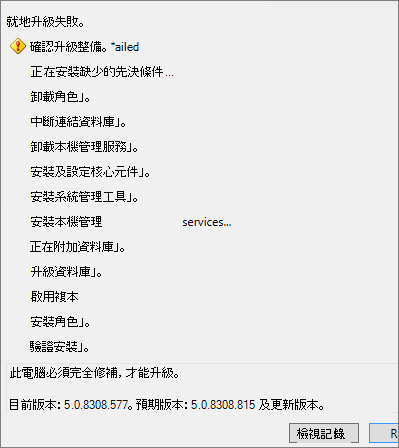

# <a name="upgrade-to-skype-for-business-server-2015"></a>升級為商務用 Skype Server 2015
 
**摘要：** 瞭解如何從 Lync Server 2013 升級為商務用 Skype Server 2015。 從[Microsoft 評估中心](https://www.microsoft.com/evalcenter/evaluate-skype-for-business-server)下載商務用 Skype Server 2015 的免費試用版。
  
使用本檔中的程式，透過使用商務用 Skype Server 拓撲產生器和新的 In-Place 升級功能，從 Lync Server 2013 升級為商務用 Skype Server 2015。 如果您想要從 Lync server 2010 或 Office 通訊伺服器 2007 R2 升級，請參閱[Plan to upgrade to 商務用 Skype Server 2015](../plan-your-deployment/upgrade.md)。

> [!NOTE]
> 就地升級可用於商務用 Skype Server 2015，但在商務用 Skype Server 2019 中已不再支援。 支援並排 coexistance，請參閱[遷移至商務用 Skype Server 2019](../../SfBServer2019/migration/migration-to-skype-for-business-server-2019.md)以取得詳細資訊。
  
## <a name="upgrade-from-lync-server-2013"></a>從 Lync Server 2013 升級

將 Lync Server 2013 升級為商務用 Skype Server 2015 包括安裝必要軟體，使用商務用 Skype Server 拓撲產生器升級集區中的資料庫，然後在與集區相關聯的每個伺服器上使用商務用 Skype Server In-Place 升級。 若要完成升級，請完成本主題中的8個步驟。
  
### <a name="before-you-begin"></a>開始之前

- 請檢查[方案，以升級為商務用 Skype Server 2015](../plan-your-deployment/upgrade.md)。
    
- 檢查[商務用 Skype Server 2015 的伺服器需求](../plan-your-deployment/requirements-for-your-environment/server-requirements.md)。
    
- [安裝商務用 Skype Server 2015 的必要條件](install/install-prerequisites.md)。
    
- [安裝商務用 Skype Server 2015](install/install.md) 。
    
### <a name="step-1-install-administrator-tools-and-download-topology"></a>步驟1：安裝系統管理員工具及下載拓撲

1. 連線至拓撲中未安裝 Lync Ocscore.msi 或任何其他 Lync 元件的電腦。
    
2. 從商務用 Skype Server 2015 安裝媒體，從 **OCS_Volume \setup\amd64** 執行 **Setup.exe** 。 
    
3. 按一下 **安裝**。 
    
4. 接受授權合約。
    
5. 在 [部署] 嚮導上，按一下 [ **安裝系統管理員工具**]，然後依照安裝的步驟進行安裝。
    
     
  
6. 在 [Windows 開始] 畫面中，開啟商務用 Skype Server 拓撲產生器。
    
7. 按一下 [ **從現有的部署下載拓撲**]，然後按 **[下一步]**。
    
8. 輸入拓撲的名稱，然後按一下 [ **儲存**]。
    
9. 移至您儲存拓撲的位置，並製作拓撲複本。
    
### <a name="step-2-upgrade-and-publish-topology-using-topology-builder"></a>步驟2：使用拓撲產生器升級和發行拓撲

開始升級程式之前，所有服務必須針對您計畫升級的集區執行。 如此一來，拓撲變更將會複寫到集區中伺服器的本機資料庫。
  
> [!IMPORTANT]
>  在升級之前，請先儲存拓撲檔案的複本。 升級之後，您將無法降級拓撲。 > 如果您的服務與資料庫位於相同的伺服器上，如 Persistent Chat service 與 Persistent Chat 資料庫位於相同的伺服器上，請略過此步驟，然後移至步驟4。 停止服務之後，請在每部伺服器上執行 In-Place 升級設定，以升級本機資料庫。
  
> [!NOTE]
> 如果拓撲具有鏡像的後端資料庫，當您使用拓撲產生器 **發行拓撲時** ，您會看到主體和鏡像資料庫都會顯示。 請確定主體上的所有資料庫都在執行中，並只在發行拓撲時選取主體，而不是鏡像，否則您會在發行拓撲之後看到一則警告。
  
選擇下列其中一個選項，透過使用商務用 Skype Server 2015 拓撲產生器來升級及發行新的拓撲。 完成步驟併發行更新後的拓撲之後，請移至本主題中的步驟3。
  
#### <a name="option-1-upgrade-an-isolated-front-end-pool-and-associated-archiving-and-monitoring-stores"></a>選項1：升級隔離的前端集區和相關聯的封存與監控存放區

如果您要升級的集區有封存與監控存放區相依性，當您使用下列步驟時，也會升級封存與監控存放區。
  
1. 在 [拓撲產生器] 中，以滑鼠右鍵按一下 [Lync Server 2013 集區]，然後選取 [**升級為商務用 Skype Server 2015**]，然後依照步驟執行。 
    
     
  
2. 在 [拓撲產生器] 中，按一下 [**動作**  >  **發佈拓撲**] 或 [**動作**  >  **拓撲**  >  **發佈**]。 
    
     ![[動作] 功能表的螢幕擷取畫面，具有拓撲產生器的 [發行拓撲] 選項。](../media/d6712634-9205-401f-a0b0-3ea096ca51bf.png)
  
3. 在發佈過程中，請選擇在封存與監控存放區上安裝資料庫。
    
#### <a name="option-2-upgrade-front-end-pool-without-upgrading-archiving-and-monitoring-stores"></a>選項2：升級前端集區，但不升級封存與監控存放區

如果您使用下列步驟，將會停用所選集區的封存和監控。 在升級後，集區將不會有封存和監控存放區。
  
1. 在 [拓撲產生器] 中，選取您要升級的 Lync Server 2013 集區。
    
2. 移除 Lync Server 2013 封存與監控存放區的相依性。 
    
   - 移至 [**動作**] [  >  **編輯屬性**]。
    
   - 清除 [ **封存** ] 核取方塊。
    
     ![[編輯內容] 對話方塊上的 [封存的螢幕擷取畫面] 核取方塊。](../media/9a88427e-80ee-49d0-a767-809fa9a5faf1.png)
  
   - 清除 [ **監視** ] 核取方塊。
    
     ![[編輯內容] 對話方塊的螢幕擷取畫面，showsr 監視] 核取方塊。](../media/880acf33-57bb-4521-8717-cf5b67261ed4.png)
  
3. 以滑鼠右鍵按一下 [Lync Server 2013 集區]，然後選取 [**升級為商務用 Skype Server 2015**]，然後依照步驟執行。 
    
     
  
4. 在 [拓撲產生器] 中，按一下 [**動作**  >  **發佈拓撲**] 或 [**動作**  >  **拓撲**  >  **發佈**]。 
    
#### <a name="option-3-upgrade-front-end-pool-and-associated-it-to-new-skype-for-business-server-2015-archiving-and-monitoring-stores"></a>選項3：將前端集區和相關專案升級至新的商務用 Skype Server 2015 封存與監控存放區

如果您使用下列步驟，封存和監控會停止在先前的存放區中，並在您建立的新存放區中開始。 
  
1. 在 [拓撲產生器] 中，選取您要升級的 Lync Server 2013 集區。 
    
2. 移除 Lync Server 2013 封存與監控存放區的相依性。 
    
   - 移至 [**動作**] [  >  **編輯屬性**]。
    
   - 清除 [ **封存** ] 核取方塊。
    
     ![[編輯內容] 對話方塊上的 [封存的螢幕擷取畫面] 核取方塊。](../media/9a88427e-80ee-49d0-a767-809fa9a5faf1.png)
  
   - 清除 [ **監視** ] 核取方塊。
    
     ![[編輯內容] 對話方塊的螢幕擷取畫面，showsr 監視] 核取方塊。](../media/880acf33-57bb-4521-8717-cf5b67261ed4.png)
  
3. 以滑鼠右鍵按一下 [Lync Server 2013 集區]，然後選取 [**升級為商務用 Skype Server 2015**]，然後依照步驟執行。 
    
     
  
4. 建立新的 SQL 儲存區進行封存。 
    
   - 選取 [集區] 和 [**動作**  >  **編輯] 屬性**。 
    
   -  選取 [封存] 核取方塊。
    
   - 按一下 [ **新增**]。
    
     ![[編輯屬性] 對話方塊的螢幕擷取畫面，顯示 [封存] 區段下的 [新增] 按鈕。](../media/3a4a18e7-8251-4736-837c-2b486f64f896.png)
  
5. 建立監視的新 SQL 儲存區。 
    
   - 選取 [集區] 和 [**動作**  >  **編輯] 屬性**。 
    
   -  選取 [ **監視** ] 核取方塊。
    
   - 按一下 [ **新增**]。
    
     ![[編輯內容] 對話方塊的螢幕擷取畫面，顯示 [監視] 區段下的 [新增] 按鈕。](../media/729c72a7-0068-4e0d-99dc-e480a6bfbf1d.png)
  
6. 在 [拓撲產生器] 中，按一下 [**動作**  >  **發佈拓撲**] 或 [**動作**  >  **拓撲**  >  **發佈**]。 
    
7. 在發佈過程中，請選擇在新的封存與監控存放區上安裝資料庫。
    
### <a name="step-3-wait-for-replication"></a>步驟3：等候複寫

將更新的拓撲發佈至環境中的所有伺服器，提供複寫一段時間。
  
### <a name="step-4-stop-all-services-in-pool-to-be-upgraded"></a>步驟4：停止要升級集區中的所有服務

在服務集區的每一部伺服器上，執行您要升級的下列 Cmdlet PowerShell:
  
```powershell
Disable-CsComputer -Scorch
```

我們建議使用 Disable-CsComputer，因為在 In-Place 升級程式期間，您可能需要重新開機伺服器。 如果您使用 Stop-CsWindowsService，一些服務可能會在重新開機後自動重新開機。 這可能會造成 In-Place 升級失敗。
  
### <a name="step-5-upgrade-front-end-pools-and-non-front-end-pool-servers"></a>步驟5：升級前端集區和非前端集區伺服器

> [!NOTE]
>  在升級之前，請安裝商務用 Skype Server 2015 所需的所有新必要條件，其中包括： > 至少32GB 可用空間，再嘗試升級。 此外，請確定磁片磁碟機是固定的本機磁片磁碟機，且未以 USB 或 Firewire 為單位進行連線。是以 NTFS 檔案系統格式化，不會壓縮，也不會包含頁面檔案。 > PowerShell 版本6.2.9200.0 或更新版本。 > 已安裝最新的 Lync Server 2013 累計更新。 > SQL Server 2012 SP1 安裝。 > 使用 Microsoft Update (，會自動安裝下列 KB 安裝的) ： > Windows Server 2008 r2-[KB2533623](https://support.microsoft.com/kb/2533623)> Windows Server 2012-[KB2858668](https://support.microsoft.com/kb/2858668)> Windows Server 2012 R2-[KB2982006](https://support.microsoft.com/kb/2982006)
  
在每一部伺服器上使用 In-Place 升級，以更新前端集區、Edge 集區、轉送伺服器及 Persistent Chat 集區。
  
1. 在每一部伺服器上，從商務用 Skype Server 2015 安裝媒體上 **OCS_Volume \setup\amd64** 中執行 **Setup.exe** 。
    
2. 接受授權合約，並遵循 In-Place 升級的提示。
    
3. 針對前端集區和每個非前端集區伺服器上的每一部伺服器，重複執行這些步驟。
    
> [!NOTE]
> 在 In-Place 升級期間，系統可能會提示您重新開機伺服器。 沒關係。 重新開機之後，In-Place 升級將從其離開的位置繼續。 
  
In-Place 升級順利完成時，您會看到下列訊息。
  

  
### <a name="step-6-restart-services-on-all-upgraded-servers"></a>步驟6：在所有已升級的伺服器上重新開機服務

> [!NOTE]
> 重新開機服務之前，請確定所有前端伺服器上都不存在%ProgramData%\WindowsFabric。 若存在，請先將它刪除，然後再啟動服務。 
  
- 在您升級前端集區中的所有伺服器後，請使用下列 PowerShell 命令重新開機服務： 
    
  ```powershell
  Start-CsPool
  ```

    > [!NOTE]
    > 如果在開始執行 In-Place 升級之前，需要重新開機待處理的系統，則 In-Place 升級會在安裝結束時要求重新開機。 當您嘗試使用 Start-CSPool Cmdlet 啟動服務時，會針對第一部前端伺服器引發某些元件例外狀況。 若要解決這些錯誤，請重新開機集區中的所有伺服器，然後再次執行 Cmdlet。 
  
- 在非前端集區伺服器上，使用下列命令重新開機服務：
    
  ```powershell
  Start-CsWindowsService
  ```

在 [In-Place 升級] 頁面上按一下 **[確定]** 之後，您將會看到下列提醒來完成此步驟。
  

  
### <a name="step-7-verify-skype-for-business-functionality-works"></a>步驟7：確認商務用 Skype 功能能夠運作

若要確定升級成功，請測試已升級的集區，並測試商務用 Skype，確定功能如預期般運作。 
  
### <a name="step-8-upgrade-secondary-pools"></a>步驟8：升級輔助集區

重複本主題中的步驟，以升級環境中所具備的任何其他集區。
  
## <a name="troubleshoot-issues-with-the-in-place-upgrade"></a>疑難排解 In-Place 升級的問題

如果 In-Place 升級失敗，您可能會看到類似下列圖像中的訊息。 
  

  
複查頁面底部的完整訊息，以協助您疑難排解問題。 按一下 [ **查看記錄** 檔] 以取得詳細資訊。
  
如果 In-Place 升級失敗若要 **驗證升級準備情況** 或 **安裝遺漏的必要條件**，請確定伺服器已套用所有最新的 Windows 伺服器、Lync server 和 SQL Server 更新，且已安裝所有必要的軟體和角色。 如需必要的清單，請參閱[商務用 Skype Server 2015 的伺服器需求](../plan-your-deployment/requirements-for-your-environment/server-requirements.md)，並[安裝商務用 Skype Server 2015 的必要條件](install/install-prerequisites.md)。
  
## <a name="see-also"></a>另請參閱

[規劃升級為商務用 Skype Server 2015](../plan-your-deployment/upgrade.md)
  
[商務用 Skype Server 2015 的伺服器需求](../plan-your-deployment/requirements-for-your-environment/server-requirements.md)
  
[安裝商務用 Skype Server 2015 的必要條件](install/install-prerequisites.md)
  
[安裝商務用 Skype Server 2015](install/install.md)
