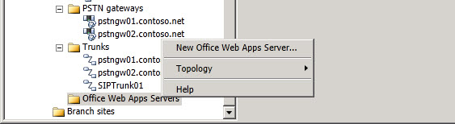

# Office Web Apps Server 範圍節點展開工具Office Web Apps Server Scope Node Expander
 
您可以在拓撲產生器中以滑鼠右鍵按一下 **Office Web Apps server** ，以執行下列作業：You right click on **Office Web Apps Servers** in Topology Builder to perform the following:
  
- **新的 Office Web Apps server**：啟動用來定義新 Office Web apps server 的 [ **定義新的 Office web apps server** ] 嚮導。**New Office Web Apps Server**: Starts the **Define New Office Web Apps Server** wizard used to define a new Office Web Apps Server.
    
除了 [新增 Office Web Apps Server] 選項，您還可以執行下列一般工作：In addition to the New Office Web Apps Server option, you can perform the following general tasks:
  

  
- **拓撲**。**Topology**. 您可以使用此選項來定義新的拓撲，開啟現有的拓撲，下載目前的拓撲，儲存拓撲的複本，發佈拓撲，安裝資料庫，從舊版中合併元件，或移除部署。You can use this option to define a new topology, open an existing topology, download the current topology, save a copy of the topology, publish the topology, install a database, merge components from previous versions, or remove the deployment.
    
- **說明**。您可以使用這個選項，存取作用中節點的說明。**Help**. You can use this option to access Help for the active node.
    

