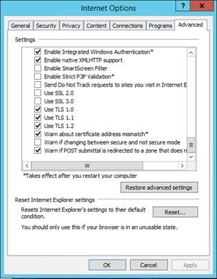

# <a name="disable-tls-1011-in-skype-for-business-server-2015"></a>在商務用 Skype Server 2015 中停用 TLS 1.0/1。1

本文可協助您準備及執行，在您的環境中停用 TLS 1.0 和1.1。 此程式需要大量的規劃與準備工作。 當您為組織停用 TLS 1.0 和1.1 時，請仔細閱讀本文中的所有資訊。 停用 TLS 1.0/1.1 時，可能會影響許多外部相依性和連線狀況，所以有保證進行大量的規劃和測試。

- [背景和範圍](#background-and-scope)
- [必要條件及處理常式](#prerequisites-and-process)
- [高級部署案例](#advanced-deployment-scenarios)

## <a name="background-and-scope"></a>背景和範圍

提供 TLS 1.0 和1.1 的主要驅動程式會停用商務用 Skype Server On-Premises 的支付卡行業 (PCI) 安全性標準理事會和聯邦資訊處理標準需求。 您可以在 [這裡](https://blog.pcisecuritystandards.org/are-you-ready-for-30-june-2018-sayin-goodbye-to-ssl-early-tls)找到 PCI 需求的詳細資訊。  Microsoft 不會提供您的組織是否需要遵守這些或其他需求的指導方針。 您必須決定是否需要在您的環境中停用 TLS 1.0 和/或1.1。

Microsoft 已于[這裡](https://cloudblogs.microsoft.com/microsoftsecure/2017/06/20/tls-1-2-support-at-microsoft/)產生可用 TLS 的白皮書，我們也建議您在此[Exchange 博客](https://blogs.technet.microsoft.com/exchange/2018/01/26/exchange-server-tls-guidance-part-1-getting-ready-for-tls-1-2/)中使用的背景讀取功能。

## <a name="supportability-scope"></a>支援範圍

*範圍* 指的是可支援的界限。 *經過完整測試及支援* ，表示我們完全支援並已針對所列的產品版本，對 TLS 1.0 和1.1 進行測試停用。 *目前正在調查* 的是這種方式。我們積極調查如何將這些產品帶入 TLS 停用支援的範圍內。 *超出範圍* 表示這些產品版本不支援停用 TLS 1.0 或1.1，而且不會運作，但有注明的例外狀況。

### <a name="fully-tested-and-supported-servers"></a>經過完整測試及支援的伺服器

- 商務用 Skype Server 2019 CU1 17.0.2046.123 (6 月 2019) 或更高版本
- 商務用 Skype Server 2015 CU9 6.0.9319.548 (2019) 或更新版本 Windows Server 2012，含 KB [3140245](https://support.microsoft.com/help/3140245/update-to-enable-tls-1-1-and-tls-1-2-as-a-default-secure-protocols-in)或取代更新 (，2012 R2 或2016。
- 就地升級商務用 Skype Server 2015，使用 CU9 6.0.9319.548 (2019) 或以上的 Windows Server 2008 R2，2012 (，含 KB [3140245](https://support.microsoft.com/help/3140245/update-to-enable-tls-1-1-and-tls-1-2-as-a-default-secure-protocols-in)或取代更新) 或 2012 R2。
- ExchangeExchange Server 2010 的連線和 Outlook Web App SP3 RU19 或更新版本，請參閱[此處](https://blogs.technet.microsoft.com/exchange/2018/01/26/exchange-server-tls-guidance-part-1-getting-ready-for-tls-1-2/)的指導方針
- Survivable Branch 裝置 (SBA) 使用商務用 Skype Server 2015 CU6 HF2 或更高版本 (向廠商確認他們是否已封裝適當的更新，並已供裝置使用) 
- Survivable Branch Server (SBS) 商務用 Skype Server 2015 CU6 HF2 或更高版本
- 僅限 Lync Server 2013 **Edge 角色**，這是因為 edge Role 對 Windows Fabric 1.0 沒有相依性。

### <a name="fully-tested-and-supported-clients"></a>經過充分測試及支援的用戶端

- Lync 2013 (商務用 Skype) 的桌面用戶端、MSI 及 C2R，包含基本[15.0.5023.1000 或更高版本](https://support.microsoft.com/help/4018334/april-3-2018-update-for-skype-for-business-2015-lync-2013-kb4018334)
- 商務用 Skype 2016 桌面用戶端（MSI [16.0.4678.1000 或更高版本](https://support.microsoft.com/help/4018323/april-3-2018-update-for-skype-for-business-2016-kb4018323)，包含基本
- 商務用 Skype 2016 按一下以執行（需要[四月 2018](/officeupdates/release-notes-office365-proplus)更新）： 
    - 每月和 Semi-Annual 目標，16 \. 0 \. 9126 \. 2152 或更高版本
    - Semi-Annual 和延時通道，16 \. 0 \. 8431 \. 2242 或更高版本
- Mac 16.15 或以上版本的商務用 Skype
- iOS 和 Android 6.19 或更高版本的商務用 Skype
- Microsoft Teams 會議室 (以前稱為 Skype 會議室 System v2 SRS v2) 4.0.64.0 (2018 年12月) 或更高版本
- Surface Hub 以 KB4499162 為基礎的 Team edition 更新 (2019 年5月、OS 組建 15063.1835) 或更高版本
- SkypeWeb App 2015 CU6 HF2 或更新版本 (隨附于伺服器) 

### <a name="currently-being-investigated"></a>目前正在調查

- 通話品質儀表板 (新安裝 TLS 1.0，1.1 已停用，請參閱下列) *。
 
### <a name="out-of-scope"></a>超出範圍

除了另有說明之外，下列產品不在 TLS 1.0/1.1 停用支援範圍內，而且在已停用 TLS 1.0 和1.1 的環境中不會運作。 這表示：如果您仍然使用範圍外的伺服器或用戶端，則必須在商務用 Skype Server 內部部署中的任何地方停用 TLS 1.0/1.1 時，更新或移除這些專案。

- Lync Server 2013
- Lync Server 2010
- Windows伺服器2008或更低
- Lync for Mac 2011
- Lync 2013，適用于行動裝置 iOS、iPad、Android 或 Windows Phone
- Lync "MX" Windows 儲存區用戶端
- Lync 會議室系統 (a.k.a。 SRSv1) 。 LRS 已于2018年10月9日到達支援的結尾，將不會更新以支援 TLS 1.2。
- 所有 Lync 2010 用戶端
- Lync 電話 Edition-更新的[指導方針](https://techcommunity.microsoft.com/t5/Skype-for-Business-Blog/Certified-Skype-for-Business-Online-Phones-and-what-this-means/ba-p/120035)。
- 2013基礎 Survivable Branch 裝置 (SBA) 或 Survivable Branch Server (SBS) 
- 雲端連接器版本 (CCE) 
- Windows Phone 版商務用 Skype

### <a name="exceptions"></a>例外狀況

#### <a name="lync-server-2013"></a>Lync Server 2013

Lync Server 2013 會對 Windows Fabric 版本1.0 進行相依相依的依賴性。  在 Lync Server 2013 的設計階段中，會針對其引人注目和新的分散式架構選擇 Windows Fabric 1.0，以提供複寫、高可用性及容錯。  隨著時間的推移，商務用 Skype Server 和 Windows Fabric 都會大幅提高這種聯合架構，在後續版本中有大量重新設計。  例如，目前的商務用 Skype 2015 Server 使用 Windows Fabric 3.0。

不幸的是，Windows Fabric 1.0 不 **支援 TLS 1.2。 不過，我們將更新 Lync Server 2013，以與 TLS 1.2 搭配** 使用。 這將會進入 Lync Server 2013 的下一個累計更新。  我們提供 TLS 1.2 支援，以啟用共存、遷移、同盟和混合案例。

如果您的組織必須停用 TLS 1.0 和1.1，而且您目前使用 Lync Server 2013，建議您開始規劃程式，但您可能必須在就地升級或並存遷移 (新集區，移動使用者) 以商務用 Skype Server 2015 或更高版本。  或者，您可能想要將遷移速度加速至商務用 Skype 線上。

#### <a name="call-quality-dashboard"></a>通話品質儀表板

On-Premises 通話品質儀表板目前在安裝新的安裝期間 (使用 TLS 1.0，) 安裝至 On-Premises 環境。  我們目前正在調查這項問題，並計畫在不久的未來發佈修復。  如果您計畫安裝 CQD，同時也停用 TLS 1.0，建議您先完成 CQD 安裝，然後繼續 TLS 1.0 停用。

#### <a name="skype-for-business-sdn-manager"></a>商務用 SkypeSDN 管理員

商務用 Skype使用 SQL 資料庫的 SDN 管理員在新安裝期間，對 TLS 1.0 的依賴性。 如果您打算使用資料庫 SQL 來安裝商務用 Skype SDN 管理員，同時也停用 TLS 1.0，我們建議您先完成商務用 Skype SDN manager，然後繼續進行 tls 1.0 停用。 在安裝之前停用了 tls 1.0 的情況下，您應該在 SQL Server 後端伺服器中暫時啟用 tls 1.0，以主控商務用 Skype SDN Manager SQL 資料庫。

#### <a name="third-party-devices"></a>協力廠商裝置

在協力廠商裝置（例如3PIP 電話、影片會議、反向 proxy 及負載平衡器）上，請務必驗證 TLS 1.2 支援性、仔細測試，並視需要與廠商聯繫。

### <a name="federation-considerations-when-disabling-tls-1011-on-edge-servers"></a>在 Edge server 上停用 TLS 1.0/1.1 時的同盟考慮

您必須仔細規劃並考慮停用 Edge server 上的 TLS 1.0/1.1 影響。  當 TLS 1.0 和1.1 停用之後，您可能會發現其他組織無法再與您的組織建立聯盟。

您可以選擇維持在 Edge server 上啟用 TLS 1.0/1.1，以維持與未修補的 (的回溯相容性 SfB 2015、Lync 2013) 或舊版 (2010) 外部系統。

當您的 Edge 網路 (或任何網路) 低於 PCI standard 時，Microsoft 無法提供相關意見或建議。必須由個別公司所決定。

商務用 Skype線上具備 TLS 1.2 的功能，因此不需要有線上的混合式/同盟影響。

PIC (公用 IM 連線) 以 Skype 消費者服務：我們不想停用 TLS 1.0/1.1 來影響[Skype](../../deploy/deploy-skype-connectivity.md)連線;Microsoft PIC 閘道已具備 TLS 1.2 的功能。

## <a name="prerequisites-and-process"></a>必要條件及處理常式

除了上面所述之外，只要 TLS 1.0 和1.1 停用超出範圍的伺服器，用戶端和裝置就能正常運作，或完全正常運作。 這可能表示您必須暫停並等候 Microsoft 的更新指導方針。 當您符合所有需求，且有計劃解決空缺時，請繼續進行。

在高層次，雖然商務用 Skype Server 2019 已準備好進行安裝程式，商務用 Skype Server 2015 將需要您安裝 CU9、將必要條件更新套用至 .net 及 SQL、部署必要條件登錄機碼，最後一輪個別的 OS 設定更新， (亦例如，透過登錄檔案匯入) 來停用 TLS 1.0 和1.1。 在 1.1 1.0 停用環境中的任何伺服器上之前，請務必先完成所有必要條件（包括商務用 Skype Server 2015 CU6 HF2）的安裝。 每個商務用 Skype 伺服器（包括 Edge role 及 SQL Backends）都需要更新。 此外，請確定所有支援的 (範圍) 用戶端都已更新為所需的最小版本。 別忘記同時更新管理工作站。

我們想遵循常見的「內部程式」運作順序，以升級商務用 Skype 伺服器。 以您平常的相同方式對待 Director 集區、持久聊天和配對的集區。 升級的[順序和](https://support.microsoft.com/help/3061064/updates-for-skype-for-business-server-2015)[方法如下所述。](topology.md)

### <a name="high-level-process"></a>高層級流程

1. 在設定實際執行伺服器之前，請先測試實驗室中的所有步驟。
2. 在每個要更新的個別伺服器及每一部伺服器上備份及保留匯出登錄的複本。 您無法在伺服器間共用註冊表;它們包含唯一的機器型機碼。
3. 將所有商務用 Skype 2015 伺服器升級為 CU9 或更高版本。 若為商務用 Skype Server 2019，請升級為 CU1 或更高版本。
4. 安裝所有伺服器的所有必要條件。
5. 部署必要登錄機碼。
6. 確定所有的範圍內用戶端都已更新。
7. 透過登錄匯入停用 TLS 1.0 和1.1。
8. 驗證工作負載是否如預期般運作。
    - 如果遇到問題、疑難排解及解決問題，或
    - 從步驟2還原註冊表以重新啟用 TLS 1.0 和1。1
9. 驗證只會使用 TLS 1.2。

### <a name="install-prerequisites-to-all-servers"></a>安裝所有伺服器的必要條件

在您開始停用商務用 Skype Server 2015 部署中作業系統層級的 TLS 1.0 和1.1 之前，需要進行大量的相依性更新。 以下是可支援 TLS 1.2 的最小版本。 在您開始停用 TLS 1.0 和1.1 之前，請先在環境中的每一部商務用 Skype 伺服器上部署所有必要條件更新。

- 商務用 Skype Server 2015 CU9 6.0.9319.548 (2019) 或更高版本
- 在下列的登錄 (中啟用 SchUseStrongCrypto [.NET Framework 4.7](https://www.microsoft.com/download/details.aspx?id=55167)或更高版本) 
- 在所有商務用 Skype 2015 伺服器和 backends 上都必須更新 SQL。 先更新 Enterprise Edition 集區 SQL Backends，然後再更新其各自的 FEs。 
    - [SQL Server 2014 SP1 + CU5](https://support.microsoft.com/help/3130926)或更高版本/SQL Server 2012 SP2 + CU16 或更高/ [SQL Server 2014 RTM + CU12](https://support.microsoft.com/help/3130923/cumulative-update-12-for-sql-server-2014)或更高/SQL Server 2014 SP2
     - [SQL Server 2012 的 SQL Server Native Client](https://www.microsoft.com/download/details.aspx?id=50402)
     - SQL Server 或更高版本[的 Microsoft ODBC Driver 11](https://www.microsoft.com/download/details.aspx?id=36434)
     - [SQL Server 2014 的共用管理物件 SP2](https://www.microsoft.com/download/details.aspx?id=53164)
     - [SQL server 2014 的 SQLSysClrTypes SP2](https://www.microsoft.com/download/details.aspx?id=42295)

### <a name="basic-steps-to-install-pre-requisites-in-recommended-order-of-operations"></a>安裝先決條件的基本步驟，以建議的作業順序進行

1. 將商務用 Skype Server CU9 更新安裝到所有伺服器。 
    1. 使用更新安裝元件的更新。
    2. 根據記錄的程式更新資料庫。 如需商務用 Skype Server 2015，請參閱 KB [3061064](https://support.microsoft.com/help/3061064/updates-for-skype-for-business-server-2015)。
    3. 先驗證部署中的產品功能，再與其他任何變更一起向前移動。
2. 下載 .NET 4.7 離線安裝程式。 
    1. 參考：[https://www.microsoft.com/download/details.aspx?id=55167](https://www.microsoft.com/download/details.aspx?id=55167)
    2. 確定前端伺服器上的商務用 Skype Server 2015 服務已停止。
    3. 參考：[https://support.microsoft.com/help/3061064/updates-for-skype-for-business-server-2015](https://support.microsoft.com/help/3061064/updates-for-skype-for-business-server-2015)
    4. Ex (Standard Edition) ：```Stop-CsWindowsService```
    5. Ex (Enterprise Edition) ：```Invoke-CsComputerFailover```
    6. 執行安裝程式套件。
    7. 重新啟動伺服器。
3. 在所有伺服器上更新 SQL Express 2014。 
    1. 參考：[https://support.microsoft.com/help/3135244/tls-1-2-support-for-microsoft-sql-server](https://support.microsoft.com/help/3135244/tls-1-2-support-for-microsoft-sql-server)
    2. 下載 SQL 2014 SP2 
        - 參考：[https://www.microsoft.com/download/details.aspx?id=53168](https://www.microsoft.com/download/details.aspx?id=53168)
    3. 將安裝媒體複製到伺服器上的資料夾中 (Ex： C：\ 01_2014SqlSp2) 
    4. 確定前端伺服器上的商務用 Skype Server 2015 服務已停止 
        - Ex (Standard Edition) ：```Stop-CsWindowsService```
        - Ex (Enterprise Edition) ：```Invoke-CsComputerFailover```
    5. 開啟系統管理命令提示字元，並升級所有已安裝的元件和實例 
        - 範例： C:\01_2014SqlSp2\SQLServer2014SP2-KB3171021-x64-ENU.exe/qs/IAcceptSQLServerLicenseTerms/Action = Patch/AllInstances
4. 更新 SQL Native Client。 
    1. 參考： [https://support.microsoft.com/help/3135244/tls-1-2-support-for-microsoft-sql-server](https://support.microsoft.com/help/3135244/tls-1-2-support-for-microsoft-sql-server) 。
    2. 下載來源 [https://www.microsoft.com/download/details.aspx?id=50402](https://www.microsoft.com/download/details.aspx?id=50402)
    3. 確定前端伺服器上的商務用 Skype Server 2015 服務已停止。 
        - Ex (Standard Edition) ：```Stop-CsWindowsServices```
        - Ex (Enterprise Edition) ：```Invoke-CsComputerFailover```
    4. 停止已安裝的 SQL 實例 
        - 前： ```Get-Service 'MSSQL$RTCLOCAL' | Stop-Service```
        - 前： ```Get-Service 'MSSQL$LYNCLOCAL' | Stop-Service```
        - Ex (僅 Standard Edition) ：```Get-Service 'MSSQL$RTC' | Stop-Service```
    5. 安裝更新。
5. 更新 ODBC Driver 11 的 SQL Server，以包含對 TLS 1.2 (KB [3135244](https://support.microsoft.com/help/3135244/tls-1-2-support-for-microsoft-sql-server)) 的支援。
    1. 下載[SQL Server Windows 的 ODBC 驅動程式 11](https://www.microsoft.com/download/confirmation.aspx?id=36434)。
    2. 確定前端伺服器上的商務用 Skype Server 2015 服務已停止。
        - 範例 (Standard Edition) ：```Stop-CsWindowsService```
        - 範例 (Enterprise Edition) ：```Invoke-CsComputerFailover```
    3. 安裝更新。
6. 部署必要登錄機碼。

### <a name="pre-requisite-registry-keys"></a>預備必要條件登錄機碼

將下列測試複製/貼回記事本，然後重新命名 TLSPreReq，或是您選擇的名稱，然後匯入：

```console
Windows Registry Editor Version 5.00

[HKEY_LOCAL_MACHINE\SOFTWARE\Microsoft\.NETFramework\v2.0.50727]

"SchUseStrongCrypto"=dword:00000001

[HKEY_LOCAL_MACHINE\SOFTWARE\Microsoft\.NETFramework\v4.0.30319]

"SchUseStrongCrypto"=dword:00000001

[HKEY_LOCAL_MACHINE\SOFTWARE\Wow6432Node\Microsoft\.NETFramework\v2.0.50727]

"SchUseStrongCrypto"=dword:00000001

[HKEY_LOCAL_MACHINE\SOFTWARE\Wow6432Node\Microsoft\.NETFramework\v4.0.30319]

"SchUseStrongCrypto"=dword:00000001

[HKEY_LOCAL_MACHINE\SOFTWARE\Microsoft\Windows\CurrentVersion\Internet Settings\WinHttp]

"DefaultSecureProtocols"=dword:00000AA0

[HKEY_LOCAL_MACHINE\SOFTWARE\Wow6432Node\Microsoft\Windows\CurrentVersion\Internet Settings\WinHttp]

"DefaultSecureProtocols"=dword:00000AA0

[HKEY_LOCAL_MACHINE\SYSTEM\CurrentControlSet\Control\SecurityProviders\SCHANNEL\Protocols\TLS 1.2]

[HKEY_LOCAL_MACHINE\SYSTEM\CurrentControlSet\Control\SecurityProviders\SCHANNEL\Protocols\TLS 1.2\Client]

"DisabledByDefault"=dword:00000000

"Enabled"=dword:00000001

[HKEY_LOCAL_MACHINE\SYSTEM\CurrentControlSet\Control\SecurityProviders\SCHANNEL\Protocols\TLS 1.2\Server]

"DisabledByDefault"=dword:00000000

"Enabled"=dword:00000001
```

針對 Enterprise Edition 集區的 SQL 後端，應將必要條件和 TLS 停用視為任何 SQL 或作業系統更新;請參閱：[https://docs.microsoft.com/skypeforbusiness/manage/topology/patch-or-update-a-back-end-or-standard-edition-server](./patch-or-update-a-back-end-or-standard-edition-server.md)

當必要的應用程式和 TLS 停用步驟都能結合時，強烈建議先套用所有必要條件，再繼續停用作業系統層級的 TLS 1.0 和1.1。 最佳作法方法是部署所有必要條件，以驗證工作負載是否正常運作及預期，然後繼續執行 TLS 1.0/1.1，以準備環境。

### <a name="disable-tls-10-and-11-via-registry-import"></a>經由登錄匯入停用 TLS 1.0 和1。1

繼續進行下一個步驟之前，*請確定您已完成所有必要條件，並更新商務用 Skype 伺服器*。

將下列文字複製到記事本檔案，並將其重新命名 **TLSDisable**：

```console
Windows Registry Editor Version 5.00

[HKEY_LOCAL_MACHINE\SOFTWARE\Policies\Microsoft\Cryptography\Configuration\SSL\00010002]

"Functions"="TLS_ECDHE_ECDSA_WITH_AES_256_GCM_SHA384_P384,TLS_ECDHE_ECDSA_WITH_AES_128_GCM_SHA256_P256,TLS_ECDHE_RSA_WITH_AES_256_GCM_SHA384_P384,TLS_ECDHE_RSA_WITH_AES_128_GCM_SHA256_P256,TLS_ECDHE_ECDSA_WITH_AES_256_CBC_SHA384_P384,TLS_ECDHE_ECDSA_WITH_AES_128_CBC_SHA256_P256,TLS_ECDHE_RSA_WITH_AES_256_CBC_SHA384_P384,TLS_ECDHE_RSA_WITH_AES_128_CBC_SHA256_P256,TLS_RSA_WITH_AES_256_GCM_SHA384,TLS_RSA_WITH_AES_128_GCM_SHA256,TLS_RSA_WITH_AES_256_CBC_SHA256,TLS_RSA_WITH_AES_128_CBC_SHA256"

[HKEY_LOCAL_MACHINE\SYSTEM\CurrentControlSet\Control\SecurityProviders\SCHANNEL]

"AllowInsecureRenegoClients"=dword:00000000

"AllowInsecureRenegoServers"=dword:00000000

[HKEY_LOCAL_MACHINE\SYSTEM\CurrentControlSet\Control\SecurityProviders\SCHANNEL\Ciphers]

[HKEY_LOCAL_MACHINE\SYSTEM\CurrentControlSet\Control\SecurityProviders\SCHANNEL\Ciphers\AES 128/128]

"Enabled"=dword:FFFFFFFF

[HKEY_LOCAL_MACHINE\SYSTEM\CurrentControlSet\Control\SecurityProviders\SCHANNEL\Ciphers\AES 256/256]

"Enabled"=dword:FFFFFFFF

[HKEY_LOCAL_MACHINE\SYSTEM\CurrentControlSet\Control\SecurityProviders\SCHANNEL\Ciphers\DES 56/56]

"Enabled"=dword:00000000

[HKEY_LOCAL_MACHINE\SYSTEM\CurrentControlSet\Control\SecurityProviders\SCHANNEL\Ciphers\NULL]

"Enabled"=dword:00000000

[HKEY_LOCAL_MACHINE\SYSTEM\CurrentControlSet\Control\SecurityProviders\SCHANNEL\Ciphers\RC2 128/128]

"Enabled"=dword:00000000

[HKEY_LOCAL_MACHINE\SYSTEM\CurrentControlSet\Control\SecurityProviders\SCHANNEL\Ciphers\RC2 40/128]

"Enabled"=dword:00000000

[HKEY_LOCAL_MACHINE\SYSTEM\CurrentControlSet\Control\SecurityProviders\SCHANNEL\Ciphers\RC2 56/128]

"Enabled"=dword:00000000

[HKEY_LOCAL_MACHINE\SYSTEM\CurrentControlSet\Control\SecurityProviders\SCHANNEL\Ciphers\RC2 56/56]

"Enabled"=dword:00000000

[HKEY_LOCAL_MACHINE\SYSTEM\CurrentControlSet\Control\SecurityProviders\SCHANNEL\Ciphers\RC4 128/128]

"Enabled"=dword:00000000

[HKEY_LOCAL_MACHINE\SYSTEM\CurrentControlSet\Control\SecurityProviders\SCHANNEL\Ciphers\RC4 40/128]

"Enabled"=dword:00000000

[HKEY_LOCAL_MACHINE\SYSTEM\CurrentControlSet\Control\SecurityProviders\SCHANNEL\Ciphers\RC4 56/128]

"Enabled"=dword:00000000

[HKEY_LOCAL_MACHINE\SYSTEM\CurrentControlSet\Control\SecurityProviders\SCHANNEL\Ciphers\RC4 64/128]

"Enabled"=dword:00000000

[HKEY_LOCAL_MACHINE\SYSTEM\CurrentControlSet\Control\SecurityProviders\SCHANNEL\Ciphers\Triple DES 168]

"Enabled"=dword:00000000

[HKEY_LOCAL_MACHINE\SYSTEM\CurrentControlSet\Control\SecurityProviders\SCHANNEL\Hashes]

[HKEY_LOCAL_MACHINE\SYSTEM\CurrentControlSet\Control\SecurityProviders\SCHANNEL\Hashes\MD5]

"Enabled"=dword:00000000

[HKEY_LOCAL_MACHINE\SYSTEM\CurrentControlSet\Control\SecurityProviders\SCHANNEL\Hashes\SHA]

"Enabled"=dword:FFFFFFFF

[HKEY_LOCAL_MACHINE\SYSTEM\CurrentControlSet\Control\SecurityProviders\SCHANNEL\Hashes\SHA256]

"Enabled"=dword:FFFFFFFF

[HKEY_LOCAL_MACHINE\SYSTEM\CurrentControlSet\Control\SecurityProviders\SCHANNEL\Hashes\SHA384]

"Enabled"=dword:FFFFFFFF

[HKEY_LOCAL_MACHINE\SYSTEM\CurrentControlSet\Control\SecurityProviders\SCHANNEL\Hashes\SHA512]

"Enabled"=dword:FFFFFFFF

[HKEY_LOCAL_MACHINE\SYSTEM\CurrentControlSet\Control\SecurityProviders\SCHANNEL\KeyExchangeAlgorithms]

[HKEY_LOCAL_MACHINE\SYSTEM\CurrentControlSet\Control\SecurityProviders\SCHANNEL\KeyExchangeAlgorithms\Diffie-Hellman]

"Enabled"=dword:FFFFFFFF

[HKEY_LOCAL_MACHINE\SYSTEM\CurrentControlSet\Control\SecurityProviders\SCHANNEL\KeyExchangeAlgorithms\ECDH]

"Enabled"=dword:FFFFFFFF

[HKEY_LOCAL_MACHINE\SYSTEM\CurrentControlSet\Control\SecurityProviders\SCHANNEL\KeyExchangeAlgorithms\PKCS]

"Enabled"=dword:FFFFFFFF

[HKEY_LOCAL_MACHINE\SYSTEM\CurrentControlSet\Control\SecurityProviders\SCHANNEL\Protocols]

[HKEY_LOCAL_MACHINE\SYSTEM\CurrentControlSet\Control\SecurityProviders\SCHANNEL\Protocols\Multi-Protocol Unified Hello]

[HKEY_LOCAL_MACHINE\SYSTEM\CurrentControlSet\Control\SecurityProviders\SCHANNEL\Protocols\Multi-Protocol Unified Hello\Client]

"DisabledByDefault"=dword:00000001

"Enabled"=dword:00000000

[HKEY_LOCAL_MACHINE\SYSTEM\CurrentControlSet\Control\SecurityProviders\SCHANNEL\Protocols\Multi-Protocol Unified Hello\Server]

"DisabledByDefault"=dword:00000001

"Enabled"=dword:00000000

[HKEY_LOCAL_MACHINE\SYSTEM\CurrentControlSet\Control\SecurityProviders\SCHANNEL\Protocols\PCT 1.0]

[HKEY_LOCAL_MACHINE\SYSTEM\CurrentControlSet\Control\SecurityProviders\SCHANNEL\Protocols\PCT 1.0\Client]

"DisabledByDefault"=dword:00000001

"Enabled"=dword:00000000

[HKEY_LOCAL_MACHINE\SYSTEM\CurrentControlSet\Control\SecurityProviders\SCHANNEL\Protocols\PCT 1.0\Server]

"DisabledByDefault"=dword:00000001

"Enabled"=dword:00000000

[HKEY_LOCAL_MACHINE\SYSTEM\CurrentControlSet\Control\SecurityProviders\SCHANNEL\Protocols\SSL 2.0]

[HKEY_LOCAL_MACHINE\SYSTEM\CurrentControlSet\Control\SecurityProviders\SCHANNEL\Protocols\SSL 2.0\Client]

"DisabledByDefault"=dword:00000001

"Enabled"=dword:00000000

[HKEY_LOCAL_MACHINE\SYSTEM\CurrentControlSet\Control\SecurityProviders\SCHANNEL\Protocols\SSL 2.0\Server]

"DisabledByDefault"=dword:00000001

"Enabled"=dword:00000000

[HKEY_LOCAL_MACHINE\SYSTEM\CurrentControlSet\Control\SecurityProviders\SCHANNEL\Protocols\SSL 3.0]

[HKEY_LOCAL_MACHINE\SYSTEM\CurrentControlSet\Control\SecurityProviders\SCHANNEL\Protocols\SSL 3.0\Client]

"DisabledByDefault"=dword:00000001

"Enabled"=dword:00000000

[HKEY_LOCAL_MACHINE\SYSTEM\CurrentControlSet\Control\SecurityProviders\SCHANNEL\Protocols\SSL 3.0\Server]

"DisabledByDefault"=dword:00000001

"Enabled"=dword:00000000

[HKEY_LOCAL_MACHINE\SYSTEM\CurrentControlSet\Control\SecurityProviders\SCHANNEL\Protocols\TLS 1.0]

[HKEY_LOCAL_MACHINE\SYSTEM\CurrentControlSet\Control\SecurityProviders\SCHANNEL\Protocols\TLS 1.0\Client]

"DisabledByDefault"=dword:00000001

"Enabled"=dword:00000000

[HKEY_LOCAL_MACHINE\SYSTEM\CurrentControlSet\Control\SecurityProviders\SCHANNEL\Protocols\TLS 1.0\Server]

"DisabledByDefault"=dword:00000001

"Enabled"=dword:00000000

[HKEY_LOCAL_MACHINE\SYSTEM\CurrentControlSet\Control\SecurityProviders\SCHANNEL\Protocols\TLS 1.1]

[HKEY_LOCAL_MACHINE\SYSTEM\CurrentControlSet\Control\SecurityProviders\SCHANNEL\Protocols\TLS 1.1\Client]

"DisabledByDefault"=dword:00000001

"Enabled"=dword:00000000

[HKEY_LOCAL_MACHINE\SYSTEM\CurrentControlSet\Control\SecurityProviders\SCHANNEL\Protocols\TLS 1.1\Server]

"DisabledByDefault"=dword:00000001

"Enabled"=dword:00000000
```

在您要停用 TLS 1.0 和1.1 的每部伺服器上，匯入 .reg 檔案。 重新啟動伺服器。 服務回到線上後，請移至下一個伺服器。 Enterprise Edition 集區的方法與任何作業系統更新所需的方式相同。

您可能已注意到，我們執行的工作不只是在這裡停用 TLS 1.0 和1.1。 我們支援密碼套件重新排序 (如上所示) 以及停用某些較舊的弱密碼。 這是我們第一次在商務用 Skype Server 上為 SCHANNEL 和加密 API 所做的變更。請務必注意，這些變更是我們所支援的，且已在此時間加以測試。 我們可能會在未來考慮其他設定，但是現在，請不要在您的實施中修改登錄匯入檔案。

### <a name="validate-that-workloads-are-functioning-as-expected"></a>驗證工作負載是否如預期般運作

在您的環境中停用 TLS 1.0 和1.1 後，請確定您的主要工作負載會如預期般運作，例如 IM & 目前狀態、P2P 通話、企業語音等。

**只驗證 TLS 1.2 正在使用中**

讓您的安全小組執行商務用 Skype 流量的新審核，以確保已不再使用較舊的通訊協定 TLS 1.0 和1.1。

或者，您也可以使用 Internet Explorer，在 tls 1.0 和 tls 1.1 已停用之後，從商務用 Skype Server 2015 測試與 web 服務之間的 tls 連線。

1. 啟動 Internet Explorer。
2. 選取 [**工具**  >  **網際網路選項**]。
3. 選取 [進階] 索引標籤。
4. 在 [**設定**] 底下，向下移動。
5. 確認 TLS 1.0、TLS 1.1 及 TLS 1.2 皆已啟用。
6. 流覽 SfB 2015 集區 (的內部 Web 服務 URL，) 應該成功連接。
7. 請回到 Internet Explorer，並停 **用只使用 TLS 1.2** 的選項。
8. 請再次流覽 SfB 2015 集區的內部 Web 服務 URL (應該會無法連接) 。



## <a name="advanced-deployment-scenarios"></a>高級部署案例

因為在商務用 Skype Server 2015 中需要一些相依性必要條件來支援 tls 1.2，所以在已停用 tls 1.0 和1.1 的任何系統上安裝 RTM 介質時，將會失敗。

**在您的環境中已停用 TLS 1.0 和1.1 時，部署新的 Standard Edition 伺服器或 Enterprise Edition 集區。**

**選項1：** 使用 [SmartSetup](../../deploy/install/install-skype-for-business-server.md)。 請注意，我們將更新 SmartSetup，以在未來的 CU 中容納更新的 SQL 二進位檔，並將在未來更新此文章。

**選項2：** (RTCLOCAL 及 LYNCLOCAL 的預先安裝本機 SQL 實例) 

1. 下載並複製 SQL Express 2014 SP2 (SQLEXPR_x64.exe) 于 FE 上的本機資料夾。 讓我們說 <SQL_FOLDER_PATH> 的資料夾路徑。
2. 啟動 PowerShell 或命令提示字元，並流覽至 <SQL_FOLDER_PATH>。
3. 執行下列命令，以建立 RTCLOCAL SQL 實例。 請等到 SQLEXPR_x64.exe 完成，再繼續執行：

    SQLEXPR_x64.exe/Q/IACCEPTSQLSERVERLICENSETERMS/UPDATEENABLED = 0/HIDECONSOLE/ACTION = Install/FEATURES = SQLEngine，Tools/INSTANCENAME = RTCLOCAL/TCPENABLED = 1/SQLSVCACCOUNT = "NT AUTHORITY\NetworkService"/SQLSYSADMINACCOUNTS = "Builtin\Administrators"/BROWSERSVCSTARTUPTYPE = "Automatic"/AGTSVCACCOUNT = "NTAUTHORITY\NetworkService"/SQLSVCSTARTUPTYPE = Automati
1. 執行下列命令，以建立 LYNCLOCAL SQL 實例。 請等到 SQLEXPR_x64.exe 完成，再繼續進行下一個步驟：

    SQLEXPR_x64.exe/Q/IACCEPTSQLSERVERLICENSETERMS/UPDATEENABLED = 0/HIDECONSOLE/ACTION = Install/FEATURES = SQLEngine，Tools/INSTANCENAME = LYNCLOCAL/TCPENABLED = 1/SQLSVCACCOUNT = "NT AUTHORITY\NetworkService"/SQLSYSADMINACCOUNTS = "Builtin\Administrators"/BROWSERSVCSTARTUPTYPE = "Automatic"/AGTSVCACCOUNT = "NTAUTHORITY\NetworkService"/SQLSVCSTARTUPTYPE = Automatic
1. 執行商務用 Skype Server 2015 RTM 設定。
2. 請遵循上述必要條件一節中的其餘步驟。

**選項3：** 您也可以手動取代本機安裝媒體目錄中的二進位檔，如下所示：

1. [安裝商務用 Skype Server 的必要條件](../../deploy/install/install-prerequisites.md)  
2. 安裝 .NET 4.7： 
      - **附注：** 我們第一次在商務用 Skype Server 2015 CU5 (6.0.9319.281) 中引進 .net 4.7 的支援。 因此，在後面的步驟中，我們會在主安裝之前更新核心元件。
      - 下載： https://www.microsoft.com/download/details.aspx?id=55167 。 
      - 參考：[應該在商務用 Skype Server 2015 部署之前安裝的軟體](../../plan-your-deployment/requirements-for-your-environment/server-requirements.md#software-that-should-be-installed-before-a-skype-for-business-server-2015-deployment)
3. 複製 ISO 檔案/資料夾： 
    - 在附加商務用 Skype Server 2015 ISO 的情況下，以檔案瀏覽器中 (Ex： D：的方式，開啟它所附加之磁片磁碟機的根目錄 \) 。
    - 將所有資料夾及檔案複製到本機磁片的資料夾中 (Ex： C:\SkypeForBusiness2015ISO) 。
    - **附注：** 安裝元件之前，必須更新部分檔案，以支援 TLS 1.2。
4. 取代 MSI/EXE 套件： 
    - 將現有的 MSI 和 EXE 套件取代在本機電腦上安裝媒體的/Setup/amd64/資料夾中。
    - SQL 2014 SP2 Express：https://www.microsoft.com/download/details.aspx?id=53167 
        - 在本機電腦上重新命名為 SQLEXPR_x64，並取代安裝媒體安裝程式/amd64/資料夾中現有的檔案。
    - SQL Native Client：https://www.microsoft.com/download/details.aspx?id=50402 
        - **附注：** 如有需要 sqlncli.msi，請將其重新命名，然後取代安裝媒體安裝程式/amd64/資料夾中存在的現有檔案。
    - SQL管理物件：https://www.microsoft.com/download/details.aspx?id=53164 
        - **附注：** 功能套件會有許多可以下載的專案。 選取只下載 SharedManagementObjects.msi。
        - **附注：** 取代安裝媒體之 Setup/amd64/資料夾中存在的現有檔案。
    - SQLCLR 類型：https://www.microsoft.com/download/details.aspx?id=53164 
        - **附注：** 功能套件會有許多可以下載的專案。 選取只下載 CQLSysClrTypes.msi
        - **附注**：取代安裝媒體之 Setup/amd64/資料夾中存在的現有檔案。
5. 安裝核心元件： 
    - 從安裝媒體的 Setup/amd64/amd64 執行 Setup.exe。 依照指示安裝核心元件
    - 關閉核心元件。
6. 更新核心元件： 
    - 下載商務用 Skype 更新安裝程式。
    - 執行安裝程式以更新核心元件，並安裝效能計數器。
    - **附注：** 從 CU6HF2 發行時，目前只會安裝「自動更新」功能 CU6。 因此，必須另行執行更新，以將核心元件更新為6.0.9319.516。
    - 參考： https://support.microsoft.com/help/3061064/updates-for-skype-for-business-server-2015
7. 安裝系統管理工具 (選用) ： 
    - 這將會使用更新的檔案，安裝 Microsoft SQL Server 2012 Native Client、SQL Server 2014 管理物件 (x64) 及 Microsoft 系統 CLR 類型 SQL Server 2014 (x64) 。 此外，在本機電腦上也可使用商務用 Skype Server 2015 拓撲產生器和控制台。
8. 安裝本機設定存放區 (步驟 1) ： 
     - 開啟部署嚮導，按一下 [安裝或更新商務用 Skype Server 系統]，然後按一下 [步驟1：安裝本機設定存放區] 中的 [**執行**]。
     - 在 [**安裝本機設定存放區**] 對話方塊中，按 **[下一步**]。
     
     - 檢查結果，並確定任務狀態為 [已完成]。 按一下 [ **查看記錄** 檔] 以複查所產生的記錄檔。
     ![工作狀態顯示為 [已完成]。](../../media/local-configuration-task-completed.png)
     - 按一下 **[完成]**。
9.  (步驟 2) 設定或移除商務用 Skype Server 元件：
    - 開啟部署嚮導，按一下 [**安裝或更新商務用 Skype Server 系統**]，然後按一下 [步驟2：設定或移除商務用 Skype Server 元件] 中的 [**執行**]。
    - 在 [設定商務用 Skype Server 元件] 對話方塊中，按 **[下一步**]。
    ![設定商務用 Skype Server 元件] 視窗。](../../media/set-up-skype-for-business-server-components-window.png)
    - 使用 View Log 複查記錄檔，並驗證安裝程式是否順利完成。 
    - 按一下 **[完成]**。
10. 如有需要，繼續進行其他安裝和設定 (您可以在此點繼續正常安裝程式) 。