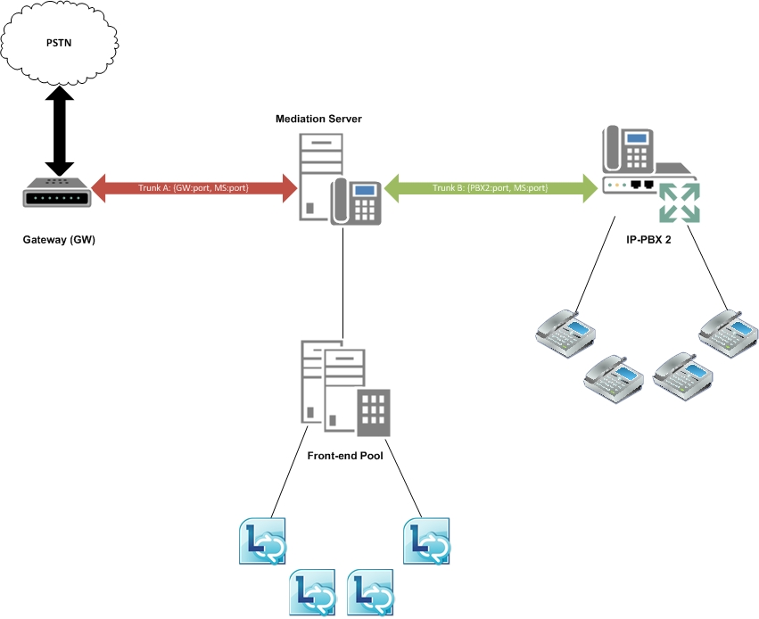

# 商務用 Skype 伺服器中的中繼站間路由

商務用 Skype 伺服器提供基本的會話管理, 並支援 intertrunk 路由。 此功能可讓商務用 Skype Server 提供對下游電話系統的呼叫控制功能。 Intertrunk 路由可以將 IP PBX 互連至公用的交換電話網絡 (PSTN) 閘道, 讓來自私人分支 exchange (PBX) 電話的呼叫可以路由到 PSTN, 而且傳入 PSTN 呼叫可以路由到 PBX 電話。 同樣地, 商務用 Skype 伺服器可以相互連接兩個或多個 IP PBX 系統, 以便在不同 IP PBX 系統的 PBX 手機之間進行呼叫和接收。 

下圖說明在 PSTN 閘道與 IP PBX 之間提供 interconnectivity 的商務用 Skype 伺服器。

下圖說明連接兩個 IP PBX 系統的商務用 Skype 伺服器。

