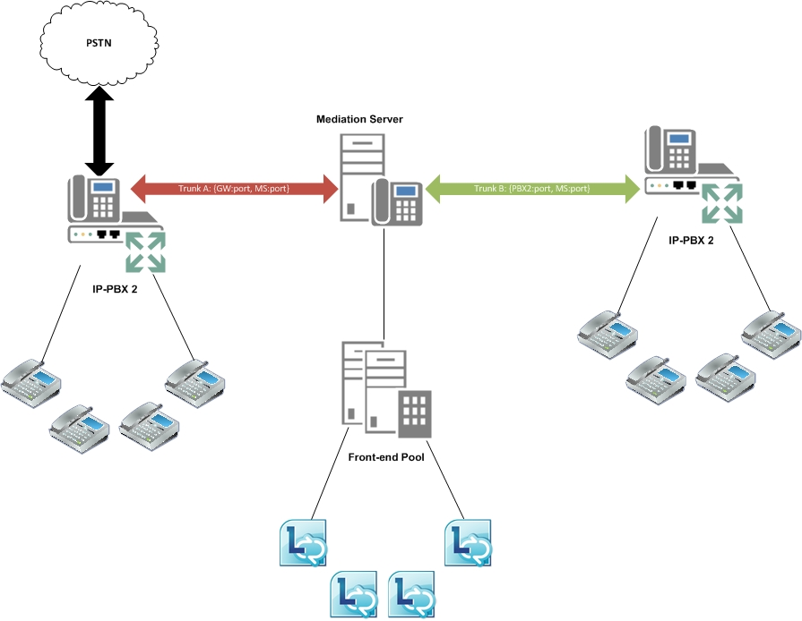

# 商務用 Skype Server 中的主幹間路由Inter-trunk routing in Skype for Business Server

商務用 Skype 伺服器提供基本的會話管理，其支援主幹間路由。Skype for Business Server provides basic session management through the support of intertrunk routing. 這項功能可讓商務用 Skype Server 向下游電話語音系統提供呼叫控制功能。This capability enables Skype for Business Server to provide call control functionalities to downstream telephony systems. 主幹間路由可將 IP-PBX 互連至公用交換電話網路 (PSTN) 閘道，使來自私營分公司 exchange (PBX) phone 的呼叫可以路由傳送至 PSTN，而且傳入 PSTN 通話可以路由傳送至 PBX 電話。Intertrunk routing can interconnect an IP-PBX to a public switched telephone network (PSTN) gateway so that calls from a private branch exchange (PBX) phone can be routed to the PSTN, and incoming PSTN calls can be routed to a PBX phone. 同樣地，商務用 Skype 伺服器也可以互連兩個或多個 IP-PBX 系統，這樣通話便可在不同 IP-PBX 系統的 PBX 電話間撥打及接收。Similarly, Skype for Business Server can interconnect two or more IP-PBX systems so that calls can be placed and received between PBX phones from the different IP-PBX systems. 

下圖說明在 PSTN 閘道和 IP-PBX 之間提供 interconnectivity 的商務用 Skype 伺服器。The following figure illustrates Skype for Business Server providing interconnectivity between a PSTN gateway and an IP-PBX.

下圖說明連接兩個 IP-PBX 系統之商務用 Skype Server 的伺服器。The next figure illustrates Skype for Business Server connecting two IP-PBX systems.

