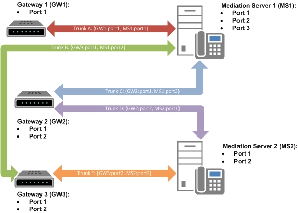

# 商務用 Skype Server 中有多個主幹支援Multiple trunk support in Skype for Business Server

商務用 Skype Server 功能支援閘道與中繼伺服器之間的多個關聯性。Skype for Business Server functionality supports multiple associations between gateways and Mediation Servers. 這些關聯是透過定義幹線來建立的，這是中繼伺服器池與公用交換式電話網絡（PSTN）閘道、會話邊界控制器（SBC）或 IP PBX 之間的邏輯關聯。These associations are made by defining a trunk, which is a logical association between a Mediation Server pool and a public switched telephone network (PSTN) gateway, Session Border Controller (SBC), or IP-PBX. 使用 [拓撲建立器]，將閘道與中繼伺服器（也就是 trunks）建立關聯。Use the Topology Builder to associate gateways with Mediation Servers (that is, trunks).

- 若要在商務用 Skype Server 中指派或移除主幹，您必須先在拓撲產生器中定義主幹。To assign or remove a trunk in Skype for Business Server, you must first define a trunk in Topology Builder. 主幹包含下列關聯：中繼伺服器的完整功能變數名稱（FQDN）、中繼伺服器偵聽埠、閘道 FQDN，以及閘道偵聽埠。A trunk consists of the following association: Mediation Server fully qualified domain name (FQDN), the Mediation Server listening port, the gateway FQDN, and the gateway listening port.
- 若要設定多個 trunks，您可以在同一個閘道與中繼伺服器之間建立多個關聯性。To configure multiple trunks, you can create multiple associations between the same gateway and the Mediation Server. 這可為企業語音結構提供額外的復原能力，這在私人分支 exchange （PBX） interoperational 案例中特別有用。This provides additional resiliency to the Enterprise Voice infrastructure, which is especially useful in private branch exchange (PBX) interoperational scenarios. 

定義主幹時，必須與路由建立關聯。When a trunk is defined, it must be associated to a route. 若要將主幹與路線建立關聯，您可以在 [拓撲建立器] 中定義主幹的簡單名稱。To associate a trunk to a route, you define a simple name for the trunk in Topology Builder. 在商務用 Skype Server [控制台] 中，此簡單名稱會用來做為主幹名稱，其中 trunks 可以與路線建立關聯。This simple name is used as the trunk name in the Skype for Business Server Control Panel, where trunks can be associated with routes. 簡單的主幹名稱是從商務用 Skype Server Management Shell 中作為閘道名稱使用。The simple trunk name is used as the gateway name from the Skype for Business Server Management Shell.

`New-CsVoiceRoute -Identity <RouteId> -NumberPattern <String> -PstnUsages @{add="<UsageString>"} -PstnGatewayList @{add="<TrunkSimpleName>"}`

系統管理員必須選取與中繼伺服器相關聯的預設主幹。The administrator must select a default trunk associated with a Mediation Server. 從拓撲建立器，以滑鼠右鍵按一下關聯的中繼伺服器，然後按一下 [**屬性**]。From the Topology Builder, right-click the associated Mediation Server, and then click **Properties**. 指定中繼伺服器的預設閘道。Specify the default gateway for the Mediation Server. 

下圖說明針對每個中繼伺服器和閘道定義的多個 trunks。The following diagram illustrates the multiple trunks that are defined for each Mediation Server and gateway. 

