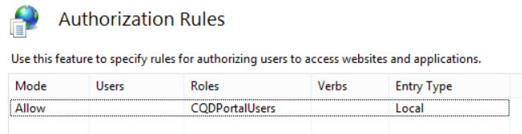
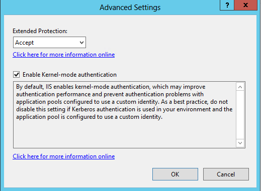

# <a name="deploy-call-quality-dashboard-for-skype-for-business-server"></a>為商務用 Skype Server 部署通話品質儀表板
 
**摘要：** 瞭解通話品質儀表板的部署程式。 通話品質儀表板是商務用 Skype 伺服器的工具。
  
## <a name="deployment-overview"></a>部署概述

通話品質儀表板 (CQD) 包含三個主要元件：
  
- 封存 **資料庫**，它會複製並儲存 (QoE) 資料的經驗品質。
    
- **Cube**，其中 QoE 封存資料庫的資料會進行匯總以進行優化和快速存取。
    
- **入口網站**，使用者可以在其中輕鬆查詢及顯示 QoE 資料。
    

  
QoE 封存的設定套裝程式括建立 QoE 封存資料庫、部署 SQL Server 預存程式，將資料從來源 QoE 度量資料庫移入 QoE 封存資料庫，以及設定 SQL Server 代理程式工作以定期執行預存程式。 
  
Cube 部署會取得來自 QoE 封存所在位置之使用者的資訊、部署 cube，並設定一般 SQL Server 代理程式工作，以便定期重新整理 cube。
  
入口網站安裝建立儲存 CQD 使用者與每個使用者報告/查詢之對應的存放庫資料庫。 然後，它會設定 IIS web 應用程式，該應用程式是使用者可以查看預先定義的報表集合，以及自訂和建立自己的查詢，以視覺化 cube 中的資料。 入口網站安裝會建立其他兩個 web 應用程式，公開 APIs 使用者可透過程式設計方式存取存放庫及 cube。  (這些 APIs 也會在儀表板內部使用。 ) 
  

|**階段**|**步驟**|**角色和群組成員資格**|**文件**|
|:-----|:-----|:-----|:-----|
|安裝必要的硬體和軟體。  <br/> |決定 CQD 設定，並選擇要從中執行安裝的 SQL Server。  <br/> |身為本機系統管理員群組成員的網域使用者。  <br/> |部署檔中的「安裝前需求」一節。  <br/> |
|安裝 CQD。  <br/> |請在部署檔後執行 MSI。  <br/> |若要執行安裝程式，安裝帳戶必須是本機 administrators 群組成員的網域使用者，且具有監控伺服器上 QoE 度量資料庫的讀取權限。  <br/> |部署檔中的「帳戶和部署步驟」一節。  <br/> |
|授與使用者存取權。  <br/> |若要管理對入口網站的授權，我們建議使用在 IIS 7.0 中引入的 URL 授權。 如需詳細資訊，請參閱 [瞭解 IIS 7.0 URL 授權](https://www.iis.net/learn/manage/configuring-security/understanding-iis-url-authorization)。  <br/> |身為本機系統管理員群組成員的網域使用者。  <br/> |在部署檔中管理入口網站區段的使用者存取。  <br/> |
|選用：提供子網對應資訊。  <br/> |在 QoE 封存資料庫中填入網路及建立對應表格。  <br/> |具有 QoE 封存資料庫之寫入存取權的帳戶。  <br/> |使用者檔中的「提供子網資訊」一節。  <br/> |
   


部署通話品質儀表板包括設定基礎結構及安裝軟體。 下列程式概述此程式。
  
## <a name="deployment-steps"></a>部署步驟

1. 將 CallQualityDashboard.msi 複製到要安裝 CQD 之封存資料庫元件的機器 (這是已安裝 SQL Server) 的電腦。 
    
2. 執行 MSI (Windows 會提示以系統管理員許可權執行，請執行) 。 
    
3. 接受 EULA。
    
4. 選取與通話品質儀表板元件相關的檔案所在的目的地資料夾，或接受預設位置。
    
5. 選取 [所有功能]。
    
6. 在 [QoE 封存設定] 頁面上，提供下列資訊：
    
   - **QoE 度量 SQL Server：** QoE 度量 DB 所在位置的 SQL Server 實例名稱 (這會是) 的資料來源。
    
   - **QoE 封存 SQL Server 名稱：** 這是唯讀欄位，且固定為本機電腦的完整功能變數名稱。 封存資料庫只能安裝在本機電腦上。
    
   - **QoE 封存 SQL Server 實例：** 本機 SQL Server 實例名稱，以供建立封存資料庫的位置。 若要使用預設的 SQL Server 實例，請將此欄位保留空白。 若要使用指定的 SQL Server 實例，請指定實例名稱 (例如 ") 之後的名稱。 \"
    
   - **QoE 封存資料庫：** 根據預設，此選項會設定為「建立新資料庫」。 由於不支援封存資料庫升級，因此如果現有的封存資料庫與要安裝的組建具有相同的架構，則可以使用「使用現有資料庫」選項的唯一情形。
    
   - **資料庫檔案目錄：** 應該放置封存資料庫的資料庫檔案 ( .mdf 和 .ldf) 位置的路徑。 這應該是在建議的硬體設定中 (HDD2 的磁片磁碟機上，) 與作業系統不同。 請注意，因為檔案名已在安裝中修復，所以建議您不要使用沒有檔案的空白目錄。
    
   - **使用多個磁碟分割：** 預設值是設定為 "多個分割區"，這需要 SQL Server 的商務智慧 edition 或 Enterprise edition。 在 [Standard edition] 中，選取 [單一分割區] 選項。 請注意，如果使用單一分割區，cube 處理效能可能會受到影響。
    
     > [!NOTE]
     > 在安裝程式完成後，無法變更 [使用多個分割區] 選項的選取範圍。 為了進行變更，必須先卸載 Cube 功能，然後使用 [控制台] 中的 [變更] 選項重新安裝。 
  
   - **分割區檔案目錄：** QoE 封存資料庫的磁碟分割應位於何處的路徑。 這應該是在建議的硬體設定) 中 (HDD3，與 OS 磁片磁碟機和 SQL 資料庫記錄檔磁片磁碟機分開。 請注意，因為檔案名已在安裝中修復，所以建議您不要使用沒有檔案的空白目錄。
    
   - **SQL 代理程式工作使用者-使用者名稱 &amp; 密碼：** 網域服務帳戶名稱和密碼 (已遮罩) ，用來執行 SQL Server 代理程式工作的「QoE 封存資料」步驟 (它會執行預存程式，以從 QoE 度量 db 中取得資料，以取得封存資料庫中的資料，所以此帳戶必須具有 QoE 度量 db 的「讀取」存取權，如 [帳戶] 區段中所示。 此帳戶在 QoE 封存 SQL Server 實例) 中也需要登入。
    
     > [!NOTE]
     > 執行 SQL Server 實例的帳戶（如 NT SERVICE\MSSQLSERVER）必須具有上述所述目錄的存取權/許可權，安裝才會成功。 如需詳細資訊，請參閱 [設定資料庫引擎存取的檔案系統許可權](https://msdn.microsoft.com/library/jj219062%28v=sql.110%29.aspx)
  
7. 按 [下一步] 時，安裝程式會執行先決條件檢查，並在遇到任何問題時報告。 當所有必要條件檢查都通過時，安裝程式會移至 [Cube 設定] 頁面。 
    
    > [!NOTE]
    > 如果安裝程式顯示一則警告訊息，指出 QoE 封存 SQL Server 實例的 SQL Server 代理程式服務目前並未執行，安裝可以繼續，但是安裝後請確定 SQL 代理程式服務正在執行中，並將啟動類型設定為 [自動]，以執行排定的工作。 
  
8. 在 [Cube 設定] 頁面上，提供下列資訊：
    
   - **QoE 封存 SQL Server 名稱：** 這是唯讀欄位，且固定為本機電腦的完整功能變數名稱。 Cube 只能從 QoE 封存資料庫 (附注的機器安裝。 Cube 本身可以安裝在遠端電腦上。 請參閱下文) 
    
   - **QoE 封存 SQL Server 實例：** QoE 封存 DB 所在位置的 SQL Server 實例名稱。 若要指定預設的 SQL Server 實例，請將此欄位保留空白。 若要指定命名的 SQL Server 實例，請輸入實例名稱 (例如 ") 之後的名稱。 \" 如果已選取 [QoE 封存元件] 進行安裝，此欄位將預先填入 QoE 封存設定] 頁面上提供的值。
    
   - **Cube 分析伺服器：** 要在其中建立 cube 的 SQL Server Analysis Service 實例名稱。 這可以是不同的機器，但是安裝使用者必須是目標 SQL Server Analysis Service 實例之伺服器管理員的成員。
    
     > [!NOTE]
     >  如需設定 Analysis Services 伺服器管理員許可權的詳細資訊，請參閱 [授與伺服器管理員許可權 (Analysis Services) ](https://msdn.microsoft.com/library/ms174561.aspx)
  
   - **使用多個磁碟分割：** 預設值是設定為 "多個分割區"，這需要 SQL Server 的商務智慧 edition 或 Enterprise edition。 在 [Standard edition] 中，選取 [單一分割區] 選項。 請注意，如果使用單一分割區，cube 處理效能可能會受到影響。
    
     > [!NOTE]
     >  在安裝程式完成後，無法變更 [使用多個分割區] 選項的選取範圍。 為了進行變更，必須先卸載 Cube 功能，然後使用 [控制台] 中的 [變更] 選項重新安裝。
  
   - **Cube 使用者-使用者名稱 &amp; 密碼：** 網域服務帳戶名稱和密碼 (會觸發 cube 處理的遮罩) 。 如果已選取 [QoE 封存元件] 進行安裝，此欄位將預先填入 SQL 代理工作使用者「封存設定」頁面上的值，但建議您指定不同的網域服務帳戶，以便安裝程式可以授與其最少必要的許可權。
    
9. 按 [下一步] 時，會執行另一輪驗證，而且會報告任何問題。 當成功完成驗證時，安裝程式會移至入口網站設定頁面。 
    
10. 在入口網站設定頁面上，提供下列資訊：
    
    - **QoE 封存 SQL Server：** QoE 封存資料庫所在位置的 SQL Server 實例名稱。 請注意，與「QoE 封存設定」頁面和「Cube 設定」頁面不同的是，機器名稱並未修正，必須提供。 如果已選取 [QoE 封存元件] 進行安裝，此欄位將預先填入 QoE 封存設定] 頁面上提供的值。
    
    - **Cube 分析伺服器：** Cube 所在位置的 SQL Server Analysis Service 實例名稱。 如果已選取 [Cube 元件] 進行安裝，此欄位將預先填入 [Cube 設定] 頁面上提供的值。
    
    - 存放 **庫 SQL Server：** 要建立存放庫資料庫的 SQL Server 實例名稱。 如果 QoE 封存資料庫所在位置的 SQL Server 實例名稱已在其他元件) 中的「安裝程式 (中提供，則此欄位將預先填入 QoE 封存 DB SQL Server 實例名稱。 這可以是任何 SQL Server 實例。
    
    - 存放 **庫資料庫：** 根據預設，此選項會設定為「建立新資料庫」。 由於不支援存放庫 DB 升級，因此如果現有的存放庫 DB 與要安裝的組建具有相同的架構，則唯一可以使用「使用現有資料庫」選項的情況。
    
    - **IIS 應用程式集區使用者-使用者名稱 &amp; 密碼：** IIS 應用程式集區執行所在的帳戶。 [使用者名稱] 和 [密碼] 欄位會在選取內建系統帳戶時呈現灰色。 只有從下拉式方塊中選取 "Other"，這樣使用者才能輸入網域服務帳戶資訊時，才會啟用這些欄位。
    
11. 按 [下一步] 時，會進行最後一輪驗證，以確保 SQL Server 實例可以使用所提供的認證，以及電腦上可用的 IIS。 當成功完成驗證時，安裝程式會繼續進行設定。 
    
安裝程式完成時，最可能的 SQL Server 代理程式工作會進行中，進行 QoE 資料的初始載入和 cube 處理。 根據 QoE 中的資料量而定，入口網站將沒有可供查看的資料。 若要檢查資料負載和 cube 處理的狀態，請移至  `http://<machinename>/CQD/#/Health` 。 
> [!NOTE]
> 請注意，檢查下載 cube 處理狀態的 URL 是區分大小寫的。 如果您輸入「健康狀態」，URL 將無法運作。 您必須在 URL 的結尾以大寫的 H 輸入「健康情況」。 
  
如果啟用偵錯模式，就會顯示詳細的記錄訊息。 若要啟用偵錯模式，請移至 **%SYSTEMDRIVE%\Program Files\Skype For Business 2015 CQD\QoEDataService\web.config**，並更新下行，使值設定為 **True**：

```xml
<add key="QoEDataLib.DebugMode" value="True" /> 
```

主要入口網站頁面可透過進行存取  `http://<machinename>/CQD` 。 
## <a name="managing-user-access-for-the-portal"></a>管理入口網站的使用者存取

若要管理對入口網站的授權，我們建議使用在 IIS 7.0 中引入的 URL 授權。 如需 IIS 安全性的詳細資訊，請參閱 [瞭解 iis 7.0 URL 授權](https://www.iis.net/learn/manage/configuring-security/understanding-iis-url-authorization)。
  
任何網站或 web 應用程式會繼承針對整個 IIS （通常為「允許所有使用者」）設定的預設 URL 授權。 如果對入口網站的存取需要更嚴格的限制，管理員可以編輯「授權規則」，只授與特定使用者群組的存取權。
  

  
> [!NOTE]
> [授權規則] 圖示不會與 [ASP.NET] 區段下的「.NET 授權」混淆，後者是一種不同的授權機制。 
  
管理員應該先移除繼承的「允許所有使用者」規則。 這可防止任何未獲授權的使用者存取入口網站。
  

  
接下來，管理員應該新增「允許」規則，並為特定使用者授予存取入口網站的許可權。 建議您建立名為 "CQDPortalUsers" 的本機組來管理使用者。
  

  
設定詳細資料會儲存在位於入口網站之實體目錄的 web.config。
  
```xml
<?xml version="1.0" encoding="UTF-8"?> <configuration> <system.webServer> <security> <authorization> <remove users="*" roles="" verbs="" /> <add accessType="Allow" roles="CQDPortalUsers" /> </authorization> </security> </system.webServer> </configuration> 
```

下一步是設定 CQD 的儀表板。 在 IIS 驗證使用者後，他們必須具有 CQD 目錄的檔案許可權，才能存取網頁入口網站內容。 您可以透過 CQD 目錄屬性的 [安全性] 索引標籤來變更 ACLs，以新增個別的使用者或群組;不過，建議的方法是保持檔許可權不變。 請改為將 IIS 設定變更為使用 IIS 工作者處理常式存取 CQD 目錄，不論驗證哪一個使用者。 
  
> [!IMPORTANT]
> 請務必變更 CQD 應用程式的此設定，而不是針對這兩個 API 應用程式： QoEDataService 和 QoERepositoryService。 
  
## <a name="configuring-file-access-for-the-cqd-dashboard"></a>設定 CQD (儀表板的檔案存取) 

1. 開啟 CQD 的設定編輯器。
    
     
  
2. 在 [區段] 中，選擇 [ **system.webserver/microsoft.sharepoint.client.serverruntime.dll**]。
    
     
  
3. 將 authenticatedUserOverride 變更為 **UseWorkerProcessUser**。
    
     
  
4. 按一下 **頁面** 右側的 [套用]。
    
## <a name="known-issues"></a>已知問題

### <a name="the-cqd-shows-no-data-after-deployment"></a>CQD 在部署之後未顯示任何資料

您可能會收到下列錯誤：

*無法在 Cube 上執行查詢。使用查詢編輯器，修改查詢並修正任何問題。此外，請確定可以存取 Cube。*

這表示在 CQD 中使用 cube 之前，必須先在 SQL Server Analysis Services 中處理 cube。 若要解決此問題，您可以遵循下列步驟：

1. 開啟 SQL Management Studio 並選取 [ **Analysis Services**]。

2. 展開 **QoECube** 物件，選取 [ **QoE 度量**]，按一下滑鼠右鍵，然後選擇 **[流覽]**。 

    如果這會傳回空白瀏覽器，則 cube 尚未繼續。

3. 以滑鼠右鍵按一下 [ **QoE 公制** angain]，然後選擇 [ **處理**]。

4. 處理完成時，請再次以滑鼠右鍵按一下物件，然後選擇 **[流覽]** 以確認瀏覽器頁面現在顯示資料。 


### <a name="users-have-trouble-logging-in-because-installer-fails-to-create-the-correct-settings-in-iis"></a>使用者因安裝程式無法在 IIS 中建立正確的設定而登入時的問題

在極少數的情況下，安裝程式無法在 IIS 中建立正確的設定。 需要手動變更，以允許使用者登入 CQD。 如果使用者在登入時遇到問題，請遵循下列步驟：
  
1. 開啟 [IIS 管理員]，然後流覽至 [預設網站]。
    
     
  
2. 按一下「驗證」。 如果「匿名驗證」、「ASP.NET 模擬」、「表單驗證」和「Windows 驗證」與下列設定不符，請手動加以變更，以符合下列設定。 應停用所有其他驗證機制。
    
     
  
3. 針對 "Windows 驗證"，按一下右側的 [高級設定]。
    
     
  
4. 設定「擴充保護」以接受並檢查「啟用核心模式驗證」方塊。
    
     
  
5. 針對 "Default Web Site" 底下的每一個 "CQD"、"QoEDataService" 及 "QoERepositoryService" 專案重複上述步驟。
    
針對 HTTP 和 HTTPS 埠系結，安裝程式將會在預設埠號碼上建立埠系結， (埠80用於 HTTP 及埠 443 for HTTPS) 。 如果電腦上有其他網站使用這些系結，將會發生衝突，且無法預測 IIS 行為。 避免這種問題的最佳方法，就是在安裝 CQD 之前，請先確定沒有其他網站對應至埠80和443。 
  
在 IIS 中啟用 SSL/TLS，並強制使用者透過安全 HTTPS 進行連線，而不是 HTTP:
  
1. 在 IIS 中設定安全通訊端層，請參閱 [在 iis 7 中設定安全通訊端層](https://technet.microsoft.com/library/cc771438%28v=ws.10%29.aspx)。 完成後，請  `http` 取代 `https` 。
    
2. 如需在 SQL Server 連線中啟用 TLS 的相關指示，請參閱 how [to 使用 Microsoft Management Console 為 SQL server 實例啟用 SSL 加密](https://support.microsoft.com/kb/316898/)。
    
## <a name="cube-sync-fails"></a>Cube Sync 失敗

QoEMetrics 可能會根據使用者的時鐘，包含一些不正確記錄。 如果時間偏差大於 60 yrs，cube 匯入將會失敗。
  
 使用下列選取範圍，檢查 Min 和 Max StartTime/EndTime。 在過去和遙遠的未來中尋找並刪除記錄，可以忽略這些記錄，而不會中斷同步處理常式。
  
- 從 CqdPartitionedStreamView StartTime) 選取 MIN (
    
- 從 CqdPartitionedStreamView 中選取 StartTime) 的最大 (
    
- 從 CqdPartitionedStreamView EndTime) 選取 MIN (
    
- 從 CqdPartitionedStreamView 中選取 EndTime) 的最大 (
    
## <a name="post-install-tasks"></a>安裝後任務

### <a name="importing-buildings-and-networks"></a>匯入辦公樓和網路

安裝 CQD 之後，請執行下列設定工作：
  
1. 定義組建類型 (建議) 
    
2. 定義建立擁有權類型 (建議) 
    
3. 定義 (強烈建議的網路類型) 
    
4. 匯入辦公樓 (建議) 
    
5.  (建議的匯入子網) 
    
### <a name="define-building-types"></a>定義組建類型

組建類型是用來說明組織內的不同辦公樓定義或類型。 
  
> [!NOTE]
> 這是選用的步驟，但建議使用。 
  
範例
  
- Headquarters
    
- 遠端辦公室
    
- 共同冒險的位置
    
  **範例 SQL 語法**
  
```SQL
INSERT INTO
[dbo].[CqdBuildingType]
([BuildingTypeId],
[BuildingTypeDesc])
VALUES
(1, 
'Headquarters')   
```

需要 BuildingTypeId 和 BuildingTypeDesc 參數。
  
### <a name="define-building-ownership-types"></a>定義建立擁有權類型

擁有權類型是用來區分擁有的和租用的資產。
  
> [!NOTE]
> 這是選用的步驟，但建議使用。 
  
範例
  
- Contoso 租您的非重新 &amp; F
    
- Contoso 租您的 RE &amp; F
    
- Contoso 擁有
    
- 子公司租
    
  **範例 SQL 語法**
  
```SQL
INSERT INTO
[dbo].[CqdBuildingOwnershipType]
([OwnershipTypeId],
[OwnershipTypeDesc]
)

VALUES
(1,
'Contoso Owned'
)
```

需要 OwnershipTypeId 和 OwnershipTypeDesc 參數。 
  
### <a name="define-network-names"></a>定義網路名稱

網路類型是用來描述組織內的不同類型的網路。 這可讓您篩選 (或篩選出) 特定網路類型。
  
> [!NOTE]
> 強烈建議您定義網路名稱，但這是選擇性的。 如果您決定不定義網路名稱，請確定每個 CqdNetwork 專案的 BuildingId 為0。 
  
範例
  
- VPN
    
- 實驗室
    
  **範例 SQL 語法**
  
```SQL
INSERT INTO [dbo].[CqdNetworkName] 
( [NetworkName]
,[NetworkType]
 ) 
VALUES
('VPN','VPN') 
```

需要 NetworkNameID 和 NetworkName 參數，NetworkType 參數是選擇性的，但建議使用。
  
### <a name="import-buildings"></a>匯入建築物

匯入辦公樓可讓您針對 WiFi/有線等 ) 上的各座大樓建立特定的洞察力 (不良通話的能力。 
  
> [!NOTE]
> 這是選用的步驟，但建議使用。 
  
在匯入新的大樓之前，您應該已經識別出預先定義的 BuildingKey。 若要這麼做，請發出 "SELECT MAX (BuildingKey) FROM CqdBuilding" SQL 命令來識別目前的值，並將1新增至結果。
  
 **範例 SQL 語法**
  
```SQL
INSERT INTO [dbo].[CqdBuilding] 
( [BuildingKey]
,[BuildingName]
,[BuildingShortName]
,[OwnershipTypeId],
[BuildingTypeId]
)
VALUES
(2, 'Ann Arbor', 'AA', 0, 0)
```

BuildingKey、BuildingName、BuildingShortName、OwnershipTypeId、BuildingTypeId 參數是必要的，其他參數都是選用的。
  
### <a name="import-subnets"></a>匯入子網

匯入辦公樓可讓您針對 WiFi/有線等 ) 上的各座大樓建立特定的洞察力 (不良通話的能力。 
  
> [!NOTE]
> 這是選用的步驟，但建議使用。
  
匯入子網並將其對應至上一個步驟中匯入的大樓。 如果決定不填入 NetworkName，請確定此表格中的每個專案都使用0的 NetworkNameID。 如需有關通話品質儀表板之 SQL 語法和參數的詳細資訊，請參閱 [使用商務用 Skype Server 的通話品質儀表板](https://docs.microsoft.com/skypeforbusiness/management-tools/call-quality-dashboard/use)。
  
 **範例 SQL 語法**
  
```SQL
INSERT INTO [dbo].[CqdNetwork] 
([Network]
,[NetworkRange]
,[NetworkNameID]
,[BuildingKey]
,[UpdatedDate]
)

VALUES
 ('172.16.254.0',32,0,1,'2015-11-11')
```

網路及 UpdatedDate 參數是必要參數，其他參數都是選用的。
  
### <a name="optional-bssid"></a>選用： BSSID

填入 BSSID 資訊可讓您其他的 WiFi 資料流程相互關聯的控制器或無線電。 這除了透過大樓或 subnet 進行篩選之外。 
  
 **範例 SQL 語法**
  
```SQL
INSERT INTO [dbo].[CqdBssid]
([Ap],
[Bss],
[Building],
[ess],
[phy]
)
VALUES
('AP1','00-00-00-00-00-00','Aruba AP 1','Controller1','bgn')
```

**CqdBssidTable 詳細資料**

|**如 CQD 所示**|**CQDBssid 表格**|**範例輸入**|
|:-----|:-----|:-----|
|Ap NName  <br/> |美聯社  <br/> |AP1  <br/> |
|BBssid  <br/> |Bss  <br/> |00-00-00-00-00-00 (您必須使用分隔 fformat)   <br/> |
|控制項  <br/> |建築  <br/> |Aruba AP 7  <br/> |
|裝置  <br/> |Ess  <br/> |Controller1  <br/> |
|無線電  <br/> |Phy  <br/> |bgn  <br/> |
   
### <a name="processing-the-imported-data"></a>處理匯入的資料

根據預設，在您匯入建立/網路資料後，它只會套用至該時間點之後產生的記錄。 
  
若要使用這個新資料來標記上述所有記錄，您必須執行如下所示的 CqdUpdateBuilding 預存程式： 
  
將您的第一筆記錄的日期， (識別使用 [選取 MIN (StartTime) 從 CqdPartitionedStreamView SQL 命令 ) ，在明天 EndDate，最後兩個值則為 Null。
  
資料與資料流程資料關聯之後，SSIS Cube 便需要重新處理所有記錄。 大量新增 BSSID/ISP 資料時，也會套用這種情況。 確定已選取「處理完整」。
  

