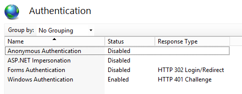

# <a name="deploy-call-quality-dashboard-for-skype-for-business-server"></a><span data-ttu-id="40d8a-104">為商務用 Skype Server 部署通話品質儀表板</span><span class="sxs-lookup"><span data-stu-id="40d8a-104">Deploy Call Quality Dashboard for Skype for Business Server</span></span>
 
<span data-ttu-id="40d8a-105">**摘要：** 瞭解通話品質儀表板的部署程式。</span><span class="sxs-lookup"><span data-stu-id="40d8a-105">**Summary:** Learn about the deployment process for Call Quality Dashboard.</span></span> <span data-ttu-id="40d8a-106">通話品質儀表板是商務用 Skype 伺服器的工具。</span><span class="sxs-lookup"><span data-stu-id="40d8a-106">Call Quality Dashboard is a tool for Skype for Business Server.</span></span>
  
## <a name="deployment-overview"></a><span data-ttu-id="40d8a-107">部署概述</span><span class="sxs-lookup"><span data-stu-id="40d8a-107">Deployment Overview</span></span>

<span data-ttu-id="40d8a-108">通話品質儀表板 (CQD) 包含三個主要元件：</span><span class="sxs-lookup"><span data-stu-id="40d8a-108">Call Quality Dashboard (CQD) consists of three major components:</span></span>
  
- <span data-ttu-id="40d8a-109">封存 **資料庫**，它會複製並儲存 (QoE) 資料的經驗品質。</span><span class="sxs-lookup"><span data-stu-id="40d8a-109">**Archive Database**, where the Quality of Experience (QoE) data is replicated and stored.</span></span>
    
- <span data-ttu-id="40d8a-110">**Cube**，其中 QoE 封存資料庫的資料會進行匯總以進行優化和快速存取。</span><span class="sxs-lookup"><span data-stu-id="40d8a-110">**Cube**, where data from QoE Archive database is aggregated for optimized and fast access.</span></span>
    
- <span data-ttu-id="40d8a-111">**入口網站**，使用者可以在其中輕鬆查詢及顯示 QoE 資料。</span><span class="sxs-lookup"><span data-stu-id="40d8a-111">**Portal**, where users can easily query and visualize QoE data.</span></span>
    

  
<span data-ttu-id="40d8a-113">QoE 封存的設定套裝程式括建立 QoE 封存資料庫、部署 SQL Server 預存程式，將資料從來源 QoE 度量資料庫移入 QoE 封存資料庫，以及設定 SQL Server 代理程式工作以定期執行預存程式。</span><span class="sxs-lookup"><span data-stu-id="40d8a-113">The setup process for QoE Archive involves creating the QoE Archive database, deploying a SQL Server stored procedure that will move the data from the source QoE Metrics database into QoE Archive database, and setting up the SQL Server Agent job to execute the stored procedure at a regular interval.</span></span> 
  
<span data-ttu-id="40d8a-114">Cube 部署會取得來自 QoE 封存所在位置之使用者的資訊、部署 cube，並設定一般 SQL Server 代理程式工作，以便定期重新整理 cube。</span><span class="sxs-lookup"><span data-stu-id="40d8a-114">Cube deployment gets information from the user on where the QoE Archive is located, deploys the cube, and sets up a regular SQL Server agent job that will refresh the cube at a regular interval.</span></span>
  
<span data-ttu-id="40d8a-115">入口網站安裝建立儲存 CQD 使用者與每個使用者報告/查詢之對應的存放庫資料庫。</span><span class="sxs-lookup"><span data-stu-id="40d8a-115">Portal install creates a Repository database that stores the mapping of CQD users to each user's reports/queries.</span></span> <span data-ttu-id="40d8a-116">然後，它會設定 IIS web 應用程式，該應用程式是使用者可以查看預先定義的報表集合，以及自訂和建立自己的查詢，以視覺化 cube 中的資料。</span><span class="sxs-lookup"><span data-stu-id="40d8a-116">It then sets up an IIS web application which is the dashboard where users can see a pre-defined set of reports as well as customize and create their own queries to visualize data from the cube.</span></span> <span data-ttu-id="40d8a-117">入口網站安裝會建立其他兩個 web 應用程式，公開 APIs 使用者可透過程式設計方式存取存放庫及 cube。</span><span class="sxs-lookup"><span data-stu-id="40d8a-117">The portal install creates two additional web applications that exposes APIs for users to programmatically access the repository and the cube.</span></span> <span data-ttu-id="40d8a-118"> (這些 APIs 也會在儀表板內部使用。 ) </span><span class="sxs-lookup"><span data-stu-id="40d8a-118">(These APIs are used internally by the dashboard as well.)</span></span>
  

|<span data-ttu-id="40d8a-119">**階段**</span><span class="sxs-lookup"><span data-stu-id="40d8a-119">**Phase**</span></span>|<span data-ttu-id="40d8a-120">**步驟**</span><span class="sxs-lookup"><span data-stu-id="40d8a-120">**Steps**</span></span>|<span data-ttu-id="40d8a-121">**角色和群組成員資格**</span><span class="sxs-lookup"><span data-stu-id="40d8a-121">**Roles and group membership**</span></span>|<span data-ttu-id="40d8a-122">**文件**</span><span class="sxs-lookup"><span data-stu-id="40d8a-122">**Documentation**</span></span>|
|:-----|:-----|:-----|:-----|
|<span data-ttu-id="40d8a-123">安裝必要的硬體和軟體。</span><span class="sxs-lookup"><span data-stu-id="40d8a-123">Install prerequisite hardware and software.</span></span>  <br/> |<span data-ttu-id="40d8a-124">決定 CQD 設定，並選擇要從中執行安裝的 SQL Server。</span><span class="sxs-lookup"><span data-stu-id="40d8a-124">Decide on the CQD configuration, and choose a SQL Server from which to perform the install.</span></span>  <br/> |<span data-ttu-id="40d8a-125">身為本機系統管理員群組成員的網域使用者。</span><span class="sxs-lookup"><span data-stu-id="40d8a-125">Domain user who is a member of the local administrators group.</span></span>  <br/> |<span data-ttu-id="40d8a-126">部署檔中的「安裝前需求」一節。</span><span class="sxs-lookup"><span data-stu-id="40d8a-126">"Pre-install Requirements" section in the deployment documentation.</span></span>  <br/> |
|<span data-ttu-id="40d8a-127">安裝 CQD。</span><span class="sxs-lookup"><span data-stu-id="40d8a-127">Install CQD.</span></span>  <br/> |<span data-ttu-id="40d8a-128">請在部署檔後執行 MSI。</span><span class="sxs-lookup"><span data-stu-id="40d8a-128">Run the MSI following the deployment document.</span></span>  <br/> |<span data-ttu-id="40d8a-129">若要執行安裝程式，安裝帳戶必須是本機 administrators 群組成員的網域使用者，且具有監控伺服器上 QoE 度量資料庫的讀取權限。</span><span class="sxs-lookup"><span data-stu-id="40d8a-129">To perform the setup, the installing account must be a domain user who is a member of the local administrators group and have read access to QoE Metrics database on the Monitoring Server.</span></span>  <br/> |<span data-ttu-id="40d8a-130">部署檔中的「帳戶和部署步驟」一節。</span><span class="sxs-lookup"><span data-stu-id="40d8a-130">"Accounts and Deployment Steps" sections in the deployment documentation.</span></span>  <br/> |
|<span data-ttu-id="40d8a-131">授與使用者存取權。</span><span class="sxs-lookup"><span data-stu-id="40d8a-131">Grant user access.</span></span>  <br/> |<span data-ttu-id="40d8a-132">若要管理對入口網站的授權，我們建議使用在 IIS 7.0 中引入的 URL 授權。</span><span class="sxs-lookup"><span data-stu-id="40d8a-132">For managing user authorization to the Portal, we recommend using URL Authorization, which was introduced in IIS 7.0.</span></span> <span data-ttu-id="40d8a-133">如需詳細資訊，請參閱 [瞭解 IIS 7.0 URL 授權](https://www.iis.net/learn/manage/configuring-security/understanding-iis-url-authorization)。</span><span class="sxs-lookup"><span data-stu-id="40d8a-133">For more information, see [Understanding IIS 7.0 URL Authorization](https://www.iis.net/learn/manage/configuring-security/understanding-iis-url-authorization).</span></span>  <br/> |<span data-ttu-id="40d8a-134">身為本機系統管理員群組成員的網域使用者。</span><span class="sxs-lookup"><span data-stu-id="40d8a-134">Domain user who is a member of the local administrators group.</span></span>  <br/> |<span data-ttu-id="40d8a-135">在部署檔中管理入口網站區段的使用者存取。</span><span class="sxs-lookup"><span data-stu-id="40d8a-135">Managing User Access for the Portal section in the deployment documentation.</span></span>  <br/> |
|<span data-ttu-id="40d8a-136">選用：提供子網對應資訊。</span><span class="sxs-lookup"><span data-stu-id="40d8a-136">Optional: Provide subnet mapping information.</span></span>  <br/> |<span data-ttu-id="40d8a-137">在 QoE 封存資料庫中填入網路及建立對應表格。</span><span class="sxs-lookup"><span data-stu-id="40d8a-137">Populate network and building mapping tables in QoE Archive database.</span></span>  <br/> |<span data-ttu-id="40d8a-138">具有 QoE 封存資料庫之寫入存取權的帳戶。</span><span class="sxs-lookup"><span data-stu-id="40d8a-138">An account with write access to the QoE Archive database.</span></span>  <br/> |<span data-ttu-id="40d8a-139">使用者檔中的「提供子網資訊」一節。</span><span class="sxs-lookup"><span data-stu-id="40d8a-139">"Supplying Subnet Information" section in the user documentation.</span></span>  <br/> |
   


<span data-ttu-id="40d8a-140">部署通話品質儀表板包括設定基礎結構及安裝軟體。</span><span class="sxs-lookup"><span data-stu-id="40d8a-140">Deployment of Call Quality Dashboard involves setting up the infrastructure and installing the software.</span></span> <span data-ttu-id="40d8a-141">下列程式概述此程式。</span><span class="sxs-lookup"><span data-stu-id="40d8a-141">The following procedure outlines the process.</span></span>
  
## <a name="deployment-steps"></a><span data-ttu-id="40d8a-142">部署步驟</span><span class="sxs-lookup"><span data-stu-id="40d8a-142">Deployment Steps</span></span>

1. <span data-ttu-id="40d8a-143">將 CallQualityDashboard.msi 複製到要安裝 CQD 之封存資料庫元件的機器 (這是已安裝 SQL Server) 的電腦。</span><span class="sxs-lookup"><span data-stu-id="40d8a-143">Copy the CallQualityDashboard.msi to the machine where the archive database component of CQD is to be installed (this is the machine that has SQL Server installed).</span></span> 
    
2. <span data-ttu-id="40d8a-144">執行 MSI (Windows 會提示以系統管理員許可權執行，請執行) 。</span><span class="sxs-lookup"><span data-stu-id="40d8a-144">Execute the MSI (Windows will prompt to run with administrator privilege, do so).</span></span> 
    
3. <span data-ttu-id="40d8a-145">接受 EULA。</span><span class="sxs-lookup"><span data-stu-id="40d8a-145">Accept the EULA.</span></span>
    
4. <span data-ttu-id="40d8a-146">選取與通話品質儀表板元件相關的檔案所在的目的地資料夾，或接受預設位置。</span><span class="sxs-lookup"><span data-stu-id="40d8a-146">Select the destination folder where files related to Call Quality Dashboard components will be located or accept the default location.</span></span>
    
5. <span data-ttu-id="40d8a-147">選取 [所有功能]。</span><span class="sxs-lookup"><span data-stu-id="40d8a-147">Select all features.</span></span>
    
6. <span data-ttu-id="40d8a-148">在 [QoE 封存設定] 頁面上，提供下列資訊：</span><span class="sxs-lookup"><span data-stu-id="40d8a-148">At the QoE Archive Configuration page, provide the following information:</span></span>
    
   - <span data-ttu-id="40d8a-149">**QoE 度量 SQL Server：** QoE 度量 DB 所在位置的 SQL Server 實例名稱 (這會是) 的資料來源。</span><span class="sxs-lookup"><span data-stu-id="40d8a-149">**QoE Metrics SQL Server:** SQL Server instance name for where the QoE Metrics DB is located (this will be the data source).</span></span>
    
   - <span data-ttu-id="40d8a-150">**QoE 封存 SQL Server 名稱：** 這是唯讀欄位，且固定為本機電腦的完整功能變數名稱。</span><span class="sxs-lookup"><span data-stu-id="40d8a-150">**QoE Archive SQL Server Name:** This is read-only field and fixed to the fully qualified domain name of the local machine.</span></span> <span data-ttu-id="40d8a-151">封存資料庫只能安裝在本機電腦上。</span><span class="sxs-lookup"><span data-stu-id="40d8a-151">Archive DB can be installed only on the local machine.</span></span>
    
   - <span data-ttu-id="40d8a-152">**QoE 封存 SQL Server 實例：** 本機 SQL Server 實例名稱，以供建立封存資料庫的位置。</span><span class="sxs-lookup"><span data-stu-id="40d8a-152">**QoE Archive SQL Server Instance:** A local SQL Server instance name for where the Archive DB is to be created.</span></span> <span data-ttu-id="40d8a-153">若要使用預設的 SQL Server 實例，請將此欄位保留空白。</span><span class="sxs-lookup"><span data-stu-id="40d8a-153">To use a default SQL Server instance, leave this field blank.</span></span> <span data-ttu-id="40d8a-154">若要使用指定的 SQL Server 實例，請指定實例名稱 (例如 ") 之後的名稱。 \"</span><span class="sxs-lookup"><span data-stu-id="40d8a-154">To use a named SQL Server instance, specify the instance name (e.g. the name after the "\").</span></span>
    
   - <span data-ttu-id="40d8a-155">**QoE 封存資料庫：** 根據預設，此選項會設定為「建立新資料庫」。</span><span class="sxs-lookup"><span data-stu-id="40d8a-155">**QoE Archive Database:** By default, this option is set to "Create new database".</span></span> <span data-ttu-id="40d8a-156">由於不支援封存資料庫升級，因此如果現有的封存資料庫與要安裝的組建具有相同的架構，則可以使用「使用現有資料庫」選項的唯一情形。</span><span class="sxs-lookup"><span data-stu-id="40d8a-156">Since Archive DB upgrade is not supported, the only circumstance under which the "Use existing database" option can be used is if the existing Archive database has the same schema as the build to be installed.</span></span>
    
   - <span data-ttu-id="40d8a-157">**資料庫檔案目錄：** 應該放置封存資料庫的資料庫檔案 ( .mdf 和 .ldf) 位置的路徑。</span><span class="sxs-lookup"><span data-stu-id="40d8a-157">**Database File Directory:** Path to where the database files (.mdf and .ldf) for the Archive DB should be placed.</span></span> <span data-ttu-id="40d8a-158">這應該是在建議的硬體設定中 (HDD2 的磁片磁碟機上，) 與作業系統不同。</span><span class="sxs-lookup"><span data-stu-id="40d8a-158">This should be on a drive (HDD2 in the recommended hardware configuration) separate from the OS.</span></span> <span data-ttu-id="40d8a-159">請注意，因為檔案名已在安裝中修復，所以建議您不要使用沒有檔案的空白目錄。</span><span class="sxs-lookup"><span data-stu-id="40d8a-159">Note that since the file names are fixed in the install, to avoid any potential conflict, it is recommended that a blank directory with no files be used.</span></span>
    
   - <span data-ttu-id="40d8a-160">**使用多個磁碟分割：** 預設值是設定為 "多個分割區"，這需要 SQL Server 的商務智慧 edition 或 Enterprise edition。</span><span class="sxs-lookup"><span data-stu-id="40d8a-160">**Use Multiple Partitions:** The default is set to "Multiple partition", which requires Business Intelligence edition or Enterprise edition of SQL Server.</span></span> <span data-ttu-id="40d8a-161">在 [Standard edition] 中，選取 [單一分割區] 選項。</span><span class="sxs-lookup"><span data-stu-id="40d8a-161">For Standard edition, select "Single Partition" option.</span></span> <span data-ttu-id="40d8a-162">請注意，如果使用單一分割區，cube 處理效能可能會受到影響。</span><span class="sxs-lookup"><span data-stu-id="40d8a-162">Note that cube processing performance may be impacted if Single Partition is used.</span></span>
    
     > [!NOTE]
     > <span data-ttu-id="40d8a-163">在安裝程式完成後，無法變更 [使用多個分割區] 選項的選取範圍。</span><span class="sxs-lookup"><span data-stu-id="40d8a-163">The selection for Use Multiple Partitions option cannot be changed once Setup completes.</span></span> <span data-ttu-id="40d8a-164">為了進行變更，必須先卸載 Cube 功能，然後使用 [控制台] 中的 [變更] 選項重新安裝。</span><span class="sxs-lookup"><span data-stu-id="40d8a-164">In order to change it, the Cube feature needs to be first uninstalled and then reinstalled using "Change" option in Control Panel.</span></span> 
  
   - <span data-ttu-id="40d8a-165">**分割區檔案目錄：** QoE 封存資料庫的磁碟分割應位於何處的路徑。</span><span class="sxs-lookup"><span data-stu-id="40d8a-165">**Partition File Directory:** Path to where the partitions for the QoE Archive database should be placed.</span></span> <span data-ttu-id="40d8a-166">這應該是在建議的硬體設定) 中 (HDD3，與 OS 磁片磁碟機和 SQL 資料庫記錄檔磁片磁碟機分開。</span><span class="sxs-lookup"><span data-stu-id="40d8a-166">This should be on a drive (HDD3 in the recommended hardware configuration) separate from the OS drive and SQL database log files drive.</span></span> <span data-ttu-id="40d8a-167">請注意，因為檔案名已在安裝中修復，所以建議您不要使用沒有檔案的空白目錄。</span><span class="sxs-lookup"><span data-stu-id="40d8a-167">Note that since the file names are fixed in the install, to avoid any potential conflict, it is recommended that a blank directory with no files be used.</span></span>
    
   - <span data-ttu-id="40d8a-168">**SQL 代理程式工作使用者-使用者名稱 &amp; 密碼：** 網域服務帳戶名稱和密碼 (已遮罩) ，用來執行 SQL Server 代理程式工作的「QoE 封存資料」步驟 (它會執行預存程式，以從 QoE 度量 db 中取得資料，以取得封存資料庫中的資料，所以此帳戶必須具有 QoE 度量 db 的「讀取」存取權，如 [帳戶] 區段中所示。</span><span class="sxs-lookup"><span data-stu-id="40d8a-168">**SQL Agent Job User - User Name &amp; Password:** Domain service account name and password (masked) that will be used to run the "QoE Archive Data" step of the SQL Server Agent job (which will run the stored procedure to fetch data from QoE Metrics DB into Archive DB, so this account must have read access to QoE Metrics DB, as indicated under Accounts section.</span></span> <span data-ttu-id="40d8a-169">此帳戶在 QoE 封存 SQL Server 實例) 中也需要登入。</span><span class="sxs-lookup"><span data-stu-id="40d8a-169">This account also needs to have a login in the QoE Archive SQL Server Instance).</span></span>
    
     > [!NOTE]
     > <span data-ttu-id="40d8a-170">執行 SQL Server 實例的帳戶（如 NT SERVICE\MSSQLSERVER）必須具有上述所述目錄的存取權/許可權，安裝才會成功。</span><span class="sxs-lookup"><span data-stu-id="40d8a-170">The account that the SQL Server instance is running under, such as NT SERVICE\MSSQLSERVER, must have access/permission to the directories given above for the installation to succeed.</span></span> <span data-ttu-id="40d8a-171">如需詳細資訊，請參閱 [設定資料庫引擎存取的檔案系統許可權](https://msdn.microsoft.com/library/jj219062%28v=sql.110%29.aspx)</span><span class="sxs-lookup"><span data-stu-id="40d8a-171">For details, see [Configure File System Permissions for Database Engine Access](https://msdn.microsoft.com/library/jj219062%28v=sql.110%29.aspx)</span></span>
  
7. <span data-ttu-id="40d8a-172">按 [下一步] 時，安裝程式會執行先決條件檢查，並在遇到任何問題時報告。</span><span class="sxs-lookup"><span data-stu-id="40d8a-172">Upon clicking next, the installer will perform pre-requisite checks and report if any issues are encountered.</span></span> <span data-ttu-id="40d8a-173">當所有必要條件檢查都通過時，安裝程式會移至 [Cube 設定] 頁面。</span><span class="sxs-lookup"><span data-stu-id="40d8a-173">When all pre-requisite checks pass, the installer will go to the Cube Configuration page.</span></span> 
    
    > [!NOTE]
    > <span data-ttu-id="40d8a-174">如果安裝程式顯示一則警告訊息，指出 QoE 封存 SQL Server 實例的 SQL Server 代理程式服務目前並未執行，安裝可以繼續，但是安裝後請確定 SQL 代理程式服務正在執行中，並將啟動類型設定為 [自動]，以執行排定的工作。</span><span class="sxs-lookup"><span data-stu-id="40d8a-174">If the installer shows a warning message that the SQL Server Agent service for the QoE Archive SQL Server instance is currently not running, installation can proceed, but post installation please make sure that SQL Agent service is running and set the Startup type to Automatic so that the scheduled Job runs.</span></span> 
  
8. <span data-ttu-id="40d8a-175">在 [Cube 設定] 頁面上，提供下列資訊：</span><span class="sxs-lookup"><span data-stu-id="40d8a-175">At Cube Configuration page, provide the following information:</span></span>
    
   - <span data-ttu-id="40d8a-176">**QoE 封存 SQL Server 名稱：** 這是唯讀欄位，且固定為本機電腦的完整功能變數名稱。</span><span class="sxs-lookup"><span data-stu-id="40d8a-176">**QoE Archive SQL Server Name:** This is read-only field and fixed to the fully qualified domain name of the local machine.</span></span> <span data-ttu-id="40d8a-177">Cube 只能從 QoE 封存資料庫 (附注的機器安裝。</span><span class="sxs-lookup"><span data-stu-id="40d8a-177">Cube can be installed only from the machine that has QoE Archive database (Note.</span></span> <span data-ttu-id="40d8a-178">Cube 本身可以安裝在遠端電腦上。</span><span class="sxs-lookup"><span data-stu-id="40d8a-178">Cube itself may be installed on a remote machine.</span></span> <span data-ttu-id="40d8a-179">請參閱下文) </span><span class="sxs-lookup"><span data-stu-id="40d8a-179">See below)</span></span>
    
   - <span data-ttu-id="40d8a-180">**QoE 封存 SQL Server 實例：** QoE 封存 DB 所在位置的 SQL Server 實例名稱。</span><span class="sxs-lookup"><span data-stu-id="40d8a-180">**QoE Archive SQL Server Instance:** SQL Server instance name for where the QoE Archive DB is located.</span></span> <span data-ttu-id="40d8a-181">若要指定預設的 SQL Server 實例，請將此欄位保留空白。</span><span class="sxs-lookup"><span data-stu-id="40d8a-181">To specify a default SQL Server instance, leave this field blank.</span></span> <span data-ttu-id="40d8a-182">若要指定命名的 SQL Server 實例，請輸入實例名稱 (例如 ") 之後的名稱。 \"</span><span class="sxs-lookup"><span data-stu-id="40d8a-182">To specify a named SQL Server instance, enter the instance name (e.g. the name after the "\").</span></span> <span data-ttu-id="40d8a-183">如果已選取 [QoE 封存元件] 進行安裝，此欄位將預先填入 QoE 封存設定] 頁面上提供的值。</span><span class="sxs-lookup"><span data-stu-id="40d8a-183">If QoE Archive component was selected for the install, this field will be pre-populated with the value provided on the QoE Archive Configuration page.</span></span>
    
   - <span data-ttu-id="40d8a-184">**Cube 分析伺服器：** 要在其中建立 cube 的 SQL Server Analysis Service 實例名稱。</span><span class="sxs-lookup"><span data-stu-id="40d8a-184">**Cube Analysis Server:** SQL Server Analysis Service instance name for where the cube is to be created.</span></span> <span data-ttu-id="40d8a-185">這可以是不同的機器，但是安裝使用者必須是目標 SQL Server Analysis Service 實例之伺服器管理員的成員。</span><span class="sxs-lookup"><span data-stu-id="40d8a-185">This can be a different machine but the installing user has to be a member of Server administrators of the target SQL Server Analysis Service instance.</span></span>
    
     > [!NOTE]
     >  <span data-ttu-id="40d8a-186">如需設定 Analysis Services 伺服器管理員許可權的詳細資訊，請參閱 [授與伺服器管理員許可權 (Analysis Services) ](https://msdn.microsoft.com/library/ms174561.aspx)</span><span class="sxs-lookup"><span data-stu-id="40d8a-186">For more information about configuring Analysis Services Server Administrator Permissions, see [Grant Server Administrator Permissions (Analysis Services)](https://msdn.microsoft.com/library/ms174561.aspx)</span></span>
  
   - <span data-ttu-id="40d8a-187">**使用多個磁碟分割：** 預設值是設定為 "多個分割區"，這需要 SQL Server 的商務智慧 edition 或 Enterprise edition。</span><span class="sxs-lookup"><span data-stu-id="40d8a-187">**Use Multiple Partitions:** The default is set to "Multiple partition", which requires Business Intelligence edition or Enterprise edition of SQL Server.</span></span> <span data-ttu-id="40d8a-188">在 [Standard edition] 中，選取 [單一分割區] 選項。</span><span class="sxs-lookup"><span data-stu-id="40d8a-188">For Standard edition, select "Single Partition" option.</span></span> <span data-ttu-id="40d8a-189">請注意，如果使用單一分割區，cube 處理效能可能會受到影響。</span><span class="sxs-lookup"><span data-stu-id="40d8a-189">Note that cube processing performance may be impacted if Single Partition is used .</span></span>
    
     > [!NOTE]
     >  <span data-ttu-id="40d8a-190">在安裝程式完成後，無法變更 [使用多個分割區] 選項的選取範圍。</span><span class="sxs-lookup"><span data-stu-id="40d8a-190">The selection for Use Multiple Partitions option cannot be changed once Setup completes.</span></span> <span data-ttu-id="40d8a-191">為了進行變更，必須先卸載 Cube 功能，然後使用 [控制台] 中的 [變更] 選項重新安裝。</span><span class="sxs-lookup"><span data-stu-id="40d8a-191">In order to change it, the Cube feature needs to be first uninstalled and then reinstalled using "Change" option in Control Panel.</span></span>
  
   - <span data-ttu-id="40d8a-192">**Cube 使用者-使用者名稱 &amp; 密碼：** 網域服務帳戶名稱和密碼 (會觸發 cube 處理的遮罩) 。</span><span class="sxs-lookup"><span data-stu-id="40d8a-192">**Cube User - User Name &amp; Password:** Domain service account name and password (masked) that will trigger the cube processing.</span></span> <span data-ttu-id="40d8a-193">如果已選取 [QoE 封存元件] 進行安裝，此欄位將預先填入 SQL 代理工作使用者「封存設定」頁面上的值，但建議您指定不同的網域服務帳戶，以便安裝程式可以授與其最少必要的許可權。</span><span class="sxs-lookup"><span data-stu-id="40d8a-193">If QoE Archive component was selected for the install, this field will be pre-populated with the value provided on the Archive Configuration page for the SQL Agent Job User, but we recommend specifying a different domain service account so that Setup can grant the least required privilege to it.</span></span>
    
9. <span data-ttu-id="40d8a-194">按 [下一步] 時，會執行另一輪驗證，而且會報告任何問題。</span><span class="sxs-lookup"><span data-stu-id="40d8a-194">When clicking next, another round of validation will be performed and any issue will be reported.</span></span> <span data-ttu-id="40d8a-195">當成功完成驗證時，安裝程式會移至入口網站設定頁面。</span><span class="sxs-lookup"><span data-stu-id="40d8a-195">Upon successful completion of the validation, the installer will go to the Portal Configuration page.</span></span> 
    
10. <span data-ttu-id="40d8a-196">在入口網站設定頁面上，提供下列資訊：</span><span class="sxs-lookup"><span data-stu-id="40d8a-196">At Portal Configuration page, provide the following information:</span></span>
    
    - <span data-ttu-id="40d8a-197">**QoE 封存 SQL Server：** QoE 封存資料庫所在位置的 SQL Server 實例名稱。</span><span class="sxs-lookup"><span data-stu-id="40d8a-197">**QoE Archive SQL Server:** SQL Server instance name for where the QoE Archive database is located.</span></span> <span data-ttu-id="40d8a-198">請注意，與「QoE 封存設定」頁面和「Cube 設定」頁面不同的是，機器名稱並未修正，必須提供。</span><span class="sxs-lookup"><span data-stu-id="40d8a-198">Note that unlike the QoE Archive Configuration page and the Cube Configuration page, the machine name is not fixed and must be provided.</span></span> <span data-ttu-id="40d8a-199">如果已選取 [QoE 封存元件] 進行安裝，此欄位將預先填入 QoE 封存設定] 頁面上提供的值。</span><span class="sxs-lookup"><span data-stu-id="40d8a-199">If QoE Archive component was selected for the install, this field will be pre-populated with the value provided on the QoE Archive Configuration page.</span></span>
    
    - <span data-ttu-id="40d8a-200">**Cube 分析伺服器：** Cube 所在位置的 SQL Server Analysis Service 實例名稱。</span><span class="sxs-lookup"><span data-stu-id="40d8a-200">**Cube Analysis Server:** SQL Server Analysis Service instance name for where the cube is located.</span></span> <span data-ttu-id="40d8a-201">如果已選取 [Cube 元件] 進行安裝，此欄位將預先填入 [Cube 設定] 頁面上提供的值。</span><span class="sxs-lookup"><span data-stu-id="40d8a-201">If Cube component was selected for the install, this field will be pre-populated with the value provided on the Cube Configuration page.</span></span>
    
    - <span data-ttu-id="40d8a-202">存放 **庫 SQL Server：** 要建立存放庫資料庫的 SQL Server 實例名稱。</span><span class="sxs-lookup"><span data-stu-id="40d8a-202">**Repository SQL Server:** SQL Server instance name where the Repository database is to be created.</span></span> <span data-ttu-id="40d8a-203">如果 QoE 封存資料庫所在位置的 SQL Server 實例名稱已在其他元件) 中的「安裝程式 (中提供，則此欄位將預先填入 QoE 封存 DB SQL Server 實例名稱。</span><span class="sxs-lookup"><span data-stu-id="40d8a-203">If the SQL Server instance name for where the QoE Archive database is located has been provided earlier in the setup (in other components), this field will be pre-populated with the QoE Archive DB SQL Server instance name.</span></span> <span data-ttu-id="40d8a-204">這可以是任何 SQL Server 實例。</span><span class="sxs-lookup"><span data-stu-id="40d8a-204">This can be any SQL Server instance.</span></span>
    
    - <span data-ttu-id="40d8a-205">存放 **庫資料庫：** 根據預設，此選項會設定為「建立新資料庫」。</span><span class="sxs-lookup"><span data-stu-id="40d8a-205">**Repository Database:** By default the option is set to "Create new database".</span></span> <span data-ttu-id="40d8a-206">由於不支援存放庫 DB 升級，因此如果現有的存放庫 DB 與要安裝的組建具有相同的架構，則唯一可以使用「使用現有資料庫」選項的情況。</span><span class="sxs-lookup"><span data-stu-id="40d8a-206">Since Repository DB upgrade is not supported, the only circumstance under which the "Use existing database" option can be used is if the existing Repository DB has the same schema as the build to be installed.</span></span>
    
    - <span data-ttu-id="40d8a-207">**IIS 應用程式集區使用者-使用者名稱 &amp; 密碼：** IIS 應用程式集區執行所在的帳戶。</span><span class="sxs-lookup"><span data-stu-id="40d8a-207">**IIS App Pool User - User Name &amp; Password:** The account that the IIS application pool should execute under.</span></span> <span data-ttu-id="40d8a-208">[使用者名稱] 和 [密碼] 欄位會在選取內建系統帳戶時呈現灰色。</span><span class="sxs-lookup"><span data-stu-id="40d8a-208">The User Name and Password fields will be grayed out if built-in system accounts are selected.</span></span> <span data-ttu-id="40d8a-209">只有從下拉式方塊中選取 "Other"，這樣使用者才能輸入網域服務帳戶資訊時，才會啟用這些欄位。</span><span class="sxs-lookup"><span data-stu-id="40d8a-209">These fields will only be enabled if "Other" is selected from the drop down box so the user can enter the domain service account information.</span></span>
    
11. <span data-ttu-id="40d8a-210">按 [下一步] 時，會進行最後一輪驗證，以確保 SQL Server 實例可以使用所提供的認證，以及電腦上可用的 IIS。</span><span class="sxs-lookup"><span data-stu-id="40d8a-210">When clicking next, the final round of validation will be done to ensure that the SQL Server instances are accessible using the credentials provided and that IIS is available on the machine.</span></span> <span data-ttu-id="40d8a-211">當成功完成驗證時，安裝程式會繼續進行設定。</span><span class="sxs-lookup"><span data-stu-id="40d8a-211">Upon successful completion of the validation, the installer will proceed with the setup.</span></span> 
    
<span data-ttu-id="40d8a-212">安裝程式完成時，最可能的 SQL Server 代理程式工作會進行中，進行 QoE 資料的初始載入和 cube 處理。</span><span class="sxs-lookup"><span data-stu-id="40d8a-212">When the installer is done, most likely the SQL Server Agent job will be in progress, doing the initial load of the QoE data and the cube processing.</span></span> <span data-ttu-id="40d8a-213">根據 QoE 中的資料量而定，入口網站將沒有可供查看的資料。</span><span class="sxs-lookup"><span data-stu-id="40d8a-213">Depending on the amount of data in QoE, the portal will not have data available for viewing yet.</span></span> <span data-ttu-id="40d8a-214">若要檢查資料負載和 cube 處理的狀態，請移至  `http://<machinename>/CQD/#/Health` 。</span><span class="sxs-lookup"><span data-stu-id="40d8a-214">To check on the status of the data load and cube processing, go to  `http://<machinename>/CQD/#/Health`.</span></span> 
> [!NOTE]
> <span data-ttu-id="40d8a-215">請注意，檢查下載 cube 處理狀態的 URL 是區分大小寫的。</span><span class="sxs-lookup"><span data-stu-id="40d8a-215">Note that the URL for checking the status of the download cube processing is case sensitive.</span></span> <span data-ttu-id="40d8a-216">如果您輸入「健康狀態」，URL 將無法運作。</span><span class="sxs-lookup"><span data-stu-id="40d8a-216">If you enter 'health' the URL will not work.</span></span> <span data-ttu-id="40d8a-217">您必須在 URL 的結尾以大寫的 H 輸入「健康情況」。</span><span class="sxs-lookup"><span data-stu-id="40d8a-217">You must enter 'Health' at the end of the URL with a capital H.</span></span> 
  
<span data-ttu-id="40d8a-218">如果啟用偵錯模式，就會顯示詳細的記錄訊息。</span><span class="sxs-lookup"><span data-stu-id="40d8a-218">Detailed log messages will be shown if debug mode is enabled.</span></span> <span data-ttu-id="40d8a-219">若要啟用偵錯模式，請移至 **%SYSTEMDRIVE%\Program Files\Skype For Business 2015 CQD\QoEDataService\web.config**，並更新下行，使值設定為 **True**：</span><span class="sxs-lookup"><span data-stu-id="40d8a-219">To enable debug mode, go to **%SYSTEMDRIVE%\Program Files\Skype For Business 2015 CQD\QoEDataService\web.config**, and update the following line so the value is set to **True**:</span></span>

```xml
<add key="QoEDataLib.DebugMode" value="True" /> 
```

<span data-ttu-id="40d8a-220">主要入口網站頁面可透過進行存取  `http://<machinename>/CQD` 。</span><span class="sxs-lookup"><span data-stu-id="40d8a-220">The main portal page is accessible via  `http://<machinename>/CQD`.</span></span> 
## <a name="managing-user-access-for-the-portal"></a><span data-ttu-id="40d8a-221">管理入口網站的使用者存取</span><span class="sxs-lookup"><span data-stu-id="40d8a-221">Managing User Access for the Portal</span></span>

<span data-ttu-id="40d8a-222">若要管理對入口網站的授權，我們建議使用在 IIS 7.0 中引入的 URL 授權。</span><span class="sxs-lookup"><span data-stu-id="40d8a-222">For managing user authorization to the Portal, we recommend using URL Authorization, which was introduced in IIS 7.0.</span></span> <span data-ttu-id="40d8a-223">如需 IIS 安全性的詳細資訊，請參閱 [瞭解 iis 7.0 URL 授權](https://www.iis.net/learn/manage/configuring-security/understanding-iis-url-authorization)。</span><span class="sxs-lookup"><span data-stu-id="40d8a-223">For more information on IIS security, see [Understanding IIS 7.0 URL Authorization](https://www.iis.net/learn/manage/configuring-security/understanding-iis-url-authorization).</span></span>
  
<span data-ttu-id="40d8a-224">任何網站或 web 應用程式會繼承針對整個 IIS （通常為「允許所有使用者」）設定的預設 URL 授權。</span><span class="sxs-lookup"><span data-stu-id="40d8a-224">Any web site or web application inherit the default URL Authorization configured for the entire IIS, which is typically "Allow All Users".</span></span> <span data-ttu-id="40d8a-225">如果對入口網站的存取需要更嚴格的限制，管理員可以編輯「授權規則」，只授與特定使用者群組的存取權。</span><span class="sxs-lookup"><span data-stu-id="40d8a-225">If access to the Portal needs to be more restrictive, then administrators can grant access to only the specific group of users by editing the "Authorization Rules".</span></span>
  

  
> [!NOTE]
> <span data-ttu-id="40d8a-227">[授權規則] 圖示不會與 [ASP.NET] 區段下的「.NET 授權」混淆，後者是一種不同的授權機制。</span><span class="sxs-lookup"><span data-stu-id="40d8a-227">The Authorization Rules icon is not to be confused with the ".NET Authorization" under the ASP.NET section, which is a different authorization mechanism.</span></span> 
  
<span data-ttu-id="40d8a-228">管理員應該先移除繼承的「允許所有使用者」規則。</span><span class="sxs-lookup"><span data-stu-id="40d8a-228">Administrators should first remove the inherited "Allow All Users" rule.</span></span> <span data-ttu-id="40d8a-229">這可防止任何未獲授權的使用者存取入口網站。</span><span class="sxs-lookup"><span data-stu-id="40d8a-229">This prevents any non-authorized users from accessing the Portal.</span></span>
  

  
<span data-ttu-id="40d8a-231">接下來，管理員應該新增「允許」規則，並為特定使用者授予存取入口網站的許可權。</span><span class="sxs-lookup"><span data-stu-id="40d8a-231">Next, administrators should add new Allow Rules and give specific users the permission to access the Portal.</span></span> <span data-ttu-id="40d8a-232">建議您建立名為 "CQDPortalUsers" 的本機組來管理使用者。</span><span class="sxs-lookup"><span data-stu-id="40d8a-232">It is recommended that a local Group called "CQDPortalUsers" be created to manage the users.</span></span>
  

  
<span data-ttu-id="40d8a-234">設定詳細資料會儲存在位於入口網站之實體目錄的 web.config。</span><span class="sxs-lookup"><span data-stu-id="40d8a-234">The configuration details are stored in the web.config located at the Portal's physical directory.</span></span>
  
```xml
<?xml version="1.0" encoding="UTF-8"?> <configuration> <system.webServer> <security> <authorization> <remove users="*" roles="" verbs="" /> <add accessType="Allow" roles="CQDPortalUsers" /> </authorization> </security> </system.webServer> </configuration> 
```

<span data-ttu-id="40d8a-235">下一步是設定 CQD 的儀表板。</span><span class="sxs-lookup"><span data-stu-id="40d8a-235">The next step is to configure the dashboard of the CQD.</span></span> <span data-ttu-id="40d8a-236">在 IIS 驗證使用者後，他們必須具有 CQD 目錄的檔案許可權，才能存取網頁入口網站內容。</span><span class="sxs-lookup"><span data-stu-id="40d8a-236">After users are authenticated by IIS, they will have to have file permissions on the CQD directory in order to access the web portal content.</span></span> <span data-ttu-id="40d8a-237">您可以透過 CQD 目錄屬性的 [安全性] 索引標籤來變更 ACLs，以新增個別的使用者或群組;不過，建議的方法是保持檔許可權不變。</span><span class="sxs-lookup"><span data-stu-id="40d8a-237">It is possible to change the ACLs through the security tab of the CQD directory properties to add individual users or groups; however the recommended approach is to leave the file permissions untouched.</span></span> <span data-ttu-id="40d8a-238">請改為將 IIS 設定變更為使用 IIS 工作者處理常式存取 CQD 目錄，不論驗證哪一個使用者。</span><span class="sxs-lookup"><span data-stu-id="40d8a-238">Instead, change the IIS setting to use the IIS worker process to access the CQD directory no matter which user is authenticated.</span></span> 
  
> [!IMPORTANT]
> <span data-ttu-id="40d8a-239">請務必變更 CQD 應用程式的此設定，而不是針對這兩個 API 應用程式： QoEDataService 和 QoERepositoryService。</span><span class="sxs-lookup"><span data-stu-id="40d8a-239">It is important to only change this setting for the CQD application, and not for the two API applications: QoEDataService and QoERepositoryService.</span></span> 
  
## <a name="configuring-file-access-for-the-cqd-dashboard"></a><span data-ttu-id="40d8a-240">設定 CQD (儀表板的檔案存取) </span><span class="sxs-lookup"><span data-stu-id="40d8a-240">Configuring File Access for the CQD (Dashboard)</span></span>

1. <span data-ttu-id="40d8a-241">開啟 CQD 的設定編輯器。</span><span class="sxs-lookup"><span data-stu-id="40d8a-241">Open the Configuration Editor for CQD.</span></span>
    
     
  
2. <span data-ttu-id="40d8a-243">在 [區段] 中，選擇 [ **system.webserver/microsoft.sharepoint.client.serverruntime.dll**]。</span><span class="sxs-lookup"><span data-stu-id="40d8a-243">Under Section, choose **system.webServer/serverRuntime**.</span></span>
    
     
  
3. <span data-ttu-id="40d8a-245">將 authenticatedUserOverride 變更為 **UseWorkerProcessUser**。</span><span class="sxs-lookup"><span data-stu-id="40d8a-245">Change authenticatedUserOverride to **UseWorkerProcessUser**.</span></span>
    
     
  
4. <span data-ttu-id="40d8a-247">按一下 **頁面** 右側的 [套用]。</span><span class="sxs-lookup"><span data-stu-id="40d8a-247">Click **Apply** on the right-hand side of the page.</span></span>
    
## <a name="known-issues"></a><span data-ttu-id="40d8a-248">已知問題</span><span class="sxs-lookup"><span data-stu-id="40d8a-248">Known Issues</span></span>

### <a name="the-cqd-shows-no-data-after-deployment"></a><span data-ttu-id="40d8a-249">CQD 在部署之後未顯示任何資料</span><span class="sxs-lookup"><span data-stu-id="40d8a-249">The CQD shows no data after deployment</span></span>

<span data-ttu-id="40d8a-250">您可能會收到下列錯誤：</span><span class="sxs-lookup"><span data-stu-id="40d8a-250">You may receive the following error:</span></span>

<span data-ttu-id="40d8a-251">*無法在 Cube 上執行查詢。使用查詢編輯器，修改查詢並修正任何問題。此外，請確定可以存取 Cube。*</span><span class="sxs-lookup"><span data-stu-id="40d8a-251">*We couldn’t perform the query while running it on the Cube. Use the Query Editor to modify the query and fix any issues. Also make sure that the Cube is accessible.*</span></span>

<span data-ttu-id="40d8a-252">這表示在 CQD 中使用 cube 之前，必須先在 SQL Server Analysis Services 中處理 cube。</span><span class="sxs-lookup"><span data-stu-id="40d8a-252">This means that the cube must be processed in SQL Server Analysis Services prior to being used in CQD.</span></span> <span data-ttu-id="40d8a-253">若要解決此問題，您可以遵循下列步驟：</span><span class="sxs-lookup"><span data-stu-id="40d8a-253">You can resolve this by following these steps:</span></span>

1. <span data-ttu-id="40d8a-254">開啟 SQL Management Studio 並選取 [ **Analysis Services**]。</span><span class="sxs-lookup"><span data-stu-id="40d8a-254">Open SQL Management Studio and select **Analysis Services**.</span></span>

2. <span data-ttu-id="40d8a-255">展開 **QoECube** 物件，選取 [ **QoE 度量**]，按一下滑鼠右鍵，然後選擇 **[流覽]**。</span><span class="sxs-lookup"><span data-stu-id="40d8a-255">Expand the **QoECube** object, select **QoE Metric**, right-click, and then choose **Browse**.</span></span> 

    <span data-ttu-id="40d8a-256">如果這會傳回空白瀏覽器，則 cube 尚未繼續。</span><span class="sxs-lookup"><span data-stu-id="40d8a-256">If this returns empty browser, the cube hasn’t been proceed yet.</span></span>

3. <span data-ttu-id="40d8a-257">以滑鼠右鍵按一下 [ **QoE 公制** angain]，然後選擇 [ **處理**]。</span><span class="sxs-lookup"><span data-stu-id="40d8a-257">Right-click **QoE Metric** angain and choose **Process**.</span></span>

4. <span data-ttu-id="40d8a-258">處理完成時，請再次以滑鼠右鍵按一下物件，然後選擇 **[流覽]** 以確認瀏覽器頁面現在顯示資料。</span><span class="sxs-lookup"><span data-stu-id="40d8a-258">When processing is complete, right-click the object again, and choose **Browse** to confirm that the browser page now shows data.</span></span> 


### <a name="users-have-trouble-logging-in-because-installer-fails-to-create-the-correct-settings-in-iis"></a><span data-ttu-id="40d8a-259">使用者因安裝程式無法在 IIS 中建立正確的設定而登入時的問題</span><span class="sxs-lookup"><span data-stu-id="40d8a-259">Users have trouble logging in because installer fails to create the correct settings in IIS</span></span>

<span data-ttu-id="40d8a-260">在極少數的情況下，安裝程式無法在 IIS 中建立正確的設定。</span><span class="sxs-lookup"><span data-stu-id="40d8a-260">In rare cases, the installer fails to create the correct settings in IIS.</span></span> <span data-ttu-id="40d8a-261">需要手動變更，以允許使用者登入 CQD。</span><span class="sxs-lookup"><span data-stu-id="40d8a-261">Manual change is required to allow users to log into the CQD.</span></span> <span data-ttu-id="40d8a-262">如果使用者在登入時遇到問題，請遵循下列步驟：</span><span class="sxs-lookup"><span data-stu-id="40d8a-262">If users are having trouble logging in, please follow these steps:</span></span>
  
1. <span data-ttu-id="40d8a-263">開啟 [IIS 管理員]，然後流覽至 [預設網站]。</span><span class="sxs-lookup"><span data-stu-id="40d8a-263">Open up IIS Manager, and navigate to Default Web Site.</span></span>
    
     
  
2. <span data-ttu-id="40d8a-265">按一下「驗證」。</span><span class="sxs-lookup"><span data-stu-id="40d8a-265">Click on "Authentication".</span></span> <span data-ttu-id="40d8a-266">如果「匿名驗證」、「ASP.NET 模擬」、「表單驗證」和「Windows 驗證」與下列設定不符，請手動加以變更，以符合下列設定。</span><span class="sxs-lookup"><span data-stu-id="40d8a-266">If the "Anonymous Authentication", "ASP.NET Impersonation", "Form Authentication", and "Windows Authentication" do not match the settings shown below, manually change them to match the settings below.</span></span> <span data-ttu-id="40d8a-267">應停用所有其他驗證機制。</span><span class="sxs-lookup"><span data-stu-id="40d8a-267">All other authentication mechanisms should be disabled.</span></span>
    
     
  
3. <span data-ttu-id="40d8a-269">針對 "Windows 驗證"，按一下右側的 [高級設定]。</span><span class="sxs-lookup"><span data-stu-id="40d8a-269">For "Windows Authentication", click on Advanced Settings on the right-hand side.</span></span>
    
     
  
4. <span data-ttu-id="40d8a-271">設定「擴充保護」以接受並檢查「啟用核心模式驗證」方塊。</span><span class="sxs-lookup"><span data-stu-id="40d8a-271">Set "Extended Protection" to Accept and check the "Enable Kernel-mode authentication" box.</span></span>
    
     
  
5. <span data-ttu-id="40d8a-273">針對 "Default Web Site" 底下的每一個 "CQD"、"QoEDataService" 及 "QoERepositoryService" 專案重複上述步驟。</span><span class="sxs-lookup"><span data-stu-id="40d8a-273">Repeat the above steps for each of the "CQD", "QoEDataService", and "QoERepositoryService" entries below "Default Web Site".</span></span>
    
<span data-ttu-id="40d8a-274">針對 HTTP 和 HTTPS 埠系結，安裝程式將會在預設埠號碼上建立埠系結， (埠80用於 HTTP 及埠 443 for HTTPS) 。</span><span class="sxs-lookup"><span data-stu-id="40d8a-274">For HTTP and HTTPS port bindings the installer will create port bindings on the default port numbers (port 80 for HTTP and port 443 for HTTPS).</span></span> <span data-ttu-id="40d8a-275">如果電腦上有其他網站使用這些系結，將會發生衝突，且無法預測 IIS 行為。</span><span class="sxs-lookup"><span data-stu-id="40d8a-275">If there is another website on the machine that uses these bindings, there will be a conflict and the IIS behavior cannot be predicted.</span></span> <span data-ttu-id="40d8a-276">避免這種問題的最佳方法，就是在安裝 CQD 之前，請先確定沒有其他網站對應至埠80和443。</span><span class="sxs-lookup"><span data-stu-id="40d8a-276">The best way to avoid this problem is to make sure that no other websites are mapped to ports 80 and 443 before installing CQD.</span></span> 
  
<span data-ttu-id="40d8a-277">在 IIS 中啟用 SSL/TLS，並強制使用者透過安全 HTTPS 進行連線，而不是 HTTP:</span><span class="sxs-lookup"><span data-stu-id="40d8a-277">To enable SSL/TLS in IIS and force users to connect via secure HTTPS instead of HTTP:</span></span>
  
1. <span data-ttu-id="40d8a-278">在 IIS 中設定安全通訊端層，請參閱 [在 iis 7 中設定安全通訊端層](https://technet.microsoft.com/library/cc771438%28v=ws.10%29.aspx)。</span><span class="sxs-lookup"><span data-stu-id="40d8a-278">Configure Secure Sockets Layer in IIS, see [Configuring Secure Sockets Layer in IIS 7](https://technet.microsoft.com/library/cc771438%28v=ws.10%29.aspx).</span></span> <span data-ttu-id="40d8a-279">完成後，請  `http` 取代 `https` 。</span><span class="sxs-lookup"><span data-stu-id="40d8a-279">Once done, replace  `http` with `https`.</span></span>
    
2. <span data-ttu-id="40d8a-280">如需在 SQL Server 連線中啟用 TLS 的相關指示，請參閱 how [to 使用 Microsoft Management Console 為 SQL server 實例啟用 SSL 加密](https://support.microsoft.com/kb/316898/)。</span><span class="sxs-lookup"><span data-stu-id="40d8a-280">For instructions on enabling TLS in the SQL Server connections, see [How to enable SSL encryption for an instance of SQL Server by using Microsoft Management Console](https://support.microsoft.com/kb/316898/).</span></span>
    
## <a name="cube-sync-fails"></a><span data-ttu-id="40d8a-281">Cube Sync 失敗</span><span class="sxs-lookup"><span data-stu-id="40d8a-281">Cube Sync Fails</span></span>

<span data-ttu-id="40d8a-282">QoEMetrics 可能會根據使用者的時鐘，包含一些不正確記錄。</span><span class="sxs-lookup"><span data-stu-id="40d8a-282">QoEMetrics may contain some invalid records based on end user clocks.</span></span> <span data-ttu-id="40d8a-283">如果時間偏差大於 60 yrs，cube 匯入將會失敗。</span><span class="sxs-lookup"><span data-stu-id="40d8a-283">If the time skew is greater than 60 yrs, the cube import will fail.</span></span>
  
 <span data-ttu-id="40d8a-284">使用下列選取範圍，檢查 Min 和 Max StartTime/EndTime。</span><span class="sxs-lookup"><span data-stu-id="40d8a-284">Check the Min and Max StartTime/EndTime using the selections below.</span></span> <span data-ttu-id="40d8a-285">在過去和遙遠的未來中尋找並刪除記錄，可以忽略這些記錄，而不會中斷同步處理常式。</span><span class="sxs-lookup"><span data-stu-id="40d8a-285">Look for and delete records in the far past and very distant future, they can be disregarded and they will break up the sync processes.</span></span>
  
- <span data-ttu-id="40d8a-286">從 CqdPartitionedStreamView StartTime) 選取 MIN (</span><span class="sxs-lookup"><span data-stu-id="40d8a-286">Select MIN(StartTime) FROM CqdPartitionedStreamView</span></span>
    
- <span data-ttu-id="40d8a-287">從 CqdPartitionedStreamView 中選取 StartTime) 的最大 (</span><span class="sxs-lookup"><span data-stu-id="40d8a-287">Select MAX(StartTime) FROM CqdPartitionedStreamView</span></span>
    
- <span data-ttu-id="40d8a-288">從 CqdPartitionedStreamView EndTime) 選取 MIN (</span><span class="sxs-lookup"><span data-stu-id="40d8a-288">Select MIN(EndTime) FROM CqdPartitionedStreamView</span></span>
    
- <span data-ttu-id="40d8a-289">從 CqdPartitionedStreamView 中選取 EndTime) 的最大 (</span><span class="sxs-lookup"><span data-stu-id="40d8a-289">Select MAX(EndTime) FROM CqdPartitionedStreamView</span></span>
    
## <a name="post-install-tasks"></a><span data-ttu-id="40d8a-290">安裝後任務</span><span class="sxs-lookup"><span data-stu-id="40d8a-290">Post-install tasks</span></span>

### <a name="importing-buildings-and-networks"></a><span data-ttu-id="40d8a-291">匯入辦公樓和網路</span><span class="sxs-lookup"><span data-stu-id="40d8a-291">Importing Buildings and Networks</span></span>

<span data-ttu-id="40d8a-292">安裝 CQD 之後，請執行下列設定工作：</span><span class="sxs-lookup"><span data-stu-id="40d8a-292">After Installing CQD, perform the following configuration tasks:</span></span>
  
1. <span data-ttu-id="40d8a-293">定義組建類型 (建議) </span><span class="sxs-lookup"><span data-stu-id="40d8a-293">Define Building types (recommended)</span></span>
    
2. <span data-ttu-id="40d8a-294">定義建立擁有權類型 (建議) </span><span class="sxs-lookup"><span data-stu-id="40d8a-294">Define Building Ownership types (recommended)</span></span>
    
3. <span data-ttu-id="40d8a-295">定義 (強烈建議的網路類型) </span><span class="sxs-lookup"><span data-stu-id="40d8a-295">Define Network types (highly recommended)</span></span>
    
4. <span data-ttu-id="40d8a-296">匯入辦公樓 (建議) </span><span class="sxs-lookup"><span data-stu-id="40d8a-296">Import Buildings (recommended)</span></span>
    
5. <span data-ttu-id="40d8a-297"> (建議的匯入子網) </span><span class="sxs-lookup"><span data-stu-id="40d8a-297">Import Subnets (recommended)</span></span>
    
### <a name="define-building-types"></a><span data-ttu-id="40d8a-298">定義組建類型</span><span class="sxs-lookup"><span data-stu-id="40d8a-298">Define Building Types</span></span>

<span data-ttu-id="40d8a-299">組建類型是用來說明組織內的不同辦公樓定義或類型。</span><span class="sxs-lookup"><span data-stu-id="40d8a-299">Building types are used to describe the different buildings definitions or types within your organization.</span></span> 
  
> [!NOTE]
> <span data-ttu-id="40d8a-300">這是選用的步驟，但建議使用。</span><span class="sxs-lookup"><span data-stu-id="40d8a-300">This step is optional, but recommended.</span></span> 
  
<span data-ttu-id="40d8a-301">範例</span><span class="sxs-lookup"><span data-stu-id="40d8a-301">Examples</span></span>
  
- <span data-ttu-id="40d8a-302">Headquarters</span><span class="sxs-lookup"><span data-stu-id="40d8a-302">Headquarters</span></span>
    
- <span data-ttu-id="40d8a-303">遠端辦公室</span><span class="sxs-lookup"><span data-stu-id="40d8a-303">Remote Office</span></span>
    
- <span data-ttu-id="40d8a-304">共同冒險的位置</span><span class="sxs-lookup"><span data-stu-id="40d8a-304">Joint-venture location</span></span>
    
  <span data-ttu-id="40d8a-305">**範例 SQL 語法**</span><span class="sxs-lookup"><span data-stu-id="40d8a-305">**Sample SQL Syntax**</span></span>
  
```SQL
INSERT INTO
[dbo].[CqdBuildingType]
([BuildingTypeId],
[BuildingTypeDesc])
VALUES
(1, 
'Headquarters')   
```

<span data-ttu-id="40d8a-306">需要 BuildingTypeId 和 BuildingTypeDesc 參數。</span><span class="sxs-lookup"><span data-stu-id="40d8a-306">The BuildingTypeId and BuildingTypeDesc parameters are required.</span></span>
  
### <a name="define-building-ownership-types"></a><span data-ttu-id="40d8a-307">定義建立擁有權類型</span><span class="sxs-lookup"><span data-stu-id="40d8a-307">Define Building Ownership Types</span></span>

<span data-ttu-id="40d8a-308">擁有權類型是用來區分擁有的和租用的資產。</span><span class="sxs-lookup"><span data-stu-id="40d8a-308">Ownership types are used to distinguish owned vs leased assets.</span></span>
  
> [!NOTE]
> <span data-ttu-id="40d8a-309">這是選用的步驟，但建議使用。</span><span class="sxs-lookup"><span data-stu-id="40d8a-309">This step is optional, but recommended.</span></span> 
  
<span data-ttu-id="40d8a-310">範例</span><span class="sxs-lookup"><span data-stu-id="40d8a-310">Examples</span></span>
  
- <span data-ttu-id="40d8a-311">Contoso 租您的非重新 &amp; F</span><span class="sxs-lookup"><span data-stu-id="40d8a-311">Contoso Leased non-RE&amp;F</span></span>
    
- <span data-ttu-id="40d8a-312">Contoso 租您的 RE &amp; F</span><span class="sxs-lookup"><span data-stu-id="40d8a-312">Contoso Leased RE&amp;F</span></span>
    
- <span data-ttu-id="40d8a-313">Contoso 擁有</span><span class="sxs-lookup"><span data-stu-id="40d8a-313">Contoso Owned</span></span>
    
- <span data-ttu-id="40d8a-314">子公司租</span><span class="sxs-lookup"><span data-stu-id="40d8a-314">Subsidiary Leased</span></span>
    
  <span data-ttu-id="40d8a-315">**範例 SQL 語法**</span><span class="sxs-lookup"><span data-stu-id="40d8a-315">**Sample SQL Syntax**</span></span>
  
```SQL
INSERT INTO
[dbo].[CqdBuildingOwnershipType]
([OwnershipTypeId],
[OwnershipTypeDesc]
)

VALUES
(1,
'Contoso Owned'
)
```

<span data-ttu-id="40d8a-316">需要 OwnershipTypeId 和 OwnershipTypeDesc 參數。</span><span class="sxs-lookup"><span data-stu-id="40d8a-316">The OwnershipTypeId and OwnershipTypeDesc parameters are required.</span></span> 
  
### <a name="define-network-names"></a><span data-ttu-id="40d8a-317">定義網路名稱</span><span class="sxs-lookup"><span data-stu-id="40d8a-317">Define Network Names</span></span>

<span data-ttu-id="40d8a-318">網路類型是用來描述組織內的不同類型的網路。</span><span class="sxs-lookup"><span data-stu-id="40d8a-318">Network Types are used to describe different types of networks within the organization.</span></span> <span data-ttu-id="40d8a-319">這可讓您篩選 (或篩選出) 特定網路類型。</span><span class="sxs-lookup"><span data-stu-id="40d8a-319">This gives you the ability to filter on (or filter out) specific Network Types.</span></span>
  
> [!NOTE]
> <span data-ttu-id="40d8a-320">強烈建議您定義網路名稱，但這是選擇性的。</span><span class="sxs-lookup"><span data-stu-id="40d8a-320">It is highly recommended to define Network Names, but it is optional.</span></span> <span data-ttu-id="40d8a-321">如果您決定不定義網路名稱，請確定每個 CqdNetwork 專案的 BuildingId 為0。</span><span class="sxs-lookup"><span data-stu-id="40d8a-321">If you decide to not define network names, ensure the each CqdNetwork entry has a BuildingId of 0.</span></span> 
  
<span data-ttu-id="40d8a-322">範例</span><span class="sxs-lookup"><span data-stu-id="40d8a-322">Examples</span></span>
  
- <span data-ttu-id="40d8a-323">VPN</span><span class="sxs-lookup"><span data-stu-id="40d8a-323">VPN</span></span>
    
- <span data-ttu-id="40d8a-324">實驗室</span><span class="sxs-lookup"><span data-stu-id="40d8a-324">LAB</span></span>
    
  <span data-ttu-id="40d8a-325">**範例 SQL 語法**</span><span class="sxs-lookup"><span data-stu-id="40d8a-325">**Sample SQL Syntax**</span></span>
  
```SQL
INSERT INTO [dbo].[CqdNetworkName] 
( [NetworkName]
,[NetworkType]
 ) 
VALUES
('VPN','VPN') 
```

<span data-ttu-id="40d8a-326">需要 NetworkNameID 和 NetworkName 參數，NetworkType 參數是選擇性的，但建議使用。</span><span class="sxs-lookup"><span data-stu-id="40d8a-326">The NetworkNameID and NetworkName parameters are required, the NetworkType parameter is optional but recommended.</span></span>
  
### <a name="import-buildings"></a><span data-ttu-id="40d8a-327">匯入建築物</span><span class="sxs-lookup"><span data-stu-id="40d8a-327">Import Buildings</span></span>

<span data-ttu-id="40d8a-328">匯入辦公樓可讓您針對 WiFi/有線等 ) 上的各座大樓建立特定的洞察力 (不良通話的能力。</span><span class="sxs-lookup"><span data-stu-id="40d8a-328">Importing Buildings gives you the ability to get building specific insights (poor calls per building on WiFi/Wired, etc.).</span></span> 
  
> [!NOTE]
> <span data-ttu-id="40d8a-329">這是選用的步驟，但建議使用。</span><span class="sxs-lookup"><span data-stu-id="40d8a-329">This step is optional, but recommended.</span></span> 
  
<span data-ttu-id="40d8a-330">在匯入新的大樓之前，您應該已經識別出預先定義的 BuildingKey。</span><span class="sxs-lookup"><span data-stu-id="40d8a-330">Before you Import a new building you should already have a predefined BuildingKey identified.</span></span> <span data-ttu-id="40d8a-331">若要這麼做，請發出 "SELECT MAX (BuildingKey) FROM CqdBuilding" SQL 命令來識別目前的值，並將1新增至結果。</span><span class="sxs-lookup"><span data-stu-id="40d8a-331">To do that, issue the "SELECT MAX(BuildingKey) FROM CqdBuilding" SQL command to identify the current value and add 1 to the result.</span></span>
  
 <span data-ttu-id="40d8a-332">**範例 SQL 語法**</span><span class="sxs-lookup"><span data-stu-id="40d8a-332">**Sample SQL Syntax**</span></span>
  
```SQL
INSERT INTO [dbo].[CqdBuilding] 
( [BuildingKey]
,[BuildingName]
,[BuildingShortName]
,[OwnershipTypeId],
[BuildingTypeId]
)
VALUES
(2, 'Ann Arbor', 'AA', 0, 0)
```

<span data-ttu-id="40d8a-333">BuildingKey、BuildingName、BuildingShortName、OwnershipTypeId、BuildingTypeId 參數是必要的，其他參數都是選用的。</span><span class="sxs-lookup"><span data-stu-id="40d8a-333">The BuildingKey, BuildingName, BuildingShortName, OwnershipTypeId, BuildingTypeId parameters are required, the other parameters are optional.</span></span>
  
### <a name="import-subnets"></a><span data-ttu-id="40d8a-334">匯入子網</span><span class="sxs-lookup"><span data-stu-id="40d8a-334">Import Subnets</span></span>

<span data-ttu-id="40d8a-335">匯入辦公樓可讓您針對 WiFi/有線等 ) 上的各座大樓建立特定的洞察力 (不良通話的能力。</span><span class="sxs-lookup"><span data-stu-id="40d8a-335">Importing Buildings gives you the ability to get building specific insights (poor calls per building on WiFi/Wired, etc.).</span></span> 
  
> [!NOTE]
> <span data-ttu-id="40d8a-336">這是選用的步驟，但建議使用。</span><span class="sxs-lookup"><span data-stu-id="40d8a-336">This step is optional, but recommended.</span></span>
  
<span data-ttu-id="40d8a-337">匯入子網並將其對應至上一個步驟中匯入的大樓。</span><span class="sxs-lookup"><span data-stu-id="40d8a-337">Import Subnets and map them to the Buildings imported in the last step.</span></span> <span data-ttu-id="40d8a-338">如果決定不填入 NetworkName，請確定此表格中的每個專案都使用0的 NetworkNameID。</span><span class="sxs-lookup"><span data-stu-id="40d8a-338">If you decided not to populate NetworkName, ensure each entry in this table uses a NetworkNameID of 0.</span></span> <span data-ttu-id="40d8a-339">如需有關通話品質儀表板之 SQL 語法和參數的詳細資訊，請參閱 [使用商務用 Skype Server 的通話品質儀表板](https://docs.microsoft.com/skypeforbusiness/management-tools/call-quality-dashboard/use)。</span><span class="sxs-lookup"><span data-stu-id="40d8a-339">For more information on SQL syntax and parameters for the Call Quality Dashboard, see [Use Call Quality Dashboard for Skype for Business Server](https://docs.microsoft.com/skypeforbusiness/management-tools/call-quality-dashboard/use).</span></span>
  
 <span data-ttu-id="40d8a-340">**範例 SQL 語法**</span><span class="sxs-lookup"><span data-stu-id="40d8a-340">**Sample SQL Syntax**</span></span>
  
```SQL
INSERT INTO [dbo].[CqdNetwork] 
([Network]
,[NetworkRange]
,[NetworkNameID]
,[BuildingKey]
,[UpdatedDate]
)

VALUES
 ('172.16.254.0',32,0,1,'2015-11-11')
```

<span data-ttu-id="40d8a-341">網路及 UpdatedDate 參數是必要參數，其他參數都是選用的。</span><span class="sxs-lookup"><span data-stu-id="40d8a-341">The Network, and UpdatedDate parameters are required, the other parameters are optional.</span></span>
  
### <a name="optional-bssid"></a><span data-ttu-id="40d8a-342">選用： BSSID</span><span class="sxs-lookup"><span data-stu-id="40d8a-342">Optional: BSSID</span></span>

<span data-ttu-id="40d8a-343">填入 BSSID 資訊可讓您其他的 WiFi 資料流程相互關聯的控制器或無線電。</span><span class="sxs-lookup"><span data-stu-id="40d8a-343">Populating BSSID information gives you additional WiFi stream correlation by controller or radio.</span></span> <span data-ttu-id="40d8a-344">這除了透過大樓或 subnet 進行篩選之外。</span><span class="sxs-lookup"><span data-stu-id="40d8a-344">This is in addition to filtering by building or subnet.</span></span> 
  
 <span data-ttu-id="40d8a-345">**範例 SQL 語法**</span><span class="sxs-lookup"><span data-stu-id="40d8a-345">**Sample SQL Syntax**</span></span>
  
```SQL
INSERT INTO [dbo].[CqdBssid]
([Ap],
[Bss],
[Building],
[ess],
[phy]
)
VALUES
('AP1','00-00-00-00-00-00','Aruba AP 1','Controller1','bgn')
```

<span data-ttu-id="40d8a-346">**CqdBssidTable 詳細資料**</span><span class="sxs-lookup"><span data-stu-id="40d8a-346">**CqdBssidTable Details**</span></span>

|<span data-ttu-id="40d8a-347">**如 CQD 所示**</span><span class="sxs-lookup"><span data-stu-id="40d8a-347">**As shown in CQD**</span></span>|<span data-ttu-id="40d8a-348">**CQDBssid 表格**</span><span class="sxs-lookup"><span data-stu-id="40d8a-348">**CQDBssid Table**</span></span>|<span data-ttu-id="40d8a-349">**範例輸入**</span><span class="sxs-lookup"><span data-stu-id="40d8a-349">**Example inputs**</span></span>|
|:-----|:-----|:-----|
|<span data-ttu-id="40d8a-350">Ap NName</span><span class="sxs-lookup"><span data-stu-id="40d8a-350">Ap NName</span></span>  <br/> |<span data-ttu-id="40d8a-351">美聯社</span><span class="sxs-lookup"><span data-stu-id="40d8a-351">AP</span></span>  <br/> |<span data-ttu-id="40d8a-352">AP1</span><span class="sxs-lookup"><span data-stu-id="40d8a-352">AP1</span></span>  <br/> |
|<span data-ttu-id="40d8a-353">BBssid</span><span class="sxs-lookup"><span data-stu-id="40d8a-353">BBssid</span></span>  <br/> |<span data-ttu-id="40d8a-354">Bss</span><span class="sxs-lookup"><span data-stu-id="40d8a-354">BSS</span></span>  <br/> |<span data-ttu-id="40d8a-355">00-00-00-00-00-00 (您必須使用分隔 fformat) </span><span class="sxs-lookup"><span data-stu-id="40d8a-355">00-00-00-00-00-00 (you must use the delimited fformat)</span></span>  <br/> |
|<span data-ttu-id="40d8a-356">控制項</span><span class="sxs-lookup"><span data-stu-id="40d8a-356">Controller</span></span>  <br/> |<span data-ttu-id="40d8a-357">建築</span><span class="sxs-lookup"><span data-stu-id="40d8a-357">Building</span></span>  <br/> |<span data-ttu-id="40d8a-358">Aruba AP 7</span><span class="sxs-lookup"><span data-stu-id="40d8a-358">Aruba AP 7</span></span>  <br/> |
|<span data-ttu-id="40d8a-359">裝置</span><span class="sxs-lookup"><span data-stu-id="40d8a-359">Device</span></span>  <br/> |<span data-ttu-id="40d8a-360">Ess</span><span class="sxs-lookup"><span data-stu-id="40d8a-360">ess</span></span>  <br/> |<span data-ttu-id="40d8a-361">Controller1</span><span class="sxs-lookup"><span data-stu-id="40d8a-361">Controller1</span></span>  <br/> |
|<span data-ttu-id="40d8a-362">無線電</span><span class="sxs-lookup"><span data-stu-id="40d8a-362">Radio</span></span>  <br/> |<span data-ttu-id="40d8a-363">Phy</span><span class="sxs-lookup"><span data-stu-id="40d8a-363">phy</span></span>  <br/> |<span data-ttu-id="40d8a-364">bgn</span><span class="sxs-lookup"><span data-stu-id="40d8a-364">bgn</span></span>  <br/> |
   
### <a name="processing-the-imported-data"></a><span data-ttu-id="40d8a-365">處理匯入的資料</span><span class="sxs-lookup"><span data-stu-id="40d8a-365">Processing the imported data</span></span>

<span data-ttu-id="40d8a-366">根據預設，在您匯入建立/網路資料後，它只會套用至該時間點之後產生的記錄。</span><span class="sxs-lookup"><span data-stu-id="40d8a-366">By default, after you import building/network data it will only apply to records generated after that point in time.</span></span> 
  
<span data-ttu-id="40d8a-367">若要使用這個新資料來標記上述所有記錄，您必須執行如下所示的 CqdUpdateBuilding 預存程式：</span><span class="sxs-lookup"><span data-stu-id="40d8a-367">To tag all the previous records with this new data, you will need to run the CqdUpdateBuilding stored procedure as shown below:</span></span> 
  
<span data-ttu-id="40d8a-368">將您的第一筆記錄的日期， (識別使用 [選取 MIN (StartTime) 從 CqdPartitionedStreamView SQL 命令 ) ，在明天 EndDate，最後兩個值則為 Null。</span><span class="sxs-lookup"><span data-stu-id="40d8a-368">Give it the date of your first record (identify that using the Select MIN(StartTime) FROM CqdPartitionedStreamView SQL command ), an EndDate of tomorrow, then NULL for the last two values.</span></span>
  
<span data-ttu-id="40d8a-369">資料與資料流程資料關聯之後，SSIS Cube 便需要重新處理所有記錄。</span><span class="sxs-lookup"><span data-stu-id="40d8a-369">Once the data is associated with stream data, the SSIS Cube needs to reprocess all records.</span></span> <span data-ttu-id="40d8a-370">大量新增 BSSID/ISP 資料時，也會套用這種情況。</span><span class="sxs-lookup"><span data-stu-id="40d8a-370">This also applies when bulk adding BSSID/ISP data.</span></span> <span data-ttu-id="40d8a-371">確定已選取「處理完整」。</span><span class="sxs-lookup"><span data-stu-id="40d8a-371">Ensure that "Process Full" is selected.</span></span>
  

