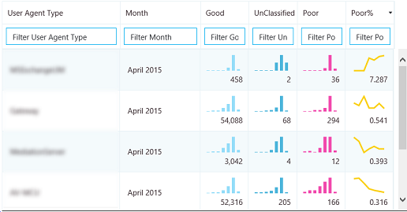

# 使用商務用 Skype Server 的通話品質儀表板

**摘要：** 瞭解如何使用通話品質儀表板。 通話品質儀表板是商務用 Skype 伺服器的工具。

通話品質儀表板 (CQD) 可讓 IT 專業人員使用匯總資料，透過比較使用者群組的統計資料來識別產生媒體質量問題的問題，以識別趨勢和模式。 CQD 不會專注于解決個別通話問題，但可識別適用于許多使用者的問題和解決方案。

## 通話品質儀表板使用者指南

CQD 是一種網頁入口網站，可根據經驗品質 (QoE) 資料，快速建立及組織報表。 CQD 會部署一個 SSAS cube，以匯總 QoE 度量資料庫中的資料，並可讓系統管理員即時建立及修改報告或進行調查。 雖然您可以使用 Excel 直接連線到 cube，但已針對包含 QoE 資料的數個工作流程優化入口網站。 資料包括：

- 快速存取的快取報告資料
- 資訊共用及發佈的報告頁面深層連結
- 簡化的報表編輯和建立，以及報表描述的可編輯中繼資料。

此外，CQD 會公開 web APIs，讓使用者以程式設計方式存取 cube 資料，以在自訂儀表板中使用。

### 功能概觀

當您造訪通話品質儀表板時，您會看到下列螢幕：

1. 「摘要窗格」是指可以找到右側)  (的「報表集」內容。
2. 在 [摘要 PaneReport] 中按一下 [編輯]，以設定層級屬性 (包括) Y 座標軸的高度）。
3. 痕跡連結可協助您識別您目前在報表集階層內的位置。
4. 含有子報表的報表會以藍色連結顯示。 按一下連結以向下流覽至子報表。

將滑鼠移到橫條圖和趨勢線上，以顯示詳細的值。 具有焦點的報表會顯示動作功能表：「編輯」、「克隆」、「刪除」及「下載」。

### 預設報表

當您第一次存取通話品質儀表板入口網站時，會自動建立預設的報表集。 這些報告有時也稱為「系統報告」。 您可以透過建立新的同輩和子報表，隨意修改或刪除這些報表或加以擴充。

在最上層，「音訊資料流程每月趨勢」報告會顯示所有音訊資料流程的每月趨勢。 將滑鼠移到柱狀圖中的橫條圖上方，以顯示柱狀圖所代表的資料更詳細的視圖。 按一下 [音訊資料流程每月趨勢報告] 的標題，以流覽至「受管理的 vs 音訊流量」報告，該報告會在受管理和非管理的呼叫間分割。 受管理的來電是透過有線連線從公司防火牆內部撥打的電話。 未管理的呼叫包括從公司防火牆外撥出的電話，以及透過 Wi-Fi 所進行的所有通話。

其他最上層的報表稱為「使用者報告的通話品質分級長條圖」。 通話品質評級是通話結束時，商務用 Skype 使用者提供的數位，用來表示通話的品質。 分級編號範圍介於1到5、1是最差值和5。 長條圖會顯示在一個月中指定分級的音訊通話數目。

按一下任何報告的標題，以流覽至資料中具有更多篩選的報表。 在系統報告中，每個子報表會顯示其父報表中可用的資料子集。 解決問題的模型很簡單：調查哪個子報表會限制問題的資料或趨勢，並逐步縮小問題空間。 建立子報表的功能可讓您針對特定資料趨勢的原因，調查您自己的猜測。

### 建立及編輯報表

在報表的 [動作] 功能表中，按一下 [編輯]，以查看報告編輯器。 查詢會將每個報告都備份到 cube。 報表是指其查詢所傳回之資料的形象。 報告編輯器可協助您編輯這些查詢以及報告的顯示選項。 當您開啟報表編輯器時，您會看到：

1. 在左窗格中選取維度、量值及篩選。 將游標移至其中一個現有的值，以顯示允許移除值的 "x" 按鈕。 按一下標題旁的 [加號] 按鈕，開啟可以新增維度、量值或篩選的對話方塊。
2. 圖表自訂的選項會顯示在頂端。
3. 報表的預覽會出現在報表編輯器中。
4. 您可以使用底部的 [編輯] 方塊來建立詳細的報告描述。

### 表格中的走勢圖表

當 StartDate 的 Month 新增為維度，而且資料在表格表單中呈現為趨勢時，橫條圖和走勢圖會顯示在表格儲存格內。 將滑鼠指標移到長條圖和走勢圖上方，以顯示個別月的值。

為了顯示長條圖及顯示的走勢圖，必須勾選報表編輯器頂端的 [顯示股價] 核取方塊。 這會選取 [趨勢] 選項，並將 Month 移至最後一個維度，也可以透過按一下 [月]，然後使用向上鍵和向下鍵來移動 StartDate。上移或下移月。

### 設定

[設定] 功能表包含有用頁面的連結，例如「系統健康情況」和「關於頁面」，而且位於儀表板的右上角。

是否顯示描述和時間戳記是由個別使用者所決定，而且這些設定只會影響儀表板的個別版本，不會修改報告集或其他使用者看到的內容。 清除快取會使所有查詢從 cube 重新載入其資料，而還原預設值會刪除所有使用者建立或修改的報表，並重新建立系統報告集（使用者在第一次登入時會看到哪些專案）。

[使用者] 儀表板連結會顯示使用者可以在其中查看 CQD 之其他使用者的頁面，並流覽其報表。 若要共用報表集，請複製 URL 欄中的連結，並與其他 CQD 使用者共用。 此連結是在使用者的使用者名稱下，其他使用者會在 [使用者儀表板連結] 頁面上看到的連結。

### 提供子網資訊

如果在封存資料庫中輸入網站特有的資訊，以提供子網對大樓對應資訊，則可能會顯示其他資訊 (例如，透過建立) 的有線/無線通話品質。

請至少完成下清單格，以建立這些報告：

- CqdBuilding
- CqdNetwork

您可以在 CqdBuildingType 和 CqdBuildingOwnershipType 表格中提供其他資訊，以允許進一步篩選及向下切入。

這兩個數據表所用的資料定義如下：

**CqdBuilding**

|欄|資料類型|允許 Null？|詳細資料|
|:-----|:-----|:-----|:-----|
|BuildingKey |int |否 |CqdBuilding 表格的主鍵。 |
|BuildingName |Varchar (80)  |否 |大樓名稱。 |
|BuildingShortName |Varchar (10)  |否 |較短的大樓名稱版本。 |
|OwnershipTypeId |int |否 |外鍵，符合 CqdBuildingOwners 表格中的其中一個專案。 |
|BuildingTypeId |int |否 |外鍵，符合 CqdBuildingType 表格中的其中一個專案。 |
|緯度 |float |是 |大樓的緯度。 |
|經度 |float |是 |大樓的經度。 |
|CityName |Varchar (30)  |是 |組建所在的城市名稱。 |
|ZipCode |Varchar (25)  |是 |樓號所在的郵遞區號。 |
|CountryShortCode |Varchar (2)  |是 |組建所在國家的 ISO 3166-1 Alpha-2 碼。 |
|StateProvinceCode |Varchar (3)  |是 |組建所在之州/省的三個字母縮寫。 |
|InsideCorp |位 |是 |Bit 表示組建是否屬於公司網路的一部分。 |
|BuildingOfficeType |Nvarchar (150)  |是 |建立 office 類型的描述。 |
|地區 |Varchar (25)  |是 |組建所在的地區。 |
|||||

**CqdNetwork**

|欄|資料類型|允許 Null？|詳細資料|
|:-----|:-----|:-----|:-----|
|網路 |Varchar (25)  |否 |子網位址。 |
|NetworkRange |Tinyint |是 |子網路遮罩。 |
|NetworkNameID |int |是 |（選用）對應至 CqdNetworkName table 中的列。 |
|BuildingKey |int |是 |外鍵，符合 CqdBuilding 表格中的其中一個專案。 |
|UpdatedDate |datetime |否 |上次更新專案的日期時間。 |
||||||

根據預設，此表格有一個專案 (0，' Unknown ' ) 。

**CqdBuildingType**

|欄|資料類型|允許 Null？|詳細資料|
|:-----|:-----|:-----|:-----|
|BuildingTypeId |int |否 |CqdBuildingType 表格的主鍵。 |
|BuildingTypeDesc |char (18)  |否 |大樓類型描述。 |
|||||

根據預設，此表格有一個專案 (0、' Unknown '、0、null) 。

**CqdBuildingOwnershipType**

|欄|資料類型|允許 Null？|詳細資料|
|:-----|:-----|:-----|:-----|
|OwnershipTypeId |int |否 |CqdBuildingOwnershipType 表格的主鍵。 |
|OwnershipTypeDesc |Varchar (25)  |否 |擁有權類型描述。 |
|LeaseInd |Tinyint |是 |參照 CqdBuildingOwnershipType 表中另一個資料列的索引，用來識別租的大樓。 |
|擁有者 |Varchar (50)  |是 |建立擁有者。 |
|||||

根據預設，此表格有一個專案 (0、' Unknown '、0、null) 。

**CqdBssid**

|欄|資料類型|允許 Null？|詳細資料|
|:-----|:-----|:-----|:-----|
|Bss |Nvarchar (50)  |否 |CqdBssid 表格的主鍵。 為 WiFi 存取點的 BSSID。 |
|Ess |Nvarchar (50)  |是 |Wifi 存取點控制器資訊。 |
|Phy |Nvarchar (50)  |是 |Phy 資訊。 |
|美聯社 |Nvarchar (50)  |是 |Wifi 存取點名稱。 |
|建築 |Nvarchar (500)  |是 |WiFi 存取點所在的大樓名稱。 |
||||

## CQD 資料流程

CQD 資料流程被視為好、不良或未分類。 CQM 1.5 現在使用下列 CQD 定義：

- 不良的資料流程是指超出臨界值的不良呼叫計量值的任何組合。
- 當通話中的某個資料流程不良時，會將通話的兩個數據流標示為較差。 在會議中，每位參與者都會以唯一通話的方式進行計算，而且會獨立于其他人員報告。
- 未分類的資料流程是指沒有品質計量的資料流程 (也就是說，綜合交易或簡短呼叫) 。
- 有效的資料流程 = 非行動用戶端
- 無法修改分類器

**通話不良定義/分類器**

|計量|臨界值|
|:-----|:-----|
|DegradationAvg |大於 1.0 (-1 網路 MOS)  |
|往返 |大於500 |
|PacketLossRate |大於 0.1 (10% )  |
|JitterInterArrival |大於30 |
|RatioConcealedSamplesAvg |大於0.07 |
|||

JPDR definition = 不良通話定義減去 RatioConcealedSamplesAvg

## 來電者/被叫方位於何處？

CQD 不使用來電者/被叫用方欄位，而是使用 "First" 和 "Second"，因為來電者和被叫方之間有介入的步驟。

 **First** 會一直是伺服器端點 (例如，AV MCU 或轉送伺服器) （如果此資料流程中包含伺服器）。

 **第二** 除非是 Server-Server 資料流程，否則會永遠為用戶端端點。

**第一及第二個分類的範例**

|端點 1 UAType|端點 2 UUAType|名字|秒|
|:-----|:-----|:-----|:-----|
|2 (AVMCU)  |4 (商務用 Skype)  |端點1 |端點2 |
|2 (AVMCU)  |1 (mMediationServer)  |端點2 |端點1 |
|4 (商務用 Skype)  |4 (商務用 Skype)  |MediaLine 的來電者 |MMediaLine 中的被呼叫者 |
|||||

如果兩個端點都是相同類型，則 CQD 會先將來電者專案和被叫方的第二個端點。 如需端點名稱的詳細資訊，請參閱 [此博客](https://blogs.technet.com/b/jenstr/archive/2015/05/22/call-quality-dashboard-tips-and-tricks.aspx)。

## VPN 的記帳

如果已知 VPN 解決方案可正確設定 VPN 旗標，您就是全部設定。 否則，請使用下列其中一種方法：

- 建立名為 VPN (首選) 的網路類型，然後將 VPN 子網與這個新的 VPN NetworkType 建立關聯。
- 建立名為 VPN 的大樓，然後將 VPN 子網與此大樓產生關聯。

## 查詢基礎

格式正確的查詢包含下列所有三個參數：

- 測量
- 維度
- 篩選

例如，格式正確的查詢將會是「使用子網的「顯示不良資料流程」（Dimension）」（Filter）。

## 同盟的功能為何？

同盟可讓您使用 AND 運算子來篩選準則。 在某些情況下，您可以將多個篩選準則結合在一起，以取得類似 OR 運算的結果。

範例：若要從大樓取得所有資料流程，同盟會提供合併資料集的不同視圖。 若要使用同盟，請在您想要同盟的兩個篩選準則上，將一般文字插入同盟欄位。

## 預設報表細目

如果在內部管理無線，您可以在受管理的桶中重新建立無線報告。

## 運作過程

請先複查和修正受管理的資料流程。 此區域中的品質應該是在您的控制項內的100%，因此可讓您更容易修正。

### 受管理的資料流程

依下列順序複查和修正受管理的資料流程：

1. Server-Server
2. 伺服器-內部接線
3. 有線-有線-內部

### 非管理資料流程

依下列順序複查和修正非管理的資料流程：

1. 伺服器-Wifi-內部
2. 伺服器-接線外
3. 伺服器-Wlan-外線
4. 接線外-直接
5. 有線外轉送
6. 其他非管理
