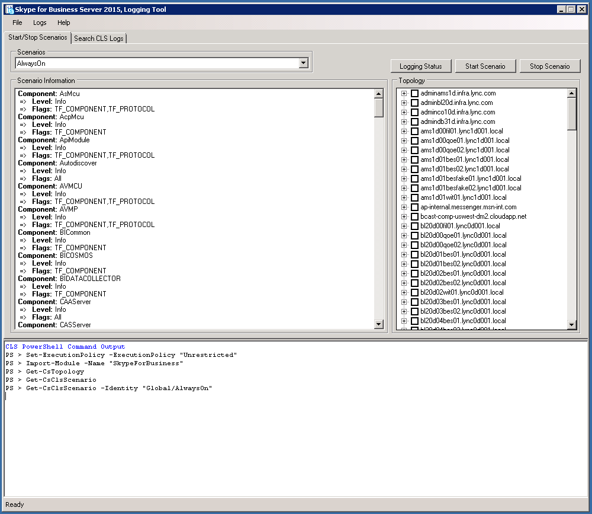

# 商務用 Skype Server 2015 的 CLS 記錄器
 
**總結：** 瞭解如何使用商務用 Skype Server 2015 中 (CLS) 記錄中的集中式記錄服務。
  
CLS 記錄器是一種工具，可協助您管理集中式記錄服務所產生的記錄檔。
  
## 必要條件

若要成功使用 CLS 記錄器，您必須確定下列專案為真：
  
- 在執行集中式記錄服務 (CLS) 之網域的成員電腦上使用此工具。 遠端 PowerShell 會話目前不支援此工具。
    
- 從 [追蹤] 資料夾 (的預設 tmx 檔會將 CLS) 和 Snooper 之追蹤資料的儲存資料夾，複製到 CLS 記錄器工具安裝所在的相同資料夾中。
    
## 檢查一組集區/電腦的記錄狀態

使用下列命令檢查記錄狀態：
  
1. 在 [開始/停止案例] 索引標籤中，選取拓撲樹狀檢視中集區和/或電腦的群組。
    
2. 按一下 [記錄狀態] 按鈕。
    
3. 在 [PowerShell 命令輸出] 區域中，查看命令輸出，以瞭解有關所選集區和/或電腦的記錄狀態的詳細資訊。
    
## 啟動現有的案例

若要啟動現有的案例：
  
1. 在 [開始/停止案例] 索引標籤中，從 [案例] 下拉式功能表中選取現有的案例。
    
2. 在拓撲樹狀檢視中，選取集區和/或電腦的群組。
    
3. 按一下 [開始案例] 按鈕。 在作業完成之前，使用者介面會被停用。 這在大型部署中可能會很慢。
    
4. 一旦案例成功啟動，便會再次啟用使用者介面。此動作的詳細資料也會顯示在 PowerShell 命令輸出區域中。
    
5. 在此案例中的任何新資料之前，此工作可能需要一段時間，才能由 CLS 挑選記錄。
    
## 停止現有的案例

若要停止現有的案例：
  
1. 在 [開始/停止案例] 索引標籤中，從 [案例] 下拉式功能表中選取現有的案例。
    
2. 在拓撲樹狀檢視中，選取集區和/或電腦的群組。
    
3. 按一下 [停止案例] 按鈕。 在作業完成之前，使用者介面會被停用。 這在大型部署中可能會很慢。
    
4. 一旦案例已停止，便會再次啟用使用者介面，該動作的詳細資料也會顯示在 PowerShell 命令輸出區域中。
    

  
## 搜尋記錄

若要搜尋記錄檔，請選取「搜尋 CLS 記錄」索引標籤，然後在填入如下所述的顯示欄位後，按一下 [搜尋記錄檔] 按鈕：
  
> **記錄檔資料夾** 儲存記錄檔搜尋結果的資料夾。  (必要) 
> 
> **記錄層級** 這會決定結果中顯示的最低層級。 例如，如果選取警告，只會顯示警告、錯誤及嚴重。 要調試的預設值。
> 
> **池** 要執行記錄搜尋的電腦集區是樹狀檢視的父節點。  (必要) 
> 
> **電腦** 個別電腦執行記錄搜尋時，這些是樹狀檢視中的所有子節點。  (必要) 
> 
> **開始時間** CLS 要從中查詢記錄的時段。  (必要) 
> 
> **結束時間** CLS 會停止查詢記錄的時段。  (必要) 
> 
> **元件** 用來選取要新增至查詢的元件。 （選用）
> 
> **通話識別碼** 要篩選之任何 SIP 對話方塊的呼叫識別碼。 請注意，此欄位會使用完全相符。 （選用）
> 
> **會議識別碼** 要篩選之任何會議的會議識別碼。 請注意，此欄位會使用完全相符。 （選用）
> 
> **IP 位址** 要以篩選依據的 IP 位址。 請注意，此欄位會使用完全相符。 （選用）
> 
> **關聯 IDs** 在邏輯上透過此識別碼連結在一起的追蹤語句。 （選用）
> 
> 依電話號碼篩選 **電話號碼**。 （選用）
> 
> **SIP URI** 依 SIP URI 篩選。 （選用）
> 
> **SIP 郵件內容包含** 依 SIP 郵件內容篩選，這會在此欄位中搜尋子字串。 （選用）
> 
> **符合任何** 使用邏輯或選取 if 進行搜尋。 預設值完全符合所有參數。
> 
> **略過網路記錄** 在檢查任何網路記錄檔時略過搜尋。
    

  
## 建立案例

1. 在 [ **編輯案例** ] 索引標籤中，按一下 [ **建立案例** ] 按鈕。
    
    > [!NOTE]
    > 建立新的案例將會複製目前所選取之案例的設定。 如果您在建立新的案例之前按一下 [**清除設定**，它就會開始，沒有選取任何元件和旗標。
  
2. 輸入您要建立之案例的名稱，然後按 Enter 鍵或按一下 [確定] 按鈕。
    
3. 現在會建立新的案例。 成功建立後，將會選取新建立的案例的案例下拉式清單。
    
## 修改案例

  
1. 在 [ **編輯案例** ] 索引標籤中，尋找要修改的所需案例。
    
2. 對元件、層級和旗標進行所需的變更。
    
3. 按一下 [ **儲存案例** ] 按鈕。
    
4. 在成功儲存案例後，它會以更新的設定重新整理案例資訊窗格。
    
## 刪除案例

1. 在 [ **編輯案例** ] 索引標籤中，從 [案例] 下拉式功能表中選取現有的案例。
    
2. 按一下 [ **刪除案例** ] 以刪除案例。
    
3. 確認動作之後，將會刪除案例。
    

