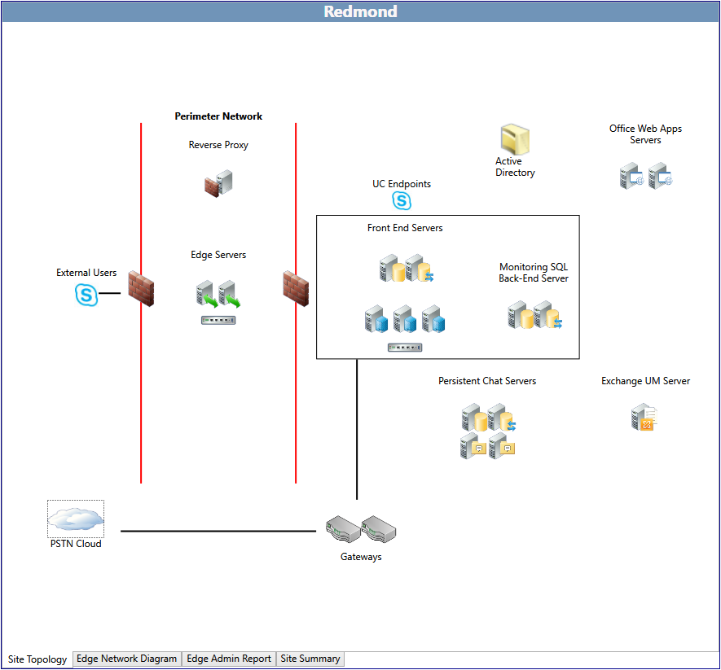

# 在商務用 Skype Server 2015 中編輯拓撲Edit the topology in Skype for Business Server 2015

在完成最初的面試問題之後，您可以編輯該網站的 (FQDN) 和 IP 位址的完整功能變數名稱。After completing the initial interview questions, you can edit the fully qualified domain name (FQDN) and IP addresses for the site. 若要這麼做，請在 **[全域拓撲]** 頁面上，連按兩下您要編輯的網站。To do this, on the **Global Topology** page, double-click the site that you want to edit.

規劃工具會顯示所選網站的網站拓撲。The Planning Tool displays the site topology for the selected site. 在網站頁面的底部有四個索引標籤：At the bottom of the site page are four tabs:

- 網站拓撲-目前顯示的頁面，如建議使用拓撲的視覺概況。Site Topology - The currently displayed page with a visual overview of the topology as recommended.

- Edge Network 圖表-Edge Network 框圖頁面是設計人員在規劃工具中大部分工作的地方。Edge Network Diagram - The Edge Network Diagram page is where the designer does most of the work in the Planning Tool. 此圖表顯示建議的商務用 Skype Server 2015 拓撲的網路設定，以及伺服器、集區的可編輯專案，以及硬體和網域名稱系統 (DNS) 負載平衡器。The diagram displays the network configuration for a recommended Skype for Business Server 2015 topology, with editable entries for IP addresses and FQDNs for servers, pool, and both hardware and Domain Name System (DNS) load balancers.

- Edge 管理報告-Edge 系統管理員報告總共包含四個報告：Edge Admin Report - The Edge Admin Report contains a total of four reports:

     

  - 摘要報告-Edge 網路設定的一般設定報告。Summary Report - A general report of settings for the Edge network configuration. 如果您將 [ **Edge Network 圖表** ] 頁面上的值編輯為 [拓撲 TCP/IP，並將用於實際部署中的 FQDN 值，則會在此顯示這些位址和名稱。If you edit the values on the **Edge Network Diagram** page to the topology TCP/IP and FQDN values of that will be used in the actual deployment, those addresses and names will be represented here. 否則，會顯示預設文字。Otherwise, the default text will appear.

  - 憑證報告-憑證報告會列出拓撲所需憑證的主體名稱和主體替代名稱。Certificate Report - The certificate report will list the subject name and subject alternative names for the certificates that are required for the topology.

  - 防火牆報告-防火牆報告會列出在基礎結構中設定周邊防火牆所需的資訊。Firewall Report - The firewall report lists information necessary to configure perimeter firewalls in the infrastructure. 這包括 IP 位址 (預設或編輯的值) 、伺服器角色、來源 IP 及埠、目的地 IP 及埠、傳輸通訊協定、應用程式通訊協定，以及相關的附注。This includes the IP addresses (either the default or edited values), server role, source IP and port, destination IP and port, transport protocol, application protocol, and relevant notes.

  - DNS 報告-DNS 報告會列出您必須建立之 DNS 專案的相關資訊。DNS Report - The DNS Report lists relevant information for the DNS entries that you must create. 包含正常運作所需的記錄類型、FQDN、IP 位址和註解。The record type, FQDN, IP address, and comments necessary for the proper operation are included.

- 網站摘要-網站摘要會顯示您透過回答最初的面試問題或填入 **設計網站** 中的值所做的選擇。Site Summary - The site summary presents an overview of the selections that you made by either answering the initial interview questions or filling in the values in **Design Sites**. 也會呈現容量資訊。Capacity information is also presented.

    > [!NOTE]
    > [網站摘要] 頁面上的資訊是針對各項設計所自訂的，無法包含此處詳述的所有區段或資訊。The information on the Site Summary page is customized for each design and may not contain all sections or information detailed here.

## 編輯網路設定圖表Edit the network configuration diagram

在商務用 Skype Server 2015 規劃工具中，設計人員大部分的工作，都是由為網狀圖上專案的 IP 位址和完整功能變數名稱定義 (Fqdn) 所組成。Most of the work that a designer does in the Skype for Business Server 2015 Planning Tool consists of defining the entries for the IP addresses and fully qualified domain names (FQDNs) for the entries on the network diagram. 在此頁面上輸入的資訊會包含在規劃工具中的報告及其他資訊中。The information that is entered on this page carries over into the reports and other information contained in the Planning Tool.

規劃工具會以預設的 IP 位址和 Fqdn 來建立網狀圖表和預設文字。The Planning Tool creates a network diagram with default text for IP addresses and FQDNs.

若要編輯網路圖和輸入值：To edit the network diagram and input values:

1. 選擇要開始處理的網路區段。Choose a section of the network to begin working on. 例如，按兩下文字 **access1.contoso.com**。For example, double-click the text, **access1.contoso.com**. 在開啟的對話方塊中，輸入伺服器 access1.contoso.com 的實際 FQDN 和實際的 IP 位址，取代131.107.155.3。In the dialog box that opens, type the actual FQDN of the server access1.contoso.com and the actual IP address, replacing the 131.107.155.3.

2. 按一下 **[確定]** 儲存項目。Click **OK** to save the entries.

3. 繼續編輯 IP 位址和 FQDN，提供各硬體負載平衡器的虛擬 IP 位址，或集區中各伺服器的網域名稱系統 (DNS) 負載平衡的伺服器項目。Continue to edit IP addresses and FQDNs, providing virtual IP addresses for hardware load balancers or server entries for Domain Name System (DNS) load balancing for servers in pools.

規劃工具的一項實用功能在於可以漸進地指派 IP 位址範圍和伺服器主機名稱，而不需要設計師分別編輯集區中的每部伺服器。例如：A helpful feature of the Planning Tool is that it can incrementally assign a range of IP addresses and server host names, rather than requiring the designer to edit each separate server in a pool. For example:

1. 按兩下集區化的前端伺服器。Double-click the pooled Front End Servers. 當對話方塊開啟時，選取 **[您要使用 IP 和 FQDN 作為此叢集中所有同等級伺服器的起點嗎?]**。When the dialog box opens, select **Do you want to use the IPs and FQDN as starting points for all equivalent servers in this cluster?**.

2. 例如，第一部伺服器的開始值是 fe0101.contoso.com 和192.168.21.122 的 IP 位址。For example, the starting value for the first server is fe0101.contoso.com and an IP address of 192.168.21.122.

3. 在 [ **前端伺服器 FQDN**] 中輸入 fe0.contoso.com，在 **前端伺服器的 IP 位址** 中輸入192.168.21.131，然後按一下 **[確定]**。Type fe0.contoso.com in **Front End Server FQDN**, type 192.168.21.131 in **Front End Server IP address**, and then click **OK**.

4. 自動遞增值功能會將集區中的所有伺服器更新為 fe01 到 fe06，並將所有 IP 位址從192.168.21.131 更新為136。The auto-increment feature updates all servers in the pool to fe01 through fe06, and all IP address from 192.168.21.131 to 136.

完成所有編輯之後，請完成下列步驟以儲存拓撲：After you have completed all edits, save the topology by completing the following steps:

若要儲存規劃工具設計，請 **按一下 [** 檔案]，然後按一下 [ **儲存拓撲** ] 或 [ **另存拓撲**]。To save the Planning Tool design, click **File**, and then click **Save Topology** or **Save Topology As**. 如果出現 **[另存規劃工具]** 對話方塊，請在 **[檔案名稱]** 中輸入檔案的名稱，然後按一下 **[儲存]**。If a **Save Planning Tool As** dialog box appears, type a name for the file in **File name**, and then click **Save**.

## 另請參閱See also

[編輯設計Editing the Design](/previous-versions/office/lync-server-2013/lync-server-2013-editing-the-design)