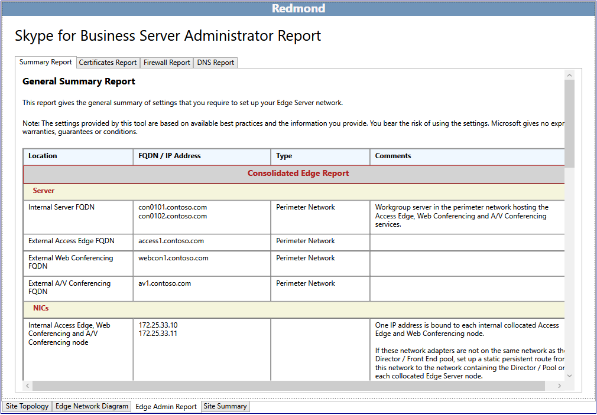

# 在商務用 Skype Server 2015 中查看系統管理員報告

系統管理員報告是部署與作業的詳細資訊。 報告是根據**設計網站**中標示的選取產生的。 設計工具可以編輯網狀圖並定義伺服器、池及負載平衡器的完整 IP 位址及完整功能變數名稱（Fqdn），進一步為系統管理員報告增添價值。

[管理員報告] 功能可讓您：

- [審閱摘要報告](review-the-administrator-reports.md#Summary_report)

- [查看憑證報告](review-the-administrator-reports.md#Certificates_Report)

- [查看防火牆報告](review-the-administrator-reports.md#Firewall_report)

- [查看 DNS 報告](review-the-administrator-reports.md#DNS_Report)

## 審閱摘要報告

商務用 Skype 系統管理員報告是四個重要報表中的第一筆，以詳細說明您的設計。 此報告中的資訊，以及其他三個相關聯的報表，對於您的資訊技術團隊很有用：

[摘要報告] 會列出與 Edge 網路相關的一般配置資訊。 [位置]、[完全合格的功能變數名稱（FQDN）] 和 [IP 位址]、[網路類型]，以及特定于指定角色的批註，都有記錄。

設計人員以及要部署、管理及維護基礎結構的每個小組，都應該檢查摘要報告的準確性，並確認錯誤最低。

您也可以查看更詳細的報表：

- 憑證報告

- 防火牆報告

- DNS 報告

## 查看憑證報告

[憑證] 報告包含建議的商務用 Skype Server 2015 部署所需的所有憑證。 規劃工具帳戶會提供所輸入之主旨名稱和消費者的替代名稱。 未編輯的預設文字，可能會代表負責要求和頒發憑證的小組所面臨的潛在挑戰。 憑證資訊也會包含憑證的頒發位置資訊。 如果基礎結構沒有內部公開金鑰基礎結構（PKI），則可以透過公用證書提供者要求所有憑證。 [延伸金鑰用法（EKU）] 和 [指派給] 報表中的欄位，對於瞭解每個證書的用途和位置都很有説明。

仔細檢查，並務必瞭解部署中每個憑證的使用及用途。 如果有關于憑證的問題，請判斷哪個伺服器或服務正在與其交談。 商務用 Skype Server 2015 中的憑證是用於兩個主要用途：

- 相互傳輸層安全性（MTLS）：通訊中所涉及的電腦，每個都提供可向其他電腦證明其身分身分的憑證。 這稱為伺服器驗證。 在每個電腦信任其他電腦的身分識別之後，才能開始進行通訊。

- 加密-加密（安全通訊端層或 SSL，以及傳輸層安全性或 TLS）是協助保護通訊、協助確保隱私權，以及建立信任的通訊與共同作業系統的重要方式。

## 查看防火牆報告

商務用 Skype Server 2015 有一組可能複雜的防火牆規則。 規劃工具會根據設計人員的輸入準則，透過產生一個定義來詳細說明所有防火牆需求的報告，來減少這項複雜性。 IT 防火牆管理員將能使用此報告來設定及定義必要的規則。

從防火牆管理的角度來看，應仔細檢查報告，以確保現有的防火牆規則沒有任何衝突，且沒有任何原則或程式可能違反。

## 查看 DNS 報告

DNS 報告是系統管理員報告的一部分，詳細說明內部、週邊及外部網路中的網域名稱系統（DNS）的所有建議和已知專案。 如果設計工具已完成對 network 圖表的編輯，且所有 IP 位址及完整功能變數名稱（Fqdn）都定義為其生產值，則 DNS 報告會提供絕佳的配置資源。 此報告也可以做為操作疑難排解檔。

您應該讓您的 DNS 管理小組徹底檢查 DNS 報告，以確保在部署期間不存在可能造成困難的錯誤，或可能會使疑難排解會話複雜化。

## 另請參閱

[檢閱管理員報告](https://technet.microsoft.com/library/1dee56a9-a033-4201-9765-e3469bd7d3e3.aspx)
