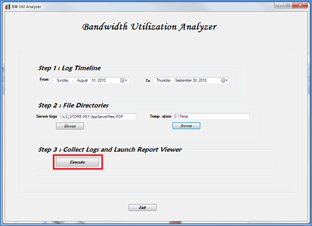

# <a name="skype-for-business-server-2015-resource-kit-tools-documentation"></a>商務用 Skype Server 2015 Resource Kit Tools 檔

本文說明 商務用 Skype Server 2015 Resource Kit 中的工具，包括每個工具的用途及其使用範例。 商務用 Skype Server 2015 資源套件可協助讓部署和管理 2015 商務用 Skype Server IT 系統管理員更容易執行例行工作。 例如， **Web Conf Data** 工具可用來輕鬆控制使用者在線上會議期間上傳的資料。 **SEFAUtil** 工具可用來設定使用者的委派通話轉送和回應。 我們鼓勵 IT 系統管理員使用這些工具來更有效率地管理 2015 商務用 Skype Server。

## <a name="installation-of-the-resource-kit-tools"></a>Resource Kit 工具的安裝

若要安裝 商務用 Skype Server 2015 Resource Kit，請從下載中心下載[OCSReskit.msi](https://www.microsoft.com/download/details.aspx?id=52631)。

執行 **OCSResKit.msi** 以執行簡單的安裝。 .msi會安裝下列路徑中的所有工具：**%Program Files%\商務用 Skype Server 2015\ResKit**。 屬於獨立可執行檔的工具位於此資料夾中。 也有支援檔案的工具位於自己的子資料夾中。

## <a name="supported-environments"></a>支援的環境

商務用 Skype Server 2015 資源套件應該安裝在符合 商務用 Skype Server 2015 所需規格的伺服器上，通常是用來在 2015 商務用 Skype Server執行的伺服器。

## <a name="resource-kit-tools-overview"></a>Resource Kit 工具概觀

以下是 商務用 Skype Server 2015 Resource Kit 中提供的工具清單。 下列各節涵蓋每個工具的描述，包括需求和範例使用方式。

- [ABSConfig](resource-kit-tools.md#ABSConfig)

- [頻寬原則服務監視器](resource-kit-tools.md#bpsm)

- [頻寬使用率分析器](resource-kit-tools.md#bua)

- [通話駐留計](resource-kit-tools.md#callpark)

- [DBAnalyze](resource-kit-tools.md#dba)

- [匯入儲存體服務資料](resource-kit-tools.md#Issd)

- [LCSSync](resource-kit-tools.md#LCSSync)

- [查閱使用者主控台](resource-kit-tools.md#LUC)

- [MsTurnPing](resource-kit-tools.md#MsTurnPing)

- [網路組態檢視器](resource-kit-tools.md#NCV)

- [回應群組代理程式 Live](resource-kit-tools.md#RGAL)

- [SEFAUtil](resource-kit-tools.md#SEFAUtil)

- [SYSPrep.ps1](resource-kit-tools.md#SYSPrep)

- [未指派的宣告數目移轉](resource-kit-tools.md#UNAM)

- [Web Conf 資料](resource-kit-tools.md#WebConfData)

## <a name="absconfig"></a>ABSConfig
<a name="ABSConfig"> </a>

ABSConfig)  (通訊錄服務組態工具是一種系統管理工具，可協助系統管理員自訂 2015 商務用 Skype Server通訊錄服務設定。 此工具也可讓 商務用 Skype Server 2015 系統管理員還原預設的通訊錄服務設定。

### <a name="description"></a>描述

ABSConfig 是圖形使用者介面應用程式，可讓系統管理員設定與通訊錄服務相關的Active Directory 網域服務屬性。

此工具的主要案例如下：

- 若要讓系統管理員將 Active Directory 網域服務 中的屬性對應至 商務用 Skype Server 2015 的屬性。

- 若要讓系統管理員指定要包含或排除在通訊錄服務檔案中的Active Directory 網域服務屬性。

- 若要讓系統管理員能夠還原，請預設 [通訊錄服務] 設定。

您可以使用 ABSConfig.exe 檔案來啟動 ABSConfig 工具。 工具會開啟至 [**設定屬性] 索引卷** 標。此資料表有選項可將Active Directory 網域服務屬性對應至 商務用 Skype Server 2015 的屬性欄位，以及根據特定屬性篩選，指定要在通訊錄服務檔案中包含或排除哪些使用者。 它也有選項可自訂要包含在通訊錄檔案中的電話號碼值。 [ **還原預設值]** 選項可讓系統管理員將 [通訊錄服務] 設定還原為預設值。

> [!NOTE]
> 將 AD 屬性重新對應至不同的 OC 功能變數名稱，僅適用于通訊錄檔案下載，而且不受通訊錄 Web 查詢支援。

### <a name="output"></a>輸出

ABSConfig 會將通訊錄服務設定儲存在資料庫中。

```console
Path: %ProgramFiles%\Skype for Business Server 2015\Reskit
```

### <a name="purpose"></a>用途

ABSConfig 提供快速且簡單的方式來自訂 商務用 Skype Server 2015 通訊錄服務。

### <a name="requirements"></a>需求

#### <a name="computer"></a>電腦

ABSConfig 只能從已安裝 商務用 Skype Server 2015 的已加入網域電腦執行。 在 商務用 Skype Server 2015 Enterprise Edition，此工具可以在安裝期間啟用通訊錄服務的任何Front-End伺服器上執行。

#### <a name="network"></a>網路

電腦應該能夠連線到Front-End集區和後端資料庫。

#### <a name="software"></a>軟體

執行 ABSConfig 工具之前，必須先安裝下列軟體元件：

- 商務用 Skype Server 2015

#### <a name="users"></a>使用者

具有更新 商務用 Skype Server 2015 部署所需許可權的系統管理員。

### <a name="examples"></a>範例

您可以在命令提示字元中輸入 **ABSConfig.exe** 來啟動 ABSConfig。 如下所示的是 ABSConfig 工具使用者介面。


### <a name="summary"></a>摘要

ABSConfig 工具可讓系統管理員快速且輕鬆地使用工具來自訂 商務用 Skype Server 2015 通訊錄服務。

## <a name="bandwidth-policy-service-monitor"></a>頻寬原則服務監視器
<a name="bpsm"> </a>

頻寬原則服務監視器工具旨在讓系統管理員檢視下列清單：

1. 拓撲中所有設定的 商務用 Skype Server 2015 頻寬原則服務 (驗證和核心) 

2. 每個服務對其他頻寬原則服務和 Edge 伺服器所建立的連線

3. 網路組態檔中設定的所有連結，以及每個頻寬原則服務所報告的即時頻寬使用量

### <a name="description"></a>描述

頻寬原則服務監視工具會實作為 GUI 型應用程式。 系統管理員會執行PDPMonUI.exe來啟動工具。

當工具啟動時，它會嘗試探索拓撲中的頻寬原則服務清單。 完成初始更新之後，視窗左邊的窗格會填入由所屬叢集分組的服務清單。

當系統管理員選取特定頻寬原則服務時，右側窗格會顯示該特定服務的相關資訊。 該窗格也有兩個顯示資訊的主要索引標籤。

#### <a name="machine-info-tab"></a>電腦資訊索引標籤

[ **機器資訊]** 索引標籤會顯示所選取頻寬原則服務的詳細資料，以及所選頻寬原則服務對其他服務所建立之所有連線的清單和狀態。

#### <a name="topology-info-tab"></a>拓撲資訊索引標籤

[ **拓撲資訊]** 索引標籤會顯示 [網路組態設定] 中設定的所有連結清單。 針對每個連結，會顯示音訊和視訊頻寬容量。 此外，目前使用的頻寬會以 Kbps 顯示，並以容量的百分比顯示。 此工具會使用色彩編碼來醒目提示使用率接近容量的連結，這可讓系統管理員快速隔離這類連結。

> [!NOTE]
>  如果頻寬原則服務監視器工具連線到任何已設定的頻寬原則服務時發生失敗，則不會填入 [ **機器資訊** ] 和 [ **拓撲資訊** ] 索引標籤中的資訊。 不過，工具一開始可能會連線，但之後會失去與服務的連線。 在這種情況下，系統管理員可能會看到過期的資訊。 每個索引標籤上都有上次 **更新** 的時間戳記，可讓系統管理員查看特定頻寬原則服務上次更新資料的時間。

### <a name="output"></a>輸出

沒有命令列輸出;程式輸出會包含在主要圖形使用者介面 (GUI) 中。

### <a name="purpose"></a>用途

頻寬原則服務監視器工具的目的是要讓系統管理員能夠看到拓撲中定義的每個頻寬原則服務的狀態。 此外，系統管理員可以查看網路組態檔中定義之所有連結的即時頻寬使用量。

### <a name="requirements"></a>需求

頻寬原則服務監視工具必須在屬於商務用 Skype Server拓撲的電腦上執行。

### <a name="summary"></a>摘要

頻寬原則服務監視器工具可以是系統管理員的重要資源，讓他們可以檢查拓撲中所有頻寬原則服務的狀態，更重要的是，他們可以取得網路組態設定中所定義連結的即時頻寬使用率。

## <a name="bandwidth-utilization-analyzer"></a>頻寬使用率分析器
<a name="bua"> </a>

頻寬使用率分析器是一種工具，可建立有關 UC 端點在商業網路中 WAN 連結之間各種頻寬耗用量檢視的報告。 這些報告可用來瞭解目前的頻寬耗用模式，並協助規劃頻寬容量。

### <a name="description"></a>描述

頻寬使用率分析器會實作為 GUI 型應用程式。 此工具會產生專用於網路音訊使用量的報告，並協助進行容量規劃。 它也會逐一查看指派給各種連結的頻寬容量。

### <a name="output"></a>輸出

頻寬使用率分析器會針對系統中設定的所有 WAN 連結，提供頻寬容量和音訊使用率的圖形化繪圖。

### <a name="purpose"></a>用途

在任何語音和視訊部署中，監視和瞭解商業網路中媒體流量頻寬使用率的趨勢非常重要。 頻寬使用率分析器工具可讓系統管理員達成此目的。 此工具會執行下列動作：

- 產生跨網路音訊使用率的特定報告

- 協助在指派給各種連結的頻寬容量上進行更有效的容量規劃和反復專案

頻寬使用率分析器可以產生頻寬容量和使用率報告的圖形化繪圖;它們如下所示：

- 商業網路中的所有 WAN 連結

- 依已選擇的所選 WAN 連結進行篩選

- 已超過連結容量的 WAN 連結篩選

- 依已充分利用布建頻寬的 WAN 連結進行篩選

- 依已達到重要層級的 WAN 連結篩選， (大於 WAN 連結頻寬容量 90% 的頻寬使用率) 

- 依 WAN 連結類型篩選 - 網站內的網路網站連結、區域間連結和連結

- 依網路區域篩選

#### <a name="applications"></a>應用程式

頻寬使用率分析器具有下列兩個應用程式， (工具) ：

- **WanLinkLogCollector.exe** 此工具可讓使用者輸入所需的資訊。

- **BandwidthUtilizationAnalyzer.xlsm** Microsoft Excel試算表軟體報告會由WanLinkLogCollector.exe自動啟動。 此應用程式可讓使用者將篩選套用至報表，如本文稍後所示。

#### <a name="phases-of-using-bandwidth-utilization-analyzer"></a>使用頻寬使用率分析器的階段

使用頻寬使用率分析器時，有兩個階段：

- 收集記錄，這些記錄是使用 WanLinkLogCollector.exe

- 自訂使用 BandwidthUtilizationAnalyzer.xlsm 執行的報表

  > [!IMPORTANT]
  > 強烈建議使用者不要手動啟動 BandwidthUtilizationAnalyzer.xlsm。

#### <a name="starting-bandwidth-utilization-analyzer"></a>啟動頻寬使用率分析器

在命令提示字元或使用 Windows Explorer 啟動WanLinkLogCollector.exe。

 **使用 WanLinkLogCollector.exe**

使用 WanLinkLogCollector.exe 有三個步驟：

1. **記錄時程表** 提供產生報表所需的時間軸

2. **指定檔案目錄** 提供檔案位置資訊

3. **收集記錄並啟動報表檢視器** 執行 命令以產生報表

#### <a name="step-1---log-the-timeline"></a>步驟 1 - 記錄時程表

記錄時程表可讓工具使用者指定下列專案，如下圖所示。

1. **開始日期** 這是要為其產生報表之時程表的開始日期;例如，2010 年 8 月 1 日。

2. **結束日期** 這是要為其產生報表之時程表的結束日期;例如，2010 年 9 月 30 日。

     

#### <a name="step-2---specify-the-file-directories"></a>步驟 2 - 指定檔案目錄

使用者可以指定下列檔案目錄，如下所示。

- **伺服器記錄檔位置** 儲存頻寬原則伺服器記錄的資料夾位置。 這通常是在 \<fileserver\> \\ FE \> \AppServerFiles\PDP 的<選擇中。

- **暫存檔儲存位置** 產生報表時儲存中繼檔案的暫存檔位置。

  

  > [!NOTE]
  > 請確定已將伺服器記錄和暫存檔存放區資料夾的足夠檔案存取權提供給工具使用者。

#### <a name="step-3---collect-the-logs-and-start-the-report-viewer"></a>步驟 3 - 收集記錄並啟動報表檢視器

若要收集記錄並啟動報表檢視器，請按一下 **[執行** ]，如下所示。 此步驟會收集必要的資料。



輸入驗證成功時，會顯示如下所示的訊息。


按一下 **[確定]**。 BandwidthUtilizationAnalyzer.xlsm 會自動啟動。 請遵循訊息方塊中的指示。 如需詳細資訊，請參閱下一節中的 **使用 BandwidthUtilizationAnalyzer.xlsm** 。


### <a name="using-bandwidthutilizationanalyzerxlsm"></a>使用 BandwidthUtilizationAnalyzer.xlsm

1. 當 BandwidthUtilizationAnalyzer.xlsm 自動啟動時，請按一下 [ **重新整理** ]，如下所示。

     

2. 開啟檔案資料夾時，請從訊息方塊中指定的位置選取 [consolidated.csv]，如下所示。 它也會將位置顯示為 **C：\Temp**。

     

3. 按一下 **[匯入]**。

4. 圖形化繪圖會自動產生。 它可在背景工作指標消失時使用。

     

#### <a name="applying-filters-to-the-report-view"></a>將篩選套用至報表檢視

如下所示，可以套用至報表檢視的篩選如下所示：


1. **名字** 依 WAN 連結篩選 (篩選器位於圖表) 的右側。 前置詞表示下列連結類型;請參閱垂直 (藍色) 框：

   - **S 網站** 從網站到網路區域的 WAN 連結

   - **IS 網站間** 兩個網站之間的 WAN 連結

   - **R 區域間** 兩個網路區域之間的 WAN 連結

2. **超出限制** 依頻寬使用率大於頻寬容量的 WAN 連結進行篩選

3. **重要層級** 依頻寬使用率已達到 90% 或超過頻寬容量的 WAN 連結進行篩選

4. **使用量過低** 依頻寬使用率小於頻寬容量 25% 的 WAN 連結進行篩選

5. **連結類型** 依下列 WAN 連結類型篩選：

   - **網站** 類型

   - **月臺間** 類型

   - **區域間連結** 類型

6. **地區** 依網路區域篩選

下圖顯示先前所述的篩選準則。

依 **名稱** 篩選。 選取需要顯示在圖表中的連結清單。


依 **超出限制** 篩選。 選取 **[True** ] 以強制執行篩選。


依 **關鍵層級** 篩選。 選取 **[True** ] 以強制執行篩選。


依 **使用量過低** 的篩選。 選取 **[True** ] 以強制執行篩選。

![依 [使用中] 底下的篩選。](../media/Reskit_2012_Tools_Documentation_Image15.jpg)

依 **連結類型** 篩選。 選取需要顯示的類型。


依 **區域** 篩選。 選取需要顯示連結的區域清單。


### <a name="requirements"></a>需求

- .NET Framework 3.5

- Microsoft Excel 2010或 Excel 2007

### <a name="summary"></a>摘要

頻寬使用率分析器可用來繪製網路上 UC 流量的音訊頻寬使用率。 此工具也可用來報告網路上視訊頻寬的使用率。

## <a name="call-parkometer"></a>通話駐留計
<a name="callpark"> </a>

通話駐留計是命令列應用程式，可讓您輕鬆存取通話駐留軌道資料庫。

### <a name="description"></a>描述

通話駐留計是追蹤目前駐留通話的工具。 它也會收集有關軌道和呼叫駐留伺服器 (CPS) 使用量的統計資料。 此命令列工具可讓您從本機或遠端連線的電腦SQL Server資料庫讀取和寫入 CPS 軌道。

所有選項都是互斥的。 命令列語法如下：

- **-o** 參數— 列出為此集區設定的所有軌道範圍。

- **-n** 參數— 列出此集區中目前使用的所有軌道。 顯示的資訊如下：

  - SIP 統一資源識別項 (URI) 的駐留者和佇列。

  - 通話駐留所在 CPS 的主機名稱。

  - 通話駐留時間戳記。

- **-f** 參數— 列出集區中目前可用的軌道數目。

- **-r \<n\>** parameter— 列出上次駐留 \<n\> 的呼叫。 顯示的資訊如下：

  - Parkee SIP URI。

  - 布來文 SIP URI。

  - 通話駐留所在 CPS 的主機名稱。

  - 擷取或卸載呼叫的時間戳記。

- **-t \<n\>** parameter - 測試保留資料庫中的軌道，以顯示指派的軌道編號隨機性。

### <a name="output"></a>輸出

根據在命令提示字元中指定的輸入參數，通話駐留計會顯示下列輸出：

- 針對此集區設定的所有軌道範圍

- 目前駐留的通話

- 可用) 軌道的可用 (數目

- 最近停駐的通話

- 用於測試統一和隨機軌道值的保留軌道

### <a name="purpose"></a>用途

CPS 工具的目的是要提供 CPS 資料庫的命令列存取。 系統管理員可以檢視 CPS 使用量，並判斷指派給集區的軌道數目。

### <a name="requirements"></a>需求

如果此工具是在執行 CPS 的同一部電腦上執行，則沒有任何需求。 如果此工具是在遠端電腦上執行，商務用 Skype Server 2015 使用的SQL Server資料庫必須設定為允許遠端存取。 呼叫駐留計必須設定SQL Server資料庫連接字串，才能連線到集區的SQL Server。 此SQL Server資料庫連接字串定義于組態檔 **中，parkometer.exe.config**。它必須放在parkometer.exe所在的相同目錄中。 下列 XML 檔案是parkometer.exe.config的範例。必須設定的參數是使用者名稱 (例如 mydomain\Administrator) 、密碼 (例如 mypassword) ，以及主機名稱 (例如 myserver) 。

```xml
<?xml version="1.0" encoding="utf-8" ?>
<configuration>
  <appSettings>
   <add key="SQL" value="server=myserver\RTC;
database=cpsdyn;
User Id=mydomain\Administrator;
Password=mypassword.;
Integrated Security=false;"/>
  </appSettings>
</configuration>
```

### <a name="examples"></a>範例

已部署的軌道範圍：-o 參數會列出為此集區設定的所有軌道範圍，如下所示


目前駐留的呼叫：-n 參數會列出此集區上目前使用的所有軌道，如下所示


可用的軌道數目：-f 參數會列出集區中目前可用的軌道數目，如下所示


最近停駐的呼叫：-r \<n\> 參數會列出最後駐留的呼叫， \<n\> 如下所示


測試軌道保留：-t \<n\> 參數會測試保留資料庫中的軌道，如下所示


### <a name="summary"></a>摘要

通話駐留計是一種命令列工具，可提供通話駐留伺服器的詳細資訊。

## <a name="dbanalyze"></a>DBAnalyze
<a name="dba"> </a>

### <a name="description"></a>描述

DBAnalyze 是命令列工具，可協助系統管理員收集有關 商務用 Skype Server 2015 資料庫的分析報告。 DBAnalyze 具有下列模式：診斷、使用者資料、會議、MCU 和磁碟片段：

- **診斷模式** 建立報表，其中包含資料表 (記錄數目、片段、資料大小和索引大小) 、資料和記錄檔大小、上次備份時間、執行 Microsoft Office通訊伺服器之伺服器之間的連絡人分佈、平均許可權數目、連絡人、容器、訂用帳戶、發行集、每位使用者的端點、任何不適當的常用使用者、無法路由傳送的使用者、 每位使用者、排程會議、作用中會議和資料庫版本組織的平均會議數目。

    > [!NOTE]
    > 執行診斷模式可能會影響伺服器效能。

- **使用者資料模式** 針對指定的使用者或在其連絡人和許可權清單中有該使用者的使用者，報告連絡人、容器、訂閱、發行集、許可權和連絡人群組資料。 此模式也會報告使用者組織或受邀參加之會議的摘要資料。

- **會議模式** 報告特定會議的詳細資料，包括會議的所有排程時間詳細資料、受邀者清單、會議允許的媒體類型清單、作用中的 MCUS (多點控制單位) 、作用中的參與者清單，以及每個參與者的訊號狀態。

- **解碼會議識別碼** 將公用電話交換器網路解碼 (PSTN) **/pstnid** 交換器所指定的會議識別碼，但不會連線到後端以取得詳細資訊。

- **解決會議** 解碼 **/pstnid** 參數所指定的 PSTN 會議識別碼，並顯示識別碼所指示會議的相關資訊。

- **MCUs 模式** 報告集區中每個 MCU 的識別碼、媒體類型、URL、活動訊號狀態、會議負載和參與者負載。

- **磁碟片段模式** 顯示所有磁片的片段狀態。

此工具可用來診斷各種問題，或協助系統管理員規劃容量。 例如，如果大部分位於伺服器 A 的使用者選擇位於伺服器 B 的使用者作為其連絡人，則系統管理員可以將伺服器 A 上的使用者移至伺服器 B，以減少跨伺服器流量。

### <a name="output"></a>輸出

此工具會輸出有關 商務用 Skype Server 2015 資料庫的預先定義報告。 **路徑**：%ProgramFiles%\商務用 Skype Server 2015\Reskit

### <a name="purpose"></a>用途

若要安裝Dbanalyze.exe，請將它複製到本機資料夾，然後執行工具。 若要使用此工具，請從命令列執行下列命令。 `dbanalyze.exe [/v] [/report:value] [/sqlserver:value] [/user:user@domain.com] [/conf:value][/pstnid:Value] [/maxcontacts:value]` 命令列選項的描述如下所示。


### <a name="requirements"></a>需求

 **電腦** DBAnalyze 只能從已安裝 商務用 Skype Server 2015 的已加入網域電腦執行。

 **網路** 電腦應該能夠連線到後端資料庫。

 **執行** DBAnalyze 之前，必須先安裝軟體商務用 Skype Server 2015 軟體元件。

 **使用者** 下表顯示具有存取 2015 資料庫商務用 Skype Server必要許可權的系統管理員。


> [!NOTE]
> **/report：** disk 模式需要本機系統管理員帳戶。

### <a name="examples"></a>範例

以下是有效Dbanalyze.exe命令的範例：

```console
dbanalyze.exe /report:diag
dbanalyze.exe /report:user /user:usera@domainb.com
dbanalyze.exe /report:conf /user:bob@example.com /conf:1W9J71SKSX2X
dbanalyze.exe /report:resolve /pstnid:12345
dbanalyze.exe /report:mcus
dbanalyze.exe /report:disk
```

### <a name="summary"></a>摘要

DBAnalyzer 可讓系統管理員快速且輕鬆地分析商務用 Skype Server 2015 資料庫。

## <a name="import-storage-service-data"></a>匯入儲存體服務資料
<a name="Issd"> </a>

ImportStorageServiceData 資源套件工具可讓您重新匯入已從 儲存體 服務中清除的佇列和端點資料， (LYSS) 回儲存體服務。

### <a name="description"></a>描述

已排清儲存體服務的資料可能已根據佇列專案狀態或資料庫大小，自動 (定期) 。 可能是因為手動叫用集區容錯移轉 Cmdlet，或是集區容錯移轉 Cmdlet 叫用) 的 StorageServiceFullFlush Cmdlet (。 請注意，如果前端上任何儲存體服務 (LYSS ) 資料庫大小高於一般層級，則最好不要重新匯入資料，因為這樣做可能只會將更多資料匯出回來。此外，可能造成儲存體服務佇列成長之錯誤的任何問題，都應該先解決 (例如Exchange端點錯誤、網路問題或其他) 問題。

 **案例 1：** 在集區容錯移轉期間，可能會從每個前端的儲存體服務中清除檔案。 容錯移轉完成之後，應該執行工具以重新匯入資料。

 **案例 2：** 資料會每天自動排清，或回應儲存體服務資料庫超過特定大小閾值 (例如 60%、80%、90% 的完整) 。 系統管理員應該定期重新匯入這個自動排清的資料。 在上述情況下，如果未部署監視 SCOM 套件，商務用 Skype Server 儲存體服務會發生與從 儲存體 服務排清資料相關的事件。 啟動 32075 (完整排清作業的事件識別碼) 啟動，32076 (完整排清已完成) 、32082 (維護層級排清已啟動) 、32083 (維護層級排清完成) ，因資料庫) 填滿而發生 32089 (排清。 請注意，這些事件識別碼會對應至 RTM 版本。 當系統管理員看到這些事件時，表示有已清除的檔案。此資料應該定期使用此工具匯回，例如每週一次。

針對線上服務版本，如果已部署適用于商務用 Skype Server的健康情況監視 SCOM 套件，可能會引發新的警示，要求系統管理員將已排清的資料重新匯入儲存體服務。 在觸發警示的Front-End伺服器上，事件記錄檔中會有對應的事件。 此事件會說明排清資料檔案所在的父路徑，以及有多少符合警示準則的檔案。 警示準則是特定父路徑底下有 X 或多個檔案，這些檔案至少有 Y 天， (其中 X 和 Y 在 StorageService 內預設，但可藉由變更 APPCONFIG 檔案來覆寫。) 下方顯示兩個可觸發健康情況警示的事件範例， 差異在於其父路徑。 其中一個可能性是在 Web 服務檔案共用下，另一種可能性是每個前端的本機應用程式資料目錄。  (例如 c：\ProgramData\Microsoft\商務用 Skype Server 2015\StorageService) 。 系統管理員接著會執行此 reskit 工具。

此工具會在執行前端及其他前端上增加 CPU 和 IO 負載，在此情況下，資料不是由執行工具的前端所擁有。 我們建議在前端未承受大量 CPU 和 IO 負載時執行此工具，例如在尖峰時間以外。 其次，此工具可以 2 到 3 分鐘匯入一個資料檔案。 在估計工具將執行多久時，請記住這一點。 此工具產生的詳細資訊記錄檔預設會出現在 [檔案] Microsoft Store上。 如果未報告任何錯誤，請將其刪除，因為記錄檔可以是數十 MB 或更多。


### <a name="requirements"></a>需求

安裝 商務用 Skype Server 2015 Resource Kit 工具。 此工具會在已加入網域的電腦上執行，其中已安裝商務用 Skype Server和商務用 Skype Server管理命令介面。 此工具會使用管理殼層中的 Cmdlet 來識別集區中的所有Front-End伺服器。 其次，必須從集區中已安裝 **RtcLocal** 資料庫的電腦執行此工具。 工具會使用此資料庫來擷取集區的 WEBSERVICE 檔案共用位置。 此外，在使用此工具之前，每個Front-End伺服器必須先在每個Front-End伺服器上使用 **Enable-PSRemoting** 啟用 Windows PowerShell 遠端處理，以及從中執行工具的電腦。 否則，來自此工具的遠端Windows PowerShell命令將會失敗。 Windows PowerShell完成後，即可在集區中的所有Front-End伺服器上關閉遠端處理。 最後，叫用工具的帳戶或認證必須具有執行此工具之集區的 Web 服務檔案共用讀取/寫入權限。 否則，工具將會因為 IO 許可權錯誤而失敗。

> [!NOTE]
> 在Windows Server 2012上，預設會啟用 Windows PowerShell 遠端處理，但不會在 Windows Server 2008 作業系統上啟用。

### <a name="examples"></a>範例

```console
>  C:\StorageService>ImportStorageServiceData.exe
Description:
This tool will re-import Storage Service (LYSS) flushed queue data back in.  For a pool: you are required to run this tool on a machine inside the pool which has the Lync Server Management Shell installed.  Additionally, all front end machines need to have Windows Powershell Remoting enabled before executing this tool by executing Enable-PSRemoting.  Also, please ensure that all Storage Service instance DB Size are at the 'Normal' level (verify this by viewing Eventlog events). Otherwise re-importing may cause data to be flushed out again if any Storage Service instance DB size level goes above 'Normal'.
Usage: Default behavior is to Import data from web service file share as well as any files on all Front End machines in pool.
Additional Options:
-Verbose                    : Turn verbose output on.

-StorageServiceHostName     : Host Name of Storage Service WCF endpoint.  ( Default=localhost netnamedpipe binding. )

-FileSharePath              : Import only all data from just under the UNC path specified.

ActivityID: cc3b62ff-bb66-4e61-a6e2-96cb3626315c. <-- Use this to correlate with StorageService trace logs if troubleshooting.
Type Server name (TCP binding) or press <enter> for localhost (NamePipe binding):
Using NetNamedPipeBinding...
OnTopologyChanged Event received
Web Service File Share: \\dc.vdomain.com\OcsFileStore\co1-WebServices-1\StorageService

Front Ends:
server.vdomain.com
server2.vdomain.com
server1.vdomain.com
server3.vdomain.com
Looking under directory: \\dc.vdomain.com\OcsFileStore\co1-WebServices-1\StorageService for exported data.
# Files found: 8
Starting Import for file:\\dc.vdomain.com\OcsFileStore\co1-WebServices-1\StorageService\DataExport\2
0120910\SERVER.vdomain.com\944f5724c65c5f93900dc1c8c898b102__0.xml
Items deserialized: 20

All items in file were enqueued successfully, will try to delete file: \\dc.vdomain.com\OcsFileStore\co1-WebServices-1\StorageService\DataExport\20120910\SERVER.vdomain.com\944f5724c65c5f93900dc1c8c898b102__0.xml

All items in file failed to enqueue so file will not be deleted.  File path: \\dc.vdomain.com\OcsFileStore\co1-WebServices-1\StorageService\DataExport\20120910\SERVER.vdomain.com\944f5724c65c5f93900dc1c8c898b102__0.xml

Summary for file \\dc.vdomain.com\OcsFileStore\co1-WebServices-1\StorageService\DataExport\20120910\SERVER.vdomain.com\944f5724c65c5f93900dc1c8c898b102__0.xml: succeeded: 20, failed: 0

Starting Import for file:\\dc.vdomain.com\OcsFileStore\co1-WebServices-1\StorageService\DataExport\20120910\SERVER1.vdomain.com\17d5435ae40259f7bbdf1866776386e4__0.xml
Items deserialized: 20

[cc3b62ff-bb66-4e61-a6e2-96cb3626315c] Send EnqueueMessages to redirected, targetServer=server1.vdomain.com, queueItems=20

All items in file were enqueued successfully, will try to delete file: \\dc.vdomain.com\OcsFileStore\co1-WebServices-1\StorageService\DataExport\20120910\SERVER1.vdomain.com\17d5435ae40259f7bbdf1866776386e4__0.xml

All items in file failed to enqueue so file will not be deleted.  File path: \\dc.vdomain.com\OcsFileStore\co1-WebServices-1\StorageService\DataExport\20120910\SERVER1.vdomain.com\17d5435ae40259f7bbdf1866776386e4__0.xml

Summary for file \\dc.vdomain.com\OcsFileStore\co1-WebServices-1\StorageService\DataExport\20120910\
SERVER1.vdomain.com\17d5435ae40259f7bbdf1866776386e4__0.xml: succeeded: 20, failed: 0

Starting Import for file:\\dc.vdomain.com\OcsFileStore\co1-WebServices-1\StorageService\DataExport\20120910\SERVER1.vdomain.com\904f6c9b8ac951ae8b3c86684d3832e4__0.xml

Items deserialized: 20
[cc3b62ff-bb66-4e61-a6e2-96cb3626315c] Send EnqueueMessages to redirected, targetServer=server1.vdomain.com, queueItems=20

All items in file were enqueued successfully, will try to delete file: \\dc.vdomain.com\OcsFileStore
\co1-WebServices-1\StorageService\DataExport\20120910\SERVER1.vdomain.com\904f6c9b8ac951ae8b3c86684d
3832e4__0.xml

All items in file failed to enqueue so file will not be deleted.  File path: \\dc.vdomain.com\OcsFil
eStore\co1-WebServices-1\StorageService\DataExport\20120910\SERVER1.vdomain.com\904f6c9b8ac951ae8b3c
86684d3832e4__0.xml

Summary for file \\dc.vdomain.com\OcsFileStore\co1-WebServices-1\StorageService\DataExport\20120910\
SERVER1.vdomain.com\904f6c9b8ac951ae8b3c86684d3832e4__0.xml: succeeded: 20, failed: 0

Starting Import for file:\\dc.vdomain.com\OcsFileStore\co1-WebServices-1\StorageService\DataExport\2
0120910\SERVER2.vdomain.com\69844a271e6c5633a1f2b46a42287dd6__0.xml

Items deserialized: 20

[cc3b62ff-bb66-4e61-a6e2-96cb3626315c] Send EnqueueMessages to redirected, targetServer=server2.vdom
ain.com, queueItems=20

All items in file were enqueued successfully, will try to delete file: \\dc.vdomain.com\OcsFileStore
\co1-WebServices-1\StorageService\DataExport\20120910\SERVER2.vdomain.com\69844a271e6c5633a1f2b46a42
287dd6__0.xml

All items in file failed to enqueue so file will not be deleted.  File path: \\dc.vdomain.com\OcsFil
eStore\co1-WebServices-1\StorageService\DataExport\20120910\SERVER2.vdomain.com\69844a271e6c5633a1f2
b46a42287dd6__0.xml

Summary for file \\dc.vdomain.com\OcsFileStore\co1-WebServices-1\StorageService\DataExport\20120910\
SERVER2.vdomain.com\69844a271e6c5633a1f2b46a42287dd6__0.xml: succeeded: 20, failed: 0

Starting Import for file:\\dc.vdomain.com\OcsFileStore\co1-WebServices-1\StorageService\DataExport\2
0120910\SERVER3.vdomain.com\3313935458e35b9b9759e08a15d251e6__0.xml

Items deserialized: 20

[cc3b62ff-bb66-4e61-a6e2-96cb3626315c] Send EnqueueMessages to redirected, targetServer=server3.vdom
ain.com, queueItems=1

All items in file were enqueued successfully, will try to delete file: \\dc.vdomain.com\OcsFileStore
\co1-WebServices-1\StorageService\DataExport\20120910\SERVER3.vdomain.com\3313935458e35b9b9759e08a15
d251e6__0.xml

All items in file failed to enqueue so file will not be deleted.  File path: \\dc.vdomain.com\OcsFil
eStore\co1-WebServices-1\StorageService\DataExport\20120910\SERVER3.vdomain.com\3313935458e35b9b9759
e08a15d251e6__0.xml

Summary for file \\dc.vdomain.com\OcsFileStore\co1-WebServices-1\StorageService\DataExport\20120910\
SERVER3.vdomain.com\3313935458e35b9b9759e08a15d251e6__0.xml: succeeded: 20, failed: 0

Starting Import for file:\\dc.vdomain.com\OcsFileStore\co1-WebServices-1\StorageService\DataExport\2
0120910\SERVER3.vdomain.com\4501e04eae4856059346949ff817c220__0.xml
Items deserialized: 20
[cc3b62ff-bb66-4e61-a6e2-96cb3626315c] Send EnqueueMessages to redirected, targetServer=server3.vdom
ain.com, queueItems=1
All items in file were enqueued successfully, will try to delete file: \\dc.vdomain.com\OcsFileStore
\co1-WebServices-1\StorageService\DataExport\20120910\SERVER3.vdomain.com\4501e04eae4856059346949ff8
17c220__0.xml
All items in file failed to enqueue so file will not be deleted.  File path: \\dc.vdomain.com\OcsFil
eStore\co1-WebServices-1\StorageService\DataExport\20120910\SERVER3.vdomain.com\4501e04eae4856059346
949ff817c220__0.xml

Summary for file \\dc.vdomain.com\OcsFileStore\co1-WebServices-1\StorageService\DataExport\20120910\
SERVER3.vdomain.com\4501e04eae4856059346949ff817c220__0.xml: succeeded: 20, failed: 0
Starting Import for file:\\dc.vdomain.com\OcsFileStore\co1-WebServices-1\StorageService\DataExport\2
0120910\SERVER3.vdomain.com\5ad77443ad955a22a876749be66d5317__0.xml

Items deserialized: 20
[cc3b62ff-bb66-4e61-a6e2-96cb3626315c] Send EnqueueMessages to redirected, targetServer=server3.vdom
ain.com, queueItems=20
All items in file were enqueued successfully, will try to delete file: \\dc.vdomain.com\OcsFileStore
\co1-WebServices-1\StorageService\DataExport\20120910\SERVER3.vdomain.com\5ad77443ad955a22a876749be6
6d5317__0.xml
All items in file failed to enqueue so file will not be deleted.  File path: \\dc.vdomain.com\OcsFil
eStore\co1-WebServices-1\StorageService\DataExport\20120910\SERVER3.vdomain.com\5ad77443ad955a22a876
749be66d5317__0.xml
Summary for file \\dc.vdomain.com\OcsFileStore\co1-WebServices-1\StorageService\DataExport\20120910\
SERVER3.vdomain.com\5ad77443ad955a22a876749be66d5317__0.xml: succeeded: 20, failed: 0
Starting Import for file:\\dc.vdomain.com\OcsFileStore\co1-WebServices-1\StorageService\DataExport\2
0120910\SERVER3.vdomain.com\a11e27ae439a582288d4657eda86b565__0.xml
Items deserialized: 20
[cc3b62ff-bb66-4e61-a6e2-96cb3626315c] Send EnqueueMessages to redirected, targetServer=server3.vdom
ain.com, queueItems=20
All items in file were enqueued successfully, will try to delete file: \\dc.vdomain.com\OcsFileStore
\co1-WebServices-1\StorageService\DataExport\20120910\SERVER3.vdomain.com\a11e27ae439a582288d4657eda
86b565__0.xml
All items in file failed to enqueue so file will not be deleted.  File path: \\dc.vdomain.com\OcsFil
eStore\co1-WebServices-1\StorageService\DataExport\20120910\SERVER3.vdomain.com\a11e27ae439a582288d4
657eda86b565__0.xml
Summary for file \\dc.vdomain.com\OcsFileStore\co1-WebServices-1\StorageService\DataExport\20120910\
SERVER3.vdomain.com\a11e27ae439a582288d4657eda86b565__0.xml: succeeded: 20, failed: 0
All files have been imported into Storage Service for path: \\dc.vdomain.com\OcsFileStore\co1-WebSer
vices-1\StorageService
Importing files for: server.vdomain.com
No files founds.
Importing files for: server2.vdomain.com
No files founds.
Importing files for: server1.vdomain.com
No files founds.
Importing files for: server3.vdomain.com
No files founds.
Writing log: \\dc.vdomain.com\OcsFileStore\co1-WebServices-1\StorageService\ImportStorageServiceData
Log20120910_1609SS
Tool has finished execution.
>  C:\StorageService>
```

## <a name="lcssync"></a>LCSSync
<a name="LCSSync"> </a>

LCSSync 工具可協助您在多樹系環境中部署 商務用 Skype Server 2015 通訊軟體。 此工具可用來將來自不同使用者樹系的使用者和群組同步處理為Active Directory 網域服務連絡人物件，並將其同步至已安裝 商務用 Skype Server 2015 的中央樹系。

### <a name="description"></a>描述

 LCSSync 會使用中央樹系中已同步處理Active Directory 網域服務連絡人物件，讓使用者能夠進行商務用 Skype Server。 若要提供單一登入，主要使用者帳戶必須對應至 2015 年 商務用 Skype Server 集中樹系中的Active Directory 網域服務連絡人物件。 此工具有助於執行該對應。 此工具提供在 Microsoft Identity Integration Server 中建立管理代理程式的範本。

### <a name="summary"></a>摘要

LCSSync 工具有助於在多樹系環境中部署 商務用 Skype Server 2015。

## <a name="lookup-user-console"></a>查閱使用者主控台
<a name="LUC"> </a>

LookupUserConsole 工具會顯示有關特定使用者的內部商務用 Skype Server路由資訊。 此資訊可能適用于 Microsoft 支援個人診斷部署和路由問題。

### <a name="description"></a>描述

 執行LookupUserConsole.exe會開啟命令提示字元，以接受 SIP 位址，並嘗試顯示與這些位址相關的內部商務用 Skype Server路由資訊。 輸入 **exit** 以結束 LookupUserConsole 工具。

### <a name="requirements"></a>需求

安裝 商務用 Skype Server 2015 Resource Kit。 此工具會在已加入網域的電腦上執行，其中已安裝商務用 Skype Server。

### <a name="examples"></a>範例

C：\Program Files\商務用 Skype Server 2015\ResKit \>LookupUserConsole.exe

```console
> sip:john.doe@vdomain.com

  Execution time (ms):                            171.094
  Exeuction result:                               Success
  SIP URI:                                        sip:john.doe@vdomain.com
  User info:
    SID:                                          S-1-5-21-2831376166-29632525...    Display name:                                     John Doe
    Grouping ID:                                  00000000-0000-0000-0000-...
    Line URI:                                     <null>
    Policy assignment:                            TenantId={00000000--0000-000....
    SIP enabled:                                  True
    UC enabled:                                   False
    Tenant ID:                                    00000000-0000-0000-0000-...  Cluster info:
    Active cluster:                               pool0.vdomain.com
    Backup registrar cluster:                     <null>
    Deployment location:                          <null>
    Home Front-End FQDN:                          SERVER.vdomain.com
    Primary Registrar cluster:                    pool0.vdomain.com
    Remote Director external SIP FQDN:            <null>
    Remote Director internal SIP FQDN:            <null>
    Remote Director Web FQDN:                     <null>
    Routing group ID:                             4501e04e-ae48-5605-9346...
    Service tag ID:                               1266953005
    User Front-End resolved:                      True
    User in local forest:                         True
    User in remote forest:                        False
    User in split domain:                         False
    User-Services cluster:                        pool0.vdomain.com

> sip:nouser@vdomain.com

  Execution time (ms):                            948.7574
  Exeuction result:                               UserDoesNotExist

> exit
```

## <a name="msturnping"></a>MsTurnPing
<a name="MsTurnPing"> </a>

MSTurnPing 工具可讓 商務用 Skype Server 2015 通訊軟體的系統管理員檢查執行音訊/視訊 Edge、音訊/視訊驗證服務的伺服器，以及拓撲中執行頻寬原則服務的伺服器的狀態。

### <a name="description"></a>描述

MSTurnPing 工具可讓 商務用 Skype Server 2015 通訊軟體的系統管理員檢查執行音訊/視訊 Edge、音訊/視訊驗證服務的伺服器，以及拓撲中執行頻寬原則服務的伺服器的狀態。

此工具可讓系統管理員執行下列測試：

1. A/V Edge Server 測試：此工具會執行下列動作，對拓撲中的所有 A/V Edge 伺服器執行測試：

   - 確認商務用 Skype Server音訊/視訊驗證服務已啟動，而且可以發出適當的認證。

   - 確認商務用 Skype Server音訊/視訊 Edge 服務已啟動，而且可以成功配置外部邊緣上的資源。

2. 頻寬原則服務測試：此工具會執行下列動作，對拓撲中執行頻寬原則服務的所有伺服器執行測試：

   - 確認商務用 Skype Server頻寬原則服務 (驗證) 已啟動，而且可以發出適當的認證。

   - 確認已啟動 商務用 Skype Server 頻寬原則服務 (Core) ，而且可以成功執行頻寬檢查。

此工具必須從屬於拓撲一部分且已安裝本機存放區的電腦執行。

### <a name="output"></a>輸出

此工具會輸出每個作業的結果。

- 如果執行 **AudioVideoEdgeServer** 測試，則工具輸出如下：

  - 在拓撲中提供 商務用 Skype Server 2015 音訊/視訊驗證服務的電腦測試結果

  - 在拓撲中提供 商務用 Skype Server 2015 音訊/視訊 Edge 服務的電腦測試結果

- 如果執行 **BandwidthPolicyServer** 測試，則工具輸出如下：

  - 在拓撲中提供 商務用 Skype Server 2015 頻寬原則服務 (驗證) 的電腦測試結果

  - 提供拓撲中 商務用 Skype Server 2015 頻寬原則服務 (Core) 的電腦測試結果

### <a name="requirements"></a>需求

- 此工具必須從拓撲中且具有本機存放區的電腦執行。

- 此工具必須以可存取本機存放區的系統管理員身分執行。

### <a name="examples"></a>範例

以下是工具輸入的範例。

```console
MsTurnPing -ServerRole AudioVideoEdgeServer

MsTurnPing -ServerRole BandwidthPolicyServer
```

### <a name="summary"></a>摘要

此工具對於商務用 Skype Server想要檢查執行音訊/視訊和頻寬原則服務之伺服器狀態的 2015 年系統管理員，可以是一項寶貴的資源。

## <a name="network-configuration-viewer"></a>網路組態檢視器
<a name="NCV"> </a>

網路設定檢視器可供 商務用 Skype Server 2015 通訊軟體系統管理員用來檢視 CAC) 網路拓撲 (通話許可控制，該企業布建為允許即時通訊會話，例如根據指定頻寬容量的語音或視訊通話。 商務用 Skype Server 2015 系統管理員會定義 CAC 原則，由隨 2015 商務用 Skype Server安裝的頻寬原則服務強制執行。

### <a name="description"></a>描述

網路設定檢視器 (NetworkConfigurationViewer.exe) 可讓系統管理員執行下列工作：

- 以圖形化格式從 商務用 Skype Server 2015 部署載入和檢視 CAC 網路拓撲。

- 以圖形化格式從頻寬原則伺服器記錄檔載入和檢視 CAC 網路拓撲。

- 在磁片上以 XML 格式儲存 CAC 網路拓撲。

- 以 JPG 或 BMP 格式儲存 CAC 網路拓撲圖表。

- 檢視 CAC 網路拓撲設定資料。

- 以樹狀檢視樣式檢視 CAC 網路拓撲。

- 定義 CAC 網路拓撲連結的自訂連接器 (例如站對區域、區域對區域，以及站對站連結) 。

- 檢視 CAC 網路拓撲網站資訊、區域資訊，以及布建的頻寬原則和網路連結。

### <a name="purpose"></a>用途

在圖形化介面中檢視企業 CAC 網路拓撲連結。

### <a name="examples"></a>範例

 **以圖形化格式從 商務用 Skype Server 2015 部署載入和檢視 CAC 網路** 拓撲：商務用 Skype Server 2015 系統管理員可以使用 [下載網路組態] 選項，在任何 商務用 Skype Server 2015 電腦上載入和檢視 CAC **網路** 拓撲設定，如圖所示下面。 在未連線到 商務用 Skype Server 2015 組態存放區的電腦上部署時，此工具將無法下載或檢視這類設定。


 **以圖形化格式從頻寬原則伺服器記錄檔載入及檢視 CAC 網路拓撲：** 商務用 Skype Server 2015 頻寬原則伺服器會將 CAC 網路拓撲儲存為 2015 商務用 Skype Server檔案共用位置下記錄機制的一部分。 商務用 Skype Server 2015 系統管理員可以使用 [**開啟網路** 組態] 選項，以圖形化格式檢視這類檔案，如下所示。


將 CAC 網路拓撲以 XML 格式儲存在磁片上：商務用 Skype Server 2015 系統管理員可以使用 [儲存網路組態 **複本**] 選項，以 XML 格式儲存 CAC 網路拓撲組態檔，如下所示。 儲存的組態檔接著可以離線用於圖形檢視用途。


以 JPG 或 BMP 格式儲存及Microsoft Store CAC 網路拓撲圖表：商務用 Skype Server 2015 系統管理員可以使用 [儲存網路組態]**圖表作為圖片** 選項，將 CAC 網路拓撲設定以圖形化格式儲存 (JPG 和 BMP 檔案格式) ，如下所示。


 <strong>檢視 CAC 網路拓撲設定資料：</strong>商務用 Skype Server 2015 系統管理員可以使用 [檢視網路組態資料] 選項，以文字格式檢視相關的網路設定資料，例如網路區域、網站、頻寬設定檔和月臺子網 IP 位址，如下所示。


 **以樹狀檢視樣式檢視 CAC 網路拓撲：** 商務用 Skype Server 2015 系統管理員可以使用工具視窗左側的控制台，以圖形樹狀檢視樣式檢視相關的網路設定資料，如下所示。


 **定義 CAC 網路拓撲連結的自訂連接器 (例如站對區域、區域對區域，以及站對站連結) ：** 商務用 Skype Server 2015 系統管理員可以使用 [設定] 選項來定義 CAC 網路設定 WAN 連結的自訂圖形化連接器，如下所示。 這有助於區分在網路組態中布建的各種網路連結類型。


 **檢視 CAC 網路拓撲網站資訊、區域資訊和布建的頻寬原則：** 商務用 Skype Server 2015 系統管理員可以使用下列選項來檢視相關的 CAC 網路區域資訊、網站資訊和 CAC 頻寬布建資訊。  (例如，按一下網路區域或網站物件中的 [ **資訊** ]。) 


### <a name="summary"></a>摘要

此工具對於想要檢視 CAC 網路拓撲以圖形化格式部署的 2015 商務用 Skype Server系統管理員而言，可能是一項寶貴的資源。

## <a name="response-group-agent-live"></a>回應群組代理程式 Live
<a name="RGAL"> </a>

回應群組應用程式可讓代理程式使用其內建 Web 服務來存取有用的即時資訊。 可惜的是，此資料的圖形化檢視無法在應用程式外部使用。 回應群組代理程式即時資源套件工具可藉由提供簡單且圖形化的方式來存取此資訊，並以即時商務用 Skype通訊軟體資訊來增強，例如其他代理程式的存在。

### <a name="description"></a>描述

回應群組代理程式 Live 是一個Windows應用程式，可提供登入和登出功能，以及一些即時資訊 (例如群組成員資格，以及) 回應群組代理程式的目前呼叫數目。 其目的是要是可從 商務用 Skype 存取的增強版 [代理程式群組] 頁面 (。

### <a name="purpose"></a>用途

回應群組應用程式會將來電排入佇列，然後將它們路由傳送至代理程式群組。 若要對服務的呼叫做出明智的決策，代理程式可以存取其代理程式群組的即時資訊，例如有哪些其他代理程式可用，以及每個佇列中等候的呼叫數目。 此資訊一開始只能透過回應群組服務存取，由回應群組代理程式 Live 以直覺方式提供。

#### <a name="features"></a>功能

回應群組代理程式即時工具建置在回應群組服務和 商務用 Skype Server 2015 SDK 上。 它提供回應群組代理程式從回應群組服務取得的資訊和功能 (例如群組成員資格、其他代理程式的存在，以及) 的等候通話數目。

下圖說明回應群組代理程式 Live 的主要介面。


下列三個主要功能適用于回應群組代理程式 Live 中的代理程式：

- **登入/登出：** 與可從 商務用 Skype Server 2015) 存取的 [代理程式群組] (頁面相反，回應群組代理程式 Live 只允許代理程式一次登入或登出所有代理程式群組。 此應用程式提供三種快速方式讓代理程式登入或登出：

  - 按一下應用程式內的 [登入/登出] (綠色和紅色) 按鈕。

  - 以滑鼠右鍵按一下系統匣圖示，然後選取 [登入或登出]。

  - 使用可設定的鍵盤快速鍵。

- **群組成員資格：** 選取代理程式群組時，回應群組代理程式 Live 會在右窗格中顯示此群組中的代理程式清單。 如果商務用 Skype Server 2015 與此應用程式在同一部電腦上執行，回應群組代理程式 Live 中會顯示目前狀態資訊和連絡人卡片。 代理程式可以直接從該處傳送 IM 或呼叫其他代理程式。

- **即時統計資料：** 回應群組代理程式即時提供所有代理程式群組的即時統計資料。 更新頻率為一分鐘。 當回應群組接聽呼叫時，會在組名旁邊加上視覺指標，其中包含目前已排入佇列的呼叫數目。 在群組上暫停指標也會顯示最長的等候時間。

### <a name="requirements"></a>需求

回應群組代理程式 Live 需要 .NET Framework 4.0。 此外，若要利用目前狀態和連絡人卡片功能，商務用 Skype必須安裝在本機 (並執行) 。

#### <a name="configuration"></a>組態

您可以使用應用程式中的 [選項] 對話方塊，將回應群組代理程式 Live 自訂為個別喜好設定。 此外，系統管理員可以直接編輯RGAgentLive.exe.config檔案的 defaultHostAddress 屬性，以定義預設主機位址。

下圖說明代理程式可用來設定主機位址和快速鍵的 [選項] 對話方塊。 按一下主介面右上方的 [選項] 按鈕，即可存取此對話方塊。

![[回應群組代理程式即時選項] 對話方塊。](../media/Reskit_2012_Tools_Documentation_Image38.JPG)

您可以在回應群組代理程式即時設定中自訂下列三個不同的設定：

- 主機位址：這通常是屬於代理程式主集區的 Web 集區 FQDN。 確切的回應群組服務位址會在背景自動衍生自此資訊 (，方法是在主機) 之後附加正確的路徑。

- 快捷方式：可以自訂登入/登出的確切快捷方式。 唯一的限制是，除了至少另一個索引鍵) 之外，這兩個快捷方式還必須包含「Windows標誌」金鑰 (。

- 從Windows開始：應用程式可以設定為使用 Windows 自動啟動。

### <a name="examples"></a>範例

下圖說明如何在右窗格中以滑鼠右鍵按一下連絡人，以呼叫 IM 或將 IM 傳送給另一個代理程式。


下圖說明回應群組代理程式 Live 如何顯示佇列中目前的呼叫數目，以及所有這些來電中最長的等候時間。


### <a name="summary"></a>摘要

快速登入和登出、群組成員資格和基本即時統計資料是有趣的回應群組代理程式功能，只能從回應群組服務的應用程式外部使用。 使用回應群組代理程式即時資源套件工具，商務用 Skype Server 2015 系統管理員可以為其代理程式提供Windows應用程式，讓他們以更快速且圖形化的方式執行工作。

## <a name="sefautil"></a>SEFAUtil
<a name="SEFAUtil"> </a>

SEFAUtil (次要擴充功能啟用) 是一種命令列工具，可讓 商務用 Skype Server 2015 通訊軟體系統管理員和技術服務人員代表 商務用 Skype Server 2015 使用者設定委派通道、通話轉接、同時響鈴、小組通話設定和群組通話接聽。 此工具也可讓系統管理員查詢針對特定使用者發佈的呼叫路由設定。 SEFAUtil 工具可讓系統管理員啟用/停用/修改呼叫轉送，或代表使用者同時響鈴。 系統管理員可以以 SIP URI) 的形式指定目標 (，或使用已由使用者發佈的目標。 此工具也可讓系統管理員代表使用者新增或移除委派或小組通話群組成員。 此工具是以 Microsoft Unified Communications Managed API (UCMA) 3.0 為基礎，而且需要系統管理員在 SEFAUtil 的中央管理存放區中建立信任的應用程式。

SEFAUtil (次要擴充功能啟用) 可讓 商務用 Skype Server 2015 系統管理員和技術服務人員代表 商務用 Skype Server 2015 使用者設定委派信號、通話轉接、同時響鈴、小組通話設定和群組通話接聽。 此工具也可讓系統管理員查詢針對特定使用者發佈的呼叫路由設定。

### <a name="description"></a>描述

目前版本的 SEFAUtil 只是命令列工具;沒有支援的圖形使用者介面。 此工具是以 Microsoft Unified Communications Managed API (UCMA) 3.0 為基礎。 此工具中的功能可讓系統管理員和技術服務人員代理程式執行下列動作：

- 檢視使用者的所有通話路由設定 (包括通話轉接、委派、同時撥打電話、小組通話和群組通話接聽) 

- 啟用/停用/修改呼叫轉送設定 (包括目的地和無回應計時器) 

- 啟用/停用/修改呼叫轉送立即設定

- 啟用/停用/修改委派設定

- 啟用/停用/修改小組通話群組設定

    > [!NOTE]
    > 商務用 Skype Server 2015 SEFAUtil 工具的新功能

- 啟用/停用/修改同時響鈴設定 (包括目的地) 

    > [!NOTE]
    > 商務用 Skype Server 2015 SEFAUtil 工具的新功能

- 啟用/停用/修改群組通話接聽設定

    > [!CAUTION]
    > 商務用 Skype Server 2015 SEFAUtil 工具的新功能

此工具有下列限制：

- 僅支援位於商務用 Skype Server集區的使用者

- 不支援大量編輯數個使用者的通話路由設定

### <a name="output"></a>輸出

此工具的目前版本只會在 [命令提示字元] 視窗中提供輸出。 如需詳細資訊，請參閱本檔稍後的一節。

### <a name="purpose"></a>用途

以下是可使用此工具的一些重要案例：

- Bob 是主管，已移至商務用 Skype Server電話語音。 他已委派現有的 PBX 系統。 在移至 2015 商務用 Skype Server過程中，系統管理員能夠設定 Bob 的路由，以反映他既有的委派設定。

- Alice 正在旅行，併發現她預期會有來自其中一位客戶的重要通話。 不過，她在旅館中，無法存取電腦。 她呼叫技術服務人員，並要求他們轉寄給她的行動電話號碼，所有呼叫她的工作號碼。 技術服務人員可以代表她進行設定。

- Joe 每次上班時，都會撥打公司號碼給他的行動語音信箱;不過，大部分其他位置的操作似乎正常運作。 技術服務人員能夠檢視 Joe 的路由設定，併發現 Joe 已同時對行動電話進行響鈴。 技術人員詢問 Joe 關於他辦公室的行動涵蓋範圍，並能夠判斷同時響鈴規則會導致通話在網路涵蓋範圍不佳時移至 Joe 的行動語音信箱。

- Mike 是 Contoso 的新員工，而且他加入新小組，所有成員都已設定為小組通話，在 2015 年 商務用 Skype Server啟用時，系統管理員可以設定其小組通話群組設定，以包含他所有的新小組成員，此外，系統管理員會將 Mike 新增為小組中每個成員的小組通話群組成員。

- Contoso 人力資源部門中的客戶服務做法是為所有來電者提供自第一次呼叫之後的個人服務。 假設部門的所有成員彼此非常接近，讓所有電話同時與小組通話通話一起響鈴，對小組而言會造成干擾。 為了在不中斷小組成員的情況下提供最佳服務，商務用 Skype Server 2015 系統管理員會利用群組通話接聽功能。 系統管理員會將所有部門成員新增至取貨群組，並與部門通訊取貨群組號碼。 當 Scia 從她的桌面不存在時，Joe 注意到她的電話響鈴，而他繼續接聽來自他桌面的電話。

### <a name="requirements"></a>需求

SEFAUtil 工具只能在屬於信任應用程式集區的電腦上執行。 UCMA 3.0 必須安裝在該電腦上。 若要執行此工具，必須在該集區上建立具有 SEFAUtil 應用程式識別碼的新信任應用程式。

### <a name="creating-a-new-trusted-application-for-the-sefautil-tool"></a>為 SEFAUtil 工具建立新的受信任應用程式

1. SEFAUTil 工具只能在屬於受信任應用程式集區的電腦上執行。 如有需要，您可以使用下列 Cmdlet 透過 商務用 Skype Server 管理命令介面，將集區新增為新的受信任應用程式集區：

   ```powershell
   New-CsTrustedApplicationPool -id <Pool FQDN> -Registrar <Pool Registrar FQDN> -site Site:<Pool Site>
   ```

    > [!NOTE]
    > UCMA 3.0 必須安裝在將用來執行 SEFAUtil 工具的任何電腦上。

2. 需要在 SEFAUtil 工具的拓撲中定義受信任的應用程式。 若要將 SEFAUtil 定義為新的受信任應用程式，請使用 商務用 Skype Server 管理命令介面並執行下列 Cmdlet：

   ```powershell
   New-CsTrustedApplication -ApplicationId sefautil -TrustedApplicationPoolFqdn <Pool FQDN> -Port 7489
   ```

    > [!NOTE]
    > 如有需要，可以使用不同的埠。
    
    > [!NOTE]
    > 集區 FQDN：將裝載 SEFAUtil 應用程式的伺服器或集區的 FQDN (通常是商務用 Skype前端伺服器>或集區) 。
    > 集區註冊機構 FQDN：與此應用程式集區相關聯商務用 Skype前端伺服器或集區的 FQDN。
    > 集區網站：此集區所在月臺的網站識別碼。

3. 必須啟用拓撲變更。 您可以藉由執行下列 Cmdlet，透過 商務用 Skype Server 管理命令介面來啟用拓撲變更：

   ```powershell
   Enable-CsToplogy
   ```

4. 如有需要，請在將用來執行 SEFAUtil 工具的伺服器中安裝 商務用 Skype Server 2015 Resource Kit Tools (伺服器必須是受信任應用程式集區) 的一部分。

5. 確認 SEFAUtil 正確執行。 若要這樣做，請從具有系統管理員許可權的 Windows 命令提示字元執行工具，以在部署中顯示使用者的呼叫轉送設定。 根據預設，此工具會位於：「...\Program Files\商務用 Skype Server 2015\Reskit」。 若要顯示使用者的呼叫轉送設定，請使用下列命令：

   ```console
   SEFAUtil.exe <user SIP address> /server:<Skype for Business Server/Pool FQDN>
   ```

    應該會顯示使用者的呼叫轉送設定。

#### <a name="group-call-pickup"></a>群組來電接聽

群組通話接聽需要在 商務用 Skype Server 2015 中進行其他設定，才能完全啟用此功能。 將取貨群組指派給使用者之前，請參閱群組通話接聽產品檔，以瞭解此功能的規劃和部署步驟。

### <a name="examples"></a>範例

#### <a name="display-current-call-handling-settings"></a>顯示目前的通話處理設定

下列命令會顯示使用者的呼叫處理。  `SEFAUtil.exe /server:SfBS2015server.contoso.com katarina@contoso.com`

> [!NOTE]
> 此範例會使用 **/server** 參數來指定要連線的商務用 Skype Server。

 **輸出**

```console
User Aor: sip:katarina@contoso.com
Display Name: Katarina Larsson
UM Enabled: True
Simulring enabled: False
User Ring time: 00:00:20
Call Forward No Answer to: voicemail
```

#### <a name="set-the-call-forwardno-answer-destination"></a>設定 [轉接電話]/[無回應目的地]

本範例會設定向前呼叫/無回應目的地和通道延遲。 這裡未提供 /server 參數;SEFAUtil 會嘗試自動探索 商務用 Skype Server 2015。

```console
SEFAUtil.exe /server:SfBserver.contoso.com sip:katarina@contoso.com /enablefwdnoanswer /callanswerwaittime:30 /setfwddestination:+14255550126@contoso.com;user=phone
```

 **輸出**

```console
User Aor: sip:katarina@contoso.com
Display Name: Katarina Larsson
UM Enabled: True
Simulring enabled: False
User Ring time: 00:00:30
Call Forward No Answer to: sip:+14255550126@contoso.com;user=phone
```

#### <a name="enable-call-forwarding-immediately"></a>立即啟用通話轉送

此範例會立即啟用呼叫轉寄給另一位使用者。

```console
SEFAUtil.exe sip:katarina@contoso.com /enablefwdimmediate /setfwddestination:anders@contoso.com
```

 **輸出**

```console
User Aor: sip:katarina@contoso.com
Display Name: Katarina Larsson
UM Enabled: True
Simulring enabled: False
Forward immediate to: sip:anders@contoso.com
```

#### <a name="disable-call-forwarding-immediately"></a>立即停用呼叫轉送

此範例會立即停用呼叫轉送。

```console
SEFAUtil.exe /server:SfBserver.contoso.com katarina@contoso.com /disablefwdimmediate
```

 **輸出**

```console
User Aor: sip:katarina@contoso.com
Display Name: Katarina Larsson
UM Enabled: True
Simulring enabled: False
User Ring time: 00:00:30
Call Forward No Answer to: voicemail
```

#### <a name="add-a-user-as-a-delegate-and-set-up-simultaneous-ringing-of-delegates"></a>將使用者新增為委派，並設定委派的同時響鈴

本範例會將使用者新增為委派，並設定委派的同時響鈴。

```console
SEFAUtil.exe /server:SfBserver.contoso.com sip:katarina@contoso.com /adddelegate:joe@contoso.com /simulringdelegates
```

 **輸出**

```console
User Aor: sip:katarina@contoso.com
Display Name: Katarina Larsson
UM Enabled: True
Simultaneously Ringing Delegates: sip:joe@contoso.com
```

#### <a name="change-simultaneous-ringing-rule-of-delegates"></a>變更委派的同時響鈴規則

本範例會將上一個範例中設定的同時響鈴規則變更為延遲的響鈴規則。

```console
SEFAUtil.exe /server:SfBserver.contoso.com sip:katarina@contoso.com /delayringdelegates:10
```

 **輸出**

```console
User Aor: sip:katarina@contoso.com
Display Name: Katarina Larsson
UM Enabled: True
Simulring enabled: False
Delay Ringing Delegates (delay:10 seconds): sip:joe@contoso.com
```

#### <a name="remove-the-delegate"></a>移除委派

此範例會移除 委派。

> [!NOTE]
> 移除最後一個委派時，會自動停用委派響鈴。

```console
SEFAUtil.exe /server:SfBserver.contoso.com sip:katarina@contoso.com /removedelegate:joe@contoso.com
```

 **輸出**

```console
User Aor: sip:katarina@contoso.com
Display Name: Katarina Larsson
UM Enabled: True
Simulring enabled: False
User Ring time: 00:00:30
Call Forward No Answer to: voicemail
```

#### <a name="add-a-delegate-and-set-up-the-call-forward-to-delegates-rule"></a>新增委派並設定委派規則的Call-Forward

此範例會新增 委派，並設定委派的呼叫轉送規則。

```console
SEFAUtil.exe /server:SfBserver.contoso.com sip:katarina@contoso.com /adddelegate:anders@contoso.com /fwdtodelegates
```

 **輸出**

```console
User Aor: sip:katarina@contoso.com
Display Name: Katarina Larsson
UM Enabled: True
Forwarding calls to Delegates: sip:anders@contoso.com
```

#### <a name="enable-simultaneous-ringing-and-set-a-destination-number"></a>啟用同時響鈴並設定目的地號碼

此範例會啟用同時響鈴，並設定同時響鈴的目的地號碼。

```console
SEFAUtil.exe /server:SfBserver.contoso.com sip:katarina@contoso.com /setsimulringdestination:+14255550126 /enablesimulring
```

> [!NOTE]
> 若要變更已同時啟用響鈴的使用者同時響鈴目的地號碼，請使用 /enablesimulring 參數保留命令，否則目的地號碼將不會變更。

 **輸出**

```console
User Aor: sip:katarina@contoso.com
Display Name: Katarina Larsson
UM Enabled: True
Simulring enabled: True
Simul_Ringing to: sip:+14255550126@contoso.com;user=phone
```

#### <a name="disable-simultaneous-ringing"></a>停用同時響鈴

此範例會停用同時響鈴。

```console
SEFAUtil.exe /server:SfBserver.contoso.com sip:katarina@contoso.com /disablesimulring
```

 **輸出**

```console
User Aor: sip:katarina@contoso.com
Display Name: Katarina Larsson
UM Enabled: True
Simulring enabled: False
User Ring time: 00:00:30
Call Forward No Answer to: voicemail
```

#### <a name="add-a-team-member-for-team-call-and-set-up-simultaneous-ringing-to-the-team-call-members-group"></a>新增適用于Team-Call的小組成員，並將同時響鈴設定為Team-Call成員群組

本範例會將小組成員新增至使用者的小組通話群組，並啟用同時響鈴給小組通話群組。

```console
SEFAUtil.exe /server:SfBserver.contoso.com sip:katarina@contoso.com /addteammember:anders@contoso.com /simulringteam
```

> [!NOTE]
> 將成員新增至使用者的小組通話群組，會自動將同時響鈴的使用者切換為同時撥打其小組通話群組。

 **輸出**

```console
User Aor: sip:katarina@contoso.com
Display Name: Katarina Larsson
UM Enabled: True
Team ringing enabled. Team: sip:anders@contoso.com
```

#### <a name="remove-a-member-from-the-team-call-group"></a>從Team-Call群組移除成員

本範例會移除使用者小組通話群組的小組成員。

```console
SEFAUtil.exe /server:SfBserver.contoso.com sip:katarina@contoso.com /removeteammember:anders@contoso.com
```

> [!NOTE]
> 如果要移除的成員是小組通話群組的唯一成員，則會自動停用同時撥打給小組通話群組的信號。

 **輸出**

```console
User Aor: sip:katarina@contoso.com
Display Name: Katarina Larsson
UM Enabled: True
User Ring time: 00:00:30
Call Forward No Answer to: voicemail
```

#### <a name="set-the-delayed-ring-to-the-team-call-group"></a>將延遲通道設定為Team-Call群組

本範例會將延遲的環形變更為小組通話群組時間設定。

```console
SEFAUtil.exe /server:SfBserver.contoso.com sip:katarina@contoso.com /delayringteam:5
```

 **輸出**

```console
User Aor: sip:katarina@contoso.com
Display Name: Katarina Larsson
UM Enabled: True
Delay Ringing Team (delay:5 seconds). Team: sip:anders@contoso.com
```

#### <a name="enable-team-call"></a>啟用 Team-Call

此範例會為指定的使用者啟用小組通話。

```console
SEFAUtil.exe /server:SfBserver.contoso.com sip:katarina@contoso.com /simulringteam
```

> [!NOTE]
> 如果使用者的小組通話群組沒有成員，則不會啟用小組通話。

 **輸出**

#### <a name="disable-team-call"></a>停用Team-Call

此範例會停用指定使用者的小組通話。

```console
SEFAUtil.exe /server:SfBserver.contoso.com sip:katarina@contoso.com /disableteamcall
```

 **輸出**

```console
User Aor: sip:katarina@contoso.com
Display Name: Katarina Larsson
UM Enabled: True
User Ring time: 00:00:30
Call Forward No Answer to: voicemail
```

#### <a name="enable-group-call-pickup-and-assign-a-pickup-group-to-a-user"></a>啟用群組通話接聽，並將取貨群組指派給使用者

此範例會將取貨群組指派給使用者，並啟用群組通話接聽。

```console
SEFAUtil.exe /server:SfBserver.contoso.com sip:katarina@contoso.com /enablegrouppickup:199
```

 **輸出**

```console
User Aor: sip:katarina@contoso.com
Display Name: Katarina Larsson
UM Enabled: True
Group Pickup Orbit: sip:199;phone-context=user-default@contoso.com;user=phone
```

#### <a name="disable-group-call-pickup"></a>停用群組通話接聽

此範例會停用指定使用者的群組通話接聽。

```console
SEFAUtil.exe /server:SfBserver.contoso.com sip:katarina@contoso.com /disablegrouppickup
```

> [!NOTE]
> 當您停用使用者的群組通話接聽時，不會保留指派給使用者的群組號碼。 如果您之後想要重新啟用該使用者的群組通話接聽，您必須使用 /enablegrouppickup 參數再次指派群組號碼。

```console
User Aor: sip:katarina@contoso.com
Display Name: Katarina Larsson
UM Enabled: True
```

## <a name="sysprepps1"></a>SYSPrep.ps1
<a name="SYSPrep"> </a>

### <a name="description"></a>描述

SYSPrep.ps1是Windows PowerShell腳本，會在您的 Windows Server 2008 作業系統電腦上安裝下列 商務用 Skype Server 2015 必要條件。

- Microsoft .NET Framework 4.5

- Microsoft SQL Server Express

- Windows PowerShell 3.0 版

- Visual C++ 2010 可轉散發套件

- Internet Information Server 更新

- Windows Identity Foundation

- 商務用 Skype Server 2015 Core 檔案

  雖然腳本名稱與 Microsoft Windows 作業系統的系統準備工具類似，但兩者不同。 此腳本只會安裝 2015 商務用 Skype Server所需的必要條件。 安裝這些必要條件之後，便可以使用 Windows SYSPrep 工具來建立伺服器的映射。

### <a name="requirements"></a>需求

在執行SYSPrep.ps1腳本之前，您必須將必要條件檔案複製到 Windows Server 2008 作業系統電腦上的本機資料夾 (例如 **D：\Setup)**。 此資料夾也必須包含商務用 Skype Server 2015 檔案的複本，特別是 **Setup.exe。** 您可以從下列位置下載必要條件檔案：


| **先決條件**                                | **Location**                                                            |
|:------------------------------------------------|:------------------------------------------------------------------------|
| Microsoft .NET Framework 4.5  <br/>             | <https://go.microsoft.com/?linkid=9816306>  <br/>                       |
| Microsoft SQL Server Express 2008 R2  <br/>     | <https://www.microsoft.com/download/details.aspx?id=23650>  <br/> |
| Windows PowerShell 3.0 版  <br/>           | <https://www.microsoft.com/download/details.aspx?id=34595>  <br/> |
| Visual C++ 2010 可轉散發套件  <br/>          | <https://support.microsoft.com/en-us/topic/the-latest-supported-visual-c-downloads-2647da03-1eea-4433-9aff-95f26a218cc0>  <br/>  |
| Internet Information Server 更新  <br/>      | <https://www.microsoft.com/download/details.aspx?id=34869>  <br/> |
| Windows Identity Foundation  <br/>              | <https://www.microsoft.com/download/details.aspx?id=17331>  <br/> |
| 商務用 Skype Server 2015 Setup.exe  <br/> | 從 商務用 Skype Server 2015 媒體複製  <br/>                   |

### <a name="parameter"></a>參數

**-SetupFolder** 參數會以必要條件檔案的目錄位置作為引數

### <a name="examples"></a>範例

若要執行SYSPrep.ps1腳本並安裝 商務用 Skype Server 2015 必要條件，請從提升許可權的命令提示字元執行下列命令：

```console
./SysPrep.PS1 -SetupFolder D:\Setup
```

## <a name="unassigned-number-announcements-migration"></a>未指派的宣告數目移轉
<a name="UNAM"> </a>

[未指派號碼公告移轉] 工具可讓商務用 Skype Server 2015 系統管理員將公告應用程式所服務的未指派號碼設定從來源商務用 Skype Server或集區移至目的地商務用 Skype Server或集區。

### <a name="description"></a>描述

[未指派號碼公告移轉] 工具是Windows PowerShell腳本，可將來源伺服器或集區的公告應用程式所服務的未指派號碼設定移至不同的伺服器或集區。

執行時，未指派的號碼公告移轉腳本會執行下列作業：

1. 將來源伺服器或集區中裝載之公告應用程式未指派號碼公告所使用的所有音訊檔案，移至目的地伺服器或集區的檔存放區。

    > [!NOTE]
    > 音訊檔案會在複製到目的地集區之後，從來源集區中移除。

2. 將針對來源伺服器或集區中裝載之公告應用程式設定的所有未指派號碼公告移至目的地伺服器或集區。

3. 將來源伺服器或集區中裝載的公告應用程式所服務的所有未指派號碼範圍重新指派給目的地伺服器或集區。

成功執行腳本之後，由來源伺服器或集區中裝載的公告應用程式所服務的所有未指派號碼範圍，現在都會由目的地伺服器或集區使用相同的設定來提供服務。

### <a name="output"></a>輸出

**Move-CsAnnouncementConfiguration** 腳本會在 [商務用 Skype Server 管理命令介面] 視窗中指出它執行移轉作業成功或失敗的位置。

如果作業的執行因任何錯誤而中斷，成功移至目的地的未指派號碼範圍將會保留在作業表單的目的地中，而要移轉的其餘未指派號碼範圍則會保留在來源以及作業表單中。 若要完全移轉設定的其餘部分，請在解決錯誤之後重新執行腳本。

### <a name="purpose"></a>用途

在下列三種案例中，可以使用未指派的號碼公告移轉腳本：

- **將組態設定移轉至新版本的商務用 Skype Server：** Contoso 正在移轉至 商務用 Skype Server 2015，並在移轉過程中商務用 Skype Server 系統管理員想要將公告應用程式所服務的未指派號碼設定從 Lync Server 2013 部署移至新的 商務用 Skype Server 2015 部署。 若要移動組態設定，商務用 Skype Server系統管理員會使用 [未指派號碼公告移轉] 工具。

- **將部署從 商務用 Skype Server 2015 復原到 Lync Server 2013：** 由於非預期的因素，Contoso 必須復原移轉至新的 商務用 Skype Server 2015 部署。 為了將服務中斷情況降到最低，商務用 Skype Server系統管理員會使用 [未指派號碼公告移轉] 工具，將設定從 商務用 Skype Server 2015 部署復原到 Lync Server 2013 部署。

- **在部署之間移動資料：** Contoso 正在將一個集區的所有伺服器取代為較新的伺服器。 其策略是部署新的 商務用 Skype Server 2015 集區、將所有資料從舊集區移至新集區，然後取代舊集區。 部署新的集區之後，[未指派的數位公告移轉] 工具會用來將設定從舊集區移至新的集區。

#### <a name="requirements"></a>需求

以下是成功執行工具所需的主要需求：

1. 腳本必須從已安裝商務用 Skype Server管理命令介面的電腦執行。

2. 公告應用程式必須成功部署在來源和目的地商務用 Skype伺服器或集區中。

#### <a name="move-csannouncementconfiguration-script"></a>Move-CsAnnouncementConfiguration腳本

Move-CsAnnouncementConfiguration腳本需要下表所述的兩個參數。


### <a name="examples"></a>範例

#### <a name="moving-the-unassigned-number-announcements-configuration-from-a-lync-server-2013-pool-to-a-skype-for-business-server-2015-pool"></a>將未指派的號碼公告組態從 Lync Server 2013 集區移至 商務用 Skype Server 2015 集區

本範例會將 Lync Server 2013 (未指派號碼公告) 移至目的地集區 (商務用 Skype Server 2015) 。

```powershell
Move-CsAnnouncementConfiguration.ps1 -Source LS2013Pool.contoso.com -Destination SfBS2015Pool.contoso.com
```

#### <a name="moving-the-unassigned-number-announcements-configuration-from-a-skype-for-business-server-2015-pool-to-a-lync-server-2013-pool"></a>將未指派號碼公告設定從 商務用 Skype Server 2015 集區移至 Lync Server 2013 集區

本範例會將未指派的數目公告從來源集區 (商務用 Skype Server 2015) 移至目的地集區 (Lync Server 2013) 。

```powershell
Move-CsAnnouncementConfiguration.ps1 -Source SfBS2015Pool.contoso.com -Destination LS2013Pool.contoso.com
```

## <a name="web-conf-data"></a>Web Conf 資料
<a name="WebConfData"> </a>

Web Conf 資料工具可讓商務用 Skype Server 2015 通訊軟體的系統管理員更充分掌控與召集人 Web 會議相關聯的資料。 案例包括能夠根據時間戳記準則刪除特定使用者的會議資料。

### <a name="description"></a>描述

此工具可讓系統管理員執行下列作業：

1. 尋找與單一使用者相關聯的所有 Web 會議資料。

2. 刪除與單一使用者相關聯的所有 Web 會議資料。

3. 刪除與單一使用者相關聯且早于特定日期的所有 Web 會議資料。

4. 當該使用者從一個集區移至另一個集區時，移動與單一使用者相關聯的所有 Web 會議資料。

  > [!NOTE]
  > 當該使用者從一個集區移至另一個集區時，適用于 Lync Server 2010 的資源套件工具支援移動與單一使用者相關聯的所有 Web 會議資料。 此工具現在已取代該功能，而改用 **MoveConferenceData** 參數。 如需此參數的詳細資訊，請參閱 [Move-CsUser](/powershell/module/skype/move-csuser?) Cmdlet。

此工具只會刪除非作用中會議的會議資料。 無法刪除) 會話中的作用中會議 (或會議。

此工具必須從與目標使用者位於相同集區的電腦執行。 此工具正在管理其會議內容資料的使用者必須位於相同的使用者集區中。

### <a name="output"></a>輸出

此工具會輸出每個作業的結果：

- 如果執行查詢，此工具會輸出具有該使用者作為召集人的所有非使用中會議資料資料夾清單。

- 如果執行刪除，此工具會輸出將刪除其資料的所有會議資料資料夾清單。

### <a name="requirements"></a>需求

此工具必須在召集人目前所在的相同集區中執行。

此工具必須使用具有內容檔案存取權的系統管理員許可權來執行Microsoft Store。

### <a name="examples"></a>範例

下表描述參數，其中有些參數會用於範例中。


```console
WebConfDataTool.exe /User:user0@contoso.com /Action:query ""/ExpirationDate:08/09/2010 12:00:00""
```

上述範例顯示查詢命令的運作方式。 這類命令的輸出會是受此工具影響的所有會議內容資料夾清單。

```console
WebConfDataTool.exe /User:user0@contoso.com /Action:delete
```

上述是 delete 命令的範例。 delete 命令會從這位使用者移除所有非使用中的會議資料夾。

### <a name="summary"></a>摘要

對於需要更精確地控制會議會議資料的系統管理員，此工具可以是寶貴的資源。
