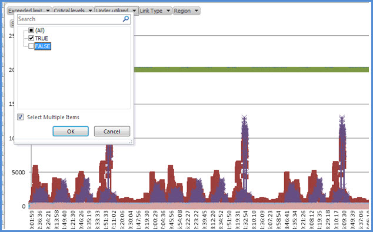
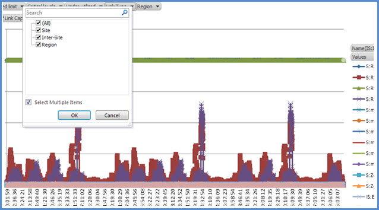

# <a name="skype-for-business-server-2015-resource-kit-tools-documentation"></a>商務用 Skype Server 2015 資源套件工具檔

本文說明商務用 Skype Server 2015 資源套件中的工具，包含每個工具的目的，以及其用途的範例。 商務用 Skype Server 2015 資源套件可協助 IT 系統管理員部署及管理商務用 Skype Server 2015，使日常工作變得更容易。 例如，網路會議 **資料** 工具可以用來輕鬆控制使用者在線上會議期間上傳的資料。 **SEFAUtil** 工具可以用來設定使用者的代理人來電轉接和應答。 我們鼓勵 IT 管理員使用這些工具更有效率地管理商務用 Skype Server 2015。

## <a name="installation-of-the-resource-kit-tools"></a>安裝資源工具組工具

若要安裝商務用 Skype Server 2015 資源套件，請從下載中心下載[OCSReskit.msi](https://www.microsoft.com/download/details.aspx?id=52631) 。

執行 **OCSResKit.msi** 以執行簡單安裝。 .msi 會安裝下列路徑中的所有工具： **% Program Files% \ 商務用 Skype Server 2015 \ ResKit**。 屬於自包含可執行檔的工具位於此資料夾中。 也有支援檔案的工具位於自己的子資料夾中。

## <a name="supported-environments"></a>支援的環境

商務用 Skype Server 2015 資源套件應該安裝在符合商務用 Skype Server 2015 所需規格的伺服器上，通常是用來執行商務用 Skype Server 2015。

## <a name="resource-kit-tools-overview"></a>資源工具組工具概述

以下是商務用 Skype Server 2015 資源套件中所提供的工具清單。 下列各節涵蓋每個工具的描述（包括需求和範例用法）。

- [ABSConfig](resource-kit-tools.md#ABSConfig)

- [頻寬原則服務監視器](resource-kit-tools.md#bpsm)

- [頻寬流量分析程式](resource-kit-tools.md#bua)

- [呼叫 Call parkometer](resource-kit-tools.md#callpark)

- [Dbanalyze.exe](resource-kit-tools.md#dba)

- [匯入儲存體服務資料](resource-kit-tools.md#Issd)

- [LCSSync](resource-kit-tools.md#LCSSync)

- [查閱使用者主控台](resource-kit-tools.md#LUC)

- [MsTurnPing](resource-kit-tools.md#MsTurnPing)

- [網路設定檢視器](resource-kit-tools.md#NCV)

- [回應群組代理程式 Live](resource-kit-tools.md#RGAL)

- [SEFAUtil](resource-kit-tools.md#SEFAUtil)

- [SYSPrep.ps1](resource-kit-tools.md#SYSPrep)

- [未指派號碼宣告遷移](resource-kit-tools.md#UNAM)

- [網路會議資料](resource-kit-tools.md#WebConfData)

## <a name="absconfig"></a>ABSConfig
<a name="ABSConfig"> </a>

通訊錄服務設定工具 (ABSConfig) 是一種系統管理工具，可協助系統管理員自訂商務用 Skype Server 2015 中的通訊錄服務設定。 此工具也可讓商務用 Skype Server 2015 系統管理員還原預設通訊錄服務設定。

### <a name="description"></a>描述

ABSConfig 是一種圖形使用者介面應用程式，可讓系統管理員設定與通訊錄服務相關的 Active Directory 網域服務屬性。

工具的主要案例如下：

- 讓系統管理員能夠將 Active Directory 網域服務中的屬性對應至商務用 Skype Server 2015 的屬性。

- 讓系統管理員指定要在通訊錄服務檔案中包含或排除的 Active Directory 網域服務屬性。

- 若要讓系統管理員能夠還原，請預設的通訊錄服務設定。

您可以使用 ABSConfig.exe 檔啟動 ABSConfig 工具。 工具隨即開啟至 [**設定屬性**] 索引標籤。此表格中的選項可將 Active Directory 網域服務屬性對應至商務用 Skype Server 2015 的屬性欄位，並指定哪些使用者在通訊錄服務檔案中包含或排除根據特定的屬性篩選器。 也可以選擇自訂要包含在通訊錄檔案中的電話號碼值。 [ **還原預設** 值] 選項可讓系統管理員將通訊錄服務設定還原為預設值。

> [!NOTE]
> 將 AD 屬性重新對應至不同的 OC 功能變數名稱只會在通訊錄檔案下載時運作，且不受通訊錄 Web 查詢的支援。

### <a name="output"></a>輸出

ABSConfig 會將通訊錄服務設定儲存在資料庫中。

```console
Path: %ProgramFiles%\Skype for Business Server 2015\Reskit
```

### <a name="purpose"></a>用途

ABSConfig 提供一種快速快捷的方式，可自訂商務用 Skype Server 2015 通訊錄服務。

### <a name="requirements"></a>需求

#### <a name="computer"></a>電腦

ABSConfig 只能從已安裝商務用 Skype Server 2015 的已加入網域的電腦執行。 在商務用 Skype Server 2015 的情況下 Enterprise Edition，此工具可以在安裝期間啟用通訊錄服務的任何 Front-End 伺服器上執行。

#### <a name="network"></a>網路

電腦應該可以連接至 Front-End 集區和後端資料庫。

#### <a name="software"></a>軟體

在執行 ABSConfig 工具之前，必須先安裝下列軟體元件：

- 商務用 Skype Server 2015

#### <a name="users"></a>使用者

具備更新商務用 Skype Server 2015 部署所需之許可權的系統管理員。

### <a name="examples"></a>範例

您可以在命令提示字元處輸入 **ABSConfig.exe** ，以啟動 ABSConfig。 如下所示為 ABSConfig 工具使用者介面。


### <a name="summary"></a>摘要

ABSConfig 工具可讓系統管理員快速快捷地使用工具，以自訂商務用 Skype Server 2015 通訊錄服務。

## <a name="bandwidth-policy-service-monitor"></a>頻寬原則服務監視器
<a name="bpsm"> </a>

「頻寬原則服務監視」工具的目的是讓系統管理員可以查看下列專案的清單：

1. 拓撲中所有設定的商務用 Skype Server 2015 頻寬原則服務 (驗證與核心) 

2. 每個服務對其他頻寬原則服務和 Edge server 所進行的連接

3. 網路設定檔中所設定的所有連結，以及每個頻寬原則服務所報告的即時頻寬使用量

### <a name="description"></a>描述

頻寬原則服務監視工具是以 GUI 型應用程式的形式來執行。 管理員會透過執行 PDPMonUI.exe 來啟動工具。

當工具開始時，它會嘗試探索拓撲中的頻寬原則服務清單。 完成初始更新後，視窗左側的窗格會以所隸屬的群組為群組的服務清單填入。

當管理員選擇特定頻寬原則服務時，右側窗格會顯示該特定服務的相關資訊。 該窗格也有兩個主要索引標籤可顯示資訊。

#### <a name="machine-info-tab"></a>電腦資訊] 索引標籤

[ **機器資訊** ] 索引標籤會顯示所選頻寬原則服務的詳細資料，以及選取的頻寬原則服務對其他服務所做的所有連線清單和狀態。

#### <a name="topology-info-tab"></a>拓撲資訊] 索引標籤

**拓撲資訊** 索引標籤顯示網路設定中所設定之所有連結的清單。 針對每個連結，會顯示音訊和影片頻寬容量。 此外，目前使用的頻寬會顯示，以 Kbps 為單位的容量百分比顯示。 工具使用色彩編碼，強調具有接近容量之使用率的連結，這可讓系統管理員快速隔離這類連結。

> [!NOTE]
>  如果頻寬原則服務監視工具在連線至任何設定的頻寬原則服務時失敗，將不會填入 **機器資訊** 和 **拓撲資訊** 索引標籤中的資訊。 不過，此工具最初可能會連線，但後來會失去與服務的連線。 在這種情況下，系統管理員可能會看到過時的資訊。 每個索引標籤上都有最後一次 **更新** 的時間戳記，可讓系統管理員看到上次更新特定頻寬原則服務的資料的時間。

### <a name="output"></a>輸出

無命令列輸出;程式輸出包含在主要圖形使用者介面 (GUI) 中。

### <a name="purpose"></a>用途

「頻寬原則服務監視」工具的目的是讓系統管理員能看到拓撲中所定義的每個頻寬原則服務的狀態。 此外，系統管理員可以查看網路設定檔中所定義之所有連結的即時頻寬使用量。

### <a name="requirements"></a>需求

[！注意] 在屬於商務用 Skype Server 拓撲的電腦上，頻寬原則服務監視器工具必須執行。

### <a name="summary"></a>摘要

頻寬原則服務監視器工具對管理員來說可能是一項寶貴資源，讓他們能夠檢查拓撲中所有頻寬原則服務的狀態，更重要的是，他們可以取得網路設定設定中所定義之連結的即時頻寬使用量。

## <a name="bandwidth-utilization-analyzer"></a>頻寬流量分析程式
<a name="bua"> </a>

頻寬流量分析程式是一種工具，它會針對商業網路中 WAN 連結的 UC 端點，建立各種頻寬使用量的報告。 這些報告可用於瞭解目前的頻寬消耗模式，以及協助進行頻寬容量規劃。

### <a name="description"></a>描述

頻寬使用量分析器是以 GUI 型應用程式的形式來執行。 這個工具專為網路上的音訊使用量產生報告，並協助進行容量規劃。 它也會在指派給各種連結的頻寬容量上進行迴圈。

### <a name="output"></a>輸出

頻寬使用狀況分析器提供系統中所設定之所有 WAN 連結的頻寬容量及音訊使用方式的圖形圖形。

### <a name="purpose"></a>用途

在任何語音和影片部署中，監控和瞭解整個商業網路中媒體流量的頻寬利用率，都很重要。 頻寬使用狀況分析工具可讓系統管理員只取得這種方式。 此工具會執行下列作業：

- 針對整個網路產生音訊使用量的特定報告

- 協助在指派給各種連結的頻寬容量上進行更有效的容量規劃和反覆運算

頻寬流量分析程式可以產生頻寬容量和使用方式報告的圖形圖形它們如下：

- 商業網路中的所有 WAN 連結

- 依選取的 WAN 連結篩選

- 由超過連結容量的 WAN 連結篩選

- 使用已在使用中布建的頻寬來篩選的 WAN 連結

- 依 WAN 連結的頻寬使用量超過90% 的頻寬使用量，篩選已達到關鍵性層級的 WAN 連結 () 

- 依 WAN 連結類型篩選—網路網站連結、interregional 連結，以及網站內的連結

- 依網路地區篩選

#### <a name="applications"></a>應用程式

頻寬使用狀況分析器具有下列兩個應用程式 (工具) ：

- **WanLinkLogCollector.exe** 此工具可讓其使用者輸入必要的資訊。

- **BandwidthUtilizationAnalyzer。 xlsm** Microsoft Excel 試算表軟體報告會透過 WanLinkLogCollector.exe 自動啟動。 此應用程式可讓使用者將篩選器套用至報告（如本文稍後所示）。

#### <a name="phases-of-using-bandwidth-utilization-analyzer"></a>使用頻寬流量分析程式的階段

使用頻寬使用量分析器時，有兩個階段：

- 收集使用 WanLinkLogCollector.exe 執行的記錄

- 自訂報表，使用 BandwidthUtilizationAnalyzer 執行。 xlsm

    > [!IMPORTANT]
    > 我們強烈建議您 BandwidthUtilizationAnalyzer。 xlsm 不是由使用者手動啟動。

#### <a name="starting-bandwidth-utilization-analyzer"></a>啟動頻寬流量分析程式

在命令提示字元處或使用 Windows Explorer 開始 WanLinkLogCollector.exe。

 **使用 WanLinkLogCollector.exe**

使用 WanLinkLogCollector.exe 有三個步驟：

1. **記錄時程表** 提供報表需要產生的時程表

2. **指定檔目錄** 提供檔案位置資訊

3. **收集記錄檔並啟動報告檢視器** 執行命令以產生報告

#### <a name="step-1---log-the-timeline"></a>步驟 1-記錄時程表

記錄時程表可讓工具使用者指定下列，如下圖所示。

1. **開始日期** 這是要產生報告的時程表開始日期;例如，2010年8月1日。

2. **結束日期** 這是要產生報告的時程表結束日期;例如，2010年9月30日。

     

#### <a name="step-2---specify-the-file-directories"></a>步驟 2-指定檔目錄

下列是使用者可以指定的檔案目錄，如圖所示。

- **伺服器記錄檔位置** 儲存頻寬原則伺服器記錄的資料夾位置。 這通常是 \<fileserver\> \\<選擇的 FE \> \AppServerFiles\PDP。

- **暫存檔儲存位置** 產生報告時儲存中間檔案的暫存檔案位置。

    

    > [!NOTE]
    > 確定已將對伺服器記錄和暫存檔存放區資料夾的足夠存取權提供給工具使用者。

#### <a name="step-3---collect-the-logs-and-start-the-report-viewer"></a>步驟 3-收集記錄檔並啟動報告檢視器

若要收集記錄檔並啟動報告檢視器，請按一下 [ **執行** ]，如下所示。 此步驟會收集必要的資料。

![在 [頻寬利用率 Analy] 中收集資料。](../media/Reskit_2012_Tools_Documentation_Image6.jpg)

當輸入驗證成功時，會顯示如下所示的訊息。


按一下 [確定]。 BandwidthUtilizationAnalyzer。 xlsm 會自動啟動。 依照訊息方塊中的指示進行。 如需詳細資訊，請參閱下一節中的 **Using BandwidthUtilizationAnalyzer xlsm** 。


### <a name="using-bandwidthutilizationanalyzerxlsm"></a>使用 BandwidthUtilizationAnalyzer xlsm

1. 當 xlsm 自動啟動 BandwidthUtilizationAnalyzer 時，請按一下 [重新整理 **]，如下** 所示。

     

2. 開啟檔案資料夾時，請選取訊息方塊中所指定的位置 consolidated.csv，如下所示。 它也會顯示為 **C：\Temp** 的位置。

     

3. 按一下 **[匯入]**。

4. 會自動產生圖形化圖形。 當工作的背景指標消失時，即可使用此功能。

     

#### <a name="applying-filters-to-the-report-view"></a>將篩選器套用至報表檢視

如下所示，可套用到報表檢視的篩選，如下所述：


1. **名稱** 依 WAN 連結篩選 (篩選位於圖形) 右側。 前置詞表示下列連結類型;請參閱垂直 (blue) 方塊：

   - **S 網站** 從網路網站到網路地區的 WAN 連結

   - **為網站間** 兩個網路網站間的 WAN 連結

   - **R 區域間** 兩個網路地區之間的 WAN 連結

2. **超出限制** 依頻寬使用量超過頻寬容量的 WAN 連結篩選

3. **重要層級** 依頻寬利用率達到90% 或以上頻寬容量的 WAN 連結篩選

4. **低利用率** 依頻寬利用率低於頻寬容量25% 的 WAN 連結篩選

5. **連結類型** 依下列 WAN 連結類型進行篩選：

   - **網路網站** 類型

   - **網站間** 類型

   - **地區間連結** 類型

6. **地區** 依網路地區篩選

下圖顯示先前所述的篩選。

依 **名稱** 篩選。 選取需要顯示在圖表中的連結清單。


篩選依據 **超出限制**。 選取 [ **True** ] 以強制執行篩選。


依 **重要層級** 篩選。 選取 [ **True** ] 以強制執行篩選。


根據 **使用** 中的篩選。 選取 [ **True** ] 以強制執行篩選。



依 **連結類型** 篩選。 選取需要顯示的類型或類型。



依 **地區** 篩選。 選取需要顯示其連結的區域清單。


### <a name="requirements"></a>需求

- .NET Framework 3。5

- Microsoft Excel 2010 或 Excel 2007

### <a name="summary"></a>摘要

頻寬流量分析程式可用來繪製網路上 UC 流量的音訊頻寬使用量。 您也可以使用此工具來報告網路上的視頻頻寬使用方式。

## <a name="call-parkometer"></a>呼叫 Call parkometer
<a name="callpark"> </a>

「呼叫 Call parkometer」是一種命令列應用程式，可讓您輕鬆存取通話駐留軌道資料庫。

### <a name="description"></a>描述

「呼叫 Call parkometer 是一種可追蹤目前寄存通話的工具。 它也會收集有關軌道和通話駐留伺服器 (CPS) 使用狀況的統計資料。 這個命令列工具既可以從本機或遠端連線的電腦，為 CPS 軌道 SQL Server 資料庫提供讀取和寫入權存取權。

所有選項都是互斥的。 命令列語法如下：

- **-o** 參數--列出為此集區設定的所有軌道範圍。

- **-n** 參數-列出此集區中所有目前使用的軌道。 顯示的資訊如下：

  - SIP 統一資源識別項 (parkee 和 parker 的 URI) 。

  - 寄存通話之 CPS 的主機名稱。

  - 寄存通話的時間戳記。

- **-f** 參數--列出集區中目前可用的軌道的數目。

- **-r \<n\>** 參數-列出 \<n\> 最後一個寄存的呼叫。 顯示的資訊如下：

  - Parkee SIP URI。

  - Parker SIP URI。

  - 寄存通話之 CPS 的主機名稱。

  - 檢索或丟棄通話的時間戳記。

- **-t \<n\>** 參數-測試在資料庫中保留軌道，以顯示指定之軌道編號的隨機性。

### <a name="output"></a>輸出

根據在命令提示字元中指定的輸入參數，「呼叫 Call parkometer」會顯示下列輸出：

- 為此集區設定的所有軌道範圍

- 目前寄存通話

- ) 軌道中可用的可用 (數目

- 最近寄存的通話

- 用於測試均勻及隨機軌道值的保留軌道

### <a name="purpose"></a>用途

CPS 工具的目的是提供 CPS 資料庫的命令列存取權。 管理員可以查看 CPS 使用狀況，並決定指派至集區的軌道數目。

### <a name="requirements"></a>需求

如果此工具在執行 CPS 的同一部電腦上執行，則不會有任何需求。 若在遠端電腦上執行此工具，則商務用 Skype Server 2015 所用的 SQL Server 資料庫必須設定為允許遠端存取。 必須使用 SQL Server 資料庫連接字串來設定 Call call parkometer，以連接到集區的 SQL Server。 此 SQL Server 資料庫連接字串是在設定檔中定義 **parkometer.exe.config**。它必須放在 parkometer.exe 所在的相同目錄中。 下列 XML 檔案是 parkometer.exe.config 的範例。必須設定的參數為 [使用者名稱] (例如，mydomain\Administrator) 、密碼 (例如，mypassword) 及主機名稱 (例如，myserver) 。

```xml
<?xml version="1.0" encoding="utf-8" ?>
<configuration>
  <appSettings>
   <add key="SQL" value="server=myserver\RTC;
database=cpsdyn;
User Id=mydomain\Administrator;
Password=mypassword.;
Integrated Security=false;"/>
  </appSettings>
</configuration>
```

### <a name="examples"></a>範例

已部署軌道範圍：-o 參數會列出為此集區設定的所有軌道範圍（如圖所示）。


目前寄存通話：-n 參數會列出此集區上所有目前使用的軌道（如圖所示）。


[自由] 軌道的數目：-f 參數會列出集區中目前可用的軌道式的數目（如圖所示）。


最近寄存的通話：-r \<n\> 參數會列出 \<n\> 最後一個寄存的呼叫，如圖所示。


測試軌道保留：-t \<n\> 參數會測試在資料庫中保留軌道（如圖所示）。

![在 [呼叫 Call parkometer] 中測試軌道保留。](../media/Reskit_2012_Tools_Documentation_Image22.jpg)

### <a name="summary"></a>摘要

「呼叫 Call parkometer」是一種命令列工具，提供通話駐留伺服器的詳細資訊。

## <a name="dbanalyze"></a>Dbanalyze.exe
<a name="dba"> </a>

### <a name="description"></a>描述

dbanalyze.exe 是一種命令列工具，可協助系統管理員收集有關商務用 Skype Server 2015 資料庫的分析報告。 Dbanalyze.exe 具有下列模式：診斷、使用者資料、會議、MCUs 和磁片分段：

- **診斷模式** 會建立一份報告，其中包含資料表的相關資訊 (記錄、分散、資料大小及索引大小) 、資料和記錄檔大小、最後的備份時間、在執行 Microsoft Office 通訊伺服器的伺服器之間的連絡人散佈、每一位使用者的許可權、連絡人、容器、訂閱、發佈、每位使用者的端點、任何不正確的使用者、無法路由的使用者、 每位使用者、排程會議、使用中會議及資料庫版本所組織的平均會議數目。

    > [!NOTE]
    > 執行診斷模式可能會影響伺服器效能。

- **使用者資料模式** 針對指定的使用者或使用者在其連絡人及許可權清單中的使用者，報告連絡人、容器、訂閱、發佈、許可權及連絡人群組資料。 這種模式也會報告使用者組織或受到邀之會議的摘要資料。

- **會議模式** 報告特定會議的詳細資料，包括會議、被邀請者清單、會議所允許的媒體類型清單、active MCUs (multipoint 控制項單位) 、作用中的參與者清單，以及每個參與者的信號狀態。

- **解碼會議識別碼** 會解碼 **/pstnid** 參數所指定的公用交換電話網路 (PSTN) 會議識別碼，但不會連線至後端以取得詳細資訊。

- **解決會議** 會解碼 **/pstnid** 參數所指定的 PSTN 會議 ID，並顯示識別碼所指定之會議的相關資訊。

- **MCUs 模式** 針對集區中的每個 MCU 報告識別碼、媒體類型、URL、心跳狀態、會議載入和參與者負載。

- **磁片分段模式** 顯示所有磁片的分段狀態。

此工具可用於診斷各種問題，或協助系統管理員進行容量規劃。 例如，如果在伺服器 A 上大多數的使用者都選擇以伺服器 B 為其連絡人的使用者，則系統管理員可以將伺服器 A 上的使用者移至伺服器 B，以減少跨伺服器的流量。

### <a name="output"></a>輸出

此工具會輸出商務用 Skype Server 2015 資料庫的預先定義報告。 **路徑**：%ProgramFiles% \ 商務用 Skype Server 2015 \ Reskit

### <a name="purpose"></a>用途

若要安裝 Dbanalyze.exe，請將它複製到本機資料夾，然後執行工具。 若要使用此工具，請從命令列執行下列命令。 `dbanalyze.exe [/v] [/report:value] [/sqlserver:value] [/user:user@domain.com] [/conf:value][/pstnid:Value] [/maxcontacts:value]` 命令列選項的描述如下所示。


### <a name="requirements"></a>需求

 **電腦** dbanalyze.exe 只能從已安裝商務用 Skype Server 2015 的已加入網域的電腦執行。

 **網路** 電腦應該可以連接至後端資料庫。

 在執行 dbanalyze.exe 之前，必須先安裝 **軟體** 商務用 Skype Server 2015 軟體元件。

 **使用者** 下表顯示具有存取商務用 Skype Server 2015 資料庫之必要許可權的系統管理員。


> [!NOTE]
> **/Report：磁片** 模式需要本機系統管理員帳戶。

### <a name="examples"></a>範例

以下是有效 Dbanalyze.exe 命令的範例：

```console
dbanalyze.exe /report:diag
dbanalyze.exe /report:user /user:usera@domainb.com
dbanalyze.exe /report:conf /user:bob@example.com /conf:1W9J71SKSX2X
dbanalyze.exe /report:resolve /pstnid:12345
dbanalyze.exe /report:mcus
dbanalyze.exe /report:disk
```

### <a name="summary"></a>摘要

DBAnalyzer 可讓系統管理員快速且容易地分析商務用 Skype Server 2015 資料庫。

## <a name="import-storage-service-data"></a>匯入儲存體服務資料
<a name="Issd"> </a>

ImportStorageServiceData 資源工具組工具允許從儲存體服務中清除的重新佇列和端點資料， (LYSS) 回儲存體服務。

### <a name="description"></a>描述

儲存體服務所清除的資料，可能會根據佇列專案狀態或資料庫大小，定期 (定期) 。 這可能是因為手動呼叫集區容錯移轉指令 StorageServiceFullFlush，或是集區容錯移轉指令) 所呼叫的 Cmdlet (。 請注意，如果前端上的任何儲存體服務 (LYSS ) 的資料庫大小高於一般層級以上，則理想情況下不會 reimported 資料，因為這樣做可能只會導致傳回更多資料。此外，針對導致儲存體服務佇列增加的錯誤，必須先解決的任何問題，都應該先加以解決 (例如 Exchange 端點錯誤、網路問題或其他問題) 。

 **案例1：** 集區容錯移轉期間，每個前端的檔案可能會從儲存體服務上清除。 容錯移轉完成後，應執行工具以重新導入資料。

 **案例2：** 每日自動清除資料，或回應儲存體的服務資料庫超過特定大小的閾值 (例如60%、80%、90% full) 。 這個自動清除的資料應該是由系統管理員定期 reimported。 在上述情況下，如果未部署監控 SCOM 套件，則會有商務用 Skype Server 與從儲存體服務清除的資料相關的儲存體服務的事件。 已啟動 32075 (完整清除作業的事件 IDs) ，32076 (完全清除已完成) ，32082 (維護層級清理已開始) ，32083 (維護層級清理完成) ，32089 (因填滿資料庫) 而發生清理。 請注意，這些事件識別碼會對應至 RTM 版本。 當系統管理員看到這些事件時，表示已清除的檔案。此資料應該定期使用此工具（例如每週一次）匯入回來。

在線上服務發行時，如果部署了商務用 Skype Server 的 health monitoring SCOM 套件，則可能會引發新的警示，讓系統管理員將清除的資料重新引入儲存體服務。 在觸發警示的 Front-End 伺服器上，事件記錄中會有對應的事件。 此事件會提供清除資料檔案所在之父路徑的描述，以及有多少個可滿足警示準則的檔。 警示準則是指在特定父路徑下的 X 個或多個檔案，該父路徑至少為 Y (天的 StorageService，但可以透過變更 APPCONFIG 檔來覆寫。 ) 下列兩個可能觸發狀況警示的事件範例如下所示： 其父項路徑的差異。 有一種可能的情況是在 Web 服務檔案共用下，另一種可能性是每個前端的本機應用程式資料目錄。  (例如 c:\ProgramData\Microsoft\ 商務用 Skype Server 2015 \ StorageService) 。 然後，系統管理員會執行此 reskit 工具。

此工具會在其執行的前端上增加 CPU 和 IO 負載，而在其他前端，也就是資料不是由執行該工具的前端所擁有的情況。 建議您在前端未低於大量 CPU 和 IO 負載時執行此工具，例如峰值時段外。 其次，此工具可以2到3分鐘，匯入一個資料檔案。 在評估工具的執行時間時，請務必記住這一點。 預設會在檔存放區上顯示工具所產生的詳細記錄檔。 如果沒有報告錯誤，請將其刪除，因為記錄檔可能會是數十 MB 或更多。


### <a name="requirements"></a>需求

安裝2015資源套件工具商務用 Skype Server。 工具會在已加入網域的電腦上執行，並安裝商務用 Skype Server 和商務用 Skype Server 管理命令介面。 該工具會使用來自管理命令介面的 Cmdlet，識別集區中的所有 Front-End 伺服器。 其次，必須從已安裝 **RtcLocal** 資料庫的集區中的機器執行工具。 此資料庫由工具使用，以取得集區的 WEBSERVICE 檔案共用的位置。 此外，在使用此工具之前，每個 Front-End 伺服器都必須先在每個 Front-End 伺服器上使用 **Enable-PSRemoting** 來啟用 Windows PowerShell 遠端，以及執行該工具的機器。 否則，來自此工具的遠端 Windows PowerShell 命令將會失敗。 Windows PowerShell完成後，集區中的所有 Front-End 伺服器都可以關閉遠端處理。 最後，開啟工具的帳戶或憑證必須具有可讀取/寫入權限給其在其上執行此工具的集區。 否則，該工具會失敗，並顯示 IO 許可權錯誤。

> [!NOTE]
> 在 Windows Server 2012 上，Windows PowerShell 遠端處理會預設為啟用，但不會在 Windows Server 2008 作業系統上啟用。

### <a name="examples"></a>範例

```console
>  C:\StorageService>ImportStorageServiceData.exe
Description:
This tool will re-import Storage Service (LYSS) flushed queue data back in.  For a pool: you are required to run this tool on a machine inside the pool which has the Lync Server Management Shell installed.  Additionally, all front end machines need to have Windows Powershell Remoting enabled before executing this tool by executing Enable-PSRemoting.  Also, please ensure that all Storage Service instance DB Size are at the 'Normal' level (verify this by viewing Eventlog events). Otherwise re-importing may cause data to be flushed out again if any Storage Service instance DB size level goes above 'Normal'.
Usage: Default behavior is to Import data from web service file share as well as any files on all Front End machines in pool.
Additional Options:
-Verbose                    : Turn verbose output on.

-StorageServiceHostName     : Host Name of Storage Service WCF endpoint.  ( Default=localhost netnamedpipe binding. )

-FileSharePath              : Import only all data from just under the UNC path specified.

ActivityID: cc3b62ff-bb66-4e61-a6e2-96cb3626315c. <-- Use this to correlate with StorageService trace logs if troubleshooting.
Type Server name (TCP binding) or press <enter> for localhost (NamePipe binding):
Using NetNamedPipeBinding...
OnTopologyChanged Event received
Web Service File Share: \\dc.vdomain.com\OcsFileStore\co1-WebServices-1\StorageService

Front Ends:
server.vdomain.com
server2.vdomain.com
server1.vdomain.com
server3.vdomain.com
Looking under directory: \\dc.vdomain.com\OcsFileStore\co1-WebServices-1\StorageService for exported data.
# Files found: 8
Starting Import for file:\\dc.vdomain.com\OcsFileStore\co1-WebServices-1\StorageService\DataExport\2
0120910\SERVER.vdomain.com\944f5724c65c5f93900dc1c8c898b102__0.xml
Items deserialized: 20

All items in file were enqueued successfully, will try to delete file: \\dc.vdomain.com\OcsFileStore\co1-WebServices-1\StorageService\DataExport\20120910\SERVER.vdomain.com\944f5724c65c5f93900dc1c8c898b102__0.xml

All items in file failed to enqueue so file will not be deleted.  File path: \\dc.vdomain.com\OcsFileStore\co1-WebServices-1\StorageService\DataExport\20120910\SERVER.vdomain.com\944f5724c65c5f93900dc1c8c898b102__0.xml

Summary for file \\dc.vdomain.com\OcsFileStore\co1-WebServices-1\StorageService\DataExport\20120910\SERVER.vdomain.com\944f5724c65c5f93900dc1c8c898b102__0.xml: succeeded: 20, failed: 0

Starting Import for file:\\dc.vdomain.com\OcsFileStore\co1-WebServices-1\StorageService\DataExport\20120910\SERVER1.vdomain.com\17d5435ae40259f7bbdf1866776386e4__0.xml
Items deserialized: 20

[cc3b62ff-bb66-4e61-a6e2-96cb3626315c] Send EnqueueMessages to redirected, targetServer=server1.vdomain.com, queueItems=20

All items in file were enqueued successfully, will try to delete file: \\dc.vdomain.com\OcsFileStore\co1-WebServices-1\StorageService\DataExport\20120910\SERVER1.vdomain.com\17d5435ae40259f7bbdf1866776386e4__0.xml

All items in file failed to enqueue so file will not be deleted.  File path: \\dc.vdomain.com\OcsFileStore\co1-WebServices-1\StorageService\DataExport\20120910\SERVER1.vdomain.com\17d5435ae40259f7bbdf1866776386e4__0.xml

Summary for file \\dc.vdomain.com\OcsFileStore\co1-WebServices-1\StorageService\DataExport\20120910\
SERVER1.vdomain.com\17d5435ae40259f7bbdf1866776386e4__0.xml: succeeded: 20, failed: 0

Starting Import for file:\\dc.vdomain.com\OcsFileStore\co1-WebServices-1\StorageService\DataExport\20120910\SERVER1.vdomain.com\904f6c9b8ac951ae8b3c86684d3832e4__0.xml

Items deserialized: 20
[cc3b62ff-bb66-4e61-a6e2-96cb3626315c] Send EnqueueMessages to redirected, targetServer=server1.vdomain.com, queueItems=20

All items in file were enqueued successfully, will try to delete file: \\dc.vdomain.com\OcsFileStore
\co1-WebServices-1\StorageService\DataExport\20120910\SERVER1.vdomain.com\904f6c9b8ac951ae8b3c86684d
3832e4__0.xml

All items in file failed to enqueue so file will not be deleted.  File path: \\dc.vdomain.com\OcsFil
eStore\co1-WebServices-1\StorageService\DataExport\20120910\SERVER1.vdomain.com\904f6c9b8ac951ae8b3c
86684d3832e4__0.xml

Summary for file \\dc.vdomain.com\OcsFileStore\co1-WebServices-1\StorageService\DataExport\20120910\
SERVER1.vdomain.com\904f6c9b8ac951ae8b3c86684d3832e4__0.xml: succeeded: 20, failed: 0

Starting Import for file:\\dc.vdomain.com\OcsFileStore\co1-WebServices-1\StorageService\DataExport\2
0120910\SERVER2.vdomain.com\69844a271e6c5633a1f2b46a42287dd6__0.xml

Items deserialized: 20

[cc3b62ff-bb66-4e61-a6e2-96cb3626315c] Send EnqueueMessages to redirected, targetServer=server2.vdom
ain.com, queueItems=20

All items in file were enqueued successfully, will try to delete file: \\dc.vdomain.com\OcsFileStore
\co1-WebServices-1\StorageService\DataExport\20120910\SERVER2.vdomain.com\69844a271e6c5633a1f2b46a42
287dd6__0.xml

All items in file failed to enqueue so file will not be deleted.  File path: \\dc.vdomain.com\OcsFil
eStore\co1-WebServices-1\StorageService\DataExport\20120910\SERVER2.vdomain.com\69844a271e6c5633a1f2
b46a42287dd6__0.xml

Summary for file \\dc.vdomain.com\OcsFileStore\co1-WebServices-1\StorageService\DataExport\20120910\
SERVER2.vdomain.com\69844a271e6c5633a1f2b46a42287dd6__0.xml: succeeded: 20, failed: 0

Starting Import for file:\\dc.vdomain.com\OcsFileStore\co1-WebServices-1\StorageService\DataExport\2
0120910\SERVER3.vdomain.com\3313935458e35b9b9759e08a15d251e6__0.xml

Items deserialized: 20

[cc3b62ff-bb66-4e61-a6e2-96cb3626315c] Send EnqueueMessages to redirected, targetServer=server3.vdom
ain.com, queueItems=1

All items in file were enqueued successfully, will try to delete file: \\dc.vdomain.com\OcsFileStore
\co1-WebServices-1\StorageService\DataExport\20120910\SERVER3.vdomain.com\3313935458e35b9b9759e08a15
d251e6__0.xml

All items in file failed to enqueue so file will not be deleted.  File path: \\dc.vdomain.com\OcsFil
eStore\co1-WebServices-1\StorageService\DataExport\20120910\SERVER3.vdomain.com\3313935458e35b9b9759
e08a15d251e6__0.xml

Summary for file \\dc.vdomain.com\OcsFileStore\co1-WebServices-1\StorageService\DataExport\20120910\
SERVER3.vdomain.com\3313935458e35b9b9759e08a15d251e6__0.xml: succeeded: 20, failed: 0

Starting Import for file:\\dc.vdomain.com\OcsFileStore\co1-WebServices-1\StorageService\DataExport\2
0120910\SERVER3.vdomain.com\4501e04eae4856059346949ff817c220__0.xml
Items deserialized: 20
[cc3b62ff-bb66-4e61-a6e2-96cb3626315c] Send EnqueueMessages to redirected, targetServer=server3.vdom
ain.com, queueItems=1
All items in file were enqueued successfully, will try to delete file: \\dc.vdomain.com\OcsFileStore
\co1-WebServices-1\StorageService\DataExport\20120910\SERVER3.vdomain.com\4501e04eae4856059346949ff8
17c220__0.xml
All items in file failed to enqueue so file will not be deleted.  File path: \\dc.vdomain.com\OcsFil
eStore\co1-WebServices-1\StorageService\DataExport\20120910\SERVER3.vdomain.com\4501e04eae4856059346
949ff817c220__0.xml

Summary for file \\dc.vdomain.com\OcsFileStore\co1-WebServices-1\StorageService\DataExport\20120910\
SERVER3.vdomain.com\4501e04eae4856059346949ff817c220__0.xml: succeeded: 20, failed: 0
Starting Import for file:\\dc.vdomain.com\OcsFileStore\co1-WebServices-1\StorageService\DataExport\2
0120910\SERVER3.vdomain.com\5ad77443ad955a22a876749be66d5317__0.xml

Items deserialized: 20
[cc3b62ff-bb66-4e61-a6e2-96cb3626315c] Send EnqueueMessages to redirected, targetServer=server3.vdom
ain.com, queueItems=20
All items in file were enqueued successfully, will try to delete file: \\dc.vdomain.com\OcsFileStore
\co1-WebServices-1\StorageService\DataExport\20120910\SERVER3.vdomain.com\5ad77443ad955a22a876749be6
6d5317__0.xml
All items in file failed to enqueue so file will not be deleted.  File path: \\dc.vdomain.com\OcsFil
eStore\co1-WebServices-1\StorageService\DataExport\20120910\SERVER3.vdomain.com\5ad77443ad955a22a876
749be66d5317__0.xml
Summary for file \\dc.vdomain.com\OcsFileStore\co1-WebServices-1\StorageService\DataExport\20120910\
SERVER3.vdomain.com\5ad77443ad955a22a876749be66d5317__0.xml: succeeded: 20, failed: 0
Starting Import for file:\\dc.vdomain.com\OcsFileStore\co1-WebServices-1\StorageService\DataExport\2
0120910\SERVER3.vdomain.com\a11e27ae439a582288d4657eda86b565__0.xml
Items deserialized: 20
[cc3b62ff-bb66-4e61-a6e2-96cb3626315c] Send EnqueueMessages to redirected, targetServer=server3.vdom
ain.com, queueItems=20
All items in file were enqueued successfully, will try to delete file: \\dc.vdomain.com\OcsFileStore
\co1-WebServices-1\StorageService\DataExport\20120910\SERVER3.vdomain.com\a11e27ae439a582288d4657eda
86b565__0.xml
All items in file failed to enqueue so file will not be deleted.  File path: \\dc.vdomain.com\OcsFil
eStore\co1-WebServices-1\StorageService\DataExport\20120910\SERVER3.vdomain.com\a11e27ae439a582288d4
657eda86b565__0.xml
Summary for file \\dc.vdomain.com\OcsFileStore\co1-WebServices-1\StorageService\DataExport\20120910\
SERVER3.vdomain.com\a11e27ae439a582288d4657eda86b565__0.xml: succeeded: 20, failed: 0
All files have been imported into Storage Service for path: \\dc.vdomain.com\OcsFileStore\co1-WebSer
vices-1\StorageService
Importing files for: server.vdomain.com
No files founds.
Importing files for: server2.vdomain.com
No files founds.
Importing files for: server1.vdomain.com
No files founds.
Importing files for: server3.vdomain.com
No files founds.
Writing log: \\dc.vdomain.com\OcsFileStore\co1-WebServices-1\StorageService\ImportStorageServiceData
Log20120910_1609SS
Tool has finished execution.
>  C:\StorageService>
```

## <a name="lcssync"></a>LCSSync
<a name="LCSSync"> </a>

LCSSync 工具可協助您在多樹系環境中部署商務用 Skype Server 2015 通訊軟體。 此工具是用來將不同使用者樹系中的使用者和群組，當作 Active Directory 網域服務連絡人物件，同步處理商務用 Skype Server 2015 安裝所在的中央樹系。

### <a name="description"></a>描述

 LCSSync 使用中央樹系中的 [同步處理 Active Directory 網域服務] 連絡人物件，讓使用者能夠商務用 Skype Server。 若要提供單一登入，主要使用者帳戶必須對應至中央樹系中的 Active Directory 網域服務連絡人物件，以供商務用 Skype Server 2015。 這個工具可協助您執行該對應。 此工具提供範本，以在 Microsoft Identity Integration Server 中建立管理代理程式。

### <a name="summary"></a>摘要

LCSSync 工具可協助您在多樹系環境中部署商務用 Skype Server 2015。

## <a name="lookup-user-console"></a>查閱使用者主控台
<a name="LUC"> </a>

LookupUserConsole 工具會顯示特定使用者的內部商務用 Skype Server 路由資訊。 此資訊對 Microsoft 支援個人在診斷部署和路由問題時可能十分有用。

### <a name="description"></a>描述

 執行 LookupUserConsole.exe 會開啟接收 SIP 位址的命令提示字元，並嘗試顯示與其相關的內部商務用 Skype Server 路由資訊。 若要結束 LookupUserConsole 工具，請輸入 **exit** 。

### <a name="requirements"></a>需求

安裝商務用 Skype Server 2015 資源套件。 工具會在安裝商務用 Skype Server 的已加入網域的電腦上執行。

### <a name="examples"></a>範例

C:\Program Files \ 商務用 Skype Server 2015 \ ResKit \>LookupUserConsole.exe

```console
> sip:john.doe@vdomain.com

  Execution time (ms):                            171.094
  Exeuction result:                               Success
  SIP URI:                                        sip:john.doe@vdomain.com
  User info:
    SID:                                          S-1-5-21-2831376166-29632525...    Display name:                                     John Doe
    Grouping ID:                                  00000000-0000-0000-0000-...
    Line URI:                                     <null>
    Policy assignment:                            TenantId={00000000--0000-000....
    SIP enabled:                                  True
    UC enabled:                                   False
    Tenant ID:                                    00000000-0000-0000-0000-...  Cluster info:
    Active cluster:                               pool0.vdomain.com
    Backup registrar cluster:                     <null>
    Deployment location:                          <null>
    Home Front-End FQDN:                          SERVER.vdomain.com
    Primary Registrar cluster:                    pool0.vdomain.com
    Remote Director external SIP FQDN:            <null>
    Remote Director internal SIP FQDN:            <null>
    Remote Director Web FQDN:                     <null>
    Routing group ID:                             4501e04e-ae48-5605-9346...
    Service tag ID:                               1266953005
    User Front-End resolved:                      True
    User in local forest:                         True
    User in remote forest:                        False
    User in split domain:                         False
    User-Services cluster:                        pool0.vdomain.com

> sip:nouser@vdomain.com

  Execution time (ms):                            948.7574
  Exeuction result:                               UserDoesNotExist

> exit
```

## <a name="msturnping"></a>MsTurnPing
<a name="MsTurnPing"> </a>

MSTurnPing 工具可讓商務用 Skype Server 2015 通訊軟體的系統管理員檢查執行 Audio/Video Edge 的伺服器狀態、Audio/Video 驗證服務，以及拓撲中執行頻寬原則服務的伺服器。

### <a name="description"></a>描述

MSTurnPing 工具可讓商務用 Skype Server 2015 通訊軟體的系統管理員檢查執行 Audio/Video Edge 的伺服器狀態、Audio/Video 驗證服務，以及拓撲中執行頻寬原則服務的伺服器。

工具可讓系統管理員執行下列測試：

1. A/V Edge Server 測試：此工具會執行下列作業，針對拓撲中的所有 A/V Edge server 執行測試：

   - 確認商務用 Skype Server Audio/Video 驗證服務已啟動，且可以發出適當的認證。

   - 驗證商務用 Skype Server Audio/Video Edge service 是否已啟動，且是否可成功地在外部 Edge 上分攤資源。

2. 頻寬原則服務測試：此工具會透過執行下列動作，對拓撲中執行頻寬原則服務的所有伺服器執行測試：

   - 驗證商務用 Skype Server 頻寬原則服務 (驗證) 是否已啟動，且可發出適當的認證。

   - 驗證商務用 Skype Server 頻寬原則服務 (核心) 已啟動，且可成功執行頻寬檢查。

此工具必須從屬於拓撲的電腦上執行，且已安裝本機儲存區。

### <a name="output"></a>輸出

工具會輸出每個作業的結果。

- 如果執行 **AudioVideoEdgeServer** 測試，則會輸出下列工具：

  - 在拓撲中供應商務用 Skype Server 2015 Audio/Video 驗證服務之電腦的測試結果

  - 在拓撲中供應商務用 Skype Server 2015 Audio/Video Edge service 之電腦的測試結果

- 如果執行 **BandwidthPolicyServer** 測試，則會輸出下列工具：

  - 在拓撲中供應商務用 Skype Server 2015 頻寬原則服務 (驗證) 的電腦測試結果

  - 在拓撲中供應商務用 Skype Server 2015 頻寬原則服務 (核心) 的電腦測試結果

### <a name="requirements"></a>需求

- 此工具必須從拓撲中的電腦執行，且具有本機儲存區。

- 您必須以具有本機儲存區存取權的系統管理員身分執行工具。

### <a name="examples"></a>範例

下列為工具輸入的範例。

```console
MsTurnPing -ServerRole AudioVideoEdgeServer

MsTurnPing -ServerRole BandwidthPolicyServer
```

### <a name="summary"></a>摘要

若要檢查執行音訊/影片和頻寬原則服務之伺服器的狀態，此工具可能是一項寶貴的資源，可供商務用 Skype Server 2015 系統管理員使用。

## <a name="network-configuration-viewer"></a>網路設定檢視器
<a name="NCV"> </a>

商務用 Skype Server 2015 通訊軟體管理員可以使用網路設定檢視器來查看已布建的商業網路拓朴的通話許可控制 (CAC) 網路拓朴，以允許即時通訊會話，例如根據指定的頻寬容量進行語音或視頻通話。 商務用 Skype Server 2015 系統管理員會定義 CAC 原則，這些原則是由隨商務用 Skype Server 2015 一起安裝的頻寬原則服務所強制執行。

### <a name="description"></a>描述

網路設定檢視器 (NetworkConfigurationViewer.exe) 可讓系統管理員執行下列工作：

- 以圖形格式從商務用 Skype Server 2015 部署中載入和查看 CAC 網路拓撲。

- 從頻寬原則伺服器記錄檔以圖形格式載入和查看 CAC 網路拓撲。

- 以 XML 格式將 CAC 網路拓撲儲存及儲存在磁片上。

- 以 JPG 或 BMP 格式儲存和儲存 CAC 網路拓撲圖表。

- 查看 CAC 網路拓撲設定資料。

- 以樹狀目錄模式顯示 CAC 網路拓撲。

- 針對 CAC 網路拓撲連結定義自訂連接器 (例如，網站對地區、區域對地區及網站對站台連結) 。

- 流覽 CAC 網路拓撲網站資訊、地區資訊，以及布建的頻寬原則和網路連結。

### <a name="purpose"></a>用途

在圖形化介面中查看企業 CAC 網路拓撲連結。

### <a name="examples"></a>範例

 **以圖形格式從商務用 Skype Server 2015 部署中載入和查看 cac 網路拓撲**：商務用 Skype Server 2015 系統管理員可以使用 **下載網路** 設定選項，在任何商務用 Skype Server 2015 電腦上載入和查看 cac 網路拓撲設定，如下圖所示。 在未連接至商務用 Skype Server 2015 設定儲存區的電腦上部署時，工具將無法下載或查看此類設定。


 **從頻寬原則伺服器記錄檔，以圖形格式載入和查看 cac 網路拓撲：** 商務用 Skype Server 2015 頻寬原則伺服器會將 CAC 網路拓撲儲存為商務用 Skype Server 2015 檔案共用位置的一部分記錄機制。 商務用 Skype Server 2015 系統管理員可以使用如下所示的 [**開放網路** 設定] 選項，以圖形格式來查看這類檔案。


在磁片上以 xml 格式儲存並儲存 cac 網路拓撲：商務用 Skype Server 2015 系統管理員可以使用 [**儲存網路設定的副本**] 選項，以 xml 格式儲存 cac 網路拓撲設定檔，如下所示。 然後，已儲存的設定檔便可供離線使用，以供圖形化查看之用。


以 jpg 或 bmp 格式儲存及儲存 cac 網路拓撲圖：商務用 Skype Server 2015 系統管理員可以使用 [**另存網路設定圖表為圖片**] 選項，以圖形格式儲存 cac 網路拓撲 (設定，) 方式如下所示。


 <strong>View CAC 網路拓撲設定資料：</strong>商務用 Skype Server 2015 系統管理員可以使用如下所示的 [查看網路設定資料] 選項，以文字格式查看相關的網路設定資料，例如網路地區、網路網站、頻寬設定檔及網站子網 IP 位址。


 **以樹狀模式顯示 CAC 網路拓撲：** 商務用 Skype Server 2015 系統管理員可以使用工具視窗左邊的 [控制台]，透過工具視窗左邊的 [控制台]，以查看圖形樹狀檢視樣式中的相關網路設定資料，如下所示。


 **針對 cac 網路拓撲連結定義自訂連接器， (例如「點對點」、「地區對地區」及「網站對網站」連結) ：** 商務用 Skype Server 2015 系統管理員可以使用如下所示的 [設定] 選項，來定義 cac 網路設定 WAN 連結的自訂圖形連接器。 這有助於區分網路設定中布建的各種網路連結類型。


 **View CAC 網路拓撲網站資訊，地區資訊，以及布建的頻寬原則：** 商務用 Skype Server 2015 系統管理員可以使用下列的選項，查看相關 cac 網路地區資訊、網站資訊和 CAC 頻寬布建資訊。  (例如，按一下 [網路地區] 或 [網路網站物件] 中的 [ **資訊** ]。 ) 


### <a name="summary"></a>摘要

這項工具可以是商務用 Skype Server 2015 系統管理員的重要資源，想要以圖形格式查看其部署的 CAC 網路拓撲。

## <a name="response-group-agent-live"></a>回應群組代理程式 Live
<a name="RGAL"> </a>

回應群組應用程式讓代理人能夠使用內建的 Web 服務來存取有用的即時資訊。 不幸的是，在應用程式外沒有此資料的圖形視圖。 「回應群組代理程式 Live Resource 工具組」工具可提供一種簡單且圖形的方式來存取這項資訊，並以即時商務用 Skype 通訊軟體資訊（例如，其他代理程式的存在）進行增強，以解決此問題。

### <a name="description"></a>描述

回應群組代理程式 Live 是一 Windows 的應用程式，提供登入和登出功能，以及一些即時資訊 (例如群組成員資格和目前的呼叫數目) 回應群組代理程式。 它應為增強版本的「代理群組」頁面 (可從商務用 Skype 進行存取。

### <a name="purpose"></a>用途

回應群組應用程式會對來電進行佇列，然後將來電路由傳送至代理人群組。 若要對服務叫用的相關決策做出合理決策，代理人可以存取有關其代理群組的即時資訊，例如哪些其他代理程式可用，以及每個佇列中有多少來電等候。 此資訊最初隻會透過回應群組服務進行存取，可透過回應群組代理程式即時以直觀方式取得。

#### <a name="features"></a>功能

回應群組代理程式 Live tool 是在回應群組服務和商務用 Skype Server 2015 SDK 上建立的。 它提供回應群組代理程式所提供的資訊和功能 (例如群組成員資格、其他代理程式的狀態，以及等候通話的數目) 。

下圖顯示回應群組代理程式的主要介面。


下列三個主要功能適用于回應群組代理程式 Live 中的代理程式：

- 登 **入/登出：** 相反于「代理人群組」頁面 (可從商務用 Skype Server 2015) 存取，回應群組代理程式 Live 只允許代理程式一次登入或登出所有代理人群組。 此應用程式提供三種快速的代理人登入或登出方式：

  - 在應用程式內，按一下登入/簽出 (綠色和紅色) 按鈕。

  - 以滑鼠右鍵按一下系統工作列圖示，然後選取 [登入] 或 [登出]。

  - 使用可設定的鍵盤快速鍵。

- **群組成員資格：** 當選中代理人群組時，回應群組代理程式 Live 會在右側窗格中顯示此群組中的代理程式清單。 如果商務用 Skype Server 2015 在與此應用程式相同的電腦上執行，則回應群組代理程式會顯示目前狀態資訊和連絡人卡片。 代理程式可以直接從那裡傳送 IM 或呼叫其他代理程式。

- **即時統計資料：** 回應群組代理程式 Live 為所有代理程式群組提供即時統計資料。 更新頻率為一分鐘。 當回應群組接聽來電時，會在具有目前佇列通話數目的組名旁邊新增視覺指示器。 在群組上暫停指標也會顯示最長的等待時間。

### <a name="requirements"></a>需求

回應群組代理程式 Live 需要 .NET Framework 4.0。 此外，若要利用目前狀態和連絡人卡片的功能，必須在本機安裝商務用 Skype (並在) 執行。

#### <a name="configuration"></a>組態

回應群組代理程式 Live 可透過應用程式中的 [選項] 對話方塊，自訂為個別喜好設定。 此外，管理員可以直接編輯 RGAgentLive.exe.config 檔案的 defaultHostAddress 屬性，來定義預設的主機位址。

下圖說明代理可用於設定主機位址及快速鍵的 [選項] 對話方塊。 按一下主介面右上方的 [選項] 按鈕即可存取此對話方塊。

![[回應群組代理程式即時選項] 對話方塊。](../media/Reskit_2012_Tools_Documentation_Image38.JPG)

在回應群組代理程式 Live 設定中，可以自訂下列三個不同的設定：

- 主機位址：這通常是屬於代理人主集區的網頁集區 FQDN。 在此資訊的背景中，會自動派生確切的回應群組服務位址 (方式是在主機) 之後附加正確路徑。

- 快捷方式：可以自訂登入/登出的確切快捷方式。 唯一的限制是兩個快捷方式都必須包含 "Windows 標誌" 金鑰 (除了至少另一個金鑰) 。

- 開始使用 Windows：可以將應用程式設定為使用 Windows 自動啟動。

### <a name="examples"></a>範例

下圖說明如何使用滑鼠右鍵按一下右窗格中的連絡人，撥打或傳送 IM 給另一個代理。


下圖說明回應群組代理程式 Live 如何顯示目前佇列中的呼叫數目，以及所有來電間的最長等待時間。


### <a name="summary"></a>摘要

Fast 登入和登出、群組成員資格及基本即時統計資料，都是只會在應用程式從回應群組服務外使用的回應群組代理功能。 透過「回應群組代理程式 Live Resource 工具組」工具，商務用 Skype Server 2015 系統管理員可以為其代理提供 Windows 應用程式，讓他們能夠以更快速且圖形的方式執行工作。

## <a name="sefautil"></a>SEFAUtil
<a name="SEFAUtil"> </a>

SEFAUtil (次要擴充功能啟動) 是一種命令列工具，可讓商務用 Skype Server 2015 通訊軟體管理員和技術支援人員代理程式，以設定代理人震鈴、呼叫轉寄、同時震鈴、「小組通話」設定和「群組呼叫」（「呼叫」設定和「群組通話」）代表商務用 Skype Server 2015 使用者。 工具也可讓系統管理員查詢特定使用者所發佈的呼叫路由設定。 SEFAUtil 工具可讓系統管理員為使用者啟用/停用/修改來電轉接或同時震鈴。 管理員可以指定目標 (，格式為 SIP URI) 或使用已由使用者所發佈的目標。 這個工具也可讓系統管理員代表使用者新增或移除代理人或小組通話群組成員。 此工具是在 Microsoft 整合通訊 Managed API (UCMA) 3.0 上建立，並且要求系統管理員在 SEFAUtil 的中央管理存放區中建立信任的應用程式。

SEFAUtil (次要擴充功能啟動) 可讓商務用 Skype Server 2015 系統管理員和技術支援人員，設定代理程式震鈴、呼叫轉寄、同時震鈴、「小組通話」設定和「群組呼叫」（「呼叫」設定和「群組呼叫」）代表一個商務用 Skype Server 2015 使用者 這個工具也可讓系統管理員查詢針對特定使用者所發佈的呼叫路由設定。

### <a name="description"></a>描述

目前的 SEFAUtil 版本只是一個命令列工具;沒有支援的圖形使用者介面。 此工具是以 Microsoft 整合通訊 Managed API (UCMA) 3.0 為基礎。 此工具中的功能可讓系統管理員和支援人員執行下列作業：

- View a user 的所有通話路由設定 (包括來電轉接、委派、同時震鈴、小組通話和群組通話收取) 

- 啟用/停用/修改來電轉接設定 (包括目的地及無回應計時器) 

- 啟用/停用/修改來電轉接立即設定

- 啟用/停用/修改委派設定

- 啟用/停用/修改小組-通話群組設定

    > [!NOTE]
    > 商務用 Skype Server 2015 SEFAUtil 工具的新增功能

- 啟用/停用/修改同時震鈴設定 (包括目的地) 

    > [!NOTE]
    > 商務用 Skype Server 2015 SEFAUtil 工具的新增功能

- 啟用/停用/修改群組呼叫收取設定

    > [!CAUTION]
    > 商務用 Skype Server 2015 SEFAUtil 工具的新增功能

此工具具有下列限制：

- 僅支援駐留在商務用 Skype Server 集區中的使用者

- 不支援多個使用者的通話路由設定的大量編輯

### <a name="output"></a>輸出

這個工具目前的版本只會在命令提示字元視窗中提供輸出。 如需詳細資訊，請參閱本檔稍後的範例一節。

### <a name="purpose"></a>用途

以下是一些可能使用此工具的主要案例：

- 王俊元是執行程式，已移至商務用 Skype Server 電話語音。 他已在現有的 PBX 系統上進行委派。 在移動商務用 Skype Server 2015 時，系統管理員可以設定王俊元的路由，以反映其預先存在的委派設定。

- 劉愛琳在旅行中，意識到她期望來自他客戶的一項重要通話。 不過，她位於酒店，而且無法存取電腦。 她撥打説明台，並要求他們將來電轉接給她的行動電話號碼。 服務台人員可以代表她執行設定。

- Joe 在工作時，他們的工作號碼會進入行動語音信箱。不過，在大多數其他位置中看起來似乎正常運作。 説明台技術人員可以查看 Joe 的路由設定，並探索李先生已設定為行動電話的同時震鈴。 技術人員會詢問 Joe 有關其辦公室內行動覆蓋率的資訊，並且能夠判斷同時響鈴的規則，也就是當網路服務品質不良的情況時，會導致來電進入 Joe 的行動電話語音信箱。

- Mike 是 Contoso 的新員工，他加入新的小組，其所有成員皆為「小組通話」，當為商務用 Skype Server 2015 啟用時，系統管理員可以設定他的小組通話群組設定，以包含所有新的小組成員，此外，系統管理員會新增 Mike 作為小組中每個成員的小組通話群組成員。

- 在 Contoso 的人力資源部門中，客戶服務實踐是為自第一次呼叫後的所有來電者提供個人服務。 假設部門的所有成員都非常接近對方，當小組通話中斷時，小組通話的所有電話都會中斷。 若要提供最佳服務，而不中斷團隊成員，商務用 Skype Server 2015 系統管理員會利用群組呼叫收取功能。 系統管理員會將所有部門成員新增至收取群組，並與該部門通訊收取群組編號。 當她的辦公桌沒有 Samantha 時，Joe 會通知她的電話鈴聲，他會繼續接聽他的電話。

### <a name="requirements"></a>需求

SEFAUtil 工具只能在屬於受信任應用程式集區一部分的電腦上執行。 UCMA 3.0 必須安裝在該電腦上。 若要執行此工具，必須在該集區上建立具有 SEFAUtil 應用程式識別碼的新信任應用程式。

### <a name="creating-a-new-trusted-application-for-the-sefautil-tool"></a>為 SEFAUtil 工具建立新的信任應用程式

1. SEFAUTil 工具只能在屬於受信任應用程式集區一部分的電腦上執行。 如有需要，將集區新增為新的受信任應用程式集區，可透過使用下列 Cmdlet 的商務用 Skype Server 管理命令介面進行：

   ```powershell
   New-CsTrustedApplicationPool -id <Pool FQDN> -Registrar <Pool Registrar FQDN> -site Site:<Pool Site>
   ```

    > [!NOTE]
    > UCMA 3.0 必須安裝在將用來執行 SEFAUtil 工具的任何電腦上。

2. 在 SEFAUtil 工具的拓撲中，必須定義信任的應用程式。 若要將 SEFAUtil 定義為新的受信任應用程式，請使用商務用 Skype Server 管理命令介面，並執行下列 Cmdlet：

   ```powershell
   New-CsTrustedApplication -ApplicationId sefautil -TrustedApplicationPoolFqdn <Pool FQDN> -Port 7489
   ```

    > [!NOTE]
    > 您可以視需要使用不同的埠。
    
    > [!NOTE]
    > 集區 FQDN：將主控 SEFAUtil 應用程式之伺服器或集區的 fqdn (通常是商務用 Skype 前端伺服器 > 或集區) 。
    > 集區報名者 fqdn：與此應用程式集區關聯的商務用 Skype 前端伺服器或集區的 FQDN。
    > 集區網站：此集區所在之網站的網站識別碼。

3. 需要啟用拓撲變更。 您可以透過執行下列 Cmdlet，透過商務用 Skype Server 管理命令介面來啟用拓撲變更：

   ```powershell
   Enable-CsToplogy
   ```

4. 如有需要，請在伺服器上安裝商務用 Skype Server 2015 資源套件工具，以用於執行 SEFAUtil 工具 (伺服器必須是信任的應用程式集區) 的一部分。

5. 驗證 SEFAUtil 是否正常運作。 若要執行此動作，請從使用管理員許可權的 windows 命令提示字元執行工具，以顯示部署中使用者的「來電轉接」設定。 依預設，工具將位於： "..\Program Files \ 商務用 Skype Server 2015 \ Reskit"。 若要顯示使用者的「來電轉接」設定，請使用下列命令：

   ```console
   SEFAUtil.exe <user SIP address> /server:<Skype for Business Server/Pool FQDN>
   ```

    應該顯示使用者的「來電轉接」設定。

#### <a name="group-call-pickup"></a>群組來電接聽

群組呼叫收取需要在商務用 Skype Server 2015 中進行其他設定，才能充分啟用該功能。 在指派收取群組給使用者之前，請參閱群組的「呼叫收取產品檔」，以取得這項功能的規劃及部署步驟。

### <a name="examples"></a>範例

#### <a name="display-current-call-handling-settings"></a>顯示目前的通話處理設定

下列命令會顯示使用者的通話處理。  `SEFAUtil.exe /server:SfBS2015server.contoso.com katarina@contoso.com`

> [!NOTE]
> 這個範例會使用 **/server** 參數來指定要連接的商務用 Skype Server。

 **輸出**

```console
User Aor: sip:katarina@contoso.com
Display Name: Katarina Larsson
UM Enabled: True
Simulring enabled: False
User Ring time: 00:00:20
Call Forward No Answer to: voicemail
```

#### <a name="set-the-call-forwardno-answer-destination"></a>設定來電轉接/無應答目的地

本範例會設定來電轉寄/無應答目的地和震鈴延遲。 這裡未提供/server 參數;SEFAUtil 會嘗試自動探索商務用 Skype Server 2015。

```console
SEFAUtil.exe /server:SfBserver.contoso.com sip:katarina@contoso.com /enablefwdnoanswer /callanswerwaittime:30 /setfwddestination:+14255550126@contoso.com;user=phone
```

 **輸出**

```console
User Aor: sip:katarina@contoso.com
Display Name: Katarina Larsson
UM Enabled: True
Simulring enabled: False
User Ring time: 00:00:30
Call Forward No Answer to: sip:+14255550126@contoso.com;user=phone
```

#### <a name="enable-call-forwarding-immediately"></a>立即啟用來電轉接

本範例會立即對其他使用者啟用來電轉接。

```console
SEFAUtil.exe sip:katarina@contoso.com /enablefwdimmediate /setfwddestination:anders@contoso.com
```

 **輸出**

```console
User Aor: sip:katarina@contoso.com
Display Name: Katarina Larsson
UM Enabled: True
Simulring enabled: False
Forward immediate to: sip:anders@contoso.com
```

#### <a name="disable-call-forwarding-immediately"></a>立即停用來電轉接

本範例會立即停用來電轉接。

```console
SEFAUtil.exe /server:SfBserver.contoso.com katarina@contoso.com /disablefwdimmediate
```

 **輸出**

```console
User Aor: sip:katarina@contoso.com
Display Name: Katarina Larsson
UM Enabled: True
Simulring enabled: False
User Ring time: 00:00:30
Call Forward No Answer to: voicemail
```

#### <a name="add-a-user-as-a-delegate-and-set-up-simultaneous-ringing-of-delegates"></a>將使用者新增為代理人，並設定代理人同時震鈴

這則範例會將使用者新增為代理人，並設定同時響鈴的代理人。

```console
SEFAUtil.exe /server:SfBserver.contoso.com sip:katarina@contoso.com /adddelegate:joe@contoso.com /simulringdelegates
```

 **輸出**

```console
User Aor: sip:katarina@contoso.com
Display Name: Katarina Larsson
UM Enabled: True
Simultaneously Ringing Delegates: sip:joe@contoso.com
```

#### <a name="change-simultaneous-ringing-rule-of-delegates"></a>變更代理人的同時震鈴規則

這個範例會將上一個範例中設定的同時震鈴規則變更為延遲的震鈴規則。

```console
SEFAUtil.exe /server:SfBserver.contoso.com sip:katarina@contoso.com /delayringdelegates:10
```

 **輸出**

```console
User Aor: sip:katarina@contoso.com
Display Name: Katarina Larsson
UM Enabled: True
Simulring enabled: False
Delay Ringing Delegates (delay:10 seconds): sip:joe@contoso.com
```

#### <a name="remove-the-delegate"></a>移除代理人

本範例會移除代理人。

> [!NOTE]
> 移除最後一個代理人時，會自動停用代理人震鈴。

```console
SEFAUtil.exe /server:SfBserver.contoso.com sip:katarina@contoso.com /removedelegate:joe@contoso.com
```

 **輸出**

```console
User Aor: sip:katarina@contoso.com
Display Name: Katarina Larsson
UM Enabled: True
Simulring enabled: False
User Ring time: 00:00:30
Call Forward No Answer to: voicemail
```

#### <a name="add-a-delegate-and-set-up-the-call-forward-to-delegates-rule"></a>新增代理人並設定 Call-Forward 至代理人規則

這則範例會新增代理人，並設定「呼叫轉寄至代理人規則。

```console
SEFAUtil.exe /server:SfBserver.contoso.com sip:katarina@contoso.com /adddelegate:anders@contoso.com /fwdtodelegates
```

 **輸出**

```console
User Aor: sip:katarina@contoso.com
Display Name: Katarina Larsson
UM Enabled: True
Forwarding calls to Delegates: sip:anders@contoso.com
```

#### <a name="enable-simultaneous-ringing-and-set-a-destination-number"></a>啟用同時震鈴和設定目的地號碼

本範例啟用同時震鈴，並設定同時震鈴目的地號碼。

```console
SEFAUtil.exe /server:SfBserver.contoso.com sip:katarina@contoso.com /setsimulringdestination:+14255550126 /enablesimulring
```

> [!NOTE]
> 若要變更已啟用同時震鈴之使用者的同時震鈴目的地數目，請使用/enablesimulring 參數保留該命令，否則將不會變更目的地號碼。

 **輸出**

```console
User Aor: sip:katarina@contoso.com
Display Name: Katarina Larsson
UM Enabled: True
Simulring enabled: True
Simul_Ringing to: sip:+14255550126@contoso.com;user=phone
```

#### <a name="disable-simultaneous-ringing"></a>停用同時震鈴

本範例會停用同時震鈴。

```console
SEFAUtil.exe /server:SfBserver.contoso.com sip:katarina@contoso.com /disablesimulring
```

 **輸出**

```console
User Aor: sip:katarina@contoso.com
Display Name: Katarina Larsson
UM Enabled: True
Simulring enabled: False
User Ring time: 00:00:30
Call Forward No Answer to: voicemail
```

#### <a name="add-a-team-member-for-team-call-and-set-up-simultaneous-ringing-to-the-team-call-members-group"></a>新增 Team-Call 的團隊成員，並設定同時響鈴至 Team-Call 成員群組

這則範例會將小組成員新增至使用者的「小組通話群組」，並啟用對小組通話群組的同時震鈴。

```console
SEFAUtil.exe /server:SfBserver.contoso.com sip:katarina@contoso.com /addteammember:anders@contoso.com /simulringteam
```

> [!NOTE]
> 將成員新增至使用者的小組通話群組，會自動切換使用者的同時振鈴 settigs，以便同時振鈴其團隊通話群組。

 **輸出**

```console
User Aor: sip:katarina@contoso.com
Display Name: Katarina Larsson
UM Enabled: True
Team ringing enabled. Team: sip:anders@contoso.com
```

#### <a name="remove-a-member-from-the-team-call-group"></a>從 Team-Call 群組中移除成員

此範例會移除使用者之團隊通話群組的小組成員。

```console
SEFAUtil.exe /server:SfBserver.contoso.com sip:katarina@contoso.com /removeteammember:anders@contoso.com
```

> [!NOTE]
> 若要移除的成員是小組通話群組的唯一成員，同時震鈴到小組通話群組將會自動停用。

 **輸出**

```console
User Aor: sip:katarina@contoso.com
Display Name: Katarina Larsson
UM Enabled: True
User Ring time: 00:00:30
Call Forward No Answer to: voicemail
```

#### <a name="set-the-delayed-ring-to-the-team-call-group"></a>將延遲的環設定為 Team-Call 群組

本範例會將延遲的環變更為「小組通話群組時間」設定。

```console
SEFAUtil.exe /server:SfBserver.contoso.com sip:katarina@contoso.com /delayringteam:5
```

 **輸出**

```console
User Aor: sip:katarina@contoso.com
Display Name: Katarina Larsson
UM Enabled: True
Delay Ringing Team (delay:5 seconds). Team: sip:anders@contoso.com
```

#### <a name="enable-team-call"></a>啟用 Team-Call

本範例會為指定的使用者啟用小組通話。

```console
SEFAUtil.exe /server:SfBserver.contoso.com sip:katarina@contoso.com /simulringteam
```

> [!NOTE]
> 如果使用者的小組通話群組沒有成員，將不會啟用小組通話。

 **輸出**

#### <a name="disable-team-call"></a>停用 Team-Call

本範例會停用指定使用者的「小組通話」。

```console
SEFAUtil.exe /server:SfBserver.contoso.com sip:katarina@contoso.com /disableteamcall
```

 **輸出**

```console
User Aor: sip:katarina@contoso.com
Display Name: Katarina Larsson
UM Enabled: True
User Ring time: 00:00:30
Call Forward No Answer to: voicemail
```

#### <a name="enable-group-call-pickup-and-assign-a-pickup-group-to-a-user"></a>啟用群組呼叫收取並指派收取群組給使用者

這則範例會將收取群組指派給使用者，並啟用群組呼叫收取。

```console
SEFAUtil.exe /server:SfBserver.contoso.com sip:katarina@contoso.com /enablegrouppickup:199
```

 **輸出**

```console
User Aor: sip:katarina@contoso.com
Display Name: Katarina Larsson
UM Enabled: True
Group Pickup Orbit: sip:199;phone-context=user-default@contoso.com;user=phone
```

#### <a name="disable-group-call-pickup"></a>停用組來電收取

本範例會停用指定使用者的群組呼叫收取。

```console
SEFAUtil.exe /server:SfBserver.contoso.com sip:katarina@contoso.com /disablegrouppickup
```

> [!NOTE]
> 當您停用使用者的群組呼叫收取時，指派給使用者的群組號碼不會保留。 如果您後來想要為該使用者重新啟用群組呼叫收取，您必須使用/enablegrouppickup 參數再次指派群組號碼。

```console
User Aor: sip:katarina@contoso.com
Display Name: Katarina Larsson
UM Enabled: True
```

## <a name="sysprepps1"></a>SYSPrep.ps1
<a name="SYSPrep"> </a>

### <a name="description"></a>描述

SYSPrep.ps1 是 Windows PowerShell 腳本，它會在您的 Windows Server 2008 作業系統機器上安裝下列商務用 Skype Server 2015 必要條件。

- Microsoft .NET Framework 4.5

- Microsoft SQL Server Express

- Windows PowerShell 版本3。0

- Visual c + + 2010 可轉散發元件

- 網際網路資訊伺服器更新

- Windows Identity Foundation

- 商務用 Skype Server 2015 核心檔案

  雖然腳本名稱類似 Microsoft Windows 作業系統的系統準備工具，但它們是不同的。 此腳本只會為商務用 Skype Server 2015 安裝必要的必要條件。 安裝這些必要條件之後，Windows SYSPrep 工具可以用來建立伺服器的影像。

### <a name="requirements"></a>需求

在執行 SYSPrep.ps1 腳本之前，您必須將必要條件檔案複製到 Windows Server 2008 作業系統機 (上的本機資料夾，例如 **D:\Setup)**。 這個資料夾還必須包括商務用 Skype Server 2015 檔案的複本，特別是 **Setup.exe。** 您可以從下列位置下載必要檔：


| **先決條件**                                | **Location**                                                            |
|:------------------------------------------------|:------------------------------------------------------------------------|
| Microsoft .NET Framework 4.5  <br/>             | <https://go.microsoft.com/?linkid=9816306>  <br/>                       |
| Microsoft SQL Server Express 2008 R2  <br/>     | <https://www.microsoft.com/download/details.aspx?id=23650>  <br/> |
| Windows PowerShell 版本3。0  <br/>           | <https://www.microsoft.com/download/details.aspx?id=34595>  <br/> |
| Visual c + + 2010 可轉散發元件  <br/>          | <https://support.microsoft.com/en-us/topic/the-latest-supported-visual-c-downloads-2647da03-1eea-4433-9aff-95f26a218cc0>  <br/>  |
| 網際網路資訊伺服器更新  <br/>      | <https://www.microsoft.com/download/details.aspx?id=34869>  <br/> |
| Windows Identity Foundation  <br/>              | <https://www.microsoft.com/download/details.aspx?id=17331>  <br/> |
| 商務用 Skype Server 2015 Setup.exe  <br/> | 從商務用 Skype Server 2015 媒體複製  <br/>                   |

### <a name="parameter"></a>參數

**-SetupFolder** 參數會將必要條件檔案的目錄位置當作引數。

### <a name="examples"></a>範例

若要執行 SYSPrep.ps1 腳本，並安裝商務用 Skype Server 2015 必要條件，請從提升許可權的命令提示字元中執行下列命令：

```console
./SysPrep.PS1 -SetupFolder D:\Setup
```

## <a name="unassigned-number-announcements-migration"></a>未指派號碼宣告遷移
<a name="UNAM"> </a>

「未指派的號碼宣告」遷移工具可讓商務用 Skype Server 2015 系統管理員將宣告應用程式所提供的未指派號碼設定從來源商務用 Skype Server 或集區移至目的地商務用 Skype Server 或集區。

### <a name="description"></a>描述

「未指派號碼宣告」遷移工具是一 Windows PowerShell 腳本，可將來源伺服器或集區之宣告應用程式所提供的未指派號碼設定移至不同的伺服器或集區。

執行時，未指派的號碼宣告遷移腳本會執行下列作業：

1. 將來源伺服器或集區中主控之宣告應用程式的未指派號碼宣告所使用的所有音訊檔，移至目的地伺服器或集區的檔案存放區。

    > [!NOTE]
    > 將音訊檔複製到目的地集區之後，會從來源集區中移除。

2. 將來源伺服器或集區中主控的宣告應用程式設定的所有未指派號碼的宣告移至目的地伺服器或集區。

3. 將來源伺服器或集區中主控的宣告應用程式所提供的所有未指派號碼範圍重新指派給目的地伺服器或集區。

順利執行腳本後，來源伺服器或集區中所主控的宣告應用程式所提供的所有未指派號碼範圍，都將會以目標伺服器或集區的相同設定進行服務。

### <a name="output"></a>輸出

**Move-CsAnnouncementConfiguration** 腳本會指出商務用 Skype Server 管理命令介面視窗中執行遷移作業成功或失敗的地方。

如果執行作業時因任何錯誤而中斷，已順利移至目的地的未指派號碼範圍仍會保留在操作表單的目的地中，而且其他未指派的號碼範圍仍會保留在來源中，也就是在運作表單中。 若要完全遷移其他設定，請在解決錯誤之後重新執行腳本。

### <a name="purpose"></a>用途

未指派號碼宣告遷移腳本可用於下列三種情況：

- **將設定設定遷移至新版本的商務用 Skype Server：** Contoso 正在遷移至商務用 Skype Server 2015，並做為遷移程式的一部分，商務用 Skype Server 管理員想要將宣告應用程式所提供的未指派號碼設定從 Lync Server 2013 部署移動到新的商務用 Skype Server 2015 部署。 商務用 Skype Server 管理員使用「未指派的號碼宣告遷移」工具來移動設定設定。

- **從商務用 Skype Server 2015 向 Lync Server 2013 復原部署：** 由於非預期的因素，Contoso 必須將遷移移至新的商務用 Skype Server 2015 部署。 為了將中斷服務的中斷降至最低，商務用 Skype Server 管理員會使用「未指派的號碼宣告遷移」工具，將設定從商務用 Skype Server 2015 部署復原至 Lync Server 2013 部署。

- **在部署之間移動資料：** Contoso 正在將一個集區的所有伺服器取代為更新的伺服器。 其策略是部署新的商務用 Skype Server 2015 集區、將舊資料移至新集區，然後取代舊的集區。 部署新集區之後，就會使用「未指派號碼宣告」遷移工具，將設定從舊集區移至新集區。

#### <a name="requirements"></a>需求

以下是成功執行工具所需的主要需求：

1. 腳本必須從已安裝商務用 Skype Server 管理命令介面的電腦上執行。

2. 必須在來源和目的地商務用 Skype 伺服器或集區中成功部署宣告應用程式。

#### <a name="move-csannouncementconfiguration-script"></a>Move-CsAnnouncementConfiguration 腳本

Move-CsAnnouncementConfiguration 腳本需要下表中所述的兩個參數。


### <a name="examples"></a>範例

#### <a name="moving-the-unassigned-number-announcements-configuration-from-a-lync-server-2013-pool-to-a-skype-for-business-server-2015-pool"></a>將未指派號碼的宣告設定從 Lync Server 2013 集區移至商務用 Skype Server 2015 集區

這個範例會將來源集區中未指派的號碼宣告 (Lync Server 2013) 移至目的地集區 (商務用 Skype Server 2015) 。

```powershell
Move-CsAnnouncementConfiguration.ps1 -Source LS2013Pool.contoso.com -Destination SfBS2015Pool.contoso.com
```

#### <a name="moving-the-unassigned-number-announcements-configuration-from-a-skype-for-business-server-2015-pool-to-a-lync-server-2013-pool"></a>將未指派號碼的宣告設定從商務用 Skype Server 2015 集區移至 Lync Server 2013 集區

這個範例會將來源集區 (商務用 Skype Server 2015) 的未指派號碼宣告，移至目的地集區 (Lync Server 2013) 。

```powershell
Move-CsAnnouncementConfiguration.ps1 -Source SfBS2015Pool.contoso.com -Destination LS2013Pool.contoso.com
```

## <a name="web-conf-data"></a>網路會議資料
<a name="WebConfData"> </a>

Web 會議資料工具可讓商務用 Skype Server 2015 通訊軟體的系統管理員，對與召集人的 Web 會議相關聯的資料進行更多控制。 案例包括根據時間戳記準則刪除特定使用者的會議資料的功能。

### <a name="description"></a>描述

此工具可讓系統管理員執行下列作業：

1. 尋找與單一使用者相關聯的所有 Web 會議資料。

2. 刪除所有與單一使用者相關聯的 Web 會議資料。

3. 刪除與特定日期舊的單一使用者相關聯的所有 Web 會議資料。

4. 當使用者從一個集區移至另一個集區時，移動所有與單一使用者相關聯的 Web 會議資料。

    > [!NOTE]
    > Lync Server 2010 的資源工具組工具支援在使用者從一個集區移至另一個集區時，移動所有與單一使用者相關聯的 Web 會議資料。 這項功能現在已被取代為此工具，取而代之的 **MoveConferenceData** 參數。 如需此參數的詳細資訊，請參閱 [Move-CsUser](/powershell/module/skype/move-csuser?) Cmdlet。

工具只會刪除非使用中會議的會議資料。 無法刪除會話) 中的使用中會議 (或會議。

此工具必須從與目標使用者位於相同集區的電腦執行。 使用此工具管理其會議內容資料的使用者，必須位於相同的使用者集區中。

### <a name="output"></a>輸出

此工具會輸出各項作業的結果：

- 如果執行查詢，則該工具會將所有非使用中會議資料檔案夾的清單，輸出為召集人。

- 若執行刪除，該工具會輸出其資料將被刪除的所有會議資料資料夾清單。

### <a name="requirements"></a>需求

需要在召集人目前所在的相同集區中執行工具。

您必須使用管理員許可權執行該工具，才能存取內容檔存放區。

### <a name="examples"></a>範例

下表說明這些參數，其中一些是範例中使用的參數。


```console
WebConfDataTool.exe /User:user0@contoso.com /Action:query ""/ExpirationDate:08/09/2010 12:00:00""
```

上述範例顯示查詢命令的運作方式。 這類命令的輸出會是受此工具影響的所有會議內容資料夾清單。

```console
WebConfDataTool.exe /User:user0@contoso.com /Action:delete
```

上述為刪除命令的範例。 [刪除] 命令將從此使用者移除所有非使用中的會議資料夾。

### <a name="summary"></a>摘要

對於需要更精確控制會議會議資料的系統管理員，此工具是一種重要資源。
