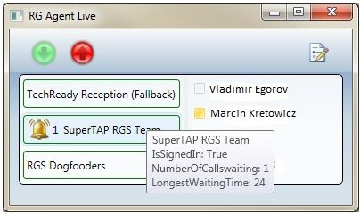

# <a name="skype-for-business-server-2015-resource-kit-tools-documentation"></a>商務用 Skype Server 2015 資源套件工具檔

本主題描述商務用 Skype Server 2015 資源套件中的工具，包括每個工具的用途，以及其用法範例。 商務用 Skype Server 2015 資源套件能讓部署及管理商務用 Skype Server 2015 的 IT 系統管理員更容易進行例行工作。 例如，網路會議**資料**工具可用於輕鬆控制使用者在線上會議期間上傳的資料。 **SEFAUtil**工具可用來設定代理人來電轉接及應答使用者。 我們鼓勵 IT 系統管理員使用這些工具來更有效率地管理商務用 Skype Server 2015。

## <a name="installation-of-the-resource-kit-tools"></a>資源套件工具的安裝

若要安裝商務用 Skype Server 2015 資源套件，請從下載中心下載[OCSReskit](https://www.microsoft.com/en-us/download/details.aspx?id=52631) 。

執行**OCSResKit**以進行簡單的安裝。 .Msi 會安裝下列路徑中的所有工具： **% 程式 Files%\Skype 商務伺服器 2015 \ ResKit**。 可自包含的可執行檔的工具位於此資料夾中。 也有支援檔案的工具位於自己的子資料夾中。

## <a name="supported-environments"></a>支援的環境

商務用 Skype Server 2015 資源套件應該安裝在符合商務用 Skype Server 2015 所需規格的伺服器上，通常是用來執行商務用 Skype Server 2015。

## <a name="resource-kit-tools-overview"></a>資源套件工具概述

以下是商務用 Skype Server 2015 資源套件中提供的工具清單。 每個工具的描述，包括 [需求] 與 [範例] 的用法在下列各節中講述。

- [ABSConfig](resource-kit-tools.md#ABSConfig)

- [頻寬原則服務監視器](resource-kit-tools.md#bpsm)

- [頻寬利用率分析程式](resource-kit-tools.md#bua)

- [呼叫 Parkometer](resource-kit-tools.md#callpark)

- [DBAnalyze](resource-kit-tools.md#dba)

- [匯入儲存服務資料](resource-kit-tools.md#Issd)

- [LCSSync](resource-kit-tools.md#LCSSync)

- [查閱使用者主控台](resource-kit-tools.md#LUC)

- [MsTurnPing](resource-kit-tools.md#MsTurnPing)

- [網路設定檢視器](resource-kit-tools.md#NCV)

- [回應群組代理程式即時](resource-kit-tools.md#RGAL)

- [SEFAUtil](resource-kit-tools.md#SEFAUtil)

- [SYSPrep. ps1](resource-kit-tools.md#SYSPrep)

- [未指定的數位宣告遷移](resource-kit-tools.md#UNAM)

- [網路會議資料](resource-kit-tools.md#WebConfData)

## <a name="absconfig"></a>ABSConfig
<a name="ABSConfig"> </a>

通訊錄服務設定工具（ABSConfig）是一種管理工具，可協助系統管理員在商務用 Skype Server 2015 中自訂通訊錄服務設定。 這個工具也能讓商務用 Skype Server 2015 系統管理員還原預設通訊錄服務設定。

### <a name="description"></a>描述

ABSConfig 是圖形使用者介面應用程式，可讓系統管理員設定與通訊錄服務相關的 Active Directory 網域服務屬性。

此工具的主要案例如下所示：

- 若要讓系統管理員將 Active Directory 網域服務中的屬性對應至商務用 Skype Server 2015 的屬性。

- 若要讓系統管理員指定要在通訊錄服務檔案中包含或排除的 Active Directory 網域服務屬性。

- 讓系統管理員還原預設通訊錄服務設定。

ABSConfig 工具可以使用 ABSConfig 檔案啟動。 工具隨即開啟至 [**設定屬性**] 索引標籤。此表格有選項可將 Active Directory 網域服務屬性對應到商務用 Skype Server 2015 的屬性欄位，以及指定哪些使用者要在通訊錄服務檔案中根據特定的屬性篩選器來包含或排除這些屬性。 您也可以選擇自訂要在通訊錄檔案中包含的電話號碼值。 [**還原預設**值] 選項可讓系統管理員將通訊錄服務設定還原為預設值。

> [!NOTE]
> 將廣告屬性重新對應至不同的 OC 欄位名稱，只適用于通訊錄檔案下載，且不受通訊錄 Web 查詢支援。

### <a name="output"></a>收

ABSConfig 會將通訊錄服務配置儲存在資料庫中。

```console
Path: %ProgramFiles%\Skype for Business Server 2015\Reskit
```

### <a name="purpose"></a>特殊

ABSConfig 提供一種快速且簡易的自訂商務用 Skype Server 2015 通訊錄服務的方式。

### <a name="requirements"></a>需求

#### <a name="computer"></a>電腦

ABSConfig 只能從已安裝商務用 Skype Server 2015 的網域加入電腦執行。 在商務用 Skype Server 2015、Enterprise Edition 中，此工具可以在安裝期間啟用通訊錄服務的任何前端伺服器上執行。

#### <a name="network"></a>網路

電腦應該能夠連線到前端池和後端資料庫。

#### <a name="software"></a>軟體

在執行 ABSConfig 工具之前，必須先安裝下列軟體元件：

- 商務用 Skype Server 2015

#### <a name="users"></a>使用者

擁有更新商務用 Skype Server 2015 部署所需許可權的系統管理員。

### <a name="examples"></a>範例

在命令提示字元中輸入**ABSConfig** ，即可開始 ABSConfig。 下面顯示的是 ABSConfig 工具使用者介面。


### <a name="summary"></a>總結

ABSConfig 工具可讓系統管理員快速且輕鬆地使用工具來自訂商務用 Skype Server 2015 通訊錄服務。

## <a name="bandwidth-policy-service-monitor"></a>頻寬原則服務監視器
<a name="bpsm"> </a>

[頻寬原則服務監視工具] 可讓系統管理員查看下列專案的清單：

1. 拓撲中所有已設定的商務用 Skype Server 2015 頻寬原則服務（驗證與核心）

2. 每個服務對其他頻寬原則服務及邊緣伺服器所做的連接

3. 在網路設定檔中設定的所有連結，以及每個頻寬策略服務所報告的即時頻寬使用量

### <a name="description"></a>描述

[頻寬原則服務監視工具] 是以 GUI 式應用程式的方式來實現。 系統管理員執行 PDPMonUI 來啟動該工具。

當工具啟動時，它會嘗試在拓撲中探索頻寬原則服務清單。 初次更新完成之後，視窗左側的窗格會以其所屬的群集來分組，並填入服務清單。

當管理員選取特定的頻寬原則服務時，右邊的窗格會顯示該特定服務的相關資訊。 該窗格還有兩個顯示資訊的主要索引標籤。

#### <a name="machine-info-tab"></a>[電腦資訊] 索引標籤

[**電腦資訊**] 索引標籤會顯示已選取頻寬原則服務的詳細資料，以及由選取的頻寬策略服務所進行的所有連線的清單和狀態與其他服務。

#### <a name="topology-info-tab"></a>[拓撲資訊] 索引標籤

[**拓撲資訊**] 索引標籤會顯示在 [網路設定] 中設定的所有連結的清單。 針對每個連結，會顯示 [音訊] 和 [影片頻寬] 的容量。 此外，目前使用的頻寬會以 Kbps 及容量百分比的方式顯示。 此工具使用色彩編碼來醒目提示具有接近產能之利用率的連結，這可讓系統管理員快速隔離這些連結。

> [!NOTE]
>  如果頻寬原則服務監視器工具在連線至任何已設定的頻寬原則服務時發生故障，**電腦資訊**和**拓撲資訊**索引標籤中的資訊將無法填入。 不過，該工具可能會先連線，但隨後會失去與服務的連線。 在這種情況下，系統管理員可能會看到過時的資訊。 每個索引標籤上都有**上次更新**的時間戳記，這些索引標籤可讓系統管理員查看特定頻寬原則服務上次更新資料的時間。

### <a name="output"></a>收

沒有命令列輸出;程式輸出包含在主要的圖形使用者介面（GUI）中。

### <a name="purpose"></a>特殊

[頻寬原則服務監視器] 工具的用途是，可讓系統管理員瞭解拓撲中定義的每個頻寬原則服務的狀態。 此外，管理員可以查看網路設定檔中定義的所有連結的即時頻寬使用量。

### <a name="requirements"></a>需求

[頻寬原則服務監視器] 工具必須在屬於商務用 Skype Server 拓撲的電腦上執行。

### <a name="summary"></a>總結

頻寬原則服務監視器工具可以是系統管理員的重要資源，讓他們能夠檢查拓撲中所有頻寬原則服務的狀態，更重要的是，它們可以取得連結的即時頻寬利用率，在 [網路設定] 中定義。

## <a name="bandwidth-utilization-analyzer"></a>頻寬利用率分析程式
<a name="bua"> </a>

[頻寬利用率分析] 是一種工具，可在商業網路中，透過廣域網路連結的 UC 端點，建立各種頻寬使用量的報告。 這些報告可用來瞭解目前的頻寬使用量模式，並協助您進行頻寬容量規劃。

### <a name="description"></a>描述

[頻寬利用率分析] 是以 GUI 式應用程式的方式來實現。 這個工具會針對網路上的音訊利用率專門產生報告，並協助您進行容量規劃。 它也會根據指派給各種連結的頻寬容量來反覆運算。

### <a name="output"></a>收

[頻寬利用率分析]：針對系統中設定的所有 WAN 連結，提供圖形 al 的頻寬容量與利用率。

### <a name="purpose"></a>特殊

在任何語音與視頻部署中，監視及瞭解整個商業網路中媒體流量的頻寬利用率趨勢是非常重要的。 [頻寬利用率分析] 工具可讓系統管理員只取得該功能。 此工具會執行下列動作：

- 針對網路上的音訊利用率產生特定報告

- 協助更有效的容量規劃，以及在指派給各種連結的頻寬容量上進行反覆運算

[頻寬利用率分析] 可產生頻寬容量與利用率報告的圖形化圖形;它們如下所示：

- 商業網路中的所有 WAN 連結

- 已選取已選取的 WAN 連結篩選

- 使用超過連結容量的 WAN 連結進行篩選

- 依已在使用預配頻寬的 WAN 連結進行篩選

- 依 WAN 連結達到關鍵性層級的 WAN 連結進行篩選（頻寬利用率大於 WAN 連結頻寬容量的90%）

- 依 WAN 連結類型進行篩選：網路網站連結、interregional 連結，以及網站內的連結

- 依網路區域篩選

#### <a name="applications"></a>程式

[頻寬利用率] Analyzer 有下列兩個應用程式（工具）：

- **WanLinkLogCollector**此工具可讓使用者輸入所需的資訊。

- **BandwidthUtilizationAnalyzer. Xlsm** Microsoft Excel 試算表軟體報告會透過 WanLinkLogCollector 自動啟動。 此應用程式可讓使用者將篩選套用至報表，如本文稍後所示。

#### <a name="phases-of-using-bandwidth-utilization-analyzer"></a>使用頻寬利用率分析程式的階段

使用 [頻寬利用率] 分析程式有兩個階段：

- 收集使用 WanLinkLogCollector 執行的記錄

- 自訂報表，並使用 BandwidthUtilizationAnalyzer 進行 xlsm。

    > [!IMPORTANT]
    > 我們強烈建議您不要由最終使用者手動啟動 BandwidthUtilizationAnalyzer。

#### <a name="starting-bandwidth-utilization-analyzer"></a>啟動頻寬利用率分析程式

在命令提示字元中啟動 WanLinkLogCollector 或使用 Windows 資源管理器。

 **使用 WanLinkLogCollector**

使用 WanLinkLogCollector 有三個步驟：

1. **記錄時程表**提供報表需要產生的時程表

2. **指定檔案目錄**提供檔案位置資訊

3. **收集記錄並啟動報表檢視器**執行命令來產生報告

#### <a name="step-1---log-the-timeline"></a>步驟 1-記錄時程表

記錄時間軸可讓工具使用者指定下列選項，如下圖所示。

1. **開始日期**這是要產生報告的時程表開始日期;例如，2010年8月1日。

2. **結束日期**這是要產生報告的時程表結束日期;例如，2010年9月30日。

     

#### <a name="step-2---specify-the-file-directories"></a>步驟 2-指定檔案目錄

下列是可由使用者指定的檔案目錄，如所示。

- **伺服器記錄檔位置**儲存頻寬原則伺服器記錄的資料夾位置。 這通常在 [ \<\AppServerFiles\PDP.\> \\ ] 中，<\>選擇的 FE

- **臨時檔案儲存位置**產生報告時儲存中間檔案的臨時檔案位置。

    

    > [!NOTE]
    > 請確定有足夠的檔案存取伺服器記錄，並將 [臨時檔案存放區] 資料夾提供給工具使用者。

#### <a name="step-3---collect-the-logs-and-start-the-report-viewer"></a>步驟 3-收集記錄並啟動報表檢視器

若要收集記錄並啟動報表檢視器，請按一下 [**執行**]，如下所示。 此步驟會收集所需的資料。


輸入驗證成功後，會顯示下面所示的訊息。


按一下 [確定]****。 BandwidthUtilizationAnalyzer。 xlsm 會自動啟動。 依照訊息方塊中的指示進行。 如需詳細資訊，請參閱下一節中的 [**使用 BandwidthUtilizationAnalyzer xlsm** ]。


### <a name="using-bandwidthutilizationanalyzerxlsm"></a>使用 BandwidthUtilizationAnalyzer xlsm

1. 當 xlsm 自動啟動時，請按一下 [重新整理] **，如下所**示。

     

2. 開啟檔案資料夾時，請從訊息方塊中指定的位置選取 [合併] .csv，如下所示。 它也會將位置顯示為**C：\Temp**。

     

3. 按一下 [匯**入**]。

4. 圖形化圖形就會自動產生。 當使用背景指標消失時，就可以使用它。

     

#### <a name="applying-filters-to-the-report-view"></a>將篩選套用至報表檢視

以下說明可套用至報表檢視的篩選器，如下所示：


1. **名稱**依 WAN 連結篩選（篩選器位於圖形右側）。前置詞代表下列連結類型;請參閱 [垂直（藍色）] 方塊：

   - **S 網站**從網路網站到網路區域的 WAN 連結

   - **是站內網站**兩個網路網站之間的 WAN 連結

   - **R 區域間**兩個網路區域之間的 WAN 連結

2. **超出限制**依頻寬利用率超過頻寬容量的 WAN 連結進行篩選

3. **重要等級**依頻寬利用率達到90% 或超過頻寬容量的 WAN 連結進行篩選

4. 未**充分利用**依頻寬利用率小於頻寬容量25% 的 WAN 連結進行篩選

5. **連結類型**依下列 WAN 連結類型進行篩選：

   - **網路網站**類型

   - **網站間**類型

   - **區域間連結**類型

6. **地區**依網路區域篩選

下圖顯示前面所述的篩選。

依**名稱**篩選。 選取要在圖表中顯示的連結清單。

![在 BandwidthUtilizationAnalyzer 中依 [Name] (名稱) 篩選。](../media/Reskit_2012_Tools_Documentation_Image12.jpg)

依**超出限制**進行篩選。 選取 [ **True** ]，強制執行篩選。

![依 [Exceeded Limit] (已超出限制) 篩選。](../media/Reskit_2012_Tools_Documentation_Image13.jpg)

依**臨界層級**篩選。 選取 [ **True** ]，強制執行篩選。

![依 [Critical Levels] (重大層級) 篩選。](../media/Reskit_2012_Tools_Documentation_Image14.jpg)

根據**利用率**情況進行篩選。 選取 [ **True** ]，強制執行篩選。

![依 [Under Utilized] (低度使用) 篩選。](../media/Reskit_2012_Tools_Documentation_Image15.jpg)

依**連結類型**篩選。 選取需要顯示的一種或多種類型。

![依 [Link Type] (連結類型) 篩選。](../media/Reskit_2012_Tools_Documentation_Image16.jpg)

依**區域**篩選。 選取需要顯示其連結的地區清單。

![依 [Region] (地區) 篩選。](../media/Reskit_2012_Tools_Documentation_Image17.jpg)

### <a name="requirements"></a>需求

- .NET Framework 3。5

- Microsoft Excel 2010 或 Excel 2007

### <a name="summary"></a>總結

頻寬利用率分析程式是用來繪製網路上 UC 流量的音訊頻寬利用率。 您也可以使用這個工具，來報告網路上的視頻頻寬利用率。

## <a name="call-parkometer"></a>呼叫 Parkometer
<a name="callpark"> </a>

呼叫 Parkometer 是一種命令列應用程式，可讓您輕鬆存取 [通話駐留軌道] 資料庫。

### <a name="description"></a>描述

呼叫 Parkometer 是一種追蹤目前寄存通話的工具。 它也會收集有關軌道式及通話駐留伺服器（CPS）用法的統計資料。 這個命令列工具提供從本機或遠端連線的電腦對 CPS 軌道 SQL Server 資料庫的讀取和寫入存取權。

所有選項都是互相排斥的。 命令列語法如下所示：

- **-o**參數-列出針對此池子設定的所有軌道範圍。

- **-n**參數：列出此池子中所有目前使用的軌道式。 顯示的資訊如下所示：

  - Parkee 和 parker 的 SIP 統一資源識別項（URI）。

  - 停用通話的 CPS 主機名稱。

  - 通話停用的時間戳記。

- **-f**參數：列出池中目前閒置的 [軌道式] 數目。

- **-r \<n\> **參數：列出\<n\>個最後一個寄存通話。 顯示的資訊如下所示：

  - Parkee SIP URI。

  - Parker SIP URI。

  - 停用通話的 CPS 主機名稱。

  - 檢索或丟棄通話的時間戳記。

- **-t\<n\> **參數-測試在資料庫中保留軌道，以顯示指定的軌道編號的隨機性。

### <a name="output"></a>收

根據在命令提示字元中指定的輸入參數，呼叫 Parkometer 會顯示下列輸出：

- 針對此泳池設定的所有軌道範圍

- 目前停用通話

- 空閒（可用）軌道式的數目

- 最近寄存的通話

- 用於測試均勻與隨機軌道值的保留軌道

### <a name="purpose"></a>特殊

CPS 工具的用途是提供對 CPS 資料庫的命令列存取權。 系統管理員可以查看 CPS 使用量，並決定指派給池子的軌道數。

### <a name="requirements"></a>需求

如果此工具是在執行 CPS 的同一部電腦上執行，就沒有任何需求。 如果此工具是在遠端電腦上執行，商務用 Skype Server 2015 所使用的 SQL Server 資料庫必須設定為允許遠端存取。 必須使用 SQL Server 資料庫連線字串來設定呼叫 Parkometer，才能連線至該池的 SQL Server。 這個 SQL Server 資料庫連線字串是在設定檔**parkometer .config**中定義。它必須放在 parkometer 所在的同一個目錄中。 下列 XML 檔案就是 parkometer 的範例。必須設定的參數為使用者名稱（例如，mydomain\Administrator）、密碼（例如，mypassword），以及主機名稱（例如 myserver）。

```xml
<?xml version="1.0" encoding="utf-8" ?>
<configuration>
  <appSettings>
   <add key="SQL" value="server=myserver\RTC;
database=cpsdyn;
User Id=mydomain\Administrator;
Password=mypassword.;
Integrated Security=false;"/>
  </appSettings>
</configuration>
```

### <a name="examples"></a>範例

已部署的軌道範圍：-o 參數會列出針對此池子設定的所有軌道範圍，如圖所示


目前停用的通話：-n 參數會列出此圖池中所有目前使用的軌道式，如下所示


[自由] 軌道式數： f 參數會列出池中目前可用的 [軌道式] 的數目，如圖所示


最近寄存的通話：-r \<n\>參數會列出\<n\>個最後暫停的呼叫（如圖所示）


測試軌道保留：-t \< \>參數測試在資料庫中保留軌道，如圖所示


### <a name="summary"></a>總結

呼叫 Parkometer 是一種命令列工具，可提供通話寄存伺服器的詳細資訊。

## <a name="dbanalyze"></a>DBAnalyze
<a name="dba"> </a>

### <a name="description"></a>描述

DBAnalyze 是一種命令列工具，可協助管理員收集有關商務用 Skype Server 2015 資料庫的分析報告。 DBAnalyze 具有下列模式： [診斷]、[使用者資料]、[會議]、[MCUs] 和 [磁片碎片]：

- **診斷模式**建立包含資料表相關資訊的報表（記錄數、分段、[資料大小]、[索引大小]、[資料及記錄大小]、[每個執行 Microsoft Office 通訊伺服器的伺服器]、[許可權]、[連絡人]、[訂閱]、[發佈]、[每位使用者]、[排程會議]、[使用中會議]，以及無法傳送的會議平均數以及資料庫版本。

    > [!NOTE]
    > 運行診斷模式可能會影響伺服器效能。

- **使用者資料模式**針對指定使用者或在連絡人與許可權清單中擁有該使用者的使用者，報告連絡人、容器、訂閱、發佈、許可權和連絡人群組資料。 此模式也會報告使用者組織或受邀之會議的摘要資料。

- **會議模式**報告特定會議的詳細資料，包括會議的所有排程時間詳細資料、被邀請者清單、會議所允許的媒體類型清單、作用中 MCUs （multipoint 控制單元）、作用中的參與者清單，以及每個參與者的寄件者狀態。

- **解碼會議 ID**解碼由 **/pstnid**開關指定的公用交換電話網絡（PSTN）會議 ID，但不會連線到後端以取得詳細資訊。

- **解決會議**解碼由 **/pstnid**開關指定的 PSTN 會議 ID，並顯示由識別碼所指示之會議的相關資訊。

- **MCUs 模式**報告池中每個 MCU 的識別碼、媒體類型、URL、心跳狀態、會議載入以及參與者負載。

- **磁片分段模式**顯示所有磁片的碎片狀態。

此工具可用於診斷各種問題，或協助系統管理員進行容量規劃。 例如，如果大多數駐留在伺服器上的使用者選擇的是伺服器 B 上的使用者作為其連絡人，系統管理員可以將伺服器 A 上的使用者移至伺服器 B，以減少跨伺服器的流量。

### <a name="output"></a>收

這個工具會輸出商務用 Skype Server 2015 資料庫的預先定義報告。 **路徑**：%ProgramFiles%\Skype For Business Server 2015 \ Reskit

### <a name="purpose"></a>特殊

若要安裝 Dbanalyze，請將它複製到本機資料夾，然後執行該工具。 若要使用該工具，請從命令列執行下列命令。 `dbanalyze.exe [/v] [/report:value] [/sqlserver:value] [/user:user@domain.com] [/conf:value][/pstnid:Value] [/maxcontacts:value]`命令列選項的描述如下所示。


### <a name="requirements"></a>需求

 **電腦**DBAnalyze 只能從已安裝商務用 Skype Server 2015 的網域加入電腦執行。

 **網路**電腦應該能夠連接到後端資料庫。

 **軟體**在執行 DBAnalyze 之前，必須先安裝商務用 Skype Server 2015 軟體元件。

 **使用者**下表顯示擁有存取商務用 Skype Server 2015 資料庫所需許可權的系統管理員。


> [!NOTE]
> **/Report：磁片**模式需要本機系統管理員帳戶。

### <a name="examples"></a>範例

下列是有效 Dbanalyze 命令的範例：

```console
dbanalyze.exe /report:diag
dbanalyze.exe /report:user /user:usera@domainb.com
dbanalyze.exe /report:conf /user:bob@example.com /conf:1W9J71SKSX2X
dbanalyze.exe /report:resolve /pstnid:12345
dbanalyze.exe /report:mcus
dbanalyze.exe /report:disk
```

### <a name="summary"></a>總結

DBAnalyzer 可讓系統管理員快速且輕鬆地分析商務用 Skype Server 2015 資料庫。

## <a name="import-storage-service-data"></a>匯入儲存服務資料
<a name="Issd"> </a>

ImportStorageServiceData 資源套件工具可讓您重新匯入儲存空間服務（LYSS）的佇列和端點資料，並傳回儲存服務。

### <a name="description"></a>描述

從存儲服務中清除的資料，可能會根據佇列專案狀態或資料庫大小，自動（定期）。 這可能是因為手動調用 pool 容錯移轉 Cmdlet，或 StorageServiceFullFlush Cmdlet （這是池容錯移轉 Cmdlet 的調用）。 請注意，如果前端的任何儲存服務（LYSS）資料庫大小都在 [標準] 層級之上，則最好不要重新匯入資料，因為這樣做可能只會導致更多資料匯出回來。此外，您應該先解決導致存儲服務佇列增長的錯誤所帶來的任何問題（例如 Exchange 端點錯誤、網路問題或其他問題）。

 **案例1：** 在 pool 進行容錯移轉期間，可能會從每個前端的 storage services 中清除檔案。 容錯移轉完成後，應執行該工具，以重新匯入資料。

 **案例2：** 每日自動刷新資料，或以回應超過特定大小閾值的儲存服務資料庫（例如60%、80%、90%）。 這個自動刷新的資料應該由系統管理員定期重新匯入。 在上述情況下，如果未部署監視 SCOM 套件，則會出現與從儲存服務清除資料相關的商務用 Skype Server Storage 服務事件。 32075（完整清除作業的啟動）、32076（完全清除已完成）、32082（維護層級清洗完成）、32083（維護層級清理完成）、32089（因填滿資料庫而發生清洗）等的事件 Id。 注意：這些事件識別碼與 RTM 版本相對應。 當管理員看到這些事件時，表示檔案中有已清除的檔案。這個資料應該使用這個工具（例如每週一次），重新匯入。

如果您是在線上服務版本中部署商務用 Skype Server 的健康情況監視 SCOM 套件，可能會引發新的警示，要求系統管理員重新將清除的資料匯入儲存服務。 在前端伺服器上的事件記錄中，會有對應的事件觸發警示。 事件將會提供所需的父路徑的描述，以及有多少個檔案會符合警報準則。 [警示準則] 是特定父路徑下的 X 或更多檔案，這些檔案至少是最早的 Y 天（在 StorageService 中，X 和 Y 是預先設定的，但可透過變更 APPCONFIG 檔案來覆寫）。下面顯示可觸發健全性警報的兩個事件範例，區別是其父路徑。 其中一個可能是在 Web 服務檔案共用下，另一個可能就是每個前端的本機應用程式資料目錄。 （例如 c:\ProgramData\Microsoft\Skype Business Server 2015 \ StorageService）。 然後，系統管理員會執行這個 reskit 工具。

這個工具會在所執行的前端（以及其他前端）上增加 CPU 和 IO 負荷，在此情況下，您的資料不會在執行該工具的前端所擁有。 我們建議您在前端不在 CPU 和 IO 負載（例如尖峰時間外）的情況下，runng 此工具。 其次，此工具可以2到3分鐘，匯入一個資料檔案。 在估計工具執行的時間長度時，請記住這一點。 此工具所產生的詳細記錄檔預設會顯示在檔案存放區上。 如果沒有報告任何錯誤，請將它刪除，因為記錄檔可能是數十 MB 或更多。


### <a name="requirements"></a>需求

安裝商務用 Skype Server 2015 資源套件工具。 此工具會在已安裝商務用 Skype Server 和商務用 Skype Server Management Shell 的網域加入電腦上執行。 此工具會使用來自管理命令介面的 Cmdlet 來找出池中的所有前端伺服器。 其次，您必須從已安裝**RtcLocal**資料庫的池中的電腦執行該工具。 此資料庫是由工具用來檢索池子的 WEBSERVICE 檔案共用位置。 此外，在使用此工具之前，每個前端伺服器必須先在每個前端伺服器上使用**enable-PSRemoting**啟用 Windows PowerShell 遠端作業，以及執行該工具的電腦。 否則，此工具的遠端 Windows PowerShell 命令將會失敗。 完成後，就可以在池中的所有前端伺服器上關閉 Windows PowerShell 遠端處理功能。 最後，開啟此工具的帳戶或憑證必須擁有其在其上執行這個工具的 [webservice 檔案共用] 的 [讀取/寫入] 許可權。 否則，該工具會因 IO 許可權錯誤而失敗。

> [!NOTE]
> 在 Windows Server 2012 上，Windows PowerShell Remoting 預設為啟用，但在 Windows Server 2008 作業系統上則無法使用。

### <a name="examples"></a>範例

```console
>  C:\StorageService>ImportStorageServiceData.exe
Description:
This tool will re-import Storage Service (LYSS) flushed queue data back in.  For a pool: you are required to run this tool on a machine inside the pool which has the Lync Server Management Shell installed.  Additionally, all front end machines need to have Windows Powershell Remoting enabled before executing this tool by executing Enable-PSRemoting.  Also, please ensure that all Storage Service instance DB Size are at the 'Normal' level (verify this by viewing Eventlog events). Otherwise re-importing may cause data to be flushed out again if any Storage Service instance DB size level goes above 'Normal'.
Usage: Default behavior is to Import data from web service file share as well as any files on all Front End machines in pool.
Additional Options:
-Verbose                    : Turn verbose output on.

-StorageServiceHostName     : Host Name of Storage Service WCF endpoint.  ( Default=localhost netnamedpipe binding. )

-FileSharePath              : Import only all data from just under the UNC path specified.

ActivityID: cc3b62ff-bb66-4e61-a6e2-96cb3626315c. <-- Use this to correlate with StorageService trace logs if troubleshooting.
Type Server name (TCP binding) or press <enter> for localhost (NamePipe binding):
Using NetNamedPipeBinding...
OnTopologyChanged Event received
Web Service File Share: \\dc.vdomain.com\OcsFileStore\co1-WebServices-1\StorageService

Front Ends:
server.vdomain.com
server2.vdomain.com
server1.vdomain.com
server3.vdomain.com
Looking under directory: \\dc.vdomain.com\OcsFileStore\co1-WebServices-1\StorageService for exported data.
# Files found: 8
Starting Import for file:\\dc.vdomain.com\OcsFileStore\co1-WebServices-1\StorageService\DataExport\2
0120910\SERVER.vdomain.com\944f5724c65c5f93900dc1c8c898b102__0.xml
Items deserialized: 20

All items in file were enqueued successfully, will try to delete file: \\dc.vdomain.com\OcsFileStore\co1-WebServices-1\StorageService\DataExport\20120910\SERVER.vdomain.com\944f5724c65c5f93900dc1c8c898b102__0.xml

All items in file failed to enqueue so file will not be deleted.  File path: \\dc.vdomain.com\OcsFileStore\co1-WebServices-1\StorageService\DataExport\20120910\SERVER.vdomain.com\944f5724c65c5f93900dc1c8c898b102__0.xml

Summary for file \\dc.vdomain.com\OcsFileStore\co1-WebServices-1\StorageService\DataExport\20120910\SERVER.vdomain.com\944f5724c65c5f93900dc1c8c898b102__0.xml: succeeded: 20, failed: 0

Starting Import for file:\\dc.vdomain.com\OcsFileStore\co1-WebServices-1\StorageService\DataExport\20120910\SERVER1.vdomain.com\17d5435ae40259f7bbdf1866776386e4__0.xml
Items deserialized: 20

[cc3b62ff-bb66-4e61-a6e2-96cb3626315c] Send EnqueueMessages to redirected, targetServer=server1.vdomain.com, queueItems=20

All items in file were enqueued successfully, will try to delete file: \\dc.vdomain.com\OcsFileStore\co1-WebServices-1\StorageService\DataExport\20120910\SERVER1.vdomain.com\17d5435ae40259f7bbdf1866776386e4__0.xml

All items in file failed to enqueue so file will not be deleted.  File path: \\dc.vdomain.com\OcsFileStore\co1-WebServices-1\StorageService\DataExport\20120910\SERVER1.vdomain.com\17d5435ae40259f7bbdf1866776386e4__0.xml

Summary for file \\dc.vdomain.com\OcsFileStore\co1-WebServices-1\StorageService\DataExport\20120910\
SERVER1.vdomain.com\17d5435ae40259f7bbdf1866776386e4__0.xml: succeeded: 20, failed: 0

Starting Import for file:\\dc.vdomain.com\OcsFileStore\co1-WebServices-1\StorageService\DataExport\20120910\SERVER1.vdomain.com\904f6c9b8ac951ae8b3c86684d3832e4__0.xml

Items deserialized: 20
[cc3b62ff-bb66-4e61-a6e2-96cb3626315c] Send EnqueueMessages to redirected, targetServer=server1.vdomain.com, queueItems=20

All items in file were enqueued successfully, will try to delete file: \\dc.vdomain.com\OcsFileStore
\co1-WebServices-1\StorageService\DataExport\20120910\SERVER1.vdomain.com\904f6c9b8ac951ae8b3c86684d
3832e4__0.xml

All items in file failed to enqueue so file will not be deleted.  File path: \\dc.vdomain.com\OcsFil
eStore\co1-WebServices-1\StorageService\DataExport\20120910\SERVER1.vdomain.com\904f6c9b8ac951ae8b3c
86684d3832e4__0.xml

Summary for file \\dc.vdomain.com\OcsFileStore\co1-WebServices-1\StorageService\DataExport\20120910\
SERVER1.vdomain.com\904f6c9b8ac951ae8b3c86684d3832e4__0.xml: succeeded: 20, failed: 0

Starting Import for file:\\dc.vdomain.com\OcsFileStore\co1-WebServices-1\StorageService\DataExport\2
0120910\SERVER2.vdomain.com\69844a271e6c5633a1f2b46a42287dd6__0.xml

Items deserialized: 20

[cc3b62ff-bb66-4e61-a6e2-96cb3626315c] Send EnqueueMessages to redirected, targetServer=server2.vdom
ain.com, queueItems=20

All items in file were enqueued successfully, will try to delete file: \\dc.vdomain.com\OcsFileStore
\co1-WebServices-1\StorageService\DataExport\20120910\SERVER2.vdomain.com\69844a271e6c5633a1f2b46a42
287dd6__0.xml

All items in file failed to enqueue so file will not be deleted.  File path: \\dc.vdomain.com\OcsFil
eStore\co1-WebServices-1\StorageService\DataExport\20120910\SERVER2.vdomain.com\69844a271e6c5633a1f2
b46a42287dd6__0.xml

Summary for file \\dc.vdomain.com\OcsFileStore\co1-WebServices-1\StorageService\DataExport\20120910\
SERVER2.vdomain.com\69844a271e6c5633a1f2b46a42287dd6__0.xml: succeeded: 20, failed: 0

Starting Import for file:\\dc.vdomain.com\OcsFileStore\co1-WebServices-1\StorageService\DataExport\2
0120910\SERVER3.vdomain.com\3313935458e35b9b9759e08a15d251e6__0.xml

Items deserialized: 20

[cc3b62ff-bb66-4e61-a6e2-96cb3626315c] Send EnqueueMessages to redirected, targetServer=server3.vdom
ain.com, queueItems=1

All items in file were enqueued successfully, will try to delete file: \\dc.vdomain.com\OcsFileStore
\co1-WebServices-1\StorageService\DataExport\20120910\SERVER3.vdomain.com\3313935458e35b9b9759e08a15
d251e6__0.xml

All items in file failed to enqueue so file will not be deleted.  File path: \\dc.vdomain.com\OcsFil
eStore\co1-WebServices-1\StorageService\DataExport\20120910\SERVER3.vdomain.com\3313935458e35b9b9759
e08a15d251e6__0.xml

Summary for file \\dc.vdomain.com\OcsFileStore\co1-WebServices-1\StorageService\DataExport\20120910\
SERVER3.vdomain.com\3313935458e35b9b9759e08a15d251e6__0.xml: succeeded: 20, failed: 0

Starting Import for file:\\dc.vdomain.com\OcsFileStore\co1-WebServices-1\StorageService\DataExport\2
0120910\SERVER3.vdomain.com\4501e04eae4856059346949ff817c220__0.xml
Items deserialized: 20
[cc3b62ff-bb66-4e61-a6e2-96cb3626315c] Send EnqueueMessages to redirected, targetServer=server3.vdom
ain.com, queueItems=1
All items in file were enqueued successfully, will try to delete file: \\dc.vdomain.com\OcsFileStore
\co1-WebServices-1\StorageService\DataExport\20120910\SERVER3.vdomain.com\4501e04eae4856059346949ff8
17c220__0.xml
All items in file failed to enqueue so file will not be deleted.  File path: \\dc.vdomain.com\OcsFil
eStore\co1-WebServices-1\StorageService\DataExport\20120910\SERVER3.vdomain.com\4501e04eae4856059346
949ff817c220__0.xml

Summary for file \\dc.vdomain.com\OcsFileStore\co1-WebServices-1\StorageService\DataExport\20120910\
SERVER3.vdomain.com\4501e04eae4856059346949ff817c220__0.xml: succeeded: 20, failed: 0
Starting Import for file:\\dc.vdomain.com\OcsFileStore\co1-WebServices-1\StorageService\DataExport\2
0120910\SERVER3.vdomain.com\5ad77443ad955a22a876749be66d5317__0.xml

Items deserialized: 20
[cc3b62ff-bb66-4e61-a6e2-96cb3626315c] Send EnqueueMessages to redirected, targetServer=server3.vdom
ain.com, queueItems=20
All items in file were enqueued successfully, will try to delete file: \\dc.vdomain.com\OcsFileStore
\co1-WebServices-1\StorageService\DataExport\20120910\SERVER3.vdomain.com\5ad77443ad955a22a876749be6
6d5317__0.xml
All items in file failed to enqueue so file will not be deleted.  File path: \\dc.vdomain.com\OcsFil
eStore\co1-WebServices-1\StorageService\DataExport\20120910\SERVER3.vdomain.com\5ad77443ad955a22a876
749be66d5317__0.xml
Summary for file \\dc.vdomain.com\OcsFileStore\co1-WebServices-1\StorageService\DataExport\20120910\
SERVER3.vdomain.com\5ad77443ad955a22a876749be66d5317__0.xml: succeeded: 20, failed: 0
Starting Import for file:\\dc.vdomain.com\OcsFileStore\co1-WebServices-1\StorageService\DataExport\2
0120910\SERVER3.vdomain.com\a11e27ae439a582288d4657eda86b565__0.xml
Items deserialized: 20
[cc3b62ff-bb66-4e61-a6e2-96cb3626315c] Send EnqueueMessages to redirected, targetServer=server3.vdom
ain.com, queueItems=20
All items in file were enqueued successfully, will try to delete file: \\dc.vdomain.com\OcsFileStore
\co1-WebServices-1\StorageService\DataExport\20120910\SERVER3.vdomain.com\a11e27ae439a582288d4657eda
86b565__0.xml
All items in file failed to enqueue so file will not be deleted.  File path: \\dc.vdomain.com\OcsFil
eStore\co1-WebServices-1\StorageService\DataExport\20120910\SERVER3.vdomain.com\a11e27ae439a582288d4
657eda86b565__0.xml
Summary for file \\dc.vdomain.com\OcsFileStore\co1-WebServices-1\StorageService\DataExport\20120910\
SERVER3.vdomain.com\a11e27ae439a582288d4657eda86b565__0.xml: succeeded: 20, failed: 0
All files have been imported into Storage Service for path: \\dc.vdomain.com\OcsFileStore\co1-WebSer
vices-1\StorageService
Importing files for: server.vdomain.com
No files founds.
Importing files for: server2.vdomain.com
No files founds.
Importing files for: server1.vdomain.com
No files founds.
Importing files for: server3.vdomain.com
No files founds.
Writing log: \\dc.vdomain.com\OcsFileStore\co1-WebServices-1\StorageService\ImportStorageServiceData
Log20120910_1609SS
Tool has finished execution.
>  C:\StorageService>
```

## <a name="lcssync"></a>LCSSync
<a name="LCSSync"> </a>

LCSSync 工具可協助您在多目錄林環境中部署商務用 Skype Server 2015 通訊軟體。 這個工具是用來將來自不同使用者目錄林的使用者和群組，作為 Active Directory 網域服務連絡人物件與已安裝商務用 Skype Server 2015 的中央目錄林同步處理。

### <a name="description"></a>描述

 LCSSync 會使用中央林中的同步處理 Active Directory 網域服務連絡人物件，讓使用者使用商務用 Skype Server。 若要提供單一登入，主要使用者帳戶必須對應到商務用 Skype Server 2015 的中央林中的 Active Directory 網域服務連絡人物件。 此工具可協助執行該對應。 此工具提供範本，可用於在 Microsoft 身分識別整合伺服器中建立管理代理程式。

### <a name="summary"></a>總結

LCSSync 工具可協助您在多目錄林環境中部署商務用 Skype Server 2015。

## <a name="lookup-user-console"></a>查閱使用者主控台
<a name="LUC"> </a>

LookupUserConsole 工具會顯示特定使用者的內部商務用 Skype 伺服器路由資訊。 在診斷部署和路由問題時，Microsoft 支援個人資訊可能會很有用。

### <a name="description"></a>描述

 執行 LookupUserConsole 會開啟接受 SIP 位址的命令提示字元，並嘗試顯示與它們相關的內部商務用 Skype Server 路由資訊。 輸入**exit**以結束 LookupUserConsole 工具。

### <a name="requirements"></a>需求

安裝商務用 Skype Server 2015 資源套件。 此工具會在安裝商務用 Skype Server 的已加入網域的電腦上執行。

### <a name="examples"></a>範例

C:\Program Files\Skype for Business Server 2015 \ ResKit\>LookupUserConsole

```console
> sip:john.doe@vdomain.com

  Execution time (ms):                            171.094
  Exeuction result:                               Success
  SIP URI:                                        sip:john.doe@vdomain.com
  User info:
    SID:                                          S-1-5-21-2831376166-29632525...    Display name:                                     John Doe
    Grouping ID:                                  00000000-0000-0000-0000-...
    Line URI:                                     <null>
    Policy assignment:                            TenantId={00000000--0000-000....
    SIP enabled:                                  True
    UC enabled:                                   False
    Tenant ID:                                    00000000-0000-0000-0000-...  Cluster info:
    Active cluster:                               pool0.vdomain.com
    Backup registrar cluster:                     <null>
    Deployment location:                          <null>
    Home Front-End FQDN:                          SERVER.vdomain.com
    Primary Registrar cluster:                    pool0.vdomain.com
    Remote Director external SIP FQDN:            <null>
    Remote Director internal SIP FQDN:            <null>
    Remote Director Web FQDN:                     <null>
    Routing group ID:                             4501e04e-ae48-5605-9346...
    Service tag ID:                               1266953005
    User Front-End resolved:                      True
    User in local forest:                         True
    User in remote forest:                        False
    User in split domain:                         False
    User-Services cluster:                        pool0.vdomain.com

> sip:nouser@vdomain.com

  Execution time (ms):                            948.7574
  Exeuction result:                               UserDoesNotExist

> exit
```

## <a name="msturnping"></a>MsTurnPing
<a name="MsTurnPing"> </a>

MSTurnPing 工具可讓商務用 Skype Server 2015 通訊軟體的管理員檢查執行音訊/視頻邊緣和音訊/視頻驗證服務的伺服器狀態，以及在拓撲中執行頻寬原則服務的伺服器。

### <a name="description"></a>描述

MSTurnPing 工具可讓商務用 Skype Server 2015 通訊軟體的管理員檢查執行音訊/視頻邊緣和音訊/視頻驗證服務的伺服器狀態，以及在拓撲中執行頻寬原則服務的伺服器。

此工具可讓系統管理員執行下列測試：

1. A/V 邊緣伺服器測試：此工具會執行下列動作，針對拓撲中的所有 A/V 邊緣伺服器執行測試：

   - 驗證已啟動商務用 Skype Server 音訊/視頻驗證服務，並可能發出適當的認證。

   - 確認已啟動商務用 Skype Server 音訊/視頻邊緣服務，且可以成功地在外部邊緣上配置資源。

2. 頻寬原則服務測試：此工具會針對執行拓撲中的頻寬原則服務的所有伺服器執行測試，方法如下：

   - 驗證已啟動商務用 Skype Server 頻寬原則服務（驗證），並可能發出適當的認證。

   - 驗證已啟動商務用 Skype Server 頻寬原則服務（核心），並且能夠成功執行頻寬檢查。

此工具必須從屬於拓撲的電腦執行，且已安裝本機存儲區。

### <a name="output"></a>收

此工具會輸出每個作業的結果。

- 如果執行**AudioVideoEdgeServer**測試，則工具輸出如下：

  - 在拓撲中供應商務用 Skype Server 2015 音訊/視頻驗證服務的電腦測試結果

  - 在拓撲中供應商務用 Skype Server 2015 音訊/視頻邊緣服務的電腦測試結果

- 如果執行**BandwidthPolicyServer**測試，則工具輸出如下：

  - 在拓撲中供應商務用 Skype Server 2015 頻寬原則服務（驗證）的電腦測試結果

  - 在拓撲中供應商務用 Skype Server 2015 頻寬原則服務（Core）之電腦的測試結果

### <a name="requirements"></a>需求

- 此工具必須從拓撲中的電腦執行，且具有本機存放區。

- 此工具必須以擁有本機存放區存取權的管理員身分執行。

### <a name="examples"></a>範例

下列是工具輸入的範例。

```console
MsTurnPing -ServerRole AudioVideoEdgeServer

MsTurnPing -ServerRole BandwidthPolicyServer
```

### <a name="summary"></a>總結

此工具可以是商務用 Skype Server 2015 系統管理員的重要資源，您想要檢查執行音訊/視頻和頻寬原則服務之伺服器的狀態。

## <a name="network-configuration-viewer"></a>網路設定檢視器
<a name="NCV"> </a>

商務用 Skype Server 2015 通訊軟體系統管理員可以使用網路設定檢視器來查看已設定為允許即時通訊會話的企業的通話許可控制（CAC）網路拓朴，例如根據指定的頻寬容量進行語音或視頻通話。 商務用 skype Server 2015 系統管理員會定義 CAC 原則，這些原則是由使用商務用 Skype Server 2015 所安裝的頻寬原則服務所強制執行。

### <a name="description"></a>描述

網路設定檢視器（NetworkConfigurationViewer）可讓系統管理員執行下列工作：

- 從商務用 Skype Server 2015 部署以圖形化格式載入並查看 CAC 網路拓撲。

- 從頻寬原則伺服器記錄檔（以圖形化格式）載入和查看 CAC 網路拓撲。

- 將 CAC 網路拓撲儲存並儲存在磁片上的 XML 格式中。

- 以 JPG 或 BMP 格式儲存及儲存 CAC 網路拓撲圖表。

- 查看 CAC 網路拓朴配置資料。

- 以樹狀檢視樣式查看 CAC 網路拓撲。

- 定義 CAC 網路拓撲連結的自訂連接器（例如，點對點、區域對區域及網站間連結）。

- 查看 CAC 網路拓撲網站資訊、區域資訊，以及已置備的頻寬原則和網路連結。

### <a name="purpose"></a>特殊

在圖形介面中，查看企業版 CAC 網路拓撲連結。

### <a name="examples"></a>範例

 **從商務用 Skype server 2015 部署（以圖形化格式）載入及查看 cac 網路拓朴**：商務用 skype server 2015 系統管理員可以使用 [**下載網路**設定] 選項，在任何商務用 skype server 2015 電腦上載入並查看 cac 網路拓撲設定，如下圖所示。 當您在未連線至商務用 Skype Server 2015 配置存放區的電腦上部署時，工具將無法下載或查看此類設定。


 **從頻寬原則伺服器記錄檔，以圖形格式載入和查看 CAC 網路拓朴：** 商務用 skype Server 2015 頻寬原則伺服器會將 CAC 網路拓朴儲存為在商務用 Skype Server 2015 檔案共用位置下的記錄機制的一部分。 商務用 Skype Server 2015 系統管理員可以使用 [**開啟網路**設定] 選項，以圖形格式來查看此類檔案，如下所示。


將 CAC 網路拓撲儲存並儲存在磁片上的 XML 格式：商務用 Skype Server 2015 系統管理員可以使用 [**儲存網路設定複本**] 選項，以 xml 格式儲存 cac 網路拓撲設定檔，如下所示。 然後，儲存的設定檔案可以在離線時使用，以進行圖形化查看。


以 JPG 或 BMP 格式儲存及儲存 CAC 網路拓撲圖：商務用 Skype Server 2015 系統管理員可以使用 [**另存網路設定圖表為圖片**] 選項，將 cac 網路拓撲設定儲存為圖形格式（JPG 和 BMP 檔案格式），如下所示。


 <strong>查看 CAC 網路拓朴配置資料：</strong>商務用 Skype Server 2015 系統管理員可以使用 [查看網路設定資料] 選項，以文字格式來查看相關的網路設定資料，例如網路區域、網路網站、頻寬設定檔，以及網站子網 IP 位址（如下所示）。


 **以樹狀檢視樣式查看 CAC 網路拓撲：** 商務用 Skype Server 2015 系統管理員可以使用工具視窗左側的 [控制台]，以圖形樹狀結構視圖樣式來查看相關的網路設定資料，如下所示。


 **定義 CAC 網路拓撲連結的自訂連接器（例如點對點、區域對區域及網站到網站連結）：** 商務用 Skype Server 2015 系統管理員可以使用 [設定] 選項來定義 CAC 網路設定 WAN 連結的自訂圖形連接器，如下所示。 這有助於區分網路設定中提供的各種類型的網路連結。


 **查看 CAC 網路拓撲網站資訊、區域資訊，以及已置備的頻寬原則：** 商務用 Skype Server 2015 系統管理員可以使用下列選項，查看相關的 CAC 網路區域資訊、網站資訊和 CAC 頻寬提供資訊。 （例如，按一下 [網路區域] 或 [網路網站] 物件中的 [**資訊**]。）


### <a name="summary"></a>總結

此工具可能是商務用 Skype Server 2015 系統管理員的重要資源，想要以圖形式格式來查看其部署的 CAC 網路拓撲。

## <a name="response-group-agent-live"></a>回應群組代理程式即時
<a name="RGAL"> </a>

回應群組應用程式讓代理能夠使用其內建的 Web 服務存取有用的即時資訊。 遺憾的是，在應用程式以外不提供此資料的圖形視圖。 回應群組代理程式動態資源套件工具可提供一種簡單且圖形化的方式來存取此資訊，並使用即時 Skype 通訊軟體資訊（例如其他代理的目前狀態）加強。

### <a name="description"></a>描述

回應群組代理程式活是一種 Windows 應用程式，可提供登入和登出功能，以及一些即時資訊（例如，群組成員資格和目前的呼叫數量）到回應群組代理程式。 它應該是 [代理群組] 頁面的增強版本（可從商務用 Skype 存取）。

### <a name="purpose"></a>特殊

回應群組應用程式會列隊來電，然後將它們路由到 [代理群組]。 若要對服務的呼叫作出明智的決定，agent 可以存取其代理群組的即時資訊，例如，還有哪些其他代理程式，以及每個佇列中等候多少通話。 此資訊最初隻能透過回應群組服務存取，以直觀的方式提供給回應群組代理程式。

#### <a name="features"></a>Features

回應群組代理程式即時工具是在回應群組服務和商務用 Skype Server 2015 SDK 中建立。 它提供回應群組的代理人：回應群組服務提供的資訊和功能（例如群組成員資格、其他代理程式的目前狀態，以及等待通話的次數）。

下圖說明回應群組代理程式的主要介面。


下列三個主要功能適用于回應群組代理程式中的代理程式：

- 登**入/取出：** 與 [代理群組] 頁面相反（可從商務用 Skype Server 2015 存取），回應群組代理程式即時只允許代理程式一次登入或登出所有的代理群組。 此應用程式提供三種快速代理程式登入或登出的方法：

  - 按一下應用程式內的 [登入/取出] （綠色和紅色）按鈕。

  - 以滑鼠右鍵按一下系統工作列圖示，然後選取 [登入] 或 [登出]。

  - 使用可設定的鍵盤快速鍵。

- **群組成員資格：** 選取 [代理群組] 後，[回應群組代理程式即時] 會在右側窗格中顯示 [此群組中的 agent 清單]。 如果商務用 Skype Server 2015 是在與此應用程式相同的電腦上執行，目前狀態資訊和連絡人卡片會顯示在回應群組代理程式中。 代理程式可以傳送 IM，或直接從該處呼叫其他的代理程式。

- **即時統計資料：** 回應群組代理程式即時為所有代理群組提供即時統計資料。 更新頻率為1分鐘。 當回應群組接聽來電時，會在組名旁加上目前已排隊通話的視覺指標。 將指標暫停在群組上也會顯示最長的等待時間。

### <a name="requirements"></a>需求

回應群組代理程式即時需要 .NET Framework 4.0。 此外，若要充分利用目前狀態與連絡人卡片的功能，必須在本機安裝商務用 Skype （且正在執行）。

#### <a name="configuration"></a>Configuration

您可以使用應用程式中的 [選項] 對話方塊，將回應群組代理程式即時自訂為個別的喜好設定。 此外，管理員可以直接編輯 RGAgentLive 檔案的 defaultHostAddress 屬性，來定義預設的主機位址。

下圖說明代理程式可用來設定主機位址和快速鍵的 [選項] 對話方塊。 按一下主要介面右上方的 [選項] 按鈕，即可存取此對話方塊。

![Response Group Agent Live [Options] (選項) 對話方塊。](../media/Reskit_2012_Tools_Documentation_Image38.JPG)

在回應群組代理程式即時設定中，您可以自訂下列三個不同的設定：

- 主機位址：這通常是屬於代理的主池中的網頁池 FQDN。 確切的回應群組服務位址會自動衍生於此資訊的背景中（透過在主機之後附加正確路徑）。

- 快速鍵：您可以自訂正確的登入/登出快速鍵。 唯一的限制是，兩個快速鍵都必須包含「Windows 標誌」金鑰（除了至少一個金鑰之外）。

- 從 Windows 開始：應用程式可以設定為使用 Windows 自動啟動。

### <a name="examples"></a>範例

下圖說明如何在右側窗格中，以滑鼠右鍵按一下連絡人，以呼叫或傳送 IM 給另一個代理程式。


下圖說明回應群組代理程式的即時顯示佇列中目前的通話數，以及所有這些來電間的最長等待時間。



### <a name="summary"></a>總結

快速登入和登出、群組成員資格，以及基本的即時統計資料，只提供回應群組代理程式功能，且僅可在應用程式之外從回應群組服務存取。 使用 [回應] 群組代理程式即時資源套件工具時，商務用 Skype Server 2015 系統管理員可以使用 Windows 應用程式提供其代理程式，讓他們能夠以更快速且圖形的方式執行工作。

## <a name="sefautil"></a>SEFAUtil
<a name="SEFAUtil"> </a>

SEFAUtil （次要延伸功能啟用）是一種命令列工具，可讓商務用 Skype Server 2015 通訊軟體管理員與技術支援人員設定代理人撥打、來電轉接、同時撥打[小組通話] 設定和 [代表商務用 Skype Server 2015] 使用者撥打電話給 [群組]。 此工具也可讓系統管理員查詢針對特定使用者發佈的呼叫路由設定。SEFAUtil 工具可讓系統管理員自行啟用/停用/修改來電轉接或同時撥打給使用者。 系統管理員可以指定目標（以 SIP URI 的形式），或使用使用者已發佈的目標。 此工具也可讓系統管理員代表使用者新增或移除代理人或小組通話群組成員。此工具是在 Microsoft 整合通訊 Managed API （UCMA）3.0 上建立，且要求管理員在中央管理儲存體中建立 SEFAUtil 的信任應用程式。

SEFAUtil （次要延伸功能啟用）可讓商務用 Skype Server 2015 系統管理員和支援人員在 Skype 中設定代理人響鈴、來電轉接、同時撥打、團隊通話設定和群組通話提貨商務用伺服器2015使用者。 此工具也可讓系統管理員查詢針對特定使用者發佈的呼叫路由設定。

### <a name="description"></a>描述

目前的 SEFAUtil 版本只是一個命令列工具;沒有支援圖形使用者介面。 此工具是以 Microsoft 整合通訊管理 API （UCMA）3.0 為基礎。 此工具中的功能可讓系統管理員和支援人員執行下列作業：

- 查看使用者的所有呼叫路由設定（包括來電轉接、委派、同時撥打、團隊通話和群組通話取貨）

- 啟用/停用/修改來電轉接設定（包括目的地和無應答計時器）

- 啟用/停用/修改來電轉接立即設定

- 啟用/停用/修改委派設定

- 啟用/停用/修改小組通話群組設定

    > [!NOTE]
    > 商務用 Skype Server 2015 SEFAUtil 工具的新功能

- 啟用/停用/修改同時震鈴設定（包括目的地）

    > [!NOTE]
    > 商務用 Skype Server 2015 SEFAUtil 工具的新功能

- 啟用/停用/修改群組呼叫挑選設定

    > [!CAUTION]
    > 商務用 Skype Server 2015 SEFAUtil 工具的新功能

此工具有下列限制：

- 僅支援駐留在商務用 Skype 伺服器池中的使用者

- 不支援多個使用者的通話路由設定的大量編輯

### <a name="output"></a>收

此工具的目前版本只會在命令提示字元視窗中提供輸出。 如需詳細資訊，請參閱本檔稍後的範例一節。

### <a name="purpose"></a>特殊

以下是可使用此工具的一些主要案例：

- Bob 是一個主管，並已移至商務用 Skype Server 電話。 他在現有的 PBX 系統上擁有委派。 在 [移至商務用 Skype Server 2015] 中，管理員可以設定 Bob 的路由，以反映其預先存在的委派設定。

- 劉愛琳正在旅行，意識到她期待從她的一位客戶進行重要的通話。 不過，她是在賓館中，沒有電腦的存取權。 她撥打電話給支援人員，並要求他們轉寄給自己的手機電話號碼。 技術支援人員可以代表自己進行設定。

- Joe 在工作時，來電會傳送給他的行動電話語音信箱;不過，在大多數其他位置，情況看起來都能正常運作。 技術支援專家可以查看 Joe 的路線配置，並探索李先生已將來電設定為行動電話。 技術人員會在其辦公室向 Joe 提出有關行動裝置的詳細資料，並能判斷同時撥打的規則，在網路覆蓋品質較差的情況下，也會導致來電移至 Joe 的行動電話語音。

- Mike 是 Contoso 中的新員工，他正在加入一個新的小組，在該小組中，所有成員都是針對小組通話設定，當您啟用商務用 Skype Server 2015 時，系統管理員可以設定其小組通話群組設定，以包含所有新的團隊成員此外，系統管理員會將 Mike 新增為小組中每個成員的小組通話群組成員。

- 在 Contoso，在人力資源部門中的客戶服務慣例是在第一次呼叫後為所有的呼叫者提供個人服務。 假設整個部門中的所有成員都非常接近彼此，所以使用小組通話同時撥打所有電話，就會對小組造成很大的中斷。 若要在不中斷團隊成員的情況下提供最佳服務，商務用 Skype Server 2015 管理員會利用群組呼叫功能。 系統管理員會將所有部門成員新增到裝貨群組，並向該部門傳達挑選群組的編號。 如果 Samantha 不在她的辦公桌中，Joe 會通知她的電話響，他接著接聽她的通話。

### <a name="requirements"></a>需求

SEFAUtil 工具只能在屬於受信任的應用程式池的電腦上執行。 UCMA 3.0 必須安裝在該電腦上。 若要執行該工具，必須在該池中建立具有 SEFAUtil 應用程式識別碼的新信任應用程式。

### <a name="creating-a-new-trusted-application-for-the-sefautil-tool"></a>為 SEFAUtil 工具建立新的信任應用程式

1. SEFAUTil 工具只能在屬於受信任的應用程式池的電腦上執行。 如有需要，您可以透過商務用 Skype Server Management 命令介面（含下列 Cmdlet）來將池新增為新的受信任的應用程式池：

   ```powershell
   New-CsTrustedApplicationPool -id <Pool FQDN> -Registrar <Pool Registrar FQDN> -site Site:<Pool Site>
   ```

    > [!NOTE]
    > UCMA 3.0 必須安裝在任何將用來執行 SEFAUtil 工具的電腦上。

2. 受信任的應用程式必須在 SEFAUtil 工具的拓撲中定義。 若要將 SEFAUtil 定義為新的受信任的應用程式，請使用商務用 Skype Server 管理命令介面，並執行下列 Cmdlet：

   ```powershell
   New-CsTrustedApplication -ApplicationId sefautil -TrustedApplicationPoolFqdn <Pool FQDN> -Port 7489
   ```

    > [!NOTE]
    > 如有需要，您可以使用不同的埠。
    
    > [!NOTE]
    > [池 FQDN]：將裝載 SEFAUtil 應用程式的伺服器或池的 FQDN （通常是商務用 Skype 前端伺服器 > 或 pool）。
    > Pool 註冊機構 FQDN：與此應用程式池關聯的商務用 Skype 前端伺服器或池的 FQDN。
    > [文件庫網站]：此池所駐留的網站的 [網站識別碼]。

3. 需要啟用拓撲變更。 您可以透過執行下列 Cmdlet，透過商務用 Skype Server Management Shell 來啟用拓撲變更：

   ```powershell
   Enable-CsToplogy
   ```

4. 如有需要，請在將用來執行 SEFAUtil 工具的伺服器中，安裝商務用 Skype Server 2015 資源套件工具（伺服器必須是受信任的應用程式池的一部分）。

5. 驗證 SEFAUtil 是否正常運作。 若要這樣做，請從具有系統管理員許可權的 windows 命令提示字元執行該工具，以在部署中顯示使用者的來電轉接設定。 根據預設，該工具會位於： "Business Server 2015 \ Reskit 中的 ..\Program Files\Skype]。 若要顯示使用者的來電轉接設定，請使用下列命令：

   ```console
   SEFAUtil.exe <user SIP address> /server:<Skype for Business Server/Pool FQDN>
   ```

    隨即會顯示使用者的來電轉接設定。

#### <a name="group-call-pickup"></a>群組來電接聽

[群組通話挑選] 需要在商務用 Skype Server 2015 中進行其他設定，才能完全啟用該功能。 將拾取群組指派給使用者之前，請參閱群組通話產品檔，瞭解此功能的規劃與部署步驟。

### <a name="examples"></a>範例

#### <a name="display-current-call-handling-settings"></a>顯示目前的通話處理設定

下列命令會顯示使用者的通話處理。  `SEFAUtil.exe /server:SfBS2015server.contoso.com katarina@contoso.com`

> [!NOTE]
> 這個範例使用 **/server**開關來指定要連線的商務用 Skype 伺服器。

 **收**

```console
User Aor: sip:katarina@contoso.com
Display Name: Katarina Larsson
UM Enabled: True
Simulring enabled: False
User Ring time: 00:00:20
Call Forward No Answer to: voicemail
```

#### <a name="set-the-call-forwardno-answer-destination"></a>將呼叫轉寄/無應答目的地

這個範例會將呼叫轉寄/沒有應答目的地和響鈴延遲設定。 此處未提供/server 開關;SEFAUtil 嘗試自動探索商務用 Skype Server 2015。

```console
SEFAUtil.exe /server:SfBserver.contoso.com sip:katarina@contoso.com /enablefwdnoanswer /callanswerwaittime:30 /setfwddestination:+1425555 0126@contoso.com;user=phone
```

 **收**

```console
User Aor: sip:katarina@contoso.com
Display Name: Katarina Larsson
UM Enabled: True
Simulring enabled: False
User Ring time: 00:00:30
Call Forward No Answer to: sip:+14255550126@contoso.com;user=phone
```

#### <a name="enable-call-forwarding-immediately"></a>立即啟用來電轉接

這個範例會立即啟用來電轉接給其他使用者。

```console
SEFAUtil.exe sip:katarina@contoso.com /enablefwdimmediate /setfwddestination:anders@contoso.com
```

 **收**

```console
User Aor: sip:katarina@contoso.com
Display Name: Katarina Larsson
UM Enabled: True
Simulring enabled: False
Forward immediate to: sip:anders@contoso.com
```

#### <a name="disable-call-forwarding-immediately"></a>立即停用來電轉接

這個範例會立即停用 [來電轉接]。

```console
SEFAUtil.exe /server:SfBserver.contoso.com katarina@contoso.com  /disablefwdimmediate
```

 **收**

```console
User Aor: sip:katarina@contoso.com
Display Name: Katarina Larsson
UM Enabled: True
Simulring enabled: False
User Ring time: 00:00:30
Call Forward No Answer to: voicemail
```

#### <a name="add-a-user-as-a-delegate-and-set-up-simultaneous-ringing-of-delegates"></a>將使用者新增為代理人，並設定同時撥打代理人

這個範例會將使用者新增為代理人，並設定同時撥打的代理人。

```console
SEFAUtil.exe /server:SfBserver.contoso.com sip:katarina@contoso.com /adddelegate:joe@contoso.com /simulringdelegates
```

 **收**

```console
User Aor: sip:katarina@contoso.com
Display Name: Katarina Larsson
UM Enabled: True
Simultaneously Ringing Delegates: sip:joe@contoso.com
```

#### <a name="change-simultaneous-ringing-rule-of-delegates"></a>變更代理人的同時震鈴規則

這個範例會將在先前範例中設定的同時響鈴規則變更為 [延遲的響鈴] 規則。

```console
SEFAUtil.exe /server:SfBserver.contoso.com sip:katarina@contoso.com /delayringdelegates:10
```

 **收**

```console
User Aor: sip:katarina@contoso.com
Display Name: Katarina Larsson
UM Enabled: True
Simulring enabled: False
Delay Ringing Delegates (delay:10 seconds): sip:joe@contoso.com
```

#### <a name="remove-the-delegate"></a>移除代理人

這個範例會移除代理人。

> [!NOTE]
> 移除最後一個代理人時，系統會自動停用委派鈴聲。

```console
SEFAUtil.exe /server:SfBserver.contoso.com sip:katarina@contoso.com /removedelegate:joe@contoso.com
```

 **收**

```console
User Aor: sip:katarina@contoso.com
Display Name: Katarina Larsson
UM Enabled: True
Simulring enabled: False
User Ring time: 00:00:30
Call Forward No Answer to: voicemail
```

#### <a name="add-a-delegate-and-set-up-the-call-forward-to-delegates-rule"></a>新增代理人並設定來電-轉寄給代理人規則

這個範例會新增代理人，並設定 [來電轉接至代理人] 規則。

```console
SEFAUtil.exe /server:SfBserver.contoso.com sip:katarina@contoso.com /adddelegate:anders@contoso.com /fwdtodelegates
```

 **收**

```console
User Aor: sip:katarina@contoso.com
Display Name: Katarina Larsson
UM Enabled: True
Forwarding calls to Delegates: sip:anders@contoso.com
```

#### <a name="enable-simultaneous-ringing-and-set-a-destination-number"></a>啟用同時震鈴及設定目的地號碼

這個範例可同時撥打並設定同時撥打的目的地號碼。

```console
SEFAUtil.exe /server:SfBserver.contoso.com sip:katarina@contoso.com /setsimulringdestination:+14255550126 /enablesimulring
```

> [!NOTE]
> 若要變更已啟用同時撥打之使用者的同時撥打的目的地號碼，請使用/enablesimulring 開關保留該命令，否則不會變更目的地號碼。

 **收**

```console
User Aor: sip:katarina@contoso.com
Display Name: Katarina Larsson
UM Enabled: True
Simulring enabled: True
Simul_Ringing to: sip:+14255550126@contoso.com;user=phone
```

#### <a name="disable-simultaneous-ringing"></a>停用同時撥打

這個範例會停用 [同時撥打]。

```console
SEFAUtil.exe /server:SfBserver.contoso.com sip:katarina@contoso.com /disablesimulring
```

 **收**

```console
User Aor: sip:katarina@contoso.com
Display Name: Katarina Larsson
UM Enabled: True
Simulring enabled: False
User Ring time: 00:00:30
Call Forward No Answer to: voicemail
```

#### <a name="add-a-team-member-for-team-call-and-set-up-simultaneous-ringing-to-the-team-call-members-group"></a>新增小組通話的小組成員，並設定同時撥打給小組通話成員群組

這個範例會將小組成員新增至使用者的小組通話群組，並允許同時撥打給小組通話群組。

```console
SEFAUtil.exe /server:SfBserver.contoso.com sip:katarina@contoso.com /addteammember:anders@contoso.com /simulringteam
```

> [!NOTE]
> 將成員新增到使用者的小組通話群組會自動切換使用者的同時撥打 settigs，以 simulring 其小組通話群組。

 **收**

```console
User Aor: sip:katarina@contoso.com
Display Name: Katarina Larsson
UM Enabled: True
Team ringing enabled. Team: sip:anders@contoso.com
```

#### <a name="remove-a-member-from-the-team-call-group"></a>移除團隊通話群組中的成員

這個範例會移除使用者小組通話群組的小組成員。

```console
SEFAUtil.exe /server:SfBserver.contoso.com sip:katarina@contoso.com /removeteammember:anders@contoso.com
```

> [!NOTE]
> 如果要移除的成員是團隊通話群組的唯一成員，同時撥打給小組通話群組會自動停用。

 **收**

```console
User Aor: sip:katarina@contoso.com
Display Name: Katarina Larsson
UM Enabled: True
User Ring time: 00:00:30
Call Forward No Answer to: voicemail
```

#### <a name="set-the-delayed-ring-to-the-team-call-group"></a>將延遲的響鈴設定為小組通話群組

這個範例會將 [延遲] 響鈴變更為 [小組通話群組時間] 設定。

```console
SEFAUtil.exe /server:SfBserver.contoso.com sip:katarina@contoso.com /delayringteam:5
```

 **收**

```console
User Aor: sip:katarina@contoso.com
Display Name: Katarina Larsson
UM Enabled: True
Delay Ringing Team (delay:5 seconds). Team: sip:anders@contoso.com
```

#### <a name="enable-team-call"></a>啟用小組通話

這個範例會為指定的使用者啟用團隊通話。

```console
SEFAUtil.exe /server:SfBserver.contoso.com sip:katarina@contoso.com /simulringteam
```

> [!NOTE]
> 如果使用者的小組通話群組沒有成員，就不會啟用小組通話。

 **收**

#### <a name="disable-team-call"></a>停用小組通話

這個範例會為指定的使用者停用小組通話。

```console
SEFAUtil.exe /server:SfBserver.contoso.com sip:katarina@contoso.com /disableteamcall
```

 **收**

```console
User Aor: sip:katarina@contoso.com
Display Name: Katarina Larsson
UM Enabled: True
User Ring time: 00:00:30
Call Forward No Answer to: voicemail
```

#### <a name="enable-group-call-pickup-and-assign-a-pickup-group-to-a-user"></a>啟用 [群組呼叫挑選]，並將分揀群組指派給使用者

這個範例會將分揀群組指派給使用者，並啟用群組呼叫挑選。

```console
SEFAUtil.exe /server:SfBserver.contoso.com sip:katarina@contoso.com /enablegrouppickup:199
```

 **收**

```console
User Aor: sip:katarina@contoso.com
Display Name: Katarina Larsson
UM Enabled: True
Group Pickup Orbit: sip:199;phone-context=user-default@ contoso.com;user=phone
```

#### <a name="disable-group-call-pickup"></a>停用群組呼叫挑選

這個範例會為指定的使用者停用 [群組呼叫挑選]。

```console
SEFAUtil.exe /server:SfBserver.contoso.com sip:katarina@contoso.com /disablegrouppickup
```

> [!NOTE]
> 當您停用使用者的 [群組呼叫分揀] 時，系統不會保留指派給使用者的群組號碼。 如果您隨後想要重新啟用該使用者的群組呼叫分揀，您必須使用/enablegrouppickup 開關再次指派群組號碼。

```console
User Aor: sip:katarina@contoso.com
Display Name: Katarina Larsson
UM Enabled: True
```

## <a name="sysprepps1"></a>SYSPrep. ps1
<a name="SYSPrep"> </a>

### <a name="description"></a>描述

SYSPrep. ps1 是 Windows PowerShell 腳本，可在您的 Windows Server 2008 作業系統電腦上安裝下列商務用 Skype Server 2015 先決條件。

- Microsoft .Net Framework 4。5

- Microsoft SQL Server Express

- Windows Powershell 版本3。0

- Visual c + + 2010 可轉散發元件

- 網際網路資訊伺服器更新

- Windows 身分識別基礎

- 商務用 Skype Server 2015 核心轉儲檔

  雖然腳本名稱與 Microsoft Windows 作業系統的系統準備工具類似，但它們是不同的。 此腳本只會安裝商務用 Skype Server 2015 所需的先決條件。 安裝這些必備元件之後，就可以使用 Windows SYSPrep 工具來建立伺服器的影像。

### <a name="requirements"></a>需求

在執行 Sysprep.inf 腳本之前，您必須先將必備檔案複製到 Windows Server 2008 作業系統電腦上的本機資料夾（例如**D:\Setup）**。 此資料夾也必須包含商務用 Skype Server 2015 檔案（特別是 setup.exe）的複本 **。** 您可以從下列位置下載必備檔：


| **必備**                                | **位置**                                                            |
|:------------------------------------------------|:------------------------------------------------------------------------|
| Microsoft .Net Framework 4。5  <br/>             | <https://go.microsoft.com/?linkid=9816306>  <br/>                       |
| Microsoft SQL Server Express 2008 R2  <br/>     | <https://www.microsoft.com/en-us/download/details.aspx?id=23650>  <br/> |
| Windows Powershell 版本3。0  <br/>           | <https://www.microsoft.com/en-us/download/details.aspx?id=34595>  <br/> |
| Visual c + + 2010 可轉散發元件  <br/>          | <https://www.microsoft.com/en-us/download/details.aspx?id=5555>  <br/>  |
| 網際網路資訊伺服器更新  <br/>      | <https://www.microsoft.com/en-us/download/details.aspx?id=34869>  <br/> |
| Windows 身分識別基礎  <br/>              | <https://www.microsoft.com/en-us/download/details.aspx?id=17331>  <br/> |
| 商務用 Skype Server 2015 Setup.exe  <br/> | 從商務用 Skype Server 2015 媒體複製  <br/>                   |

### <a name="parameter"></a>參數

**-SetupFolder**參數會將必備檔案的目錄位置做為引數。

### <a name="examples"></a>範例

若要執行 SYSPrep. ps1 腳本並安裝商務用 Skype Server 2015 的先決條件，請從提升許可權的命令提示字元執行下列命令：

```console
./SysPrep.PS1 -SetupFolder D:\Setup
```

## <a name="unassigned-number-announcements-migration"></a>未指定的數位宣告遷移
<a name="UNAM"> </a>

[未指派的號碼宣告] 遷移工具可讓商務用 Skype Server 2015 系統管理員將宣告應用程式所提供的 [未指派的號碼] 設定從來源 Skype 伺服器或池中移至[目的地商務用 Skype 伺服器] 或 [池]。

### <a name="description"></a>描述

[取消指派的號碼宣告] 遷移工具是一個 Windows PowerShell 腳本，可將來源伺服器或池的宣告應用程式所提供的未指定編號設定移至不同的伺服器或池中。

執行時，[未指定的數位宣告] 遷移腳本會執行下列作業：

1. 將來源伺服器或池中託管之宣告應用程式的 [未指派的號碼] 宣告所使用的所有音訊檔案，移至目的地伺服器或池中的檔案存放區。

    > [!NOTE]
    > 當音訊檔案複製到目的地池之後，就會從來源池中移除。

2. 將針對來源伺服器或池中託管之宣告應用程式設定的所有未指派數位宣告移至目的伺服器或池。

3. 將來源伺服器或池中託管的宣告應用程式所服務的所有未指派數位範圍重新指派至目的地伺服器或池中。

在成功執行腳本之後，由來源伺服器或池中託管之宣告應用程式所提供服務的所有未指派數位範圍，都將由目的地伺服器或池使用相同的設定來提供服務。

### <a name="output"></a>收

**CsAnnouncementConfiguration**腳本會在商務用 Skype Server Management 命令介面視窗中指出，其已執行遷移作業的成功或失敗。

如果由於任何錯誤而中斷執行作業，則已順利移至目的地的未指派數位範圍將會保留在作業中，並將遷移的未指派數位範圍保留在來源以及工作表單中。 若要完全遷移其餘的設定，請在解決錯誤之後，重新執行腳本。

### <a name="purpose"></a>特殊

[未指定的數位宣告] 遷移腳本可以在下列三種案例中使用：

- **將配置設定遷移至新版本的商務用 Skype Server：** Contoso 正在遷移到商務用 Skype Server 2015，並做為遷移程式的一部分，商務用 Skype 伺服器管理員想要將宣告應用程式所提供的未指派號碼設定從 Lync Server 2013 部署移至新的商務用 Skype Server 2015 部署。 若要移動設定，商務用 Skype 伺服器管理員會使用 [未指派的號碼宣告] 遷移工具。

- **從商務用 Skype server 2015 回退部署到 Lync Server 2013：** 由於預期的意外因素，Contoso 必須將遷移回退至新的商務用 Skype Server 2015 部署。 若要儘量減少中斷服務的中斷，商務用 Skype Server 管理員會使用 [未指派的號碼宣告] 遷移工具，將設定從商務用 Skype Server 2015 部署回滾到 Lync Server 2013 部署。

- **在部署之間移動資料：** Contoso 正處於使用較新的伺服器取代一個池的所有伺服器的程式中。 其戰略是部署新的商務用 Skype Server 2015 池、將舊的資料移至新的池中，然後取代舊的資源池。 部署新的資料庫池之後，就會使用 [取消指派的號碼宣告遷移工具]，將配置從舊的池中移至新的池中。

#### <a name="requirements"></a>需求

以下是成功執行此工具所需的主要需求：

1. 此腳本必須從已安裝商務用 Skype Server Management Shell 的電腦執行。

2. 必須在 [來源] 和 [目的地商務用 Skype 伺服器] 或 [池] 中成功部署宣告應用程式。

#### <a name="move-csannouncementconfiguration-script"></a>移動流覽 CsAnnouncementConfiguration 腳本

CsAnnouncementConfiguration 腳本需要下表所述的兩個參數。


### <a name="examples"></a>範例

#### <a name="moving-the-unassigned-number-announcements-configuration-from-a-lync-server-2013-pool-to-a-skype-for-business-server-2015-pool"></a>將 [未指定的數位宣告] 配置從 Lync Server 2013 文件庫移至商務用 Skype Server 2015 池

這個範例會將來源池（Lync Server 2013）的 [未指定的數位宣告]，移至目的地池（商務用 Skype Server 2015）。

```powershell
Move-CsAnnouncementConfiguration.ps1 -Source LS2013Pool.contoso.com -Destination SfBS2015Pool.contoso.com
```

#### <a name="moving-the-unassigned-number-announcements-configuration-from-a-skype-for-business-server-2015-pool-to-a-lync-server-2013-pool"></a>從商務用 Skype Server 2015 池中將 [未指定的數位宣告] 配置移至 Lync Server 2013 池

這個範例會將來源池（商務用 Skype Server 2015）的 [未指定的數目宣告]，移至目的地池（Lync Server 2013）。

```powershell
Move-CsAnnouncementConfiguration.ps1 -Source SfBS2015Pool.contoso.com -Destination LS2013Pool.contoso.com
```

## <a name="web-conf-data"></a>網路會議資料
<a name="WebConfData"> </a>

網路會議資料工具可讓商務用 Skype Server 2015 通訊軟體的系統管理員對與召集人的網路會議相關的資料進行更多的控制。 案例包括根據時間戳記準則刪除特定使用者的會議資料的功能。

### <a name="description"></a>描述

這個工具可讓系統管理員執行下列作業：

1. 尋找與單一使用者相關聯的所有 Web 會議資料。

2. 刪除所有與單一使用者相關聯的 Web 會議資料。

3. 刪除所有與特定日期舊的單一使用者相關聯的所有 Web 會議資料。

4. 當使用者從一個池移到另一個時，移動與單一使用者相關聯的所有 Web 會議資料。

    > [!NOTE]
    > 在 Lync Server 2010 的資源工具組工具中，當使用者從一個中心移到另一個時，就能移動與單一使用者相關聯的所有 Web 會議資料。 此功能現在已從這個工具中棄用，取而代之的是**MoveConferenceData**參數。 如需此參數的詳細資訊，請參閱[move-csuser](https://docs.microsoft.com/powershell/module/skype/move-csuser.md?view=skype-ps) Cmdlet。

此工具只會刪除處於非作用中的會議的會議資料。 無法刪除使用中的會議（或會話中的會議）。

此工具必須從與目標使用者相同的同一個池中的電腦執行。 其會議內容資料由此工具管理的使用者必須駐留在相同的使用者池中。

### <a name="output"></a>收

這個工具會輸出每個作業的結果：

- 如果執行查詢，該工具會將使用者作為召集人的所有非作用中會議資料資料夾清單輸出。

- 如果執行刪除，工具會將刪除其資料的所有會議資料資料夾清單輸出。

### <a name="requirements"></a>需求

此工具必須在召集人目前所駐留的同一個池中執行。

您必須使用具有內容檔案存放區存取權的系統管理員許可權來執行該工具。

### <a name="examples"></a>範例

下表說明一些在範例中使用的參數。


```console
WebConfDataTool.exe /User:user0@contoso.com /Action:query ""/ExpirationDate:08/09/2010 12:00:00""
```

前面的範例顯示查詢命令的運作方式。 這類命令的輸出會是受此工具影響之所有會議內容資料夾的清單。

```console
WebConfDataTool.exe /User:user0@contoso.com /Action:delete
```

上述是 [刪除] 命令的範例。 [刪除] 命令會從該使用者移除所有非作用中會議資料夾。

### <a name="summary"></a>總結

此工具對於需要更精確控制會議會議資料的管理員而言，是一種重要的資源。


