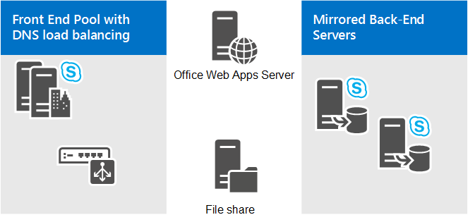

# 規劃商務用 Skype Server 的會議拓撲
 
**摘要：** 閱讀此主題以瞭解如何在商務用 Skype Server 中規劃會議拓撲。
  
本主題說明商務用 Skype Server 中的會議拓撲基礎：
  
- 支援的拓撲
    
- 電話撥入式會議考慮
    
- Web 會議考慮
    
- 大型會議的需求
    
如需硬體和軟體需求的詳細資訊，請參閱 [商務用 Skype Server 中會議的硬體和軟體需求](hardware-and-software-requirements.md)。
  
## 支援的拓撲

在商務用 Skype Server 中，執行會議服務的伺服器一定會組合前端伺服器或 Standard Edition server。 當您部署商務用 Skype Server 時，系統會自動部署 IM 會議功能。 您可以使用拓撲產生器，指定是否要部署 web、音訊和影片 (A/V) 和電話撥入式會議。 您也可以使用拓撲產生器，將會議新增至現有的部署。 如需拓撲基礎和組合案例的詳細資訊，請參閱 [適用于商務用 Skype Server 的拓撲基礎](../../plan-your-deployment/topology-basics/topology-basics.md)。
  
您可以在下列拓撲和設定中部署會議：
  
- 商務用 Skype Server Standard Edition
    
- 商務用 Skype Server Enterprise Edition
    
- 有或沒有 Enterprise Voice
    
## 電話撥入式會議考慮

若要部署電話撥入式會議，您必須考慮下列事項：
  
- 電話撥入式會議需要轉送伺服器才能在商務用 Skype Server 與 PSTN 閘道之間的某些設定) 中，轉譯 (和媒體，以及在轉送伺服器和 PSTN 閘道之間轉譯信號和媒體的 PSTN 閘道。
    
   在設定電話撥入式會議之前，您必須先部署 Enterprise Voice 或轉送伺服器，並至少部署下列其中一項：
    
  - PSTN 閘道
    
  - IP-PBX
    
  - 透過設定 SIP 主幹) 所連接的網際網路電話語音服務提供者 (SBC)  (的會話邊界控制器
    
- 您可以在中央網站部署應用程式服務、會議應答應用程式和會議宣告應用程式，但不能在分支網站中。
    
- 您必須在每個部署商務用 Skype Server 會議的集區中部署電話撥入式會議。 您不需要在每個集區中指派存取號碼，但是您必須在每個集區中部署電話撥入式會議功能。 當使用者呼叫一個集區中的存取號碼，以在不同的集區加入商務用 Skype Server 會議時，此需求即支援記錄的名稱功能。 
    
如需詳細資訊，請參閱 [在商務用 Skype Server 中規劃撥入式會議](dial-in-conferencing.md)。
  
## Web 會議考慮

Web 會議需要下列專案： 
  
- 存取檔案存放區，以用來儲存 Web 會議內容。
    
- 與 Office Web Apps Server/Office Online Server 整合，這是在會議期間共用 PowerPoint 檔案所需的。
    
> [!NOTE]
> Office Web Apps Server 的最新小小小，稱為 Office Online Server，它是由商務用 Skype Server 所支援。 如需詳細資訊，請參閱 [Office Online Server 檔](/officeonlineserver/office-online-server)。 
  
商務用 Skype 伺服器提供下列方式來設定 Office Web Apps Server/Office Online Server。 視您的需求而定，您可以：
  
- **安裝商務用 Skype Server 和 Office Web Apps Server/Office Online 伺服器內部部署（位於組織防火牆之後和相同網路區域）。** 透過此拓撲，將會透過您的反向 proxy 伺服器提供外部的 Office Web Apps Server/Office Online 伺服器的存取權。 理想狀況下，您應該在與商務用 Skype 伺服器相同的網路區域中安裝 Office Web Apps Server/Office Online Server。
    
    外部商務用 Skype 用戶端可以使用反向 proxy 伺服器（該伺服器會接受來自網際網路的要求，並將它們轉寄給內部網路），連線至商務用 Skype Server 和 Office Web Apps Server/Office Online Server。  (內部用戶端不需要使用反向 proxy 伺服器，因為他們可以直接連線到 Office Web Apps Server/Office Online Server。如果您想要使用專用的 Office Web Apps Server/Office Online Server 伺服器陣列（僅供商務用 Skype Server 使用），則 ) 此拓撲最適合運作。
    
- **使用外部部署的 Office Web Apps Server/Office Online 伺服器。** 在此拓撲中，商務用 Skype 伺服器會部署在內部部署，並使用在商務用 Skype Server 網路區域以外部署的 Office Web Apps Server/Office Online 伺服器。 如果 Office Web Apps Server/Office Online 伺服器在公司中的多個應用程式之間共用，而且部署在需要商務用 Skype 伺服器的網路中，以使用 Office Web Apps Server/Office Online Server 的外部介面，則可能會發生這種情況。
    
    您不需要安裝反向 proxy 伺服器;相反地，所有來自 Office Web Apps Server/Office Online 伺服器的要求，都是透過您的 Edge Server 路由傳送。 您的內部和外部商務用 Skype 用戶端都使用外部 URL 連線到 Office Web Apps Server/Office Online Server。
    
    如果 Office Web Apps Server/Office Online Server 部署在您的內部防火牆外，請選取 [ **Office Web Apps server] 部署在拓撲產生** 器中的外部網路 (，也就是周邊/網際網路) 。
    
如需詳細資訊，請參閱 [設定商務用 Skype server 中的 Office Web Apps server 整合](../../deploy/deploy-conferencing/office-web-app-server.md)。 
  
不論您選取的拓撲為何，開啟正確的防火牆埠都很重要。 您必須確定，Office Web Apps Server/Office Online Server、負載平衡器或商務用 Skype Server 上的防火牆沒有封鎖 DNS 名稱、IP 位址和埠。
  
> [!NOTE]
> 提供外部存取 Office Web Apps Server/Office Online 伺服器的另一個選項是在周邊網路中部署伺服器。 如果您選擇執行這項操作，請記住，Office Web Apps Server/Office Online Server 安裝程式需要伺服器電腦成為 Active Directory 網域的成員。 除非您的網路原則允許周邊網路中的電腦成為 Active Directory 網域成員，否則建議您不要在周邊網路中安裝 Office Web Apps Server/Office Online Server。 相反地，您應該在內部網路上安裝 Office Web Apps Server/Office Online Server，並透過反向 proxy 伺服器提供外部使用者存取。 
  
## 大型會議的拓撲需求

單一大型會議需要至少一部前端伺服器和一部後端伺服器。 不過，為了提供高可用性，我們建議使用兩部前端伺服器集區和鏡像後端伺服器，如下圖所示：
  
**大型會議拓撲**

  
主控大型會議的使用者必須擁有位於前端集區中的使用者帳戶。 不過，我們不建議您在此集區中主控其他使用者帳戶。 而只是用於大型會議。 最佳作法是在此集區中建立特殊的使用者帳戶，僅供主控大型會議使用。 因為大型會議設定已經針對效能進行優化，所以以一般使用者的身分使用它時，可能會發生問題，例如，當涉及 PSTN 端點時，無法將 P2P 會話提升為會議。
  
若要管理恰好兩部前端伺服器的集區，需要一些特殊的考慮。 如需詳細資訊，請參閱適用于商務用 Skype server [2015 的拓撲基礎](../../plan-your-deployment/topology-basics/topology-basics.md) 和 [商務用 skype Server 2015 的參考拓撲](../../plan-your-deployment/topology-basics/reference-topologies.md)。
  
此外，如果您想要選擇性地為大型會議所用的集區提供嚴重損壞修復備份和容錯移轉，您可以將它與不同資料中心的專用集區配對。 如需詳細資訊，請參閱 [在商務用 Skype Server 中規劃高可用性和嚴重損壞修復](../../plan-your-deployment/high-availability-and-disaster-recovery/high-availability-and-disaster-recovery.md)。
  
拓撲的其他注意事項包括：
  
- 需要有檔案共用，才能儲存會議內容，以及在部署及啟用封存伺服器時儲存封存檔。 檔案共用可以專用於集區，也可以是部署集區之網站上其他集區所使用的相同檔案共用。 如需設定檔案共用的詳細資訊，請參閱 [在商務用 Skype Server 2015 中建立檔案共用](../../deploy/install/create-a-file-share.md)。
    
- 若要在大型會議中啟用 PowerPoint 簡報功能，必須使用 Office Web Apps Server/Office Online 伺服器。 您可以將 Office Web Apps Server/Office Online 伺服器專用於大型會議集區，也可以是部署專用集區之網站上其他集區所使用的 Office Web Apps Server/Office Online 伺服器。 如需詳細資訊，請參閱 [設定商務用 Skype server 中的 Office Web Apps server 整合](../../deploy/deploy-conferencing/office-web-app-server.md)。 
    
- 前端伺服器的負載平衡需要對 HTTP 流量 (例如「會議內容下載) 」的硬體負載平衡。 建議使用 DNS 負載平衡進行 SIP 流量。 如需詳細資訊，請參閱 [商務用 Skype 的負載平衡需求](../../plan-your-deployment/network-requirements/load-balancing.md)。 
    
- 如果您想要針對專用的大型會議集區使用監控伺服器，我們建議使用監控伺服器及其在商務用 Skype Server 部署中的所有前端伺服器集區共用的資料庫。 如需詳細資訊，請參閱 [Plan for monitoring In 商務用 Skype Server](../../plan-your-deployment/monitoring.md)。
