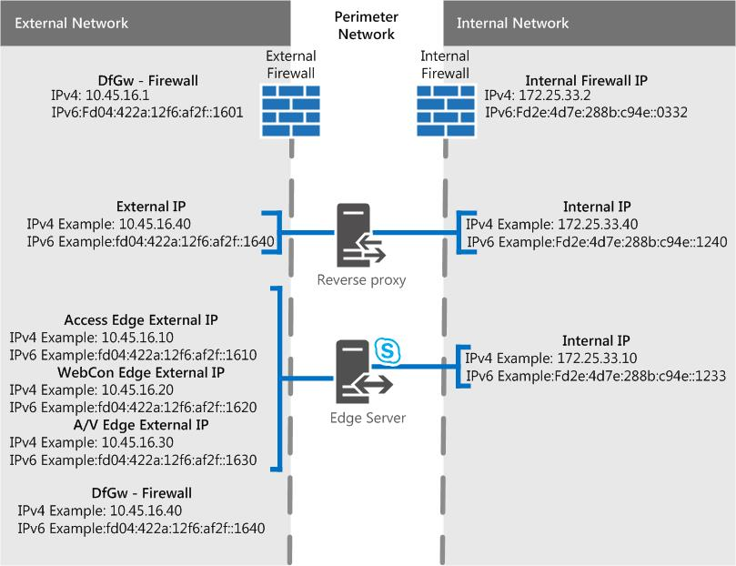

# 商務用 Skype Server 中的邊緣伺服器案例
 
**摘要：** 請複習這些案例，協助您規劃商務用 Skype Server 中的邊緣伺服器拓撲。
  
我們有一些案例圖表，可協助在您想要實施哪種商務用 Skype Server Edge 伺服器拓撲中進行視覺化和決定。 挑選好的候選方案之後，您就可以開始瞭解您需要解決的環境需求。 下列是適用于任何案例，因此我們先將它提及。
  
這些數位僅針對範例所示（也就是包含範例 IPv4 與 IPv6 資料），不代表實際的通訊流程，而是您可能的流量的高層次視圖。 您也可以在下列每個案例的埠圖表中看到埠詳細資料。
  
圖表會針對內部介面與 .net （也就是樣本圖）顯示 .com;當然，當您要將自己的最終邊緣方案放在一起時，您自己的專案可能會有很大的差異。
  
在任何圖表中，我們不會包含主管（這是一個選用元件），但您可以單獨閱讀此資訊（在其他規劃主題中提到）。
  
如前所述，圖表中有範例 IPv6 資料。 在[商務用 Skype server 中規劃 Edge 伺服器部署](edge-server-deployments.md)的大部分檔將會參照 IPv4，但如果您想要使用 IPv6，您肯定會受到支援。 請注意，您在指派的位址空間中需要 IPv6 位址，而且它們必須與 IPv4 Ip 一樣使用內部和外部定址。 您可以在 Windows 中使用雙堆疊功能，這是適用于 IPv4 和 IPv6 的獨立且獨特的網路堆疊。 如果您需要的話，這會讓您同時指派 IPv4 與 IPv6 位址。
  
NAT 裝置允許使用 NAT64 （IPv6 到 IPv4）與 NAT66 （IPv6 到 IPv6）），而且這對搭配商務用 Skype Server 而言是有效的。
  
> [!IMPORTANT]
> 如果您使用的是「通話許可控制」（CAC），則必須在內部介面上使用 IPv4 才能運作。 
  
## 單一整合的商務用 Skype Server Edge 伺服器（含私人 IP 位址和 NAT）

在這個案例中，沒有高可用性的選項。 這將意味著您在硬體上的花費較少，且部署更簡單。 如果必須具備高可用性，請參閱下方的伸縮合併案例。
  

  
### 埠圖表

我們也為單一整合邊緣伺服器的埠建立圖表。
  

  
## 單一整合的商務用 Skype Server Edge 伺服器與公用 IP 位址

在這個案例中，沒有高可用性的選項。 這將意味著您在硬體上的花費較少，且部署更簡單。 如果必須具備高可用性，請參閱下方的伸縮合併案例。
  

  
### 埠圖表

我們也為單一整合邊緣伺服器的埠建立圖表。
  

  
## 已調整整合的商務用 Skype Server Edge 池（含 DNS 負載平衡），以及私人 IP 位址和 NAT

在這種情況下，您可以在 Edge 部署中取得高可用性，這可讓您有伸縮性和容錯移轉支援的優點。
  

  
### 埠圖表

我們也有一個使用 DNS 負載平衡來調整整合的邊緣池的圖表。
  

  
## 使用 DNS 負載平衡與公用 IP 位址調整整合的商務用 Skype Server Edge 池

在這種情況下，您可以在 Edge 部署中取得高可用性，這可讓您有伸縮性和容錯移轉支援的優點。
  

  
### 埠圖表

我們也有一個使用 DNS 負載平衡來調整整合的邊緣池的圖表。
  

  
## 已調整整合的商務用 Skype Server Edge 池（含硬體負載平衡）

在這種情況下，您可以在 Edge 部署中取得高可用性，這可讓您有伸縮性和容錯移轉支援的優點。
  

 
