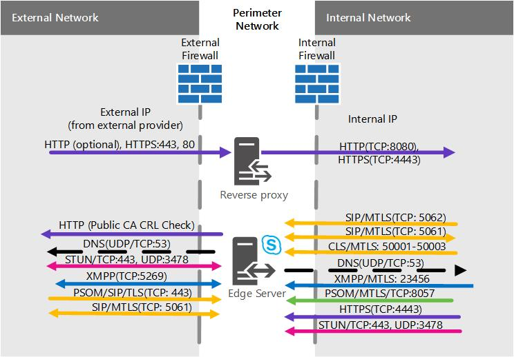

# 商務用 Skype Server 中的 Edge Server 案例
 
**摘要：** 請複習下列案例，以協助您規劃商務用 Skype Server 中的 Edge Server 拓撲。
  
我們有一些案例圖表可協助您瞭解所要執行商務用 Skype Server Edge Server 拓撲的視覺化和決定。 當您挑選好候選人後，您就可以深入瞭解您必須解決的環境需求。 以下是適用于任何案例的情形，因此我們先將其提及。
  
這兩個圖只是 (的範例，也包含 IPv4 和 IPv6 資料) 的範例，不代表實際的通訊流程，而是可能流量的高層級視圖。 在下列每個案例的埠圖表中，也可以看到埠的詳細資料。
  
圖表會為內部的外部介面及 .net 顯示 .com，也就是範例材料;當然，當您將自己的最後 Edge 計畫放在一起時，您自己的專案可能會非常不同。
  
在任何圖表中，我們不會包含 Director (，也就是選用元件) ，但是您可以另行閱讀， (其他規劃主題) 中所述。
  
如以上所述，圖表中有 IPv6 資料的範例。 在[商務用 Skype Server 中規劃 Edge Server 部署](edge-server-deployments.md)的大部分檔都是指 IPv4，但是如果您想要使用 IPv6，則您肯定可以支援。 請注意，您必須在指派的位址空間中使用 IPv6 位址，而且必須使用內部和外部定址，如使用 IPv4 IPs。 Windows，您可以使用雙堆疊功能，也就是 IPv4 和 IPv6 的個別且獨特的網路堆疊。 這會在您需要時，允許您同時指派 IPv4 和 IPv6 位址。
  
有 NAT 裝置允許 NAT64 (IPv6 IPv4) 和 NAT66 (IPv6 IPv6，而且這種裝置可搭配) ) 使用。
  
> [!IMPORTANT]
> 如果您要使用「通話許可控制」 (CAC) 您必須使用內部介面上的 IPv4 才能正常運作。 
  
## 單一合併的商務用 Skype Server Edge Server，具有私人 IP 位址和 NAT

在此案例中，高可用性沒有任何選項可供使用。 這表示您在硬體上花費的時間較少，且部署變得更簡單。 如果有高可用性必須，請參閱下列縮放合併的案例。
  

  
### 埠圖表

我們也有一個用於單一合併 Edge Server 之埠的圖表。
  

  
## 具有公用 IP 位址的單一合併商務用 Skype Server Edge Server

在此案例中，高可用性沒有任何選項可供使用。 這表示您在硬體上花費的時間較少，且部署變得更簡單。 如果有高可用性必須，請參閱下列縮放合併的案例。
  

  
### 埠圖表

我們也有一個用於單一合併 Edge Server 之埠的圖表。
  

  
## 調整式合併商務用 Skype Server Edge 集區，使用 DNS 負載平衡，以及私人 IP 位址和 NAT

在此案例中，您可以在 Edge 部署中擁有高可用性，這可讓您提高可擴充性和容錯移轉支援的優點。
  

  
### 埠圖表

我們也會有調整式合併 Edge 集區的圖表，使用 DNS 負載平衡。
  

  
## 調整式合併商務用 Skype Server Edge 集區，使用 DNS 負載平衡和公用 IP 位址

在此案例中，您可以在 Edge 部署中擁有高可用性，這可讓您提高可擴充性和容錯移轉支援的優點。
  

  
### 埠圖表

我們也會有調整式合併 Edge 集區的圖表，使用 DNS 負載平衡。
  

  
## 調整式合併商務用 Skype Server Edge 集區，使用硬體負載平衡

在此案例中，您可以在 Edge 部署中擁有高可用性，這可讓您提高可擴充性和容錯移轉支援的優點。
  

 
