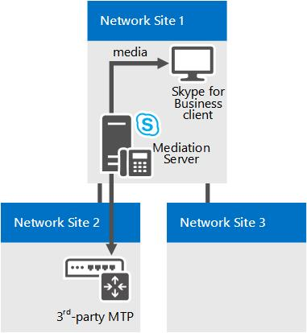

# 商務用 Skype 中通話許可控制的元件和拓撲

如果您有 MPLS 網路、SIP 主幹或協力廠商 PSTN 閘道或 PBX，請規劃通話許可控制 (CAC) 。 適用于商務用 Skype Server 企業語音。

本節中的主題提供部署通話許可控制 (CAC) 並搭配各種網路拓撲之特殊考量的相關資訊。

## MPLS 網路上的通話許可控制

在多重通訊協定標籤交換 (Multiprotocol Label Switching，MPLS) 網路中，所有網站都由完整網狀 (Full-Mesh) 連線。也就是，所有網站都會直接連線至網際網路服務提供者的 MPLS 骨幹，而且每個網站都已佈建要透過 MPLS 雲端的 WAN 連結使用的頻寬。沒有網路集線器或中央網站可控制 IP 路由。下圖顯示以 MPLS 技術為基礎的簡易網路。

**MPLS 網路範例**

若要在 MPLS 網路中部署通話許可控制 (CAC)，您可建立網路地區代表 MPLS 雲端，以及建立網路網站代表每個 MPLS 衛星網站。下圖說明如何設定網路地區和網路網站以代表上圖中的 MPLS 網路範例。整體頻寬限制和頻寬工作階段限制都是以從每個網路網站連至代表 MPLS 雲端之網路地區的 WAN 連結為基礎。

**MPLS 網路的網路地區和網路網站**

## SIP 主幹上的通話許可控制

若要在 SIP 主幹上部署通話許可控制 (CAC)，您必須建立代表網際網路電話語音服務提供者 (ITSP) 的網路網站。若要在 SIP 主幹上套用頻寬原則值，您可以在企業中的網路網站與您建立以代表 ITSP 的網路網站之間，建立網站間原則。

下圖顯示在 SIP 主幹上部署 CAC 的範例。

**SIP 主幹上的 CAC 組態**

若要在 SIP 主幹上設定 CAC，您必須在 CAC 部署期間執行下列工作：

1. 建立代表 ITSP 的網路網站。讓此網路網站與適當的網路地區相關聯，並為此網路網站的音訊與視訊功能配置零的頻寬。如需詳細資訊，請參閱部署文件中的＜[Configure Network Sites for CAC](/previous-versions/office/lync-server-2013/lync-server-2013-configure-network-sites-for-cac)＞。

    > [!NOTE]
    > 對 ITSP 而言，此網路網站組態沒有作用。頻寬原則值實際是在步驟 2 套用。

2. 針對您在步驟 1 建立的網站使用相關的參數值，建立 SIP 主幹的網站間連結。 例如，您可以使用企業中網路網站的名稱作為 NetworkSiteID1 參數的值，並以 ITSP 網路網站作為 NetworkSiteID2 參數的值。 如需詳細資訊，請參閱部署檔中的[商務用 Skype Server 建立網路站間原則](../../deploy/deploy-enterprise-voice/create-network-intersite-policies.md)，以及[新的-CsNetworkInterSitePolicy](/powershell/module/skype/new-csnetworkintersitepolicy?view=skype-ps)。

3. 從 ITSP 取得會話邊界控制器的 (SCB) 媒體端接點的 IP 位址。 將該子網路遮罩為32的 IP 位址，新增至代表 ITSP 的網路網站。 如需詳細資訊，請參閱 [建立子網與網路網站的關聯](/previous-versions/office/lync-server-2013/lync-server-2013-associate-a-subnet-with-a-network-site)。

## 使用協力廠商 PSTN 閘道或 PBX 的通話許可控制

本主題說明如何在轉送伺服器的閘道介面和協力廠商公用交換電話網路 (PSTN) 閘道或專用交換機 (PBX) 之間的連結上，部署通話許可控制 (CAC) 的範例。

### 案例1：轉送伺服器和 PSTN 閘道之間的 CAC

CAC 可以從轉送伺服器閘道介面到協力廠商 PBX 或 PSTN 閘道的 WAN 連結上部署。

**案例1：轉送伺服器和 PSTN 閘道之間的 CAC**

在此範例中，轉送伺服器和 PSTN 閘道之間會套用 CAC。 如果網路 site 1 上的商務用 Skype 用戶端使用者在網路 site 2 中透過 pstn 閘道撥打 pstn 電話，媒體會透過 WAN 連結進行流量。 因此，每個 PSTN 會話會執行兩個 CAC 檢查：

- 商務用 Skype 用戶端應用程式與轉送伺服器之間

- 轉送伺服器和 PSTN 閘道之間

這適用于網路 Site 1 中的用戶端傳入 PSTN 通話，以及來自網路 Site 1 中用戶端應用程式的撥出 PSTN 通話。

> [!NOTE]
> 確定 PSTN 閘道所屬的 IP 子網已經過設定，並與網路網站2相關聯。

> [!NOTE]
> 請確定轉送伺服器的兩個介面都屬於的 IP 子網已設定，並與網路網站1產生關聯。

> [!NOTE]
> 如需詳細資訊，請參閱 [建立子網與網路網站的關聯](/previous-versions/office/lync-server-2013/lync-server-2013-associate-a-subnet-with-a-network-site)。

### 案例2：轉送伺服器和具有媒體終止點之協力廠商 PBX 之間的 CAC

這種設定與案例1類似。 在這兩種情況下，轉送伺服器都知道在 WAN 連結的相對端終止媒體的方式，以及 PSTN 閘道或 PBX 的 IP 位址，以及具有媒體終止點 (MTP) 會在轉送伺服器上設定為下一個躍點。

**案例2：轉送伺服器和具有 MTP 之協力廠商 PBX 之間的 CAC**

在此範例中，轉送伺服器和 PBX/MTP 之間會套用 CAC。 如果網路 site 1 上的商務用 Skype 用戶端使用者會透過位於網路 site 2 的 PBX/MTP 來撥打 PSTN 電話，媒體會透過 WAN 連結進行。 因此，每個 PSTN 會話都會執行兩個 CAC 檢查：

- 商務用 Skype 用戶端應用程式與轉送伺服器之間

- 轉送伺服器和 PBX/MTP 之間

這適用于對網路 Site 1 中的用戶端進行傳入 PSTN 通話，以及發自來自網路 Site 1 之用戶端的傳出 PSTN 通話。

> [!NOTE]
> 確定 MTP 所屬的 IP 子網已經過設定，並與網路網站2相關聯。

> [!NOTE]
> 請確定轉送伺服器的兩個介面都屬於的 IP 子網已設定，並與網路網站1產生關聯。

> [!NOTE]
> 如需詳細資訊，請參閱 [建立子網與網路網站的關聯](/previous-versions/office/lync-server-2013/lync-server-2013-associate-a-subnet-with-a-network-site)。

### 案例3：轉送伺服器和不具有媒體終端點之協力廠商 PBX 之間的 CAC

Case 3 與前兩個案例稍有不同。 如果在協力廠商 PBX 上沒有 MTP，轉送伺服器不會知道媒體在 PBX 界限中將終止的哪個位置。 在此情況下，媒體會直接流過轉送伺服器和協力廠商端點裝置。

**案例3：轉送伺服器和不具有 MTP 之協力廠商 PBX 之間的 CAC**

在此範例中，如果網路 Site 1 的商務用 Skype 用戶端使用者透過 PBX 呼叫使用者，則轉送伺服器只能在商務用 Skype 用戶端應用程式與轉送伺服器) 之間的 proxy 支線 (上執行 CAC 檢查。 因為在要求會話時，轉送伺服器沒有端點裝置的相關資訊，所以在建立通話之前，無法在轉送伺服器和協力廠商) 端點之間的 WAN 連結 (上執行 CAC 檢查。 在建立會話後，轉送伺服器會為主幹使用的頻寬進行會計核算。

針對來自協力廠商端點的呼叫，在會話要求時可使用該端點裝置的相關資訊，同時也可以在轉送伺服器的兩側執行 CAC 檢查。

> [!NOTE]
> 確定端點裝置所屬的 IP 子網已經過設定，並與網路網站2相關聯。

> [!NOTE]
> 請確定轉送伺服器的兩個介面都屬於的 IP 子網已設定，並與網路網站1產生關聯。

> [!NOTE]
> 如需詳細資訊，請參閱 [建立子網與網路網站的關聯](/previous-versions/office/lync-server-2013/lync-server-2013-associate-a-subnet-with-a-network-site)。