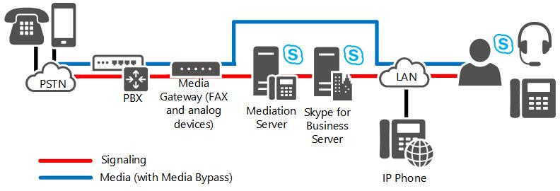

# 在商務用 Skype Server 中的直接 SIP 連線

商務用 Skype Server 和兩部 PSTN 閘道和 Enterprise Voice IP-PBX 都支援直接 SIP 連線。

您可以使用直接 SIP 連線，將商務用 Skype 伺服器連線至下列其中一項：

- IP-PBX

- PSTN 閘道

若要實作直接 SIP 連線，基本上遵循您用於實作 SIP 主幹的相同部署步驟。 在這兩種情況下，您可以使用轉送伺服器的外部介面來執行連線。 唯一的差異在於您將 SIP 主幹連線至外部實體 (如 ITSP 閘道)，而將直接 SIP 連線連接至區域網路中的內部實體 (如 IP-PBX 或公用交換電話網路 (PSTN) 閘道)。

## 直接 SIP 部署選項

### 商務用 Skype Server Stand-Alone

如果您的組織使用本節所述的其中一個部署，您可以使用商務用 Skype 伺服器做為組織的一部分或所有組織的唯一電話語音解決方案。 本節詳細說明下列部署：

- **漸進式部署：** 此選項假設您有現有的私人分公司 exchange (PBX) 基礎結構，而您想要將 Enterprise Voice 逐步引入組織中較小的群組或小組。

- **僅限 VoIP 部署：** 此選項假設您考慮在沒有傳統電話語音基礎結構的網站上部署 Enterprise Voice。

#### 漸進式部署

在漸進式部署中，商務用 Skype 伺服器是個別小組或部門的唯一電話語音解決方案，而組織中的其他使用者仍會繼續使用 PBX。 這項增量部署策略提供一種方法，透過控制的試驗計畫，將 IP 電話語音引入您的企業。 Microsoft 整合通訊最適合使用其通訊的工作組會移至 Enterprise Voice，其他使用者仍會保留在現有的 PBX 上。 其他的工作組可以視需要遷移至 Enterprise Voice。

如果您明確定義的使用者群組具有共同的通訊需求，且其本身適用于集中式管理，則建議使用 [累加] 選項。 如果您擁有遍佈地理區域的團隊或部門，而且在長途計費中的節約成本可能很大，此選項也會有效。 實際上，此選項對於建立其成員可能分散在全球的虛擬小組非常有用。 您可以建立、修改或 disband 這類團隊，以快速回應轉向的業務需求。

下圖顯示在 PBX 背後部署 Enterprise Voice 的一般拓撲。 這是增量部署的建議拓撲。

**漸進式部署選項**

> [!NOTE]
> 如果您要將商務用 Skype Server 部署連接至認可的 Direct SIP 夥伴，則不需要在轉送伺服器和 PBX 之間使用公用交換電話網路 (PSTN) 閘道。 如需認證直接 SIP 夥伴的清單，請參閱  [Microsoft 整合通訊開啟互通性計畫](https://go.microsoft.com/fwlink/p/?linkId=203309)。

> [!NOTE]
> 在此圖中所示的媒體路徑已啟用媒體旁路 (建議的設定) 。 如果您選用停用媒體旁路，媒體路徑會透過轉送伺服器進行路由傳送。

在此拓撲中，會為企業語音啟用選取的部門或工作組。 PSTN 閘道會將 Voice over Internet Protocol (VoIP 已啟用) 的 workgroup 連結至 PBX。 已啟用 Enterprise Voice （包括遠端工作者）的使用者在 IP 網路之間進行通訊。 由 Enterprise Voice 使用者對 PSTN 及未啟用 Enterprise Voice 的同事進行呼叫會路由傳送至適當的 PSTN 閘道。 來自位於 PBX 系統或 PSTN 之來電者的同事的來電會路由傳送至 PSTN 閘道，而該閘道會將通話轉寄給用於路由傳送的商務用 Skype Server。

有兩個建議設定，可將 Enterprise Voice 連接至現有的 PBX 基礎結構，以進行互通性：在 PBX 前端和 Enterprise Voice 之後的 Enterprise voice。

#### PBX 背後的 Enterprise Voice

當 Enterprise Voice 部署在 PBX 背後時，所有來自 PSTN 的呼叫都會到達 PBX，這會將呼叫傳送至 Enterprise Voice 使用者到 PSTN 閘道，並呼叫 PBX 使用者至 PBX。

#### PBX 前端的 Enterprise Voice

當 Enterprise Voice 部署在 PBX 的前方時，所有呼叫都會到達 PSTN 閘道，這會將 Enterprise Voice 使用者的通話路由傳送至商務用 Skype Server，並將 PBX 使用者叫用到 PBX。 從 Enterprise Voice 和 PBX 使用者呼叫 PSTN 會透過 IP 網路路由傳送至最具成本效益的 PSTN 閘道。 下表顯示此設定的優點和缺點。

**在 PBX 前面部署企業語音的優缺點**

|**優點**|**缺點**|
|:-----|:-----|
|PBX 仍可為未啟用 Enterprise Voice 的使用者提供服務。    |現有的閘道可能不支援您想要的功能或容量。    |
|PBX 處理所有舊版裝置。    |需要從閘道到 PBX 的主幹，以及從閘道到轉送伺服器。 您可能需要從服務提供者獲得更多主幹。    |
|Enterprise Voice 使用者保留相同的電話號碼。    |   |

#### VoIP-Only 部署

Enterprise Voice 可提供新的企業，以及現有公司的新 office 網站，並有機會實施功能齊全的 VoIP 解決方案，而不需要擔心 PBX 整合或產生 IP-PBX 基礎結構的實際部署及維護成本。 此解決方案同時支援現場和遠端工作者。

在此部署中，所有呼叫都會透過 IP 網路路由傳送。 PSTN 的來電會路由傳送至適當的 PSTN 閘道。 商務用 Skype 或 Lync Phone Edition 是做為 softphone 的服務。 因為沒有 PBX 電話供使用者控制，所以遠端呼叫控制無法使用且不需要。 語音信箱和自動語音應答服務可透過選用 Exchange 整合通訊 (UM) 進行部署。

> [!NOTE]
> 除了支援商務用 Skype Server 所需的網路結構之外，僅 VoIP 部署也可以使用小型的合格閘道來支援傳真機器和類比裝置。

下圖顯示僅限 VoIP 部署的一般拓撲。

**僅限 VoIP 部署選項**

> [!NOTE]
> 在此圖中所示的媒體路徑已啟用媒體旁路 (建議的設定) 。 如果您選用停用媒體旁路，媒體路徑會透過轉送伺服器進行路由傳送。

## PSTN 閘道部署選項

### PSTN 閘道

公用交換電話網路 (PSTN) 閘道是協力廠商硬體元件，可直接或透過連接至 SIP 主幹，在企業語音基礎結構與 PSTN 之間轉譯信號和媒體。 在任一拓撲中，閘道會終止 PSTN。 閘道會隔離在其自己的子網中，並透過轉送伺服器連線至商業網路。

具有多個網站的企業通常會在每個網站上部署一或多個閘道。 分支網站可以透過閘道或透過 Survivable 分支裝置連接至 PSTN，此裝置會將閘道和伺服器結合到單一方塊中。 如果分支網站使用閘道，則網站上必須有註冊機構和轉送伺服器，除非 WAN 連結可復原。 在前端伺服器上組合的一或多個轉送伺服器，可在每個網站上路由傳送一或多個閘道的來電。 建議將網站上的註冊機構、轉送伺服器和閘道部署為 Survivable 分支裝置。

決定 PSTN 閘道的數量、大小和位置可能是規劃企業語音基礎結構時必須進行的最重要且昂貴的決策。

以下是需要考慮的主要問題。 請記住，這些問題的答案都是相互依賴的

- 需要多少 PSTN 閘道？ 其答案取決於使用者數目、預期同時通話的數目 (流量負載) ，以及每個網站 (的網站數目) 一個。

- 閘道應該是什麼大小？ 其答案取決於網站上的使用者人數及流量負載。

- 閘道應位於何處？ 其答案部分取決於拓撲，以及組織地理位置發佈的部分。

  您也應該考慮閘道拓撲選項 (如需詳細資訊，請參閱本主題稍後的閘道拓撲) 。

#### M:N 主幹支援

轉送伺服器可以透過多個閘道、會話邊界控制器 (SBCs) Internet 電話語音服務提供者所提供的電話，或是二者的組合，進行路由傳送。 此外，集區中的多個轉送伺服器可以與多個閘道互動。 在轉送伺服器與閘道之間定義的邏輯路由稱為主幹。 當內部使用者加入 PSTN 通話時，前端集區上的輸出路由邏輯會選擇哪一個主幹可路由傳送該特定通話的所有可能可使用的組合。 使用 DNS 負載平衡，如果呼叫因集區中的特定轉送伺服器問題而無法抵達閘道，則會將此呼叫重試至集區中的替代轉送伺服器。

如需規劃多個閘道的詳細資訊，請參閱 [M:N 主幹 In 商務用 Skype Server](m-n-trunk.md)。

如需其他輸出路由增強功能的詳細資訊，請參閱 [通話路由](https://technet.microsoft.com/library/a2ddf327-2ec4-407b-af0f-276f2b13eefd.aspx)。

#### 閘道拓撲

當您考慮閘道部署的基本問題時，請遵循下列步驟：

1. 使用 Enterprise Voice，計算您想要提供 PSTN 連線的網站數目。

2. 評估每個網站的流量 (使用者數目，以及每個使用者) 每小時平均通話數目。

3. 在每個網站部署一或多個閘道，以處理預期的流量。

透過此拓撲，每個網站和兩個網站之間的工作人員間的通話都會透過您的內部網路進行路由傳送。 對 PSTN 所進行的呼叫會透過企業 IP 網路路由傳送至最接近目的地號碼位置的閘道。不過，如果您的組織支援數十或數百甚至數千部的網站分散于一或多個洲，那麼許多金融機構和其他大型企業會這麼做？ 在這種情況下，在每個網站部署個別的閘道是不可行的。

若要解決此問題，許多大型公司喜歡部署一或多個大型電話語音中央網站。

在此拓撲中，會在每個中央網站上部署數個足以容納預期使用者負載的大型閘道。 企業的所有呼叫都是由公司的電話服務提供者轉接至中央網站。 中央網站的路由邏輯會決定是否要透過內部網路或 PSTN 路由傳送呼叫。

#### 閘道位置

閘道位置也可以決定您選擇的閘道類型及設定方式。 有許多 PSTN 通訊協定，都不是全球標準。 如果您的所有閘道都位於單一國家/地區內，這不是問題，但是如果您在多個國家/地區內找到閘道，則每個國家/地區都必須根據該國家/地區的 PSTN 標準進行設定。 此外，認證于中運作的閘道（例如，加拿大）可能無法在印度、巴西或歐盟進行認證。

#### 閘道大小和數目

大多陣列織會考慮採用從2到高達960埠的大小部署範圍的 PSTN 閘道。  (甚至更大的閘道，但是主要是由電話服務提供者使用。 ) 當您的組織需要的埠數目進行估計時，請使用下列指導方針：

- 每位使用者每小時一次 PSTN 通話的組織 (每小時一次 PSTN 通話) 應該為每15位使用者分配一個埠。 例如，如果您有20位使用者，則需要有兩個埠的閘道。

- 組織使用適中的電話語音流量 (每個使用者每小時兩個 PSTN 通話) 每10位使用者都應該為一個埠指派。 例如，如果您有100位使用者，則需要在一或多個閘道間分攤10個埠。

- 使用大量電話語音使用的組織 (每位使用者每小時三個或更多 PSTN 通話) 應該為每五位使用者分配一個埠。 例如，如果您有47000位使用者，則需要至少10個大型閘道中所分配的9400埠總數。

- 當您組織中的使用者人數或流量量增加時，可以取得額外的埠。

針對您必須支援的任何特定使用者數目，您可以選擇部署較少、更大的閘道或較小的閘道。 一般來說，如果一個閘道失敗時，建議至少有兩個組織閘道可維護可用性。

您部署的每個 PSTN 閘道都必須至少有一個對應的轉送伺服器。

