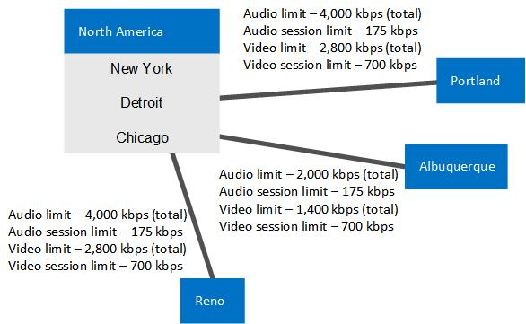
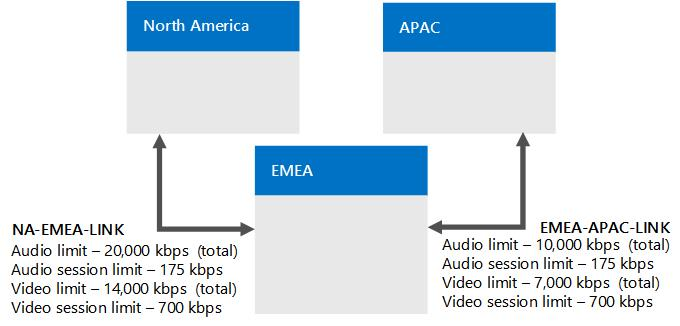

# 範例：在商務用 Skype Server 中收集通話許可控制需求Example: Gathering requirements for call admission control in Skype for Business Server

提供在商務用 Skype Server Enterprise Voice 中規劃通話許可控制的詳細範例，包括收集網路網站、地區和頻寬的相關資訊。Provides a detailed example of planning for call admission control in Skype for Business Server Enterprise Voice, including gathering information about your network's sites, regions, and bandwidth.

本範例顯示規劃及實作通話許可控制 (CAC) 的方式。概略而言，其中包含下列幾項活動：This example shows you how to plan for and implement call admission control (CAC). At a high level, this consists of the following activities:

1. 識別您的所有網路中樞與骨幹 (又稱為網路地區)。Identify all of your network hubs and backbones (known as network regions).

2. 識別將為每個網路地區管理 CAC 的商務用 Skype 伺服器中央網站。Identify the Skype for Business Server central site that will manage CAC for each network region.

3. 識別及定義連線至每個網路地區的網站。Identify and define the network sites that are connected to each network region.

4. 針對每個網路與 WAN 的連線受到頻寬限制的網站，請描述 WAN 連線的頻寬容量，以及網路系統管理員為商務用 Skype 伺服器媒體流量所設定的頻寬限制（如果適用）。For each network site whose connection to the WAN is bandwidth-constrained, describe the bandwidth capacity of the WAN connection and the bandwidth limits that to the network administrator has set for Skype for Business Server media traffic, if applicable. WAN 連線的頻寬不受限制的網站無須納入。You do not need to include sites whose connection to the WAN is not bandwidth-constrained.

5. 建立網路中每個子網路與網站間的關聯。Associate each subnet in your network with a network site.

6. 對應網路地區之間的連結。Map the links between the network regions. 針對每個連結，請描述其頻寬容量，以及網路系統管理員對商務用 Skype 伺服器媒體流量所放置的任何限制。For each link, describe its bandwidth capacity and any limits that the network administrator has placed on Skype for Business Server media traffic.

7. 定義每一組網路地區之間的路由。Define a route between every pair of network regions.

## 收集必要資訊Gather the Required Information

若要進行通話許可控制的準備工作，請收集下列步驟中所說明的資訊：To prepare for call admission control, gather the information described in the following steps:

1. 識別您的網路地區。網路地區可代表網路骨幹或網路中樞。Identify your network regions. A network region represents a network backbone or a network hub. 

    網路骨幹或網路中樞是電腦網路基礎結構之中可讓不同網路組件交互連線的部分，可提供路徑讓不同的 LAN 或子網路之間進行資訊交換。骨幹可連繫不同形式的網路，從小地方乃至於廣大的地理區域皆可。骨幹通常會比與之連接的網路有更大的容量。A network backbone or a network hub is a part of computer network infrastructure that interconnects various pieces of network, providing a path for the exchange of information between different LANs or subnets. A backbone can tie together diverse networks, from a small location to a wide geographic area. The backbone's capacity is typically greater than that of the networks connected to it.

    此處的範例拓撲具有三個網路地區：北美地區、EMEA 與 APAC。網路地區包含一個網站集合。請與您的網路系統管理員共同定義企業的網路地區。Our example topology has three network regions: North America, EMEA, and APAC. A network region contains a collection of network sites. Work with your network administrator to define the network regions for your enterprise.

2. 識別每個網路地區關聯的中央網站。Identify each network region's associated central site. 中央網站包含至少一部前端伺服器，也是商務用 Skype Server 部署，可管理透過網路地區之 WAN 連線的所有媒體流量的 CAC。A central site contains at least one Front End Server and is the Skype for Business Server deployment that will manage CAC for all media traffic that passes through the network region's WAN connection.

   **範例企業網路分成三個網路地區****An example enterprise network divided into three network regions**

     

    > [!NOTE]
    > Multiprotocol Label Switching (MPLS) 網路應呈現為每個地理位置皆有其對應網站的網路地區。A Multiprotocol Label Switching (MPLS) network should be represented as a network region in which each geographic location has a corresponding network site. 如需詳細資訊，請參閱 [商務用 Skype 中的通話許可控制元件和拓撲](components-and-topologies.md)。For details, see [Components and topologies for call admission control in Skype for Business](components-and-topologies.md). 

    在上述的網路拓撲範例中，有三個網路地區，每個地區都有管理 CAC 的商務用 Skype Server 中央網站。In the preceding example network topology, there are three network regions, each with a Skype for Business Server central site that manages CAC. 網路地區會依據地理位置鄰近性選出適當的中央網站。The appropriate central site for a network region is chosen by the geographic vicinity. 由於媒體流量最大之處是在網路地區內，因此若能位於鄰近之處，此中央網站將保有獨立運作性，且在其他中央網站無法使用時仍能持續運作。Because media traffic will be heaviest within network regions, the ownership by geographic vicinity makes it self-contained and will continue to be functional even if other central sites become unavailable. 

    在此範例中，名為芝加哥的商務用 Skype 部署為北美地區的中央網站。In this example, a Skype for Business deployment named Chicago is the central site for the North America region.

    北美所有的商務用 Skype 使用者皆位於芝加哥部署中的伺服器上。All Skype for Business users in North America are homed on servers in the Chicago deployment. 下表顯示三個網路地區的中央網站。The following table shows central sites for all three network regions.

    **網路地區及其關聯的中央網站****Network Regions and their Associated Central Sites**

    |**網路地區****Network Region**|**中央網站****Central Site**|
    |:-----|:-----|
    |北美地區North America    |ChicagoChicago    |
    |EmeaEMEA    |倫敦London    |
    |亞太APAC    |北京Beijing    |

    > [!NOTE]
    > 根據您的商務用 Skype 伺服器拓撲，相同的中央網站可以指派給多個網路地區。Depending on your Skype for Business Server topology, the same central site can be assigned to multiple network regions. 

3. 對於各個網路地區，識別 WAN 連線的頻寬不受限制的所有網站 (辦公室或地點)。由於這些網站的頻寬不受限制，因此您無須對其套用 CAC 頻寬原則。For each network region, identify all of the network sites (offices or locations) whose WAN connections are not bandwidth-constrained. Because these sites are not bandwidth constrained, you do not need to apply CAC bandwidth policies to them.

    在下表顯示的範例中，有三個網站不含頻寬受到限制的 WAN 連結：紐約、芝加哥與底特律。In the example shown in the following table, three network sites do not have bandwidth-constrained WAN links: New York, Chicago, and Detroit.

   **不受 WAN 頻寬限制的網站****Network Sites not Constrained by WAN Bandwidth**

   | **網站****Network Site** | **網路地區****Network Region**   |
   |:-----------------|:---------------------|
   | 紐約New York     | 北美地區North America    |
   | ChicagoChicago      | 北美地區North America    |
   | 底特律Detroit      | 北美地區North America    |

4. 對於各個網路地區，識別透過頻寬受到限制的 WAN 連結連線至網路地區的所有網站。For each network region, identify all of the network sites that connect to the network region through bandwidth-constrained WAN links.

    為了協助確保音訊與視訊品質，建議您讓這些頻寬受限的網站監控其 WAN，並使用會對網路地區的進出媒體流量 (聲音或視訊) 施加限制的 CAC 頻寬原則。To help ensure audio and video quality, we recommend that these bandwidth-constrained network sites have their WANs monitored and CAC bandwidth policies that limit media (voice or video) traffic flow to and from the network region.

    在下表顯示的範例中，有三個網站受到 WAN 頻寬的限制：波特蘭、雷諾與阿布奎基。In the example shown in the following table, there are three network sites that are constrained by WAN bandwidth: Portland, Reno and Albuquerque.

   **受 WAN 頻寬限制的網站****Network Sites Constrained by WAN Bandwidth**

   |**網站****Network Site**|**網路地區****Network Region**|
   |:-----|:-----|
   |阿爾伯克爾基Albuquerque    |北美地區North America    |
   |雷諾Reno    |北美地區North America    |
   |波特蘭Portland    |北美地區North America    |

   **CAC 網路地區「北美地區」，其中有三個網站不受頻寬限制 (芝加哥、紐約與底特律)，三個網站受 WAN 頻寬限制 (波特蘭、雷諾與阿布奎基)****CAC network region North America with three network sites that are unconstrained by bandwidth (Chicago, New York, and Detroit) and three network sites that are constrained by WAN bandwidth (Portland, Reno, and Albuquerque)**

     

5. 為每個頻寬受限的 WAN 連結決定下列項目：For each bandwidth-constrained WAN link, determine the following:

   - 您要為所有的並行音訊工作階段設定的整體頻寬限制。Overall bandwidth limit that you want to set for all concurrent audio sessions. 如果新的音訊會話會導致超過此限制，商務用 Skype 伺服器不允許會話開始。If a new audio session will cause this limit to be exceeded, Skype for Business Server does not allow the session to start.

   - 您要為每個個別音訊工作階段設定的頻寬限制。預設的 CAC 頻寬限制為 175 kbps，但系統管理員可加以修改。Bandwidth limit that you want to set for each individual audio session. The default CAC bandwidth limit is 175 kbps, but it can be modified by the administrator.

   - 您要為所有並行視訊工作階段設定的整體頻寬限制。Overall bandwidth limit that you want to set for all concurrent video sessions. 如果新的視頻會話會導致超過此限制，商務用 Skype 伺服器不允許會話開始。If a new video session will cause this limit to be exceeded, Skype for Business Server does not allow the session to start.

   - 您要為每個個別視訊工作階段設定的頻寬限制。預設的 CAC 頻寬限制為 700 kbps，但系統管理員可加以修改。Bandwidth limit that you want to set for each individual video session. The default CAC bandwidth limit is 700 kbps, but it can be modified by the administrator.

     **網站與 WAN 頻寬限制資訊 (頻寬以 kbps 為單位)****Network Sites with WAN Bandwidth Constraint Information (Bandwidth in kbps)**

     | **網站****Network Site**   | **網路地區****Network Region**   | **BW 限制****BW Limit**      | **音訊限制****Audio Limit**   | **音訊工作階段限制****Audio Session Limit** | **視訊限制****Video Limit**   | **視訊工作階段限制****Video Session Limit** |
     |:-------------------|:---------------------|:------------------|:------------------|:------------------------|:------------------|:------------------------|
     | 阿爾伯克爾基Albuquerque    | 北美地區North America    | 5,0005,000         | 2,0002,000         | 175175                 | 14001,400         | 700700                 |
     | 雷諾Reno           | 北美地區North America    | 10,00010,000        | 40004,000         | 175175                 | 28002,800         | 700700                 |
     | 波特蘭Portland       | 北美地區North America    | 5,0005,000         | 40004,000         | 175175                 | 28002,800         | 700700                 |
     | 紐約New York       | 北美地區North America    | (無限制)(no limit)    | (無限制)(no limit)    | (無限制)(no limit)          | (無限制)(no limit)    | (無限制)(no limit)          |
     | ChicagoChicago        | 北美地區North America    | (無限制)(no limit)    | (無限制)(no limit)    | (無限制)(no limit)          | (無限制)(no limit)    | (無限制)(no limit)          |
     | 底特律Detroit        | 北美地區North America    | (無限制)(no limit)    | (無限制)(no limit)    | (無限制)(no limit)          | (無限制)(no limit)    | (無限制)(no limit)          |

6. 為您網路中的每個子網路指定其關聯的網站。For every subnet in your network, specify its associated network site.

    > [!IMPORTANT]
    > 網路中的每個子網路都必須與一個網站相關聯，即使該網站的頻寬不受限亦然。這是因為「通話許可控制」會使用子網路資訊來判斷端點所在的網站。確認工作階段中雙方的所在位置後，「通話許可控制」即可判斷是否有足夠的頻寬可建立通話。在透過沒有頻寬限制的連結建立工作階段時，將會產生通知。Every subnet in your network must be associated with a network site, even if the network site is not bandwidth constrained. This is because call admission control uses subnet information to determine at which network site an endpoint is located. When the locations of both parties in the session are determined, call admission control can determine if there is sufficient bandwidth to establish a call. When a session is established over a link that has no bandwidth limits, an alert is generated. 

    > [!IMPORTANT]
    > 如果您部署了 Audio/Video Edge Server，則每個 Edge Server 的公用 IP 位址都必須與 Edge Server 部署所在的網站相關聯。If you deploy Audio/Video Edge Servers, the public IP addresses of each Edge Server must be associated with the network site where the Edge Server is deployed. A/V Edge Server 的每個公用 IP 位址，都必須在您的網路組態設定中新增為具有子網路遮罩 32 的子網路。Each public IP address of the A/V Edge Server must be added to your network configuration settings as a subnet with a subnet mask of 32. 例如，若您在「芝加哥」中部署了 A/V Edge Server，則應為這些伺服器的每個外部 IP 位址建立具有子網路遮罩 32 的子網路，並建立網站「芝加哥」與這些子網路的關聯。For example, if you deploy A/V Edge Servers in Chicago, then for each external IP address of those servers create a subnet with a subnet mask of 32 and associate network site Chicago with those subnets. 如需公用 IP 位址的詳細資訊，請參閱 [規劃商務用 Skype 的網路需求](../../plan-your-deployment/network-requirements/network-requirements.md)。For details about public IP addresses, see [Plan network requirements for Skype for Business](../../plan-your-deployment/network-requirements/network-requirements.md). 

    會引發重要狀態指示器 (KHI) 通知，指定存在於您的網路中，但未與子網路相關聯，或包含 IP 位址的子網路未與網站相關聯的 IP 位址清單。此通知在 8 小時內不會多次引發。以下是相關的通知資訊與範例：A Key Health Indicator (KHI) alert is raised, specifying a list of IP addresses that are present in your network but are either not associated with a subnet, or the subnet that includes the IP addresses is not associated with a network site. This alert will not be raised more than once within an 8 hour period. The relevant alert information and an example are as follows:

    **來源**：CS 頻寬原則服務 (核心)**Source**: CS Bandwidth Policy Service (Core) 

    **事件號碼**：36034**Event number**: 36034

    **層級**：2**Level**: 2

    **描述**：下列 IP 位址的子網： \<List of IP Addresses\> 未設定，或子網未與網路網站產生關聯。**Description**: The subnets for the following IP Addresses: \<List of IP Addresses\> are either not configured or the subnets are not associated to a network site. 

    **原因**：網路組態設定中遺漏對應 IP 位址的子網路，或是子網路未與網站相關聯。**Cause**: The subnets for the corresponding IP addresses are missing from the network configuration settings or the subnets are not associated to a network site. 

    **解決方法**：在網路組態設定中新增對應於前述 IP 位址清單的子網路，並建立每個子網路與網站的關聯。**Resolution**: Add subnets corresponding to the preceding list of IP addresses into the network configuration settings and associate every subnet to a network site.

    例如，如果通知中的 IP 位址清單指定了 10.121.248.226 與 10.121.249.20，表示這些 IP 位址未與子網路相關聯，或是與這些位址相關聯的子網路不屬於任何網站。如果 10.121.248.0/24 與 10.121.249.0/24 是這些位址的對應子網路，您可以透過下列方式解決此問題：For example, if the IP address list in the alert specifies 10.121.248.226 and 10.121.249.20, either these IP addresses are not associated with a subnet, or the subnet that they are associated with does not belong to a network site. If 10.121.248.0/24 and 10.121.249.0/24 are the corresponding subnets for these addresses, you can resolve this issue as follows:

    a.a. 確定 IP 位址 10.121.248.226 與 10.121.248.0/24 子網路相關聯，而 IP 位址 10.121.249.20 與 10.121.249.0/24 子網路相關聯。Be sure that IP address 10.121.248.226 is associated with the 10.121.248.0/24 subnet and IP address 10.121.249.20 is associated with the 10.121.249.0/24 subnet.

    b.b. 確定 10.121.248.0/24 與 10.121.249.0/24 兩個子網路分別與一個網站相關聯。Be sure that the 10.121.248.0/24 and 10.121.249.0/24 subnets are each associated with a network site.

   **網站與相關聯的子網路 (頻寬以 kbps 為單位)****Network Sites and Associated Subnets (Bandwidth in kbps)**

   | **網站****Network Site**   | **網路地區****Network Region**   | **BW 限制****BW Limit**      | **音訊限制****Audio Limit**   | **音訊工作階段限制****Audio Session Limit** | **視訊限制****Video Limit**   | **視訊工作階段限制****Video Session Limit** | **子網****Subnets**                                                            |
   |:-------------------|:---------------------|:------------------|:------------------|:------------------------|:------------------|:------------------------|:-----------------------------------------------------------------------|
   | 阿爾伯克爾基Albuquerque    | 北美地區North America    | 5,0005,000         | 2,0002,000         | 175175                 | 14001,400         | 700700                 | 172.29.79.0/23，157.57.215.0/25，172.29.90.0/23，172.29.80.0/24172.29.79.0/23, 157.57.215.0/25, 172.29.90.0/23, 172.29.80.0/24    |
   | 雷諾Reno           | 北美地區North America    | 10,00010,000        | 40004,000         | 175175                 | 28002,800         | 700700                 | 157.57.210.0/23，172.28.151.128/25157.57.210.0/23, 172.28.151.128/25                                 |
   | 波特蘭Portland       | 北美地區North America    | 5,0005,000         | 40004,000         | 175175                 | 28002,800         | 700700                 | 172.29.77.0/24 10.71.108.0/24、157.57.208.0/23172.29.77.0/24 10.71.108.0/24, 157.57.208.0/23                     |
   | 紐約New York       | 北美地區North America    | (無限制)(no limit)    | (無限制)(no limit)    | (無限制)(no limit)          | (無限制)(no limit)    | (無限制)(no limit)          | 172.29.80.0/23，157.57.216.0/25，172.29.91.0/23，172.29.81.0/24172.29.80.0/23, 157.57.216.0/25, 172.29.91.0/23, 172.29.81.0/24    |
   | ChicagoChicago        | 北美地區North America    | (無限制)(no limit)    | (無限制)(no limit)    | (無限制)(no limit)          | (無限制)(no limit)    | (無限制)(no limit)          | 157.57.211.0/23，172.28.152.128/25157.57.211.0/23, 172.28.152.128/25                                 |
   | 底特律Detroit        | 北美地區North America    | (無限制)(no limit)    | (無限制)(no limit)    | (無限制)(no limit)          | (無限制)(no limit)    | (無限制)(no limit)          | 172.29.78.0/24 10.71.109.0/24、157.57.209.0/23172.29.78.0/24 10.71.109.0/24, 157.57.209.0/23                     |

7. 在商務用 Skype Server 通話許可控制中，網路地區之間的連線稱為地區連結。In Skype for Business Server call admission control, the connections between network regions are called region links. 請比照網站的處理方式，為每個地區連結指定下列項目：For each region link, determine the following, just as you did for the network sites:

   - 您要為所有的並行音訊工作階段設定的整體頻寬限制。Overall bandwidth limit that you want to set for all concurrent audio sessions. 如果新的音訊會話會導致超過此限制，商務用 Skype 伺服器不允許會話開始。If a new audio session will cause this limit to be exceeded, Skype for Business Server does not allow the session to start.

   - 您要為每個個別音訊工作階段設定的頻寬限制。預設的 CAC 頻寬限制為 175 kbps，但系統管理員可加以修改。Bandwidth limit that you want to set for each individual audio session. The default CAC bandwidth limit is 175 kbps, but it can be modified by the administrator.

   - 您要為所有並行視訊工作階段設定的整體頻寬限制。Overall bandwidth limit that you want to set for all concurrent video sessions. 如果新的視頻會話會導致超過此限制，商務用 Skype 伺服器不允許會話開始。If a new video session will cause this limit to be exceeded, Skype for Business Server does not allow the session to start.

   - 您要為每個個別視訊工作階段設定的頻寬限制。預設的 CAC 頻寬限制為 700 kbps，但系統管理員可加以修改。Bandwidth limit that you want to set for each individual video session. The default CAC bandwidth limit is 700 kbps, but it can be modified by the administrator.

   **網路地區連結與相關聯的頻寬限制****Network Region links with associated bandwidth limits**

     

   **地區連結頻寬資訊 (頻寬以 kbps 為單位)****Region Link Bandwidth Information (Bandwidth in kbps)**

   | **地區連結名稱****Region Link Name**  | **第一個地區****First Region**     | **第二個地區****Second Region** | **BW 限制****BW Limit**  | **音訊限制****Audio Limit** | **音訊工作階段限制****Audio Session Limit** | **視訊限制****Video Limit** | **視訊工作階段限制****Video Session Limit** |
   |:----------------------|:---------------------|:------------------|:--------------|:----------------|:------------------------|:----------------|:------------------------|
   | NA-EMEA-LINKNA-EMEA-LINK      | 北美地區North America    | EmeaEMEA          | 50,00050,000    | 20,00020,000      | 175175                 | 1400014,000      | 700700                 |
   | EMEA-APAC-LINKEMEA-APAC-LINK    | EmeaEMEA             | 亞太APAC          | 25,00025,000    | 10,00010,000      | 175175                 | 70007,000       | 700700                 |

8. 定義每一組網路地區之間的路由。Define a route between every pair of network regions.

    > [!NOTE]
    > 「北美地區」與 APAC 兩個地區間的路由需要兩個連結，因為並沒有直接連接這兩者的地區連結。Two links are required for the route between the North America and APAC regions because there is no region link that directly connects them. 

   **地區路由****Region Routes**

   | **地區路由名稱****Region Route Name**  | **第一個地區****First Region**     | **第二個地區****Second Region** | **地區連結****Region Links**                    |
   |:-----------------------|:---------------------|:------------------|:------------------------------------|
   | NA-EMEA-ROUTENA-EMEA-ROUTE      | 北美地區North America    | EmeaEMEA          | NA-EMEA-LINKNA-EMEA-LINK                    |
   | EMEA-APAC-路由傳送EMEA-APAC-ROUTE    | EmeaEMEA             | 亞太APAC          | EMEA-APAC-LINKEMEA-APAC-LINK                  |
   | NA-APAC-ROUTENA-APAC-ROUTE      | 北美地區North America    | 亞太APAC          | NA-EMEA-LINK、EMEA-APAC-LINKNA-EMEA-LINK, EMEA-APAC-LINK    |

9. 為每一組由單一連結 (稱為「網站間」連結) 直接連接的網站，指定下列項目：For every pair of network sites that are directly connected by a single link (called an inter-site link), determine the following:

     - 您要為所有的並行音訊工作階段設定的整體頻寬限制。Overall bandwidth limit that you want to set for all concurrent audio sessions. 如果新的音訊會話會導致超過此限制，商務用 Skype 伺服器不允許會話開始。If a new audio session will cause this limit to be exceeded, Skype for Business Server does not allow the session to start.

     - 您要為每個個別音訊工作階段設定的頻寬限制。預設的 CAC 頻寬限制為 175 kbps，但系統管理員可加以修改。Bandwidth limit that you want to set for each individual audio session. The default CAC bandwidth limit is 175 kbps, but it can be modified by the administrator.

     - 您要為所有並行視訊工作階段設定的整體頻寬限制。Overall bandwidth limit that you want to set for all concurrent video sessions. 如果新的視頻會話會導致超過此限制，商務用 Skype 伺服器不允許會話開始。If a new video session will cause this limit to be exceeded, Skype for Business Server does not allow the session to start.

     - 您要為每個個別視訊工作階段設定的頻寬限制。預設的 CAC 頻寬限制為 700 kbps，但系統管理員可加以修改。Bandwidth limit that you want to set for each individual video session. The default CAC bandwidth limit is 700 kbps, but it can be modified by the administrator.

   **CAC 網路地區「北美地區」，顯示雷諾與阿布奎基兩者間之網站間連結的頻寬容量與頻寬限制****CAC network region North America showing the bandwidth capacities and bandwidth limits for the inter-site link between Reno and Albuquerque**

     

   **兩個網站間之網站間連結的頻寬資訊 (頻寬以 kbps 為單位)****Bandwidth Information for an Inter-Site Link between Two Network Sites (Bandwidth in kbps)**

   |**網站間連結名稱****Inter-Site Link Name**|**第一個網站****First Site**|**第二個網站****Second Site**|**BW 限制****BW Limit**|**音訊限制****Audio Limit**|**音訊工作階段限制****Audio Session Limit**|**視訊限制****Video Limit**|**視訊工作階段限制****Video Session Limit**|
   |:-----|:-----|:-----|:-----|:-----|:-----|:-----|:-----|
   |雷諾-Albu-連結間連結Reno-Albu-Intersite-Link    |雷諾Reno    |阿爾伯克爾基Albuquerque    |20,00020,000    |1200012,000    |175175    |5,0005,000    |700700    |

### 後續步驟Next Steps

收集必要資訊之後，您可以使用商務用 Skype Server 管理命令介面或商務用 Skype Server 控制台執行 CAC 部署。After you have gathered the required information, you can perform CAC deployment either by using the Skype for Business Server Management Shell or Skype for Business Server Control Panel.

> [!NOTE]
> 雖然您可以使用商務用 Skype Server 控制台執行大部分的網路設定工作，但若要建立子網和網站間連結，則必須使用商務用 Skype Server 管理命令介面。Although you can perform most network configuration tasks by using Skype for Business Server Control Panel, to create subnets and intersite links, you must use Skype for Business Server Management Shell. 如需詳細資訊，請參閱 [New-CsNetworkSubnet](/powershell/module/skype/new-csnetworksubnet?view=skype-ps) 和 [CsNetworkInterSitePolicy](/powershell/module/skype/new-csnetworkintersitepolicy?view=skype-ps)。For details, see [New-CsNetworkSubnet](/powershell/module/skype/new-csnetworksubnet?view=skype-ps) and [New-CsNetworkInterSitePolicy](/powershell/module/skype/new-csnetworkintersitepolicy?view=skype-ps).