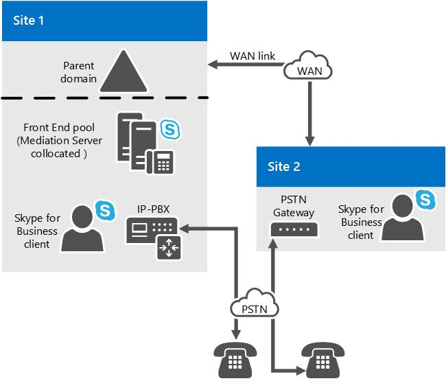

# 商務用 Skype Server 中的中繼伺服器元件Mediation Server component in Skype for Business Server
 
瞭解商務用 Skype 伺服器中的仲介程式伺服器, 包括其支援的拓撲及其關係, 包括 M:N trunks、媒體旁路及呼叫許可控制。Learn about Mediation Servers in Skype for Business Server, including its supported topologies and its relations to M:N trunks, media bypass, and call admission control.
  
若要部署企業語音, 您必須部署一或多個轉送伺服器。To deploy Enterprise Voice, you must deploy one or more Mediation Servers. 
  
中繼伺服器會在您的內部企業語音結構與公用交換電話網絡 (PSTN) 閘道或會話初始通訊協定 (SIP) 幹線之間轉換信號。The Mediation Server translates signaling between your internal Enterprise Voice infrastructure and a public switched telephone network (PSTN) gateway or a Session Initiation Protocol (SIP) trunk. 在某些部署中, 它也會在這些點之間轉換媒體本身。In some deployments, it also translates the media itself between these points.
  
在商務用 Skype Server 端, 中繼伺服器會偵聽單一相互 TLS (MTLS) 傳輸位址。On the Skype for Business Server side, Mediation Server listens on a single mutual TLS (MTLS) transport address. 在閘道端, 中繼伺服器會偵聽與 trunks 相關聯的所有關聯偵聽埠。On the gateway side, Mediation Server listens on all associated listening ports associated with trunks. 所有合格的閘道都必須支援 TLS, 但是也可以啟用 TCP。All qualified gateways must support TLS, but can enable TCP as well. 對於不支援 TLS 的閘道, 支援 TCP。TCP is supported for gateways that do not support TLS.
  
如果您的環境中也有現有的公用分支 Exchange (PBX), 轉送伺服器會處理企業語音使用者與 PBX 之間的通話。If you also have an existing Public Branch Exchange (PBX) in your environment, Mediation Server handles calls between Enterprise Voice users and the PBX. 如果您的 PBX 是 IP PBX, 您可以在 PBX 與中繼伺服器之間建立直接 SIP 連線。If your PBX is an IP-PBX, you can create a direct SIP connection between the PBX and Mediation Server. 如果您的 PBX 是時段分複用 (TDM) PBX, 您也必須在中繼伺服器與 PBX 之間部署 PSTN 閘道。If your PBX is a Time Division Multiplex (TDM) PBX, you must also deploy a PSTN gateway between Mediation Server and the PBX.
  
中繼伺服器會根據預設, 與前端伺服器 collocated。The Mediation Server is collocated with the Front End Server by default. 您也可以在獨立的池中部署中繼伺服器。The Mediation Server can also be deployed in a stand-alone pool.
  
## 中繼伺服器的功能What Mediation Server Does

中繼伺服器的主要功能如下所示:The main functions of the Mediation Server are as follows:
  
- 在商務用 Skype Server 端對 SRTP 進行加密和解密。Encrypting and decrypting SRTP on the Skype for Business Server side. 
    
- 將 SIP (適用于不支援 TLS 的閘道) 轉換為經由相互 TLS 的 SIP。Translating SIP over TCP (for gateways that do not support TLS) to SIP over mutual TLS.
    
- 在商務用 Skype Server 與中繼伺服器的閘道對等之間翻譯媒體資料流程。Translating media streams between Skype for Business Server and the gateway peer of the Mediation Server.
    
- 將網路以外的用戶端連線到內部的 ICE 元件, 這可讓介質能在 NAT 和防火牆間進行遍歷。Connecting clients that are outside the network to internal ICE components, which enable media traversal of NAT and firewalls.
    
- 充當不支援閘道之通話流程的媒介, 例如來自企業語音 clien 的遠端工作者通話。Acting as an intermediary for call flows that a gateway does not support, such as calls from remote workers on an Enterprise Voice clien.t
    
- 在包含 SIP 中繼的部署中, 使用 SIP 中繼服務提供者來提供 PSTN 支援, 這樣就不需要 PSTN 閘道。In deployments that include SIP trunking, working with the SIP trunking service provider to provide PSTN support, which eliminates the need for a PSTN gateway.
    
下圖顯示與基本 PSTN 閘道和企業語音基礎結構通訊時, 中繼伺服器所使用的傳送信號和媒體通訊協定。The following figure shows the signaling and media protocols that are used by the Mediation Server when communicating with a basic PSTN gateway and the Enterprise Voice infrastructure.
  
**中繼伺服器所使用的信號和媒體通訊協定****Signaling and media protocols used by the Mediation Server**

  
> [!NOTE]
> 如果您使用的是 TCP 或 RTP/RTCP (而不是 SRTP 或 SRTCP), 請在 PSTN 閘道與中繼伺服器之間的網路上進行測量, 以協助確保網路的安全性與隱私權。If you are using TCP or RTP/RTCP (instead of SRTP or SRTCP) on the network between the PSTN gateway and the Mediation Server, we recommend that you take measures to help ensure the security and privacy of the network. 
  
## M:N 主幹M:N trunk

商務用 Skype 伺服器支援進行呼叫路由的主幹定義的彈性。Skype for Business Server supports flexibility in the definition of a trunk for call routing purposes. 主幹是中繼伺服器與偵聽埠號碼之間的邏輯關聯, 且具有閘道和偵聽埠號碼。A trunk is a logical association between a Mediation Server and listening port number, with a gateway and a listening port number. 這表示以下幾點: 中繼伺服器可以有多個 trunks 至同一個閘道;中繼伺服器可以有多個 trunks 至不同的閘道;相反地, 閘道可以有多個 trunks 給不同的中繼伺服器。This implies several things: A Mediation Server can have multiple trunks to the same gateway; a Mediation Server can have multiple trunks to different gateways; conversely a gateway can have multiple trunks to different Mediation Servers.
  
當您使用 [拓撲建立器] 新增閘道至商務用 Skype 拓撲時, 仍需建立根主幹。You must still create a root trunk when you add a gateway to your Skype for Business topology using Topology Builder. 指定的中繼伺服器可以處理的閘道數目, 取決於高峰期繁忙期間內伺服器的處理能力。The number of gateways that a given Mediation Server can handle depends on the processing capacity of the server during peak busy hours. 如果您在符合商務用 Skype Server 之最低硬體需求的硬體上部署轉送伺服器, 如[商務用 Skype server 2015 的伺服器需求](../../plan-your-deployment/requirements-for-your-environment/server-requirements.md)所述, 則獨立的中繼伺服器可以處理大約1000通話。If you deploy a Mediation Server on hardware that meets the minimum hardware requirements for Skype for Business Server, as described in [Server requirements for Skype for Business Server 2015](../../plan-your-deployment/requirements-for-your-environment/server-requirements.md), then a stand-alone Mediation Server can handle approximately 1000 calls. 中繼伺服器會執行轉碼, 但仍會傳送多個閘道的呼叫, 即使閘道不支援媒體旁路也一樣。The Mediation Server is performs transcoding, but still route calls for multiple gateways even if the gateways do not support media bypass.
  
定義通話路線時, 您可以指定與該路線相關聯的 trunks, 但不會指定哪些中繼伺服器與該路由相關聯。When defining a call route, you specify the trunks associated with that route, but you do not specify which Mediation Servers are associated with that route. 相反地, 您可以使用拓撲建立器, 將 trunks 與中繼伺服器產生關聯。Instead, you use Topology Builder to associate trunks with Mediation Servers. 換句話說, 路由會決定要使用哪個幹線來進行通話, 然後再將與該主幹相關的中繼伺服器傳送給該通話。In other words, routing determines which trunk to use for a call, and, subsequently, the Mediation Server associated with that trunk is sent the signaling for that call.
  
您可以將中繼伺服器部署成一個池;此池可以與前端池 collocated, 也可以將它部署為獨立的池。The Mediation Server can be deployed as a pool; this pool can be collocated with a Front End pool, or it can be deployed as a stand-alone pool. 當使用前端池 collocated 轉送伺服器時, 池子大小最多可以是 12 (註冊機構池大小的限制)。When a Mediation Server is collocated with a Front End pool, the pool size can be at most 12 (the limit of the Registrar pool size). 總之, 這些功能可提高中繼伺服器的可靠性和部署靈活性, 但在下列情況下需要類似的功能:Taken together, these capabilities increase the reliability and deployment flexibility for Mediation Servers, but they require similar capabilities in the following:
  
- **PSTN 閘道。****PSTN gateway.** 商務用 Skype Server 合格閘道必須實現 DNS 負載平衡, 這可讓合格的公用交換電話網絡 (PSTN) 閘道充當一個中繼伺服器池的負載平衡器, 進而在整個池中進行負載平衡呼叫.A Skype for Business Server qualified gateway must implement DNS load balancing, which enables a qualified public switched telephone network (PSTN) gateway to act as a load balancer for one pool of Mediation Servers, and thereby to load-balance calls across the pool.
    
- **會話邊界控制器。****Session Border Controller.** 對 SIP 主幹而言, 對等實體是網際網路電話服務提供者的會話邊界控制器 (SBC)。For a SIP trunk, the peer entity is a Session Border Controller (SBC) at an Internet telephony service provider. 從中繼伺服器池到 SBC 的方向, SBC 可以從池中的任何中繼伺服器接收連線。In the direction from the Mediation Server pool to the SBC, the SBC can receive connections from any Mediation Server in the pool. 從 SBC 到該池的方向, 流量可以傳送到池中的任何中繼伺服器。In the direction from the SBC to the pool, traffic can be sent to any Mediation Server in the pool. 完成這項工作的其中一個方法是透過 DNS 負載平衡 (如果服務提供者和 SBC 支援)。One method of achieving this is through DNS load balancing, if supported by the service provider and SBC. 另一種方法是為服務提供者提供池中所有中繼伺服器的 IP 位址, 而服務提供者將在其 SBC 中將這些資源設定為每個中繼伺服器的個別 SIP 幹線。An alternative is to give the service provider the IP addresses of all Mediation Servers in the pool, and the service provider will provision these in their SBC as a separate SIP trunk for each Mediation Server. 然後服務提供者就會處理自己伺服器的負載平衡。The service provider will then handle the load balancing for its own servers. 並非所有服務提供者或 SBCs 都可能支援這些功能。Not all service providers or SBCs may support these capabilities. 此外, 服務提供者可能會針對這項功能收取額外費用。Furthermore, the service provider may charge extra for this capability. 一般來說, SBC 的每個 SIP 幹線都會產生每月費用。Typically, each SIP trunk to the SBC incurs a monthly fee.
    
- **IP-PBX。****IP-PBX.** 從中繼伺服器池到 IP PBX SIP 終止方向, IP PBX 可以從池中的任何中繼伺服器接收連線。In the direction from the Mediation Server pool to the IP-PBX SIP termination, the IP-PBX can receive connections from any Mediation Server in the pool. 從 IP PBX 到池中的方向, 流量可以傳送到池中的任何中繼伺服器。In the direction from the IP-PBX to the pool, traffic can be sent to any Mediation Server in the pool. 因為大部分的 IP Pbx 不支援 DNS 負載平衡, 所以建議您從 IP PBX 將個別的直接 SIP 連線定義到池中的每個轉送伺服器。Because most IP-PBXs do not support DNS load balancing, we recommend that individual direct SIP connections be defined from the IP-PBX to each Mediation Server in the pool. 然後, IP PBX 會透過將流量散佈到幹線群組來處理自己的負載平衡。The IP-PBX will then handle its own load balancing by distributing traffic over the trunk group. 假設 [幹線] 群組在 IP-PBX 中有一致的一組路由規則。The assumption is that the trunk group has a consistent set of routing rules at the IP-PBX. 特定的 IP PBX 是否支援此幹線群組概念, 以及它與 IP PBX 本身的冗余和群集架構的交集, 必須先加以決定, 才能判斷出轉送伺服器叢集是否可以正確地與 IP PBX 進行互動。Whether a particular IP-PBX supports this trunk group concept and how it intersects with the IP-PBX's own redundancy and clustering architecture needs to be determined before you can decide whether a Mediation Server cluster can interact correctly with an IP-PBX.
    
中繼伺服器池必須具有與其互動之對等閘道的統一視圖。A Mediation Server pool must have a uniform view of the peer gateway with which it interacts. 這表示該資源的所有成員都能從 [配置] 存放區存取相同的對等閘道定義, 而且與撥出通話一樣很可能與它互動。This means that all members of the pool access the same definition of the peer gateway from the configuration store and are equally likely to interact with it for outgoing calls. 因此, 您無法分割池, 因此有些中繼伺服器只會與特定閘道對等的撥出電話進行通訊。Therefore, there is no way to segment the pool so that some Mediation Servers communicate with only certain gateway peers for outgoing calls. 如果這類分段是必要的, 則必須使用單獨的中繼伺服器池。If such segmentation is necessary, a separate pool of Mediation Servers must be used. 例如, 如果 PSTN 閘道、SIP trunks 或 IP-Pbx 中的相關功能與某個池互動 (如本主題前面所述), 就會發生這種情況。This would be the case, for example, if the associated capabilities in PSTN gateways, SIP trunks, or IP-PBXs to interact with a pool as detailed earlier in this topic are not present.
  
特定 PSTN 閘道、IP PBX 或 SIP 中繼對等可以傳送到多個中繼伺服器或 trunks。A particular PSTN gateway, IP-PBX, or SIP trunk peer can route to multiple Mediation Servers or trunks. 特定的中繼伺服器池可以控制的閘道數目, 視使用媒體旁路的呼叫數量而定。The number of gateways that a particular pool of Mediation Servers can control depends on the number of calls that use media bypass. 如果大量的呼叫使用媒體旁路, 則池中的中繼伺服器可以處理更多的呼叫, 因為只需要傳輸圖層處理。If a large number of calls use media bypass, a Mediation Server in the pool can handle many more calls, because only signaling layer processing is necessary. 
  
## 通話許可控制與轉送伺服器Call Admission Control and Mediation Server

呼叫許可控制 (CAC), 可根據可用的頻寬來管理即時會話建立, 以協助避免在擁擠的網路上的使用者的體驗品質不佳 (QoE)。Call admission control (CAC), manages real-time session establishment, based on available bandwidth, to help prevent poor Quality of Experience (QoE) for users on congested networks. 為了支援這項功能, 中繼伺服器負責頻寬管理, 在商務用 Skype 伺服器端和閘道端的兩個互動。To support this, the Mediation Server is responsible for bandwidth management for its two interactions on the Skype for Business Server side and on the gateway side. 在 [呼叫許可控制] 中, 通話的終止實體會處理頻寬保留。In call admission control, the terminating entity for a call handles the bandwidth reservation. 在閘道端與中繼伺服器互動的閘道對等 (PSTN 閘道、IP PBX、SBC) 不支援商務用 Skype Server 通話許可控制。The gateway peers (PSTN gateway, IP-PBX, SBC) that the Mediation Server interacts with on the gateway side do not support Skype for Business Server call admission control. 因此, 中繼伺服器必須代表其閘道對等來處理頻寬互動。Thus, the Mediation Server has to handle bandwidth interactions on behalf of its gateway peer. 只要有可能, 中繼伺服器就會提前保留頻寬。Whenever possible, the Mediation Server will reserve bandwidth in advance. 如果無法這樣做 (例如, 如果閘道端的最終媒體端點的位置不適供撥出電話到閘道對等), 則會在撥打電話時保留頻寬。If that is not possible (for example, if the locality of the ultimate media endpoint on the gateway side is unknown for an outgoing call to the gateway peer), bandwidth is reserved when the call is placed. 這種行為可能會導致過度訂閱頻寬, 但這是避免誤報的唯一方法。This behavior can result in oversubscription of bandwidth, but it is the only way to prevent false rings.
  
[媒體旁路] 和 [頻寬保留] 是相互排斥的。Media bypass and bandwidth reservation are mutually exclusive. 如果使用媒體旁路進行通話, 就不會針對該通話執行呼叫許可控制。If media bypass is employed for a call, call admission control is not performed for that call. 這裡的假設是通話中沒有受限制頻寬的連結。The assumption here is that there are no links with constrained bandwidth involved in the call. 如果呼叫許可控制是用於涉及轉送伺服器的特定通話, 該呼叫無法使用媒體旁路。If call admission control is used for a particular call that involves the Mediation Server, that call cannot employ media bypass.
  
如需媒體旁路或呼叫許可控制的詳細資料, 請參閱[在商務用 skype 中使用媒體旁路](media-bypass.md)或[方案, 在商務用 Skype 伺服器中規劃通話許可控制](call-admission-control.md)。For details about media bypass or call admission control, see [Plan for media bypass in Skype for Business](media-bypass.md) or [Plan for call admission control in Skype for Business Server](call-admission-control.md).
  
## 增強型 9-1-1 (E9-1-1) 和中繼伺服器Enhanced 9-1-1 (E9-1-1) and Mediation Server

中繼伺服器擁有延伸的功能, 讓它能夠正確地與增強型 9-1-1 (E9-1) 服務提供者互動。The Mediation Server has extended capabilities so that it can correctly interact with Enhanced 9-1-1 (E9-1-1) service providers. 在中繼伺服器上不需要特殊的設定。No special configuration is needed on the Mediation Server. 根據預設, E9-1-1 互動所需的 SIP 延伸是包含在與閘道對等方 (PSTN 閘道、IP PBX 或網際網路電話服務提供者的 SBC, 包括 E9-1-1 服務) 的互動。介面The SIP extensions required for E9-1-1 interaction are, by default, included in the Mediation Server's SIP protocol for its interactions with a gateway peer (PSTN gateway, IP-PBX, or the SBC of an Internet Telephony Service Provider, including E9-1-1 Service Providers)
  
在現有的轉送伺服器池中, 或需要獨立的中繼伺服器的 SIP 主幹是否可在現有的中繼伺服器池上終止, 或是否需要獨立的中繼伺服器, 取決於 E9 SBC 是否可與中繼伺服器的池互動。Whether the SIP trunk to an E9-1-1 Service Provider can be terminated on an existing Mediation Server pool or will require stand-alone Mediation Servers will depend on whether the E9-1-1 SBC can interact with a pool of Mediation Servers. 如需詳細資訊, 請參閱[在商務用 Skype 伺服器中 M:N 幹線](m-n-trunk.md)。For details, see [M:N trunk in Skype for Business Server](m-n-trunk.md).
  
## 媒體旁路和中繼伺服器Media bypass and Mediation Server

[媒體旁路] 是商務用 Skype 伺服器的功能, 可讓系統管理員設定呼叫路由直接在使用者端點與公用交換電話網絡 (PSTN) 閘道之間流動, 而不需要遍歷中繼伺服器。Media bypass is a Skype for Business Server capability that enables an administrator to configure call routing to flow directly between the user endpoint and the public switched telephone network (PSTN) gateway without traversing the Mediation Server. 媒體旁路可減少延遲、不必要的翻譯、資料包遺失的可能性, 以及潛在的故障點數, 以改善通話品質。Media bypass improves call quality by reducing latency, unnecessary translation, possibility of packet loss, and the number of potential points of failure. 如果不含轉送伺服器的遠端網站是透過受限制頻寬的一個或多個 WAN 連結連線到中央網站, 則媒體略過減少頻寬需求, 只要從遠端網站上的用戶端啟用媒體, 就能直接流向本機閘道, 而不需要首先, 必須在中央網站和返回轉送伺服器的 WAN 連結之間流動。媒體處理的減少也會補充轉送伺服器控制多個閘道的能力。Where a remote site without a Mediation Server is connected to a central site by one or more WAN links with constrained bandwidth, media bypass lowers the bandwidth requirement by enabling media from a client at a remote site to flow directly to its local gateway without first having to flow across the WAN link to a Mediation Server at the central site and back.This reduction in media processing also complements the Mediation Server's ability to control multiple gateways.
  
[媒體旁路] 和 [通話許可控制] (CAC) 是互斥的。Media bypass and call admission control (CAC) are mutually exclusive. 如果在通話中使用媒體旁路, 就不會針對該通話執行 CAC。If media bypass is employed for a call, CAC is not performed for that call. 假設通話中沒有受限制頻寬的連結。The assumption is that there are no links with constrained bandwidth involved in the call.
  
## 中繼伺服器的拓撲Topologies for Mediation Server

[商務用 Skype 伺服器] 的 [中繼伺服器] 是 [預設 collocated], 其中包含標準版伺服器、[前端] 池或 [Survivable 分支裝置]。The Skype for Business Server, Mediation Server is by default collocated with Standard Edition server, a Front End pool, or Survivable Branch Appliance. 前端池中的所有中繼伺服器都必須設定相同的配置。All Mediation Servers in a Front End pool must be configured identically.
  
在發生效能問題的情況下, 最好是在專用獨立的池中部署一或多個轉送伺服器。Where performance is an issue, it may be preferable to deploy one or more Mediation Servers in a dedicated stand-alone pool. 如果您要部署 SIP 中繼, 我們絕對建議使用單獨的池。We definitely recommend a stand-alone pool if you are deploying SIP trunking. 
  
如果您在支援媒體旁路和 DNS 負載平衡的合格 PSTN 閘道部署直接 SIP 連線, 則不需要獨立的中繼伺服器池。If you deploy Direct SIP connections to a qualified PSTN gateway that supports media bypass and DNS load balancing, a stand-alone Mediation Server pool is not necessary. 這是因為合格的閘道能夠將 DNS 負載平衡到中繼伺服器的池中, 而且可以從池中的任何中繼伺服器接收流量。This is because qualified gateways are capable of DNS load balancing to a pool of Mediation Servers and they can receive traffic from any Mediation Server in a pool.
  
我們也建議您在已部署 IP Pbx 或連線至網際網路電話語音器提供者的會話邊界控制器 (SBC) 時, 在前端池中 collocate 轉送伺服器, 只要符合下列任何一個條件:We also recommend that you collocate the Mediation Server on a Front End pool when you have deployed IP-PBXs or connect to an Internet Telephony Server Provider's Session Border Controller (SBC), as long as any of the following conditions are met:
  
- IP PBX 或 SBC 已設定為從池中的任何中繼伺服器接收流量, 並可將流量統一傳送給池中的所有中繼伺服器。The IP-PBX or SBC is configured to receive traffic from any Mediation Server in the pool and can route traffic uniformly to all Mediation Servers in the pool.
    
- Ip-pbx 不支援媒體旁路, 但是託管轉送伺服器的前端池可以處理語音轉換, 以取得不需要媒體旁路的呼叫。The IP-PBX does not support media bypass, but the Front End pool that is hosting the Mediation Server can handle voice transcoding for calls to which media bypass does not apply.
    
您可以使用 Microsoft Lync Server 2013、規劃工具來評估您要 collocate 中繼伺服器的前端池是否可以處理負載。You can use the Microsoft Lync Server 2013, Planning Tool to evaluate whether the Front End pool where you want to collocate the Mediation Server can handle the load. 如果您的環境無法符合這些需求, 則您必須部署獨立的中繼伺服器池。If your environment cannot meet these requirements, then you must deploy a stand-alone Mediation Server pool.
  
下圖顯示由 WAN 連結所連接的兩個網站所組成的簡單拓撲。The following figure shows a simple topology consisting of two sites connected by a WAN link. 中繼伺服器是在 Site 1 的前端池上 collocated。Mediation Server is collocated on a Front End pool at Site 1. 網站1的中繼伺服器控制網站1的 PSTN 閘道和網站2的閘道。The Mediation Servers at Site 1 controls both the PSTN gateway at Site 1 and the gateway at Site 2. 在此拓朴中, 會使用 [媒體旁路] 來全域性地使用網站和區域資訊, 而每個 PSTN 閘道的 trunks (GW1 和 GW2) 都已啟用旁路。In this topology, media bypass is enabled globally to use site and region information, and the trunks to each PSTN gateway (GW1 and GW2) have bypass enabled.
  
**在 site 1 與網站2上的中繼伺服器連線之 WAN 連結的網站範例****Example of sites connected by a WAN link with a Mediation Server at Site 1 and a PSTN gateway at Site 2**

  
下圖顯示的是一種簡單的拓撲, 其中的中繼伺服器是在 Site 1 的前端池上 collocated, 並與 Site 1 的 IP PBX 具有直接 SIP 連線。The next figure shows a simple topology where Mediation Server is collocated on Front End pool at Site 1 and has a Direct SIP connection to the IP-PBX at Site 1. 在此圖中, 中繼伺服器也會控制網站2的 PSTN 閘道。In this figure, the Mediation Server also controls a PSTN gateway at Site 2. 假設 [商務用 Skype] 使用者同時位於 [網站 1] 和 [2]。Assume that Skype for Business users exist at both Sites 1 and 2. 另外, 假設 IP PBX 有一個相關聯的媒體處理器, 必須由所有來自商務用 Skype 端點的媒體來遍歷, 然後才能傳送到由 IP PBX 控制的媒體端點。Also assume that the IP-PBX has an associated media processor that must be traversed by all media originating from Skype for Business endpoints before being sent to media endpoints controlled by the IP-PBX. 在此拓朴中, 會使用 [媒體旁路] 來全域啟用網站和區域資訊, 而 PBX 和 PSTN 閘道的 trunks 已啟用媒體旁路。In this topology, media bypass is enabled globally to use site and region information, and the trunks to the PBX and PSTN gateway have media bypass enabled.
  
**在 site 1 和 PBX 伺服器上, 由 WAN 連結與在 site 2 上的中繼伺服器連線的網站範例****Example of sites connected by a WAN link with a Mediation Server at Site 1 and a PBX at Site 2**

  
本主題中的最後一個圖表顯示的是將中繼伺服器連線至網際網路電話服務提供者之 SBC 的拓撲。The last figure in this topic shows a topology where the Mediation Server is connected to the SBC of an Internet Telephony Service Provider. 
  
## 針對中繼伺服器的規劃決策Planning decisions for Mediation Server

本主題描述您需要針對中繼伺服器部署進行的規劃決策。This topic describes planning decisions you need to make for your Mediation Server deployment,
  
### Collocated 或獨立的中繼伺服器？Collocated or Stand-alone Mediation Server?

在 [中央網站] 的 [標準版] 伺服器或 [前端伺服器] 中, [中繼伺服器] 是預設的 collocated。Mediation Server is by default collocated on the Standard Edition server or Front End Server in a Front End pool at central sites. 可處理的公用交換電話網絡 (PSTN) 通話數目, 以及池中所需的電腦數將視下列專案而定:The number of public switched telephone network (PSTN) calls that can be handled and the number of machines required in the pool will depend on the following:
  
- 中繼伺服器池控制的閘道對等數目The number of gateway peers that the Mediation Server pool controls
    
- 透過這些閘道的高容量流量The high-volume traffic periods through those gateways
    
- 媒體略過中繼伺服器的呼叫百分比The percentage of calls that are calls whose media bypass the Mediation Server
    
規劃時, 請務必考慮進行 PSTN 通話的媒體處理需求, 以及沒有針對媒體旁路進行設定的 A/V 會議, 以及處理需要的繁忙小時呼叫數的處理受支援。When planning, be sure to take into account the media processing requirements for PSTN calls and A/V conferences that are not configured for media bypass, as well as the processing needed to handle signaling interactions for the number of busy-hour calls that need to be supported. 如果沒有足夠的 CPU, 您必須部署一個獨立的中繼伺服器池;而且 PSTN 閘道、IP Pbx 和 SBCs 將需要分割成多個子集, 這些子集是由一個池中的 collocated 轉送伺服器和一或多個獨立的池中的獨立轉送伺服器所控制。If there is not enough CPU, then you must deploy a stand-alone pool of Mediation Servers; and PSTN gateways, IP-PBXs, and SBCs will need to be split into subsets that are controlled by the collocated Mediation Servers in one pool and the stand-alone Mediation Servers in one or more stand-alone pools.
  
如果您已部署 PSTN 閘道、IP-Pbx 或會話邊界控制器 (SBCs), 且不支援與中繼伺服器池進行互動的正確功能, 包括下列各項, 則必須將它們與獨立的池中組成在單一中繼伺服器上:If you deployed PSTN gateways, IP-PBXs, or Session Border Controllers (SBCs) that do not support the correct capabilities to interact with a pool of Mediation Servers, including the following, then they will need to be associated with a stand-alone pool consisting of a single Mediation Server:
  
- 在池中的中繼伺服器上執行網狀圖層網域名稱系統 (DNS) 負載平衡 (或將流量均勻地路由到池中的所有中繼伺服器)Perform network layer Domain Name System (DNS) load balancing across Mediation Servers in a pool (or otherwise route traffic uniformly to all Mediation Servers in a pool)
    
- 接受來自池中任何中繼伺服器的流量Accept traffic from any Mediation Server in a pool
    
您可以使用 Microsoft Lync Server 2013、規劃工具來評估 collocating 的中繼伺服器與您的前端池是否可以處理負載。You can use the Microsoft Lync Server 2013, Planning Tool to evaluate whether collocating the Mediation Server with your Front End pool can handle the load. 如果您的環境無法符合這些需求, 則您必須部署獨立的中繼伺服器池。If your environment cannot meet these requirements, then you must deploy a stand-alone Mediation Server pool.
  
### 中心網站與分支網站考慮Central Site and Branch Site Considerations

 中央網站上的中繼伺服器可用於傳送分支網站上 IP-Pbx 或 PSTN 閘道的呼叫。Mediation Servers at the central site can be used to route calls for IP-PBXs or PSTN gateways at branch sites. 不過, 如果您要部署 SIP trunks, 您必須在每個幹線終止的網站上部署一個轉送伺服器。If you deploy SIP trunks, however, you must deploy a Mediation Server at the site where each trunk terminates. 在分支網站上, 針對 IP PBX 或 PSTN 閘道呼叫中央網站路由的中繼伺服器, 不需要使用 [媒體旁路]。Having a Mediation Server at the central site route calls for an IP-PBX or PSTN gateway at a branch site does not require the use of media bypass. 不過, 如果您可以啟用媒體旁路, 這麼做會減少媒體路徑延遲並改善媒體質量, 因為該媒體路徑已不再需要追蹤信號路徑。However, if you can enable media bypass, doing so will reduce media path latency and improve the media quality because the media path is no longer required to follow the signaling path. [媒體旁路] 也會減少池中的處理負載。Media bypass also decreases the processing load on the pool.
  
> [!NOTE]
> 媒體旁路將無法與每個 PSTN 閘道、IP PBX 和 SBC 進行交互操作。Media bypass will not interoperate with every PSTN gateway, IP-PBX, and SBC. Microsoft 已經測試了一組 PSTN 閘道, 並有已認證的合作夥伴, 且已使用 Cisco IP-Pbx 進行了一些測試。Microsoft has tested a set of PSTN gateways and SBCs with certified partners and has done some testing with Cisco IP-PBXs. 只有在[整合通訊開啟互通性程式 (Lync Server)](https://go.microsoft.com/fwlink/p/?LinkId=268730)中列出的產品與版本支援媒體略過。Media bypass is supported only with products and versions listed at [Unified Communications Open Interoperability Program - Lync Server](https://go.microsoft.com/fwlink/p/?LinkId=268730). 
  
如果需要分支網站復原功能, Survivable 分支裝置或前端伺服器、中繼伺服器和閘道的組合必須部署在分支網站上。If branch site resiliency is required, a Survivable Branch Appliance or combination of a Front End Server, a Mediation Server, and a gateway must be deployed at the branch site. (分支網站復原的假設是, 目前狀態與會議不會在網站上復原。)如需有關分支網站規劃語音的指導方針, 請參閱[商務用 Skype Server 中的企業語音復原方案](enterprise-voice-resiliency.md)。(The assumption with branch site resiliency is that presence and conferencing are not resilient at the site.) For guidance on branch site planning for voice, see [Plan for Enterprise Voice resiliency in Skype for Business Server](enterprise-voice-resiliency.md).
  
針對使用 IP PBX 的互動, 如果 IP PBX 無法正確支援使用多個前期對話方塊與 RFC 3960 互動的早期媒體互動, 就可以將來自 IP PBX 之來電的前幾個字剪輯剪切至 Skype商務端點。For interactions with an IP-PBX, if the IP-PBX does not correctly support early media interactions with multiple early dialogs and RFC 3960 interactions, there can be clipping of the first few words of the greeting for incoming calls from the IP-PBX to Skype for Business endpoints. 如果中央網站的中繼伺服器是路由在分支網站上終止的 IP PBX 路由呼叫, 就會發生此問題, 因為需要較多的時間來完成通知。This issue can be more severe if a Mediation Server at a central site is routing calls for an IP-PBX where the route terminates at a branch site, because more time is needed for signaling to complete. 如果您遇到這種情況, 請在分支網站上部署中繼伺服器, 這是減少前幾個字的剪輯的唯一方法。If you experience this behavior, deploying a Mediation Server at the branch site is the only way to reduce clipping of the first few words.
  
最後, 如果您的中央網站有 TDM PBX, 或者您的 IP PBX 不會消除 PSTN 閘道的需求, 則您必須在連線轉送伺服器和 PBX 的呼叫路由中部署閘道。Finally, if your central site has a TDM PBX, or if your IP-PBX does not eliminate the need for a PSTN gateway, then you must deploy a gateway on the call route connecting Mediation Server and the PBX.
  
> [!NOTE]
> 若要改善獨立轉送伺服器的媒體效能, 您應該在這些伺服器的網路介面卡上啟用接收端縮放 (RSS)。To improve the media performance of standalone Mediation Server, you should enable receive-side scaling (RSS) on the network adapters on these servers. RSS 可讓伺服器上的多個處理常式並行處理傳入的資料包。RSS enables incoming packets to be handled in parallel by multiple processors on the server. 如需詳細資訊, 請參閱「 [Windows Server 中的接收端縮放增強功能](https://go.microsoft.com/fwlink/p/?LinkId=268731)」。For details, see ["Receive-Side Scaling Enhancements in Windows Server"](https://go.microsoft.com/fwlink/p/?LinkId=268731). 如需有關如何啟用 RSS 的詳細資訊, 請參閱您的網路介面卡檔。For details about how to enable RSS, see your network adapter documentation. 
  

