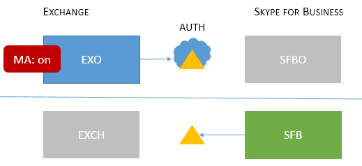

# 現代驗證支援的商務用 Skype 拓撲Skype for Business topologies supported with Modern Authentication
 
本文列出商務用 Skype 中的新式驗證支援哪些線上和內部部署拓撲，以及適用于每個拓朴的安全性功能。This article lists what online and on-premises topologies are supported with Modern Authentication in Skype for Business, as well as security features that apply to each topology.
  
## 商務用 Skype 中的新式驗證Modern Authentication in Skype for Business

商務用 Skype 可以利用新式驗證的安全性優勢。Skype for Business can leverage security advantages of Modern Authentication. 因為商務用 Skype 與 Exchange 密切搭配使用，所以商務用 Skype 用戶端使用者將會看到 Exchange 的 MA 狀態也會受到影響。Because Skype for Business works closely with Exchange, the login behaviour Skype for Business client users will see will also be effected by the MA status of Exchange. 如果您有商務用 Skype 剝離-網域混合，這也適用。This will also apply if you have a Skype for Business split-domain hybrid. 這是許多移動元件，但這裡的目標就是支援拓撲的簡單視覺化清單。That's a lot of moving parts, but the aim here is an easy to visualize list of supported topologies.
  
在已知商務用 Skype、商務用 Skype online、Exchange Server 和 Exchange online 中，MA 支援哪些拓朴？Given Skype for Business, Skype for Business online, Exchange Server, and Exchange online, what topologies are supported with MA?
  
<!--  > [!TIP] > Not sure what Modern Authentication even is? No worries.  This Skype for Business article  4e6a99cd-7859-4062-8a30-5ac79ba36b52  explains it in the first paragraphs. --> 
  
### 商務用 Skype 中支援的 MA 拓撲Supported MA topologies in Skype for Business

有可能有兩個伺服器應用程式，以及兩個 Office 365 工作負載，與 MA 使用的商務用 Skype 拓朴有關。There are potentially two server applications, and two Office 365 workloads, involved with Skype for Business topologies used by MA.
  
- 商務用 Skype server （CU 5）內部部署Skype for Business server (CU 5) on-premises
    
- 商務用 Skype online （SFBO）Skype for Business online (SFBO)
    
- Exchange server 內部部署Exchange server on-premises
    
- Exchange server online （EXO）Exchange server online (EXO)
    
MA 的另一個重要部分是瞭解使用者將在哪裡進行驗證（authN）和授權（authZ）。Another important part of MA is knowing where the authentication (authN) and authorization (authZ) of users will take place. 這兩個選項如下所示：The two options are:
  
- Microsoft 雲端中的 Azure AD、onlineAzure AD, online in the Microsoft Cloud
    
- Active Directory 同盟伺服器（ADFS）內部部署Active Directory Federation Server (ADFS) on-premises
    
如此一來，看起來就像這樣，在雲端中使用 EXO 和 SFBO 與 Azure AD，以及 Exchange Server （EXCH）及商務用 Skype server （SFB）-內部部署。So it looks a bit like this, with EXO and SFBO in the Cloud with Azure AD, and Exchange Server (EXCH) and Skype for Business server (SFB) on-prem.
  

  
以下是支援的拓撲。Here are the supported topologies. 請記住圖形的索引鍵：Please note the key for the graphics:
  
- 如果圖示呈灰色或灰色，就不會用於場景中。If the icon is dimmed or grey, it is not used in the scenario.
    
- EXO 是 Exchange Online。EXO is Exchange Online.
    
- SFBO 是商務用 Skype Online。SFBO is Skype for Business Online.
    
- EXCH 是 Exchange 內部部署。EXCH is Exchange on-premises.
    
- SFB 是商務用 Skype 內部部署。SFB is Skype for Business on-premises.
    
- 授權伺服器是由三角形表示，例如，Azure AD 是一個三角形，其中有一個雲端。Authorizing servers are represented by triangles, for example, the Azure AD is a triangle with a cloud behind it.
    
- 當用戶端嘗試到達指定的伺服器資源時，會使用的箭頭指向授權伺服器。Arrows point at the authorizing server that will be used when clients try to reach the specified server resource.
    
首先，讓我們在內部部署或僅限雲端拓撲中使用商務用 Skype 來涵蓋 MA。First, let's cover MA with Skype for Business in both On-premises-only or Cloud-only topologies.
  
> [!IMPORTANT]
> 您準備好在商務用 Skype Online 中設定新式驗證嗎？Are you ready to set up Modern Authentication in Skype for Business Online? 啟用此功能的步驟在[這裡](https://social.technet.microsoft.com/wiki/contents/articles/34339.skype-for-business-online-enable-your-tenant-for-modern-authentication.aspx)。The steps to enable this feature are right [here](https://social.technet.microsoft.com/wiki/contents/articles/34339.skype-for-business-online-enable-your-tenant-for-modern-authentication.aspx). 
  
|拓朴名稱Topology name    |範例Example    |說明Description    |受Supported    |
|:-----|:-----|:-----|:-----|
|僅限雲端Cloud only    |使用者駐留/信箱位於：線上Users homed/mailboxes located: Online    |EXO 和 SFBO 的 MA 都是開啟的。MA is on for both EXO and SFBO.    因此，授權伺服器是 Azure AD。Therefore, the authorization server is Azure AD.    |多重要素驗證（MFA）、以用戶端憑證為基礎的驗證（CBA）、條件式存取（CA）/Mobile 應用程式管理（MAM）與 Intune。Multi-factor authentication (MFA), Client-certificate based authentication (CBA), Conditional Access (CA)/Mobile Application Management (MAM) with Intune. \*    |
|僅限內部部署On-prem only    |使用者駐留/信箱位於：內部部署Users homed/mailboxes located: On-premises    |MA 是針對 SFB 內部部署所開啟。MA is on for SFB on-premises.    因此，授權伺服器是 ADFS。Therefore, the authorization server is ADFS.    如需設定詳細資料，請參閱[這篇文章。](https://technet.microsoft.com/en-us/library/mt710548.aspx)For configuration details, please see [this article.](https://technet.microsoft.com/en-us/library/mt710548.aspx)   |MFA （僅限 Windows 桌上出版-不支援行動用戶端）。MFA (Windows Desktop only - mobile clients are not supported). 沒有 Exchange 整合功能。No Exchange integration features.   
 **我們不建議採用這種方法。請參閱這裡：**[https://aka.ms/ModernAuthOverview](https://aka.ms/ModernAuthOverview)**We do not recommend this approach. Please see here:** [https://aka.ms/ModernAuthOverview](https://aka.ms/ModernAuthOverview)
 |
   
> [!IMPORTANT]
> 建議您在商務用 Skype 和 Exchange （及其線上等）中，MA 狀態都是相同的，以減少提示數量。It's recommended that the MA state be the same across Skype for Business and Exchange (and their online counterparts) to reduce the number of prompts. 
  
混合式拓朴涉及 SFB 分割網域混合式的組合。Mixed topologies involve combinations of SFB split-domain hybrids. 以下是目前支援的混合拓撲：These are the Mixed topologies currently supported:
  
|拓朴名稱Topology name    |範例Example    |說明Description    |受Supported    |
|:-----|:-----|:-----|:-----|
|混合式1Mixed 1    |             使用者駐留/信箱位於： EXO 和 SFBUsers homed/mailboxes located: EXO and SFB    |SFB 沒有啟用 MA;此拓朴中不提供 SFB MA 功能。MA is not enabled for SFB; no SFB MA features available in this topology.    |沒有 SFB 的 MA 功能。No MA features for SFB.    |
|混合式2Mixed 2    |             使用者駐留/信箱位於： EXCH 和 SFBOUsers homed/mailboxes located: EXCH and SFBO    |MA 僅適用于 SFBO。MA is on for SFBO only. 授權伺服器是駐留在 SFBO 的使用者的 Azure AD，但 EXCH 內部部署的 AD。The authorization server is Azure AD for users homed in SFBO, but AD for EXCH on-premises.    |使用 Intune 進行 MFA、CBA、CA/MAM。\*MFA, CBA, CA/MAM with Intune.\*    |
|混合3Mixed 3    |![支援的 MA 與 SFB、EXO [MA 開啟]，加上 EXCH 和 SFB 內部部署。](../../media/772dc261-c041-4a96-90d0-fd0b5124decf.PNG)             使用者駐留/信箱位於： EXO + SFB 或 EXCH + SFBUsers homed/mailboxes located: EXO + SFB, or EXCH + SFB    |此拓朴中不提供 SFB MA 功能No SFB MA features available in this topology    |沒有 SFB 的 MA 功能。No MA features for SFB.    |
|混合式4Mixed 4    |![支援的 MA 與 SFB、SFBO [MA 開啟]，加上 EXCH 和 SFB。](../../media/8971bfaf-961f-476c-b16e-5418d1fa0a6d.PNG)             使用者駐留/信箱位於： EXCH + SFBO 或 EXCH + SFBUsers homed/mailboxes located: EXCH +SFBO or EXCH + SFB    |MA 是針對 SFBO，因此授權伺服器是駐留在 SFBO 中的使用者的 Azure AD。MA is on for SFBO, therefore the authorization server is Azure AD for users homed in SFBO. 內部部署 SFB 和 EXO 中的使用者使用 AD。On-prem users in SFB and EXO use AD.    |僅供線上使用者使用 Intune 的 MFA、CBA、CA/MAM。\*MFA, CBA, CA/MAM with Intune for online users only.\*    |
|混合5Mixed 5    |             使用者駐留/信箱位於： EXO + SFBO、EXO + SFB、EXCH + SFBO 或 EXCH + SFBUsers homed/mailboxes located: EXO + SFBO, EXO + SFB, EXCH + SFBO, or EXCH + SFB    |MA 都在 EXO 和 SFBO 中，因此授權伺服器是駐留在 SFBO 中的使用者的 Azure AD;內部部署 EXCH 和 SFB 中的使用者使用 AD。MA is on in both EXO and SFBO, therefore the authorization server is Azure AD for users homed in SFBO; on-prem users in EXCH and SFB use AD.    |僅供線上使用者使用 Intune 的 MFA、CBA、CA/MAM。\*MFA, CBA, CA/MAM with Intune for online users only.\*    |
|混合式6Mixed 6    |             使用者駐留/信箱位於： EXO + SFBO、EXO + SFB、EXCH + SFBO 或 EXCH + SFBUsers homed/mailboxes located: EXO + SFBO, EXO + SFB, EXCH + SFBO, or EXCH + SFB    |MA 是位於任何地方，因此授權伺服器是適用于所有使用者的 Azure AD。MA is on everywhere, therefore the authorization server is Azure AD for all users. （線上及內部部署）(online and on-premises)     如需[https://aka.ms/ModernAuthOverview](https://aka.ms/ModernAuthOverview)部署步驟，請參閱。Please see [https://aka.ms/ModernAuthOverview](https://aka.ms/ModernAuthOverview) for deployment steps.   |針對所有使用者進行 MFA、CBA 和 CA/MAM （透過 Intune）。MFA, CBA and CA/MAM (via Intune) for all users.    |
   
\*-MFA 包括 Windows Desktop、MAC、iOS、Android 裝置和 Windows phone;CBA 包括 Windows Desktop、iOS 和 Android 裝置;含 Intune 的 CA/MAM，包括 Android 和 iOS 裝置。\* - MFA includes Windows Desktop, MAC, iOS, Android devices, and Windows Phones; CBA includes Windows Desktop, iOS and Android devices; CA/MAM with Intune, includes Android and iOS devices. 
  
> [!IMPORTANT]
> 很重要的一點是，在某些情況下，使用者可能會看到**多個提示**，特別是在用戶端可能需要並要求的所有伺服器資源中，MA 狀態不是相同的，這種情況與所有混合式拓朴版本一樣。It's very important to note that users may see **multiple prompts** in some cases, notably where the MA state is not the same across all the server resources that clients may need and request, as is the case with all versions of the Mixed topologies.

> [!IMPORTANT]
> 另請注意，在某些情況下（混合使用1、3和5），必須設定[AllowADALForNonLynIndependentOfLync](https://support.microsoft.com/en-us/help/3082803/info-about-the-allowadalfornonlyncindependentoflync-setting-in-skype-for-business,-lync-2013,-and-exchange-online)登錄機碼，才能正確地設定 Windows 桌面用戶端。Also note that in some cases (Mixed 1, 3, and 5 specifically) an [AllowADALForNonLynIndependentOfLync](https://support.microsoft.com/en-us/help/3082803/info-about-the-allowadalfornonlyncindependentoflync-setting-in-skype-for-business,-lync-2013,-and-exchange-online) registry key must be set for proper configuration for Windows Desktop Clients.
  

