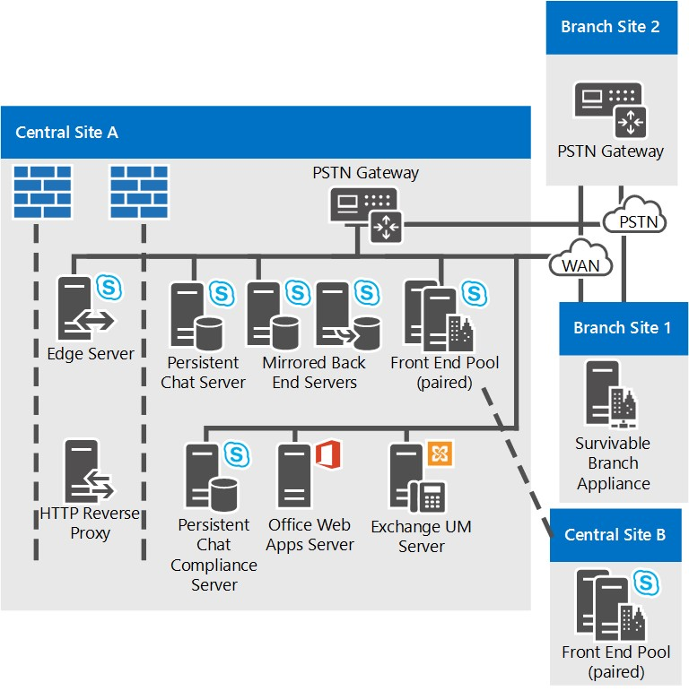

# 商務用 Skype Server 的參考拓撲Reference topologies for Skype for Business Server

商務用 Skype 伺服器的參考拓撲，包括針對大型、中型和 small 組織所進行的圖表和決策。Reference topologies for Skype for Business Server, including diagrams and decisions to make for large, medium, and small organizations.

您的商務用 Skype 伺服器拓撲最佳，取決於組織的規模、要部署的工作負載，以及高可用性與投資成本的喜好設定。The best Skype for Business Server topology for you depends on your organization's size, the workloads you want to deploy, and your preferences for high availability versus cost of investment.

本節概述三個範例參考拓撲，包括在每個拓撲中考慮的眾多決策背後的理由。This section outlines three sample reference topologies, including the reasoning behind many of the decisions that factored into each topology.

## 小型組織的參考拓撲Reference topology for a small organization

「小型組織」的參考拓撲顯示如何部署三台執行商務用 Skype Server 的伺服器，來部署強大且高可用性的解決方案。The reference topology for small organizations shows how you can deploy a robust, highly available solution by deploying only three servers running Skype for Business Server.

**小型組織的參考拓撲****Reference topology for small organizations**

- 已 **部署的 Standard Edition 伺服器對** 此組織在其中央網站有4000使用者。**Pair of Standard Edition Servers Deployed** This organization has 4,000 users at their central site. 他們已部署兩個 Standard Edition 伺服器，並將其搭配搭配，以啟用高可用性和嚴重損壞修復。They have deployed two Standard Edition servers and paired them together to enable high availability and disaster recovery. 每個伺服器的住宅2000使用者，但在兩部伺服器之間會同步處理所有使用者的相關資訊。Each server homes 2,000 users, but information about all users is synchronized between the two servers. 如果有一項關機，系統管理員可以將其他伺服器的使用者容錯移轉到其他伺服器，並將使用者中斷降至最低。If one goes down, an administrator can fail over those users to be served by the other server, with a minimum of disruption to users. 如需商務用 Skype Server 中高可用性和嚴重損壞修復功能的相關資訊，請參閱 [在商務用 Skype server 中規劃高可用性和嚴重損壞修復](../../plan-your-deployment/high-availability-and-disaster-recovery/high-availability-and-disaster-recovery.md)。For more information about high availability and disaster recovery features in Skype for Business Server, see [Plan for high availability and disaster recovery in Skype for Business Server](../../plan-your-deployment/high-availability-and-disaster-recovery/high-availability-and-disaster-recovery.md).

- **建議使用 Edge Server 部署。****Edge Server deployment is recommended.** 雖然內部 IM、出席和會議不需要部署 Edge Server，但我們仍建議小型部署使用 Edge Server。Although deploying an Edge Server is not required for internal IM, presence and conferencing, we recommend it even for small deployments. 您可以部署 Edge Server，將服務提供給目前組織防火牆以外的使用者，以達到最大的商務用 Skype Server 投資。You can maximize your Skype for Business Server investment by deploying an Edge Server to provide service to users currently outside your organization's firewalls. 優點包括下列各項：The benefits include the following:

  - 貴組織的使用者可以使用商務用 Skype 伺服器功能，如果他們在家工作或在旅途中已下班。Your organization's own users can use Skype for Business Server functionality, if they are working from home or are out on the road.

  - 您的使用者可以邀請外部使用者參與會議。Your users can invite outside users to participate in meetings.

  - 如果您有也會使用商務用 Skype 伺服器的合作夥伴、廠商或客戶組織，您可以建立與該組織的同盟關聯。If you have a partner, vendor or customer organization that also uses Skype for Business Server, you can form a federated relationship with that organization. 您的商務用 Skype 伺服器部署會從該同盟組織辨識使用者，以改善共同作業。Your Skype for Business Server deployment would then recognize users from that federated organization, leading to better collaboration.

  - 您的使用者可以與某些公用 IM 服務的使用者交換立即訊息。Your users can exchange instant messages with users of some public IM services.

- **分支網站生存能力。****Branch site survivability.** 此組織正在執行商務用 Skype Server 之 Enterprise Voice 功能的試驗計畫。This organization is running a pilot program of the Enterprise Voice feature of Skype for Business Server. 有些使用者使用商務用 Skype 伺服器作為其唯一的語音方案。Some users are using Skype for Business Server as their sole voice solution. 有些企業語音試驗使用者位於分支網站。Some of these Enterprise Voice pilot users are located at the branch site. 分支網站沒有可靠的廣域網路絡 (WAN) 連結至中央網站，因此會在該處部署 Survivable 分支裝置。The branch site does not have a reliable wide area network (WAN) link to the central site, so a Survivable Branch Appliance is deployed there. 在部署此功能的情況下，如果 WAN 連結停機，分支網站上的使用者仍可撥打和接聽通話 (組織中的呼叫和 PSTN 通話) 、具有語音信箱功能，以及透過兩方立即訊息 (IM) 進行通訊。With this deployed, if the WAN link goes down, users at the branch site can still make and receive calls (both calls within the organization and PSTN calls), have voice mail functionality, and communicate with two-party instant messaging (IM). 無法使用 WAN 連結時，也可以驗證使用者。Users can also be authenticated when the WAN link is unavailable as well. 如需詳細資訊，請參閱 [Plan For Enterprise Voice 韌性 In 商務用 Skype Server](../../plan-your-deployment/enterprise-voice-solution/enterprise-voice-resiliency.md)。For more information, see [Plan for Enterprise Voice resiliency in Skype for Business Server](../../plan-your-deployment/enterprise-voice-solution/enterprise-voice-resiliency.md).

- **Exchange UM 部署。****Exchange UM deployment.** 此參考拓撲包含 Exchange 整合通訊 (UM) Server，它會執行 Microsoft Exchange Server，而不是商務用 Skype Server。This reference topology includes an Exchange Unified Messaging (UM) Server, which runs Microsoft Exchange Server, not Skype for Business Server.

- **Office Web Apps Server。****Office Web Apps Server.** 建議您在使用 Web 會議的每家組織中部署 Office Web Apps Server 或 Office Web Apps Server 伺服器陣列。We recommend deploying an Office Web Apps Server or Office Web Apps Server farm in every organization that uses web conferencing. Office Web Apps Server 可以在 Web 會議中呈現 PowerPoint 的投影片。Office Web Apps Server makes it possible for PowerPoint slides to be presented in web conferences..

## 中型組織的參考拓撲Reference topology for a medium organization

具有高可用性和單一資料中心的參考拓撲是專為具有一個中央網站的中小型組織所設計。The reference topology with high availability and a single data center is designed for a small-to-medium size organization with one central site. 下圖中的實際拓撲是針對20000使用者的組織。The exact topology in the following diagram is for an organization of 20,000 users.

**中型組織的參考拓撲****Reference topology for medium organizations**

- **新增更多前端伺服器來容納更多使用者。****Accommodate more users by adding more Front End Servers.** 此圖中的實際拓撲有三部前端伺服器，可為20000使用者提供支援。The exact topology in this diagram has three Front End Servers to provide support for 20,000 users. 如果您有單一的中央網站和更多使用者，您只需要將多部前端伺服器新增至集區即可。If you have a single central site and more users, you can simply add more Front End Servers to the pool. 每個集區的使用者數目上限為80000，含十二部前端伺服器。The maximum number of users per pool is 80,000, with twelve Front End Servers.

    不過，如果在網站再新增一個前端集區，則單一個網站拓撲可以支援更多使用者。However, the single site topology can support even more users by adding another Front End pool to the site.

- **可以新增災難修復。****Disaster Recovery could be added.** 針對此組織，其商務用 Skype Server 服務的高可用性是必要的功能，但不會發生嚴重損壞修復。For this organization, high availability for their Skype for Business Server services is a necessary feature, but disaster recovery is not. 其部署的前端伺服器集區提供高可用性。The pool of Front End Servers they have deployed provides high availability.

    如果他們想要新增嚴重損壞復原能力，他們可能會考慮建立另一個資料中心，並在其中新增另一個前端集區，並將它與目前資料中心的前端集區配對。If they wanted to add disaster recovery ability, they could consider establishing another datacenter and adding another Front End pool there, and pairing it with the Front End pool in their current datacenter. 然後，如果發生嚴重影響其主要集區的嚴重損壞，系統管理員可以將使用者容錯移轉至備份組區。Then, if there was a disaster affecting their primary pool, the administrators could fail over users to the backup pool.

- **後端伺服器已鏡像** 若要提供更高的基本使用者功能可用性，該組織已為每一個前端集區部署一組鏡像的後端伺服器。**Back End Servers are mirrored** To provide more high availability for basic user features, the organization has deployed a mirrored pair of Back End Servers for each Front End pool.

- **監控伺服器資料庫選項。****Monitoring Server database options.** 此組織已部署監控，以確保 Enterprise Voice 通話的品質和 A/V 會議。This organization has deployed Monitoring to ensure the quality of Enterprise Voice calls and A/V conferences. 監控是部署于每一部前端伺服器上，而監視資料庫則是與後端伺服器組合。Monitoring is deployed on every Front End Server, and the Monitoring database is collocated with the Back End Servers. 我們也支援監控資料庫位於不同伺服器上的拓撲。We also support topologies in which the Monitoring database is located on a separate server.

- **Edge Server 高可用性** 在此範例中，有20000位使用者的組織，只有一部 Edge Server 足以獲得效能。**Edge Server high availability** In this example organization with 20,000 users, just one Edge Server would be sufficient for performance. 不過，他們已部署兩部伺服器的集區，以提供高可用性。However, they have deployed a pool of two Edge Servers deployed to provide high availability.

- **分支網站部署選項。****Branch site deployment options.** 此拓撲中的組織部署了企業語音作為語音解決方案。The organization in this topology has Enterprise Voice deployed as their voice solution. 分支網站1沒有具有彈性廣域網路絡的 (WAN) 連結至中央網站，因此它已部署 Survivable 分支裝置以維護許多商務用 Skype Server 功能，以防中央網站的 WAN 連結停止運作。Branch Site 1 does not have a resilient wide area network (WAN) link to the central site, so it has a Survivable Branch Appliance deployed to maintain many Skype for Business Server features in case the WAN link to the central site goes down. 不過，分支網站 2 具有可恢復的 WAN 連結，因此只需要有公用交換電話網路 (PSTN) 閘道。Branch Site 2 however has a resilient WAN link, so only a public switched telephone network (PSTN) gateway is needed. 此網站部署的 PSTN 閘道支援媒體旁路，所以分支網站 2 不需要有中繼伺服器。The PSTN gateway deployed there supports media bypass, so no Mediation Server is needed at Branch Site 2. 如需詳細資訊，請參閱 [Plan For Enterprise Voice 韌性 In 商務用 Skype Server](../../plan-your-deployment/enterprise-voice-solution/enterprise-voice-resiliency.md)。For more information, see [Plan for Enterprise Voice resiliency in Skype for Business Server](../../plan-your-deployment/enterprise-voice-solution/enterprise-voice-resiliency.md).

- **DNS 負載平衡。****DNS load balancing.** 前端集區和 Edge Server 集區，具有部署 SIP 流量的 DNS 負載平衡。The Front End pool and Edge Server pool, have DNS load balancing for SIP traffic deployed. 如此一來，Edge Server 就不需要硬體負載平衡器，這樣可大幅減少為其他集區安裝和維護硬體負載平衡器的工作，因為只有 HTTP 流量才需要硬體負載平衡器。This eliminates the need for hardware load balancers for the Edge Servers, and significantly lessens the setup and maintenance of the hardware load balancers for the other pools, as the hardware load balancers are needed only for HTTP traffic. 如需詳細資訊，請參閱 [DNS 負載平衡](../../plan-your-deployment/network-requirements/load-balancing.md#BKMK_DNSLoadBalancing)。For more information, see [DNS load balancing](../../plan-your-deployment/network-requirements/load-balancing.md#BKMK_DNSLoadBalancing).

- **Exchange UM 部署。****Exchange UM deployment.** 此參考拓撲包含 Exchange 整合通訊 (UM) Server，它會執行 Microsoft Exchange Server，而不是商務用 Skype Server。This reference topology includes an Exchange Unified Messaging (UM) Server, which runs Microsoft Exchange Server, not Skype for Business Server.

- **Office Web Apps Server。****Office Web Apps Server.** 建議您在使用 Web 會議的每家組織中部署 Office Web Apps Server 或 Office Web Apps Server 伺服器陣列。We recommend deploying an Office Web Apps Server or Office Web Apps Server farm in every organization that uses web conferencing. Office Web Apps Server 可以在 Web 會議中呈現 Powerpoint 投影片。Office Web Apps Server makes it possible for Powerpoint slides to be presented in web conferences.

- **可以新增 director。****Directors could be added.** 如果此組織想要協助提高安全性以防範拒絕服務攻擊，也可以部署 Director 集區。If this organization wanted to help to increase security against denial of service attacks, it could also deploy a pool of Directors. Director 是商務用 Skype Server 中的個別非選用伺服器角色，不會家用使用者帳戶，也不會提供目前狀態或會議服務。A Director is a separate, optional server role in Skype for Business Server that does not home user accounts, or provide presence or conferencing services. 它充當內部的下一個躍點伺服器，Edge Server 會將傳入 SIP 流量路由傳送至內部伺服器。It serves as an internal next hop server to which an Edge Server routes inbound SIP traffic destined for internal servers. Director 對輸入要求進行預先驗證，並將它們重新導向至使用者的主集區或伺服器。The Director pre-authenticates inbound requests and redirects them to the user's home pool or server. Director 的預先驗證可讓您從部署中未知的使用者帳戶中丟棄要求。Pre-authentication at the Director allows for dropping of requests from user accounts unknown to the deployment. Director 可協助將前端伺服器與惡意流量（如拒絕服務 (DoS) 攻擊）隔離。A Director helps insulate Front End Servers from malicious traffic such as denial-of-service (DoS) attacks. 如果網路在這類攻擊中以不正確外部流量淹沒，該流量會結束于 Director。If the network is flooded with invalid external traffic in such an attack, the traffic ends at the Director.

- **建議使用 System Center Operations Manager。****System Center Operations Manager is recommended.** 建議您監視商務用 Skype Server 部署的健康情況，以協助確保使用者的服務可用性。We recommend that you monitor the health of your Skype for Business Server deployment to help ensure service availability for end-users. 您可以使用 System Center Operations Manager 管理元件作為商務用 Skype，可免費從 Microsoft 下載。You can use the System Center Operations Manager Management Pack for Skype for Business that is available as a free download from Microsoft. 透過商務用 Skype 管理元件，您可以在發生問題時，主動取得即時警示、執行綜合交易，以測試端對端商務用 Skype 功能、取得服務可用性的報告等等。With the Skype for Business Management Pack, you can proactively get real-time alerts when issues occur, run synthetic transactions to test end-to-end Skype for Business functionality, get reports for service availability, and so on. 這可協助您在使用者體驗之前，主動回應部署的問題。This helps you to proactively respond to issues with your deployment before end-users experience them.

## 大型組織的參考拓撲Reference topology for a large organization

具有多個資料中心支援之大型組織的參考拓撲，適用于具有多部中央網站的組織規模。The reference topology for a large organization with multiple data centers support is for any size of organization with more than one central site. 下圖中的實際拓撲是針對50000使用者的組織，其中的20000使用者在中央網站 A，20000位於中央網站 B。中央網站 C 和分支網站上的總10000。The exact topology in the following diagram is for an organization of 50,000 users, with 20,000 users at Central Site A, 20,000 at Central Site B. and a total of 10,000 at Central Site C and branch sites. 此圖表所顯示的拓撲類型可容納具有任意數目使用者的組織。The type of topology shown in this diagram can accommodate organizations with any number of users.

除了前端伺服器集區所提供的高可用性之外，此拓撲還會新增嚴重損壞修復支援。In addition to the high availability provided by pools of Front End Servers, this topology adds disaster recovery support. 中央網站 A 和 B 的前端集區會成對搭配。The Front End pools at Central Sites A and B are paired together. 如果其中一個集區中斷，系統管理員可以將受影響使用者的服務移至未受影響之網站的配對集區。If one of these pools goes down, the administrator can shift the services for the affected users to the paired pool at the unaffected site.

這種拓撲會顯示在多個圖表中，並優先于中央網站的詳細視圖。This topology is shown in multiple diagrams, with an overview first followed by detailed views of the central sites.

**具有多個資料中心之大型組織的參考拓撲概述****Overview of the reference topology for large organizations with multiple data centers**

**大型組織的參考拓撲：中央網站 A 的詳細視圖****Reference topology for large organizations: Detailed view of Central Site A**

**大型組織的參考拓撲：中央網站 B 的詳細視圖****Reference topology for large organizations: Detailed view of Central Site B**

**大型組織的參考拓撲：中央網站 C 的詳細視圖****Reference topology for large organizations: Detailed view of Central Site C**

- **前端集區配對以啟用嚴重損壞修復。****Front End pools Are Paired to Enable Disaster Recovery.** 網站 A 和網站 B 的前端集區彼此配對，以提供嚴重損壞修復支援。The Front End pools at Site A and Site B are paired with each other, to provide disaster recovery support. 如果某個網站上的集區失敗，系統管理員可以從該網站將使用者容錯移轉至另一個網站的配對前端集區，並為使用者最低的服務中斷。If the pool at one site fails, the administrator can fail over the users from that site to the paired Front End pool at the other site, with a minimum of service interruption for users. 這兩個前端集區共有六部伺服器，也足以用於兩個集區中的所有40000使用者，以防容錯移轉。Each of these two Front End pools has six servers, which is enough for all 40,000 users in both pools in case of failover. 如需詳細資訊，請參閱 [在商務用 Skype Server 中規劃高可用性和嚴重損壞修復](../../plan-your-deployment/high-availability-and-disaster-recovery/high-availability-and-disaster-recovery.md)。For more information, see [Plan for high availability and disaster recovery in Skype for Business Server](../../plan-your-deployment/high-availability-and-disaster-recovery/high-availability-and-disaster-recovery.md).

- **後端伺服器已鏡像** 若要提供更高的基本使用者功能可用性，該組織已為每一個前端集區部署一組鏡像的後端伺服器。**Back End Servers are mirrored** To provide more high availability for basic user features, the organization has deployed a mirrored pair of Back End Servers for each Front End pool. 這是選用的拓撲，而您可以選擇部署單一後端伺服器。This is an optional topology, and you could choose to deploy a single Back End Server instead. 也支援 SQL 叢集和 AlwaysOn 可用性群組。SQL clustering and AlwaysOn Availability groups are also supported. 如需詳細資訊，請參閱 [在商務用 Skype server 中的後端伺服器高可用性](../../plan-your-deployment/high-availability-and-disaster-recovery/back-end-server.md)。For more information, see [Back End Server high availability in Skype for Business Server](../../plan-your-deployment/high-availability-and-disaster-recovery/back-end-server.md).

- **在分支網站上使用 Standard Edition server。****Using Standard Edition server at a branch site.** 此組織會將網站 C 視為分支網站，因為它只有600名員工。This organization considers Site C as a branch site because it has only 600 employees. 不過，使用者彼此之間有許多 A/V 會議。However, the users there have many A/V conferences among themselves. 如果它是部署在商務用 Skype 伺服器做為分支網站，則這些會議的媒體會透過廣域網路絡執行 (WAN) 與已部署前端伺服器的中央網站。If it was deployed in Skype for Business Server as a branch site, the media for these conferences would run across the wide area network (WAN) to and from a central site that has a Front End Server deployed. 為了避免這種可能的頻寬負載，使用者已在此網站上安裝一對 Standard Edition 伺服器，這會主控這些會議。To avoid this potential bandwidth load, they have installed a pair of Standard Edition servers at this site, which will host these conferences. 而且由於已安裝 Standard Edition Server，因此商務用 Skype Server 依定義將其視為中央網站，在拓撲產生器和規劃工具中會被視為這類功能。And because Standard Edition servers are installed there, Skype for Business Server by definition considers it a central site, and it is treated as such in Topology Builder and the Planning Tool.

    在這裡，只要一部 Standard Edition server 會有足夠的效能，但是該組織已部署兩個搭配搭配，以提供高可用性，以防一部伺服器宕機。Just one Standard Edition server would be enough for performance here, but the organization has deployed two and paired them together to provide high availability in case one server goes down.

    雖然網站 C 被視為中央網站，但您不需要在此部署 Edge Server。Although Site C is considered a central site, you do not have to deploy Edge Servers there. 在此範例中，Site C 會使用部署于網站 A 的 Edge Server。In this example, Site C will use the Edge Servers deployed at Site A.

- **監視與** 封存此組織已同時部署監控與封存。**Monitoring and Archiving** This organization has deployed both Monitoring and Archiving. 當您部署監控或封存時，它會在每一部前端伺服器上執行。When you deploy Monitoring or Archiving, it runs on every Front End Server. 這些功能的資料庫可以與後端資料庫組合，也可以位於不同的伺服器上。The databases for these features can be collocated with the Back End Database, or located on a separate server. 此組織已將這些資料庫放在與後端伺服器不同的伺服器上（位於中央網站 B）。資料庫這裡會從所有網站中的前端伺服器接收監控和封存資料。This organization has located these databases on a server separate from the Back End Servers, in Central Site B. The databases here receive Monitoring and Archiving data from the Front End Servers in all sites.

- **分支網站部署選項。****Branch site deployment options.** 此組織實際上具有超過50個分支網站，詳細資訊圖表中只會顯示兩個分支網站。This organization actually has over 50 branch sites, only two of which are shown in the detailed diagrams. 分支網站1沒有指向中央網站的彈性 WAN 連結，因此他們已部署 Survivable 分支裝置以提供電話語音，以防中央網站的 WAN 連結停止運作。Branch Site 1 does not have a resilient WAN link to the central site, so they have Survivable Branch Appliances deployed to provide telephone service in case the WAN link to the central site goes down. 分支網站2不過具有彈性 WAN 連結，因此只需要公用交換電話網路 (PSTN) 閘道。Branch Site 2 however has a resilient WAN link, so it needs only a public switched telephone network (PSTN) gateway. 此網站部署的 PSTN 閘道支援媒體旁路，所以分支網站 2 不需要有中繼伺服器。The PSTN gateway deployed there supports media bypass, so no Mediation Server is needed at Branch Site 2. 如需決定在分支網站安裝之專案的詳細資訊，請參閱 [在商務用 Skype Server 中規劃 Enterprise Voice 韌性](../../plan-your-deployment/enterprise-voice-solution/enterprise-voice-resiliency.md)。For details about deciding what to install at a branch site, see [Plan for Enterprise Voice resiliency in Skype for Business Server](../../plan-your-deployment/enterprise-voice-solution/enterprise-voice-resiliency.md).

- **SIP 主幹和轉送伺服器。****SIP trunking and Mediation Server.** 請注意，在中央網站 B 上，轉送伺服器不會與前端伺服器組合。Notice that at Central Site B, Mediation Server is not collocated with the Front End Servers. 這是因為針對使用 SIP 主幹的網站，建議使用獨立的轉送伺服器。This is because stand-alone Mediation Server is recommended for sites that use SIP trunking. 在其他大多數的情況下，我們建議您組合轉送伺服器與前端伺服器。In most other instances, we recommend you collocate Mediation Server with Front End Server. 如需有關轉送伺服器拓撲的詳細資訊，請參閱規劃檔中的中繼 [伺服器元件和拓撲](/previous-versions/office/lync-server-2013/lync-server-2013-components-and-topologies-for-mediation-server) 。For details about Mediation Server topologies, see [Components and Topologies for Mediation Server](/previous-versions/office/lync-server-2013/lync-server-2013-components-and-topologies-for-mediation-server) in the Planning documentation.

- **部署持續性聊天。****Persistent Chat is Deployed.** 此組織已部署啟用持續性聊天所需的伺服器。This organization has deployed the servers necessary to enable Persistent Chat. 它已部署多個持續性聊天前端伺服器來處理集區中使用者數目的負載，並提供高可用性。It has deployed multiple Persistent Chat Front End Servers to both handle the load for the number of users in the pool, and to provide high availability. 它也部署了持續性聊天的相容性，並已在不同的伺服器上找到 Persistent chat Store 和 Persistent Chat 規範存放區。It has also deployed Compliance for Persistent Chat, and located the Persistent Chat Store and the Persistent Chat Compliance Store on separate servers. 這些存放區可能是組合，甚至可以與後端伺服器組合，但這項組織已選擇將其分開，以提供更好的效能。These stores could be collocated, and can even be collocated with the Back End Server, but this organization has chosen to separate them to provide better performance.

    > [!NOTE]
    > 商務用 Skype Server 2015 仍提供持續聊天，但商務用 Skype Server 2019 已不再支援。Persistent chat is available in Skype for Business Server 2015 but is no longer supported in Skype for Business Server 2019. 小組中提供相同的功能。The same functionality is available in Teams. 如需詳細資訊，請參閱 [Microsoft 團隊升級快速](/microsoftteams/upgrade-start-here)入門。For more information, see [Getting started with your Microsoft Teams upgrade](/microsoftteams/upgrade-start-here). 如果您需要使用持續聊天，您可以選擇將需要這項功能的使用者遷移至小組，或是繼續使用商務用 Skype Server 2015。If you need to use Persistent chat, your choices are to either migrate users requiring this functionality to Teams, or to continue using Skype for Business Server 2015.

- **DNS 負載平衡。****DNS load balancing.** 前端集區和 Edge Server 集區使用 DNS 負載平衡。The Front End pool and Edge Server pool use DNS load balancing. 這樣就不需要對 Edge Server 的內部介面進行硬體負載平衡器，也能大幅減少對其他集區的硬體負載平衡器進行設定與維護所需花費的時間，因為只有 HTTP 流量需要硬體負載平衡器。This eliminates the need for hardware load balancers for the internal interface of the Edge Servers, and significantly decreases the amount of time you have to spend on the setup and maintenance of the hardware load balancers for the other pools, as the hardware load balancers are needed only for HTTP traffic. 如需詳細資訊，請參閱 (。/../plan-your-deployment/network-requirements/load-balancing.md # BKMK_DNSLoadBalancing) 。For more information, see (../../plan-your-deployment/network-requirements/load-balancing.md#BKMK_DNSLoadBalancing).

- **Exchange UM 部署。****Exchange UM deployment.** 商務用 Skype 伺服器可搭配 Exchange 整合通訊 (UM) 和主控 Exchange UM 的內部部署。Skype for Business Server works with both on-premises deployments of Exchange Unified Messaging (UM) and hosted Exchange UM. 中央網站 A 包含 Exchange 整合通訊 (UM) Server，它會執行 Microsoft Exchange Server，而不是商務用 Skype Server。Central Site A includes an Exchange Unified Messaging (UM) Server, which runs Microsoft Exchange Server, not Skype for Business Server. 商務用 Skype 伺服器的 Exchange UM 功能會在前端集區上執行。The Exchange UM functionality for Skype for Business Server runs on the Front End pool.

    中央網站 B 使用託管 Exchange，因此也會主控 Exchange UM 伺服器功能。Central Site B uses hosted Exchange, so the Exchange UM Server functionality is also hosted.

    如需 Exchange UM 的詳細資訊，請參閱規劃檔中的 [On-Premises Exchange 整合通訊整合](/previous-versions/office/lync-server-2013/lync-server-2013-planning-for-exchange-unified-messaging-integration) 和 [主控 Exchange 整合通訊整合](/previous-versions/office/lync-server-2013/lync-server-2013-hosted-exchange-unified-messaging-integration) 。For details about Exchange UM, see [On-Premises Exchange Unified Messaging Integration](/previous-versions/office/lync-server-2013/lync-server-2013-planning-for-exchange-unified-messaging-integration) and [Hosted Exchange Unified Messaging Integration](/previous-versions/office/lync-server-2013/lync-server-2013-hosted-exchange-unified-messaging-integration) in the Planning documentation.

- **Office Web Apps Server。****Office Web Apps Server.** 建議您在使用 Web 會議的每家組織中部署 Office Web Apps Server 或 Office Web Apps Server 伺服器陣列。We recommend deploying an Office Web Apps Server or Office Web Apps Server farm in every organization that uses web conferencing. 您可以在一個網站中部署單一的 Office Web Apps Server 伺服器陣列，以便從所有網站提供流量，或是在每個網站中部署。You could deploy a single Office Web Apps Server farm in one site which serves traffic from all sites, or deploy it in each site. Office Web Apps Server 可以在 Web 會議中呈現 Powerpoint 投影片。Office Web Apps Server makes it possible for Powerpoint slides to be presented in web conferences.

- **可以新增 director。****Directors could be added.** 如果此組織想要提高安全性以防範拒絕服務攻擊，也可以部署 Director 集區。If this organization wanted to increase security against denial of service attacks, it could also deploy a pool of Directors. Director 是商務用 Skype Server 中的個別非選用伺服器角色，不會家用使用者帳戶，也不會提供目前狀態或會議服務。A Director is a separate, optional server role in Skype for Business Server that does not home user accounts, or provide presence or conferencing services. 它充當內部的下一個躍點伺服器，Edge Server 會將傳入 SIP 流量路由傳送至內部伺服器。It serves as an internal next hop server to which an Edge Server routes inbound SIP traffic destined for internal servers. Director 對輸入要求進行預先驗證，並將它們重新導向至使用者的主集區或伺服器。The Director pre-authenticates inbound requests and redirects them to the user's home pool or server. Director 的預先驗證可讓您從部署中未知的使用者帳戶中丟棄要求。Pre-authentication at the Director allows for dropping of requests from user accounts unknown to the deployment. Director 可協助將前端伺服器與惡意流量（如拒絕服務 (DoS) 攻擊）隔離。A Director helps insulate Front End Servers from malicious traffic such as denial-of-service (DoS) attacks. 如果網路在這類攻擊中以不正確外部流量淹沒，該流量會結束于 Director。If the network is flooded with invalid external traffic in such an attack, the traffic ends at the Director.

- **建議使用 System Center Operations Manager。****System Center Operations Manager is recommended.** 建議您監視商務用 Skype Server 部署的健康情況，以協助確保使用者的服務可用性。We recommend that you monitor the health of your Skype for Business Server deployment to help ensure service availability for end-users. 您可以使用 System Center Operations Manager 管理元件作為商務用 Skype，可免費從 Microsoft 下載。You can use the System Center Operations Manager Management Pack for Skype for Business that is available as a free download from Microsoft. 透過商務用 Skype 管理元件，您可以在發生問題時，主動取得即時警示、執行綜合交易，以測試端對端商務用 Skype 功能、取得服務可用性的報告等等。With the Skype for Business Management Pack, you can proactively get real-time alerts when issues occur, run synthetic transactions to test end-to-end Skype for Business functionality, get reports for service availability, and so on. 這可協助您在使用者體驗之前，主動回應部署的問題。This helps you to proactively respond to issues with your deployment before end-users experience them.