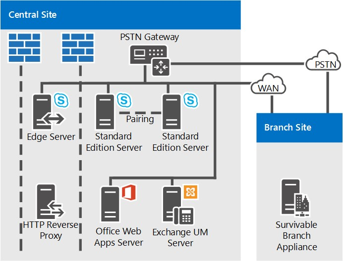

# 商務用 Skype Server 的參考拓撲

商務用 Skype Server 的參照拓撲, 包括要針對大型、中型及小型組織進行的圖表和決策。

最佳的商務用 Skype 伺服器拓撲, 視貴組織的規模、您要部署的工作負載, 以及高可用性與投資成本的喜好設定而定。

本節概述三個範例參照拓朴, 包括每個拓朴中劃分的許多決策背後的理由。

## 小型組織的參考拓撲

小型組織的參考拓朴示範如何只部署三台伺服器來執行商務用 Skype Server, 以部署穩健、高可用性的解決方案。

**小型組織的參照拓撲**

- 已**部署的標準版伺服器成對**這個組織在其中央網站上有4000使用者。 他們已部署兩個標準版伺服器並成對搭配, 以啟用高可用性和災害復原。 每個伺服器住房2000使用者, 但所有使用者的相關資訊都會在兩個伺服器之間同步處理。 如果其中一個是關閉的, 系統管理員可以將這些使用者的服務容錯移轉到其他伺服器, 並將使用者的中斷降至最低。 如需有關商務用 Skype Server 中高可用性和災難復原功能的詳細資訊, 請參閱[在商務用 Skype server 中規劃高可用性和災難](../../plan-your-deployment/high-availability-and-disaster-recovery/high-availability-and-disaster-recovery.md)復原。

- **建議使用 Edge 伺服器部署。** 雖然內部 IM、目前狀態與會議不需要部署邊緣伺服器, 但我們建議您即使小型部署也一樣。 您可以部署邊緣伺服器來提供服務給組織防火牆目前以外的使用者, 以將商務用 Skype 伺服器投資最大化。 其優點包括下列各項:

  - 貴組織的使用者可以使用商務用 Skype 伺服器功能 (如果他們是在家中或在旅途中的工作)。

  - 您的使用者可以邀請外部使用者參與會議。

  - 如果您有合作夥伴、廠商或客戶組織, 且使用商務用 Skype Server, 您可以建立與該組織的聯盟關聯。 接著, 您的商務用 Skype Server 部署就會辨識來自該同盟組織的使用者, 以更好的方式共同作業。

  - 您的使用者可以與一些公用 IM 服務的使用者交換立即訊息。

- **分支網站的留存能力。** 這個組織正在執行「商務用 Skype Server」企業語音功能的試驗程式。 有些使用者使用商務用 Skype Server 作為其唯一的語音方案。 其中一些企業語音試驗使用者位於分支網站上。 分支網站沒有可靠的廣域網路 (WAN) 連結到中央網站, 所以會在該處部署 Survivable 分支裝置。 在已部署的情況下, 如果 WAN 連結關閉, 分支網站上的使用者仍可撥打及接聽電話 (在組織和 PSTN 通話中的呼叫)、擁有語音信箱功能, 以及與雙方的立即訊息 (IM) 進行通訊。 使用者也可以在 WAN 連結無法使用時進行驗證。 如需詳細資訊, 請參閱[商務用 Skype Server 中的企業語音復原規劃](../../plan-your-deployment/enterprise-voice-solution/enterprise-voice-resiliency.md)。

- **Exchange UM 部署。** 這個參照拓撲包含 Exchange 整合通訊 (UM) 伺服器, 該伺服器會執行 Microsoft Exchange Server, 而不是商務用 Skype 伺服器。

- **Office Web Apps 伺服器。** 我們建議您在使用 Web 會議的每一個組織中部署 Office Web Apps Server 或 Office Web Apps 伺服器群。 Office Web Apps 伺服器可讓 PowerPoint 投影片呈現在網路會議中。

## 中型組織的參照拓撲

具有高可用性與單一資料中心的參照拓撲是專為具有單一中心網站的中小型組織設計。 下圖中的確切拓撲是針對20000使用者的組織。

**中型組織的參考拓撲**

- **新增更多前端伺服器以容納更多使用者。** 此圖中的確切拓撲包含三個前端伺服器來提供20000使用者的支援。 如果您有單一的中央網站及更多使用者, 您可以直接在池中新增更多前端伺服器。 每個池的使用者數目上限為 80000, 且有十二個前端伺服器。

    不過, 單一網站拓朴可將另一個 [前端] 池新增至網站, 以支援更多使用者。

- **您可以新增災害復原。** 針對此組織而言, 商務用 Skype Server 服務的高可用性是必要的功能, 但不需要災害復原。 其部署的前端伺服器池可提供高可用性。

    如果他們想要新增災害復原能力, 他們可以考慮建立另一個資料中心, 並在其中新增另一個 [前端] 池, 並將它與目前資料中心的前端池配對。 然後, 如果發生影響其主要池的災難, 系統管理員可能會將使用者容錯移轉至備份池。

- **後端伺服器已鏡像**為了提供更高的基本使用者功能可用性, 組織已為每個前端池部署一個鏡像對後端伺服器。

- **監視伺服器資料庫選項。** 此組織已部署監控, 以確保企業語音通話品質及 A/V 會議品質。 監視是在每個前端伺服器上部署, 而監視資料庫則與後端伺服器 collocated。 我們也支援監視資料庫位於個別伺服器上的拓撲。

- **Edge 伺服器高可用性**在這個範例中, 有20000個使用者, 只要有一個 Edge 伺服器就足以達到效能。 不過, 他們已部署兩個部署的雙層伺服器池來提供高可用性。

- **分支網站部署選項。** 此拓撲中的組織已將企業語音部署為其語音方案。 分支網站1沒有可復原的廣域網路 (WAN) 連結至中心網站, 所以它擁有已部署的 Survivable 分支裝置, 以維持許多商務用 Skype Server 功能, 以便在中央網站的 WAN 連結關閉時使用。 分支網站2不過有彈性 WAN 連結, 所以只需要公開的交換式電話網絡 (PSTN) 閘道。 部署的 PSTN 閘道支援媒體旁路, 因此分支網站2不需要任何轉送伺服器。 如需詳細資訊, 請參閱[商務用 Skype Server 中的企業語音復原規劃](../../plan-your-deployment/enterprise-voice-solution/enterprise-voice-resiliency.md)。

- **DNS 負載平衡。** [前端] 池與 [邊緣伺服器] 池, 具有部署 SIP 流量的 DNS 負載平衡。 這消除了邊緣伺服器的硬體負載平衡器需求, 並大大減少了其他池的硬體負載平衡器的設定和維護, 因為只有 HTTP 流量需要硬體負載平衡器。 如需詳細資訊, 請參閱 (.。。/../plan-your-deployment/network-requirements/load-balancing.md#BKMK_DNSLoadBalancing).

- **Exchange UM 部署。** 這個參照拓撲包含 Exchange 整合通訊 (UM) 伺服器, 該伺服器會執行 Microsoft Exchange Server, 而不是商務用 Skype 伺服器。

- **Office Web Apps 伺服器。** 我們建議您在使用 Web 會議的每一個組織中部署 Office Web Apps Server 或 Office Web Apps 伺服器群。 Office Web Apps 伺服器可讓 Powerpoint 投影片呈現在網路會議中。

- **您可以新增控制器。** 如果此組織想要協助加強抵禦拒絕服務攻擊的安全性, 也可以部署一個控制器池。 Director 是商務用 Skype Server 中不是家用使用者帳戶或提供目前狀態或會議服務的個別、選擇性的伺服器角色。 它是一種內部的下一個躍點伺服器, 可讓邊緣伺服器路由發往內部伺服器的入站 SIP 流量。 主管對輸入要求進行預驗證, 並將它們重新導向至使用者的主區或伺服器。 在主管中進行預驗證, 可在部署時丟棄使用者帳戶的要求。 控制器可協助將前端伺服器與惡意流量 (例如拒絕服務 (DoS) 攻擊) 隔離。 如果網路充斥在攻擊中的無效外部通信量, 通信量就會結束在 Director 上。

- **建議使用 System Center Operations Manager。** 我們建議您監視商務用 Skype Server 部署的健康情況, 以協助確保最終使用者的服務可用性。 您可以使用系統中心作業管理器管理套件 (適用于商務用 Skype), 以免費從 Microsoft 下載。 有了商務用 Skype 管理套件, 您就能在問題發生時主動取得即時通知、執行綜合交易, 以測試端對端商務用 Skype 功能、取得服務可用性的報告等。 這可協助您在最終使用者體驗到您的部署之前, 提前回應您的部署問題。

## 大型組織的參考拓撲

具有多個資料中心支援的大型組織的參照拓撲, 是針對有一個以上的中心網站的組織規模。 下圖中的確切拓撲是針對50000使用者的組織, 在中央網站 A 上有20000個使用者, 並在中央網站 B 進行 20000, 以及在中央網站 C 和分支網站上的10000總計。 此圖表中顯示的拓撲類型可容納擁有任何數量使用者的組織。

除了由前端伺服器池所提供的高可用性之外, 此拓朴還新增災害復原支援。 中央站台 A 和 B 的前端池是成對搭配。 如果其中一個池出現停機, 系統管理員可以將受影響之使用者的服務移至未受影響網站的配對池。

此拓朴會顯示在多個圖表中, 並先進行概要, 然後再按中央網站的詳細視圖。

**具有多個資料中心之大型組織的參照拓撲概覽**

**大型組織的參考拓撲: 中央網站 A 的詳細視圖**

**大型組織的參考拓撲: 中央網站 B 的詳細視圖**

**大型組織的參考拓撲: 中央網站 C 的詳細視圖**

- **前端池已配對以啟用災害復原。** [網站 A] 和 [網站 B] 的前端池會彼此配對, 以提供災害復原支援。 如果一個網站上的池發生故障, 系統管理員可以將該網站的使用者容錯移轉到另一個網站上的成對的前端池, 且使用者的服務中斷最低。 這兩個前端池中的每一個都有六個伺服器, 對於在容錯移轉時, 兩個池中的所有40000使用者都足夠。 如需詳細資訊, 請參閱[在商務用 Skype 伺服器中規劃高可用性和災害復原](../../plan-your-deployment/high-availability-and-disaster-recovery/high-availability-and-disaster-recovery.md)。

- **後端伺服器已鏡像**為了提供更高的基本使用者功能可用性, 組織已為每個前端池部署一個鏡像對後端伺服器。 這是選擇性拓撲, 您可以選擇部署單一後端伺服器。 還支援 SQL 群集和 AlwaysOn 可用性群組。 如需詳細資訊, 請參閱[在商務用 Skype server 中返回端伺服器高可用性](../../plan-your-deployment/high-availability-and-disaster-recovery/back-end-server.md)。

- **在分支網站使用標準版伺服器。** 此組織會將網站 C 視為分支網站, 因為它只有600員工。 不過, 使用者本身之間有許多 A/V 會議。 如果它是在商務用 Skype Server 中部署為分支網站, 這些會議的媒體將會跨廣域網路 (WAN) 執行, 並從已部署前端伺服器的中央網站進行。 為了避免這種可能的頻寬載入, 他們已在此網站上安裝一對標準版伺服器, 這會主持這些會議。 而且由於標準版伺服器已安裝在該處, 商務用 Skype Server (依定義) 認為它是中央網站, 而且在拓撲建立器和規劃工具中會被視為如此。

    只要有一個標準版伺服器的效能, 就能達到此目的, 但組織已將兩個和成對的專案部署在一起, 以在一個伺服器停機時提供高可用性。

    雖然網站 C 被視為中心網站, 但您不需要在其中部署邊緣伺服器。 在這個範例中, Site C 會使用在網站 A 部署的邊緣伺服器。

- **監控與**封存此組織已部署監視與封存。 當您部署監視或封存時, 它會在每個前端伺服器上執行。 這些功能的資料庫可與後端資料庫 collocated, 或位於另一個伺服器上。 此組織已將這些資料庫放在與後端伺服器 (位於中央網站 B) 之外的伺服器上。[資料庫] 中的資料庫會從所有網站中的前端伺服器接收監控及歸檔資料。

- **分支網站部署選項。** 這個組織實際有超過50個分支網站, 只有其中兩個會顯示在詳細圖表中。 分支網站1沒有指向中央網站的復原 WAN 連結, 因此他們已部署 Survivable 分支裝置來提供電話語音, 以防 WAN 連結進入中央網站。 分支網站2不過有一個彈性 WAN 連結, 因此它只需要一個公用的交換電話網絡 (PSTN) 閘道。 部署的 PSTN 閘道支援媒體旁路, 因此分支網站2不需要任何轉送伺服器。 如需決定要在分支網站上安裝哪些內容的詳細資訊, 請參閱[商務用 Skype Server 中的企業語音復原方案](../../plan-your-deployment/enterprise-voice-solution/enterprise-voice-resiliency.md)。

- **SIP 中繼和中繼伺服器。** 請注意, 在中央網站 B, 中繼伺服器無法與前端伺服器 collocated。 這是因為對於使用 SIP 中繼的網站, 我們建議使用獨立的中繼伺服器。 在大多數其他情況下, 我們建議您 collocate 中繼伺服器與前端伺服器。 如需有關中繼伺服器拓撲的詳細資料, 請參閱規劃檔中的[中繼伺服器元件與拓撲](https://technet.microsoft.com/library/71397168-36c3-4d21-b8ef-db6a751634ee.aspx)。

- **已部署持續聊天。** 此組織已部署啟用持續聊天所需的伺服器。 它已部署多個持續聊天前端伺服器, 以處理池中的使用者數目的負荷, 並提供高可用性。 它也已部署持續性聊天的相容性, 並在個別的伺服器上, 找到永久聊天存放區和持續交談合規性存放區。 這些存儲可以是 collocated, 甚至可以與後端伺服器 collocated, 但此組織已選擇將它們分開, 以提供更佳的效能。

    > [!NOTE]
    > 商務用 Skype Server 2015 提供持續聊天, 但商務用 Skype Server 2019 已不再支援。 團隊中提供了相同的功能。 如需詳細資訊, 請參閱[Microsoft 團隊升級快速](/microsoftteams/upgrade-start-here)入門。 如果您需要使用持續聊天, 您可以選擇將需要此功能的使用者遷移至小組, 或繼續使用商務用 Skype Server 2015。

- **DNS 負載平衡。** [前端] 池和 [Edge 伺服器] 池使用 [DNS 負載平衡]。 這就消除了邊緣伺服器內部介面的硬體負載平衡器需求, 而且大大減少了在設定和維護其他池之硬體負載平衡器 (例如硬體載入) 時所花費的時間量。平衡器僅在 HTTP 流量中需要。 如需詳細資訊, 請參閱 (.。。/../plan-your-deployment/network-requirements/load-balancing.md#BKMK_DNSLoadBalancing).

- **Exchange UM 部署。** 商務用 Skype 伺服器可搭配 Exchange 整合訊息 (UM) 與託管 Exchange UM 的內部部署部署使用。 中央網站 A 包含 Exchange 整合通訊 (UM) 伺服器, 該伺服器會執行 Microsoft Exchange Server, 而不是商務用 Skype 伺服器。 商務用 Skype 伺服器的 Exchange UM 功能會在前端池執行。

    中央網站 B 使用託管 Exchange, 因此也會託管 Exchange UM 伺服器功能。

    如需 Exchange UM 的詳細資訊, 請參閱規劃檔中的[內部部署 Exchange 整合訊息整合](https://technet.microsoft.com/library/e7c63a71-2d99-4aa9-b649-36c1a431bdf1.aspx)及[託管 Exchange 整合訊息整合](https://technet.microsoft.com/library/f4de0165-da3b-499e-98fc-28ddd0db02d5.aspx)。

- **Office Web Apps 伺服器。** 我們建議您在使用 Web 會議的每一個組織中部署 Office Web Apps Server 或 Office Web Apps 伺服器群。 您可以在一個網站中部署單一的 Office Web Apps 伺服器群, 以提供來自所有網站的流量, 或在每個網站上部署。 Office Web Apps 伺服器可讓 Powerpoint 投影片呈現在網路會議中。

- **您可以新增控制器。** 如果此組織想要加強抵禦拒絕服務攻擊的安全性, 也可以部署一個控制器池。 Director 是商務用 Skype Server 中不是家用使用者帳戶或提供目前狀態或會議服務的個別、選擇性的伺服器角色。 它是一種內部的下一個躍點伺服器, 可讓邊緣伺服器路由發往內部伺服器的入站 SIP 流量。 主管對輸入要求進行預驗證, 並將它們重新導向至使用者的主區或伺服器。 在主管中進行預驗證, 可在部署時丟棄使用者帳戶的要求。 控制器可協助將前端伺服器與惡意流量 (例如拒絕服務 (DoS) 攻擊) 隔離。 如果網路充斥在攻擊中的無效外部通信量, 通信量就會結束在 Director 上。

- **建議使用 System Center Operations Manager。** 我們建議您監視商務用 Skype Server 部署的健康情況, 以協助確保最終使用者的服務可用性。 您可以使用系統中心作業管理器管理套件 (適用于商務用 Skype), 以免費從 Microsoft 下載。 有了商務用 Skype 管理套件, 您就能在問題發生時主動取得即時通知、執行綜合交易, 以測試端對端商務用 Skype 功能、取得服務可用性的報告等。 這可協助您在最終使用者體驗到您的部署之前, 提前回應您的部署問題。

