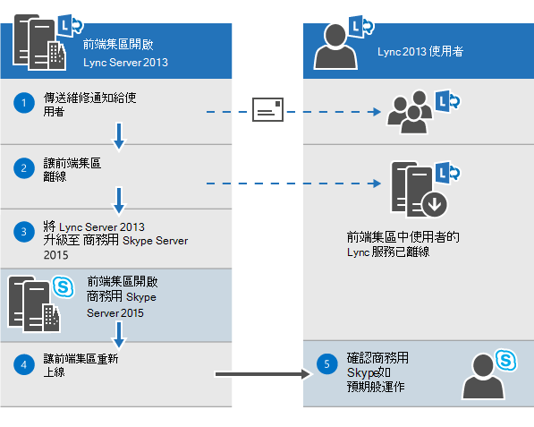
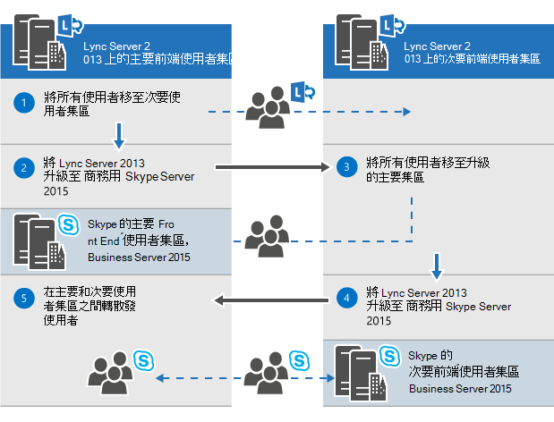
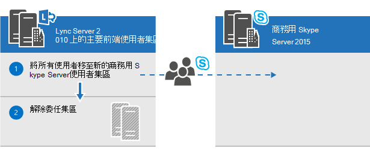
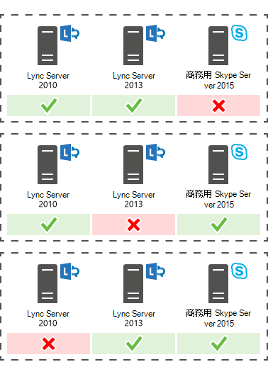

# 規劃升級為商務用 Skype Server 2015
 
摘要：瞭解在規劃升級至商務用 Skype Server 2015 時所應考慮的事項。 從 Microsoft 評估中心下載商務用 Skype Server 2015 的免費試用版，網址如下： [https://www.microsoft.com/evalcenter/evaluate-skype-for-business-server](https://www.microsoft.com/evalcenter/evaluate-skype-for-business-server) 。
  
在您計畫升級為商務用 Skype Server 2015 的一部分，請使用本主題瞭解建議的升級路徑，以商務用 Skype Server 2015、In-Place 升級的運作方式、支援的共存案例，以及升級程式的外觀。

> [!NOTE]
> 就地升級可用於商務用 Skype Server 2015，但在商務用 Skype Server 2019 中已不再支援。 支援並排 coexistance，請參閱[遷移至商務用 Skype Server 2019](../../SfBServer2019/migration/migration-to-skype-for-business-server-2019.md)以取得詳細資訊。
  
## 商務用 Skype Server 2015 的建議升級途徑

 若要從 lync server 2013、lync server 2010 或 Office 通訊伺服器 2007 R2 升級，以商務用 Skype Server 2015，請使用下列升級路徑：
  
> [!CAUTION]
> In-Place 升級會自動將會議目錄從 Lync Server 2013 移至商務用 Skype Server 2015。 不過，如果您計畫手動移動會議目錄，使用商務用 Skype Server 2015 管理命令介面非常重要。 如果您嘗試使用 lync server 2013 管理命令介面將會議目錄從 Lync server 2013 移至商務用 Skype Server 2015，可能會發生資料遺失。 一般而言，每當您使用商務用 Skype Server 2015 的容量時，您應該使用商務用 Skype Server 2015 工具集。  
  
|**版本**|**建議**|
|:-----|:-----|
|Lync Server 2013    | 若要升級，請在與集區相關聯的每個伺服器上使用商務用 Skype Server 拓撲產生器和新的 In-Place 升級功能。 如需詳細步驟，請參閱[Plan to upgrade from Lync Server 2013 to 商務用 Skype Server 2015](upgrade.md#BKMK_PlanUpgradeFromLync2013)及[upgrade to 商務用 Skype Server 2015](../deploy/upgrade-to-skype-for-business-server.md) 。   |
|Lync Server 2010 + Lync Server 2013 (雙模式)     |首先，升級至 Lync Server 2013，然後使用新的 In-Place 升級功能更新為商務用 Skype Server 2015。 不過，如果您的拓撲是主要的 Lync server 2010，您也可以將 lync server 2013 元件退回 lync server 2010，然後直接升級至商務用 Skype Server 2015。 在此情況下，您將無法使用 In-Place 升級，而且會在 Lync Server 2010 和商務用 Skype Server 2015 之間使用直聯存在性。 不支援基本存在，但支援共存。    |
|Lync Server 2010    |顯示新的商務用 Skype Server 2015 集區，然後將使用者遷移至此新集區。 然後，您就可以解除委任舊的 Lync Server 2010 集區。 從 lync server 2010 升級為商務用 Skype Server 2015 類似于從 lync server 2010 升級至 lync server 2013。 請參閱 [從 Lync server 2010 遷移至 Lync server 2013](/previous-versions/office/lync-server-2013/migration-from-lync-server-2010-to-lync-server-2013)。    |
|Office Communications Server 2007 R2    | 挑選下列兩個選項之一：    設定新的商務用 Skype Server 2015 環境。    或者，如果您的硬體和軟體符合商務用 Skype Server 2015 的需求，請升級至 Lync Server 2013，然後使用新的 In-Place 升級功能，升級至商務用 Skype Server 2015。 如需詳細資訊，請參閱[商務用 Skype Server 2015 的伺服器需求](requirements-for-your-environment/server-requirements.md)，以及[從 Office 通訊伺服器 2007 R2 遷移至 Lync Server 2013](/previous-versions/office/lync-server-2013/migration-from-office-communications-server-2007-r2-to-lync-server-2013)。    |
   
> [!NOTE]
> 商務用 Skype Server 2015 支援 SQL Server 2014，但在 Lync Server 2013 中不支援。 如果您想要從 SQL Server 2012 升級為 SQL Server 2014，則必須先使用本檔所述的 In-Place 升級方法，將集區升級至商務用 Skype Server 2015。 然後您可以從 SQL Server 2012 升級為 SQL Server 2014，請參閱[upgrade to SQL Server 2014](/sql/database-engine/install-windows/upgrade-sql-server?viewFallbackFrom=sql-server-2014)。 若要深入瞭解資料庫需求，請參閱[商務用 Skype Server 2015 的伺服器需求](requirements-for-your-environment/server-requirements.md)。 
  
## 規劃從 Lync Server 2013 升級為商務用 Skype Server 2015

您可以使用新的 In-Place 升級功能，將 Lync Server 2013 系統升級為商務用 Skype Server 2015。 就地升級提供一次按一下解決方案，以備份憑證、卸載伺服器元件、升級本機資料庫，以及安裝商務用 Skype Server 2015 角色。 就地升級搜尋以保留現有的硬體和伺服器投資，降低部署商務用 Skype Server 2015 的整體成本。
  
> [!NOTE]
> In-Place 升級可讓您在升級至商務用 Skype Server 時，使用相同的硬體。 不過，重複使用相同的硬體並不會轉化成相同的效能容量。 您不應該期望 Lync Server 2013 的效能負載和商務用 Skype Server 2015 相同。 
  
> [!NOTE]
> In-Place 升級不支援商務用 Skype Server 的高可用性或嚴重損壞修復。 
  
就地升級包括讓 Lync Server 2013 集區離線，並將其升級為商務用 Skype Server 2015 集區。 
  
### 建立 In-Place 升級計畫

制定包含下列專案的計畫：
  
1. 瞭解您目前的拓撲。
    
    > [!NOTE]
    > 在執行 In-Place 升級之前，請務必先卸載 Lync Server 2013 的 LRS 系統管理工具。 Lync Server 2013 的 LRS 系統管理工具無法與商務用 Skype Server 2015 共存。 在執行 In-Place 升級之後，請安裝新的 LRS 系統管理工具。 如需詳細資訊，請參閱[Microsoft Lync 會議室系統管理 Web 入口網站的商務用 Skype Server 2015](https://go.microsoft.com/fwlink/?LinkID=544807) 。
  
2. 升級的主要集區。
    
3. 您是否要升級封存與監控資料庫或建立新的資料庫。
    
4. 您將使用 In-Place 升級方法： [離線] 或 [移動使用者]。 在移動使用者的一部分，您也需要遷移與主要集區相關聯的全域會議目錄。 
    
5. 受影響使用者的溝通計畫。
    
6. 升級失敗時的備份計畫。
    
在升級時，主要集區中的任何使用者將無法使用服務，直到升級完成為止。 如果您有一個工作中的輔助集區，您可以在升級前將使用者移至輔助集區，以避免影響使用者。 升級之後，請將使用者移回到主要集區。
  
### 就地升級方法

In-Place 升級的情形有兩種： 
  
- 移動使用者方法，不需要使用者停機。 
    
- 離線方法，需要停機時間。
    
建議您在維護時段內排程離線方法升級，並通知使用者停機時間。
  
> [!NOTE]
> 在 Lync Server 2013 上升級配對集區時，若要將這兩個集區升級為商務用 Skype Server 2015。 在升級第一個集區之後，請務必立即升級第二個集區。 當其中一個集區執行 Lync Server 2013，而第二個集區執行商務用 Skype Server 2015 時，會將嚴重損壞修復選項降至最低。 例如，如果有一個集區執行2013，第二個集區是2015，而且發生嚴重損壞，由於當成對集區不是相同的版本時，在嚴重損壞模式中不支援集區容錯移轉，所以您會遇到資料遺失。 
  
#### 就地升級離線方法

如果您不想要在使用者集區之間移動使用者，請使用此方法。 在升級期間，使用者將無法使用 Lync 或商務用 Skype 服務。 
  
下圖顯示此程式的概述。
  

  
> [!NOTE]
> 如果您有配對的集區，請不要在升級之前 unpair 這些集區。 
  
在您開始升級伺服器集區之後，您必須完成整個集區的升級。 商務用 Skype Server 不支援只有一部分已升級的集區。 
  
#### 移動使用者方法 (無使用者停機時間) 

若要使用此方法，您可以將使用者移至另一個集區，然後再開始升級。 在升級期間，使用者可以使用 Lync 服務。 移至已升級的集區之後，即可使用商務用 Skype。 下圖顯示此程式的概述。
  
> [!IMPORTANT]
> 在移動使用者的一部分，您也需要遷移與主要集區相關聯的全域會議目錄。 PSTN 電話撥入式會議仍然會將 ConferenceID 解析為要升級的集區，而不是配對的集區。 因此，如果您仍然想要在集區中安排 PSTN 會議，以在升級期間存取，您需要移動會議目錄。 
  

  
#### 移動使用者以進行硬體升級

 如果您的硬體不符合[商務用 Skype Server 2015 的伺服器需求](requirements-for-your-environment/server-requirements.md)，請設定新的商務用 Skype Server 2015 環境，然後在那裡移動使用者。 下圖顯示從 Lync Server 2010 升級此程式的概述。 
  

  
### 就地升級程序

 使用下列步驟，從 Lync Server 2013 升級為商務用 Skype Server 2015：
  
1. 在升級之前，請先備份所有資料庫。
    
2. 請確定要升級的所有服務都處於執行中狀態。
    
3. 使用拓撲產生器升級及發行拓撲檔案。
    
4. 停止所有前端伺服器上的所有服務。
    
5. 安裝商務用 Skype Server 所需的新必要條件。
    
6. 在每一部前端伺服器上，啟動 [In-Place 升級]。
    
7. 升級完成後，請重新開機所有服務。
    
   - 針對前端集區，使用命令 Get-cspool 重新開機服務。
    
   - 若為非前端伺服器，請使用 Get-cswindowsservice。
    
> [!NOTE]
>  如果您不想升級現有的封存及監控資料庫，請在升級拓撲之前，先移除相依性。 如果您想要建立新的封存與監控資料庫，在升級期間，您可以建立新的 SQL 存放區，並將它與集區建立關聯。 您可以在主題中找到執行這項作業的步驟，[升級至商務用 Skype Server 2015](../deploy/upgrade-to-skype-for-business-server.md)。 > 就地升級不支援商務用 Skype Server 的高可用性或嚴重損壞修復。 若要避免中斷使用者的服務，請使用 [ [移動使用者] 方法 (無使用者停機時間) ](upgrade.md#bkmk_MoveUsersMethod) 升級 >。在升級程式期間，xds 副本會放在具有最多可用空間的磁片磁碟機上的本機共用資料夾中。 若後來移除該磁片，您可以執行問題，例如服務無法啟動。
  
### 升級順序

從內部向外升級拓撲。 先升級所有集區，然後再升級 edge server，最後是中央管理存放區 (CMS) 集區。 
  
### Kerberos 驗證考慮

如果您對 Web 服務使用 Kerberos 驗證，您必須在 In-Place 升級完成後，重新指派 Kerberos 帳戶並重設密碼。 若要瞭解如何執行這項操作，請參閱 [設定 Kerberos 驗證](/previous-versions/office/lync-server-2013/lync-server-2013-setting-up-kerberos-authentication)。
  
## 支援 Lync Server 2013 和 Lync Server 2010 共存

您可以在與 lync server 2013 或 lync server 2010 相同的拓撲中執行商務用 Skype Server 2015，但不能讓這三個在相同的拓撲中。
  
如果您在 lync server 2010 和 lync server 2013 之間有共同存在，建議將整個拓撲升級至 Lync server 2013，然後使用 In-Place 升級升級至商務用 Skype Server 2015。 如需詳細資訊，請參閱 [從 Lync server 2010 遷移至 Lync server 2013](/previous-versions/office/lync-server-2013/migration-from-lync-server-2010-to-lync-server-2013)。
  
如果拓撲主要是 Lync server 2010，請先將 lync server 2013 元件還原至 lync server 2010，再將拓撲升級為商務用 Skype Server 2015。 在此情況下，您會失去 In-Place 升級的優點，並在 Lync Server 2010 和商務用 Skype Server 2015 之間具有共同存在的拓撲。
  
下圖顯示商務用 Skype Server 2015 搭配 lync server 2013 和 lync server 2010 的共存支援。
  

  
## 與現有 Survivable 分支裝置和伺服器的升級程式

商務用 Skype Server 2015 不支援 Survivable 分支裝置的 In-Place 升級 (SBA) 或 Survivable Branch Server (SBS) 。
  
不過，我們確實支援 lync server 2010 或 lync server 2013 SBA/SBS 的商務用 Skype Server 資料中心共存。 
  
在規劃使用關聯的分支的 Lync Server 2013 前端 (FE) 集區的 In-Place 升級時，您可以將現有的使用者保留在 Lync Server 2013 SBA/SBS 上。 在升級期間，SBA/SBS 使用者將會進入復原模式，並將在升級完成後回到一般功能。 如需使用者在復原模式中的經驗的詳細資訊，請參閱 [Lync Server 2013 中的分支網站恢復功能](/previous-versions/office/lync-server-2013/lync-server-2013-branch-site-resiliency-features)。
  
將 Lync server 2010 拓撲遷移至商務用 Skype Server 2015 時，必須將 SBA/SBS 重新加入拓撲，類似遷移至 Lync Server 2013。 如需必要的步驟，請參閱 [將 Survivable Branch 裝置連線至 Lync Server 2013 前端集](/previous-versions/office/lync-server-2013/lync-server-2013-connecting-survivable-branch-appliance-to-lync-server-2013-front-end-pool)區。
  
對於 Lync Server 2010 和 Lync Server 2013 的共存拓撲，請先將「支援 Lync Server 2013 和 Lync 2010 Server 的共存」區段中所做的建議對齊。
  
## 另請參閱

[升級為商務用 Skype Server 2015](../deploy/upgrade-to-skype-for-business-server.md)
  
[商務用 Skype Server 2015 的環境需求](requirements-for-your-environment/environmental-requirements.md)
  
[商務用 Skype Server 2015 的伺服器需求](requirements-for-your-environment/server-requirements.md)