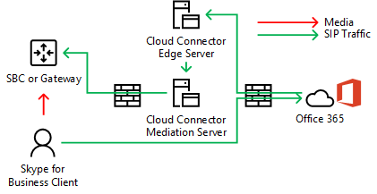

# 規劃 Cloud Connector Edition 中的媒體旁路Plan for media bypass in Cloud Connector Edition
 
閱讀此主題以查看使用雲端連接器 Edition 版本2.0 和更新版本執行媒體旁路的規劃考慮。Read this topic to review planning considerations for implementing media bypass with Cloud Connector Edition version 2.0 and later. 如需部署媒體旁路的詳細資訊，請參閱[在雲端連接器 Edition 中部署媒體旁路](deploy-media-bypass-in-cloud-connector.md)。For information about deploying media bypass, see [Deploy media bypass in Cloud Connector Edition](deploy-media-bypass-in-cloud-connector.md).
  
媒體旁路可讓用戶端直接將媒體傳送到公用交換電話網路（PSTN）的下一個躍點：閘道或會話邊界控制器（SBC），並從媒體路徑中消除雲端連接器版本元件。Media bypass allows a client to send media directly to the Public Switched Telephone Network (PSTN) next hop—a gateway or Session Border Controller (SBC)—and eliminate the Cloud Connector Edition component from the media path.
  
媒體旁路可減少延遲、封包遺失的可能性，以及可能失敗的點數，以改善語音品質。Media bypass can improve voice quality by reducing latency, the possibility of packet loss, and the number of points of potential failure. 取消略過通話的媒體處理會減少雲端連接器上的負載，使並行通話數量變得更高，而且可提高可擴充性。Elimination of media processing for bypassed calls reduces the load on Cloud Connector, which enables a higher number of concurrent calls, and can improve scalability. 
  
 從媒體處理工作中釋放 Cloud Connector 可能會減少基礎結構所需的雲端連接器裝置數目，所以應盡可能啟用媒體旁路。Freeing Cloud Connector from media processing tasks may reduce the number of Cloud Connector appliances an infrastructure requires, so you should enable media bypass whenever possible.
  
## 媒體旁路如何影響媒體和信號路徑How media bypass affects media and signaling pathways

當信號使用或不具有媒體旁路的相同路徑時，媒體流程會有所不同。While signaling takes the same path with or without media bypass, the media flow will differ. 下列圖表顯示使用和不使用媒體旁路的拓撲中的媒體和信號路徑。The following diagrams show media and signaling pathways in topologies with and without media bypass. 
  
例如，在下列拓撲中（不採用媒體旁路）：商務用 Skype 用戶端將 PSTN 通話加入外部號碼，SIP 信號會移至 Microsoft 365 或 Office 365，這會根據使用者語音原則來指示信號流量。For example, in the following topology—which does not employ media bypass—a Skype for Business client places a PSTN call to an external number, the SIP signaling goes to Microsoft 365 or Office 365, which directs the signaling traffic according to the end-user voice policy. 針對 Cloud Connector 使用者，語音原則會將信號流量指引至雲端連接器 Edge Server，然後透過雲端連接器轉送伺服器將信號流量路由傳送至 PSTN 會話邊界控制器（SBC）或閘道。For Cloud Connector users, the voice policy directs signaling traffic to the Cloud Connector Edge Server, which then routes the signaling traffic to a PSTN Session Border Controller (SBC) or gateway via the Cloud Connector Mediation Server. 媒體會從商務用 Skype 用戶端傳送至雲端連接器轉送伺服器，然後再流向 SBC 或閘道，如下圖所示：Media flows from the Skype for Business client to the Cloud Connector Mediation Server, and then to the SBC or gateway, as shown in the following diagram:
  
**沒有媒體旁路的媒體和信號路徑****Media and signaling pathways without media bypass**

  
從 PSTN 傳入的呼叫會以相反方向使用相同的信號路徑。An inbound call from the PSTN uses the same signaling path in the reverse direction. 針對內部使用者，媒體仍會在商務用 Skype 用戶端和雲端連接器轉送伺服器之間流動，然後是 SBC 或閘道。For internal users, media will still ultimately flow between the Skype for Business client and the Cloud Connector Mediation Server and then the SBC or gateway.
  
在下一個拓撲中（會使用媒體旁路）-信號會採用相同的路徑，但媒體會直接在商務用 Skype 用戶端與 SBC 或閘道之間流動，如下列圖表所示：In the next topology—which does employ media bypass—signaling takes the same path, but media flows directly between the Skype for Business client and the SBC or gateway, as shown in the following diagram:
  
**媒體和使用媒體旁路的信號路徑****Media and signaling pathways with media bypass**

  
## 多網站案例和媒體旁路Multi-site scenario and media bypass

當您想要使用單一雲端連接器裝置，將電話語音服務提供給多個網站時，媒體旁路也十分實用。Media bypass is also useful when you want to provide telephony services to multiple sites using a single Cloud Connector appliance. 因為雲端連接器無法根據來源或目的地號碼來路由呼叫，所以大多數的企業都會將 SBC 或閘道部署在雲端連接器背後，以進行路由決策。Because Cloud Connector cannot route calls based on source or destination numbers, most enterprises deploy an SBC or gateway behind Cloud Connector to make routing decisions. 在此案例中，媒體旁路會消除用戶端與中央 SBC 或閘道之間的躍點，如下圖所示：Media bypass in this scenario eliminates the hop between the client and the central SBC or gateway, as shown in the following diagram:
  
**多網站應用程式****Multi-site application**

  
1. SIP 流量會從蘇黎世的使用者流向 Microsoft 365 或 Office 365。The SIP traffic flows from the user in Zurich to Microsoft 365 or Office 365.
    
2. 然後，流量會依照使用者語音路由原則中所指定的阿姆斯特丹，路由傳送至雲端連接器裝置。The traffic then routes to the Cloud Connector appliance in Amsterdam as specified in the user voice routing policy.
    
3. 在阿姆斯特丹中的雲端連接器裝置會將 SIP 流量傳送至中央閘道，單位為阿姆斯特丹。The Cloud Connector appliance in Amsterdam sends the SIP traffic to the central gateway in Amsterdam.
    
4. 位於阿姆斯特丹的中央閘道會進行適當的路由決策，然後將流量傳送至位於蘇黎世的 SBC 或閘道，而媒體會直接在商務用 Skype 用戶端和 SBC 或閘道之間流動。The central gateway in Amsterdam makes the appropriate routing decisions, and then sends the traffic to an SBC or gateway in Zurich, while media flows directly between the Skype for Business client and SBC or gateway in Amsterdam.
    
   這種方法可讓您在每一個雲端連接器部署中為多個使用者服務提供更多使用者。This approach allows serving more users per one Cloud Connector deployment where Cloud Connector is centralized. 即使從媒體路徑中消除雲端連接器，在集中式的多網站案例中，也可能會根據需要將 WAN 傳遞到兩倍，以流過集中式 SBC 或閘道。Even though Cloud Connector is eliminated from the media path, in a centralized multi-site scenario media may still traverse the WAN twice as required to flow through the centralized SBC or gateway.
  
如果用戶端在公司網路外部進行撥出電話，則媒體流量會透過 Cloud Connector 的 Edge 和轉送伺服器，以及蘇黎世和阿姆斯特丹間的 WAN 連結來流動，如下列圖表所示：If a client is outside the corporate network placing an outbound call, the media traffic flows via the Edge and Mediation servers of Cloud Connector and WAN link between Zurich and Amsterdam, as shown in the following diagram:
  

  
## 支援的媒體旁路用戶端Supported clients for media bypass

使用第一次發行的媒體旁路時，唯一支援的用戶端是商務用 Skype 2016 Windows 用戶端，其為企業版、版本16.0.7870.2020 或更新版本的 Microsoft 365 應用程式的一部分。With the first release of media bypass, the only supported client is the Skype for Business 2016 Windows Client that is part of Microsoft 365 Apps for enterprise, version 16.0.7870.2020 or greater. 客戶可以使用任何通道： Current、延期或 First Release 延期。Customers can use any channel: Current, Deferred, or First Release Deferred. 
  
> [!NOTE]
> 如果您使用的是用戶端 VPN 方案，並結合商務用 Skype 用戶端，則只有 VPN 分割隧道設定支援媒體旁路。If you are using a client VPN solution in combination with the Skype for Business client, then media bypass is supported only with a VPN split-tunnel configuration. 
  
如需發行通道的詳細資訊，請參閱[適用于企業的 Microsoft 365 應用程式更新通道](https://support.office.com/article/Overview-of-update-channels-for-Office-365-ProPlus-9ccf0f13-28ff-4975-9bd2-7e4ea2fefef4?ui=en-US&amp;rs=en-US&amp;ad=US)。For more information about the release channels, see [Overview of update channels for Microsoft 365 Apps for enterprise](https://support.office.com/article/Overview-of-update-channels-for-Office-365-ProPlus-9ccf0f13-28ff-4975-9bd2-7e4ea2fefef4?ui=en-US&amp;rs=en-US&amp;ad=US).
  
如需不同通道之用戶端的目前發行版本本資訊，請參閱適用[于企業的 Microsoft 365 應用程式更新版本資訊](https://docs.microsoft.com/officeupdates/release-notes-office365-proplus)。For the current release version of the clients in different channels, see [Release information for updates to Microsoft 365 Apps for enterprise](https://docs.microsoft.com/officeupdates/release-notes-office365-proplus). 
  
## 媒體旁路的雲端連接器容量考慮Cloud Connector capacity considerations with media bypass

沒有媒體旁路，而且視硬體而定，雲端連接器裝置可以處理從50到500同時通話，以要求透過轉送伺服器進行媒體傳送。Without media bypass—and depending on the hardware—a Cloud Connector appliance can handle from 50 to 500 simultaneous calls that require media to travel through a Mediation Server. 如需詳細資訊，請參閱[Plan For 商務用 Skype Cloud Connector Edition](https://technet.microsoft.com/library/mt605227.aspx)。For more information, see [Plan for Skype for Business Cloud Connector Edition](https://technet.microsoft.com/library/mt605227.aspx). 
  
啟用媒體旁路時，支援的版本上的內部用戶端不會使用轉送伺服器，因此內部用戶端的數目會大幅增加。With media bypass enabled, internal clients on the supported version do not use the Mediation Server, so the number of internal clients can increase significantly. 
  
如以上所述，外部用戶端或不受支援的用戶端將使用雲端連接器 Edge 和轉送伺服器進行媒體。As noted above, external clients or unsupported clients will use the Cloud Connector Edge and Mediation servers for media. 計算網站中應放入多少雲端連接器裝置時，您必須考慮來自外部使用者的流量和不受支援之用戶端的使用者。When calculating how many Cloud Connector appliances should be placed in a site, you must consider traffic from external users and users on unsupported clients.
  
## 雲端連接器支援 Always 旁路模式Cloud Connector supports Always Bypass mode

雲端連接器只支援 Always 略用模式。Cloud Connector supports Always Bypass mode only. 在內部部署環境中，有兩種選擇：永遠略過和使用網站與地區資訊。In on-premises environments, there are two options: Always Bypass and Use Site and Region Information.
  
Always 旁路表示對內部用戶端的所有 PSTN 來電嘗試媒體旁路，以作為原始或目的地點。Always Bypass means that media bypass will be attempted for all PSTN calls with internal clients as an origin or destination point. 若要判斷用戶端是否為內部或外部用戶端，則使用轉送伺服器虛擬機器上的網站。To determine if the client is internal or external, a web site on the mediation server virtual machine is used. 如果用戶端可以到達網站，則會將它視為內部和媒體旁路使用。If the client can reach the site, it is considered internal and media bypass is used. 如果用戶端無法到達網站（例如，用戶端在家用網路上），則不會使用媒體旁路。If the client cannot reach the site (for example the client is on a home network), media bypass is not used. 
  
Always 旁路要求使用者與 PSTN 網站中的 PSTN 閘道之間有沒有障礙的連線能力。Always Bypass requires unobstructed connectivity between users and the PSTN gateways within a PSTN Site. 
  
如需詳細資訊，請參閱[Plan For 商務用 Skype Cloud Connector Edition](https://technet.microsoft.com/library/mt605227.aspx)。For more information, see [Plan for Skype for Business Cloud Connector Edition](https://technet.microsoft.com/library/mt605227.aspx). 
  
例如，在下圖中，歐洲使用者必須順利連線至三個會話邊界控制器（SBCs）中的阿姆斯特丹，我們的西部使用者必須順利連接至西雅圖的兩個 SBCs。For example, in the diagram below, Europe users must be well connected to the three Session Border Controllers (SBCs) in Amsterdam while US West users must be well connected to the two SBCs in Seattle. 已正確連接表示它們是位於與 SBCs 或閘道相同的網站，或透過具有適當頻寬的 WAN 連結。Well connected means that they are either located in the same network sites as the SBCs or gateways, or over WAN links that have proper bandwidth.
  

  
> [!NOTE]
> 如果來自蘇黎世的使用者已前往西雅圖 office，而您想要使用內部網路來傳遞歐洲的旅行使用者與閘道之間的媒體流量（而不是透過網際網路進行），則必須確定西雅圖 office 和阿姆斯特丹 office （其中歐洲的 SBCs 或閘道）已正確連接。If a user from Zurich travels to the Seattle office, and you want to use the internal network to deliver media traffic between the traveling user and gateways in Europe (as opposed to going over the Internet), then you must make sure the Seattle office and the Amsterdam office where European SBCs or gateways are located qualify as well connected. 
  
## 媒體旁路中使用的編解碼器Codecs used in media bypass

啟用媒體旁路時，用戶端與 SBC 或閘道之間的媒體流量會使用 g.711 編解碼器。With media bypass enabled, media traffic between a client and an SBC or gateway uses the G.711 codec. 
  
## 另請參閱See also

[在雲端連接器 Edition 中部署媒體旁路Deploy media bypass in Cloud Connector Edition](deploy-media-bypass-in-cloud-connector.md)
