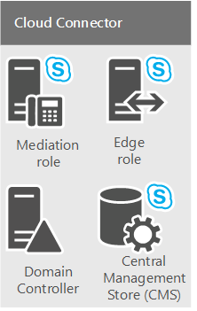
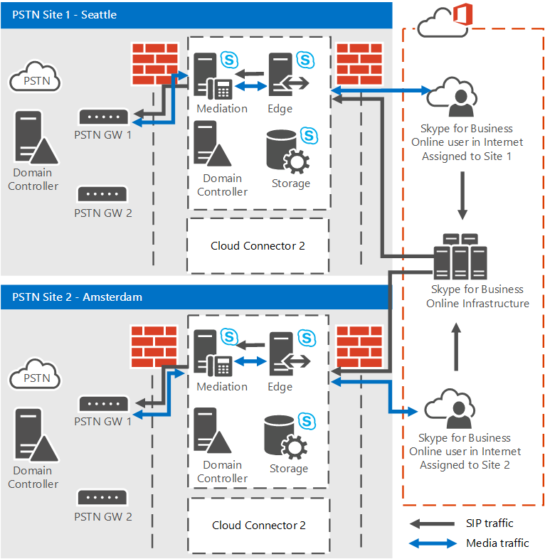
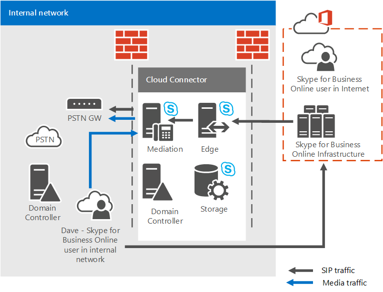

# <a name="plan-for-skype-for-business-cloud-connector-edition"></a><span data-ttu-id="06518-103">規劃商務用 Skype Cloud Connector Edition</span><span class="sxs-lookup"><span data-stu-id="06518-103">Plan for Skype for Business Cloud Connector Edition</span></span>

> [!Important]
> <span data-ttu-id="06518-104">雲端連接器 Edition 會于2021年7月31日和商務用 Skype Online 終止。</span><span class="sxs-lookup"><span data-stu-id="06518-104">Cloud Connector Edition will retire July 31, 2021 along with Skype for Business Online.</span></span> <span data-ttu-id="06518-105">當您的組織升級至小組後，請瞭解如何使用 [直接路由](https://docs.microsoft.com/MicrosoftTeams/direct-routing-landing-page)將您的內部部署電話語音網路連線到小組。</span><span class="sxs-lookup"><span data-stu-id="06518-105">Once your organization has upgraded to Teams, learn how to connect your on-premises telephony network to Teams using [Direct Routing](https://docs.microsoft.com/MicrosoftTeams/direct-routing-landing-page).</span></span>

<span data-ttu-id="06518-106">尋找適用于商務用 Skype 雲端連接器 Edition 的資訊，一組封裝式虛擬機器 (Vm) ，以 (雲端 PBX) 執行內部部署 PSTN 連線。</span><span class="sxs-lookup"><span data-stu-id="06518-106">Find information on Skype for Business Cloud Connector Edition, a set of packaged Virtual Machines (VMs) that implement on-premises PSTN connectivity with Phone System (Cloud PBX).</span></span>

<span data-ttu-id="06518-107">如果您沒有現有的 Lync Server 或商務用 Skype Server 部署，雲端連接器 Edition 可能是貴組織的正確解決方案。</span><span class="sxs-lookup"><span data-stu-id="06518-107">Cloud Connector Edition might be the right solution for your organization if you do not already have an existing Lync Server or Skype for Business Server deployment.</span></span> <span data-ttu-id="06518-108">如果您仍在調查哪一個電話系統解決方案適合您的企業，請參閱 [Microsoft 電話語音解決方案](https://docs.microsoft.com/SkypeForBusiness/hybrid/msft-telephony-solutions)。</span><span class="sxs-lookup"><span data-stu-id="06518-108">If you're still investigating which Phone System solution is right for your business, see [Microsoft telephony solutions](https://docs.microsoft.com/SkypeForBusiness/hybrid/msft-telephony-solutions).</span></span>

<span data-ttu-id="06518-109">這份檔描述 Cloud Connector Edition 需求和支援的拓撲，並協助您規劃雲端連接器 Edition 部署。</span><span class="sxs-lookup"><span data-stu-id="06518-109">This document describes Cloud Connector Edition requirements and supported topologies, and helps you plan your Cloud Connector Edition deployment.</span></span> <span data-ttu-id="06518-110">在設定雲端連接器環境之前，請務必閱讀本主題。</span><span class="sxs-lookup"><span data-stu-id="06518-110">Be sure to read this topic before you configure your Cloud Connector environment.</span></span> <span data-ttu-id="06518-111">當您準備好部署及設定 Cloud Connector Edition 時，請參閱 [configure and Manage 商務用 Skype Cloud Connector edition](configure-skype-for-business-cloud-connector-edition.md)。</span><span class="sxs-lookup"><span data-stu-id="06518-111">When you are ready to deploy and configure Cloud Connector Edition, see [Configure and manage Skype for Business Cloud Connector Edition](configure-skype-for-business-cloud-connector-edition.md).</span></span>

<span data-ttu-id="06518-112">現在可以使用雲端連接器 Edition 2.1。</span><span class="sxs-lookup"><span data-stu-id="06518-112">Cloud Connector Edition 2.1 is now available.</span></span> <span data-ttu-id="06518-113">若尚未升級至2.1，請參閱 [升級至新版本的雲端連接器](upgrade-to-a-new-version-of-cloud-connector.md)。</span><span class="sxs-lookup"><span data-stu-id="06518-113">If you have not yet upgraded to 2.1, see [Upgrade to a new version of Cloud Connector](upgrade-to-a-new-version-of-cloud-connector.md).</span></span> <span data-ttu-id="06518-114">您可以在中找到安裝檔 [https://aka.ms/CloudConnectorInstaller](https://aka.ms/CloudConnectorInstaller) 。</span><span class="sxs-lookup"><span data-stu-id="06518-114">You can find the installation file at [https://aka.ms/CloudConnectorInstaller](https://aka.ms/CloudConnectorInstaller).</span></span>

> [!NOTE]
> <span data-ttu-id="06518-115">在發行新版本之後，Microsoft 支援舊版的雲端連接器 Edition，版本為60天。</span><span class="sxs-lookup"><span data-stu-id="06518-115">Microsoft supports the previous version of Cloud Connector Edition for 60 days after the release of a new version.</span></span> <span data-ttu-id="06518-116">在2.1 發行後，Microsoft 會在60天內支援版本2.0.1，以供您升級時間。</span><span class="sxs-lookup"><span data-stu-id="06518-116">Microsoft will support version 2.0.1 for 60 days after the release of 2.1 to allow you time to upgrade.</span></span> <span data-ttu-id="06518-117">已不再支援2.0.1 之前的所有版本。</span><span class="sxs-lookup"><span data-stu-id="06518-117">All versions previous to 2.0.1 are no longer supported.</span></span>

<span data-ttu-id="06518-118">Cloud Connector Edition 是一組混合式服務，包含一組封裝式虛擬機器 (Vm) ，可對電話系統執行內部部署 PSTN 連線。</span><span class="sxs-lookup"><span data-stu-id="06518-118">Cloud Connector Edition is a hybrid offering that consists of a set of packaged Virtual Machines (VMs) that implement on-premises PSTN connectivity with Phone System.</span></span> <span data-ttu-id="06518-119">在虛擬化環境中部署最低的商務用 Skype 伺服器拓撲，組織中的使用者可以從 Microsoft 雲端接收 PBX 服務，但是 PSTN 連線是透過現有的內部部署語音基礎結構提供。</span><span class="sxs-lookup"><span data-stu-id="06518-119">By deploying a minimal Skype for Business Server topology in a virtualized environment, users in your organization who are homed in the cloud can receive PBX services from the Microsoft cloud, but PSTN connectivity is provided through the existing on-premises voice infrastructure.</span></span>


<span data-ttu-id="06518-121">因為 Cloud Connector 可讓您將電話系統服務與現有的電話語音環境（例如，PBX、類比裝置及通話中心）整合，所以您可以從現有的電話語音方案到電話系統執行分段遷移。</span><span class="sxs-lookup"><span data-stu-id="06518-121">Because Cloud Connector enables you to integrate Phone System services with your existing telephony environment—for example, PBX, analog devices, and Call Centers—you can implement a phased migration from your existing telephony solution to Phone System.</span></span>

<span data-ttu-id="06518-122">例如，假設您的公司有一個複雜的話務中心，其特定功能沒有電話系統所提供。</span><span class="sxs-lookup"><span data-stu-id="06518-122">For example, assume your company has a sophisticated Call Center with specific functionality that Phone System does not provide.</span></span> <span data-ttu-id="06518-123">您可以選擇讓話務中心使用者與現有的解決方案保持搭配，但將其他使用者移至電話系統。</span><span class="sxs-lookup"><span data-stu-id="06518-123">You can choose to leave Call Center users with the existing solution, but move other users to Phone System.</span></span>

<span data-ttu-id="06518-124">雲端連接器會提供位於內部部署和線上之使用者之間的路由，您可以選擇搭配使用您自己的 PSTN 提供者和電話系統。</span><span class="sxs-lookup"><span data-stu-id="06518-124">Cloud Connector will provide routing between the users homed on premises and online, and you can choose to use your own PSTN provider with Phone System.</span></span>

<span data-ttu-id="06518-125">規劃雲端連接器版本部署時，請考慮下列事項：</span><span class="sxs-lookup"><span data-stu-id="06518-125">Consider the following when planning your Cloud Connector Edition deployment:</span></span>

- <span data-ttu-id="06518-126">若要使用雲端連接器以利用雲端語音解決方案，您需要註冊包含電話系統的 Microsoft 365 或 Office 365 組織。</span><span class="sxs-lookup"><span data-stu-id="06518-126">To use Cloud Connector to take advantage of cloud voice solutions, you'll need to sign up for a Microsoft 365 or Office 365 organization that includes Phone System.</span></span> <span data-ttu-id="06518-127">如果您還沒有 Microsoft 365 或 Office 365 組織，您可以瞭解如何在這裡註冊： [microsoft 365 For Business](https://products.office.com/business/office)。</span><span class="sxs-lookup"><span data-stu-id="06518-127">If you do not yet have a Microsoft 365 or Office 365 organization you can learn how to sign up here: [Microsoft 365 for Business](https://products.office.com/business/office).</span></span> <span data-ttu-id="06518-128">請注意，您需要註冊包括商務用 Skype Online 的計畫。</span><span class="sxs-lookup"><span data-stu-id="06518-128">Note that you'll need to sign up for a plan that includes Skype for Business Online.</span></span>

- <span data-ttu-id="06518-129">若要使用商務用 Skype Online 服務註冊 Cloud Connector 裝置，並執行各種 Cmdlet，Cloud Connector 2.0 和更新版本需要具有商務用 Skype 租使用者管理員許可權的專屬 Microsoft 365 或 Office 365 帳戶。</span><span class="sxs-lookup"><span data-stu-id="06518-129">To register Cloud Connector appliances with the Skype for Business Online service, and to run various cmdlets, Cloud Connector 2.0 and later requires a dedicated Microsoft 365 or Office 365 account with the Skype for Business Tenant Administrator rights.</span></span> <span data-ttu-id="06518-130">2.0 之前的雲端連接器版本需要專屬的 Microsoft 365 或 Office 365 帳戶，且具有租使用者全域管理員許可權。</span><span class="sxs-lookup"><span data-stu-id="06518-130">Cloud Connector versions previous to 2.0 require a dedicated Microsoft 365 or Office 365 account with tenant Global Administrator rights.</span></span>

- <span data-ttu-id="06518-131">雲端連接器不需要完整的內部部署商務用 Skype Server 部署。</span><span class="sxs-lookup"><span data-stu-id="06518-131">Cloud Connector does not require a full on-premises Skype for Business Server deployment.</span></span>

    <span data-ttu-id="06518-132">目前，Cloud Connector 無法與 Lync 或商務用 Skype 內部部署伺服器共存。</span><span class="sxs-lookup"><span data-stu-id="06518-132">Currently, Cloud Connector cannot co-exist with Lync or Skype for Business on-premises servers.</span></span> <span data-ttu-id="06518-133">如果您想要將現有的 Lync 或商務用 Skype 使用者移至 Microsoft 365，並持續為使用者提供內部部署電話語音，請考慮使用現有的商務用 Skype 伺服器部署，使用具有內部部署連線的電話系統。</span><span class="sxs-lookup"><span data-stu-id="06518-133">If you want to move existing Lync or Skype for Business users to Microsoft 365 and keep providing on-premises telephony to your users, consider Phone System with on-premises connectivity using an existing Skype for Business Server deployment.</span></span> <span data-ttu-id="06518-134">如需詳細資訊，請參閱[在商務用 Skype Server 中](plan-phone-system-with-on-premises-pstn-connectivity.md)[規劃您的電話系統 (雲端 PBX) 解決方案](plan-your-phone-system-cloud-pbx-solution.md)及規劃使用內部部署 PSTN 連線的電話系統。</span><span class="sxs-lookup"><span data-stu-id="06518-134">For more information, see [Plan your Phone System (Cloud PBX) solution](plan-your-phone-system-cloud-pbx-solution.md) and [Plan Phone System with on-premises PSTN connectivity in Skype for Business Server](plan-phone-system-with-on-premises-pstn-connectivity.md).</span></span>

- <span data-ttu-id="06518-135">如果您有舊版商務用 Skype 或 Lync Server 部署，而且您已擴充架構，只要您已從環境中移除所有商務用 Skype 或 Lync Server 元件，便不需要清除雲端連接器部署的架構。</span><span class="sxs-lookup"><span data-stu-id="06518-135">If you had a previous Skype for Business or Lync Server deployment, and you extended the schema, you do not need to clean up the schema for the Cloud Connector deployment, as long as you've removed all Skype for Business or Lync Server components from your environment.</span></span>

- <span data-ttu-id="06518-136">您的使用者位於線上。</span><span class="sxs-lookup"><span data-stu-id="06518-136">Your users are homed online.</span></span>

- <span data-ttu-id="06518-137">如果您的組織已設定目錄同步處理 (DirSync) ，則必須先在內部部署部署中建立規劃混合式語音的所有使用者帳戶，然後再同步到雲端。</span><span class="sxs-lookup"><span data-stu-id="06518-137">If your organization has configured Directory Synchronization (DirSync), then all accounts of users who are planned for hybrid voice must be created in your on-premises deployment first, and then synchronized to the cloud.</span></span>

- <span data-ttu-id="06518-138">如有必要，您可以保留目前的 PSTN 載體。</span><span class="sxs-lookup"><span data-stu-id="06518-138">You can keep your current PSTN carrier if required.</span></span>

- <span data-ttu-id="06518-139">如果您想要將電話撥入式會議提供給雲端連接器上所裝載的使用者，您可以購買 PSTN 會議許可證或隨您從 Microsoft 前往音訊會議提供付費。</span><span class="sxs-lookup"><span data-stu-id="06518-139">If you want to provide dial-in conferencing to users hosted on Cloud Connector, you can purchase PSTN conferencing license or pay as you go Audio Conferencing offer from Microsoft.</span></span>

- <span data-ttu-id="06518-140"> (或隨隨選即付的促銷) 也是通話升級所需的。</span><span class="sxs-lookup"><span data-stu-id="06518-140">The Audio Conferencing license (or pay as you go offer) also required for call escalations.</span></span> <span data-ttu-id="06518-141">如果商務用 Skype 使用者接收來自外部 PSTN 使用者的呼叫，且想要將另一個參與者新增至該通話 (將通話提升至會議) ，將透過 Microsoft 音訊會議服務執行升級。</span><span class="sxs-lookup"><span data-stu-id="06518-141">If a Skype for Business user receives a call from an external PSTN user and wants to add one more participant to that call (escalate the call to a conference), the escalation will be performed via Microsoft Audio Conferencing service.</span></span>

- <span data-ttu-id="06518-142">Cloud Connector 2.0 和更新版本現在支援媒體旁路。</span><span class="sxs-lookup"><span data-stu-id="06518-142">Cloud Connector 2.0 and later now supports media bypass.</span></span> <span data-ttu-id="06518-143">媒體旁路可讓用戶端直接將媒體傳送到公用交換電話網路 (PSTN) 下一個躍點（閘道或會話邊界控制器 (SBC) ），並從媒體路徑中消除雲端連接器版本元件。</span><span class="sxs-lookup"><span data-stu-id="06518-143">Media bypass allows a client to send media directly to the Public Switched Telephone Network (PSTN) next hop—a gateway or Session Border Controller (SBC)—and eliminate the Cloud Connector Edition component from the media path.</span></span> <span data-ttu-id="06518-144">如需詳細資訊，請參閱 [Plan For 雲端 Connector Edition 中的媒體旁路](plan-for-media-bypass-in-cloud-connector-edition.md)。</span><span class="sxs-lookup"><span data-stu-id="06518-144">For more information, see [Plan for media bypass in Cloud Connector Edition](plan-for-media-bypass-in-cloud-connector-edition.md).</span></span>

- <span data-ttu-id="06518-145">Cloud Connector 2.1 和更新版本支援使用 Operations Management Suite (OMS) 來監視雲端連接器。</span><span class="sxs-lookup"><span data-stu-id="06518-145">Cloud Connector 2.1 and later supports monitoring Cloud Connector using Operations Management Suite (OMS).</span></span> <span data-ttu-id="06518-146">如需詳細資訊，請參閱 [使用 Operations Management Suite Monitor Cloud Connector (OMS) ](monitor-cloud-connector-using-operations-management-suite-oms.md)</span><span class="sxs-lookup"><span data-stu-id="06518-146">For more information, see [Monitor Cloud Connector using Operations Management Suite (OMS)](monitor-cloud-connector-using-operations-management-suite-oms.md)</span></span>

- <span data-ttu-id="06518-147">雲端連接器可用於所有可供 Office 365 企業版 E5 使用的國家/地區。</span><span class="sxs-lookup"><span data-stu-id="06518-147">Cloud Connector is available in all countries where Office 365 Enterprise E5 is available.</span></span>

<span data-ttu-id="06518-148">本主題包含下列各節：</span><span class="sxs-lookup"><span data-stu-id="06518-148">This topic contains the following sections:</span></span>

- [<span data-ttu-id="06518-149">雲端連接器版本元件</span><span class="sxs-lookup"><span data-stu-id="06518-149">Cloud Connector Edition components</span></span>](plan-skype-for-business-cloud-connector-edition.md#BKMK_Components)

- [<span data-ttu-id="06518-150">雲端連接器版本拓撲</span><span class="sxs-lookup"><span data-stu-id="06518-150">Cloud Connector Edition topologies</span></span>](plan-skype-for-business-cloud-connector-edition.md#BKMK_Topologies)

- [<span data-ttu-id="06518-151">部署需求</span><span class="sxs-lookup"><span data-stu-id="06518-151">Requirements for deployment</span></span>](plan-skype-for-business-cloud-connector-edition.md#BKMK_Requirements)

- [<span data-ttu-id="06518-152">部署之前所需收集的資訊</span><span class="sxs-lookup"><span data-stu-id="06518-152">Information you need to gather before deployment</span></span>](plan-skype-for-business-cloud-connector-edition.md#BKMK_PlanDeployment)

- [<span data-ttu-id="06518-153">撥號對應表考慮</span><span class="sxs-lookup"><span data-stu-id="06518-153">Dial plan considerations</span></span>](plan-skype-for-business-cloud-connector-edition.md#BKMK_DailPlan)

- [<span data-ttu-id="06518-154">高可用性考慮</span><span class="sxs-lookup"><span data-stu-id="06518-154">High availability considerations</span></span>](plan-skype-for-business-cloud-connector-edition.md#BKMK_HA)

- [<span data-ttu-id="06518-155">雲端連接器媒體流程</span><span class="sxs-lookup"><span data-stu-id="06518-155">Cloud Connector media flow</span></span>](plan-skype-for-business-cloud-connector-edition.md#BKMK_MediaFlow)

- [<span data-ttu-id="06518-156">監控及疑難排解</span><span class="sxs-lookup"><span data-stu-id="06518-156">Monitoring and troubleshooting</span></span>](plan-skype-for-business-cloud-connector-edition.md#BKMK_Monitor)

- [<span data-ttu-id="06518-157">相關資訊</span><span class="sxs-lookup"><span data-stu-id="06518-157">For more information</span></span>](plan-skype-for-business-cloud-connector-edition.md#BKMK_MoreInfo)

## <a name="cloud-connector-edition-components"></a><span data-ttu-id="06518-158">雲端連接器版本元件</span><span class="sxs-lookup"><span data-stu-id="06518-158">Cloud Connector Edition components</span></span>
<span data-ttu-id="06518-159"><a name="BKMK_Components"> </a></span><span class="sxs-lookup"><span data-stu-id="06518-159"><a name="BKMK_Components"> </a></span></span>

<span data-ttu-id="06518-160">使用雲端連接器 Edition，您可以部署一組包含最低商務用 Skype 伺服器拓撲（包含 Edge 元件、中繼元件，以及中央管理存放區 (CMS) 角色）的集。</span><span class="sxs-lookup"><span data-stu-id="06518-160">With Cloud Connector Edition, you deploy a set of packaged VMs that contain a minimal Skype for Business Server topology—consisting of an Edge component, Mediation component, and a Central Management Store (CMS) role.</span></span> <span data-ttu-id="06518-161">您也會安裝網域控制站，此為雲端連接器的內部運作所需的。</span><span class="sxs-lookup"><span data-stu-id="06518-161">You will also install a domain controller, which is required for the internal functioning of Cloud Connector.</span></span> <span data-ttu-id="06518-162">這些服務是針對混合使用的 Microsoft 365 或 Office 365 組織，設定，包含商務用 Skype Online 服務。</span><span class="sxs-lookup"><span data-stu-id="06518-162">These services are configured for hybrid with your Microsoft 365 or Office 365 organization that includes Skype for Business Online services.</span></span>



<span data-ttu-id="06518-164">雲端連接器元件提供下列功能：</span><span class="sxs-lookup"><span data-stu-id="06518-164">Cloud Connector components provide the following functionality:</span></span>

- <span data-ttu-id="06518-165">**Edge component** -內部部署拓撲與線上服務之間的通訊會透過 Edge 元件，包括下列元件：</span><span class="sxs-lookup"><span data-stu-id="06518-165">**Edge component** - Communication between the on-premises topology and the online services goes through the Edge component, which includes the following components:</span></span>

  - <span data-ttu-id="06518-166">**Access Edge** -提供內部部署和商務用 Skype Online 之間的 SIP 路由。</span><span class="sxs-lookup"><span data-stu-id="06518-166">**Access Edge** - Provides SIP routing between the on-premises deployment and Skype for Business Online.</span></span>

  - <span data-ttu-id="06518-167">**媒體轉送** -提供中繼元件與其他媒體端點之間的媒體路由。</span><span class="sxs-lookup"><span data-stu-id="06518-167">**Media Relay** - Provides routing of media between the Mediation component and other media endpoints.</span></span>

  - <span data-ttu-id="06518-168">**Media 轉送驗證/MRAS** -產生權杖以供存取媒體轉送。</span><span class="sxs-lookup"><span data-stu-id="06518-168">**Media Relay Authentication / MRAS** - Generates tokens for access to media relay.</span></span>

- <span data-ttu-id="06518-169">**輸出路由** -針對連接至雲端連接器裝置的閘道或 SBCs，提供語音流量的負載平衡。</span><span class="sxs-lookup"><span data-stu-id="06518-169">**Outbound Routing** - Provides load balancing of the voice traffic between gateways or SBCs connected to a Cloud Connector appliance.</span></span> <span data-ttu-id="06518-170">通話會平均分割所有閘道或連接至雲端連接器裝置 SBCs。</span><span class="sxs-lookup"><span data-stu-id="06518-170">Calls will be split evenly between all gateways or SBCs connected to the Cloud Connector appliance.</span></span>

    <span data-ttu-id="06518-171">根據原則提供路由傳送至閘道。</span><span class="sxs-lookup"><span data-stu-id="06518-171">Provides routing to gateways based on policies.</span></span> <span data-ttu-id="06518-172">只支援以目的地為基礎的全域原則 (輸出) PSTN 號碼。</span><span class="sxs-lookup"><span data-stu-id="06518-172">Only global policies which are based on destination (outbound) PSTN numbers are supported.</span></span>

- <span data-ttu-id="06518-173">**中央管理存放區 (CMS) role** -包括拓撲元件的設定存放區（包括 CMS 檔案傳輸）。</span><span class="sxs-lookup"><span data-stu-id="06518-173">**Central Management Store (CMS) role** - Includes the configuration store for the topology components, including CMS File Transfer.</span></span>

- <span data-ttu-id="06518-174">**中央管理存放區 (cms) 複本** -同步 cms 角色服務器上全域 CMS 資料庫的設定資訊。</span><span class="sxs-lookup"><span data-stu-id="06518-174">**Central Management Store (CMS) replica** - Synchronizes configuration information from the global CMS DB on the CMS role server.</span></span>

- <span data-ttu-id="06518-175">**網域控制站** -Cloud Connector Active Directory 網域服務，用來儲存部署雲端連接器元件所需的所有全域設定和群組。</span><span class="sxs-lookup"><span data-stu-id="06518-175">**Domain controller** - Cloud Connector Active Directory Domain Services to store all the global settings and groups necessary to deploy Cloud Connector components.</span></span> <span data-ttu-id="06518-176">每個雲端連接器裝置都會建立一個樹系。</span><span class="sxs-lookup"><span data-stu-id="06518-176">One forest will be created for each Cloud Connector appliance.</span></span> <span data-ttu-id="06518-177">網域控制站不能與實際執行 Active Directory 的任何連接。</span><span class="sxs-lookup"><span data-stu-id="06518-177">The domain controller must not have any connections with the production Active Directory.</span></span> <span data-ttu-id="06518-178">Active Directory 服務包括：</span><span class="sxs-lookup"><span data-stu-id="06518-178">Active Directory services include:</span></span>

  - <span data-ttu-id="06518-179">Active Directory Domain Services</span><span class="sxs-lookup"><span data-stu-id="06518-179">Active Directory Domain Services</span></span>

  - <span data-ttu-id="06518-180">發行內部憑證的 Active Directory 憑證服務</span><span class="sxs-lookup"><span data-stu-id="06518-180">Active Directory Certificate Services to issue internal certificates</span></span>

- <span data-ttu-id="06518-181">中繼**元件**-在商務用 SKYPE 與 PSTN 閘道之間實現 SIP 和媒體閘道對應通訊協定。</span><span class="sxs-lookup"><span data-stu-id="06518-181">**Mediation component** - Implements SIP and Media gateway mapping protocol between Skype for Business and PSTN gateways.</span></span> <span data-ttu-id="06518-182">包含一個 CMS 複本，它會同步處理全域 CMS 資料庫的設定。</span><span class="sxs-lookup"><span data-stu-id="06518-182">Includes a CMS replica that synchronizes configuration from the global CMS database.</span></span>

## <a name="cloud-connector-edition-topologies"></a><span data-ttu-id="06518-183">雲端連接器版本拓撲</span><span class="sxs-lookup"><span data-stu-id="06518-183">Cloud Connector Edition topologies</span></span>
<span data-ttu-id="06518-184"><a name="BKMK_Topologies"> </a></span><span class="sxs-lookup"><span data-stu-id="06518-184"><a name="BKMK_Topologies"> </a></span></span>

<span data-ttu-id="06518-185">針對本次討論的目的，我們將會參考 PSTN 網站。</span><span class="sxs-lookup"><span data-stu-id="06518-185">For purposes of this discussion, we will refer to PSTN sites.</span></span> <span data-ttu-id="06518-186">PSTN 網站是雲端連接器裝置的組合，部署于相同位置，並與通用 PSTN 閘道相連。</span><span class="sxs-lookup"><span data-stu-id="06518-186">A PSTN site is a combination of Cloud Connector appliances, deployed at the same location, and with common PSTN gateways connected to them.</span></span> <span data-ttu-id="06518-187">PSTN 網站可讓您：</span><span class="sxs-lookup"><span data-stu-id="06518-187">PSTN sites allow you to:</span></span>

- <span data-ttu-id="06518-188">提供最接近使用者之閘道的連線能力。</span><span class="sxs-lookup"><span data-stu-id="06518-188">Provide connectivity to gateways that are closest to your users.</span></span>

- <span data-ttu-id="06518-189">在一個或多個 PSTN 網站內部署多個雲端連接器裝置，允許可擴充性。</span><span class="sxs-lookup"><span data-stu-id="06518-189">Allow for scalability by deploying multiple Cloud Connector appliances within one or more PSTN sites.</span></span>

- <span data-ttu-id="06518-190">在單一 PSTN 網站內部署多個雲端連接器裝置，允許高可用性。</span><span class="sxs-lookup"><span data-stu-id="06518-190">Allow for high availability by deploying multiple Cloud Connector appliances within a single PSTN site.</span></span>

<span data-ttu-id="06518-191">本主題將介紹 PSTN 網站。</span><span class="sxs-lookup"><span data-stu-id="06518-191">This topic introduces PSTN sites.</span></span> <span data-ttu-id="06518-192">如需規劃 PSTN 網站的詳細資訊，請參閱 [Plan For Cloud Connector EDITION PSTN sites](plan-for-cloud-connector-edition-pstn-sites.md)。</span><span class="sxs-lookup"><span data-stu-id="06518-192">For more information about planning your PSTN sites, see [Plan for Cloud Connector Edition PSTN sites](plan-for-cloud-connector-edition-pstn-sites.md).</span></span>

<span data-ttu-id="06518-193">您可以部署下列 Cloud Connector 拓撲：</span><span class="sxs-lookup"><span data-stu-id="06518-193">You can deploy the following Cloud Connector topologies:</span></span>

- <span data-ttu-id="06518-194">每個 PSTN 網站單一雲端連接器 Edition 裝置。</span><span class="sxs-lookup"><span data-stu-id="06518-194">A single Cloud Connector Edition appliance per PSTN site.</span></span> <span data-ttu-id="06518-195">此拓撲僅適用于評估目的，因為它沒有提供高可用性。</span><span class="sxs-lookup"><span data-stu-id="06518-195">This topology is recommended for evaluation purposes only because it does not provide high availability.</span></span>

- <span data-ttu-id="06518-196">每個 PSTN 網站多個雲端連接器 Edition 裝置，以提供高可用性。</span><span class="sxs-lookup"><span data-stu-id="06518-196">Multiple Cloud Connector Edition appliances per PSTN site to provide high availability.</span></span>

- <span data-ttu-id="06518-197">具有多個雲端連接器 Edition 裝置的多個 PSTN 網站，可提供高可用性的可擴充性。</span><span class="sxs-lookup"><span data-stu-id="06518-197">Multiple PSTN sites with multiple Cloud Connector Edition appliances to provide scalability with high availability.</span></span> <span data-ttu-id="06518-198">您最多可以部署200網站。</span><span class="sxs-lookup"><span data-stu-id="06518-198">You can deploy up to 200 sites.</span></span>

<span data-ttu-id="06518-199">規劃拓撲時，請考慮下列各項：</span><span class="sxs-lookup"><span data-stu-id="06518-199">When planning your topology, consider the following:</span></span>

- <span data-ttu-id="06518-200">在雲端連接器2.0 和更新版本中，一部 PSTN 網站最多可以有16個雲端連接器裝置。</span><span class="sxs-lookup"><span data-stu-id="06518-200">With Cloud Connector 2.0 and later, one PSTN site can have up to 16 Cloud Connector appliances.</span></span> <span data-ttu-id="06518-201">先前版本支援每個網站最多4個裝置。</span><span class="sxs-lookup"><span data-stu-id="06518-201">Previous versions support up to 4 appliances per site.</span></span>

- <span data-ttu-id="06518-202">有兩種類型的硬體設定使用雲端連接器進行測試：</span><span class="sxs-lookup"><span data-stu-id="06518-202">There are two types of hardware configurations tested with Cloud Connector:</span></span>

  - <span data-ttu-id="06518-203">較大的版本可以處理大量同時通話，而且在所有類型的實際生產環境中都支援。</span><span class="sxs-lookup"><span data-stu-id="06518-203">The larger version is capable of handling large volumes of simultaneous calls and is supported in all types of production environments.</span></span>

  - <span data-ttu-id="06518-204">較小的版本是要在低端硬體上執行，而且可用於評估用途，或適用于低通話量的網站。</span><span class="sxs-lookup"><span data-stu-id="06518-204">The smaller version is intended to run on lower-end hardware and can be used for evaluation purposes or for sites with low call volumes.</span></span> <span data-ttu-id="06518-205">如果您部署的是較小型的雲端連接器版本，您仍然需要注意生產類別的硬體需求 (例如雙電源供應) 。</span><span class="sxs-lookup"><span data-stu-id="06518-205">If you deploy a smaller version of Cloud Connector, you still need to be mindful of production-class hardware requirements (such as dual power supplies).</span></span>

- <span data-ttu-id="06518-206">如果您有雲端連接器版本2.0 或更新版本，且您使用較大的硬體) 部署16裝置 (的最大設定，則您的 PSTN 網站可以處理最多8000同時通話。</span><span class="sxs-lookup"><span data-stu-id="06518-206">If you have Cloud Connector version 2.0 or later and you deploy the maximum configuration of 16 appliances (with larger hardware), then your PSTN site can handle up to 8,000 simultaneous calls.</span></span> <span data-ttu-id="06518-207">如果您部署的是較小的版本，支援的限制為800。</span><span class="sxs-lookup"><span data-stu-id="06518-207">If you deploy the smaller version, the supported limit is 800.</span></span>

    <span data-ttu-id="06518-208">您也需要專用某些裝置以取得高可用性。</span><span class="sxs-lookup"><span data-stu-id="06518-208">You also need to dedicate some appliances for High Availability.</span></span> <span data-ttu-id="06518-209">最小建議是一個裝置應該保留以取得高可用性。</span><span class="sxs-lookup"><span data-stu-id="06518-209">The minimal recommendation is that one appliance should be reserved for High Availability.</span></span>

  - <span data-ttu-id="06518-210">使用第2版時，如果您部署了 15 + 1 設定，您的 PSTN 網站可以處理最多7500同時通話。</span><span class="sxs-lookup"><span data-stu-id="06518-210">With version 2, If you deploy a 15+1 configuration, your PSTN site can handle up to 7,500 simultaneous calls.</span></span>

  - <span data-ttu-id="06518-211">如果您有較舊的版本，且使用較大的硬體) 部署最多 3 + 1 設定 (，則您的 PSTN 網站最多可以處理1500同時通話。</span><span class="sxs-lookup"><span data-stu-id="06518-211">If you have an earlier version, and deploy the maximum 3 + 1 configuration (with larger hardware), then your PSTN site can handle up to 1500 simultaneous calls.</span></span> <span data-ttu-id="06518-212">如果您部署的是較小的版本，支援的限制為150。</span><span class="sxs-lookup"><span data-stu-id="06518-212">If you deploy the smaller version, the supported limit is 150.</span></span>

-  <span data-ttu-id="06518-213">如果您需要每個 PSTN 網站有多個通話，您可以在相同位置部署其他 PSTN 網站，以進行擴充。</span><span class="sxs-lookup"><span data-stu-id="06518-213">If you need to have more calls per PSTN site, you can scale up by deploying additional PSTN sites in the same location.</span></span>

> [!NOTE]
> <span data-ttu-id="06518-214">除非另有說明，否則以下的圖表和範例會假設使用的是較大版本的雲端連接器。</span><span class="sxs-lookup"><span data-stu-id="06518-214">Unless noted, the diagrams and examples below assume the use of the larger version of Cloud Connector.</span></span>

### <a name="single-cloud-connector-appliance-within-a-single-pstn-site"></a><span data-ttu-id="06518-215">單一 PSTN 網站內的單一雲端連接器裝置</span><span class="sxs-lookup"><span data-stu-id="06518-215">Single Cloud Connector appliance within a single PSTN site</span></span>

<span data-ttu-id="06518-216">下圖顯示單一 PSTN 網站內的單一雲端連接器 Edition 裝置。</span><span class="sxs-lookup"><span data-stu-id="06518-216">The following diagram shows a single Cloud Connector Edition appliance within a single PSTN site.</span></span> <span data-ttu-id="06518-217">請注意，雲端連接器是由四個 Vm 組成，這些 Vm 是安裝在周邊網路中的一部實體主機上，以進行安全性用途。</span><span class="sxs-lookup"><span data-stu-id="06518-217">Note that Cloud Connector consists of four VMs installed on one physical host machine that is within a perimeter network for security purposes.</span></span>


### <a name="multiple-cloud-connector-appliances-within-a-single-pstn-site"></a><span data-ttu-id="06518-219">單一 PSTN 網站中的多個雲端連接器裝置</span><span class="sxs-lookup"><span data-stu-id="06518-219">Multiple Cloud Connector appliances within a single PSTN site</span></span>

 <span data-ttu-id="06518-220">出於可伸縮性和高可用性的目的，您可以選擇在單一 PSTN 網站內有多個雲端連接器版本，如下圖所示。</span><span class="sxs-lookup"><span data-stu-id="06518-220">For scalability and high availability purposes, you can choose to have multiple Cloud Connector Editions within a single PSTN site as shown in the following diagram.</span></span> <span data-ttu-id="06518-221">請考慮下列項目：</span><span class="sxs-lookup"><span data-stu-id="06518-221">Consider the following:</span></span>

- <span data-ttu-id="06518-222">通話會以隨機順序分配至一個集區中的雲端連接器。</span><span class="sxs-lookup"><span data-stu-id="06518-222">Calls are distributed in random order between Cloud Connectors in one pool.</span></span>

- <span data-ttu-id="06518-223">針對容量規劃的目的，您必須考慮在一或多個雲端連接器離線時處理負載的能力，其依據如下的計算：</span><span class="sxs-lookup"><span data-stu-id="06518-223">For capacity planning purposes, you must consider the ability to handle the load if one or more Cloud Connectors go offline, based on the following calculations:</span></span>

  - <span data-ttu-id="06518-224">**N + 1 方塊。**</span><span class="sxs-lookup"><span data-stu-id="06518-224">**N+1 boxes.**</span></span> <span data-ttu-id="06518-225">針對較大型版本的雲端連接器，N + 1 方塊支援 500 \* N 並行通話，具有99.8% 的可用性。</span><span class="sxs-lookup"><span data-stu-id="06518-225">For the larger version of Cloud Connector, N+1 boxes support 500\*N concurrent calls with 99.8% availability.</span></span>

    <span data-ttu-id="06518-226">若為較小型版本的雲端連接器，N + 1 方塊支援 50 \* N 同時通話，具有99.8% 的可用性。</span><span class="sxs-lookup"><span data-stu-id="06518-226">For the smaller version of Cloud Connector, N+1 boxes support 50\*N concurrent calls with 99.8% availability.</span></span>

  - <span data-ttu-id="06518-227">**N + 2 方塊。**</span><span class="sxs-lookup"><span data-stu-id="06518-227">**N+2 boxes.**</span></span> <span data-ttu-id="06518-228">針對較大型版本的雲端連接器，N + 2 方塊支援 500 \* N 同時通話，具有99.9% 的可用性。</span><span class="sxs-lookup"><span data-stu-id="06518-228">For the larger version of Cloud Connector, N+2 boxes support 500\*N concurrent calls with 99.9% availability.</span></span>

    <span data-ttu-id="06518-229">若為較小型版本的雲端連接器，N + 2 方塊支援 50 \* N 同時通話，具有99.9% 的可用性。</span><span class="sxs-lookup"><span data-stu-id="06518-229">For the smaller version of Cloud Connector, N+2 boxes support 50\*N concurrent calls with 99.9% availability.</span></span>


### <a name="multiple-pstn-sites-with-one-or-more-cloud-connectors-per-site"></a><span data-ttu-id="06518-231">每個網站有一個或多個雲端連接器的多個 PSTN 網站</span><span class="sxs-lookup"><span data-stu-id="06518-231">Multiple PSTN sites with one or more Cloud Connectors per site</span></span>

<span data-ttu-id="06518-232">您也可以選擇在每個網站中有多個具有一個或多個雲端連接器版本的 PSTN 網站。</span><span class="sxs-lookup"><span data-stu-id="06518-232">You can also choose to have multiple PSTN sites with one or more Cloud Connector Editions in each site.</span></span> <span data-ttu-id="06518-233">如果您的 PSTN 網站達到同時呼叫的限制，您可以新增另一個 PSTN 網站來處理負載。</span><span class="sxs-lookup"><span data-stu-id="06518-233">If your PSTN site reaches the limit of simultaneous calls, you can add another PSTN site to handle the load.</span></span>

<span data-ttu-id="06518-234">多個 PSTN 網站也可讓您提供最接近使用者之閘道的連線能力。</span><span class="sxs-lookup"><span data-stu-id="06518-234">Multiple PSTN sites also allow you to provide connectivity to gateways that are closest to your users.</span></span> <span data-ttu-id="06518-235">例如，假設您在西雅圖和阿姆斯特丹中有 PSTN 閘道。</span><span class="sxs-lookup"><span data-stu-id="06518-235">For example, assume you have PSTN gateways in Seattle and Amsterdam.</span></span> <span data-ttu-id="06518-236">您可以部署兩部 PSTN 網站（一個在西雅圖，一個在阿姆斯特丹中），並指派使用者使用最接近的 pstn 網站。</span><span class="sxs-lookup"><span data-stu-id="06518-236">You can deploy two PSTN sites—one in Seattle, one in Amsterdam—and assign users to use the PSTN site that is closest to them.</span></span> <span data-ttu-id="06518-237">西雅圖的使用者將會路由傳送到西雅圖 PSTN 網站和閘道，而將阿姆斯特丹中的使用者路由傳送至阿姆斯特丹 PSTN 網站和閘道：</span><span class="sxs-lookup"><span data-stu-id="06518-237">Users from Seattle will be routed to the Seattle PSTN site and gateways, while users in Amsterdam will be routed to the Amsterdam PSTN site and gateways:</span></span>



## <a name="requirements-for-deployment"></a><span data-ttu-id="06518-239">部署需求</span><span class="sxs-lookup"><span data-stu-id="06518-239">Requirements for deployment</span></span>
<span data-ttu-id="06518-240"><a name="BKMK_Requirements"> </a></span><span class="sxs-lookup"><span data-stu-id="06518-240"><a name="BKMK_Requirements"> </a></span></span>

<span data-ttu-id="06518-241">部署雲端連接器 Edition 之前，請確定您的環境具備下列各項：</span><span class="sxs-lookup"><span data-stu-id="06518-241">Before you deploy Cloud Connector Edition, make sure you have the following for your environment:</span></span>

- <span data-ttu-id="06518-242">**針對主機機-** 雲端連接器 Vm 必須部署在已啟用 Hyper-V 角色的專屬硬體上，且執行 Windows Server 2012 R2 Datacenter edition (英文) 。</span><span class="sxs-lookup"><span data-stu-id="06518-242">**For the host machine -** Cloud Connector VMs must be deployed on dedicated hardware running Windows Server 2012 R2 Datacenter edition (English) with the Hyper-V role enabled.</span></span>

    <span data-ttu-id="06518-243">針對版本2.0 和更新版本，系結至商務用 Skype 網路的主機電腦網卡，必須在與雲端連接器公司網路機器相同的子網中設定 IP 位址。</span><span class="sxs-lookup"><span data-stu-id="06518-243">For version 2.0 and later, the host computer network card bound to the Skype for Business Corpnet switch must have an IP address configured in the same subnet as the Cloud Connector corporate network machines.</span></span>

- <span data-ttu-id="06518-244">針對2.1 和更新版本，主機裝置必須已安裝 .NET Framework 4.6.1 或更新版本。</span><span class="sxs-lookup"><span data-stu-id="06518-244">For versions 2.1 and later, the host appliance must have .NET Framework 4.6.1 or later installed.</span></span>

- <span data-ttu-id="06518-245">**針對虛擬機器-** Windows Server 2012 R2 ISO (英文) image ( .iso) 。</span><span class="sxs-lookup"><span data-stu-id="06518-245">**For the virtual machines -** A Windows Server 2012 R2 ISO (English) image (.iso).</span></span> <span data-ttu-id="06518-246">ISO 將會轉換成 Vhd，以執行將會執行商務用 Skype 雲端連接器 Edition 的虛擬機器。</span><span class="sxs-lookup"><span data-stu-id="06518-246">The ISO will be converted to VHDs for the virtual machines that will run Skype for Business Cloud Connector Edition.</span></span>

- <span data-ttu-id="06518-247">在您的部署中支援每個雲端連接器 Edition 安裝4個 Vm 所需的硬體。</span><span class="sxs-lookup"><span data-stu-id="06518-247">The necessary hardware to support installation of the 4 VMs for each Cloud Connector Edition in your deployment.</span></span> <span data-ttu-id="06518-248">建議使用下列設定：</span><span class="sxs-lookup"><span data-stu-id="06518-248">The following configurations are recommended:</span></span>

  - <span data-ttu-id="06518-249">64位雙處理器，六個核心 (12 個實核心) ，2.50 十億位元 (GHz) 或更高版本</span><span class="sxs-lookup"><span data-stu-id="06518-249">64-bit dual processor, six core (12 real cores), 2.50 gigahertz (GHz) or higher</span></span>

  - <span data-ttu-id="06518-250">64 gb (GB) ECC RAM</span><span class="sxs-lookup"><span data-stu-id="06518-250">64 gigabytes (GB) ECC RAM</span></span>

  - <span data-ttu-id="06518-251">4 600 GB (或更好) 10K RPM 128M 快取 SAS 6Gbps 磁片，已在 RAID 5 設定中設定</span><span class="sxs-lookup"><span data-stu-id="06518-251">Four 600 GB (or better) 10K RPM 128M Cache SAS 6Gbps disks, configured in a RAID 5 configuration</span></span>

  - <span data-ttu-id="06518-252">三個 1 Gbps RJ45 高輸送量網路介面卡</span><span class="sxs-lookup"><span data-stu-id="06518-252">Three 1 Gbps RJ45 high throughput network adapters</span></span>

- <span data-ttu-id="06518-253">如果您選擇部署支援高達50同時通話的較小版本的雲端連接器版本，則需要下列硬體：</span><span class="sxs-lookup"><span data-stu-id="06518-253">If you choose to deploy the smaller version of Cloud Connector Edition that supports up to 50 simultaneous calls, you will need the following hardware:</span></span>

  - <span data-ttu-id="06518-254">Intel i7 4790 四核含英特爾4600圖形 (無需高端圖形) </span><span class="sxs-lookup"><span data-stu-id="06518-254">Intel i7 4790 quad core with Intel 4600 Graphics (no high end graphics needed)</span></span>

  - <span data-ttu-id="06518-255">32 GB DDR3-1600 非 ECC</span><span class="sxs-lookup"><span data-stu-id="06518-255">32 GB DDR3-1600 non ECC</span></span>

  - <span data-ttu-id="06518-256">2： 1TB 7200RPM SATA III (RAID 0 中的 6 Gbps) </span><span class="sxs-lookup"><span data-stu-id="06518-256">2: 1TB 7200RPM SATA III (6 Gbps) in RAID 0</span></span>

  - <span data-ttu-id="06518-257">2: 1 Gbps 乙太 (RJ45) </span><span class="sxs-lookup"><span data-stu-id="06518-257">2: 1 Gbps Ethernet (RJ45)</span></span>

- <span data-ttu-id="06518-258">若主機電腦需要有 proxy 伺服器來流覽網際網路，則您必須進行下列設定變更：</span><span class="sxs-lookup"><span data-stu-id="06518-258">If a proxy server is required on the host machine for browsing the Internet, then you must make the following configuration changes:</span></span>

  - <span data-ttu-id="06518-259">若要略過 proxy，請指定使用 proxy 伺服器設定 WinHTTP Proxy 設定，以及包含 " \* 192.168.213" 的旁路清單。您的雲端連接器 Managements 服務和商務用 Skype 網路服務子網所用的網路（如您的 CloudConnector.ini 檔案中所定義）。</span><span class="sxs-lookup"><span data-stu-id="06518-259">To bypass the proxy, specify WinHTTP Proxy settings set with your proxy server and a Bypass-list including the "192.168.213.\*" network used by your Cloud Connector Managements services and Skype for Business Corpnet subnet as defined in your CloudConnector.ini file.</span></span> <span data-ttu-id="06518-260">否則，管理連線會失敗並避免雲端連接器的部署和自動修復。</span><span class="sxs-lookup"><span data-stu-id="06518-260">Otherwise, management connectivity will fail and prevent the deployment and auto recovery of Cloud Connector.</span></span> <span data-ttu-id="06518-261">以下是一個範例 winHTTP 設定命令： netsh winHTTP set proxy "10.10.10.175： 8080" 旁路-list = " \* local; 1. \* ;172.20. \* ; 192.168.218. \* ' \<local\> "。</span><span class="sxs-lookup"><span data-stu-id="06518-261">The following is a sample winhttp configuration command: netsh winhttp set proxy "10.10.10.175:8080" bypass-list="\*.local;1.\*;172.20.\*;192.168.218.\*'\<local\>".</span></span>

  - <span data-ttu-id="06518-262">指定每個機器的 proxy 設定，而非每個使用者。</span><span class="sxs-lookup"><span data-stu-id="06518-262">Specify proxy settings per machine rather than per user.</span></span> <span data-ttu-id="06518-263">否則 Cloud Connector 下載將會失敗。</span><span class="sxs-lookup"><span data-stu-id="06518-263">Otherwise Cloud Connector downloads will fail.</span></span> <span data-ttu-id="06518-264">您可以使用登錄變更或「群組原則」設定來指定每台電腦的 proxy 設定，如下所示：</span><span class="sxs-lookup"><span data-stu-id="06518-264">You can specify proxy settings per machine with a registry change or with the Group Policy setting as follows:</span></span>

  - <span data-ttu-id="06518-265">登錄 **：** HKEY_LOCAL_MACHINE \SOFTWARE\Policies\Microsoft\Windows\CurrentVersion\Internet Settings] ProxySettingsPerUser dword：00000000</span><span class="sxs-lookup"><span data-stu-id="06518-265">**Registry:** HKEY_LOCAL_MACHINE\SOFTWARE\Policies\Microsoft\Windows\CurrentVersion\Internet Settings] ProxySettingsPerUser dword:00000000</span></span>

  - <span data-ttu-id="06518-266">**群組原則：** 電腦系統 \> 管理範本 \> Windows 元件 \> ： Internet Explorer：以每個機器 (，而不是依據每個使用者來建立 Proxy 設定) </span><span class="sxs-lookup"><span data-stu-id="06518-266">**Group Policy:** Computer\>Administrative Templates\>Windows Components\> Internet Explorer: Make Proxy settings per machine (rather than per user)</span></span>

- <span data-ttu-id="06518-267">合格的 PBX/主幹或合格的 SBC/閘道 () 建議至少兩個閘道。</span><span class="sxs-lookup"><span data-stu-id="06518-267">Qualified PBX/Trunk or qualified SBC/Gateway (a minimum of two gateways is recommended).</span></span>

    <span data-ttu-id="06518-268">雲端連接器支援相同的會話邊界控制器 (已驗證商務用 Skype 的 SBCs) 。</span><span class="sxs-lookup"><span data-stu-id="06518-268">Cloud Connector supports the same Session Border Controllers (SBCs) that are certified for Skype for Business.</span></span> <span data-ttu-id="06518-269">如需詳細資訊，請參閱 [商務用 Skype 的電話語音基礎結構](https://docs.microsoft.com/SkypeForBusiness/certification/infra-gateways)。</span><span class="sxs-lookup"><span data-stu-id="06518-269">For more information, see [Telephony Infrastructure for Skype for Business](https://docs.microsoft.com/SkypeForBusiness/certification/infra-gateways).</span></span>

- <span data-ttu-id="06518-270">本機伺服器管理員帳戶，具有在主伺服器上安裝及設定 Hyper-V 的許可權。</span><span class="sxs-lookup"><span data-stu-id="06518-270">A local server administrator account with permissions to install and configure Hyper-V on the host servers.</span></span> <span data-ttu-id="06518-271">此帳戶必須在安裝及設定 Hyper-V 的本機伺服器上具有系統管理員許可權。</span><span class="sxs-lookup"><span data-stu-id="06518-271">The account must have administrator permissions on the local server where Hyper-V is installed and configured.</span></span>

- <span data-ttu-id="06518-272">在部署期間，系統會要求您建立具有許可權的網域管理員帳戶，以在雲端連接器網域中建立及發行拓撲。</span><span class="sxs-lookup"><span data-stu-id="06518-272">During the deployment, you will be asked to create a domain administrator account with permissions to create and publish the topology in the Cloud Connector domain.</span></span>

- <span data-ttu-id="06518-273">在安裝套件隨附的 CloudConnector.ini 檔案中定義的外部 DNS 記錄：</span><span class="sxs-lookup"><span data-stu-id="06518-273">The external DNS records, which are defined in the CloudConnector.ini file included with the installation package:</span></span>

  - <span data-ttu-id="06518-274">Edge 元件的 Access Edge service 的外部 DNS 記錄;例如， \<Domain Name\> ap。</span><span class="sxs-lookup"><span data-stu-id="06518-274">External DNS record for Access Edge service of Edge component; for example, ap.\<Domain Name\>.</span></span> <span data-ttu-id="06518-275">您需要每個 PSTN 網站有一筆記錄。</span><span class="sxs-lookup"><span data-stu-id="06518-275">You need one record per PSTN site.</span></span> <span data-ttu-id="06518-276">此記錄必須包含該網站所有邊緣的 IP 位址。</span><span class="sxs-lookup"><span data-stu-id="06518-276">This record must contain IP addresses of all Edges for that site.</span></span>

- <span data-ttu-id="06518-277">建立所有必要的 DNS 和 SRV 記錄的 Microsoft 365 或 Office 365 組織。</span><span class="sxs-lookup"><span data-stu-id="06518-277">A Microsoft 365 or Office 365 organization with all required DNS and SRV records created.</span></span>

    > [!IMPORTANT]
    > <span data-ttu-id="06518-278">當您將租使用者與 Cloud Connector Edition 整合時，不支援使用預設網域尾碼 onmicrosoft.com，做為組織的 SIP 網域。</span><span class="sxs-lookup"><span data-stu-id="06518-278">When you integrate your tenant with Cloud Connector Edition, the use of the default domain suffix, .onmicrosoft.com, as a SIP domain for your organization is not supported.</span></span> <span data-ttu-id="06518-279">> 您無法使用 sip。\<Domain Name\></span><span class="sxs-lookup"><span data-stu-id="06518-279">> You cannot use sip.\<Domain Name\></span></span> <span data-ttu-id="06518-280">做為您的雲端連接器 Edge Access proxy 介面的名稱，因為 Microsoft 365 和 Office 365 使用此 DNS 記錄。</span><span class="sxs-lookup"><span data-stu-id="06518-280">as the name of your Cloud Connector Edge Access proxy interface because this DNS record is used by Microsoft 365 and Office 365.</span></span>

- <span data-ttu-id="06518-281">從公用憑證授權單位取得之外部 Edge 的憑證 (CA) 。</span><span class="sxs-lookup"><span data-stu-id="06518-281">A certificate for the external Edge obtained from a public Certificate Authority (CA).</span></span>

- <span data-ttu-id="06518-282">允許流量已完成之必要端口的防火牆規則。</span><span class="sxs-lookup"><span data-stu-id="06518-282">Firewall rules to allow traffic through the required ports has been completed.</span></span>

- <span data-ttu-id="06518-283">主機和虛擬機器的網際網路連線。</span><span class="sxs-lookup"><span data-stu-id="06518-283">An Internet connection for the host machine and the VMs.</span></span> <span data-ttu-id="06518-284">雲端連接器會從網際網路下載部分軟體;因此，您必須提供閘道和 DNS 伺服器資訊，使雲端連接器主機電腦與 Vm 可以連線到網際網路，並下載必要的軟體。</span><span class="sxs-lookup"><span data-stu-id="06518-284">Cloud Connector downloads some software from the Internet; therefore, you must provide gateway and DNS server information so that the Cloud Connector host machine and VMs can connect to the Internet and download the necessary software.</span></span>

- <span data-ttu-id="06518-285">安裝在主機電腦上的承租人遠端 PowerShell 模組。</span><span class="sxs-lookup"><span data-stu-id="06518-285">A tenant remote PowerShell module installed on the host machine.</span></span>

- <span data-ttu-id="06518-286">執行遠端 PowerShell 的商務用 Skype 系統管理員認證。</span><span class="sxs-lookup"><span data-stu-id="06518-286">The Skype for Business administrator credentials to run remote PowerShell.</span></span>

    > [!IMPORTANT]
    > <span data-ttu-id="06518-287">管理員帳戶不得啟用多重要素驗證。</span><span class="sxs-lookup"><span data-stu-id="06518-287">The administrator account MUST NOT have multi-factor authentication enabled.</span></span>

> [!NOTE]
> <span data-ttu-id="06518-288">僅 Microsoft Hyper-V 虛擬化平臺支援雲端連接器部署。</span><span class="sxs-lookup"><span data-stu-id="06518-288">Cloud Connector deployment is only supported on the Microsoft Hyper-V virtualized platform.</span></span> <span data-ttu-id="06518-289">不支援其他平臺（如 VMware 和 Amazon Web 服務）。</span><span class="sxs-lookup"><span data-stu-id="06518-289">Other platforms, such as VMware and Amazon Web Services, are not supported.</span></span>

> [!NOTE]
> <span data-ttu-id="06518-290">執行雲端連接器的最低硬體指引是以基本硬體容量為基礎的 (核心、MHz、gb 等等) ，但有一些緩衝區可容納因在任何電腦架構中的無形效能障礙。</span><span class="sxs-lookup"><span data-stu-id="06518-290">The minimum hardware guidance to run Cloud Connector is based on basic hardware capacity (cores, MHz, gigabytes, and so on) with some buffer to accommodate intangible performance impairments buried in the architecture of any computer.</span></span> <span data-ttu-id="06518-291">Microsoft 已于商業用的硬體會議上執行最壞的案例負載測試，這是最低的指導方針。</span><span class="sxs-lookup"><span data-stu-id="06518-291">Microsoft has run worst case load testing on commercially available hardware meeting the minimum guidance.</span></span> <span data-ttu-id="06518-292">已驗證媒體質量和系統效能。</span><span class="sxs-lookup"><span data-stu-id="06518-292">Media quality and system performance are verified.</span></span> <span data-ttu-id="06518-293">官方 Cloud Connector 裝置合作夥伴的 Microsoft 有特定的雲端連接器硬體實施，其具有獨立測試的效能，而且其硬體適用性可滿足負載和品質需求。</span><span class="sxs-lookup"><span data-stu-id="06518-293">Official Cloud Connector appliance partners of Microsoft have specific Cloud Connector hardware implementations on which they have independently tested performance and they stand by the suitability of their hardware to meet load and quality requirements.</span></span>

> [!NOTE]
> <span data-ttu-id="06518-294">AudioCodes 和 Sonus 所產生的裝置，已修改程式碼，並在 Windows Server Standard edition 的伺服器上執行。</span><span class="sxs-lookup"><span data-stu-id="06518-294">Devices produced by AudioCodes and Sonus have modified code and run on Windows Server Standard edition of servers.</span></span> <span data-ttu-id="06518-295">支援這些裝置。</span><span class="sxs-lookup"><span data-stu-id="06518-295">These devices are supported.</span></span>

## <a name="information-you-need-to-gather-before-deployment"></a><span data-ttu-id="06518-296">部署之前所需收集的資訊</span><span class="sxs-lookup"><span data-stu-id="06518-296">Information you need to gather before deployment</span></span>
<span data-ttu-id="06518-297"><a name="BKMK_PlanDeployment"> </a></span><span class="sxs-lookup"><span data-stu-id="06518-297"><a name="BKMK_PlanDeployment"> </a></span></span>

<span data-ttu-id="06518-298">開始部署之前，您必須決定部署的大小、所服務的 SIP 網域，以及您規劃要部署之每個 PSTN 網站的設定資訊。</span><span class="sxs-lookup"><span data-stu-id="06518-298">Before you begin your deployment, you need to determine the size of your deployment, the SIP domains that are being serviced, and the configuration information for each PSTN site you plan to deploy.</span></span> <span data-ttu-id="06518-299">若要開始，您可以：</span><span class="sxs-lookup"><span data-stu-id="06518-299">To begin, you will:</span></span>

- <span data-ttu-id="06518-300">根據您公司所使用的 SIP URIs，識別將由此部署提供服務的所有 SIP 網域。</span><span class="sxs-lookup"><span data-stu-id="06518-300">Identify all the SIP domains that will be served by this deployment based on the SIP URIs in use in your company.</span></span>

- <span data-ttu-id="06518-301">決定您需要部署的 PSTN 網站數目。</span><span class="sxs-lookup"><span data-stu-id="06518-301">Determine the number of PSTN sites that you need to deploy.</span></span>

- <span data-ttu-id="06518-302">確定您有必要的硬體，以支援您將為每個雲端連接器版本安裝的四個 Vm。</span><span class="sxs-lookup"><span data-stu-id="06518-302">Ensure you have the hardware necessary to support the four VMs you'll be installing for each Cloud Connector Edition.</span></span>

<span data-ttu-id="06518-303">針對您計畫要部署的每個 PSTN 網站，您必須：</span><span class="sxs-lookup"><span data-stu-id="06518-303">For each PSTN site you plan to deploy, you need to:</span></span>

- <span data-ttu-id="06518-304">為每個雲端連接器裝置中的所有元件建立名稱 (請參閱 [判斷 deployment parameters](plan-skype-for-business-cloud-connector-edition.md#BKMK_SiteParams)) 。</span><span class="sxs-lookup"><span data-stu-id="06518-304">Create names for all the components in each Cloud Connector appliance (see [Determine deployment parameters](plan-skype-for-business-cloud-connector-edition.md#BKMK_SiteParams)).</span></span>

- <span data-ttu-id="06518-305">定義埠範圍 (請參閱) 的 [埠和通訊協定](plan-skype-for-business-cloud-connector-edition.md#BKMB_Ports) 。</span><span class="sxs-lookup"><span data-stu-id="06518-305">Define port ranges (see [Ports and protocols](plan-skype-for-business-cloud-connector-edition.md#BKMB_Ports)).</span></span>

- <span data-ttu-id="06518-306">建立 Edge 元件的外部 DNS 記錄 (請參閱 [部署](plan-skype-for-business-cloud-connector-edition.md#BKMK_Requirements)) 的需求。</span><span class="sxs-lookup"><span data-stu-id="06518-306">Create external DNS records for the Edge component (see [Requirements for deployment](plan-skype-for-business-cloud-connector-edition.md#BKMK_Requirements)).</span></span>

- <span data-ttu-id="06518-307">決定 Edge 元件的憑證需求 (請參閱) 的 [憑證需求](plan-skype-for-business-cloud-connector-edition.md#BKMK_Certs) 。</span><span class="sxs-lookup"><span data-stu-id="06518-307">Determine your certificate requirements for Edge component (see [Certificate requirements](plan-skype-for-business-cloud-connector-edition.md#BKMK_Certs)).</span></span>

### <a name="ports-and-protocols"></a><span data-ttu-id="06518-308">連接埠和通訊協定</span><span class="sxs-lookup"><span data-stu-id="06518-308">Ports and protocols</span></span>
<span data-ttu-id="06518-309"><a name="BKMB_Ports"> </a></span><span class="sxs-lookup"><span data-stu-id="06518-309"><a name="BKMB_Ports"> </a></span></span>

<span data-ttu-id="06518-310">定義媒體埠範圍時，請注意下列事項：</span><span class="sxs-lookup"><span data-stu-id="06518-310">When defining media port ranges, be aware of the following:</span></span>

- <span data-ttu-id="06518-311">用戶端永遠使用埠範圍50000至50019進行媒體流量-此範圍是在商務用 Skype Online 中預先定義的，而且無法變更。</span><span class="sxs-lookup"><span data-stu-id="06518-311">Clients always use port range 50000 to 50019 for media traffic—this range is predefined in Skype for Business Online and cannot be changed.</span></span>

- <span data-ttu-id="06518-312">根據預設，中繼元件會使用埠範圍 49 152 至 57 500 進行媒體流量。</span><span class="sxs-lookup"><span data-stu-id="06518-312">The Mediation component, by default, will use port range 49 152 to 57 500 for media traffic.</span></span> <span data-ttu-id="06518-313">不過，連線是透過內部防火牆建立的，而且由於安全性原因，您可以限制拓撲中的此埠範圍。</span><span class="sxs-lookup"><span data-stu-id="06518-313">However, connection is established via internal firewall, and, for security reasons, you can limit this port range in your topology.</span></span> <span data-ttu-id="06518-314">每次通話最多需要4個埠。</span><span class="sxs-lookup"><span data-stu-id="06518-314">You will need up to 4 ports per call.</span></span> <span data-ttu-id="06518-315">如果您想要限制中繼元件與 PSTN 閘道之間的埠數目，您也需要在閘道上設定對應的埠範圍。</span><span class="sxs-lookup"><span data-stu-id="06518-315">If you want to limit the number of ports between the Mediation component and the PSTN gateway, then you will also need to configure the corresponding port range on the gateway.</span></span>

- <span data-ttu-id="06518-316">您必須在周邊網路中部署雲端連接器。</span><span class="sxs-lookup"><span data-stu-id="06518-316">You must deploy Cloud Connector in a perimeter network.</span></span> <span data-ttu-id="06518-317">這表示您會有兩個防火牆：</span><span class="sxs-lookup"><span data-stu-id="06518-317">This means you will have two firewalls:</span></span>

  - <span data-ttu-id="06518-318">第一個防火牆是網際網路與周邊網路之間的外部防火牆。</span><span class="sxs-lookup"><span data-stu-id="06518-318">The first firewall is external between the internet and your perimeter network.</span></span>

  - <span data-ttu-id="06518-319">第二個防火牆是周邊網路和您的內部網路之間的內部。</span><span class="sxs-lookup"><span data-stu-id="06518-319">The second firewall is internal between the perimeter network and your internal network.</span></span>

    <span data-ttu-id="06518-320">您的用戶端可以位於網際網路或內部網路中：</span><span class="sxs-lookup"><span data-stu-id="06518-320">Your clients can be in the internet or in the internal network:</span></span>

  - <span data-ttu-id="06518-321">網際網路中的用戶端會透過 Edge 元件透過外部防火牆連接至您的 PSTN。</span><span class="sxs-lookup"><span data-stu-id="06518-321">Clients in the internet will connect to your PSTN via the external firewall through the Edge component.</span></span>

  - <span data-ttu-id="06518-322">內部網路中的用戶端會透過內部防火牆連接至周邊網路中的中繼元件，這會將流量連接至 SBC 或 PSTN 閘道。</span><span class="sxs-lookup"><span data-stu-id="06518-322">Clients in the internal network will connect via the internal firewall to the Mediation component in the perimeter network, which will connect traffic to the SBC or PSTN gateway.</span></span>

    <span data-ttu-id="06518-323">這表示您必須在這兩個防火牆中開啟埠。</span><span class="sxs-lookup"><span data-stu-id="06518-323">This means you need to open ports in both firewalls.</span></span>

<span data-ttu-id="06518-324">下表說明外部和內部防火牆的埠及埠範圍。</span><span class="sxs-lookup"><span data-stu-id="06518-324">The following tables describe the ports and port ranges for the external and internal firewalls.</span></span>

<span data-ttu-id="06518-325">此表格顯示埠及埠範圍，以啟用內部網路和中繼元件中用戶端之間的通訊：</span><span class="sxs-lookup"><span data-stu-id="06518-325">This table shows the ports and port ranges for enabling communication between clients in the internal network and the Mediation component:</span></span>

<span data-ttu-id="06518-326">**內部防火牆**</span><span class="sxs-lookup"><span data-stu-id="06518-326">**Internal firewall**</span></span>


|<span data-ttu-id="06518-327">**來源 IP**</span><span class="sxs-lookup"><span data-stu-id="06518-327">**Source IP**</span></span>|<span data-ttu-id="06518-328">**目的地 IP**</span><span class="sxs-lookup"><span data-stu-id="06518-328">**Destination IP**</span></span>|<span data-ttu-id="06518-329">**來源連接埠**</span><span class="sxs-lookup"><span data-stu-id="06518-329">**Source Port**</span></span>|<span data-ttu-id="06518-330">**目的地連接埠**</span><span class="sxs-lookup"><span data-stu-id="06518-330">**Destination Port**</span></span>|
|:-----|:-----|:-----|:-----|
|<span data-ttu-id="06518-331">雲端連接器轉送元件</span><span class="sxs-lookup"><span data-stu-id="06518-331">Cloud Connector Mediation component</span></span>  <br/> |<span data-ttu-id="06518-332">SBC/PSTN 閘道</span><span class="sxs-lookup"><span data-stu-id="06518-332">SBC/PSTN Gateway</span></span>  <br/> |<span data-ttu-id="06518-333">任何</span><span class="sxs-lookup"><span data-stu-id="06518-333">Any</span></span>  <br/> |<span data-ttu-id="06518-334">TCP 5060\*\*</span><span class="sxs-lookup"><span data-stu-id="06518-334">TCP 5060\*\*</span></span>  <br/> |
|<span data-ttu-id="06518-335">SBC/PSTN 閘道</span><span class="sxs-lookup"><span data-stu-id="06518-335">SBC/PSTN Gateway</span></span>  <br/> |<span data-ttu-id="06518-336">雲端連接器轉送元件</span><span class="sxs-lookup"><span data-stu-id="06518-336">Cloud Connector Mediation component</span></span>  <br/> |<span data-ttu-id="06518-337">任何</span><span class="sxs-lookup"><span data-stu-id="06518-337">Any</span></span>  <br/> |<span data-ttu-id="06518-338">TCP 5068/TLS 5067</span><span class="sxs-lookup"><span data-stu-id="06518-338">TCP 5068/ TLS 5067</span></span>  <br/> |
|<span data-ttu-id="06518-339">雲端連接器轉送元件</span><span class="sxs-lookup"><span data-stu-id="06518-339">Cloud Connector Mediation component</span></span>  <br/> |<span data-ttu-id="06518-340">SBC/PSTN 閘道</span><span class="sxs-lookup"><span data-stu-id="06518-340">SBC/PSTN Gateway</span></span>  <br/> |<span data-ttu-id="06518-341">UDP 49 152-57 500</span><span class="sxs-lookup"><span data-stu-id="06518-341">UDP 49 152 - 57 500</span></span>  <br/> |<span data-ttu-id="06518-342">任何\*\*\*</span><span class="sxs-lookup"><span data-stu-id="06518-342">Any\*\*\*</span></span>  <br/> |
|<span data-ttu-id="06518-343">SBC/PSTN 閘道</span><span class="sxs-lookup"><span data-stu-id="06518-343">SBC/PSTN Gateway</span></span>  <br/> |<span data-ttu-id="06518-344">雲端連接器轉送元件</span><span class="sxs-lookup"><span data-stu-id="06518-344">Cloud Connector Mediation component</span></span>  <br/> |<span data-ttu-id="06518-345">任何\*\*\*</span><span class="sxs-lookup"><span data-stu-id="06518-345">Any\*\*\*</span></span>  <br/> |<span data-ttu-id="06518-346">UDP 49 152-57 500</span><span class="sxs-lookup"><span data-stu-id="06518-346">UDP 49 152 - 57 500</span></span>  <br/> |
|<span data-ttu-id="06518-347">雲端連接器轉送元件</span><span class="sxs-lookup"><span data-stu-id="06518-347">Cloud Connector Mediation component</span></span>  <br/> |<span data-ttu-id="06518-348">內部用戶端</span><span class="sxs-lookup"><span data-stu-id="06518-348">Internal clients</span></span>  <br/> |<span data-ttu-id="06518-349">TCP 49 152-57 500\*</span><span class="sxs-lookup"><span data-stu-id="06518-349">TCP 49 152 - 57 500\*</span></span>  <br/> |<span data-ttu-id="06518-350">TCP 50000 50019</span><span class="sxs-lookup"><span data-stu-id="06518-350">TCP 50,000-50,019</span></span>  <br/> <span data-ttu-id="06518-351">(選用)</span><span class="sxs-lookup"><span data-stu-id="06518-351">(Optional)</span></span>  <br/> |
|<span data-ttu-id="06518-352">雲端連接器轉送元件</span><span class="sxs-lookup"><span data-stu-id="06518-352">Cloud Connector Mediation component</span></span>  <br/> |<span data-ttu-id="06518-353">內部用戶端</span><span class="sxs-lookup"><span data-stu-id="06518-353">Internal clients</span></span>  <br/> |<span data-ttu-id="06518-354">UDP 49 152-57 500\*</span><span class="sxs-lookup"><span data-stu-id="06518-354">UDP 49 152 - 57 500\*</span></span>  <br/> |<span data-ttu-id="06518-355">UDP 50000 50019</span><span class="sxs-lookup"><span data-stu-id="06518-355">UDP 50,000-50,019</span></span>  <br/> |
|<span data-ttu-id="06518-356">內部用戶端</span><span class="sxs-lookup"><span data-stu-id="06518-356">Internal clients</span></span>  <br/> |<span data-ttu-id="06518-357">雲端連接器轉送元件</span><span class="sxs-lookup"><span data-stu-id="06518-357">Cloud Connector Mediation component</span></span>  <br/> |<span data-ttu-id="06518-358">TCP 50000 50019</span><span class="sxs-lookup"><span data-stu-id="06518-358">TCP 50,000-50,019</span></span>  <br/> |<span data-ttu-id="06518-359">TCP 49 152-57 500\*</span><span class="sxs-lookup"><span data-stu-id="06518-359">TCP 49 152 - 57 500\*</span></span>  <br/> |
|<span data-ttu-id="06518-360">內部用戶端</span><span class="sxs-lookup"><span data-stu-id="06518-360">Internal clients</span></span>  <br/> |<span data-ttu-id="06518-361">雲端連接器轉送元件</span><span class="sxs-lookup"><span data-stu-id="06518-361">Cloud Connector Mediation component</span></span>  <br/> |<span data-ttu-id="06518-362">UDP 50000 50019</span><span class="sxs-lookup"><span data-stu-id="06518-362">UDP 50,000-50,019</span></span>  <br/> |<span data-ttu-id="06518-363">UDP 49 152-57 500\*</span><span class="sxs-lookup"><span data-stu-id="06518-363">UDP 49 152 -57 500\*</span></span>  <br/> |

<span data-ttu-id="06518-364">\* 這是中繼元件上的預設埠範圍。</span><span class="sxs-lookup"><span data-stu-id="06518-364">\* This is the default port range on the Mediation component.</span></span> <span data-ttu-id="06518-365">為了達到最佳的通話流程，需要每個通話有四個埠。</span><span class="sxs-lookup"><span data-stu-id="06518-365">For optimal call flow, four ports per call are required.</span></span>

<span data-ttu-id="06518-366">\*\* 此埠必須設定在 SBC/PSTN 閘道上;5060為範例。</span><span class="sxs-lookup"><span data-stu-id="06518-366">\*\* This port must be configured on the SBC/PSTN gateway; 5060 is an example.</span></span> <span data-ttu-id="06518-367">您可以在 SBC/PSTN 閘道上設定其他埠。</span><span class="sxs-lookup"><span data-stu-id="06518-367">You can configure other ports on your SBC/PSTN gateway.</span></span>

<span data-ttu-id="06518-368">\*\*\* 請注意，如果 SBC/閘道製造商允許，您也可以限制 SBC/閘道上的埠範圍。</span><span class="sxs-lookup"><span data-stu-id="06518-368">\*\*\* Note that you can also limit the port range on your SBC/Gateway if allowed by the SBC/Gateway manufacturer.</span></span>

<span data-ttu-id="06518-369">基於安全性的考慮，您可以使用 [Set-CsMediationServer](https://docs.microsoft.com/powershell/module/skype/set-csmediationserver?view=skype-ps) Cmdlet 來限制中繼元件的埠範圍。</span><span class="sxs-lookup"><span data-stu-id="06518-369">For security purposes, you can limit the port range for the Mediation component by using the [Set-CsMediationServer](https://docs.microsoft.com/powershell/module/skype/set-csmediationserver?view=skype-ps) cmdlet.</span></span>

<span data-ttu-id="06518-370">例如，下列命令會限制在) 中，中繼元件將用於音訊 (的媒體流量為 50 000-51 000 的埠數目。</span><span class="sxs-lookup"><span data-stu-id="06518-370">For example, the following command limits the number of ports that the Mediation component will use for media traffic to 50 000 - 51 000 for audio (in and out).</span></span> <span data-ttu-id="06518-371">中繼元件將可以使用此設定來處理250同時進行的呼叫。</span><span class="sxs-lookup"><span data-stu-id="06518-371">The Mediation component will be able to handle 250 simultaneous calls with this configuration.</span></span> <span data-ttu-id="06518-372">請注意，您也可能想要在 SBC/PSTN 閘道上限制此範圍：</span><span class="sxs-lookup"><span data-stu-id="06518-372">Note that you also might want to limit this range on the SBC/PSTN gateway:</span></span>

```powershell
Set-CSMediationServer -Identity MediationServer:mspool.contoso.com -AudioPortStart 50000 - AudioPortCount 1000
```

<span data-ttu-id="06518-373">若要取得轉送元件的名稱並查看預設埠，您可以使用 [Get-CsService](https://docs.microsoft.com/powershell/module/skype/get-csservice?view=skype-ps) Cmdlet，如下所示：</span><span class="sxs-lookup"><span data-stu-id="06518-373">To retrieve the name of the Mediation component and see default ports, you can use the [Get-CsService](https://docs.microsoft.com/powershell/module/skype/get-csservice?view=skype-ps) cmdlet as follows:</span></span>

```powershell
Get-CsService -MediationServer | Select-Object Identity, AudioPortStart, AudioPortCount
```

<span data-ttu-id="06518-374">下表顯示啟用雲端連接器 Edge 元件與外部防火牆之間通訊的埠及埠範圍。</span><span class="sxs-lookup"><span data-stu-id="06518-374">The following table shows ports and port ranges for enabling communication between the Cloud Connector Edge component to the external firewall.</span></span> <span data-ttu-id="06518-375">下表顯示最低建議。</span><span class="sxs-lookup"><span data-stu-id="06518-375">This table shows a minimum recommendation.</span></span>

<span data-ttu-id="06518-376">在此情況下，網際網路的所有流量都會透過線上邊緣流過，如下所示：使用者端-- \> 線上 edge-- \> Cloud Connector Edge：</span><span class="sxs-lookup"><span data-stu-id="06518-376">In this case, all media traffic to the internet will flow via the Online Edge as follows: User end point--\>Online Edge--\>Cloud Connector Edge:</span></span>

<span data-ttu-id="06518-377">**外部防火牆-最低設定**</span><span class="sxs-lookup"><span data-stu-id="06518-377">**External firewall - minimum configuration**</span></span>


|<span data-ttu-id="06518-378">**來源 IP**</span><span class="sxs-lookup"><span data-stu-id="06518-378">**Source IP**</span></span>|<span data-ttu-id="06518-379">**目的地 IP**</span><span class="sxs-lookup"><span data-stu-id="06518-379">**Destination IP**</span></span>|<span data-ttu-id="06518-380">**來源埠**</span><span class="sxs-lookup"><span data-stu-id="06518-380">**Source port**</span></span>|<span data-ttu-id="06518-381">**目的地埠**</span><span class="sxs-lookup"><span data-stu-id="06518-381">**Destination port**</span></span>|
|:-----|:-----|:-----|:-----|
|<span data-ttu-id="06518-382">任何</span><span class="sxs-lookup"><span data-stu-id="06518-382">Any</span></span>  <br/> |<span data-ttu-id="06518-383">Cloud Connector Edge 外部介面</span><span class="sxs-lookup"><span data-stu-id="06518-383">Cloud Connector Edge External Interface</span></span>  <br/> |<span data-ttu-id="06518-384">任何</span><span class="sxs-lookup"><span data-stu-id="06518-384">Any</span></span>  <br/> |<span data-ttu-id="06518-385">) 5061 的 TCP (MTLS</span><span class="sxs-lookup"><span data-stu-id="06518-385">TCP(MTLS) 5061</span></span>  <br/> |
|<span data-ttu-id="06518-386">Cloud Connector Edge 外部介面</span><span class="sxs-lookup"><span data-stu-id="06518-386">Cloud Connector Edge External Interface</span></span>  <br/> |<span data-ttu-id="06518-387">任何</span><span class="sxs-lookup"><span data-stu-id="06518-387">Any</span></span>  <br/> |<span data-ttu-id="06518-388">任何</span><span class="sxs-lookup"><span data-stu-id="06518-388">Any</span></span>  <br/> |<span data-ttu-id="06518-389">) 5061 的 TCP (MTLS</span><span class="sxs-lookup"><span data-stu-id="06518-389">TCP(MTLS) 5061</span></span>  <br/> |
|<span data-ttu-id="06518-390">Cloud Connector Edge 外部介面</span><span class="sxs-lookup"><span data-stu-id="06518-390">Cloud Connector Edge External Interface</span></span>  <br/> |<span data-ttu-id="06518-391">任何</span><span class="sxs-lookup"><span data-stu-id="06518-391">Any</span></span>  <br/> |<span data-ttu-id="06518-392">任何</span><span class="sxs-lookup"><span data-stu-id="06518-392">Any</span></span>  <br/> |<span data-ttu-id="06518-393">TCP 80</span><span class="sxs-lookup"><span data-stu-id="06518-393">TCP 80</span></span>  <br/> |
|<span data-ttu-id="06518-394">Cloud Connector Edge 外部介面</span><span class="sxs-lookup"><span data-stu-id="06518-394">Cloud Connector Edge External Interface</span></span>  <br/> |<span data-ttu-id="06518-395">任何</span><span class="sxs-lookup"><span data-stu-id="06518-395">Any</span></span>  <br/> |<span data-ttu-id="06518-396">任何</span><span class="sxs-lookup"><span data-stu-id="06518-396">Any</span></span>  <br/> |<span data-ttu-id="06518-397">UDP 53</span><span class="sxs-lookup"><span data-stu-id="06518-397">UDP 53</span></span>  <br/> |
|<span data-ttu-id="06518-398">Cloud Connector Edge 外部介面</span><span class="sxs-lookup"><span data-stu-id="06518-398">Cloud Connector Edge External Interface</span></span>  <br/> |<span data-ttu-id="06518-399">任何</span><span class="sxs-lookup"><span data-stu-id="06518-399">Any</span></span>  <br/> |<span data-ttu-id="06518-400">任何</span><span class="sxs-lookup"><span data-stu-id="06518-400">Any</span></span>  <br/> |<span data-ttu-id="06518-401">TCP 53</span><span class="sxs-lookup"><span data-stu-id="06518-401">TCP 53</span></span>  <br/> |
|<span data-ttu-id="06518-402">Cloud Connector Edge 外部介面</span><span class="sxs-lookup"><span data-stu-id="06518-402">Cloud Connector Edge External Interface</span></span>  <br/> |<span data-ttu-id="06518-403">任何</span><span class="sxs-lookup"><span data-stu-id="06518-403">Any</span></span>  <br/> |<span data-ttu-id="06518-404">UDP 3478</span><span class="sxs-lookup"><span data-stu-id="06518-404">UDP 3478</span></span>  <br/> |<span data-ttu-id="06518-405">UDP 3478</span><span class="sxs-lookup"><span data-stu-id="06518-405">UDP 3478</span></span>  <br/> |
|<span data-ttu-id="06518-406">任何</span><span class="sxs-lookup"><span data-stu-id="06518-406">Any</span></span>  <br/> |<span data-ttu-id="06518-407">Cloud Connector Edge 外部介面</span><span class="sxs-lookup"><span data-stu-id="06518-407">Cloud Connector Edge External Interface</span></span>  <br/> |<span data-ttu-id="06518-408">TCP 50000 59999</span><span class="sxs-lookup"><span data-stu-id="06518-408">TCP 50,000-59,999</span></span>  <br/> |<span data-ttu-id="06518-409">TCP 443</span><span class="sxs-lookup"><span data-stu-id="06518-409">TCP 443</span></span>  <br/> |
|<span data-ttu-id="06518-410">任何</span><span class="sxs-lookup"><span data-stu-id="06518-410">Any</span></span>  <br/> |<span data-ttu-id="06518-411">Cloud Connector Edge 外部介面</span><span class="sxs-lookup"><span data-stu-id="06518-411">Cloud Connector Edge External Interface</span></span>  <br/> |<span data-ttu-id="06518-412">UDP 3478</span><span class="sxs-lookup"><span data-stu-id="06518-412">UDP 3478</span></span>  <br/> |<span data-ttu-id="06518-413">UDP 3478</span><span class="sxs-lookup"><span data-stu-id="06518-413">UDP 3478</span></span>  <br/> |
|<span data-ttu-id="06518-414">Cloud Connector Edge 外部介面</span><span class="sxs-lookup"><span data-stu-id="06518-414">Cloud Connector Edge External Interface</span></span>  <br/> |<span data-ttu-id="06518-415">任何</span><span class="sxs-lookup"><span data-stu-id="06518-415">Any</span></span>  <br/> |<span data-ttu-id="06518-416">TCP 50000 59999</span><span class="sxs-lookup"><span data-stu-id="06518-416">TCP 50,000-59,999</span></span>  <br/> |<span data-ttu-id="06518-417">TCP 443</span><span class="sxs-lookup"><span data-stu-id="06518-417">TCP 443</span></span>  <br/> |

<span data-ttu-id="06518-418">下表顯示埠及埠範圍，以啟用雲端連接器 Edge 元件與外部防火牆之間的通訊。</span><span class="sxs-lookup"><span data-stu-id="06518-418">The next table shows ports and port ranges for enabling communication between the Cloud Connector Edge component to the external firewall.</span></span> <span data-ttu-id="06518-419">下表顯示建議的解決方案。</span><span class="sxs-lookup"><span data-stu-id="06518-419">This table shows the recommended solution.</span></span>

<span data-ttu-id="06518-420">在此情況下，網際網路中終點的所有媒體流量都可以直接流向 Cloud Connector Edge 元件。</span><span class="sxs-lookup"><span data-stu-id="06518-420">In this case all media traffic for the end point in the internet can flow directly to the Cloud Connector Edge component.</span></span> <span data-ttu-id="06518-421">媒體路徑會是使用者端點- \> Cloud Connector Edge。</span><span class="sxs-lookup"><span data-stu-id="06518-421">The media path will be User End Point -\> Cloud Connector Edge.</span></span>

> [!NOTE]
> <span data-ttu-id="06518-422">如果使用者結束點位於對稱 NAT 之後，此解決方案將無法運作。</span><span class="sxs-lookup"><span data-stu-id="06518-422">This solution will not work if the user end point is behind a symmetric NAT.</span></span>

<span data-ttu-id="06518-423">**外部防火牆-建議設定**</span><span class="sxs-lookup"><span data-stu-id="06518-423">**External firewall - recommended configuration**</span></span>


|<span data-ttu-id="06518-424">**來源 IP**</span><span class="sxs-lookup"><span data-stu-id="06518-424">**Source IP**</span></span>|<span data-ttu-id="06518-425">**目的地 IP**</span><span class="sxs-lookup"><span data-stu-id="06518-425">**Destination IP**</span></span>|<span data-ttu-id="06518-426">**來源連接埠**</span><span class="sxs-lookup"><span data-stu-id="06518-426">**Source Port**</span></span>|<span data-ttu-id="06518-427">**目的地連接埠**</span><span class="sxs-lookup"><span data-stu-id="06518-427">**Destination Port**</span></span>|
|:-----|:-----|:-----|:-----|
|<span data-ttu-id="06518-428">任何</span><span class="sxs-lookup"><span data-stu-id="06518-428">Any</span></span>  <br/> |<span data-ttu-id="06518-429">Cloud Connector Edge 外部介面</span><span class="sxs-lookup"><span data-stu-id="06518-429">Cloud Connector Edge External Interface</span></span>  <br/> |<span data-ttu-id="06518-430">任何</span><span class="sxs-lookup"><span data-stu-id="06518-430">Any</span></span>  <br/> |<span data-ttu-id="06518-431">) 5061 的 TCP (MTLS</span><span class="sxs-lookup"><span data-stu-id="06518-431">TCP(MTLS) 5061</span></span>  <br/> |
|<span data-ttu-id="06518-432">Cloud Connector Edge 外部介面</span><span class="sxs-lookup"><span data-stu-id="06518-432">Cloud Connector Edge External Interface</span></span>  <br/> |<span data-ttu-id="06518-433">任何</span><span class="sxs-lookup"><span data-stu-id="06518-433">Any</span></span>  <br/> |<span data-ttu-id="06518-434">任何</span><span class="sxs-lookup"><span data-stu-id="06518-434">Any</span></span>  <br/> |<span data-ttu-id="06518-435">) 5061 的 TCP (MTLS</span><span class="sxs-lookup"><span data-stu-id="06518-435">TCP(MTLS) 5061</span></span>  <br/> |
|<span data-ttu-id="06518-436">Cloud Connector Edge 外部介面</span><span class="sxs-lookup"><span data-stu-id="06518-436">Cloud Connector Edge External Interface</span></span>  <br/> |<span data-ttu-id="06518-437">任何</span><span class="sxs-lookup"><span data-stu-id="06518-437">Any</span></span>  <br/> |<span data-ttu-id="06518-438">任何</span><span class="sxs-lookup"><span data-stu-id="06518-438">Any</span></span>  <br/> |<span data-ttu-id="06518-439">TCP 80</span><span class="sxs-lookup"><span data-stu-id="06518-439">TCP 80</span></span>  <br/> |
|<span data-ttu-id="06518-440">Cloud Connector Edge 外部介面</span><span class="sxs-lookup"><span data-stu-id="06518-440">Cloud Connector Edge External Interface</span></span>  <br/> |<span data-ttu-id="06518-441">任何</span><span class="sxs-lookup"><span data-stu-id="06518-441">Any</span></span>  <br/> |<span data-ttu-id="06518-442">任何</span><span class="sxs-lookup"><span data-stu-id="06518-442">Any</span></span>  <br/> |<span data-ttu-id="06518-443">UDP 53</span><span class="sxs-lookup"><span data-stu-id="06518-443">UDP 53</span></span>  <br/> |
|<span data-ttu-id="06518-444">Cloud Connector Edge 外部介面</span><span class="sxs-lookup"><span data-stu-id="06518-444">Cloud Connector Edge External Interface</span></span>  <br/> |<span data-ttu-id="06518-445">任何</span><span class="sxs-lookup"><span data-stu-id="06518-445">Any</span></span>  <br/> |<span data-ttu-id="06518-446">任何</span><span class="sxs-lookup"><span data-stu-id="06518-446">Any</span></span>  <br/> |<span data-ttu-id="06518-447">TCP 53</span><span class="sxs-lookup"><span data-stu-id="06518-447">TCP 53</span></span>  <br/> |
|<span data-ttu-id="06518-448">Cloud Connector Edge 外部介面</span><span class="sxs-lookup"><span data-stu-id="06518-448">Cloud Connector Edge External Interface</span></span>  <br/> |<span data-ttu-id="06518-449">任何</span><span class="sxs-lookup"><span data-stu-id="06518-449">Any</span></span>  <br/> |<span data-ttu-id="06518-450">TCP 50000 59999</span><span class="sxs-lookup"><span data-stu-id="06518-450">TCP 50,000-59,999</span></span>  <br/> |<span data-ttu-id="06518-451">任何</span><span class="sxs-lookup"><span data-stu-id="06518-451">Any</span></span>  <br/> |
|<span data-ttu-id="06518-452">Cloud Connector Edge 外部介面</span><span class="sxs-lookup"><span data-stu-id="06518-452">Cloud Connector Edge External Interface</span></span>  <br/> |<span data-ttu-id="06518-453">任何</span><span class="sxs-lookup"><span data-stu-id="06518-453">Any</span></span>  <br/> |<span data-ttu-id="06518-454">UDP 3478;UDP 50000 59999</span><span class="sxs-lookup"><span data-stu-id="06518-454">UDP 3478; UDP 50,000-59,999</span></span>  <br/> |<span data-ttu-id="06518-455">任何</span><span class="sxs-lookup"><span data-stu-id="06518-455">Any</span></span>  <br/> |
|<span data-ttu-id="06518-456">任何</span><span class="sxs-lookup"><span data-stu-id="06518-456">Any</span></span>  <br/> |<span data-ttu-id="06518-457">Cloud Connector Edge 外部介面</span><span class="sxs-lookup"><span data-stu-id="06518-457">Cloud Connector Edge External Interface</span></span>  <br/> |<span data-ttu-id="06518-458">任何</span><span class="sxs-lookup"><span data-stu-id="06518-458">Any</span></span>  <br/> |<span data-ttu-id="06518-459">TCP 443;TCP 50000 59999</span><span class="sxs-lookup"><span data-stu-id="06518-459">TCP 443; TCP 50,000-59,999</span></span>  <br/> |
|<span data-ttu-id="06518-460">任何</span><span class="sxs-lookup"><span data-stu-id="06518-460">Any</span></span>  <br/> |<span data-ttu-id="06518-461">Cloud Connector Edge 外部介面</span><span class="sxs-lookup"><span data-stu-id="06518-461">Cloud Connector Edge External Interface</span></span>  <br/> |<span data-ttu-id="06518-462">任何</span><span class="sxs-lookup"><span data-stu-id="06518-462">Any</span></span>  <br/> |<span data-ttu-id="06518-463">UDP 3478;UDP 50000-59999</span><span class="sxs-lookup"><span data-stu-id="06518-463">UDP 3478; UDP 50,000 - 59,999</span></span>  <br/> |

### <a name="host-internet-connectivity-requirements"></a><span data-ttu-id="06518-464">主機網際網路連線性需求</span><span class="sxs-lookup"><span data-stu-id="06518-464">Host Internet connectivity requirements</span></span>
<span data-ttu-id="06518-465"><a name="BKMB_Ports"> </a></span><span class="sxs-lookup"><span data-stu-id="06518-465"><a name="BKMB_Ports"> </a></span></span>

<span data-ttu-id="06518-466">主機機器必須能夠接觸外部資源，才能成功安裝、更新及管理雲端連接器。</span><span class="sxs-lookup"><span data-stu-id="06518-466">The host machine must be able to reach external resources to successfully install, update, and manage Cloud Connector.</span></span> <span data-ttu-id="06518-467">下表顯示主機電腦與外部資源之間所需的目的地及埠。</span><span class="sxs-lookup"><span data-stu-id="06518-467">The following table shows the destinations and ports required between the host machine and external resources.</span></span>

|<span data-ttu-id="06518-468">方向</span><span class="sxs-lookup"><span data-stu-id="06518-468">Direction</span></span>  <br/> |<span data-ttu-id="06518-469">來源 IP</span><span class="sxs-lookup"><span data-stu-id="06518-469">Source IP</span></span>  <br/> |<span data-ttu-id="06518-470">目的地 IP</span><span class="sxs-lookup"><span data-stu-id="06518-470">Destination IP</span></span>  <br/> |<span data-ttu-id="06518-471">來源連接埠</span><span class="sxs-lookup"><span data-stu-id="06518-471">Source Port</span></span>  <br/> |<span data-ttu-id="06518-472">目的地連接埠</span><span class="sxs-lookup"><span data-stu-id="06518-472">Destination Port</span></span>  <br/> |<span data-ttu-id="06518-473">Protocol (通訊協定)</span><span class="sxs-lookup"><span data-stu-id="06518-473">Protocol</span></span>  <br/> |<span data-ttu-id="06518-474">用途</span><span class="sxs-lookup"><span data-stu-id="06518-474">Purpose</span></span>  <br/> |
|:-----|:-----|:-----|:-----|:-----|:-----|:-----|
|<span data-ttu-id="06518-475">出境</span><span class="sxs-lookup"><span data-stu-id="06518-475">Outbound</span></span>  <br/> |<span data-ttu-id="06518-476">雲端連接器主機 IPs</span><span class="sxs-lookup"><span data-stu-id="06518-476">Cloud Connector host IPs</span></span>  <br/> |<span data-ttu-id="06518-477">任何</span><span class="sxs-lookup"><span data-stu-id="06518-477">any</span></span>  <br/> |<span data-ttu-id="06518-478">任何</span><span class="sxs-lookup"><span data-stu-id="06518-478">any</span></span>  <br/> |<span data-ttu-id="06518-479">53</span><span class="sxs-lookup"><span data-stu-id="06518-479">53</span></span>  <br/> |<span data-ttu-id="06518-480">TCP/UDP</span><span class="sxs-lookup"><span data-stu-id="06518-480">TCP/UDP</span></span>  <br/> |<span data-ttu-id="06518-481">DNS</span><span class="sxs-lookup"><span data-stu-id="06518-481">DNS</span></span>  <br/> |
|<span data-ttu-id="06518-482">出境</span><span class="sxs-lookup"><span data-stu-id="06518-482">Outbound</span></span>  <br/> |<span data-ttu-id="06518-483">雲端連接器主機 IPs</span><span class="sxs-lookup"><span data-stu-id="06518-483">Cloud Connector host IPs</span></span>  <br/> |<span data-ttu-id="06518-484">任何</span><span class="sxs-lookup"><span data-stu-id="06518-484">any</span></span>  <br/> |<span data-ttu-id="06518-485">任何</span><span class="sxs-lookup"><span data-stu-id="06518-485">any</span></span>  <br/> |<span data-ttu-id="06518-486">80，443</span><span class="sxs-lookup"><span data-stu-id="06518-486">80, 443</span></span>  <br/> |<span data-ttu-id="06518-487">TCP</span><span class="sxs-lookup"><span data-stu-id="06518-487">TCP</span></span>  <br/> |<span data-ttu-id="06518-488"> (CRL) 的憑證吊銷清單</span><span class="sxs-lookup"><span data-stu-id="06518-488">Certificate Revocation List (CRL)</span></span>  <br/> |
|<span data-ttu-id="06518-489">出境</span><span class="sxs-lookup"><span data-stu-id="06518-489">Outbound</span></span>  <br/> |<span data-ttu-id="06518-490">雲端 Connectorr 主機 IPs</span><span class="sxs-lookup"><span data-stu-id="06518-490">Cloud Connectorr host IPs</span></span>  <br/> |<span data-ttu-id="06518-491">任何</span><span class="sxs-lookup"><span data-stu-id="06518-491">any</span></span>  <br/> |<span data-ttu-id="06518-492">任何</span><span class="sxs-lookup"><span data-stu-id="06518-492">any</span></span>  <br/> |<span data-ttu-id="06518-493">80，443</span><span class="sxs-lookup"><span data-stu-id="06518-493">80, 443</span></span>  <br/> |<span data-ttu-id="06518-494">TCP</span><span class="sxs-lookup"><span data-stu-id="06518-494">TCP</span></span>  <br/> |<span data-ttu-id="06518-495">雲端連接器更新</span><span class="sxs-lookup"><span data-stu-id="06518-495">Cloud Connector update</span></span>  <br/> <span data-ttu-id="06518-496">商務用 Skype Online</span><span class="sxs-lookup"><span data-stu-id="06518-496">Skype for Business Online</span></span>  <br/> <span data-ttu-id="06518-497">系統管理員 PowerShell</span><span class="sxs-lookup"><span data-stu-id="06518-497">Admin PowerShell</span></span>  <br/> <span data-ttu-id="06518-498">Windows Update</span><span class="sxs-lookup"><span data-stu-id="06518-498">Windows Update</span></span>  <br/> |

<span data-ttu-id="06518-499">如果需要更嚴格的規則，請參閱下列 whitelisting URLs：</span><span class="sxs-lookup"><span data-stu-id="06518-499">If more restrictive rules are required, refer to following whitelisting URLs:</span></span>

- <span data-ttu-id="06518-500">[URLs 和 IP 位址範圍](https://support.office.com/article/Office-365-URLs-and-IP-address-ranges-8548a211-3fe7-47cb-abb1-355ea5aa88a2?ui=en-US&amp;rs=en-US&amp;ad=US)中 URLs 365 的[憑證吊銷清單](https://support.office.com/article/Office-365-URLs-and-IP-address-ranges-8548a211-3fe7-47cb-abb1-355ea5aa88a2)</span><span class="sxs-lookup"><span data-stu-id="06518-500">[Certificate Revocation List URLs](https://support.office.com/article/Office-365-URLs-and-IP-address-ranges-8548a211-3fe7-47cb-abb1-355ea5aa88a2) in [Office 365 URLs and IP address ranges](https://support.office.com/article/Office-365-URLs-and-IP-address-ranges-8548a211-3fe7-47cb-abb1-355ea5aa88a2?ui=en-US&amp;rs=en-US&amp;ad=US)</span></span>

- <span data-ttu-id="06518-501">Windows Update： [如何設定軟體更新的防火牆](https://technet.microsoft.com/library/bb693717.aspx)</span><span class="sxs-lookup"><span data-stu-id="06518-501">Windows Update: [How to Configure a Firewall for Software Updates](https://technet.microsoft.com/library/bb693717.aspx)</span></span>

- <span data-ttu-id="06518-502">商務用 Skype Online 系統管理員 PowerShell: \* 。 online.lync.com</span><span class="sxs-lookup"><span data-stu-id="06518-502">Skype for Business Online Admin PowerShell: \*.online.lync.com</span></span>

    <span data-ttu-id="06518-503">如果您需要此目的地的 proxy 排除，您必須將其新增至 WinHTTP 旁路清單。</span><span class="sxs-lookup"><span data-stu-id="06518-503">If you need a proxy exclusion for this destination, you will need to add it to the WinHTTP bypass list.</span></span>

- <span data-ttu-id="06518-504">雲端連接器更新： [下載中心](https://aka.ms/CloudConnectorInstaller)、 [https://go.microsoft.com](https://go.microsoft.com) 和 [https://download.microsoft.com](https://download.microsoft.com)</span><span class="sxs-lookup"><span data-stu-id="06518-504">Cloud Connector Update: [Download Center](https://aka.ms/CloudConnectorInstaller), [https://go.microsoft.com](https://go.microsoft.com), and [https://download.microsoft.com](https://download.microsoft.com)</span></span>

### <a name="dns-name-resolution-for-the-edge-component"></a><span data-ttu-id="06518-505">Edge 元件的 DNS 名稱解析</span><span class="sxs-lookup"><span data-stu-id="06518-505">DNS name resolution for the Edge component</span></span>
<span data-ttu-id="06518-506"><a name="BKMB_Ports"> </a></span><span class="sxs-lookup"><span data-stu-id="06518-506"><a name="BKMB_Ports"> </a></span></span>

<span data-ttu-id="06518-507">Edge 元件必須解析 Microsoft 365 或 Office 365 服務的外部名稱，以及其他雲端連接器元件的內部名稱。</span><span class="sxs-lookup"><span data-stu-id="06518-507">The Edge component needs to resolve the external names of Microsoft 365 or Office 365 services and the internal names of other Cloud Connector components.</span></span>

<span data-ttu-id="06518-508">每個 Edge 元件都是具有外部及內部介面的多穴電腦。</span><span class="sxs-lookup"><span data-stu-id="06518-508">Each Edge component is a multi-homed computer with external and internal facing interfaces.</span></span> <span data-ttu-id="06518-509">雲端連接器會在周邊網路中的網域控制站元件上部署 DNS 伺服器。</span><span class="sxs-lookup"><span data-stu-id="06518-509">Cloud Connector deploys DNS servers on the Domain Controller component within the perimeter network.</span></span> <span data-ttu-id="06518-510">您可以將 Edge Server 指向周邊中的 DNS 伺服器，以用於所有名稱解析，但是您必須啟用雲端連接器 DNS 伺服器來解析外部名稱，方法是設定 DNS 區域，其中包含一個或多個引用名稱查閱至其他公用 DNS 伺服器的外部查詢的 DNS A 記錄。</span><span class="sxs-lookup"><span data-stu-id="06518-510">You can point Edge Server to the DNS Server within the perimeter for all name resolutions, but you need to enable the Cloud Connector DNS Server to resolve external names by setting a DNS zone containing one or more DNS A records for external queries that refer name lookups to other public DNS servers.</span></span>

<span data-ttu-id="06518-511">在 .ini 檔案中，如果您將閘道的 FQDN 名稱設定為與 SIP 網域來自相同的網域空間，則會在周邊使用者的 DNS 伺服器中建立此 SIP 網域的授權區域。</span><span class="sxs-lookup"><span data-stu-id="06518-511">In the .ini file, if you set the FQDN name for gateways from the same domain space as your SIP domain, the authoritative zone for this SIP domain will be created in the DNS Server within the perimeter.</span></span> <span data-ttu-id="06518-512">如果 Edge Server 指向此 DNS 伺服器以解析名稱，則 Edge 永遠不會解析 _sipfederationtls。\<yourdomain\></span><span class="sxs-lookup"><span data-stu-id="06518-512">If Edge Server is pointed to this DNS Server to resolve names, Edge will never resolve the _sipfederationtls.\<yourdomain\></span></span> <span data-ttu-id="06518-513">DNS 記錄，這是通話流程的必要條件。</span><span class="sxs-lookup"><span data-stu-id="06518-513">DNS record, which is required for call flow.</span></span> <span data-ttu-id="06518-514">在此情況下，Microsoft 建議您在 Edge 外部介面上提供 DNS 伺服器，以解析網際網路名稱查閱，而且每個 Edge 元件都必須使用主機檔來解析其他 Cloud Connector 元件名稱至 IP 位址。</span><span class="sxs-lookup"><span data-stu-id="06518-514">In this case, Microsoft recommends that you provide a DNS Server on the Edge external interface to resolve Internet name lookups, and each Edge component must use a HOST file to resolve other Cloud Connector component names to IP addresses.</span></span>

> [!NOTE]
> <span data-ttu-id="06518-515">基於安全性考慮，建議您不要將雲端連接器 DNS 伺服器指向實際執行網域中的內部伺服器，以進行名稱解析。</span><span class="sxs-lookup"><span data-stu-id="06518-515">For security reasons, we recommend that you do not point the Cloud Connector DNS server to internal servers in the production domain for name resolution.</span></span>

### <a name="determine-deployment-parameters"></a><span data-ttu-id="06518-516">決定部署參數</span><span class="sxs-lookup"><span data-stu-id="06518-516">Determine deployment parameters</span></span>
<span data-ttu-id="06518-517"><a name="BKMK_SiteParams"> </a></span><span class="sxs-lookup"><span data-stu-id="06518-517"><a name="BKMK_SiteParams"> </a></span></span>

<span data-ttu-id="06518-518">首先，您必須定義下列常見的部署參數：</span><span class="sxs-lookup"><span data-stu-id="06518-518">First you need to define the following common deployment parameters:</span></span>


|<span data-ttu-id="06518-519">**項目**</span><span class="sxs-lookup"><span data-stu-id="06518-519">**Item**</span></span>|<span data-ttu-id="06518-520">**描述**</span><span class="sxs-lookup"><span data-stu-id="06518-520">**Description**</span></span>|<span data-ttu-id="06518-521">**附註**</span><span class="sxs-lookup"><span data-stu-id="06518-521">**Notes**</span></span>|
|:-----|:-----|:-----|
|<span data-ttu-id="06518-522">SIP 網域</span><span class="sxs-lookup"><span data-stu-id="06518-522">SIP domains</span></span>  <br/> |<span data-ttu-id="06518-523">公司使用者使用的 SIP URI。</span><span class="sxs-lookup"><span data-stu-id="06518-523">SIP URI's in use by company users.</span></span> <span data-ttu-id="06518-524">提供此部署將服務的所有 SIP 網域。</span><span class="sxs-lookup"><span data-stu-id="06518-524">Provide all SIP domains that will be served by this deployment.</span></span> <span data-ttu-id="06518-525">您可以擁有一個以上的 SIP 網域。</span><span class="sxs-lookup"><span data-stu-id="06518-525">You can have more than one SIP domain.</span></span>  <br/> ||
|<span data-ttu-id="06518-526">PSTN 網站數目</span><span class="sxs-lookup"><span data-stu-id="06518-526">Number of PSTN sites</span></span>  <br/> |<span data-ttu-id="06518-527">您將部署的 PSTN 網站數目。</span><span class="sxs-lookup"><span data-stu-id="06518-527">The number of PSTN sites you will be deploying.</span></span>  <br/> ||

<span data-ttu-id="06518-528">針對您計畫要部署的每個 PSTN 網站，您必須先收集下列資訊，然後再開始部署。</span><span class="sxs-lookup"><span data-stu-id="06518-528">For each PSTN site you plan to deploy, you will need to gather the following information before you begin the deployment.</span></span> <span data-ttu-id="06518-529">當您更新 CloudConnector.ini 檔時，您將需要提供此資訊。</span><span class="sxs-lookup"><span data-stu-id="06518-529">You will need to provide this information when you update the CloudConnector.ini file.</span></span>

<span data-ttu-id="06518-530">設定閘道資訊時，請記住下列事項：</span><span class="sxs-lookup"><span data-stu-id="06518-530">When configuring gateway information, remember the following:</span></span>

- <span data-ttu-id="06518-531">如果您只有一個閘道，請在 .ini 檔案中移除第二個閘道的區段。</span><span class="sxs-lookup"><span data-stu-id="06518-531">If you only have one gateway, remove the section in the .ini file for the second gateway.</span></span> <span data-ttu-id="06518-532">若有兩個以上的閘道，請遵循現有的格式來新增新的。</span><span class="sxs-lookup"><span data-stu-id="06518-532">If there are more than two gateways, follow the existing format to add new ones.</span></span>

- <span data-ttu-id="06518-533">請確定閘道 (s) 的 IP 位址與埠是否正確。</span><span class="sxs-lookup"><span data-stu-id="06518-533">Make sure the IP address and the port of the gateway(s) are correct.</span></span>

- <span data-ttu-id="06518-534">若要支援 PSTN 閘道層級 HA，請保留輔助閘道或新增其他閘道。</span><span class="sxs-lookup"><span data-stu-id="06518-534">To support PSTN gateway-level HA, keep the secondary gateway or add additional gateways.</span></span>

<span data-ttu-id="06518-535"> (選用) 若要限制撥出電話號碼，請更新 LocalRoute 值。</span><span class="sxs-lookup"><span data-stu-id="06518-535">(Optional) To restrict the outbound call numbers, update the LocalRoute value.</span></span>


|<span data-ttu-id="06518-536">**網站參數**</span><span class="sxs-lookup"><span data-stu-id="06518-536">**Site parameters**</span></span>|<span data-ttu-id="06518-537">**描述**</span><span class="sxs-lookup"><span data-stu-id="06518-537">**Description**</span></span>|<span data-ttu-id="06518-538">**附註**</span><span class="sxs-lookup"><span data-stu-id="06518-538">**Notes**</span></span>|
|:-----|:-----|:-----|
|<span data-ttu-id="06518-539">虛擬機器功能變數名稱</span><span class="sxs-lookup"><span data-stu-id="06518-539">Virtual machine domain name</span></span>  <br/> |<span data-ttu-id="06518-540">雲端連接器內部元件的功能變數名稱。</span><span class="sxs-lookup"><span data-stu-id="06518-540">Domain name for the internal components of Cloud Connector.</span></span> <span data-ttu-id="06518-541">此網域必須不同于實際執行網域。</span><span class="sxs-lookup"><span data-stu-id="06518-541">This domain must be different from the production domain.</span></span> <span data-ttu-id="06518-542">名稱在所有雲端連接器裝置上必須相同。</span><span class="sxs-lookup"><span data-stu-id="06518-542">The name must be the same across all Cloud Connector appliances.</span></span>  <br/> <span data-ttu-id="06518-543">.Ini 檔案中的名稱： "VirtualMachineDomain"</span><span class="sxs-lookup"><span data-stu-id="06518-543">Name in .ini file: "VirtualMachineDomain"</span></span>  <br/> |<span data-ttu-id="06518-544">。本地域是可取的。</span><span class="sxs-lookup"><span data-stu-id="06518-544">.local domain is preferred.</span></span>  <br/> |
|<span data-ttu-id="06518-545">雲端連接器網域控制站名稱</span><span class="sxs-lookup"><span data-stu-id="06518-545">Cloud Connector domain controller name</span></span>  <br/> |<span data-ttu-id="06518-546">網域控制站的名稱。</span><span class="sxs-lookup"><span data-stu-id="06518-546">Name of the domain controller.</span></span>  <br/> <span data-ttu-id="06518-547">.Ini 檔案中的名稱： "ServerName"</span><span class="sxs-lookup"><span data-stu-id="06518-547">Name in .ini file: "ServerName"</span></span>  <br/> |<span data-ttu-id="06518-548">不得超過15個字元。</span><span class="sxs-lookup"><span data-stu-id="06518-548">Must be 15 characters or less.</span></span> <span data-ttu-id="06518-549">請僅輸入 Netbios 名稱。</span><span class="sxs-lookup"><span data-stu-id="06518-549">Enter Netbios name only.</span></span>  <br/> |
|<span data-ttu-id="06518-550">雲端連接器網域控制站 IP/子網路遮罩</span><span class="sxs-lookup"><span data-stu-id="06518-550">Cloud Connector domain controller IP/subnet mask</span></span>  <br/> |<span data-ttu-id="06518-551">網域控制站的 IP 位址。</span><span class="sxs-lookup"><span data-stu-id="06518-551">IP address of the domain controller.</span></span>  <br/> <span data-ttu-id="06518-552">.Ini 檔案中的名稱： "IP"</span><span class="sxs-lookup"><span data-stu-id="06518-552">Name in .ini file: "IP"</span></span>  <br/> ||
|<span data-ttu-id="06518-553">Microsoft 365 或 Office 365 線上服務 Fqdn</span><span class="sxs-lookup"><span data-stu-id="06518-553">Microsoft 365 or Office 365 Online service FQDNs</span></span>  <br/> |<span data-ttu-id="06518-554">在大多數情況下，全球 Microsoft 365 或 Office 365 實例的預設值都必須是預設值。</span><span class="sxs-lookup"><span data-stu-id="06518-554">Must be the default in most cases for the world-wide Microsoft 365 or Office 365 instance.</span></span>  <br/> <span data-ttu-id="06518-555">.Ini 檔案中的名稱： "OnlineSipFederationFqdn"</span><span class="sxs-lookup"><span data-stu-id="06518-555">Name in .ini file: "OnlineSipFederationFqdn"</span></span>  <br/> ||
|<span data-ttu-id="06518-556">SiteName</span><span class="sxs-lookup"><span data-stu-id="06518-556">SiteName</span></span>  <br/> |<span data-ttu-id="06518-557">商務用 Skype 網站名稱;例如，西雅圖。</span><span class="sxs-lookup"><span data-stu-id="06518-557">Skype for Business site name; for example, Seattle.</span></span>  <br/> <span data-ttu-id="06518-558">.Ini 檔案中的名稱： "SiteName"</span><span class="sxs-lookup"><span data-stu-id="06518-558">Name in .ini file: "SiteName"</span></span>  <br/> <span data-ttu-id="06518-559">針對發行1.4.1 及更新版本，每個網站的網站名稱必須不同，且名稱必須符合 PSTN 網站（如果存在），且已在 Microsoft 365 或 Office 365 中定義。</span><span class="sxs-lookup"><span data-stu-id="06518-559">For Release 1.4.1 and later, site name must be different for each site and the name must match the PSTN site, if it exists, defined in Microsoft 365 or Office 365.</span></span> <span data-ttu-id="06518-560">請注意，註冊網站中的第一個裝置時，系統會自動建立 PSTN 網站。</span><span class="sxs-lookup"><span data-stu-id="06518-560">Note that PSTN sites will automatically be created when registering the first appliance in a site.</span></span>  <br/> ||
|<span data-ttu-id="06518-561">HardwareType</span><span class="sxs-lookup"><span data-stu-id="06518-561">HardwareType</span></span>  <br/> <span data-ttu-id="06518-562">發行1.4.1 及更新版本</span><span class="sxs-lookup"><span data-stu-id="06518-562">Release 1.4.1 and later</span></span>  <br/> |<span data-ttu-id="06518-563">硬體類型。</span><span class="sxs-lookup"><span data-stu-id="06518-563">Type of hardware.</span></span> <span data-ttu-id="06518-564">預設值為 Normal。</span><span class="sxs-lookup"><span data-stu-id="06518-564">The default value is Normal.</span></span> <span data-ttu-id="06518-565">您也可以設定為 [最小值]。</span><span class="sxs-lookup"><span data-stu-id="06518-565">You can also set to Minimum.</span></span>  <br/> ||
|<span data-ttu-id="06518-566">國碼</span><span class="sxs-lookup"><span data-stu-id="06518-566">Country Code</span></span>  <br/> |<span data-ttu-id="06518-567">用於撥號的國家/地區號碼。</span><span class="sxs-lookup"><span data-stu-id="06518-567">Country Code for Dialing.</span></span>  <br/> <span data-ttu-id="06518-568">.Ini 檔案中的名稱： "CountryCode"</span><span class="sxs-lookup"><span data-stu-id="06518-568">Name in .ini file: "CountryCode"</span></span>  <br/> ||
|<span data-ttu-id="06518-569">城市</span><span class="sxs-lookup"><span data-stu-id="06518-569">City</span></span>  <br/> |<span data-ttu-id="06518-570">城市 (選用) 。</span><span class="sxs-lookup"><span data-stu-id="06518-570">City (Optional).</span></span>  <br/> <span data-ttu-id="06518-571">.Ini 檔案中的名稱：「城市」</span><span class="sxs-lookup"><span data-stu-id="06518-571">Name in .ini file: "City"</span></span>  <br/> ||
|<span data-ttu-id="06518-572">狀態</span><span class="sxs-lookup"><span data-stu-id="06518-572">State</span></span>  <br/> |<span data-ttu-id="06518-573">狀態 (選用) 。</span><span class="sxs-lookup"><span data-stu-id="06518-573">State (Optional).</span></span>  <br/> <span data-ttu-id="06518-574">.Ini 檔案中的名稱： "State"</span><span class="sxs-lookup"><span data-stu-id="06518-574">Name in .ini file: "State"</span></span>  <br/> ||
|<span data-ttu-id="06518-575">基底 VM IP 位址</span><span class="sxs-lookup"><span data-stu-id="06518-575">Base VM IP address</span></span>  <br/> |<span data-ttu-id="06518-576">將用來建立所有雲端連接器虛擬機器之 VHDX 的臨時基底 VM 的 IP 位址。</span><span class="sxs-lookup"><span data-stu-id="06518-576">The IP address of the temporary base VM that will be used to create the VHDX for all Cloud Connector virtual machines.</span></span> <span data-ttu-id="06518-577">這個 IP 必須在下一個步驟中定義的周邊公司網路子網中，且需要網際網路存取權。</span><span class="sxs-lookup"><span data-stu-id="06518-577">This IP must be in the same perimeter corporate network subnet defined in the next step and requires Internet access.</span></span> <span data-ttu-id="06518-578">請務必定義公司的預設閘道和可路由傳送至網際網路的 DNS。</span><span class="sxs-lookup"><span data-stu-id="06518-578">Be sure to define the corporate default gateway and the DNS that is routable to the internet.</span></span>  <br/> <span data-ttu-id="06518-579">.Ini 檔案中的名稱： "BaseVMIP"</span><span class="sxs-lookup"><span data-stu-id="06518-579">Name in .ini file: "BaseVMIP"</span></span>  <br/> ||
|<span data-ttu-id="06518-580">WSUSServer</span><span class="sxs-lookup"><span data-stu-id="06518-580">WSUSServer</span></span>  <br/> <span data-ttu-id="06518-581">WSUSStatusServer</span><span class="sxs-lookup"><span data-stu-id="06518-581">WSUSStatusServer</span></span>  <br/> <span data-ttu-id="06518-582">發行1.4.1 及更新版本</span><span class="sxs-lookup"><span data-stu-id="06518-582">Release 1.4.1 and later</span></span>  <br/> |<span data-ttu-id="06518-583">Windows Server Update Services (WSUS) （即內部網路伺服器）以從 Microsoft Update 主控更新。</span><span class="sxs-lookup"><span data-stu-id="06518-583">The address of the Windows Server Update Services (WSUS)—an intranet server to host updates from Microsoft Update.</span></span>  <br/> <span data-ttu-id="06518-584">如果不需要 WSUS，您可以保留空白。</span><span class="sxs-lookup"><span data-stu-id="06518-584">You can leave blank if WSUS is not needed.</span></span>  <br/> ||
|<span data-ttu-id="06518-585">內部網路的子網路遮罩</span><span class="sxs-lookup"><span data-stu-id="06518-585">Subnet mask for internal network</span></span>  <br/> |<span data-ttu-id="06518-586">雲端連接器會設定 IP 網路，以用於雲端連接器元件之間的內部通訊。</span><span class="sxs-lookup"><span data-stu-id="06518-586">Cloud Connector configures an IP network for internal communication between Cloud Connector components.</span></span> <span data-ttu-id="06518-587">Edge 也必須連線到允許網際網路連線的另一個子網。</span><span class="sxs-lookup"><span data-stu-id="06518-587">Edge also must be connected to another subnet which allows Internet connectivity.</span></span>  <br/> <span data-ttu-id="06518-588">在 .ini 檔案中的名稱： "CorpnetIPPrefixLength" 在 [VM 網路集區的參數] 底下。</span><span class="sxs-lookup"><span data-stu-id="06518-588">Name in .ini file: "CorpnetIPPrefixLength" under "Parameters for a pool of VM network"</span></span>  <br/> ||
|<span data-ttu-id="06518-589">外部網路的子網路遮罩</span><span class="sxs-lookup"><span data-stu-id="06518-589">Subnet mask for external network</span></span>  <br/> |<span data-ttu-id="06518-590">針對 Edge 元件的外部網路。</span><span class="sxs-lookup"><span data-stu-id="06518-590">For the external network of the Edge component.</span></span>  <br/> <span data-ttu-id="06518-591">在 .ini 檔案中的名稱： "InternetIPPrefix" 在 [VM 網路集區的參數] 底下。</span><span class="sxs-lookup"><span data-stu-id="06518-591">Name in .ini file: "InternetIPPrefix" under "Parameters for a pool of VM network"</span></span>  <br/> ||
|<span data-ttu-id="06518-592">內部網路的切換名稱</span><span class="sxs-lookup"><span data-stu-id="06518-592">Switch name for internal network</span></span>  <br/> |<span data-ttu-id="06518-593">將用於內部雲端連接器網路的參數名稱。</span><span class="sxs-lookup"><span data-stu-id="06518-593">Name for switch that will be used for the internal Cloud Connector network.</span></span>  <br/> <span data-ttu-id="06518-594">在大多數情況下，您可以使用預設的建議值。</span><span class="sxs-lookup"><span data-stu-id="06518-594">In most cases the default suggested value can be used.</span></span>  <br/> <span data-ttu-id="06518-595">在 .ini 檔案中的名稱： "CorpnetSwitchName" 底下的「VM 網路集區」的參數</span><span class="sxs-lookup"><span data-stu-id="06518-595">Name in .ini file: "CorpnetSwitchName" under "Parameters for a pool of VM network</span></span>  <br/> ||
|<span data-ttu-id="06518-596">外部網路的切換名稱</span><span class="sxs-lookup"><span data-stu-id="06518-596">Switch name for external network</span></span>  <br/> |<span data-ttu-id="06518-597">將用於外部雲端連接器網路的參數名稱。</span><span class="sxs-lookup"><span data-stu-id="06518-597">Name for switch that will be used for the external Cloud Connector network.</span></span>  <br/> <span data-ttu-id="06518-598">在大多數情況下，您可以使用預設的建議值。</span><span class="sxs-lookup"><span data-stu-id="06518-598">In most cases the default suggested value can be used.</span></span>  <br/> <span data-ttu-id="06518-599">在 .ini 檔案中的名稱： "InternetSwitchName" 底下的「VM 網路集區」的參數</span><span class="sxs-lookup"><span data-stu-id="06518-599">Name in .ini file: "InternetSwitchName" under "Parameters for a pool of VM network</span></span>  <br/> ||
|<span data-ttu-id="06518-600">內部網路的預設閘道</span><span class="sxs-lookup"><span data-stu-id="06518-600">Default Gateway for internal network</span></span>  <br/> |<span data-ttu-id="06518-601">此閘道必須提供對網際網路的存取。 (網際網路也需要設定 DNS 伺服器) ，且會設定在雲端連接器元件的內部介面上。</span><span class="sxs-lookup"><span data-stu-id="06518-601">This gateway must provide access to the Internet (Internet also requires setting the DNS server) and will be configured on internal interfaces of Cloud Connector components.</span></span>  <br/> <span data-ttu-id="06518-602">在 .ini 檔案中的名稱： "CorpnetDefaultGateway" 底下的「VM 網路集區」的參數</span><span class="sxs-lookup"><span data-stu-id="06518-602">Name in .ini file: "CorpnetDefaultGateway" under "Parameters for a pool of VM network</span></span>  <br/> ||
|<span data-ttu-id="06518-603">Edge 元件外部介面的預設閘道</span><span class="sxs-lookup"><span data-stu-id="06518-603">Default Gateway for external interface of Edge component</span></span>  <br/> |<span data-ttu-id="06518-604">會在 Edge 元件的外部介面上進行設定。</span><span class="sxs-lookup"><span data-stu-id="06518-604">Will be configured on external interface of Edge component.</span></span>  <br/> <span data-ttu-id="06518-605">在 .ini 檔案中的名稱： "InternetDefaultGateway" 底下的「VM 網路集區」的參數</span><span class="sxs-lookup"><span data-stu-id="06518-605">Name in .ini file: "InternetDefaultGateway" under "Parameters for a pool of VM network</span></span>  <br/> ||
|<span data-ttu-id="06518-606">內部網路的 DNS 伺服器</span><span class="sxs-lookup"><span data-stu-id="06518-606">DNS server for internal network</span></span>  <br/> |<span data-ttu-id="06518-607">會在臨時 VM 的內部介面上進行設定。</span><span class="sxs-lookup"><span data-stu-id="06518-607">Will be configured on internal interface of temporary VM.</span></span> <span data-ttu-id="06518-608">必須為網際網路名稱提供名稱解析。</span><span class="sxs-lookup"><span data-stu-id="06518-608">Must provide name resolution for Internet names.</span></span> <span data-ttu-id="06518-609">若未提供 DNS 伺服器，網際網路連線將會失敗，而且不會完成部署。</span><span class="sxs-lookup"><span data-stu-id="06518-609">Without providing a DNS server, Internet connection will fail and deployment will not finish.</span></span>  <br/> <span data-ttu-id="06518-610">在 .ini 檔案中的名稱： "CorpnetDNSIPAddress" 底下的「VM 網路集區」的參數</span><span class="sxs-lookup"><span data-stu-id="06518-610">Name in .ini file: "CorpnetDNSIPAddress" under "Parameters for a pool of VM network</span></span>  <br/> ||
|<span data-ttu-id="06518-611">Edge 元件外部介面的 DNS 伺服器</span><span class="sxs-lookup"><span data-stu-id="06518-611">DNS Server for external interface of Edge component</span></span>  <br/> |<span data-ttu-id="06518-612">會在 Edge 的外部介面上進行設定。</span><span class="sxs-lookup"><span data-stu-id="06518-612">Will be configured on external interface of Edge.</span></span>  <br/> <span data-ttu-id="06518-613">在 .ini 檔案中的名稱： "InternetDNSIPAddress" 底下的「VM 網路集區」的參數</span><span class="sxs-lookup"><span data-stu-id="06518-613">Name in .ini file: "InternetDNSIPAddress" under "Parameters for a pool of VM network</span></span>  <br/> ||
|<span data-ttu-id="06518-614">管理參數名稱</span><span class="sxs-lookup"><span data-stu-id="06518-614">Management switch name</span></span>  <br/> |<span data-ttu-id="06518-615">管理參數是一種暫存參數，會自動建立，並在部署期間用於雲端連接器的設定。</span><span class="sxs-lookup"><span data-stu-id="06518-615">Management switch is a temporary switch that will be created automatically, and that will be used for configuration of Cloud Connector during the deployment.</span></span> <span data-ttu-id="06518-616">部署之後，它會自動中斷連線。</span><span class="sxs-lookup"><span data-stu-id="06518-616">It will be disconnected automatically after the deployment.</span></span> <span data-ttu-id="06518-617">它必須與雲端連接器中所用的任何其他網路具有不同的子網。</span><span class="sxs-lookup"><span data-stu-id="06518-617">It must be a different subnet from any other networks used in Cloud Connector.</span></span>  <br/> <span data-ttu-id="06518-618">在大多數情況下，您可以使用預設的建議值。</span><span class="sxs-lookup"><span data-stu-id="06518-618">In most cases the default suggested value can be used.</span></span>  <br/> <span data-ttu-id="06518-619">在 .ini 檔案中的名稱： "ManagementSwitchName" 底下的「VM 網路集區」的參數</span><span class="sxs-lookup"><span data-stu-id="06518-619">Name in .ini file: "ManagementSwitchName" under "Parameters for a pool of VM network</span></span>  <br/> ||
|<span data-ttu-id="06518-620">管理子網位址/子網路遮罩</span><span class="sxs-lookup"><span data-stu-id="06518-620">Management subnet address/subnet mask</span></span>  <br/> |<span data-ttu-id="06518-621">管理子網是會自動建立的臨時子網，在部署期間將用來設定雲端連接器。</span><span class="sxs-lookup"><span data-stu-id="06518-621">Management subnet is a temporary subnet that will be created automatically, and that will be used for configuration of Cloud Connector during the deployment.</span></span> <span data-ttu-id="06518-622">部署後會自動移除它。</span><span class="sxs-lookup"><span data-stu-id="06518-622">It will be removed automatically after the deployment.</span></span> <span data-ttu-id="06518-623">它必須與雲端連接器中所用的任何其他網路具有不同的子網。</span><span class="sxs-lookup"><span data-stu-id="06518-623">It must be a different subnet from any other networks used in Cloud Connector.</span></span>  <br/> <span data-ttu-id="06518-624">在 .ini 檔案中的名稱： "ManagementIPPrefix" 和 "ManagementIPPrefixLength" （位於 VM 網路集區的 [參數] 底下）。</span><span class="sxs-lookup"><span data-stu-id="06518-624">Names in .ini file: "ManagementIPPrefix" and "ManagementIPPrefixLength" under "Parameters for a pool of VM network</span></span>  <br/> ||
|<span data-ttu-id="06518-625">中央管理存放區 (CMS) 機器</span><span class="sxs-lookup"><span data-stu-id="06518-625">Central Management Store (CMS) Machine</span></span>  <br/> |<span data-ttu-id="06518-626">用於中央管理存放區 (CMS) 的單一 FQDN。</span><span class="sxs-lookup"><span data-stu-id="06518-626">Single FQDN used for Central Management Store (CMS).</span></span> <span data-ttu-id="06518-627">AD 功能變數名稱將用來產生 FQDN。</span><span class="sxs-lookup"><span data-stu-id="06518-627">The AD Domain name will be used to generate the FQDN.</span></span>  <br/> <span data-ttu-id="06518-628">.Ini 檔案中的名稱： "ServerName" （位於 "Primary Central Management Service 的參數] 底下）</span><span class="sxs-lookup"><span data-stu-id="06518-628">Name in .ini file: "ServerName" under "Parameters for Primary Central Management Service</span></span>  <br/> |<span data-ttu-id="06518-629">不得超過15個字元。</span><span class="sxs-lookup"><span data-stu-id="06518-629">Must be 15 characters or less.</span></span> <span data-ttu-id="06518-630">請僅輸入 Netbios 名稱。</span><span class="sxs-lookup"><span data-stu-id="06518-630">Enter Netbios name only.</span></span>  <br/> <span data-ttu-id="06518-631"> (CMS 集區名稱 = 伺服器名稱) </span><span class="sxs-lookup"><span data-stu-id="06518-631">(CMS Pool Name = Server Name)</span></span>  <br/> |
|<span data-ttu-id="06518-632">CMS 電腦 IP 位址</span><span class="sxs-lookup"><span data-stu-id="06518-632">CMS Machine IP address</span></span>  <br/> |<span data-ttu-id="06518-633"> (周邊網路) 內部的 CMS 伺服器的 IP 位址。</span><span class="sxs-lookup"><span data-stu-id="06518-633">IP address for CMS Server (internal in perimeter network).</span></span>  <br/> <span data-ttu-id="06518-634">INI 檔案中的名稱：「IP」，主要管理中心服務的參數</span><span class="sxs-lookup"><span data-stu-id="06518-634">Name in INI file: "IP" under "Parameters for Primary Central Management Service</span></span>  <br/> ||
|<span data-ttu-id="06518-635">檔案共用名稱稱</span><span class="sxs-lookup"><span data-stu-id="06518-635">File Share Name</span></span>  <br/> |<span data-ttu-id="06518-636">要在 CMS server 上為商務用 Skype 複寫資料建立的檔案共用名稱稱 (例如，CmsFileStore) 。</span><span class="sxs-lookup"><span data-stu-id="06518-636">File Share Name to be created on CMS server for Skype for Business replication data (for example, CmsFileStore).</span></span>  <br/> <span data-ttu-id="06518-637">在大多數情況下，您可以使用預設的建議值。</span><span class="sxs-lookup"><span data-stu-id="06518-637">In most cases the default suggested value can be used.</span></span>  <br/> <span data-ttu-id="06518-638">在 .ini 檔案中的名稱： "CmsFileStore" 底下的「主要管理中心服務」的參數</span><span class="sxs-lookup"><span data-stu-id="06518-638">Name in .ini file: "CmsFileStore" under "Parameters for Primary Central Management Service</span></span>  <br/> ||
|<span data-ttu-id="06518-639">中繼元件集區名稱</span><span class="sxs-lookup"><span data-stu-id="06518-639">Mediation component Pool Name</span></span>  <br/> |<span data-ttu-id="06518-640">中繼元件的集區名稱。</span><span class="sxs-lookup"><span data-stu-id="06518-640">Pool Name of Mediation component.</span></span> <span data-ttu-id="06518-641">請僅輸入 Netbios 名稱。</span><span class="sxs-lookup"><span data-stu-id="06518-641">Enter Netbios name only.</span></span> <span data-ttu-id="06518-642">AD 功能變數名稱將用來產生 FQDN。</span><span class="sxs-lookup"><span data-stu-id="06518-642">The AD Domain name will be used to generate the FQDN.</span></span>  <br/> <span data-ttu-id="06518-643">.Ini 檔案中的名稱： "PoolName" 在 [轉送伺服器集區的參數] 底下。</span><span class="sxs-lookup"><span data-stu-id="06518-643">Name in .ini file: "PoolName" under "Parameters for a pool of Mediation Servers"</span></span>  <br/> |<span data-ttu-id="06518-644">不得超過15個字元。</span><span class="sxs-lookup"><span data-stu-id="06518-644">Must be 15 characters or less.</span></span> <span data-ttu-id="06518-645">請僅輸入 Netbios 名稱。</span><span class="sxs-lookup"><span data-stu-id="06518-645">Enter Netbios name only.</span></span>  <br/> |
|<span data-ttu-id="06518-646">轉送元件名稱</span><span class="sxs-lookup"><span data-stu-id="06518-646">Mediation component name</span></span>  <br/> |<span data-ttu-id="06518-647">中繼元件1的元件名稱。</span><span class="sxs-lookup"><span data-stu-id="06518-647">Component Name of Mediation component 1.</span></span> <span data-ttu-id="06518-648">請僅輸入 Netbios 名稱。</span><span class="sxs-lookup"><span data-stu-id="06518-648">Enter Netbios name only.</span></span> <span data-ttu-id="06518-649">AD 功能變數名稱將用來產生 FQDN。</span><span class="sxs-lookup"><span data-stu-id="06518-649">The AD Domain name will be used to generate the FQDN.</span></span>  <br/> <span data-ttu-id="06518-650">.Ini 檔案中的名稱： "ServerName" 底下的「轉送伺服器集區」的 [參數]</span><span class="sxs-lookup"><span data-stu-id="06518-650">Name in .ini file: "ServerName" under "Parameters for a pool of Mediation Servers"</span></span>  <br/> |<span data-ttu-id="06518-651">不得超過15個字元。</span><span class="sxs-lookup"><span data-stu-id="06518-651">Must be 15 characters or less.</span></span> <span data-ttu-id="06518-652">請僅輸入 Netbios 名稱。</span><span class="sxs-lookup"><span data-stu-id="06518-652">Enter Netbios name only.</span></span>  <br/> |
|<span data-ttu-id="06518-653">中繼元件電腦 IP 位址</span><span class="sxs-lookup"><span data-stu-id="06518-653">Mediation component Machine IP address</span></span>  <br/> |<span data-ttu-id="06518-654">在周邊網路) 中內部的中繼元件 (內部網路的 IP。</span><span class="sxs-lookup"><span data-stu-id="06518-654">Internal Corpnet IP for Mediation component (internal in perimeter network).</span></span>  <br/> <span data-ttu-id="06518-655">在 .ini 檔案中的名稱： "IP"，位於 "轉送伺服器集區的參數] 底下。</span><span class="sxs-lookup"><span data-stu-id="06518-655">Name in .ini file: "IP" under "Parameters for a pool of Mediation Servers"</span></span>  <br/> ||
|<span data-ttu-id="06518-656">Edge 集區內部名稱</span><span class="sxs-lookup"><span data-stu-id="06518-656">Edge pool internal name</span></span>  <br/> |<span data-ttu-id="06518-657">Edge 元件的集區名稱。</span><span class="sxs-lookup"><span data-stu-id="06518-657">Pool Name of Edge component.</span></span> <span data-ttu-id="06518-658">請僅輸入 Netbios 名稱。</span><span class="sxs-lookup"><span data-stu-id="06518-658">Enter Netbios name only.</span></span> <span data-ttu-id="06518-659">AD 功能變數名稱將用來產生 FQDN。</span><span class="sxs-lookup"><span data-stu-id="06518-659">The AD Domain name will be used to generate the FQDN.</span></span>  <br/> <span data-ttu-id="06518-660">.Ini 檔案中的名稱： "InternalPoolName"，位於 "Edge Servers 集區的參數" 底下。</span><span class="sxs-lookup"><span data-stu-id="06518-660">Name in .ini file: "InternalPoolName" under "Parameters for a pool of Edge Servers"</span></span>  <br/> |<span data-ttu-id="06518-661">不得超過15個字元。</span><span class="sxs-lookup"><span data-stu-id="06518-661">Must be 15 characters or less.</span></span> <span data-ttu-id="06518-662">請僅輸入 Netbios 名稱。</span><span class="sxs-lookup"><span data-stu-id="06518-662">Enter Netbios name only.</span></span>  <br/> |
|<span data-ttu-id="06518-663">Edge Server 內部名稱</span><span class="sxs-lookup"><span data-stu-id="06518-663">Edge Server internal name</span></span>  <br/> |<span data-ttu-id="06518-664">Edge 元件的元件名稱。</span><span class="sxs-lookup"><span data-stu-id="06518-664">Component Name of Edge component.</span></span> <span data-ttu-id="06518-665">請僅輸入 Netbios 名稱。</span><span class="sxs-lookup"><span data-stu-id="06518-665">Enter Netbios name only.</span></span> <span data-ttu-id="06518-666">AD 功能變數名稱將用來產生 FQDN。</span><span class="sxs-lookup"><span data-stu-id="06518-666">The AD Domain name will be used to generate the FQDN.</span></span>  <br/> <span data-ttu-id="06518-667">.Ini 檔案中的名稱： "InternalServerName"，位於 "Edge Servers 集區的參數" 底下。</span><span class="sxs-lookup"><span data-stu-id="06518-667">Name in .ini file: "InternalServerName" under "Parameters for a pool of Edge Servers"</span></span>  <br/> |<span data-ttu-id="06518-668">不得超過15個字元。</span><span class="sxs-lookup"><span data-stu-id="06518-668">Must be 15 characters or less.</span></span> <span data-ttu-id="06518-669">請僅輸入 Netbios 名稱。</span><span class="sxs-lookup"><span data-stu-id="06518-669">Enter Netbios name only.</span></span>  <br/> |
|<span data-ttu-id="06518-670">Edge server 內部 IP</span><span class="sxs-lookup"><span data-stu-id="06518-670">Edge server internal IP</span></span>  <br/> |<span data-ttu-id="06518-671">Edge 元件的內部周邊網路 IP，以與 Cloud Connector 的其他元件通訊。</span><span class="sxs-lookup"><span data-stu-id="06518-671">Internal perimeter network IP of Edge component to communicate with other components of Cloud Connector.</span></span>  <br/> <span data-ttu-id="06518-672">.Ini 檔案中的名稱： "InternalServerIPs"，位於 "Edge Servers 集區的參數" 底下。</span><span class="sxs-lookup"><span data-stu-id="06518-672">Name in .ini file: "InternalServerIPs" under "Parameters for a pool of Edge Servers"</span></span>  <br/> ||
|<span data-ttu-id="06518-673">存取集區外部名稱</span><span class="sxs-lookup"><span data-stu-id="06518-673">Access Pool External Name</span></span>  <br/> |<span data-ttu-id="06518-674">Access Edge 的名稱;例如，AP。</span><span class="sxs-lookup"><span data-stu-id="06518-674">Name of Access Edge; for example, AP.</span></span> <span data-ttu-id="06518-675">此名稱必須符合為 SSL 憑證所提供的名稱。</span><span class="sxs-lookup"><span data-stu-id="06518-675">This name must match the name provided for the SSL certificate.</span></span> <span data-ttu-id="06518-676">請僅輸入 Netbios 名稱。</span><span class="sxs-lookup"><span data-stu-id="06518-676">Enter Netbios name only.</span></span> <span data-ttu-id="06518-677">SIP 功能變數名稱將用來產生 FQDN。</span><span class="sxs-lookup"><span data-stu-id="06518-677">The SIP Domain name will be used to generate the FQDN.</span></span> <span data-ttu-id="06518-678">一個外部集區名稱將用於集區中的所有 Edge 元件。</span><span class="sxs-lookup"><span data-stu-id="06518-678">One external pool name will be used for all Edge components in the pool.</span></span> <span data-ttu-id="06518-679">每個 PSTN 網站需要一個 Edge Access 集區。</span><span class="sxs-lookup"><span data-stu-id="06518-679">One Edge Access pool is required per PSTN site.</span></span>  <br/> <span data-ttu-id="06518-680">.Ini 檔案中的名稱： "ExternalSIPPoolName"，位於 "Edge Servers 集區的參數" 底下。</span><span class="sxs-lookup"><span data-stu-id="06518-680">Name in .ini file: "ExternalSIPPoolName" under "Parameters for a pool of Edge Servers"</span></span>  <br/> |<span data-ttu-id="06518-681">不得超過15個字元。</span><span class="sxs-lookup"><span data-stu-id="06518-681">Must be 15 characters or less.</span></span> <span data-ttu-id="06518-682">請僅輸入 Netbios 名稱。</span><span class="sxs-lookup"><span data-stu-id="06518-682">Enter Netbios name only.</span></span>  <br/> <span data-ttu-id="06518-683">"sip" 是保留的，因此無法用作名稱。</span><span class="sxs-lookup"><span data-stu-id="06518-683">"sip" is reserved and therefore cannot be used as the name.</span></span>  <br/> <span data-ttu-id="06518-684">產生的 FQDN 名稱必須符合為 SSL 憑證所提供的名稱。</span><span class="sxs-lookup"><span data-stu-id="06518-684">The generated FQDN name must match the name provided for the SSL certificate.</span></span>  <br/> |
|<span data-ttu-id="06518-685">Access Edge 的外部 IP</span><span class="sxs-lookup"><span data-stu-id="06518-685">External IP of Access Edge</span></span>  <br/> |<span data-ttu-id="06518-686">Edge 元件的外部 IP （如果沒有 NAT 可用，則為公用 IP，或已轉譯的 IP (請在對應) 時指定這兩個位址。</span><span class="sxs-lookup"><span data-stu-id="06518-686">External IP of Edge component - either Public IP if no NAT is available, or translated IP (please specify both addresses if mapped).</span></span>  <br/> <span data-ttu-id="06518-687">.Ini 檔案中的名稱： "ExternalSIPIPs"，位於 "Edge Servers 集區的參數" 底下。</span><span class="sxs-lookup"><span data-stu-id="06518-687">Name in .ini file: "ExternalSIPIPs" under "Parameters for a pool of Edge Servers"</span></span>  <br/> ||
|<span data-ttu-id="06518-688">媒體轉送名稱</span><span class="sxs-lookup"><span data-stu-id="06518-688">Media Relay name</span></span>  <br/> |<span data-ttu-id="06518-689">音訊影片媒體轉送 Edge 的名稱;例如先生。</span><span class="sxs-lookup"><span data-stu-id="06518-689">Name of Audio Video Media Relay Edge; for example, MR.</span></span> <span data-ttu-id="06518-690">一個外部集區名稱將用於集區中的所有 Edge 元件。</span><span class="sxs-lookup"><span data-stu-id="06518-690">One external pool name will be used for all Edge components in a pool.</span></span> <span data-ttu-id="06518-691">每個 PSTN 網站需要一個 Edge Media 轉送集區。</span><span class="sxs-lookup"><span data-stu-id="06518-691">One Edge Media Relay pool is required per PSTN site.</span></span>  <br/> <span data-ttu-id="06518-692">.Ini 檔案中的名稱： "ExternalMRFQDNPoolName"，位於 "Edge Servers 集區的參數" 底下。</span><span class="sxs-lookup"><span data-stu-id="06518-692">Name in .ini file: "ExternalMRFQDNPoolName" under "Parameters for a pool of Edge Servers"</span></span>  <br/> |<span data-ttu-id="06518-693">不得超過15個字元。</span><span class="sxs-lookup"><span data-stu-id="06518-693">Must be 15 characters or less.</span></span> <span data-ttu-id="06518-694">請僅輸入 Netbios 名稱。</span><span class="sxs-lookup"><span data-stu-id="06518-694">Enter Netbios name only.</span></span>  <br/> |
|<span data-ttu-id="06518-695">媒體轉送 Edge 的外部 IP</span><span class="sxs-lookup"><span data-stu-id="06518-695">External IP of Media Relay Edge</span></span>  <br/> |<span data-ttu-id="06518-696">目前只支援一個 IP，因此這會與 Access Edge 相同（公用或對應的 IP (）請指定對應) 的兩個位址。</span><span class="sxs-lookup"><span data-stu-id="06518-696">Currently only one IP is supported, so this will be the same IP as Access Edge, either public or mapped IP (please specify both addresses if mapped).</span></span> <span data-ttu-id="06518-697">可以是 Access Edge 之 Edge 元件的外部 IP 位址。</span><span class="sxs-lookup"><span data-stu-id="06518-697">Can be the same address as Edge component External IP of Access Edge.</span></span> <span data-ttu-id="06518-698">附注如果 Edge 位於 NAT 背後，您也必須指定下一個參數的值。</span><span class="sxs-lookup"><span data-stu-id="06518-698">Note if Edge is behind NAT, you also need to specify the value for the next parameter.</span></span>  <br/> <span data-ttu-id="06518-699">.Ini 檔案中的名稱： "ExternalMRIPs"，位於 "Edge Servers 集區的參數" 底下。</span><span class="sxs-lookup"><span data-stu-id="06518-699">Name in .ini file: "ExternalMRIPs" under "Parameters for a pool of Edge Servers"</span></span>  <br/> ||
|<span data-ttu-id="06518-700">Media 轉送 Edge 的外部 IP (如果 Edge 位於 NAT 之後) </span><span class="sxs-lookup"><span data-stu-id="06518-700">External IP of Media Relay Edge (if Edge is behind NAT)</span></span>  <br/> |<span data-ttu-id="06518-701">如果您的 Edge 位於 NAT 之後，您也必須指定 NAT 裝置的公用位址。</span><span class="sxs-lookup"><span data-stu-id="06518-701">If your Edge is behind NAT you also need to specify the public address of the NAT device.</span></span>  <br/> <span data-ttu-id="06518-702">.Ini 檔案中的名稱： "ExternalMRPublicIPs"，位於 "Edge Servers 集區的參數" 底下。</span><span class="sxs-lookup"><span data-stu-id="06518-702">Name in .ini file: "ExternalMRPublicIPs" under "Parameters for a pool of Edge Servers"</span></span>  <br/> ||
|<span data-ttu-id="06518-703">語音閘道1制定和模型</span><span class="sxs-lookup"><span data-stu-id="06518-703">Voice Gateway 1 Make and Model</span></span>  <br/> |<span data-ttu-id="06518-704">指定 SBC/Voice 閘道的 make 和 model。</span><span class="sxs-lookup"><span data-stu-id="06518-704">Specify the make and model of the SBC/Voice gateway.</span></span> <span data-ttu-id="06518-705">請注意，您可以從已測試裝置清單中連接裝置或 SIP 主幹 [https://technet.Microsoft.com/UCOIP](https://technet.Microsoft.com/UCOIP) 。</span><span class="sxs-lookup"><span data-stu-id="06518-705">Note that you can connect a device or SIP trunk from the list of tested devices at [https://technet.Microsoft.com/UCOIP](https://technet.Microsoft.com/UCOIP).</span></span>  <br/> ||
|<span data-ttu-id="06518-706">如果您有兩個以上的閘道，則為語音閘道 2 Make and Model (複製此列) </span><span class="sxs-lookup"><span data-stu-id="06518-706">Voice Gateway 2 Make and Model (copy this row if you have more than 2 gateways)</span></span>  <br/> |<span data-ttu-id="06518-707">指定語音閘道的制定和模型。</span><span class="sxs-lookup"><span data-stu-id="06518-707">Specify the make and model of Voice gateway.</span></span> <span data-ttu-id="06518-708">請注意，您可以從已測試裝置清單中連接裝置 [https://technet.Microsoft.com/UCOIP](https://technet.Microsoft.com/UCOIP) 。</span><span class="sxs-lookup"><span data-stu-id="06518-708">Note that you can connect a device from the list of tested devices at [https://technet.Microsoft.com/UCOIP](https://technet.Microsoft.com/UCOIP).</span></span>  <br/> ||
|<span data-ttu-id="06518-709">語音閘道1名稱</span><span class="sxs-lookup"><span data-stu-id="06518-709">Voice Gateway 1 Name</span></span>  <br/> |<span data-ttu-id="06518-710">用於產生電腦 FQDN 與 AD 網域。</span><span class="sxs-lookup"><span data-stu-id="06518-710">Used to generate the machine FQDN with AD Domain.</span></span> <span data-ttu-id="06518-711">若要在中繼元件和語音閘道之間使用 TLS，則為必要的。</span><span class="sxs-lookup"><span data-stu-id="06518-711">Required if TLS will be used between the Mediation component and Voice Gateway.</span></span> <span data-ttu-id="06518-712">如果您不打算使用 FQDN，例如，TLS 不是必要的，或語音閘道不支援使用 FQDN (唯一的 IP) —請指定。</span><span class="sxs-lookup"><span data-stu-id="06518-712">If you do not plan to use FQDN—for example, TLS is not required or Voice Gateway doesn't support connection using FQDN (only IP)—please specify.</span></span>  <br/> ||
|<span data-ttu-id="06518-713">語音閘道2名稱 (複製此列（如果您有超過2個閘道) </span><span class="sxs-lookup"><span data-stu-id="06518-713">Voice Gateway 2 Name (copy this row if you have more than 2 gateways)</span></span>  <br/> |<span data-ttu-id="06518-714">用於產生電腦 FQDN 與 AD 網域。</span><span class="sxs-lookup"><span data-stu-id="06518-714">Used to generate the machine FQDN with AD Domain.</span></span> <span data-ttu-id="06518-715">若 TLS 將用於中繼元件和語音閘道，則為必要。</span><span class="sxs-lookup"><span data-stu-id="06518-715">Required if TLS will be used between Mediation component and Voice Gateway.</span></span> <span data-ttu-id="06518-716">如果您不打算使用 FQDN，例如，TLS 不是必要的，或語音閘道不支援使用 FQDN (唯一的 IP) —請指定。</span><span class="sxs-lookup"><span data-stu-id="06518-716">If you do not plan to use FQDN—for example, TLS is not required or Voice Gateway doesn't support connection using FQDN (only IP)—please specify.</span></span>  <br/> ||
|<span data-ttu-id="06518-717">語音閘道 1 IP 位址</span><span class="sxs-lookup"><span data-stu-id="06518-717">Voice Gateway 1 IP Address</span></span>  <br/> |<span data-ttu-id="06518-718">語音閘道的 IP 位址。</span><span class="sxs-lookup"><span data-stu-id="06518-718">IP Address of Voice Gateway.</span></span>  <br/> ||
|<span data-ttu-id="06518-719">語音閘道 2 IP 位址 (複製此列（如果您有兩個以上的閘道）) </span><span class="sxs-lookup"><span data-stu-id="06518-719">Voice Gateway 2 IP Address (copy this row if you have more than 2 gateways)</span></span>  <br/> |<span data-ttu-id="06518-720">語音閘道的 IP 位址。</span><span class="sxs-lookup"><span data-stu-id="06518-720">IP Address of Voice Gateway.</span></span>  <br/> ||
|<span data-ttu-id="06518-721">語音閘道1埠 # (複製此列（如果您有兩個以上的閘道）) </span><span class="sxs-lookup"><span data-stu-id="06518-721">Voice Gateway 1 Port # (copy this row if you have more than 2 gateways)</span></span>  <br/> |<span data-ttu-id="06518-722">語音閘道 SIP 主幹會接聽的埠，例如5060。</span><span class="sxs-lookup"><span data-stu-id="06518-722">Port that the Voice Gateway SIP trunk will listen on, e.g. 5060.</span></span>  <br/> ||
|<span data-ttu-id="06518-723">語音閘道2埠#</span><span class="sxs-lookup"><span data-stu-id="06518-723">Voice Gateway 2 Port #</span></span>  <br/> |<span data-ttu-id="06518-724">語音閘道 SIP 主幹會接聽的埠，例如5060。</span><span class="sxs-lookup"><span data-stu-id="06518-724">Port that the Voice Gateway SIP trunk will listen on, e.g. 5060.</span></span>  <br/> ||
|<span data-ttu-id="06518-725">適用于 SIP 流量的語音閘道1通訊協定</span><span class="sxs-lookup"><span data-stu-id="06518-725">Voice Gateway 1 Protocol for SIP Traffic</span></span>  <br/> |<span data-ttu-id="06518-726">TCP 或 TLS。</span><span class="sxs-lookup"><span data-stu-id="06518-726">TCP or TLS.</span></span>  <br/> ||
|<span data-ttu-id="06518-727">適用于 SIP 流量的語音閘道2通訊協定 (複製此列（如果您有超過2個閘道）) </span><span class="sxs-lookup"><span data-stu-id="06518-727">Voice Gateway 2 Protocol for SIP Traffic (copy this row if you have more than 2 gateways)</span></span>  <br/> |<span data-ttu-id="06518-728">TCP 或 TLS。</span><span class="sxs-lookup"><span data-stu-id="06518-728">TCP or TLS.</span></span>  <br/> ||
|<span data-ttu-id="06518-729">進出 Edge 元件之流量的外部媒體埠範圍</span><span class="sxs-lookup"><span data-stu-id="06518-729">External Media port range for traffic to and from Edge component</span></span>  <br/> |<span data-ttu-id="06518-730">TCP/UDP edge 的外部介面的媒體流量的埠範圍。</span><span class="sxs-lookup"><span data-stu-id="06518-730">TCP/UDP port range for media traffic to and from external interface of edge.</span></span> <span data-ttu-id="06518-731">必須永遠從 50 000 開始。</span><span class="sxs-lookup"><span data-stu-id="06518-731">Must always start from 50 000.</span></span> <span data-ttu-id="06518-732">如需詳細資訊，請參閱「埠和通訊協定」。</span><span class="sxs-lookup"><span data-stu-id="06518-732">Refer to "Ports and Protocols" for more information.</span></span>  <br/> |<span data-ttu-id="06518-733">50000-59 999</span><span class="sxs-lookup"><span data-stu-id="06518-733">50000 - 59 999</span></span>  <br/> |
|<span data-ttu-id="06518-734">透過內部防火牆與中繼元件進行通訊的媒體埠範圍</span><span class="sxs-lookup"><span data-stu-id="06518-734">Media port range to communicate to/from the Mediation component via the internal firewall</span></span>  <br/> |<span data-ttu-id="06518-735">中繼元件要用來與用戶端和閘道通訊的 UDP 埠範圍 (每次呼叫的建議4個埠) 。</span><span class="sxs-lookup"><span data-stu-id="06518-735">UDP port range that the Mediation component will use to communicate to clients and gateways (recommendation 4 ports per call).</span></span>  <br/> ||
|<span data-ttu-id="06518-736">透過內部防火牆與商務用 Skype 用戶端通訊的媒體埠範圍</span><span class="sxs-lookup"><span data-stu-id="06518-736">Media port range to communicate to/from Skype for Business client via internal firewall</span></span>  <br/> |<span data-ttu-id="06518-737">出於規劃目的，無法變更。</span><span class="sxs-lookup"><span data-stu-id="06518-737">For planning purposes, cannot be changed.</span></span> <span data-ttu-id="06518-738">您必須在內部防火牆中開啟埠，以在內部網路中的商務用 Skype 用戶端和中繼元件之間進行通訊。</span><span class="sxs-lookup"><span data-stu-id="06518-738">Ports need to be opened in the internal firewall to communicate between Skype for Business clients within the internal network and with the Mediation component.</span></span>  <br/> |<span data-ttu-id="06518-739">50 000-50 019</span><span class="sxs-lookup"><span data-stu-id="06518-739">50 000- 50 019</span></span>  <br/> |
|<span data-ttu-id="06518-740">公用憑證密碼</span><span class="sxs-lookup"><span data-stu-id="06518-740">Public Certificate password</span></span>  <br/> |<span data-ttu-id="06518-741">必須在腳本中提供。</span><span class="sxs-lookup"><span data-stu-id="06518-741">Must be provided in the script.</span></span>  <br/> ||
|<span data-ttu-id="06518-742">安全模式系統管理員密碼</span><span class="sxs-lookup"><span data-stu-id="06518-742">Safe Mode Administrator Password</span></span>  <br/> <span data-ttu-id="06518-743">僅限版本1.4。2</span><span class="sxs-lookup"><span data-stu-id="06518-743">Version 1.4.2 only</span></span>  <br/> |<span data-ttu-id="06518-744">內部 CC 網域的安全模式系統管理員密碼。</span><span class="sxs-lookup"><span data-stu-id="06518-744">Safe mode administrator password for internal CC domain.</span></span>  <br/> ||
|<span data-ttu-id="06518-745">雲端連接器網域管理員密碼</span><span class="sxs-lookup"><span data-stu-id="06518-745">Cloud Connector Domain Administrator password</span></span>  <br/> <span data-ttu-id="06518-746">僅限版本1.4。2</span><span class="sxs-lookup"><span data-stu-id="06518-746">Version 1.4.2 only</span></span>  <br/> |<span data-ttu-id="06518-747">雲端連接器網域管理員的密碼 (不同于您的實際執行網域) 。</span><span class="sxs-lookup"><span data-stu-id="06518-747">Password for Cloud Connector Domain Administrator (different from your production domain).</span></span> <span data-ttu-id="06518-748">使用者名稱為系統管理員。</span><span class="sxs-lookup"><span data-stu-id="06518-748">User name is Administrator.</span></span> <span data-ttu-id="06518-749">您無法變更使用者名稱。</span><span class="sxs-lookup"><span data-stu-id="06518-749">You cannot change the user name.</span></span>  <br/> ||
|<span data-ttu-id="06518-750">虛擬機器管理員密碼</span><span class="sxs-lookup"><span data-stu-id="06518-750">Virtual Machines Administrator Password</span></span>  <br/> <span data-ttu-id="06518-751">僅限版本1.4。2</span><span class="sxs-lookup"><span data-stu-id="06518-751">Version 1.4.2 only</span></span>  <br/> |<span data-ttu-id="06518-752">在部署期間用來設定管理網路。</span><span class="sxs-lookup"><span data-stu-id="06518-752">Used to configure management network during the deployment.</span></span>  <br/> <span data-ttu-id="06518-753">使用者名稱為系統管理員。</span><span class="sxs-lookup"><span data-stu-id="06518-753">User name is Administrator.</span></span> <span data-ttu-id="06518-754">您無法變更使用者名稱。</span><span class="sxs-lookup"><span data-stu-id="06518-754">You cannot change the user name.</span></span>  <br/> ||
|<span data-ttu-id="06518-755">CABackupFile</span><span class="sxs-lookup"><span data-stu-id="06518-755">CABackupFile</span></span>  <br/> <span data-ttu-id="06518-756">版本2.0 和更新版本</span><span class="sxs-lookup"><span data-stu-id="06518-756">Version 2.0 and later</span></span>  <br/> |<span data-ttu-id="06518-757">用於在雲端連接器網站中部署多個裝置時，將憑證授權單位服務從 Active Directory 伺服器儲存至檔案。</span><span class="sxs-lookup"><span data-stu-id="06518-757">Used for saving the Certification Authority Service from the Active Directory server to a file when deploying multiple appliances in a Cloud Connector site.</span></span> <span data-ttu-id="06518-758">請務必為一個雲端連接器網站中的所有裝置使用相同的密碼，以便將 CA 備份檔案匯入至已成功新增的裝置。</span><span class="sxs-lookup"><span data-stu-id="06518-758">Be sure to use the same password for all appliances within one Cloud Connector site in order to import the CA backup file to new added appliance successfully.</span></span>  <br/> ||
|<span data-ttu-id="06518-759">CCEService</span><span class="sxs-lookup"><span data-stu-id="06518-759">CCEService</span></span>  <br/> <span data-ttu-id="06518-760">版本2.0 和更新版本</span><span class="sxs-lookup"><span data-stu-id="06518-760">Version 2.0 and later</span></span>  <br/> |<span data-ttu-id="06518-761">用於雲端連接器管理服務;需要存取雲端連接器網站目錄。</span><span class="sxs-lookup"><span data-stu-id="06518-761">Used for the Cloud Connector Management service; needs access to the Cloud Connector site directory.</span></span> <span data-ttu-id="06518-762">請務必為一個雲端連接器網站內的所有裝置使用相同的密碼。</span><span class="sxs-lookup"><span data-stu-id="06518-762">Be sure to use the same password for all appliances within one Cloud Connector site.</span></span>  <br/> ||
|<span data-ttu-id="06518-763">Microsoft 365 或 Office 365 租使用者系統管理員</span><span class="sxs-lookup"><span data-stu-id="06518-763">Microsoft 365 or Office 365 Tenant Admin</span></span>  <br/> | <span data-ttu-id="06518-764">雲端連接器會使用此帳戶來更新及管理雲端連接器的租使用者設定：</span><span class="sxs-lookup"><span data-stu-id="06518-764">The account is used by Cloud Connector to update and manage tenant settings for Cloud Connector:</span></span> <br/>  <span data-ttu-id="06518-765">版本2.0 和更新版本：具有商務用 Skype 系統管理員許可權專用 Microsoft 365 或 Office 365 帳戶的認證。</span><span class="sxs-lookup"><span data-stu-id="06518-765">Version 2.0 and later: Credentials for a dedicated Microsoft 365 or Office 365 account with Skype for Business Administrator rights.</span></span> <br/>  <span data-ttu-id="06518-766">2.0 以前的版本：具有全域承租人系統管理員權力之專用 Microsoft 365 或 Office 365 帳戶的認證。</span><span class="sxs-lookup"><span data-stu-id="06518-766">Versions previous to 2.0: Credentials for a dedicated Microsoft 365 or Office 365 account with Global Tenant Administrator rights.</span></span> <br/> ||
|<span data-ttu-id="06518-767">啟用參考支援</span><span class="sxs-lookup"><span data-stu-id="06518-767">Enable REFER support</span></span>  <br/> |<span data-ttu-id="06518-768">這會定義在主幹設定上啟用或停用 SIP 對您的 IP/PBX 的 SIP 是否有説明。</span><span class="sxs-lookup"><span data-stu-id="06518-768">This will define whether SIP REFER support is enabled or disabled on the Trunk Configuration to your IP/PBX.</span></span> <span data-ttu-id="06518-769">預設值為 True。</span><span class="sxs-lookup"><span data-stu-id="06518-769">The default value is True.</span></span> <span data-ttu-id="06518-770">如果您的 IP/PBX 閘道支援 [參考支援]，請將此值保留為 True。</span><span class="sxs-lookup"><span data-stu-id="06518-770">If your IP/PBX Gateway supports REFER support, please leave this as True.</span></span> <span data-ttu-id="06518-771">否則，必須將此值變更為 False。</span><span class="sxs-lookup"><span data-stu-id="06518-771">If it does not, this value needs to be changed to False.</span></span> <span data-ttu-id="06518-772">如果您不確定您的閘道是否支援 [參考]，請參閱 [合格的 IP-PBXs 和閘道](https://docs.microsoft.com/SkypeForBusiness/certification/infra-gateways)。</span><span class="sxs-lookup"><span data-stu-id="06518-772">If you are not sure if your gateway supports REFER, please see [Qualified IP-PBXs and Gateways](https://docs.microsoft.com/SkypeForBusiness/certification/infra-gateways).</span></span>   <br/> ||
|<span data-ttu-id="06518-773">EnableFastFailoverTimer</span><span class="sxs-lookup"><span data-stu-id="06518-773">EnableFastFailoverTimer</span></span>  <br/> <span data-ttu-id="06518-774">版本2.0 和更新版本</span><span class="sxs-lookup"><span data-stu-id="06518-774">Version 2.0 and later</span></span>  <br/> |<span data-ttu-id="06518-775">預設值為 "True" 時，如果閘道不會在10秒內接聽撥出電話，它們會路由傳送至下一個可用的閘道;如果沒有其他主幹，則會自動丟棄通話。</span><span class="sxs-lookup"><span data-stu-id="06518-775">With the default value "True", if outbound calls are not answered by the gateway within 10 seconds they will be routed to the next available gateway; if there are no additional trunks then the call will be dropped automatically.</span></span>  <br/> <span data-ttu-id="06518-776">不過，在具有慢速網路和閘道回應的組織中，或在建立通話的程式需要超過10秒時，可能會導致通話不必要地中斷。</span><span class="sxs-lookup"><span data-stu-id="06518-776">However, in an organization with slow networks and gateway responses, or when the process of establishing calls takes more than 10 seconds, this could potentially result in calls being dropped unnecessarily.</span></span>  <br/> <span data-ttu-id="06518-777">在撥打某些國家/地區的電話時（例如 UAE 或阿富汗），通話建立程式可能需要10秒以上的時間。</span><span class="sxs-lookup"><span data-stu-id="06518-777">When placing calls to some countries, for example the UAE or Afghanistan, call establishing process can take more than 10 seconds.</span></span> <span data-ttu-id="06518-778">如果您遇到類似的問題，您必須將此值變更為 False。</span><span class="sxs-lookup"><span data-stu-id="06518-778">You will need to change the value to False if you encounter similar issues.</span></span> <span data-ttu-id="06518-779">請勿忘記變更所連接的 SBC 或閘道上的對應設定。</span><span class="sxs-lookup"><span data-stu-id="06518-779">Do not forget to change the corresponding setting on the connected SBC or Gateway.</span></span>  <br/> <span data-ttu-id="06518-780">這個值可以是 True 或 False。</span><span class="sxs-lookup"><span data-stu-id="06518-780">The value can be True or False.</span></span> <span data-ttu-id="06518-781">預設值為 True。</span><span class="sxs-lookup"><span data-stu-id="06518-781">The default value is True.</span></span>  <br/> ||
|<span data-ttu-id="06518-782">ForwardCallHistory</span><span class="sxs-lookup"><span data-stu-id="06518-782">ForwardCallHistory</span></span>  <br/> <span data-ttu-id="06518-783">版本2.0 和更新版本</span><span class="sxs-lookup"><span data-stu-id="06518-783">Version 2.0 and later</span></span>  <br/> | <span data-ttu-id="06518-784">此參數是用來開啟 SIP 標頭，用來在同時震鈴、來電轉接及來電轉接案例中報告初始來電者。</span><span class="sxs-lookup"><span data-stu-id="06518-784">This parameter is used to turn on SIP headers that are used to report the initial caller in Simultaneous Ringing, Call Forwarding, and Call Transfer scenarios.</span></span> <span data-ttu-id="06518-785">將參數設定為 True，會開啟兩個 SIP 標頭：</span><span class="sxs-lookup"><span data-stu-id="06518-785">Setting the parameter to True will turn on two SIP headers:</span></span> <br/>  <span data-ttu-id="06518-786">History-Info</span><span class="sxs-lookup"><span data-stu-id="06518-786">History-Info</span></span> <br/>  <span data-ttu-id="06518-787">稱為</span><span class="sxs-lookup"><span data-stu-id="06518-787">Referred-By</span></span> <br/>  <span data-ttu-id="06518-788">History-Info 標頭可用於重新導向 SIP 要求，以及 "提供 () 標準機制來捕獲要求記錄資訊，以便為網路和使用者啟用多種服務， ([RFC 4244-區段 1.1](http://www.ietf.org/rfc/rfc4244.txt)) 。</span><span class="sxs-lookup"><span data-stu-id="06518-788">The History-Info header is used for re-targeting SIP requests and "provide(s) a standard mechanism for capturing the request history information to enable a wide variety of services for networks and end-users" ([RFC 4244 - Section 1.1](http://www.ietf.org/rfc/rfc4244.txt)).</span></span> <span data-ttu-id="06518-789">在雲端連接器主幹介面中，這是用於 Simulring 和來電轉接案例。</span><span class="sxs-lookup"><span data-stu-id="06518-789">For the Cloud Connector trunk interfaces, this is used in Simulring and Call Forwarding scenarios.</span></span>  <br/>  <span data-ttu-id="06518-790">這個值可以是 True 或 False。</span><span class="sxs-lookup"><span data-stu-id="06518-790">The value can be True or False.</span></span> <span data-ttu-id="06518-791">預設值為 False。</span><span class="sxs-lookup"><span data-stu-id="06518-791">The default value is False.</span></span> <br/> ||
|<span data-ttu-id="06518-792">轉寄 PAI</span><span class="sxs-lookup"><span data-stu-id="06518-792">Forward PAI</span></span>  <br/> <span data-ttu-id="06518-793">版本2.0 和更新版本</span><span class="sxs-lookup"><span data-stu-id="06518-793">Version 2.0 and later</span></span>  <br/> |<span data-ttu-id="06518-794">PAI 是 SIP 的私人擴充，可讓 SIP 伺服器斷言已驗證使用者的身分識別。</span><span class="sxs-lookup"><span data-stu-id="06518-794">PAI is a private extension to SIP that enables SIP servers to assert the identity of authenticated users.</span></span> <span data-ttu-id="06518-795">若為 SIP 主幹提供者，PAI 可能會用於計費目的，但未出現 History-Info 和「參照方標頭」的事件。</span><span class="sxs-lookup"><span data-stu-id="06518-795">For the SIP trunk provider, PAI may be used for bill-to purposes in the event that History-Info and Referred-By headers are not present.</span></span> <span data-ttu-id="06518-796">在設定中啟用轉寄 P-Asserted-Identity 時，轉送伺服器會將 SIP &amp; 電話 URI 的 PAI 標頭從雲端連接器轉寄至 SIP 主幹。</span><span class="sxs-lookup"><span data-stu-id="06518-796">When Forward P-Asserted-Identity is enabled in the configuration, the Mediation Server will forward PAI headers with SIP &amp; Tel URI's from Cloud Connector onto the SIP Trunk.</span></span> <span data-ttu-id="06518-797">轉送伺服器將會轉寄 PAI 標頭，且電話 URI 的 e.164 &amp; 號碼只會在 SIP 主幹與雲端連接器上接收。</span><span class="sxs-lookup"><span data-stu-id="06518-797">The Mediation Server will forward PAI headers with tel URI's &amp; E.164 numbers ONLY received on the SIP trunk to Cloud Connector.</span></span> <span data-ttu-id="06518-798">轉送伺服器也會轉寄任何方向接收的任何隱私權標頭。</span><span class="sxs-lookup"><span data-stu-id="06518-798">The Mediation Server will also forward any Privacy headers received in either direction.</span></span> <span data-ttu-id="06518-799">如果轉送伺服器所傳送的 SIP 要求包含表單的隱私權標頭-"隱私權： id" 與 PAI 標頭一起，則宣稱的身分識別應以保密的方式存放在網路信任網域之外。</span><span class="sxs-lookup"><span data-stu-id="06518-799">If the SIP Request sent by the Mediation Server includes a Privacy header of the form - "Privacy: id" in conjunction with the PAI header, then the asserted identity should be kept private outside of the network trust domain.</span></span>  <br/> <span data-ttu-id="06518-800">這個值可以是 True 或 False。</span><span class="sxs-lookup"><span data-stu-id="06518-800">The value can be True or False.</span></span> <span data-ttu-id="06518-801">預設值為 False。</span><span class="sxs-lookup"><span data-stu-id="06518-801">The default value is False.</span></span>  <br/> ||

### <a name="certificate-requirements"></a><span data-ttu-id="06518-802">憑證需求</span><span class="sxs-lookup"><span data-stu-id="06518-802">Certificate requirements</span></span>
<span data-ttu-id="06518-803"><a name="BKMK_Certs"> </a></span><span class="sxs-lookup"><span data-stu-id="06518-803"><a name="BKMK_Certs"> </a></span></span>

<span data-ttu-id="06518-804">每個 Edge 元件都需要公用憑證授權單位單位的憑證。</span><span class="sxs-lookup"><span data-stu-id="06518-804">Each Edge component requires a certificate from a public certification authority.</span></span> <span data-ttu-id="06518-805">憑證必須具有可匯出的私密金鑰，才能在 Edge 元件之間進行複製。</span><span class="sxs-lookup"><span data-stu-id="06518-805">Certificates must have an exportable private key to copy between Edge components.</span></span> <span data-ttu-id="06518-806">若要符合憑證需求，您必須決定下列選項，並提供憑證的主體名稱 (SN) 和主體替代名稱 (SAN) 。</span><span class="sxs-lookup"><span data-stu-id="06518-806">To meet the certificate requirements, you will need to decide between the following options and provide the Subject Name (SN) and Subject Alternative Name (SAN) for the certificate.</span></span>

 <span data-ttu-id="06518-807">**如果您有單一 SIP 網域：**</span><span class="sxs-lookup"><span data-stu-id="06518-807">**If you have a single SIP domain:**</span></span>

- <span data-ttu-id="06518-808">**選項1。**</span><span class="sxs-lookup"><span data-stu-id="06518-808">**Option 1.**</span></span> <span data-ttu-id="06518-809">主體名稱必須包含您指派給 Edge 元件的集區名稱。</span><span class="sxs-lookup"><span data-stu-id="06518-809">The Subject Name must contain the pool name that you assigned to the Edge components.</span></span> <span data-ttu-id="06518-810">請注意，由於此名稱是針對線上商務用 Skype Edge 元件保留，所以無法 sip.sipdomain.com 主體名稱。</span><span class="sxs-lookup"><span data-stu-id="06518-810">Note that the Subject Name cannot be sip.sipdomain.com because this name is reserved for the online Skype for Business Edge component.</span></span> <span data-ttu-id="06518-811">SAN 必須包含 sip.sipdomain.com 和 access Edge 集區的名稱：</span><span class="sxs-lookup"><span data-stu-id="06518-811">The SAN must contain sip.sipdomain.com and the access Edge pool name:</span></span>

  ```console
  SN = accessedgepoolnameforsite1.sipdomain.com, SAN = sip.sipdomain.com,
  acessedgepoolnameforsite1.sipdomain.com
  ```

- <span data-ttu-id="06518-812">**選項2。**</span><span class="sxs-lookup"><span data-stu-id="06518-812">**Option 2.**</span></span> <span data-ttu-id="06518-813">如果您想要在您部署的所有 Edge 集區伺服器上使用單一萬用字元憑證，則可以使用 sipdomain.com 的萬用字元 SAN 專案， \* 而非憑證中的 Edge 集區名稱。</span><span class="sxs-lookup"><span data-stu-id="06518-813">If you would like to use a single Wildcard certificate on all Edge pool servers you deploy, then you may use a wildcard SAN entry of \*.sipdomain.com instead of the Edge pool name in the certificate.</span></span> <span data-ttu-id="06518-814">主體名稱可以是您已部署之任何 Edge 集區的 access Edge 集區名稱：</span><span class="sxs-lookup"><span data-stu-id="06518-814">The subject name can be the access Edge pool name of any of the Edge pools that you have deployed:</span></span>

  ```console
  SN = accessedgepoolnameforsite1.sipdomain.com, SAN = sip.sipdomain.com, SAN = *.sipdomain.com
  ```

> [!NOTE]
> <span data-ttu-id="06518-815">您不能為 sip 建立外部 DNS \<sipdomain\> 專案。因為此名稱屬於 Microsoft 365 或 Office 365 部署，所以為 com。</span><span class="sxs-lookup"><span data-stu-id="06518-815">You must not create an external DNS entry for sip.\<sipdomain\>.com because this name belongs to the Microsoft 365 or Office 365 deployment.</span></span>

> [!NOTE]
> <span data-ttu-id="06518-816">如果您想要針對組織中部署的所有 Edge 集區使用單一憑證，且無法使用在選項2中所定義的通配憑證，則您需要在憑證中包含 SAN 名稱中所有已部署的 Edge 集區的 FQDN。</span><span class="sxs-lookup"><span data-stu-id="06518-816">If you want to use a single certificate for all Edge pools deployed in your organization and cannot use a wildcard certificate as defined in option 2, then you will need to include the FQDN for all deployed Edge pools in the SAN name in the certificate.</span></span>

 <span data-ttu-id="06518-817">**如果您有多個 SIP 網域：**</span><span class="sxs-lookup"><span data-stu-id="06518-817">**If you have multiple SIP domains:**</span></span>

<span data-ttu-id="06518-818">您將需要為每個 SIP 網域新增 sip.sipdomain.com，以及每個網域的 access Edge 集區名稱 ( 它可以是一個實體集區，但名稱) 不同。</span><span class="sxs-lookup"><span data-stu-id="06518-818">You will need to add sip.sipdomain.com for every SIP domain and the name of the access Edge pools per domain ( it can be one physical pool but with different names).</span></span> <span data-ttu-id="06518-819">以下是多個 sip 網域案例中的 SN 和 SAN 專案範例：</span><span class="sxs-lookup"><span data-stu-id="06518-819">Below is an example of SN and SAN entries in a multiple sip domain scenario:</span></span>

- <span data-ttu-id="06518-820">**選項1。**</span><span class="sxs-lookup"><span data-stu-id="06518-820">**Option 1.**</span></span> <span data-ttu-id="06518-821">主體名稱必須包含您為 Edge 元件所指派的集區名稱。</span><span class="sxs-lookup"><span data-stu-id="06518-821">The Subject Name must contain the pool name that you assigned for Edge components.</span></span> <span data-ttu-id="06518-822">請注意，由於此名稱是針對線上商務用 Skype Edge 元件保留，所以無法 sip.sipdomain.com 主體名稱。</span><span class="sxs-lookup"><span data-stu-id="06518-822">Note that the Subject Name cannot be sip.sipdomain.com because this name is reserved for the online Skype for Business Edge component.</span></span> <span data-ttu-id="06518-823">SAN 必須包含 sip.sipdomain.com 和 access Edge 集區的名稱：</span><span class="sxs-lookup"><span data-stu-id="06518-823">The SAN must contain sip.sipdomain.com and the access Edge pool name:</span></span>

  ```console
  SN = accessedgepoolnameforsite1.sipdomain1.com, SAN = sip.sipdomain1.com, sip.sipdomain2.com,
  acessedgepoolnameforsite1.sipdomain1.com
  ```

- <span data-ttu-id="06518-824"><strong>選項2。</strong>如果您想要在您部署的所有 Edge 集區伺服器上使用單一萬用字元憑證，則可以使用 sipdomain.com 的萬用字元 SAN 專案， \* 而非憑證中的 Edge 集區名稱。</span><span class="sxs-lookup"><span data-stu-id="06518-824"><strong>Option 2.</strong>If you would like to use a single Wildcard certificate on all Edge pool servers you deploy, then you may use a wildcard SAN entry of \*.sipdomain.com instead of the Edge pool name in the certificate.</span></span> <span data-ttu-id="06518-825">主體名稱可以是您已部署之任何 Edge 集區的 access Edge 集區名稱：</span><span class="sxs-lookup"><span data-stu-id="06518-825">The subject name can be the access Edge pool name of any of the Edge pools that you have deployed:</span></span>

  ```console
  SN = accessedgepoolnameforsite1.sipdomain.com, SAN = sip.sipdomain1.com, sip.sipdomain2.com,
  SAN = *.sipdomain1.com
  ```

> [!NOTE]
> <span data-ttu-id="06518-826">您不能為 sip 建立外部 DNS \<sipdomain\> 專案。因為此名稱屬於 Microsoft 365 或 Office 365 部署，所以為 com。</span><span class="sxs-lookup"><span data-stu-id="06518-826">You must not create an external DNS entry for sip.\<sipdomain\>.com because this name belongs to the Microsoft 365 or Office 365 deployment.</span></span>

<span data-ttu-id="06518-827">針對部署目的，您可以使用下表：</span><span class="sxs-lookup"><span data-stu-id="06518-827">For purposes of deployment, you can use the following table:</span></span>

|<span data-ttu-id="06518-828">**選項**</span><span class="sxs-lookup"><span data-stu-id="06518-828">**Option**</span></span>|<span data-ttu-id="06518-829">**描述**</span><span class="sxs-lookup"><span data-stu-id="06518-829">**Description**</span></span>|<span data-ttu-id="06518-830">**附註**</span><span class="sxs-lookup"><span data-stu-id="06518-830">**Notes**</span></span>|
|:-----|:-----|:-----|
|<span data-ttu-id="06518-831">您的部署會使用哪個選項？</span><span class="sxs-lookup"><span data-stu-id="06518-831">Which option will you use for your deployment?</span></span>  <br/> |<span data-ttu-id="06518-832">選項1或2</span><span class="sxs-lookup"><span data-stu-id="06518-832">Option 1 or 2</span></span>  <br/> ||
|<span data-ttu-id="06518-833">錫</span><span class="sxs-lookup"><span data-stu-id="06518-833">SN</span></span>  <br/> |<span data-ttu-id="06518-834">提供憑證的 SN</span><span class="sxs-lookup"><span data-stu-id="06518-834">Provide the SN for your certificate</span></span>  <br/> ||
|<span data-ttu-id="06518-835">三</span><span class="sxs-lookup"><span data-stu-id="06518-835">SAN</span></span>  <br/> |<span data-ttu-id="06518-836">為您的憑證提供 SAN</span><span class="sxs-lookup"><span data-stu-id="06518-836">Provides the SAN for your certificate</span></span>  <br/> ||

<span data-ttu-id="06518-837">若要在閘道和轉送伺服器之間使用 TLS，您必須取得指定給閘道之憑證的根憑證或完整憑證鏈。</span><span class="sxs-lookup"><span data-stu-id="06518-837">If you are using TLS between the gateway and the Mediation Server, you will need to obtain the Root Certificate, or full Certificate chain, for the certificate assigned to the gateway.</span></span>

## <a name="dial-plan-considerations"></a><span data-ttu-id="06518-838">撥號對應表考慮</span><span class="sxs-lookup"><span data-stu-id="06518-838">Dial plan considerations</span></span>
<span data-ttu-id="06518-839"><a name="BKMK_DailPlan"> </a></span><span class="sxs-lookup"><span data-stu-id="06518-839"><a name="BKMK_DailPlan"> </a></span></span>

<span data-ttu-id="06518-840">雲端連接器需要使用線上撥號對應表。</span><span class="sxs-lookup"><span data-stu-id="06518-840">Cloud Connector requires the use of an online dial plan.</span></span> <span data-ttu-id="06518-841">如需如何設定線上撥號對應表的詳細資訊，請參閱 [什麼是撥號對應表？](/microsoftteams/what-are-dial-plans)</span><span class="sxs-lookup"><span data-stu-id="06518-841">For more information on how to configure an online dial plan, see [What are dial plans?](/microsoftteams/what-are-dial-plans)</span></span> 
  
## <a name="high-availability-considerations"></a><span data-ttu-id="06518-842">高可用性考慮</span><span class="sxs-lookup"><span data-stu-id="06518-842">High availability considerations</span></span>
<span data-ttu-id="06518-843"><a name="BKMK_HA"> </a></span><span class="sxs-lookup"><span data-stu-id="06518-843"><a name="BKMK_HA"> </a></span></span>

<span data-ttu-id="06518-844">當您部署雲端連接器 Edition 以取得高可用性時，您可以部署至少兩個裝置，以做為彼此的備份作用。</span><span class="sxs-lookup"><span data-stu-id="06518-844">When you deploy Cloud Connector Edition for high availability, you deploy at least two appliances that act as a backup for each other.</span></span> <span data-ttu-id="06518-845">每個裝置都包含四個元件： Edge、中繼、中央管理存放區 (CMS) 和網域控制站。</span><span class="sxs-lookup"><span data-stu-id="06518-845">Each appliance consists of four components: Edge, Mediation, Central Management Store (CMS), and domain controller.</span></span>

<span data-ttu-id="06518-846">一般情況下，如果裝置中的一個元件已停機，雲端連接器版本可以繼續處理呼叫，但是您必須考慮下列事項：</span><span class="sxs-lookup"><span data-stu-id="06518-846">In general, if one component within an appliance goes down, Cloud Connector Edition can continue to handle calls, but you must consider the following:</span></span>

- <span data-ttu-id="06518-847">**中繼、CMS 和網域控制站元件考慮**</span><span class="sxs-lookup"><span data-stu-id="06518-847">**Mediation, CMS, and domain controller component considerations**</span></span>

    <span data-ttu-id="06518-848">假設一個裝置中的 CMS 或網域控制站元件停機。</span><span class="sxs-lookup"><span data-stu-id="06518-848">Assume the CMS or domain controller component in one appliance goes down.</span></span> <span data-ttu-id="06518-849">裝置仍可處理撥入和撥出電話，但是如果您在無法存取網域控制站或 CMS 元件時重新開機中繼元件，中繼將無法運作。</span><span class="sxs-lookup"><span data-stu-id="06518-849">The appliance can still handle inbound and outbound calls—but if you restart a Mediation component when the domain controller or CMS component is not reachable, mediation will not work.</span></span> <span data-ttu-id="06518-850">當網域控制站停機時，也就是重新開機 CMS 元件。</span><span class="sxs-lookup"><span data-stu-id="06518-850">The same applies to restarting the CMS component when the domain controller is down.</span></span>

    <span data-ttu-id="06518-851">**建議：** 重新開機元件之前，請先檢查裝置中其他元件的可用性。</span><span class="sxs-lookup"><span data-stu-id="06518-851">**Recommendation:** Before restarting components, check the availability of the other components in the appliance.</span></span>

- <span data-ttu-id="06518-852">**Edge 元件考慮**</span><span class="sxs-lookup"><span data-stu-id="06518-852">**Edge component considerations**</span></span>

    <span data-ttu-id="06518-853">如果某個裝置中的 Edge 元件無法使用，則輸入和輸出通話的行為會與下列專案有所不同：</span><span class="sxs-lookup"><span data-stu-id="06518-853">If the Edge component in one appliance in not available, behavior for inbound and outbound calls will differ as follows:</span></span>

  - <span data-ttu-id="06518-854">撥**出電話**-從網際網路向 PSTN 網路撥打的電話。</span><span class="sxs-lookup"><span data-stu-id="06518-854">**Outbound call**—a call from your user in the Internet to a PSTN network.</span></span>

    <span data-ttu-id="06518-855">雲端中的呼叫散佈機制會識別一部 Edge 元件已停機，而且會將所有呼叫路由傳送至另一個裝置，所以輸出通話成功。</span><span class="sxs-lookup"><span data-stu-id="06518-855">The call distribution mechanism in the cloud will identify that one Edge component is down, and will route all calls to another appliance—so the outbound call is successful.</span></span>

  - <span data-ttu-id="06518-856">撥**入呼叫**-從 PSTN 網路呼叫至本機網路或網際網路中的使用者。</span><span class="sxs-lookup"><span data-stu-id="06518-856">**Inbound call**—a call from the PSTN network to a user who is either in a local network or in the Internet.</span></span>

     <span data-ttu-id="06518-857">如果接收通話之裝置的 Edge 元件無法正常運作，由於中繼元件無法將呼叫重新導向至其他裝置中的 Edge 元件，所以對此裝置的輸入呼叫將不會成功。</span><span class="sxs-lookup"><span data-stu-id="06518-857">If the Edge component of the appliance that received the call is not working, the inbound calls to this appliance will not be successful because the Mediation component cannot redirect the call to the Edge component in the other appliance.</span></span>

    <span data-ttu-id="06518-858">**建議：** 進行監視系統。</span><span class="sxs-lookup"><span data-stu-id="06518-858">**Recommendation:** Have a monitoring system in place.</span></span> <span data-ttu-id="06518-859">在您找出 Edge 元件的故障之後，請關閉裝置中 Edge 元件無法使用的所有元件。</span><span class="sxs-lookup"><span data-stu-id="06518-859">After you identify a malfunction of the Edge component, shut down all components in the appliance where the Edge component is not available.</span></span>

## <a name="cloud-connector-media-flow"></a><span data-ttu-id="06518-860">雲端連接器媒體流程</span><span class="sxs-lookup"><span data-stu-id="06518-860">Cloud Connector media flow</span></span>
<span data-ttu-id="06518-861"><a name="BKMK_MediaFlow"> </a></span><span class="sxs-lookup"><span data-stu-id="06518-861"><a name="BKMK_MediaFlow"> </a></span></span>

<span data-ttu-id="06518-862">下列圖表概括透過雲端連接器 Edition 進行的輸出和撥出通話流程。</span><span class="sxs-lookup"><span data-stu-id="06518-862">The following diagrams outline the flow of an outbound and inbound call through Cloud Connector Edition.</span></span> <span data-ttu-id="06518-863">這是瞭解如何建立連線能力的有用資訊。</span><span class="sxs-lookup"><span data-stu-id="06518-863">This is useful information for understanding how connectivity is established.</span></span>

<span data-ttu-id="06518-864">在第一個圖表中，內部使用者會將撥出電話，如下所示：</span><span class="sxs-lookup"><span data-stu-id="06518-864">In the first diagram, an internal user places an outbound call as follows:</span></span>

1. <span data-ttu-id="06518-865">Dave，使用者位於線上，但是現在在內部網路中，撥打外部 PSTN 使用者的電話。</span><span class="sxs-lookup"><span data-stu-id="06518-865">Dave, a user homed online, but now in the internal network, places a call to an external PSTN user.</span></span>

2. <span data-ttu-id="06518-866">SIP 流量路由傳送至商務用 Skype Online。</span><span class="sxs-lookup"><span data-stu-id="06518-866">SIP traffic routes to Skype for Business Online.</span></span>

3. <span data-ttu-id="06518-867">商務用 Skype Online 會對號碼執行反向號碼查閱。</span><span class="sxs-lookup"><span data-stu-id="06518-867">Skype for Business Online performs a Reverse Number Lookup of the number.</span></span> <span data-ttu-id="06518-868">反向號碼查閱失敗，因為此數位不屬於商務用 Skype 組織中的任何人。</span><span class="sxs-lookup"><span data-stu-id="06518-868">The Reverse Number Lookup fails because this number does not belong to anyone in the Skype for Business organization.</span></span>

4. <span data-ttu-id="06518-869">呼叫會路由傳送至 Edge 元件 (透過線上 Edge 的 SIP 和媒體流程，請先進行。媒體會透過內部防火牆) 進入中繼元件。</span><span class="sxs-lookup"><span data-stu-id="06518-869">The call is routed to the Edge component (SIP and Media flow via Online Edge first; Media will go to the Mediation component via the internal firewall).</span></span>

5. <span data-ttu-id="06518-870">如果路由存在，Edge 元件會將流量轉送至周邊網路的中繼元件。</span><span class="sxs-lookup"><span data-stu-id="06518-870">If the route exists, the Edge component relays the traffic to the Mediation component in the perimeter network.</span></span>

6. <span data-ttu-id="06518-871">轉送元件會將流量傳送至 PSTN 閘道。</span><span class="sxs-lookup"><span data-stu-id="06518-871">The Mediation component sends the traffic to the PSTN gateway.</span></span>



<span data-ttu-id="06518-873">在下一個圖表中，內部使用者會接收來電，如下所示：</span><span class="sxs-lookup"><span data-stu-id="06518-873">In the next diagram, an internal user receives an inbound call as follows:</span></span>

1. <span data-ttu-id="06518-874">PSTN 閘道會接收使用者 Dave 的呼叫，該使用者是在線上，但現在是在內部網路中。</span><span class="sxs-lookup"><span data-stu-id="06518-874">The PSTN gateway receives a call for user Dave who is homed online, but now is in the internal network.</span></span>

2. <span data-ttu-id="06518-875">SIP 流量會路由傳送至轉送元件。</span><span class="sxs-lookup"><span data-stu-id="06518-875">SIP traffic is routed to the Mediation component.</span></span>

3. <span data-ttu-id="06518-876">中繼元件會將 SIP 流量傳送至 Edge 元件，然後移至商務用 Skype Online。</span><span class="sxs-lookup"><span data-stu-id="06518-876">The Mediation component sends SIP traffic to the Edge component, and then it goes to Skype for Business Online.</span></span>

4. <span data-ttu-id="06518-877">商務用 Skype Online 會對號碼執行反向號碼查閱，發現這是使用者 Dave。</span><span class="sxs-lookup"><span data-stu-id="06518-877">Skype for Business Online performs a Reverse Number Lookup of the number and finds that this is user Dave.</span></span>

5. <span data-ttu-id="06518-878">SIP 信號會進入所有 Dave 的目前狀態點。</span><span class="sxs-lookup"><span data-stu-id="06518-878">SIP signaling goes to all Dave's points of presence.</span></span>

6. <span data-ttu-id="06518-879">媒體流量將會在閘道和中繼元件之間及中繼元件和結束點之間建立。</span><span class="sxs-lookup"><span data-stu-id="06518-879">Media traffic will be established between the gateway and Mediation component and between the Mediation component and the end point.</span></span>


## <a name="monitoring-and-troubleshooting"></a><span data-ttu-id="06518-881">監控及疑難排解</span><span class="sxs-lookup"><span data-stu-id="06518-881">Monitoring and troubleshooting</span></span>
<span data-ttu-id="06518-882"><a name="BKMK_Monitor"> </a></span><span class="sxs-lookup"><span data-stu-id="06518-882"><a name="BKMK_Monitor"> </a></span></span>

<span data-ttu-id="06518-883">監視與疑難排解機制會隨每個雲端連接器裝置自動安裝。</span><span class="sxs-lookup"><span data-stu-id="06518-883">The monitoring and troubleshooting mechanism is installed automatically with every Cloud Connector appliance.</span></span> <span data-ttu-id="06518-884">此機制會偵測下列事件：</span><span class="sxs-lookup"><span data-stu-id="06518-884">The mechanism detects the following events:</span></span>

- <span data-ttu-id="06518-885">雲端連接器裝置的一或多個虛擬機器未連接至內部或網際網路虛擬交換器。</span><span class="sxs-lookup"><span data-stu-id="06518-885">One or more virtual machines of a Cloud Connector appliance are not connected to an internal or internet virtual switch.</span></span>

- <span data-ttu-id="06518-886">一個或多個雲端連接器裝置虛擬機器的狀態為 [已儲存] 或 [停止]。</span><span class="sxs-lookup"><span data-stu-id="06518-886">One or more virtual machines of a Cloud Connector appliance are in saved or stopped status.</span></span>

- <span data-ttu-id="06518-887">未執行的服務。</span><span class="sxs-lookup"><span data-stu-id="06518-887">Services that are not running.</span></span>

  <span data-ttu-id="06518-888">如果偵測到下列其中一項事件，則會耗盡整個雲端連接器裝置，並將其標記為離線狀態，以避免嘗試對無法正常執行的裝置建立呼叫。</span><span class="sxs-lookup"><span data-stu-id="06518-888">If one of the following events is detected, the entire Cloud Connector appliance is drained and marked as offline to prevent the attempt to establish calls to a malfunctioning appliance.</span></span> <span data-ttu-id="06518-889">雲端連接器自動修復功能會隨後還原服務，並將裝置標示為線上。</span><span class="sxs-lookup"><span data-stu-id="06518-889">Cloud Connector automatic recovery features will subsequently restore services and mark the appliance as online.</span></span> <span data-ttu-id="06518-890">若由於某些原因自動復原失敗，請參閱 [疑難排解 Cloud Connector deployment](troubleshoot-your-cloud-connector-deployment.md)。</span><span class="sxs-lookup"><span data-stu-id="06518-890">If automatic recovery fails for some reason, see [Troubleshoot your Cloud Connector deployment](troubleshoot-your-cloud-connector-deployment.md).</span></span>

  - <span data-ttu-id="06518-891">在中央管理存放區虛擬機器上：</span><span class="sxs-lookup"><span data-stu-id="06518-891">On the Central Management Store virtual machine:</span></span>

     - <span data-ttu-id="06518-892">商務用 Skype 主副本代理程式</span><span class="sxs-lookup"><span data-stu-id="06518-892">Skype for Business Master Replicator Agent</span></span>

     - <span data-ttu-id="06518-893">商務用 Skype 複本複製器代理程式</span><span class="sxs-lookup"><span data-stu-id="06518-893">Skype for Business Replica Replicator Agent</span></span>

  - <span data-ttu-id="06518-894">在轉送伺服器虛擬機器上：</span><span class="sxs-lookup"><span data-stu-id="06518-894">On the Mediation Server virtual machine:</span></span>

     - <span data-ttu-id="06518-895">商務用 Skype 複本複製器代理程式</span><span class="sxs-lookup"><span data-stu-id="06518-895">Skype for Business Replica Replicator Agent</span></span>

     - <span data-ttu-id="06518-896">商務用 Skype Server 中繼</span><span class="sxs-lookup"><span data-stu-id="06518-896">Skype for Business Server Mediation</span></span>

  - <span data-ttu-id="06518-897">在 Edge Server 虛擬機器上</span><span class="sxs-lookup"><span data-stu-id="06518-897">On the Edge Server Virtual Machine</span></span>

     - <span data-ttu-id="06518-898">商務用 Skype 複本複製器代理程式</span><span class="sxs-lookup"><span data-stu-id="06518-898">Skype for Business Replica Replicator Agent</span></span>

     -  <span data-ttu-id="06518-899">商務用 Skype Server Access Edge</span><span class="sxs-lookup"><span data-stu-id="06518-899">Skype for Business Server Access Edge</span></span>

     - <span data-ttu-id="06518-900">商務用 Skype Server Audio/Video Edge</span><span class="sxs-lookup"><span data-stu-id="06518-900">Skype for Business Server Audio/Video Edge</span></span>

     - <span data-ttu-id="06518-901">商務用 Skype Server Audio/Video 驗證</span><span class="sxs-lookup"><span data-stu-id="06518-901">Skype for Business Server Audio/Video Authentication</span></span>

     - <span data-ttu-id="06518-902">商務用 Skype Server Web 會議 Edge</span><span class="sxs-lookup"><span data-stu-id="06518-902">Skype for Business Server Web Conferencing Edge</span></span>

- <span data-ttu-id="06518-903">已停用轉送伺服器上「cs RTCMEDSRV」之「CS RTCSRV」之 Windows 防火牆的輸入規則。</span><span class="sxs-lookup"><span data-stu-id="06518-903">Inbound rule of Windows firewall for "CS RTCSRV" on Edge, "CS RTCMEDSRV" on the Mediation Server is disabled.</span></span>

<span data-ttu-id="06518-904">Cloud Connector 2.1 和更新版本支援使用 Operations Management Suite (OMS) 來監視雲端連接器。</span><span class="sxs-lookup"><span data-stu-id="06518-904">Cloud Connector 2.1 and later supports monitoring Cloud Connector using Operations Management Suite (OMS).</span></span> <span data-ttu-id="06518-905">如需詳細資訊，請參閱 [使用 Operations Management Suite Monitor Cloud Connector (OMS) ](monitor-cloud-connector-using-operations-management-suite-oms.md)</span><span class="sxs-lookup"><span data-stu-id="06518-905">For more information, see [Monitor Cloud Connector using Operations Management Suite (OMS)](monitor-cloud-connector-using-operations-management-suite-oms.md)</span></span>

## <a name="for-more-information"></a><span data-ttu-id="06518-906">相關資訊</span><span class="sxs-lookup"><span data-stu-id="06518-906">For more information</span></span>
<span data-ttu-id="06518-907"><a name="BKMK_MoreInfo"> </a></span><span class="sxs-lookup"><span data-stu-id="06518-907"><a name="BKMK_MoreInfo"> </a></span></span>

<span data-ttu-id="06518-908">如需詳細資訊，請參閱下列各主題：</span><span class="sxs-lookup"><span data-stu-id="06518-908">For more information, see the following:</span></span>

- [<span data-ttu-id="06518-909">Microsoft 電話語音解決方案</span><span class="sxs-lookup"><span data-stu-id="06518-909">Microsoft telephony solutions</span></span>](https://docs.microsoft.com/SkypeForBusiness/hybrid/msft-telephony-solutions)

- [<span data-ttu-id="06518-910">設定及管理商務用 Skype 雲端連接器 Edition</span><span class="sxs-lookup"><span data-stu-id="06518-910">Configure and manage Skype for Business Cloud Connector Edition</span></span>](configure-skype-for-business-cloud-connector-edition.md)

- [<span data-ttu-id="06518-911">規劃 Cloud Connector Edition 中的媒體旁路</span><span class="sxs-lookup"><span data-stu-id="06518-911">Plan for media bypass in Cloud Connector Edition</span></span>](plan-for-media-bypass-in-cloud-connector-edition.md)

- [<span data-ttu-id="06518-912">在雲端連接器 Edition 中部署媒體旁路</span><span class="sxs-lookup"><span data-stu-id="06518-912">Deploy media bypass in Cloud Connector Edition</span></span>](deploy-media-bypass-in-cloud-connector.md)


