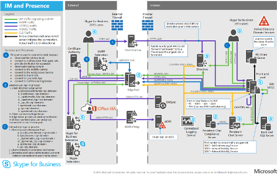

# 商務用 Skype Server 的技術圖表

**摘要:** 規劃、實施或管理商務用 Skype Server 時, 視需要查看這些海報。

這些資源提供 Visio (.vsdx) 格式 (Visio 2015) 和 PDF 格式。 如需如何列印檔案的相關資訊, 請參閱[列印大型格式海報的秘訣](technical-diagrams.md#tips)。

您可能需要其他軟體才能查看這些檔案。 如需詳細資訊, 請參閱下表。

|檔案類型|軟體|
|:--- |:--- |
|.vsd |Visio 2010、Visio 2013 或免費的[Visio 檢視器](https://go.microsoft.com/fwlink/p/?LinkId=393676)   如果您使用 Visio viewer, 請以滑鼠右鍵按一下 [.VSD] 連結, 按一下 [**另存目標為**], 將檔案儲存到您的電腦, 然後從您的電腦開啟檔案。 |
|.pdf |任何 PDF 檢視器, 例如[Adobe Reader](https://go.microsoft.com/fwlink/p/?LinkId=393675) |
|.zip |任何檔案壓縮實用程式。 Windows 7 及更新版本會以本機方式開啟這些檔案。 |

## 標牌

這些海報會詳細說明特定的技術區域, 且適用于與下載中心提供的相關文章或內容。

|職稱|說明|
|:---|:---|
|**商務用 Skype Server 通訊協定的工作負載**   [PDF 版本](https://go.microsoft.com/fwlink/p/?LinkId=550989)(適用于行動裝置或平板電腦)   [Visio 版本](https://go.microsoft.com/fwlink/p/?LinkId=550991)(適用于使用 Visio 的使用者) |下載此海報, 以便更清楚瞭解商務用 Skype 伺服器與用戶端在不同服務層級的需求。    大小:11 ×17英寸 (多張紙, 可在大部分 office 印表機上輕鬆列印)     此海報是使用 Visio 2015 建立的。 特定環境不需要任何修改。 |
|**商務用 Skype 通話品質方法**   [PDF 版本](https://go.microsoft.com/fwlink/p/?LinkId=617899)(適用于行動裝置或平板電腦)   [Visio 版本](https://go.microsoft.com/fwlink/p/?LinkId=617900)(適用于使用 Visio 的使用者) |下載此海報以瞭解 CQM (適用于商務用 Skype Server 2015 的通話品質方法), 協助您找出並消除影響包含企業語音功能之實現的通話品質與使用者體驗的問題。     如果您想要以遊戲者的身分播放, 請使用 [[下載詳細資料] 頁面](https://go.microsoft.com/fwlink/p/?LinkId=617898)取得可列印卡片及規則。 將此海報與[CQM 計分卡](https://go.microsoft.com/fwlink/p/?LinkId=617904)搭配使用。    大小:34-44 英寸     此海報是使用 Visio 2015 建立的。 特定環境不需要任何修改。 |
|**商務用 Skype 語音解決方案**      [PDF 版本](https://go.microsoft.com/fwlink/?linkid=869123)(適用于行動裝置或平板電腦)   [Visio 版本](https://go.microsoft.com/fwlink/?linkid=869124)(適用于使用 Visio 的使用者) |Microsoft 提供多種選項, 讓您的使用者能夠透過公用交換電話網絡 (PSTN) 呼叫市話和手機, 無論他們的帳戶是在商務用 Skype Online 中, 還是在您的內部部署商務用 Skype 中都存在於 Office 365伺服器2015部署。 此海報概述不同的 Microsoft 語音產品, 然後根據貴組織目前的狀態與未來方案, 提供最佳選項的指導方針。     大小:34-44 英寸    此海報是使用 Visio 2015 建立的。 特定環境不需要任何修改。 |
|**商務用 Skype 架構模型**      [PDF 版本](https://go.microsoft.com/fwlink/?linkid=869125)(適用于行動裝置或平板電腦)   [Visio 版本](https://go.microsoft.com/fwlink/?linkid=869126)(適用于使用 Visio 的使用者) |此標牌系列主要供 IT 專業人員使用, 透過哪些基本的體系結構模型來提高知名度, 這些模型可讓商務用 Skype Online 和商務用 Skype Server 2015 在內部部署。 從最符合貴組織的需求及未來方案的任何配置開始。 視需要考慮並使用其他人。 例如, 您可能會想要考慮與 Exchange 和 SharePoint 整合, 或是利用 Microsoft 雲端 PBX 產品的解決方案。    大小:11 釐米    此海報是使用 Visio 2010 建立的。 特定環境不需要任何修改。 |

## 視覺資產

如果您想要使用新的商務用 Skype 符號來製作自己的 Visio 拓撲圖, 請[下載](https://go.microsoft.com/fwlink/p/?LinkId=550985)樣板。

## 列印大型格式標牌的秘訣

如果您有繪圖器, 您可以將大型海報以其完整大小列印。 如果您沒有繪圖器, 請使用下列步驟在較小的紙張上列印 (例如 11 "x17")。 在較小的紙張上列印大型格式標牌, 可能會使文字難以閱讀或無法閱讀。

### 在較小的紙張上列印海報

1. 在 Visio 中開啟海報。
2. 按一下 [ **** 檔案] 功能表上的 [版面**設定**]。
3. 在 [**列印設定**] 索引標籤的 [**印表機紙張**] 區段中, 選取您要列印的紙張大小。
4. 在 [**列印設定**] 索引標籤的 [**列印縮放**] 區段中, 按一下 [**調整成**], 然後在 **[每頁1頁] 向下輸入1張工作表**。
5. 在 [**頁面大小**] 索引標籤上, 按一下 [**大小以適應繪圖內容**], 然後按一下 **[確定]**。
6. 按一下 [ **** 檔案] 功能表上的 [**列印**]。
