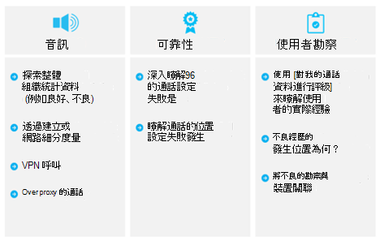

# 營運我的服務Operate my service

本文將為您的組織成功操作雲端語音服務的需求進行概覽。This article gives an overview of the requirements for successfully operating cloud voice services for your organization. 透過正常運作您的雲端語音服務，您可以確定您為貴組織提供優質且可靠的體驗。By properly operating your cloud voice services, you can be sure you’re providing a high-quality, reliable experience for your organization.

## 操作指南簡介Introduction to the Operations Guide

[操作指南] 可讓您大致瞭解 Microsoft 團隊服務管理功能所需的所有工作和活動。The Operations Guide gives you an overview of all the tasks and activities required as part of the service management function for Microsoft Teams.

服務管理是一個廣泛的主題，涵蓋在部署並為使用者啟用 Microsoft 團隊服務之後的日常作業。Service management is a broad topic that covers day-to-day operations of the Microsoft Teams service after it has been deployed and enabled for users. [團隊服務] 包含 Microsoft 365 或 Office 365，以及部署于內部部署的基礎結構元件（例如 [網路]）。The Teams service encompasses Microsoft 365 or Office 365 and the infrastructure components that are deployed on-premises (for example, networking).

服務管理的概念很可能不是大多陣列織的新概念。The notion of service management is most likely not a new concept for most organizations. 您可能已經實現與現有服務相關聯的進程和工作。You might have already implemented processes and tasks that are associated with existing services. 如此一來，您可能會在規劃服務管理，在未來為支援小組時，增加目前的程式。That said, you can probably augment your current processes when you plan for service management today to support Teams in the future.

服務管理包括管理團隊的所有活動與程式，以端到端的方式進行。Service management encompasses all the activities and processes involved in managing Teams end to end. 如先前所述，服務管理的部分元件（Microsoft 365 或 Office 365 服務本身組成的基礎架構）是 Microsoft 的責任，而您（如果您的客戶）負責管理您所提供之團隊、網路和端點的各個方面。As noted earlier, some components of service management—the infrastructure that the Microsoft 365 or Office 365 service itself comprises—are Microsoft’s responsibility, whereas you, the customer, are accountable to your users to manage the various aspects of Teams, the network, and endpoints you provide.

本指南中的任務和活動會分為八個類別，如下列圖表所示。The tasks and activities in this guide are grouped into eight categories as depicted in the following diagram. 在下列各節中，您將會展開這些類別中的每一種。Each of these categories will be expanded upon in the following sections.

<table>
<tr><td>  決策點Decision points</td><td><ul><li>決定將如何針對團隊執行作業。Decide how operations will be implemented for Teams.</li></ul></td></tr>
<tr><td> 後續步驟Next steps</td><td><ul><li>完整回顧 [操作指南]。Review the Operations Guide in full.</li><li>實施與貴組織的目標相符的作業戰略，以提供雲端語音工作負載的品質與穩定性。Implement an operations strategy that aligns with your organization’s goals to deliver the quality and reliability of cloud voice workloads.</li><li>查看[監視器通話品質](monitor-call-quality-qos.md)。Review [Monitor call quality](monitor-call-quality-qos.md).</li><li> 實施作業策略，定期執行經驗檢查，以確保雲端語音部署在其峰值功能中運作。Implement an operations strategy to regularly perform Quality of Experience Reviews to make sure your cloud voice deployment is operating at its peak capabilities.</li></ul></td></tr>
</table>

### 操作角色對應Operational role mapping

規劃您在構想階段進行的作業 undertook 是至關重要的，因為當您第一次試驗使用者啟用時，就會開始執行作業活動。The planning you undertook for operations during the Envision phase is critical, because operations activities begin when the first pilot users are enabled. 本指南列出必須在每天、每週、每月或依需要執行的活動和工作，以維持高品質的小組部署。This guide lists the activities and tasks that must be performed on a daily, weekly, monthly, or as-needed basis to maintain a high-quality Teams deployment. 本指南提供如何執行這些重要活動與工作的相關知識與指導方針。This guide provides knowledge and guidance for how to perform these critical activities and tasks.

成功部署的一個重要元件是確保您在構想階段初期所做的規劃包括決定誰負責執行特定的活動。One crucial component of a successful deployment is to ensure that the planning you do early in the Envision phase includes determining who will be responsible for performing specific activities. 在您發現哪些工作及活動適用于您的部署之後，他們需要先瞭解，然後再加上您指派給他們的群組或人員。After you’ve figured out which tasks and activities apply to your deployment, they need to be understood and followed by the groups or individuals that you assign to them.

您所識別的每個小組都必須審查並同意已識別的工作和職責，並開始準備作業。Each team you identify must review and agree on the tasks and responsibilities identified and start preparation. 這可能包括訓練及準備工作，提供人員編制規劃的更新，或確保外部提供者已準備好提供。This might include training and readiness, providing updates to the staffing plan, or ensuring that external providers are ready to deliver.

本指南中定義的活動和角色，在大多數情況下都應該是有效的，但每個團隊部署都是唯一的;因此，您可以使用本指南作為自訂活動和預設角色的起點，以符合您的需求。The activities and roles defined in this guide should be valid in most scenarios, but every Teams deployment is unique; therefore, you can use this guide as a starting point to customize the activities and default roles to meet your needs.

確定每個有責任的小組對執行服務所需的活動有充分的瞭解。Ensure that each accountable team has a good understanding of the activities that are required to run the service. 在第一個試驗開始前，每個小組都必須接受並登出貴組織中的責任，這一點很重要。It’s critical that each team accepts and signs off on their accountability in your organization before the first pilot begins.

達成合約之後，對應的小組就應該開始 operationalize 他們的角色。After an agreement is in place, the corresponding teams should start to operationalize their roles.

<table>
<tr><td> 後續步驟Next steps</td>
<td><ul><li>使用這份檔協助操作角色對應練習。Use this document to facilitate the operational role mapping exercise.</li><li>與各個支援小組見面，以將名稱指派給所需活動清單中的每個專案。Meet with the respective support teams to assign names to each item in the list of required activities.</li><li>取得指派角色的接受或登出。Gain acceptance or sign-off on the assigned roles.</li><li>確定對應的小組有適當的訓練、準備及資源，以完成他們所需的活動。Ensure that the corresponding teams have the appropriate training, readiness, and resources to complete the activities required of them.</li></ul></td></table>

### 團隊服務相依性Teams service dependencies

Microsoft 團隊將跨 Microsoft 365 或 Office 365 的技術結合在一起，為團隊合作提供中樞。Microsoft Teams brings together technologies across Microsoft 365 or Office 365 to provide a hub for teamwork. 範例包括：Examples include:

-   Azure Active Directory （Azure AD）為團隊提供驗證與授權服務。Azure Active Directory (Azure AD) provides authentication and authorization services for Teams.

-   Exchange Online 提供法律封存和電子調查等高級功能。Exchange Online provides advanced features like legal hold and e-discovery.

-   SharePoint Online 提供共用頻道中檔案的能力，而商務用 OneDrive 則提供在私人聊天中共用檔案的機制。SharePoint Online provides the ability to share files in channels, and OneDrive for Business provides a mechanism for sharing files within a private chat.

組織也可以在內部部署基礎結構中利用現有投資。Organizations can also leverage existing investments in on-premises infrastructure. 例如，現有的內部部署 Active Directory 帳戶可以利用 Azure AD Connect 來進行驗證。For example, existing on-premises Active Directory accounts can be used for authentication by leveraging Azure AD Connect. 您可以使用某些 Exchange Server 版本來取代 Exchange Online。Certain versions of Exchange Server can be used in place of Exchange Online.

這些技術結合在一起，為使用者提供豐富、共同且智慧型的通訊套件。These technologies come together to provide a rich, collaborative, and intelligent communications suite for users. 這項緊密整合是團隊的主要優點，但同時也促進了跨這些技術進行服務管理的需求。This tight integration is a key benefit of Teams, but it also drives a requirement for service management across these technologies.

本指南涵蓋管理團隊服務的主要重點領域。This guide covers the key areas of focus to manage the Teams service. 您最有可能的是，針對小組所依賴的支援技術，您有適當的服務管理方案。Most likely, you have service management plans in place for the supporting technologies that Teams depends on. 如果不是，您將需要為那些技術元件（內部部署和線上）建立適當的服務管理方案。If not, you’ll need to establish proper service management plans for those technology components (both on-premises and online) as well. 這將有助於確保您的使用者能在小組中享受高品質、可靠的體驗。This will help ensure your users enjoy a high-quality, reliable experience with Teams.

#### 提到References 

[Microsoft 團隊概覽Overview of Microsoft Teams](teams-overview.md)

[Exchange 與 Microsoft 團隊如何互動How Exchange and Microsoft Teams interact](exchange-teams-interact.md)

[SharePoint Online 與商務用 OneDrive 與 Microsoft 團隊互動的方式How SharePoint Online and OneDrive for Business interact with Microsoft Teams](sharepoint-onedrive-interact.md)

[Microsoft 團隊及商務用 Skype 共存與互通性Microsoft Teams and Skype for Business coexistence and interoperability](teams-and-skypeforbusiness-coexistence-and-interoperability.md)

<!--ENDOFSECTION-->

## 操作指南活動Operations Guide activities

下列各節提供成功操作 Microsoft 團隊服務所需的活動的概覽。The following sections give an overview of the activities that are required to successfully operate the Microsoft Teams service. 它們包含對工具、內容資訊和其他內容的參照，以協助您瞭解活動，並協助準備就緒計畫。They include reference to tools, contextual information, and additional content to help you understand the activity and to assist in readiness initiatives.

<!--ENDOFSECTION-->

## 監視服務健康情況Monitor service health

您必須瞭解 Microsoft 團隊服務的整體健康情況，才能在您的組織中主動提醒任何影響服務的活動。It’s important that you understand the overall health of the Microsoft Teams service so that you can proactively alert others in your organization of any event that affects the service. 如前文所述，小組依賴于其他 Microsoft 365 或 Office 365 服務（例如 Azure Active Directory、Exchange Online、SharePoint Online 和商務用 OneDrive）。As described earlier, Teams is dependent on other Microsoft 365 or Office 365 services such as Azure Active Directory, Exchange Online, SharePoint Online, and OneDrive for Business. 因此，請務必監視相依服務的健康情況。Because of this, it’s equally important that you monitor the health of the dependent services.

將此活動納入您的事件管理流程，以主動告知使用者、技術人員及您的操作小組，準備處理使用者升級。Incorporate this activity into your incident management process to proactively inform users, the helpdesk, and your operations teams to prepare to handle user escalations.

下列各節說明您可以利用哪些工具監視影響團隊服務的[服務事件](https://technet.microsoft.com/library/office-365-service-health.aspx#Anchor_1)。The following sections describe the tools that you can leverage to monitor for [service incidents](https://technet.microsoft.com/library/office-365-service-health.aspx#Anchor_1) that affect the Teams service. 下表提供每個工具的優點摘要，以及每個工具的使用時機。A summary of the benefits of each tool, and when you should use each one is included in the following table.

| [監視] 工具Monitoring Tool                       | 獲益Benefits                                            | 使用時機When to use                                                                                  |
|---------------------------------------|-----------------------------------------------------|----------------------------------------------------------------------------------------------|
| Microsoft 365 系統管理中心Microsoft 365 admin center                     | 可從任何裝置使用支援的瀏覽器。Available from any device with a supported browser. | 在您不需要即時通知時使用。Use when you don’t need real-time notifications.                                          |
| Microsoft 365 或 Office 365 系統管理應用程式Microsoft 365 or Office 365 Admin app                  | 向您的行動裝置提供推播通知。Provides push notifications to your mobile device.  | 當您在旅途中需要通知服務事件時，請使用。Use when you need to be notified of service incidents while you’re on the go.                  |
| Microsoft System CenterMicrosoft System Center               | 與 Microsoft System Center 整合。Integration with Microsoft System Center.           | 在您需要高級監視功能和通知支援時使用。Use when you need advanced monitoring capabilities and notification support.                       |
| Microsoft 365 或 Office 365 服務通訊 APIMicrosoft 365 or Office 365 Service Communications API | 以程式設計方式存取 Microsoft 365 或 Office 365 服務健康情況。Programmatic access to Microsoft 365 or Office 365 service health.   | 當您需要與協力廠商監視工具整合或想要建立自己的解決方案時使用。Use when you need integration with a third-party monitoring tool or want to build your own solution. |

> [!NOTE]
> 只有獲指派 [**全域管理員**] 或 [**服務管理員**] 角色的人員，才能查看服務健康情況。Only individuals who are assigned the **global admin** or **service administrator** role can view service health.

### 使用 Microsoft 365 系統管理中心進行監控Monitoring with the Microsoft 365 admin center

[Microsoft 365 系統管理中心](https://portal.office.com/)提供[服務健康情況儀表板](https://portal.office.com/adminportal/home#/servicehealth)，您除了相依的服務之外，您還可以在其中查看團隊服務目前的健康情況。The [Microsoft 365 admin center](https://portal.office.com/) provides a [Service Health dashboard](https://portal.office.com/adminportal/home#/servicehealth) where you can view the current health of the Teams service in addition to dependent services.

### 使用行動裝置 app 進行監控Monitoring with the mobile app

Apple iOS、Android 和 Windows （PC 和 mobile）都提供 Microsoft 365 或 Office 365 系統管理應用程式。The Microsoft 365 or Office 365 Admin app is available on Apple iOS, Android, and Windows (PC and mobile). App 提供服務健康情況與即將進行變更的服務系統管理員資訊。The app provides service administrators information about service health and upcoming changes. App 支援推播通知，在公告發布之後幾乎立即就能提醒您。The app supports push notifications that can alert you almost immediately after an advisory has been posted. 這可協助您隨時掌握服務的狀態、健康情況及任何即將進行的變更。This helps you stay current on the status, health, and any upcoming changes to the service. 通知支援會將它提供給系統管理員的建議監視工具。The notification support makes it the recommended monitoring tool for administrators. 如需詳細資訊，請參閱：For more information, see:

[Office 365 Admin 行動裝置 AppOffice 365 Admin Mobile App](https://support.office.com/article/Office-365-Admin-Mobile-App-e16f6421-2a1a-4142-bf9d-9846600a060a)

[下載 Office 365 Admin 行動裝置 AppDownload the Office 365 Admin Mobile App](https://products.office.com/business/manage-office-365-admin-app)

### 使用 Microsoft System Center 進行監控Monitoring with Microsoft System Center

Microsoft System Center 是一個整合的管理平臺，可協助您管理資料中心、用戶端裝置及混合式雲端 IT 環境。Microsoft System Center is an integrated management platform that helps you manage datacenter, client devices, and hybrid cloud IT environments. 使用 System Center 的 Office 365 系統管理員現在可以選擇匯入 Office 365 管理套件，讓他們可以在系統中心的 Operations Manager 中查看所有服務通訊。Office 365 administrators who use System Center now have the option to import the Office 365 Management Pack, which enables them to view all service communications within Operations Manager in System Center. 使用這個工具可讓您存取已訂閱服務的狀態、使用中及已解決的服務事件，以及您的訊息中心通訊（即將進行的變更）。Using this tool gives you access to the status of your subscribed services, active and resolved service incidents, and your Message Center communications (upcoming changes). 如需詳細資訊，請參閱下列[博客文章](https://blogs.office.com/2014/07/29/new-office-365-admin-tools/?eu=true)。For more information, refer to the following [blog post](https://blogs.office.com/2014/07/29/new-office-365-admin-tools/?eu=true).

如果您利用 System Center 監視團隊服務健康情況（以及相依的服務），您可以進一步自訂管理套件，以提醒或通知特定群組或已識別對事件作出反應的人員。If you leverage System Center to monitor Teams service health (and dependent services), you can further customize the management pack to alert or notify specific groups or individuals who have been identified to react to incidents.
這些群組可以包含服務擁有者、服務台、第二層和第三層支援群組，以及貴組織中的事件管理員。These groups can include service owners, helpdesks, second-level and third-level support groups, and incident managers in your organization.

### 監視高級案例Monitoring for advanced scenarios

您可以利用 Office 365 服務通訊 API，以程式設計方式存取 Office 365 服務健康情況及變更，以監控服務健康情況與即將進行的變更。You can monitor service health and upcoming changes by leveraging the Office 365 Service Communications API to access Office 365 service health and changes programmatically. 您可以使用這個 API 來建立您自己的監視工具，或將現有的監視工具連線到 Office 365 服務通訊，這可能會簡化您的環境監視方式。Use this API to create your own monitoring tool, or connect your existing monitoring tools to Office 365 service communications, potentially simplifying how you monitor your environment. 如需詳細資訊，請參閱[適用于企業開發人員的 Office 365](https://developer.microsoft.com/office)。For more information, see [Office 365 for Enterprise developers](https://developer.microsoft.com/office).

### 每日/每週/每月/所需任務Daily/weekly/monthly/as-needed tasks

| 活動Activity               | 描述Description                                                                                                                                                                                                               | 節奏Cadence   | 指派的小組Team assigned |
|------------------------|---------------------------------------------------------------------------------------------------------------------------------------------------------------------------------------------------------------------------|-----------|---------------|
| 監視服務健康情況Monitor service health | 使用可用的工具，主動監視 Microsoft 團隊服務健康情況（以及相依服務）。Proactively monitor Microsoft Teams service health, (and dependent services) by using the tools available. 相依服務包括： Exchange Online、SharePoint Online、商務用 OneDrive、Azure Active Directory。Dependent services include: Exchange Online, SharePoint Online, OneDrive for Business, Azure Active Directory. | 即時Real-time |               |
| 事件通知Incident notification  | 通知內部干係人影響團隊服務的活動。Notify internal stakeholders of events that affect the Teams service. 內部的專案關係人可加入使用者、服務中心及事件管理器。Internal stakeholders can include users, helpdesks, and incident managers.                                                                          | 視需要As needed |               |

### 提到References 

[如何檢查 Office 365 服務健康情況How to check Office 365 service health](https://support.office.com/article/How-to-check-Office-365-service-health-932AD3AD-533C-418A-B938-6E44E8BC33B0)

[驗證 Microsoft 團隊的服務健康情況Verify service health for Microsoft Teams](service-health.md)

[服務健康情況與連續性Service Health and Continuity](https://technet.microsoft.com/library/office-365-service-health.aspx)

<!--ENDOFSECTION-->

## 管理組織變更Manage organizational change

Microsoft 團隊是雲端服務。Microsoft Teams is a cloud-based service. 如此一來，就能夠快速提供新的功能和功能。With that comes the ability to provide new features and functionality at a rapid pace. 提供日常的創新為組織帶來明顯的好處，但需要適當地在組織內管理這些變更，以避免使用者抵抗或上報給您的技術支援人員。Delivering ongoing innovation provides an obvious benefit to organizations, but these changes need to be managed appropriately within your organization to avoid user resistance or escalations to your helpdesk.

小組的更新會自動向您的使用者推出。Updates to Teams are rolled out automatically to your users. 您的使用者將永遠擁有團隊服務中提供的最新用戶端和功能。Your users will always have the latest client and features available in the Teams service. 您無法針對您的使用者管理團隊更新推出，因此您必須透過有效的通訊、訓練及採納程式管理變更，這對您而言至關重要。It’s not possible to manage the rollout of Teams updates to your users, therefore it’s critically important to manage change through effective communication, training, and adoption programs. 如果您的使用者知道所做的變更、教育的好處，以及充分利用其新功能，就能 &mdash; 更快速且更歡迎地調整變更。If your users are aware of the change, educated about the benefits, and empowered to leverage the new capabilities&mdash;they’ll be able to adapt more quickly and welcome the change.

### 監控變更Monitoring for change

變更管理中的第一個步驟是監視針對團隊規劃的變更。The first step in change management is monitoring the changes that are planned for Teams. 監視這些變更的最佳來源是[Office 365 藍圖](https://products.office.com/business/office-365-roadmap)，其中列出目前正在開發、向客戶推出或完全啟動的功能。The best source for monitoring these changes is the [Office 365 Roadmap](https://products.office.com/business/office-365-roadmap), which lists features that are currently in development, being rolled out to customers, or have fully launched. 您可以使用所提供的篩選來搜尋小組特定的功能，或將藍圖下載至 Excel 檔案以進行進一步分析。You can search for Teams-specific features by using the filter provided, or you can download the roadmap to an Excel file for further analysis. 針對每個功能，藍圖會提供簡短的描述，以及預期的發行日期。For each feature, the roadmap gives a short description, along with the anticipated release date.

在[Microsoft 團隊博客](https://techcommunity.microsoft.com/t5/Microsoft-Teams-Blog/bg-p/MicrosoftTeamsBlog)中，您可以瞭解有關團隊產品更新的最佳做法、趨勢及新聞。In the [Microsoft Teams blog](https://techcommunity.microsoft.com/t5/Microsoft-Teams-Blog/bg-p/MicrosoftTeamsBlog), you can learn about best practices, trends, and news about Teams product updates. 預期會在此找到要宣佈的小組主要功能更新。Expect to find major feature updates to Teams to be announced here. 您也可以透過 RSS 摘要訂閱博客。You can also subscribe to the blog through an RSS feed. 然後，您可以直接將[RSS](https://techcommunity.microsoft.com/gxcuf89792/rss/board?board.id=MicrosoftTeamsBlog)摘要新增至團隊頻道，所以所有重要的新聞都直接在小組中傳送。You can then add [the RSS feed](https://techcommunity.microsoft.com/gxcuf89792/rss/board?board.id=MicrosoftTeamsBlog) directly into a Teams channel, so all the important news is delivered directly inside of Teams.

所有已發行的功能都記錄在[Microsoft 團隊的版本](https://support.office.com/article/Release-notes-for-Microsoft-Teams-d7092a6d-c896-424c-b362-a472d5f105de)資訊中。All features that are released are documented in the [Release Notes for Microsoft Teams](https://support.office.com/article/Release-notes-for-Microsoft-Teams-d7092a6d-c896-424c-b362-a472d5f105de).
您可以在這裡找到針對桌上型電腦、web 版和行動裝置發行的功能清單。Here you’ll find a list of features that were released for desktop, web, and mobile devices. 您也可以在 [說明] 的 [**新增功能**] 索引標籤上使用相同的版本[資訊](get-help-in-microsoft-teams.md)。The same set of release notes are also available on the **What's new** tab in [Help](get-help-in-microsoft-teams.md).

熟悉可用的資源，並確定您指派適用的擁有者來監視變更。Become familiar with the resources available and ensure that you assign applicable owners to monitor for change.

### 規劃變更Planning for change

現在您已經知道對 [團隊服務] 的即將進行的變更，下一個步驟就是進行相應的準備及規劃。Now that you’re aware of upcoming changes to the Teams service, the next step is to prepare and plan accordingly. 針對每個變更進行評估，判斷哪些變更需要與使用者進行通訊、認識活動、支援小組或使用者的訓練，或功能評估與採納活動。Assess each change to determine which changes require communication to users, awareness campaigns, training for support teams or users, or feature evaluation and adoption campaigns. 這是貴組織中變更管理小組的主要角色。This is the primary role of a change management team in your organization. 以下是可協助您規劃變更的範例表格集合。Below is a collection of sample tables that can help you plan for change.

#### 功能：雲端錄製（發行日期：2018年1月）Feature: Cloud Recording (Release date: January 2018)

**一般追蹤****General track**

| 變更就緒性Change readiness | 狀態值Status   | 備忘稿/後續步驟Notes/next steps | 擁有者Owner |
|----|----|----|-----|
| 法律審查Legal review   | 完畢Completed     | 此功能是加入訓練小組的先決條件。This feature is a prerequisite to onboarding the training team. | 專案小組Project team  |

**技術變更管理****Technical change management**

|       變更就緒性Change readiness       | 狀態值Status |                      備忘稿/後續步驟Notes/next steps                      |    擁有者Owner     |
|------------------------------|--------|------------------------------------------------------------|--------------|
|     需要變更IT changes required      |  是Yes   | 系統管理員只需要為已識別的使用者啟用錄製。Admin needs to enable recording for identified users only. | 支援小組Support team |
| 技術就緒已完成Technical readiness complete |  是Yes   |                                                            | 支援小組Support team |
|                              |        |                                                            |              |

**使用者變更管理****User change management** 

| 變更就緒性Change readiness | 狀態值Status   | 備忘稿/後續步驟Notes/next steps | 擁有者Owner |
|----|----|----|-----|
| 使用者影響User impact                  | 低溫Low                  |                                                                 |                        |
| 需要使用者就緒User readiness required      | 是Yes                  |                                                                 |                        |
| 通訊就緒Communications ready         | 否No                   | 通訊電子郵件已起草（待定審閱）。Communication email has been drafted—pending review.            | 溝通小組Communications Team    |
| 訓練準備Training ready               | 是Yes                  | 訓練將會利用現有的 Microsoft 影片。Training will leverage existing Microsoft video.                | 訓練小組Training Team          |

**狀態軌****Status track**

| 變更就緒性Change readiness | 狀態值Status   | 備忘稿/後續步驟Notes/next steps | 擁有者Owner |
|----|----|----|-----|
| 發行狀態Release status               | 進行中in progress          | 由主管主管進行的待定審查。Pending review by executive sponsor.               | 變更管理小組Change Management Team |
| 解除簽核Release sign-off             |                      |                                                                 |                        |
| 發行日期Release date                 |                      |                                                                 |                        |

如需針對團隊進行變更管理規劃的詳細資訊，請參閱[建立 Microsoft 團隊的變更管理策略](change-management-strategy.md)。For more information about planning for change management with Teams, see [Create a change management strategy for Microsoft Teams](change-management-strategy.md).

### 每日/每週/每月/所需任務Daily/weekly/monthly/as-needed tasks

| 活動Activity               | 描述Description                                                                                                                                                                                                                | 節奏Cadence   | 指派的小組Team assigned |
|------------------------|----------------------------------------------------------------------------------------------------------------------------------------------------------------------------------------------------------------------------|-----------|---------------|
| 監控變更Monitor for change     | 監視 Microsoft 團隊服務即將進行的變更。Monitor for upcoming changes to Microsoft Teams service.                                                                                                                                                                   | 日常Daily     |               |
| 規劃變更Planning for change    | 評估並規劃新功能，包括溝通方案、線上認知活動，以及訓練。Evaluate and plan for new features and capabilities, including communication plans, awareness campaigns, and training.                                                                                                     | 視需要As needed |               |
| 使用者準備就緒User readiness             | 執行目標通訊、認知或訓練活動，以確保使用者已準備好進行即將進行的變更。Perform targeted communication, awareness, or training campaigns to ensure users are ready for the upcoming change.                                                                                                        | 視需要As needed |               |
| 支援小組就緒性Support team readiness | 執行目標通訊、意識或訓練活動，以確保支援小組已就緒。Perform targeted communication, awareness, or training campaigns to ensure the support team is ready. 支援小組可以包含「白色 glove」團隊、支援人員、第2層或第3層支援、外部合作夥伴等。Support teams can include the “white glove” team, helpdesks, Tier 2 or Tier 3 support, external partners, and so on. | 視需要As needed |               |

<!--ENDOFSECTION-->

## 評估團隊使用量Assess Teams usage

初始試驗開始之後，請務必建立定期頻率來測量實際的團隊使用量。After the initial pilot begins, it’s critical to establish a regular cadence for measuring actual Teams usage. 這可讓您的組織深入瞭解在您的構想階段，實際使用量如何與您預期的使用量相符。This enables your organization to gain insights into how actual usage aligns with the usage you predicted during the Envision phase. 雖然此區段側重于團隊使用量，但這應該是進一步努力來測量和評估 Office 365 使用方式的一部分。Although this section focuses on Teams usage, this should be part of a broader effort to measure and assess Office 365 usage overall.

在部署初期回顧使用量，為您提供機會：Reviewing usage frequently early in the deployment gives you the opportunity to:

-   驗證使用者是否正在使用團隊。Validate whether users are using Teams.

-   找出潛在的採納難題，然後再在整個組織中產生重要問題。Identify potential adoption challenges before they create critical issues across the organization.

-   瞭解構想階段需求與實際使用量之間是否有差異。Understand whether there are discrepancies between the Envision phase requirements and actual usage.

如果使用方式與預期不一樣，可能是由於部署問題，或採用方案未正常執行或其他問題。If usage isn’t what you expect, this could be due to a deployment issue, or the adoption plan isn’t being executed properly, or some other problem. 根據低使用量背後的實際原因，服務管理員必須與相關團隊共同作業，以協助移除使用障礙。Depending on the actual reason behind the low usage, the service administrator must collaborate with the related teams to help remove usage barriers.

### 使用 Microsoft 365 系統管理中心測量使用量Measuring usage with the Microsoft 365 admin center

[報表] 儀表板提供來自小組的使用資料。Usage data from Teams is available in the Reporting dashboard. 您可以在三個不同的報表中找到團隊使用資料。Teams usage data can be found in three different reports. 第一個報表提供的叉積視圖，說明使用者如何使用 Office 365 中的各種服務進行通訊與共同作業。The first report provides a cross-product view of how users communicate and collaborate by using the various services in Office 365. 您可以在此找到以下報告： Office 365 作用中的[使用者報告](https://support.office.com/article/Office-365-Reports-in-the-Admin-Center-Active-Users-FC1CF1D0-CD84-43FD-ADB7-A4C4DFA8112D)This report can be found here: [Office 365 active users report](https://support.office.com/article/Office-365-Reports-in-the-Admin-Center-Active-Users-FC1CF1D0-CD84-43FD-ADB7-A4C4DFA8112D)

其他兩個報表是團隊專用的，而且它們提供來自使用者和裝置的團隊使用量的進一步詳細資料。The other two reports are Teams-specific, and they provide further detail about Teams usage from a user and device perspective. 您可以在以下位置找到兩種報告：Both reports can be found here:

[Microsoft 團隊裝置使用量報告Microsoft Teams device usage report](https://support.office.com/article/Office-365-Reports-in-the-Admin-Center-Microsoft-Teams-device-usage-917b3e1d-203e-4439-8539-634e80196687)

[Microsoft 團隊使用者活動報告Microsoft Teams user activity report](https://support.office.com/article/Office-365-Reports-in-the-Admin-Center-Microsoft-Teams-user-activity-07f67fc4-c0a4-4d3f-ad20-f40c7f6db524)

#### 所需許可權Required permissions

系統管理中心的使用方式報告可由獲指派**全域管理員**角色的人員或產品特定的系統管理員角色（**Exchange 系統**管理員、**商務用 Skype 系統**管理員、 **SharePoint 系統管理員**）存取。The usage reports in the admin center can be accessed by people who have been assigned a **Global administrator** role, or a product-specific admin role (**Exchange administrator**, **Skype for Business administrator**, **SharePoint administrator**).

此外，對於需要存取報表的使用者，也可以使用 [**報表閱讀**者角色]，但不要執行任何需要系統管理員層級許可權的工作。In addition, the **Reports reader** role is available for users who require access to the reports, but don’t perform any tasks that require administrator-level permissions. 您指派這個角色來為任何擁有者的人提供使用方式報告，以監控和推動採用。You assign this role to provide usage reports to anyone who is a stakeholder, to monitor and drive adoption. 如需其他可用角色的詳細資訊，請參閱[關於 Office 365 系統管理員角色](https://support.office.com/article/About-Office-365-admin-roles-da585eea-f576-4f55-a1e0-87090b6aaa9d)。For more information about the different roles available, see [About Office 365 admin roles](https://support.office.com/article/About-Office-365-admin-roles-da585eea-f576-4f55-a1e0-87090b6aaa9d).

### 評估使用量Assessing usage

在您使用 [報告儀表板] 來測量使用量之後，請務必將測量的使用方式與您在專案的構想階段中定義的任何重要成功指標（KSIs）進行比較。After you’ve used the Reporting dashboard to measure usage, it’s important to compare the measured usage against any key success indicators (KSIs) that you defined during the project’s Envision phase. 您可以定義一個可能定義為作用中用法的 KSI，或是一個間接連結至作用中用法的。You can define a KSI that might be defined as active usage, or one that’s indirectly linked to active usage.

在繼續推出給其他網站或使用者之前，請務必先找出實際與預計使用量之間的任何差異。It’s important to identify any variances between actual and planned usage before resuming the rollout to additional sites or users. 您可能會發現組織學習專案做為此活動的一部分，您可以利用它來確保下一批網站或使用者不會遇到相同的問題。You’ll likely identify organizational learnings as part of this activity that you can leverage to ensure that the next batch of sites or users don’t encounter the same issues.

首先，找出這是採用或技術問題。First, pinpoint whether this is an adoption or technical problem. 首先，按照順序調查下列專案，以判斷問題所在。Begin by investigating the items below, in order, to determine where the problem is.

1.  透過執行經驗檢查品質審查來驗證品質（如需詳細資訊，請參閱[改善及監視團隊的通話品質](monitor-call-quality-qos.md)）。Validate quality by performing a Quality of Experience Review (see [Improve and monitor call quality for Teams](monitor-call-quality-qos.md) for more detail).

2.  與技術支援小組合作，檢查是否有任何趨勢問題無法讓使用者存取或使用服務。Work with the helpdesk team to check that there are no trending technical issues preventing users from accessing or using the service. 如果問題趨勢確實存在，請使用本文稍後所述的 [[端點疑難排解](#endpoint-troubleshooting)] 區段，嘗試先解決問題，然後再吸引支援。If issue trends do exist, use the [endpoint troubleshooting](#endpoint-troubleshooting) section later in this article to try to solve the problem before engaging support.

3.  使用訓練與採納小組，收集使用者的直接意見反應（請參閱本文稍後的[評估使用者觀點](#assess-user-sentiment)），並查看認知與採納活動的效能。Work with the training and adoption team to gather direct feedback from users (see [Assess user sentiment](#assess-user-sentiment) later in this article), and to check the effectiveness of awareness and adoption activities.

### 每日/每週/每月/所需任務Daily/weekly/monthly/as-needed tasks

| 活動Activity                         | 描述Description                                                                                                                      | 節奏Cadence   | 指派的小組Team assigned |
|----------------------------------|----------------------------------------------------------------------------------------------------------------------------------|-----------|---------------|
| 測量使用量（啟用階段）Measure usage (enablement phase) | 在啟用階段繼續 onboarded 網站時，測量及評估團隊使用方式。Measure and assess Teams usage as sites continue to be onboarded during the enablement phase. 根據需要解決使用方式問題。Address usage issues as required. | 周更新Weekly    |               |
| 測量使用量（磁片磁碟機值階段）Measure usage (drive value phase)                           | 在「磁片磁碟機價值」階段中測量及評估團隊的使用方式（部署完成後）。Measure and assess Teams usage in the Drive Value phase (after deployment has been completed). 根據需要解決使用方式問題。Address usage issues as required. | 快遞Biweekly  |               |
| 更新採納方案Update adoption plan             | 根據測量的使用方式與規劃目標的對比來更新您的採用方案。Update your adoption plan based on how measured usage compares to your planning targets.                                         | 視需要As needed |               |

### 提到References 

[關於 Microsoft 365 系統管理中心About the Microsoft 365 admin center](https://support.office.com/article/About-the-Office-365-admin-center-758befc4-0888-4009-9f14-0d147402fd23)

[Microsoft 365 系統管理中心的活動報告Activity Reports in the Microsoft 365 admin center](https://support.office.com/article/Activity-Reports-in-the-Office-365-admin-center-0d6dfb17-8582-4172-a9a9-aed798150263)

<!--ENDOFSECTION-->

## 評估使用者觀點Assess user sentiment

瞭解使用者觀點可以做為您的小組部署成功測量的重要指示。Understanding user sentiment can act as a key indicator for gauging the success of your Teams deployment. 使用者意見反應可以推動貴組織中的變更。這可能包含對您通訊方案、訓練程式，或您提供給使用者支援的方式的變更。User feedback can drive changes in your organization; this might include changes to your communication plans, training programs, or the way that you offer support to your users.

務必提前取得意見反應，並在整個專案週期中繼續評估使用者觀點。It’s important to get feedback early and continue with assessing user sentiment throughout the lifecycle of the project and beyond. 使用下列指導方針來判斷貴組織將向外尋找意見反應的時間間隔：Use the following guidance to determine the interval in which your organization will seek out feedback:

-   **專案開始**：透過在專案開始時評估使用者觀點，您可以快速瞭解使用者對其團隊體驗的想法。**Beginning of the project**: By assessing user sentiment at the beginning of the project, you can get an early view into how your users feel about their Teams experience.

-   在**主要里程碑之後**：透過收集意見反應在整個專案週期中，您可以持續測量使用者觀點，並視需要進行變更。**After major milestones**: By collecting feedback throughout the project lifecycle, you can gauge user sentiment on a continuous basis and make changes as needed. 這在主要的里程碑之後特別有用。This is especially useful after major milestones.

-   **專案結論**：在專案結束時評估使用者觀點會告訴您已完成的工作，以及仍需要完成工作的位置，並可讓您將結果與前一個問捲進行比較。**Project conclusion**: Assessing user sentiment at the end of a project will tell you how well you’ve done and where work still needs to be done, and allow you to compare results against the previous survey.

-   **持續**：繼續以無限期測量使用者觀點。**Ongoing**: Continue to measure user sentiment indefinitely. 使用者觀點中的變更可能是您組織的環境中的變更，或是小組服務中的變更。Changes in user sentiment might be due to changes in your organization’s environment or changes in the Teams service. 透過定期測量使用者觀點，您可以瞭解服務管理團隊的執行狀況，以及貴組織回應團隊服務變更的方式。By gauging user sentiment at regular intervals, you can understand how well your service management teams are performing and how your organization is responding to changes in the Teams service.

您可以透過多種不同的方法來評估使用者觀點。User sentiment can be assessed through many different methods. 這些包括電子郵件問卷、人員或電話風格的訪談，或只是在團隊或 Yammer 中建立意見反應頻道。These can include email surveys, in-person or telephone-style interviews, or simply creating a feedback channel in Teams or Yammer. 如需詳細資訊，請參閱[Microsoft 團隊中使用者意見反應方法的最佳做法](best-practices-feedback.md)。For more information, see [Best practices for user feedback methods in Microsoft Teams](best-practices-feedback.md).

您也可以使用 industrywide 方法來評估稱為 net promotor 計分（NPS）的使用者觀點，如下一節所述。You can also use an industrywide approach to assess user sentiment called net promotor score (NPS), which is described in the following section.

### NPSNPS 

Net promoter 計分（NPS）是一種 industrywide 的客戶忠誠度指標，以及用來評估使用者觀點的好方法。Net promoter score (NPS) is an industrywide customer loyalty metric and a good approach to use to assess user sentiment. 您可以提出以下兩個問題來計算 NPS：「您可能會將團隊推薦給同事嗎？」，後面接著手中的 [為什麼？]NPS can be calculated by asking two questions: “How likely are you to recommend Teams to a colleague?”, followed by the freeform question, “Why?”

NPS 是一種索引，範圍從–100到100，以衡量客戶對於建議公司的產品或服務的意願。NPS is an index, ranging from –100 to 100, that measures a customer’s willingness to recommend a company’s product or service. NPS 是以透過電子郵件或其他電子方式傳送給使用者的匿名問卷來建立。NPS is based on an anonymous survey that’s delivered to users through email or other electronic means. NPS 會測量提供者與消費者之間的忠誠度。NPS measures the loyalty between a provider and a consumer. 它只包含一個問題，要求使用者從1到10對其體驗進行評分，以及提供其他批註的選項。It consists of only one question, which asks users to rate their experience from 1 through 10, with the option of providing additional comments. 然後根據下列評分來分類使用者：Users are then classified based on the following ratings:

-   9或10是支援者：忠誠發燒者將促銷您的服務並燃油其他人。9 or 10 are Promoters: Loyal enthusiasts who will promote your service and fuel others.

-   7或8為被動式：已滿意但 unenthusiastic，易受其他服務或服務的影響。7 or 8 are Passive: Satisfied but unenthusiastic, vulnerable to another service or offering.

-   從1到6是 Detractors：不滿意可能會損害您服務並妨礙增長的客戶。From 1 through 6 are Detractors: Unhappy customers who can damage your service and impede growth.

雖然基 NPS 編號很有用，但您可以從分析使用者的意見來取得最大的價值。Although the base NPS number is useful, you’ll get the most value from analyzing user comments. 他們將協助您瞭解使用者為何（或不會）建議團隊給其他人。They’ll help you understand why the user would (or wouldn’t) recommend Teams to others. 這些意見反應可提供寶貴的意見反應，以協助專案或服務管理小組瞭解提供品質服務所需的調整。These comments can provide valuable feedback to help the project or service management teams understand the adjustments necessary to provide a quality service.

若要將 NPS 問卷提供給您的組織，您可以利用您最愛的線上問卷工具。To provide NPS surveys to your organization, you can leverage your favorite online survey tool.

### 每日/每週/每月/視需要的任務Daily/weekly/monthly/as needed tasks

| 活動Activity              | 描述Description                                                                                                                                                                         | 節奏Cadence   | 指派的小組Team assigned |
|-----------------------|-------------------------------------------------------------------------------------------------------------------------------------------------------------------------------------|-----------|---------------|
| 評估使用者觀點Assess user sentiment | 使用問卷調查或訪談，或透過團隊或 Yammer 中的意見反應頻道來捕獲及評估使用者觀點。Capture and assess user sentiment by using surveys or interviews, or through a feedback channel in Teams or Yammer.                                                                 | 視需要As needed |               |
| 更新採納方案Update adoption plans | 根據使用者意見反應，在您的組織中變更磁片磁碟機;這可能包含您的通訊方案變更、訓練程式，或您提供給使用者支援的方式。Drive change in your organization based on user feedback; this can include changes to your communication plans, training programs, or the way that you offer support to your users. | 視需要As needed |               |

### 提到References 

[淨 Promoter 分數Net Promoter Score](https://en.wikipedia.org/wiki/Net_Promoter)

[使用 Yammer 收集意見反應Using Yammer to collect feedback](https://techcommunity.microsoft.com/t5/Yammer-Blog/The-Microsoft-Teams-team-uses-Yammer/ba-p/55210)

[使用者意見反應的最佳做法Best practices for user feedback](best-practices-feedback.md)

<!--ENDOFSECTION-->

## 管理網路品質Manage network quality

許多核心規劃元素會進入優化、調整大小及修正您的網路基礎結構，以確保 Microsoft 團隊服務的高品質、高效的路徑。Many core planning elements go into optimizing, right-sizing, and remediating your network infrastructure to ensure a high-quality, efficient path to the Microsoft Teams service. 規劃工作與需求在我們的[網路準備](3-envision-evaluate-my-environment.md#network-readiness)指導方針中講述。The planning tasks and requirements are covered in our [network readiness](3-envision-evaluate-my-environment.md#network-readiness) guidance. 網路由於升級、擴充或其他業務需求而經常隨著時間不斷演化。Networks often evolve over time due to upgrades, expansion, or other business requirements. 您必須針對網路規劃活動中的小組需求加以考慮，這一點非常重要。It’s important that you account for your requirements for Teams in your network planning activities.

雖然網路規劃是小組部署的重要層面，但務必確保網路保持健康狀態，並根據變更的業務或技術需求保持在最新狀態。Although network planning is a critical aspect of a Teams deployment, it’s equally important to ensure the network remains healthy and stays current, based on changing business or technical requirements.

若要確保您的網路健康情況，必須定期執行許多作業活動。To ensure the health of your network, a number of operations activities need to be performed at regular intervals.

### 每日/每週/每月/所需任務Daily/weekly/monthly/as-needed tasks

| 活動Activity                                                       | 描述Description                                                                                                                                                                                                                                                                                                                                                                 | 節奏Cadence                | 指派的小組Team assigned |
|----------------------------------------------------------------|-----------------------------------------------------------------------------------------------------------------------------------------------------------------------------------------------------------------------------------------------------------------------------------------------------------------------------------------------------------------------------|------------------------|---------------|
| 監視 Office 365 IPs 與 UrlMonitor Office 365 IPs and URLs                                | 使用提供的[RSS](https://go.microsoft.com/fwlink/p/?linkid=236301)摘要來監控[Office 365 url 和 IP 位址範圍](https://aka.ms/o365ips)的任何變更，並啟動適用網路群組的變更要求。Monitor any changes to the [Office 365 URLs and IP address ranges](https://aka.ms/o365ips) by using the provided [RSS feed](https://go.microsoft.com/fwlink/p/?linkid=236301) and initiate a change request to applicable networking groups.                                                                                                                                | 日常Daily                  |               |
| 根據 Office 365 IPs 和 Url 的變更來更新網路Update the network based on changes to Office 365 IPs and URLs | 更新適用的網路元件（防火牆、proxy 伺服器、Vpn、用戶端防火牆等等），以反映[Office 365 url 與 IP 位址範圍](https://aka.ms/o365ips)的變更。Make updates to the applicable network components (firewalls, proxy servers, VPNs, client-side firewalls, and so on) to reflect changes to the [Office 365 URLs and IP address ranges](https://aka.ms/o365ips).                                                                                                                                                              | 視需要As needed              |               |
| 提供建築物資料Provide building data                                          | 針對品質擁護者（或相關的股東）提供更新的子網資訊，以確保[CQD 中的建築物定義](https://docs.microsoft.com/SkypeForBusiness/using-call-quality-in-your-organization/turning-on-and-using-call-quality-dashboard#upload-building-information)保持在最新狀態。Provide updated subnet information to the quality champion (or relevant stakeholders) to ensure that the [building definitions in CQD](https://docs.microsoft.com/SkypeForBusiness/using-call-quality-in-your-organization/turning-on-and-using-call-quality-dashboard#upload-building-information) are kept up to date. | 視需要As needed              |               |
| 實施變更Implement change                                               | 在網路上實施變更，以支援變更團隊的業務與技術需求。Implement changes on the network to support changing Teams business and technical requirements. 網路元素可以包含：Network elements can include:<ul><li>道Firewalls</li><li>疑難排解VPNs</li><li>有線和 Wi-fi 網路Wired and Wi-Fi networks</li><li>網際網路連線與 ExpressRouteInternet connectivity and ExpressRoute</li><li>DNSDNS</li></ul>     | 視需要As needed              |               |
| 網路監視與報告Network monitoring and reporting                               | 使用您現有的協力廠商網路管理工具和您的網路供應商提供的報告功能，監控網路端以結束可用性、利用率和容量趨勢。Monitor the network end to end for availability, utilization, and capacity trends by using your existing third-party network management tools and reporting capabilities available from your network providers. 使用趨勢資料進行網路容量規劃。Use trending data for network capacity planning.                                                                                                            | 每日、每週、每月Daily, weekly, monthly |               |
| 容量規劃Capacity planning                                              | 與團隊服務擁有者共同作業，以瞭解變更可能增加額外容量變更的業務與技術需求。Collaborate with the Teams service owners to understand changing business and technical requirements that might drive additional capacity changes.                                | 視需要As needed              |               |
| 網路疑難排解與修正Network troubleshooting and remediation                        | 協助團隊技術人員、服務擁有者和主要的專案關係人，進行疑難排解並修正與團隊連線、可靠性或品質相關的問題。Assist the Teams helpdesks, service owners, and key stakeholders to troubleshoot and remediate issues to related to Teams connectivity, reliability, or quality. 網路元素可以包含：Network elements can include:<ul><li>道Firewalls</li><li>疑難排解VPNs</li><li>有線和 Wi-fi 網路Wired and Wi-Fi networks</li><li>網際網路連線與 ExpressRouteInternet connectivity and ExpressRoute</li><li>DNSDNS</li></ul>    | 視需要As needed              |               |
| 災害復原與高可用性測試Disaster recovery and high availability testing                | 在網路基礎結構上執行一般的高可用性和災害復原測試，以確保它符合小組服務的規定服務等級目標（Slo）或服務層級協定（Sla）。Perform regular high availability and disaster recovery testing on the network infrastructure to ensure that it meets the stated service level objectives (SLOs) or service level agreements (SLAs) for the Teams service.                                                                                                                                                  | 次Monthly                |               |

### 提到References 

[Office 365 URL 與 IP 位址範圍Office 365 URLs and IP address ranges](https://aka.ms/o365ips)

[建立資料架構Building data schema](https://docs.microsoft.com/SkypeForBusiness/using-call-quality-in-your-organization/turning-on-and-using-call-quality-dashboard#tenant-data-file-format-and-building-data-file-structure)

<!--ENDOFSECTION-->

## 評估並確保品質Assess and ensure quality 

所有組織都需要有一個群組或個人負責品質。All organizations need a group or individual to be accountable for quality. 這是服務管理中最重要的角色。This is the most important role in service management. 品質擁護者角色會指派給熱情使用者體驗的人員或群組。The Quality Champion role is assigned to a person or group who is passionate about their users’ experience.
這個角色需要技能來識別環境中的趨勢，以及與其他團隊合作來促進修正的贊助。This role requires the skills to identify trends in the environment and the sponsorship to work with other teams to drive remediation. 品質擁護者的最佳候選人通常是客戶服務擁有者。The best candidate for the quality champion is typically the customer service owner. 根據組織的大小與複雜性，您可以使用熱情的人員或群組，以確保高品質的使用者體驗。Depending on the organization’s size and complexity, this could be any person or group with a passion for ensuring a high-quality user experience.

[品質擁護者] 利用現有的工具與已記錄的程式（例如 [通話品質儀表板] （CQD））來監視使用者體驗、識別品質趨勢，以及在必要時進行磁片磁碟機修正。The quality champion leverages existing tools and documented processes, such as Call Quality Dashboard (CQD), to monitor user experience, identify quality trends, and drive remediation where needed.
品質擁護者應該與各個小組合作，以促進修正動作，並向指導委員會報告進度和任何已開啟的問題。The quality champion should work with the respective teams to drive remediation actions, and report to a steering committee about progress and any open issues.

閱讀 [[改善及監視團隊的通話品質](monitor-call-quality-qos.md)]，其中包含的活動會評估並提供對改善使用者體驗影響最大的重要區域中的修正指導方針。Read [Improve and monitor call quality for Teams](monitor-call-quality-qos.md), which describes includes activities that assess and provide remediation guidance in key areas that have the greatest impact on improving user experience. 本文中所提供的指導方針主要是使用 CQD 作為主要工具來報告和調查每一個區域，並將焦點放在音訊上以最大化採納與影響。The guidance provided in this article focuses on using CQD as the primary tool to report and investigate each area, with a focus on audio to maximize adoption and impact. 針對網路所做的任何優化，以改善音訊體驗，也會直接翻譯成影片和桌面共用的改良功能。Any optimizations made to the network to improve the audio experience will also directly translate to improvements in video and desktop sharing.

我們強烈建議您提前提名品質擁護者。We strongly recommend that you nominate the quality champion early on. 命名之後，他們應該開始熟悉[顯示器通話品質](monitor-call-quality-qos.md)內容及相關的訓練資料。After being nominated, they should start to familiarize themselves with [Monitor call quality](monitor-call-quality-qos.md) content and associated training materials.

### 每日/每週/每月/所需任務Daily/weekly/monthly/as-needed tasks

| 活動Activity                               | 描述Description                                                                                                                                                                                                                                                                                                 | 節奏Cadence                             | 指派的小組Team Assigned |
|----------------------------------------|-------------------------------------------------------------------------------------------------------------------------------------------------------------------------------------------------------------------------------------------------------------------------------------------------------------|-------------------------------------|---------------|
| 提名與訓練品質擁護者（s）Nominate and train quality champion(s) | 提名並訓練品質專家。Nominate and train a quality champion.                                                                                                                                                                                                                                                                   | 視需要As needed                           |               |
| 執行經驗檢查品質審查（QERs）Perform Quality of Experience Reviews (QERs)     | 執行 QER 以找出品質與可靠性的趨勢、針對已定義的目標進行審查，以及向組織中的主要干係人報告。Perform a QER to identify trends in quality and reliability, review against defined targets, and report out to key stakeholders in the organization.                                                                                                                            | 每月（在部署期間每週）Monthly (weekly during deployments) |               |
| 磁片磁碟機修正Drive remediation                      | 根據 QER 評估與調查，在整個組織中協調修正活動。Coordinate remediation efforts across the organization based on the QER assessments and findings.                                                                                                                                                                                                           | 視需要As needed                           |               |
| 在 CQD 中更新組建資料Update building data in CQD            | 在 CQD 變更網路時，在中更新或新增新的建築物定義（請參閱[上傳建築物資訊](https://docs.microsoft.com/SkypeForBusiness/using-call-quality-in-your-organization/turning-on-and-using-call-quality-dashboard#upload-building-information)）。Update or add new building definitions in CQD when changes are made to the network (see [Upload Building information](https://docs.microsoft.com/SkypeForBusiness/using-call-quality-in-your-organization/turning-on-and-using-call-quality-dashboard#upload-building-information)). | 視需要As needed                           |               |
| 填入品質擁護者角色Fill the Quality Champion role      | 組織中品質的端對端責任。End-to-end responsibility for quality in the organization. 這包括：This includes:<ul><li>確保定期進行 QER。Ensure that the QER is being conducted regularly.</li><li>向 [品質狀態] 上報告主要的專案關係人。Report out to key stakeholders on quality status.</li><li>確定組建資料定義是最新的。Ensure the building data definitions are up to date.</li><li>在整個組織中協調修正工作，以確保使用者擁有團隊的高品質體驗。Coordinate remediation efforts across the organization to ensure that users have a high-quality experience with Teams.</li></ul>          | 日常Daily                               |               |

### 提到References 

[在 CQD 中上傳租使用者和組建資料Upload tenant and building data in CQD](CQD-upload-tenant-building-data.md)

[改善及監視團隊的通話品質Improve and monitor call quality for Teams](monitor-call-quality-qos.md)

<!--ENDOFSECTION-->

## 管理端點Manage endpoints

Microsoft 團隊端點可以定義為任何執行團隊用戶端的 PC、Mac、平板電腦或行動裝置（或任何其他）裝置。Microsoft Teams endpoints can be defined as any PC, Mac, tablet, or mobile (or any other) device running the Teams client. 這個字詞*不*只會包含裝置本身，但使用者如何連線到裝置，例如，使用裝置內建的麥克風或喇叭、earbuds 或優化的耳機。The term *endpoint* not only encompasses the device itself, but how a user connects to the device—for example, by using the device’s built-in mic or speaker, earbuds, or an optimized headset. 部署之後，就不一定會忘記端點。After they’re deployed, endpoints must not be forgotten. 團隊端點需要持續的護理與維護。The Teams endpoints require ongoing care and maintenance. 下列各節說明焦點所在的特定區域。The following sections describe specific areas to focus on.

### 端點需求Endpoint requirements

團隊的其中一個主要優點是，用戶端會自動保持為最新狀態。One of the key benefits of Teams is that the client is kept up to date automatically. PC 和 Mac 上的用戶端會使用背景處理常式來更新，在 app 空閒時檢查新的組建並下載新的用戶端。The clients on the PC and Mac are updated by using a background process that checks for new builds and downloads the new client when the app is idle. 團隊行動應用程式會透過其各自的 app 存放區保持最新狀態。The Teams mobile apps are kept current through their respective app stores.

團隊用戶端在基礎軟體平臺方面的需求最低。The Teams client has minimum requirements in terms of the underlying software platform. 這些需求可能會隨著時間變更，因此請務必監視它們的變更。These requirements might change over time, and therefore it’s important that you monitor them for changes. 例如，團隊用戶端擁有最低的 iOS 版本。For example, the Teams client has a minimum iOS version. 如果用戶端使用網際網路瀏覽器，則瀏覽器也必須保持在最新狀態。If the client uses an internet browser, the browser needs to be kept current as well. 您可以在[取得 Microsoft 團隊的用戶端](get-clients.md)中找到支援的平臺清單。A list of supported platforms can be found in [Get clients for Microsoft Teams](get-clients.md).

### 端點防火牆Endpoint firewalls

用戶端防火牆對使用者體驗的影響可能會有很大的影響。Client-side firewalls can have a significant impact on the user experience.
用戶端防火牆可能會影響通話品質，甚至可以避免建立通話。Client-side firewalls can affect call quality and even prevent a call from being established. 在用戶端防火牆上設定適當的排除項之後，必須根據[Office 365 url 和 IP 位址範圍](https://aka.ms/o365ips)中的資訊，讓它們保持在最新狀態。After the appropriate exclusions on the client firewall have been configured, they need to be kept up to date based on the information in [Office 365 URLs and IP address ranges](https://aka.ms/o365ips). 您的協力廠商廠商將提供有關如何更新排除項的特定指導方針。Your third-party vendor will have specific guidance for how to update the exclusions.

### Wi-fi 驅動程式Wi-Fi drivers

Wi-fi 驅動程式可能會造成問題。Wi-Fi drivers might be problematic. 舉例來說，驅動程式可能會在存取點之間產生非常嚴格的漫遊行為，可能會造成不必要的存取點切換，從而導致通話品質不佳。As an example, a driver might have very aggressive roaming behaviors between access points that can induce unnecessary access-point switching, leading to poor call quality. 執行品質不佳的 Wi-fi 驅動程式可能會透過經驗檢查（如需詳細資訊[，請參閱改善及監視團隊的通話品質](monitor-call-quality-qos.md)）。A poorly performing Wi-Fi driver might be discovered through a Quality of Experience Review (see [Improve and monitor call quality for Teams](monitor-call-quality-qos.md) for more detail). 必須執行一個品質驅動的程式來監視新的 Wi-fi 驅動程式，並確保在將其部署到一般使用者群體之前，對其進行測試。It’s essential to implement a quality-driven process that monitors new Wi-Fi drivers and ensures that they’re tested before being deployed to the general user population.

### 端點管理Endpoint management

支援的端點和介面裝置（例如耳機）的目錄應該可供使用並維護。A catalog of supported endpoints and interface devices (such as headsets) should be available and maintained. 此目錄將包含已選取並驗證為構想與板載階段一部分的核准裝置清單。This catalog will include a list of approved devices that were selected and validated as part of the Envision and Onboard phases. 通常會針對貴組織中的每個角色類型選取特定裝置，以符合該角色的屬性需求。Typically, specific devices are selected for each persona type in your organization to meet the needs of that persona’s attributes. 所有端點都有週期，您需要管理與這些裝置相關聯的供應商合約、保修、取代、發佈及修復原則。All endpoints have a lifecycle, and you need to manage the vendor contracts, warranty, replacement, distribution, and repair policies associated with these devices.

### 端點疑難排解Endpoint troubleshooting

即使您已遵循前一個指南，貴組織中的使用者仍可能會遇到團隊的問題。Even if you’ve followed the previous guidance, users in your organization still might run into issues with Teams. 雖然問題可能不是端點本身，但問題的症狀通常是透過用戶端傳送給使用者。Although the problem might not be with the endpoint itself, the symptoms of the issue are typically surfaced through the client to the user. 下列指導方針旨在提供解決問題所需採取的一般步驟。這並不是一個全面的疑難排解指南。The following guidance is intended to provide general steps you can take to resolve the issue; it’s not meant to be a comprehensive troubleshooting guide. 這些步驟是以特定順序提供，但不需要明確追蹤，也可能不適用，視問題的性質而定。The steps are provided in a specific order, but they don’t have to be followed explicitly and might not be applicable, depending on the nature of the issue.

1.  **驗證服務健康情況：** 使用者可能遇到的問題，可能與對團隊服務或其相依服務產生負面影響的事件有關。**Validate service health:** The issue a user might be experiencing can be related to an event that negatively affects the Teams service or its dependent services. 第一步，我們建議您確認沒有作用中的服務問題。As a first step, we recommend that you confirm there are no active service issues. 請參閱[如何檢查 Office 365 服務健康情況](https://support.office.com/article/How-to-check-Office-365-service-health-932AD3AD-533C-418A-B938-6E44E8BC33B0)。Consult [How to check Office 365 service health](https://support.office.com/article/How-to-check-Office-365-service-health-932AD3AD-533C-418A-B938-6E44E8BC33B0).
    請記得檢查相依服務的狀態（例如，Exchange、SharePoint、商務用 OneDrive）。Remember to check for the status of dependent services (for example, Exchange, SharePoint, OneDrive for Business). 如需深入瞭解服務健康情況，請在上一節 [[監視服務健康情況](#monitor-service-health)] 中進一步討論。Monitoring for service health is discussed in more detail in the previous section, [Monitor service health](#monitor-service-health).

2.  **驗證用戶端連線：** 連線問題導致小組中的功能或登入問題。**Validate client connectivity:** Connectivity issues cause functionality or sign-in issues in Teams. 我們建議您驗證與服務的連線性（尤其是新網站或位置）。We recommend (especially for new sites or locations) that you validate connectivity to the service. 請確定每個網站都遵循下列[Office 365 url 和 IP 位址範圍](https://aka.ms/o365ips)指引。Ensure the following [Office 365 URLs and IP address ranges](https://aka.ms/o365ips) guidance is followed for each site. 您可以利用[Microsoft 網路評量工具](https://www.microsoft.com/download/details.aspx?id=53885)來執行連線測試，以驗證媒體埠是否已正確開啟以取得雲端語音功能。You can leverage the [Microsoft Network Assessment Tool](https://www.microsoft.com/download/details.aspx?id=53885) to perform a connectivity test to validate that the media ports have been opened correctly for cloud voice capabilities. [網路就緒](3-envision-evaluate-my-environment.md#network-readiness)指示中提供如何執行連線測試的詳細步驟。Detailed steps on how to run the connectivity tests are provided in the [network readiness](3-envision-evaluate-my-environment.md#network-readiness) guidance.

3.  **檢查已知問題清單：** 請參閱[小組的疑難排解](https://docs.microsoft.com/MicrosoftTeams/troubleshoot/teams)，判斷是否有其中一個問題對使用者造成負面影響。**Check the known issues list:** Consult [Teams Troubleshooting](https://docs.microsoft.com/MicrosoftTeams/troubleshoot/teams) to determine whether the user has been negatively affected by one of these issues. 遵循提供的因應措施（如果有的話）來解決問題。Follow the workaround provided (if there is one) to resolve the issue.

4.  **造訪 Microsoft 團隊社區：**[Microsoft 團隊社區](https://techcommunity.microsoft.com/t5/Microsoft-Teams/ct-p/MicrosoftTeams)為團隊提供專用空間。**Visit the Microsoft Teams community:** The [Microsoft Teams community](https://techcommunity.microsoft.com/t5/Microsoft-Teams/ct-p/MicrosoftTeams) offers dedicated spaces for Teams. 團隊群組會在團隊周圍提供討論清單、博客文章和公告。The Teams community provides a discussion list, blog posts, and announcements centered around Teams. 您可以張貼問題或搜尋先前的討論，以解決您的問題。You can post a question or search previous discussions for solutions to your issue.

5.  **聯繫 Microsoft 支援人員：** 您可以與 Microsoft 支援人員聯繫，以解決團隊線上或手機的問題。**Contact Microsoft Support:** You can contact Microsoft Support for issues with Teams online or by phone. 如需詳細資訊，請參閱[商務用客戶支援](https://docs.microsoft.com/microsoft-365/admin/contact-support-for-business-products)。For information, see [Contact support for business products](https://docs.microsoft.com/microsoft-365/admin/contact-support-for-business-products).
    針對 Premier 客戶，您可以依照[Microsoft 團隊的連絡人支援（Premier 客戶）](https://support.microsoft.com/premier/contacts)來啟動支援要求。For Premier customers, support requests can be initiated by following the guidance at [Contact support for Microsoft Teams (Premier customers)](https://support.microsoft.com/premier/contacts).

### 每日/每週/每月/所需任務Daily/weekly/monthly/as-needed tasks

| 活動Activity                 | 描述Description                                                                                                                                                                                                                                                                                                                                                                     | 節奏Cadence   | 指派的小組Team assigned |
|--------------------------|---------------------------------------------------------------------------------------------------------------------------------------------------------------------------------------------------------------------------------------------------------------------------------------------------------------------------------------------------------------------------------|-----------|---------------|
| 端點需求Endpoint requirements    | 確定團隊端點繼續符合在[Microsoft 團隊取得用戶端](get-clients.md)中所列之團隊的所有軟體需求。Ensure that the Teams endpoint continues to meet all the software requirements for Teams listed in [Get clients for Microsoft Teams](get-clients.md).                                                                                                                                                                                       | 次Monthly   |               |
| 端點防火牆Endpoint firewalls       | 根據[Office 365 url 和 IP 位址範圍](https://aka.ms/o365ips)中的資訊，在端點防火牆上維護適當的排除。Maintain the appropriate exclusions on the endpoint firewall based on the information in [Office 365 URLs and IP address ranges](https://aka.ms/o365ips). 您的協力廠商廠商將提供有關如何維護排除項的特定指導方針。Your third-party vendor will have specific guidance for how to maintain the exclusions. 訂閱[rss](https://support.office.com/o365ip/rss)摘要，以自動收到變更的通知。Subscribe to the [RSS feed](https://support.office.com/o365ip/rss) to be notified automatically of changes. | 視需要As needed |               |
| Wi-fi 驅動程式Wi-Fi drivers            | 在電腦上測試並更新 Wi-fi 驅動程式。Test and update Wi-Fi drivers on the PC. 使用 CQD 驗證結果（[改善及監視團隊的通話品質](monitor-call-quality-qos.md)）。Validate the results by using CQD ([Improve and monitor call quality for Teams](monitor-call-quality-qos.md)).                                                                                                                                                                                                                                                                   | 視需要As needed |               |
| 端點管理Endpoint management      | 維護支援的端點和介面裝置的編目（例如耳機）。Maintain the catalog of supported endpoints and interface devices (such as headsets). 管理供應商合約、保修、發行、取代及修復原則。Manage vendor contracts, warranty, distribution, replacement, and repair policies.                                                                                                                                                                                                        | 次Monthly   |               |
| 端點疑難排解Endpoint troubleshooting | 疑難排解工作可以包含驗證連線、查閱已知問題清單、記錄收集、分析，以及升級至 Microsoft 支援或協力廠商廠商。Troubleshooting tasks can include verifying connectivity, consulting the known issues list, log gathering, analysis, and escalation to Microsoft Support or third-party vendors.                                                                                                                                                                                               | 視需要As needed |               |

### 提到References 

[Office 365 URL 與 IP 位址範圍Office 365 URLs and IP address ranges](https://aka.ms/o365ips)

[取得 Microsoft Teams 用戶端Get clients for Microsoft Teams](get-clients.md)

[Microsoft 團隊社區Microsoft Teams community](https://techcommunity.microsoft.com/t5/Microsoft-Teams/ct-p/MicrosoftTeams)

[Teams 疑難排解Teams Troubleshooting](https://docs.microsoft.com/MicrosoftTeams/troubleshoot/teams)

[驗證 Microsoft 團隊的服務健康情況Verify service health for Microsoft Teams](service-health.md)

[連絡商務產品的客戶支援 - 系統管理說明Contact support for business products - Admin Help](https://docs.microsoft.com/microsoft-365/admin/contact-support-for-business-products)

[連絡人 Premier 支援Contact Premier support](https://support.microsoft.com/premier/contacts)

[疑難排解小組影片Troubleshooting Teams video](https://www.youtube.com/watch?v=4O4d_7uZTQY)

<!--ENDOFSECTION-->

## 管理 TeamsManage Teams

部署 Microsoft 團隊服務之後，您必須執行數個與其管理相關的活動。After the Microsoft Teams service has been deployed, you’ll need to perform several activities relating to its administration. 活動範圍包括從管理服務和個別使用者到容量規劃，以及提供授權與電話號碼。The activities range from administering the service and individual users to capacity planning and provisioning licensing and telephone numbers. 下列各節涵蓋一些常見的管理工作。The following sections cover some of these common administration tasks.

### 服務管理Service administration

[團隊服務] 有多項設定可設定為全租租使用者。The Teams service has multiple settings that can be configured tenant-wide.
對租使用者設定所做的變更會影響已針對團隊啟用的所有使用者。Changes made to the tenant settings affect all users who have been enabled for Teams. 如需這些設定的詳細清單，請參閱[管理貴組織的 Microsoft 團隊設定](enable-features-office-365.md)。For a detailed list of these settings, see [Manage Microsoft Teams settings for your organization](enable-features-office-365.md).

### 使用者管理User administration

若要支援使用者，組織可能需要任何數量的相關工作，具體的工作會因組織而異。To support users, an organization might require any number of related tasks—the specific tasks vary from one organization to the next. 最終，這些工作需要由已獲指派這些作業職責的支援小組來管理。Ultimately, these tasks need to be managed by a support team that has been assigned these operational duties. 若要支援小組中的使用者，通常需要下列工作。The following tasks are commonly required to support users in Teams.

#### 一般工作General tasks

[管理使用者對 Microsoft 團隊的存取權Manage user access to Microsoft Teams](user-access.md)

#### 電話系統的一般工作Common tasks for Phone System

[指派、變更或移除使用者的電話號碼Assign, change, or remove a phone number for a user](/microsoftteams/assign-change-or-remove-a-phone-number-for-a-user)

[指派或變更使用者的緊急位址Assign or change an emergency address for a user](https://docs.microsoft.com/skypeforbusiness/what-are-calling-plans-in-office-365/assign-or-change-an-emergency-address-for-a-user)

[新增、變更或移除貴組織的緊急位置Add, change, or remove an emergency location for your organization](https://docs.microsoft.com/skypeforbusiness/what-are-calling-plans-in-office-365/add-change-or-remove-an-emergency-location-for-your-organization)

[建立和管理撥號對應表Create and manage dial plans](create-and-manage-dial-plans.md)

#### 音訊會議的一般工作Common tasks for Audio Conferencing

[變更音訊會議橋接器的設定Change the settings for an Audio Conferencing bridge](change-the-settings-for-an-audio-conferencing-bridge.md)

[變更音訊會議橋接器的電話號碼Change the phone numbers on your Audio Conferencing bridge](change-the-phone-numbers-on-your-audio-conferencing-bridge.md)

[管理使用者的音訊會議設定Manage the Audio Conferencing settings for a user](manage-the-audio-conferencing-settings-for-a-user-in-teams.md)

[重設音訊會議 PIN 碼Reset the Audio Conferencing PIN](reset-the-audio-conferencing-pin-in-teams.md)

### 授權管理License management

隨著您的組織發展或合約，您必須規劃目前與未來需求的授權。As your organization grows or contracts, it’s important that you plan licensing for current and future needs. 除了授權提供雲端語音功能（[電話系統](here-s-what-you-get-with-phone-system.md)和[音訊會議](https://products.office.com/skype-for-business/audio-conferencing)）之外，還有基本團隊授權。There is a base Teams license, in addition to licensing for cloud voice capabilities ([Phone System](here-s-what-you-get-with-phone-system.md) and [Audio Conferencing](https://products.office.com/skype-for-business/audio-conferencing)).

針對團隊，電話系統授權需要相關的[通話方案](calling-plan-landing-page.md)授權。For Teams, Phone System licenses require associated [Calling Plans](calling-plan-landing-page.md) licenses. 通話方案授權可讓您撥打及接聽國內和/或國際電話。Calling Plan licensing enables you to make and receive domestic and/or international phone calls. 這些方案是以使用方式為基礎的，並將分鐘池與它們相關聯。These plans are usage-based and have minute pools associated with them. [配[點數通訊信用](what-are-communications-credits.md)] 可確保您永遠不會用盡服務。Provisioning [Communications Credits](what-are-communications-credits.md) will ensure you never run out of service.

[音訊會議] 可讓您 tolled 電話撥入式會議和國內撥出式會議服務。Audio Conferencing allows for tolled dial-in conferencing and domestic dial-out conferencing services. 免付費電話撥入式會議或非國內撥出案例可能會導致您產生額外的費用，以供您需要[通訊信用額度](what-are-communications-credits.md)。Toll-free dial-in conferencing or non-domestic dial-out scenarios might cause you to incur additional charges for which [Communications Credits](what-are-communications-credits.md) are required.

通訊點數可以補充通話方案和音訊會議授權。Communications Credits can supplement both Calling Plan and Audio Conferencing licenses. 通話方案授權和通訊點數都是以使用方式為基礎，因此需要加以監視及進行配置。Both Calling Plan licenses and Communication Credits are usage-based, and therefore need to be monitored and provisioned for accordingly.

您可以利用[PSTN 使用狀況報告](https://docs.microsoft.com/skypeforbusiness/skype-for-business-online-reporting/pstn-usage-report)，協助您監控通話方案紀要與通訊點數的使用方式。You can leverage the [PSTN usage report](https://docs.microsoft.com/skypeforbusiness/skype-for-business-online-reporting/pstn-usage-report) to help you monitor your usage of Calling Plan minutes and Communications Credits. 根據此活動的結果，您可以據調整您的授權。Based on the results of this activity, you can adjust your licensing accordingly. 我們即將推出[PSTN 分鐘池](https://docs.microsoft.com/skypeforbusiness/skype-for-business-online-reporting/pstn-minute-pools-report)報告，以更有效地協助此工作。Coming soon, we will offer a [PSTN minute pools](https://docs.microsoft.com/skypeforbusiness/skype-for-business-online-reporting/pstn-minute-pools-report) report to more effectively assist with this task.

### 電話號碼管理Telephone number management

在團隊中取得數位的方法有兩種：您可以從另一個提供者移植電話號碼，或者您可以直接從 Microsoft 的編號庫存中提供號碼。There are two methods to acquire numbers in Teams: You can port telephone numbers from another provider or you can provision the numbers directly from Microsoft’s number inventory. 這兩種方法都在[取得使用者的電話號碼](getting-phone-numbers-for-your-users.md)中說明。Both methods are described in [Getting phone numbers for your users](getting-phone-numbers-for-your-users.md).

您可以從 Microsoft 編號庫存提供的電話號碼數目有限制。There is a limit to the number of telephone numbers you can provision from Microsoft’s number inventory. 限制是由[您可以取得多少電話號碼](how-many-phone-numbers-can-you-get.md)的幾個因素決定。The limits are determined by a number of factors detailed in [How many phone numbers can you get?](how-many-phone-numbers-can-you-get.md).
限制是依據號碼類型（免付費服務號碼、收費服務號碼和訂閱者（使用者）號碼）而定。The limits depend on the type of numbers—toll-free service numbers, toll service numbers, and subscriber (user) numbers. 每個都有自己的限制，而且必須獨立管理。Each has its own limits and must be managed independently. 如果您接近限制（或達到限制），您可以套用超過限制的增量。If you’re nearing the limit (or you’ve reached the limit), you can apply for an increment to the limit. 本程式將在前一段的文章中說明。This process is described in the article in the previous paragraph.

有時候，可能無法在提供服務的區域中提供數位。There might be times when a number isn’t available to be provisioned in a region where service is available. 如需有關申請號碼之程式的詳細資訊，請參閱[管理貴組織的電話號碼](https://docs.microsoft.com/skypeforbusiness/what-are-calling-plans-in-office-365/manage-phone-numbers-for-your-organization/manage-phone-numbers-for-your-organization)。For information about the process for requesting numbers, see [Manage phone numbers for your organization](https://docs.microsoft.com/skypeforbusiness/what-are-calling-plans-in-office-365/manage-phone-numbers-for-your-organization/manage-phone-numbers-for-your-organization).

### 小組建立（選用）Team creation (optional)

根據預設，所有在 Exchange Online 中擁有信箱的使用者，都有權建立 Microsoft 365 群組，因此也有在 Microsoft 團隊中的小組。By default, all users with a mailbox in Exchange Online have permissions to create Microsoft 365 groups and, therefore, a team in Microsoft Teams. 如果您想要更加嚴密地控制和[限制新團隊的建立](assign-roles-permissions.md#permissions-to-create-teams)（並由此建立新的 Microsoft 365 群組），您可以將群組建立與管理許可權委派給一組管理員。If you want to have tighter control and [restrict the creation of new teams](assign-roles-permissions.md#permissions-to-create-teams) (and thus the creation of new Microsoft 365 groups), you can delegate group creation and management rights to a set of administrators. 如果您的組織想要使用此選項，請參閱本文所述的程式，讓使用者能夠提交由指派的小組處理的要求。If your organization wants to pursue this option, see the process described in this article to allow users to submit requests that are processed by an assigned team.

### 每日/每週/每月/所需任務Daily/weekly/monthly/as-needed tasks

| 活動Activity                    | 描述Description                                                                                                                                                                                                                                                                                                                                                                                                             | 節奏Cadence   | 指派的小組Team assigned |
|-----------------------------|-------------------------------------------------------------------------------------------------------------------------------------------------------------------------------------------------------------------------------------------------------------------------------------------------------------------------------------------------------------------------------------------------------------------------|-----------|---------------|
| 服務管理Service administration      | 管理整個租使用者的團隊設定。Administration of tenant-wide Teams settings.                                                                                                                                                                                                                                                                                                                                                                           | 視需要As needed |               |
| 使用者管理User administration         | 在小組中管理使用者的設定和授權。Administration of user-based settings and licensing in Teams.                                                                                                                                                                                                                                                                                                                                                           | 視需要As needed |               |
| 授權管理License management          | 利用[pstn 使用量報告](https://docs.microsoft.com/skypeforbusiness/skype-for-business-online-reporting/pstn-usage-report)和[pstn 分鐘池](https://docs.microsoft.com/skypeforbusiness/skype-for-business-online-reporting/pstn-minute-pools-report)報告，規劃使用者與消費的授權（通話方案與通訊點數）目前與未來的需求。Plan for current and future needs for both user and consumption-based licensing (Calling Plans and Communication Credits) by leveraging the [PSTN usage report](https://docs.microsoft.com/skypeforbusiness/skype-for-business-online-reporting/pstn-usage-report) and [PSTN minute pools](https://docs.microsoft.com/skypeforbusiness/skype-for-business-online-reporting/pstn-minute-pools-report) report. | 周更新Weekly    |               |
| 電話號碼管理Telephone number management | 管理未來增長所能使用的電話號碼，並調整庫存階層，以符合您的組織需求。Manage the telephone numbers available for future growth, and adjust inventory levels to meet your organizational needs.                                                                                                                                                                                                                                                                                                | 周更新Weekly    |               |
| 小組建立（選用）Team creation (optional)    | 審查及處理小組建立的要求。Review and process requests for team creation.                                                                                                                                                                                                                                                                                                                                                                          | 視需要As needed |               |

<!--ENDOFSECTION-->

## 改善並監控通話品質Improve and monitor call quality

[改善及監視團隊的通話品質](monitor-call-quality-qos.md)，包括一組活動，可在對改善使用者體驗產生最大影響的重要區域中評估和提供修正指導方針，如下所示。[Improve and monitor call quality for Teams](monitor-call-quality-qos.md) includes a set of activities that assess and provide remediation guidance in key areas that have the greatest impact on improving the user experience, as illustrated below.

透過不斷評估並修正指南中所述的區域，您可以減少對使用者經驗造成負面影響的可能性。By continually assessing and remediating the areas described in the guide, you can reduce their potential to negatively affect user experience. 在部署中遇到的大多數使用者體驗問題，都可以分為下列類別：Most user-experience problems encountered in a deployment can be grouped into the following categories:

-   防火牆或 proxy 配置不完整Incomplete firewall or proxy configuration

-   低 wi-fi 覆蓋範圍Poor Wi-Fi coverage

-   頻寬不足Insufficient bandwidth

-   點對點VPN

-   使用未優化或內建的音訊裝置Use of unoptimized or built-in audio devices

-   有問題的子網或網路裝置Problematic subnets or network devices

[改善及監視團隊通話品質的](monitor-call-quality-qos.md)指導方針重點是使用通話品質儀表板（CQD）作為主要工具來報告和調查所述的每個區域，並將焦點放在音訊上以最大化採納與影響。The guidance provided in [Improve and monitor call quality for Teams](monitor-call-quality-qos.md) focuses on using Call Quality Dashboard (CQD) Online as the primary tool to report and investigate each area described, with a focus on audio to maximize adoption and impact. 針對網路所做的任何優化，以改善音訊體驗，也會直接翻譯成影片和桌面共用的改良功能。Any optimizations made to the network to improve the audio experience will also directly translate to improvements in video and desktop sharing.

我們強烈建議您提前提名品質擁護者。We highly recommend that you nominate the quality champion early on. 命名之後，他們應該開始熟悉[改善及監視團隊通話品質的](monitor-call-quality-qos.md)內容。After being nominated, they should start to familiarize themselves with the content in [Improve and monitor call quality for Teams](monitor-call-quality-qos.md).

<!--ENDOFSECTION-->
