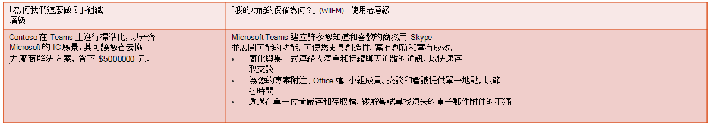

# 準備我的使用者

本文將提供準備使用者使用雲端語音服務的需求。 只要正確地準備使用者，您就能確定貴組織的價值是最大的。

<!--ENDOFSECTION-->

## 為使用者採納做好準備

在您保護專案小組並定義專案的範圍和目標之後，下一步就是確保組織和使用者的就緒性，以及與您的技術準備並行完成的活動。 若要從您的部署中實現價值，使用者必須實際使用並採用它。 只要啟用解決方案，就不能保證您實現目標。 此外，使用者有不同的使用案例和不同的學習樣式，而且它們會以不同的速度調整新的技術。 好的是，管理變更並不是很複雜，而是需要進行專門的工作。 以下所述的引導式討論旨在協助您瞭解您的使用者基礎，並準備適當的教育層級，協助並加速使用者採納。

活動擁有者：採用變更管理員成為潛在客戶、專案主管、主管主管、行銷/訓練/支援管理員

> [!NOTE] 
> 以下所提供的評定活動可適應貴組織中的任何變更計畫。 只需根據專案範圍來解決問題。 在討論這些活動時，「新的解決方案」可以套用至音訊通話、音訊會議，或從商務用 Skype 升級至團隊。

<!--ENDOFSECTION-->

## 建立您的構想與價值陳述

設定您的專案願景可讓您的主要干係人看到重要的圖片。 這通常是企業驅動因素&mdash;（例如成本節約、操作效率及生產效率&mdash;），並與您之前在專案中設定的目標相符。 對於使用者而言，可能會透過管理工具，將相同的專案看作是不熟悉的工具、生產力中斷及 compassion。 花點時間將自己放在您的使用者的鞋，並將您的專案構想翻譯成能吸引他們的價值陳述。 在您的通訊和訓練活動中使用此價值陳述，讓使用者能夠看到團隊可以如何處理他們。

下列影像是客戶從商務用 Skype 升級至團隊之遠景價值聲明的範例。

<table>
<tr><td>  決策點</td><td><ul><li>您是否已將福利與價值明確地表述給您的使用者，以便為這項新的解決方案帶來其購買權？</li></ul></td></tr>
<tr><td> 後續步驟</td><td><ul><li>為目前的專案範圍建立您的願景與價值陳述，以確保它們符合您的目標。</li></ul></td></tr>
</table>

<!--ENDOFSECTION-->

## 決定組織變更準備

[組織就緒性] 可協助您判斷 receptive （或不是）您的使用者可能變更其運作方式。 瞭解使用者如何回應變更，讓您的組織能夠主動解決問題、針對最佳接收調整您的推出方案，以及識別能成為您的擁護者或大使的使用者，協助協助您進行變更。

<table>
<tr><td>  決策點</td><td><ul><li>使用者是否已準備好並願意變更為新的解決方案？</li><li>使用者是否具備協助變更的能力或能力？</li></ul></td></tr>
<tr><td> 後續步驟</td><td><ul><li>使用下列交談初學者瞭解貴組織在變更時的文化。 此資訊可協助告知您的專案可能需要多少意識與訓練。
</li></ul></td></tr>
</table>

> [!TIP]
> 若要協助引導討論，請評估過去的推出;這可協助您預測使用者如何回應變更，並協助您主動處理預期的反應。

### 使用者會在每個 bucket 中有哪些百分比？

| **使用者類型**                                                             | **%** |
|------------------------------------------------------------------------------|-------|
| *早期採納*者要求方案，才能使用。                  |       |
| 只要展示其價值，就會*立即接受此*方案。    |       |
| *Laggards* [拒絕] 解決方案，即使將它推入變更也一樣。                 |       |

> [!TIP]
> 早期的採納者是您試點專案部署的絕佳候選方案，也是擁護者計畫。 如果您有大量的 laggards，請花點時間專注于這些使用者和 handholding 的價值訊息，以協助讓他們掌握所做的變更。

### 在每個資格中，有哪些使用者百分比？

| **Learner 類型**                                                        | **%** |
|----------------------------------------------------------------------------|-------|
| *自行積極*的學員搜尋資源，請執行此操作。                         |       |
| *小組玩家*享有群組和互動式訓練;它們會與同事一起進行。 |       |
| *Handholding* seekers 預期是「白色 glove」或一對一的協助。                   |       |

 
> [!TIP]
> 學習不只是一種大小。 透過瞭解您的使用者的最佳瞭解方式，您可以建立一個強健的訓練程式，協助加速他們的學習。 如果有許多使用者是自我熱情的，則連結至影片和使用者指南可能就足夠了。 針對需要特別注意的人員，請務必排程一次&mdash;[一次性] 或 [登記您的擁護者]，以協助這些使用者使用學習曲線。

<!--ENDOFSECTION-->

## 評估您的使用者基礎

人員層級分析讓您瞭解您的使用者角色、cohorts 及使用方式。 只要花時間瞭解您的使用者是誰及其運作方式，您就可以確保他們在您實施變更時擁有所需的成功。 這可能包括目標訊息、訓練，甚至是耳機和網路攝影機等裝置。 例如，主管可能預期一對一訓練，而旅列欄位代表可能會從他們可以觀賞的訓練影片中受益。 此外，您的人員層級分析可協助您識別目前應該開始使用新功能的人員，以及在等待時最有可能提供的人員。

<table>
<tr><td>  決策點</td><td><ul><li>某些使用者或 cohorts 是否有此方案的核心相依性，以有效地完成其工作？</li><li>是否有特定的使用案例可使用這個新的解決方案來加速？</li></ul></td></tr>
<tr><td> 後續步驟</td><td><ul><li>對應使用者角色。 首先，將您的使用者群體劃分成角色/群體群組（主管、公路 Warriors、共同作業工作者、零售等）。 針對易管理性，請列出不超過八個群組。 （如需對話初學者的範例，請參閱下文。）使用您的結果，進一步設計您的使用者準備工作行銷活動，並將您的試驗使用者細分為可能會從稍後升級的人員獲益。
</li><li>地圖使用案例。 在您識別出將能從這個新技術獲益的核心使用者群組之後，請考慮您的一般使用者群體。 透過瞭解跨團隊使用案例和案例，您可以使用這種新技術來視覺化您的組織。 此外，在您的通訊和訓練方案中新增使用案例範例，實際上可協助讓他們與您的使用者取得聯繫。</li></ul></td></tr>
</table>

針對每個角色群組，請與您的專案小組討論下列專案：

-   這個群組的核心特性是什麼（也就是生命中的典型 "天"）？

-   這個群組將如何從新的解決方案中受益？ 他們需要哪些功能和功能才能生效？

-   他們需要哪些裝置（例如耳機或喇叭），而且他們已經有這些裝置？

-   若要在此群組中開始使用新的解決方案，需要額外的價值訊息（如果有的話）嗎？

-   這個群組要接收的最佳方式是：

    -   知曉（例如，電子郵件、海報、部門經理）？

    -   訓練（例如，線上訓練、使用者指南、白色 glove）？

    -   支援（自助服務、技術支援人員、擁護人員）？  

-   這個群組對於試驗或前期程式是很好的選擇嗎？ 如果是，請在這些使用者進行購買，以參與試生產。 如需有關實施成功試驗計畫的詳細資訊，請參閱在[商務用 Skype 旁邊的試點小組](pilot-essentials.md)。

下列影像是角色表格的範例。

![[值] 資料表列出角色詳細資料](media/prepare-my-users-image2.png "列出角色及其共同角色，以及通訊與共同作業解決方案相依性的表格。[總經理] 角色會醒目提示，包含有關設定檔的詳細資料（在生活中是星期幾），以及功能、裝置和訓練管理需求。")

針對每個使用案例，請與您的專案小組討論下列專案：

-   此使用案例/案例的核心特性為何？

-   目前的解決方案有何好處？

-   您目前的解決方案面臨哪些挑戰（如果有的話）嗎？

-   新方案將如何優化使用者體驗？

如需使用案例的範例，請造訪[FastTrack 生產力文件庫](https://fasttrack.microsoft.com/microsoft365/productivitylibrary)。

<!--ENDOFSECTION-->

## 優化準備方案
瞭解您的使用者是誰以及他們在新方案中的運作方式之後，您就可以設計準備方案。 您的使用者準備就緒方案結合了如何在您試點、使用板載及操作新的解決方案時，傳達、訓練及支援您的使用者。 如您在本文的上述步驟中所述，[準備情況] 不是一種大小。 首先，我們已在此程式的開頭加入您定義的價值訊息，以廣泛的認識與訓練方案開始。 然後根據需要，將您的訊息、訓練及支援量身定制至您所定義的角色或 cohorts。 您的個人化方案可以讓使用者更快速地與新的解決方案建立關聯，同時示範您瞭解他們的需求，這將有助於協助其轉場。

<table>
<tr><td>  決策點</td><td><ul><li>您可以提供哪些準備方案以協助協助並加速新方案的採用？</li><li>您有適當的線上感知、訓練及支援資源，讓您的使用者能夠處理所做的變更，以及您定義的使用者角色嗎？</li></ul></td></tr>
<tr><td> 後續步驟</td><td><ul><li>使用下一節中的清單來為準備方案產生想法。 選取最相關的專案&mdash;，或新增您&mdash;自己的專案來設計針對貴組織優化的就緒方案。</li></ul></td></tr>
</table>

### 準備方案構想

<table>
<tr><th>迅</th><th>訓練</th><th>説明</th></tr>
<tr><td><ul><li>電子&mdash;郵件個人化我們的<a href="prepare-my-users-email-templates.md" data-raw-source="[voice email templates](prepare-my-users-email-templates.md)">語音電子郵件範本</a></li><li>海報和數位告示 </li><li>啟動事件</li><li>部門經理</li><li>風雲人物</li><li>團隊和頻道</li><li>Gamification</li></ul></td><td><ul><li>Microsoft 的文章和影片：<ul><li><a href="https://support.office.com/article/Switch-to-Teams-from-Skype-for-Business-6295a0ae-4e8e-4bba-a100-64cc951cc964" data-raw-source="[Switch to Teams from Skype for Business](https://support.office.com/article/Switch-to-Teams-from-Skype-for-Business-6295a0ae-4e8e-4bba-a100-64cc951cc964)">從商務用 Skype 切換至團隊</a></li><li><a href="https://support.office.com/article/microsoft-teams-video-training-4f108e54-240b-4351-8084-b1089f0d21d7" data-raw-source="[Teams video training](https://support.office.com/article/microsoft-teams-video-training-4f108e54-240b-4351-8084-b1089f0d21d7)">團隊影片訓練</a></li><li><a href="https://support.office.com/article/meetings-and-calls-d92432d5-dd0f-4d17-8f69-06096b6b48a8" data-raw-source="[Meetings and calls](https://support.office.com/article/meetings-and-calls-d92432d5-dd0f-4d17-8f69-06096b6b48a8)">會議和通話</a></li></li></ul><li>內部協助（說明）</li><li>內部人員訓練小組</li><li>合作夥伴訓練小組</li></ul></td><td><ul><li>內部支援人員</li><li>外包支援中心</li><li>自助式協助（內聯網網站）</li><li><a href="https://support.office.com/teams" data-raw-source="[Online Help and how-to](https://support.office.com/teams)">線上說明和做法</a></li><li>地面-walkers 與擁護方</li><li>意見反應&mdash;迴圈請參閱<a href="prepare-my-users-feedback-templates.md" data-raw-source="[sample user feedback surveys](prepare-my-users-feedback-templates.md)">樣本使用者意見反應調查</a></li></td></tr>
</table>
