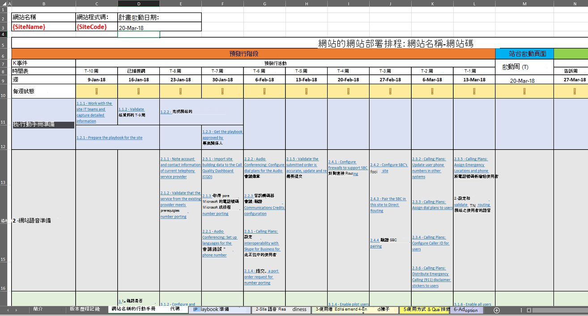
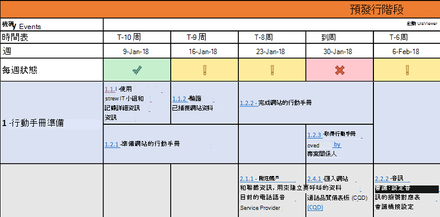

# 部署我的服務

本文概述正確部署雲端語音服務的需求。 遵循部署雲端語音服務的規定性指引，您可以確定您成功符合所有需求，並交付可重複的結果。

## 適用于語音工作負載的網站啟用Microsoft Teams手冊

使用此手冊可協助貴組織成功規劃並執行Microsoft Teams以網站為基礎推出語音功能。

包含所有必要的活動、建議的時程表，以及每個活動對應指南的連結，本手冊涵蓋端對端指南，可協助確保為一個給定網站成功部署 Teams 語音，並著重于使用者重要的因素。

貴組織可以完成此遊戲手冊中的活動：

-   有效規劃並排程您的Teams推出。

-   加速並優化使用者採用。

-   減少支援需求，提高使用者滿意度。

> [!NOTE]
> 本文和相關遊戲手冊並非用來描述服務啟用或提供撥號音至特定網站所需的每一個技術組組步驟。 相反地，他們專注于建議使用者輕鬆上電的活動和工作，並讓他們透過快速且順暢的轉換，以高採用率Teams開始耗用 Teams 語音工作負載，同時將支援需求最小化。 有關如何最佳設定 Teams 語音環境的技術指南，請參閱設定[Teams](onboarding-checklist-configure-cloud-voice-workloads-in-Microsoft-Teams.md)語音工作負載、在[Teams](onboarding-checklist-configure-direct-routing-in-Microsoft-Teams.md)中設定直接路由[、Teams](onboarding-checklist-configure-microsoft-teams-core-capabilities.md)核心功能、Teams 的網路，以及啟用 Microsoft 365 或[Office 365](onboarding-checklist-enable-office-365.md)的上線檢查清單。

<!--ENDOFSECTION-->

## Playbook 焦點區域

遊戲手冊的焦點是解決影響使用者對語音部署Teams的因素。 活動和工作會分組到下列焦點區域：

-   服務就緒性驗證
    - 音訊會議
    - 通話方案
    - 直接路由

-   使用者啟用

-   端點

-   使用和品質

-   採用

Voice[和 Playbook](https://github.com/MicrosoftDocs/OfficeDocs-SkypeForBusiness/blob/live/Teams/downloads/site-enablement-playbook-for-voice-(playbook).xlsx?raw=true) (網站啟用) 是一Microsoft Excel。 這五個焦點區域都是活頁簿中的個別工作表，且每個部署任務和活動會分組到其中一個工作表上。

> [!NOTE]
> 您將針對您的部署範圍中的每個網站，建立另一個Teams實例。

<!--ENDOFSECTION-->

## 如何使用遊戲手冊

無論位置大小與複雜度如何，啟用每個網站都需要您及早規劃工作與活動，並在實際服務推出之前、期間及之後以最佳循序執行。 我們建議您在規劃並執行自己的語音體驗時，遵循Microsoft Teams步驟。

1. 下載適用于 Voice 的 Voice ([Playbook) 工具Microsoft Teams](https://github.com/MicrosoftDocs/OfficeDocs-SkypeForBusiness/blob/live/Teams/downloads/site-enablement-playbook-for-voice-(playbook).xlsx?raw=true)手冊。

2. 為每個網站建立另一份遊戲手冊。

3. 在 **{SiteName-Code}** 的名為 Playbook 的工作表的 Tab 上，將 **{SiteName-Code}** 取代為相關的網站名稱和/或網站代碼。

4. 輸入 **網站名稱、網站代碼** 和 **計畫啟動日期**，如下圖所示。 這是一個至關重要的步驟，因為它會調整手冊中每個活動的建議期限。

   

5. 在流覽時程表時，檢查每個活動、採取必要動作並更新狀態。 狀態以圖形表示，如下所述：
  
   -  **) ：** 活動已經完成，或不適用於此網站，因此不需要執行其他動作。</li>
   -  <strong>) ：</strong> 活動尚未完成，且必須在排程上更新為是或否。</li>
   -  <strong></strong>狀態會議。</li></ul>

6. 狀態會在每個區段內匯總，且節標題的格式會以其中一個狀態指示器的格式。 **每週狀態** 也會自動更新。

> [!TIP]
> 針對您擁有的所有位置重複上述步驟。

> [!IMPORTANT]
> 某些步驟可能不適用於所有位置和網站。 如果特定活動與網站不相關，您必須選取 **不適用** 此活動。 **請勿刪除** 遊戲手冊中任何列;如果您這麼做，狀態匯總公式將無法工作。  
請注意可能需要超過您計畫時間的活動，例如數位移植和採購活動。 這些活動可能會對網站部署時程表造成負面影響。 請務必每週檢查並更新活動清單和相關時程表，並出席指導性委員會會議，以確保專案關係人瞭解每個網站的狀態，以及任何可能的部署排程偏差。

<table>
<tr><td>  決策點</td><td><ul><li>決定是否需要網站啟用 Playbook 才能進行部署。</li><li>決定誰將負責針對您部署的每一個網站Microsoft Teams網站啟用 Playbook 進行自訂。</li></ul></td></tr>
<tr><td> 後續步驟</td><td><ul><li><a href="https://github.com/MicrosoftDocs/OfficeDocs-SkypeForBusiness/blob/live/Teams/downloads/site-enablement-playbook-for-voice-(playbook).xlsx?raw=true" data-raw-source="[Download the Site Enablement Playbook](https://github.com/MicrosoftDocs/OfficeDocs-SkypeForBusiness/blob/live/Teams/downloads/site-enablement-playbook-for-voice-(playbook).xlsx?raw=true)">下載網站啟用手冊</a>。</li><li>自訂第一個網站的網站啟用手冊。</li><li>如果需要，請針對其他網站重複上述步驟。</li></ul></td></tr>
</table>

<!--ENDOFSECTION-->